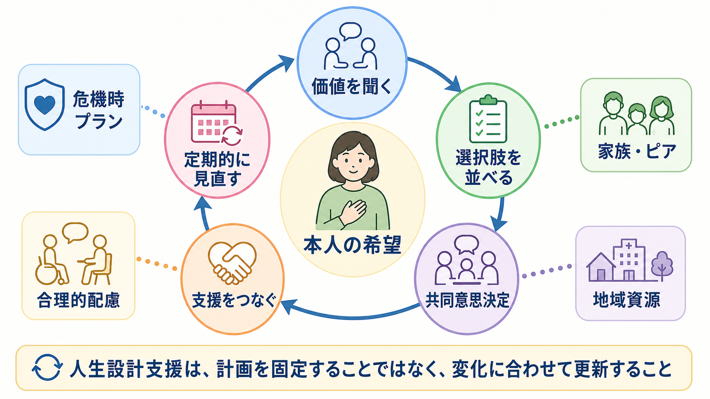
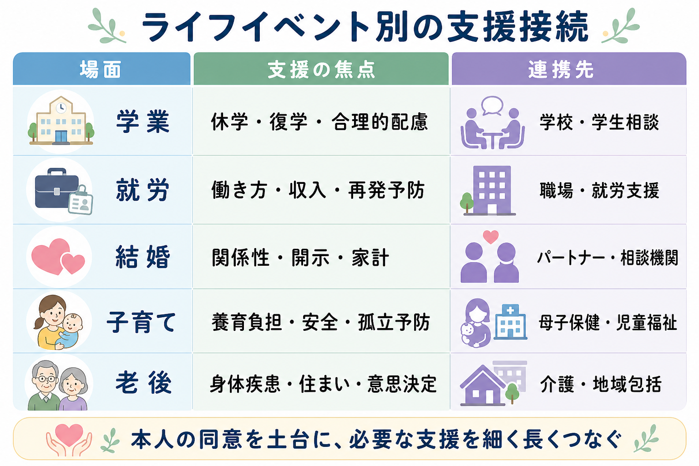

# 精神疾患を持つ人の人生設計支援とは何か

## 要点

- 人生設計支援とは、症状を減らす支援だけでなく、本人が望む学び、働き方、関係性、子育て、住まい、老後を長期にわたって組み立てる支援である。
- 中核は「本人の希望を聞く」「選択肢を見える化する」「共同意思決定で選ぶ」「医療・福祉・教育・就労・家族支援をつなぐ」「定期的に見直す」という循環である。
- 支援者は、本人の人生を代わりに決めるのではなく、病状の波、制度、差別、経済的不安、家族役割の負担を見積もり、選択可能性を広げる。
- 教育・研究目的の整理であり、個別の診断、治療、進路決定を指示するものではない。

## この記事で答える問い

この記事では、[[ライフスパン精神医学とは何か]]の視点から、精神疾患を持つ人の「人生設計支援」を扱う。問いは三つである。

1. 精神疾患を持つ人にとって、人生設計支援は通常の治療計画と何が違うのか。
2. 学業、就労、結婚、子育て、老後を見据えると、どのような支援の組み合わせが必要になるのか。
3. 支援者は、本人の自己決定と安全・再発予防をどのように両立させるのか。

## まず結論

精神疾患を持つ人の人生設計支援とは、病名や症状から人生の限界を予測する作業ではない。むしろ、本人が大事にしたい生活の方向を言語化し、その方向に向かうための環境調整、合理的配慮、制度利用、危機時プラン、家族・ピア・地域資源との接続を、長い時間軸で更新していく実践である。

WHOの包括的メンタルヘルス行動計画は、地域に根ざした統合的な精神保健・社会的ケア、身体医療との連携、教育・就労・住まい・生計支援との接続を重視している[1]。WHOの地域精神保健サービスのガイダンスも、本人中心、権利ベース、地域生活支援、ピアサポート、住まい、アウトリーチを組み合わせる方向を示している[2]。日本でも「精神障害にも対応した地域包括ケアシステム」は、医療、障害福祉・介護、住まい、社会参加、地域の助け合い、教育を包括的に確保することを目指している[3]。

したがって人生設計支援は、外来診療だけでも、福祉サービスだけでも、家族の努力だけでも完結しない。医療的安定と生活上の役割を同時に扱う、横断的な支援である。

## 背景

精神疾患は、症状そのものだけでなく、学校への出席、職場での継続、親密な関係、妊娠・出産・子育て、家計、住まい、身体疾患の管理、老後の意思決定に影響する。特に[[大学生のメンタルヘルス問題には何があるのか]]、[[青年期のひきこもりはどう理解するのか]]、[[神経発達症とは何か]]、[[老年精神医学とは何か]]のような領域では、精神症状と生活課題が切り離しにくい。

リカバリー概念では、回復は単なる症状消失ではなく、健康、安定した住まい、意味ある活動、支えとなる関係を含む生活の再構築として理解される。WHOの行動計画と地域精神保健ガイダンスは、教育、就労、住まい、身体健康、地域参加を精神保健サービスの外側に置かず、支援計画の中に組み込むことを求めている[1][2]。これは、人生設計支援が「治療を受け続けること」だけでなく、「どこで、誰と、何をして暮らすか」を扱う必要があることを示している。

また、重い精神疾患を持つ人では身体疾患、生活習慣病、孤立、貧困、スティグマが重なりやすい。WHOの世界メンタルヘルス報告は、重い精神疾患を持つ人が一般人口より平均10から20年早く死亡することが多く、その多くが予防可能な身体疾患に関連すると報告している[4]。人生設計支援に老後、身体医療、介護、意思決定支援を含める理由はここにある。

## 基本概念

### 治療計画と人生設計支援の違い

治療計画は、診断、症状、薬物療法、心理療法、再発予防、危機対応を中心に組み立てる。一方、人生設計支援は、それらを含みながら、本人の生活上の目標を起点にする。

たとえば「症状を安定させる」は治療計画の目標になりやすい。しかし人生設計支援では、「大学に戻りたい」「週3日から働きたい」「結婚について相手と話したい」「子どもに病気のことをどう説明するか考えたい」「親亡き後の住まいを準備したい」といった具体的な生活課題に翻訳する。

### リカバリー志向

リカバリー志向の支援では、本人が自分の人生目標を定義し、その目標に近づく資源を選べることを重視する[1][2]。これは「本人にすべて任せる」という意味ではない。症状悪化時の判断低下、生活リズムの乱れ、経済的不安、家族負担、差別や制度の壁を現実的に見積もり、本人の希望が実行可能な形になるよう足場を作る。

### 共同意思決定

共同意思決定は、本人と支援者がそれぞれの専門性を持ち寄り、選択肢、利益、不利益、本人の価値を共有して決める方法である。精神保健領域のCochraneレビューでは、共同意思決定介入は本人の意思決定参加感を高める可能性がある一方、症状や再入院など長期アウトカムへの効果はまだ不確実で、研究の蓄積が必要とされる[5]。この不確実性を踏まえると、共同意思決定は「万能の治療技法」ではなく、権利と実用性を両立させる臨床態度として位置づけるのがよい。

## 仕組み

人生設計支援は、次の循環として設計できる。

1. **価値と希望を聞く**  
   何を避けたいかだけでなく、どんな暮らしなら意味があるかを聞く。本人が言葉にしにくい場合は、過去に大切にしていた活動、安心できる人間関係、苦手な環境、将来の不安から手がかりを得る。

2. **生活課題を分解する**  
   「働きたい」を、勤務時間、通勤、職場への開示、収入、服薬・睡眠、再発時の連絡先、合理的配慮に分ける。「子育てが不安」を、養育負担、家事、子どもへの説明、緊急時の預け先、母子保健・児童福祉との連携に分ける。

3. **選択肢を並べる**  
   選択肢は一つにしない。たとえば復学なら、即時復学、段階的復学、休学延長、履修数調整、オンライン科目、学生相談との併用などを比較する。

4. **支援をつなぐ**  
   医療者、相談支援専門員、精神保健福祉士、学校、職場、家族、ピアサポーター、行政窓口、地域包括支援センターなどを、本人の同意を土台に接続する。

5. **定期的に見直す**  
   精神疾患の経過、発達段階、家族構成、身体疾患、制度、本人の価値観は変化する。人生設計支援は、固定された人生計画ではなく、更新される生活仮説である。

## ライフイベント別の支援

### 学業

学業支援では、学力だけでなく、睡眠、通学、対人関係、課題提出、試験、休学・復学のタイミングを扱う。精神疾患を持つ学生へのSupported Educationの系統的レビューでは、研究数は限られるものの、教育達成、GPA、学生役割への安心感などに肯定的影響が示唆されている[6]。[[不登校は精神医学的にどう理解するのか]]や[[児童青年期のうつ病はどう現れるのか]]と連続する課題として、早期から「診断名」ではなく「学習環境との相性」を評価することが重要である。

### 就労

就労支援では、症状が完全に消えてから働くという段階論だけでは機会を逃すことがある。IPSを含む援助付き雇用のメタ解析では、重い精神疾患を持つ人において、IPSは従来型の職業リハビリテーションより競争的雇用につながりやすいと報告されている[7]。ただし、就労の成功は就職の有無だけで測れない。勤務継続、疲労、再発予防、収入と福祉制度の調整、職場での合理的配慮、働かない期間の意味づけも支援対象になる。

### 結婚・パートナーシップ

結婚やパートナーシップでは、診断名の開示、服薬、妊娠可能性、家計、親族関係、危機時の役割分担が問題になりやすい。支援者は「病気があるから結婚は難しい」と決めつけるのではなく、本人と相手が何を知り、何を話し合い、どの支援につながると安心できるかを整理する。必要に応じて、カップル面接、家族面接、心理教育、危機時プランを検討する。

### 子育て

精神疾患を持つ親への支援では、親としての力を過小評価しないことと、子どもの安全・安心を軽視しないことの両方が必要である。重い精神疾患を持つ親の経験を扱った系統的レビューは、親役割の困難、子どもへの影響、支援関係から距離が生じること、包括的で思いやりのある支援体制の必要性を指摘している[8]。[[産後うつ病は母子関係にどう影響するのか]]、[[父親の産後メンタルヘルスとは何か]]、[[乳幼児精神医学とは何か]]とも接続する領域である。

### 老後

老後の支援では、症状だけでなく、身体疾患、認知機能、住まい、介護、金銭管理、意思決定支援、孤立、喪失体験を扱う。[[老年期うつ病は若年成人のうつ病と何が違うのか]]や[[高齢者の不安症はどう現れるのか]]のように、精神症状は身体疾患や生活機能の低下と絡み合う。本人の判断能力が変動する可能性を前提に、早い段階から希望する医療、住まい、支援者、緊急連絡先を記録しておく。

## 臨床・研究との接続

臨床では、人生設計支援を単独の面接技法としてではなく、ケアマネジメント、心理教育、リハビリテーション、身体医療、家族支援、ピアサポート、福祉制度利用の統合として扱う。支援の焦点は、診断名から一方向に決まるのではなく、本人の価値、生活課題、利用可能な資源、支援関係の質によって変わる。

研究では、単に症状尺度や再入院率だけでなく、学業継続、就労継続、生活満足度、社会参加、親役割、身体健康、住まいの安定、意思決定参加感をアウトカムとして測る必要がある。人生設計支援の難しさは、アウトカムが個別的で長期的である点にある。本人にとっての成功が、支援者や制度にとっての成功と一致しない場合もある。

## よくある誤解

### 誤解1: 人生設計支援は「将来を早く決めさせる」こと

人生設計支援は、進路や結婚や老後を急いで決めることではない。むしろ、決められない時期を含めて、選択肢を狭めすぎないようにする支援である。

### 誤解2: 安定するまで学業や仕事は考えない方がよい

急性期には休息や安全確保が優先される。しかし長期的には、学びや仕事の希望を扱わないこと自体が、孤立や自己効力感の低下につながることがある。支援は「今すぐ実行するか」だけでなく、「将来の選択肢をどう残すか」を含む。

### 誤解3: 家族が支えれば十分である

家族は重要な資源だが、家族だけに支援を集中させると、疲弊、過干渉、孤立、関係悪化が起こりうる。本人の同意を前提に、家族、ピア、地域、制度を分散してつなぐ必要がある。

### 誤解4: 支援者は本人の希望をそのまま肯定すればよい

希望を尊重することと、リスクを見立てないことは違う。支援者は、本人の希望を出発点にしながら、睡眠不足、薬の副作用、対人ストレス、経済的負担、子どもの安全、身体疾患などの現実条件を一緒に検討する。

## 関連ノート

- [[ライフスパン精神医学とは何か]]
- [[大学生のメンタルヘルス問題には何があるのか]]
- [[青年期のひきこもりはどう理解するのか]]
- [[神経発達症とは何か]]
- [[産後うつ病は母子関係にどう影響するのか]]
- [[父親の産後メンタルヘルスとは何か]]
- [[老年精神医学とは何か]]
- [[老年期うつ病は若年成人のうつ病と何が違うのか]]

## MOC更新候補

- `content/00_MOC/` 配下に精神医学、ライフスパン、地域精神医療、リカバリー関連のMOCがある場合、本記事を追加候補とする。
- 並列ジョブとの競合を避けるため、本タスクではMOCファイルを直接更新しない。

## 理解チェック

1. 人生設計支援が「治療計画」だけでは足りない理由は何か。
2. 学業、就労、子育て、老後の支援で共通して必要な視点は何か。
3. 本人の希望を尊重しながら、危機時の安全を確保するには何を事前に決めておくとよいか。
4. 人生設計支援のアウトカムを研究する場合、症状尺度以外にどのような指標が必要か。

## 未解決問題

- 共同意思決定や人生設計支援が、長期的な生活機能、就労継続、家族機能、身体健康、再入院にどの程度影響するかは、まだ十分に確立していない。
- 支援者が本人の希望を尊重しつつ、子どもの安全、金銭管理、老後の意思決定など高リスク領域をどう扱うかについて、実践知と研究知の橋渡しが必要である。
- 日本の地域包括ケア、障害福祉、教育、就労支援、母子保健、介護を横断した評価指標は、今後さらに整理が必要である。

## 参考文献

[1] World Health Organization. (2021). *Comprehensive Mental Health Action Plan 2013-2030*. https://www.who.int/publications/i/item/9789240031029

[2] World Health Organization. (2021). *Guidance on community mental health services: Promoting person-centred and rights-based approaches*. https://www.who.int/publications/i/item/9789240025707

[3] 厚生労働省. 精神障害にも対応した地域包括ケアシステムの構築について. https://www.mhlw.go.jp/stf/seisakunitsuite/bunya/chiikihoukatsu.html

[4] World Health Organization. (2022). *World mental health report: Transforming mental health for all*. https://www.who.int/publications/i/item/9789240049338

[5] Aoki, Y., Yaju, Y., Utsumi, T., Sanyaolu, L., Storm, M., Takaesu, Y., Watanabe, K., Watanabe, N., Duncan, E., & Edwards, A. G. K. (2022). Shared decision-making interventions for people with mental health conditions. *Cochrane Database of Systematic Reviews*, 11, CD007297. https://doi.org/10.1002/14651858.CD007297.pub3

[6] Hofstra, J., van der Velde, J., Farkas, M., Korevaar, L., & Büttner, S. (2023). Supported education for students with psychiatric disabilities: A systematic review of effectiveness studies from 2009 to 2021. *Psychiatric Rehabilitation Journal*, 46(3), 173-184. https://doi.org/10.1037/prj0000528

[7] Modini, M., Tan, L., Brinchmann, B., Wang, M. J., Killackey, E., Glozier, N., Mykletun, A., & Harvey, S. B. (2016). Supported employment for people with severe mental illness: Systematic review and meta-analysis of the international evidence. *The British Journal of Psychiatry*, 209(1), 14-22. https://doi.org/10.1192/bjp.bp.115.165092

[8] Harries, C. I., Smith, D. M., Gregg, L., & Wittkowski, A. (2023). Parenting and Serious Mental Illness (SMI): A systematic review and metasynthesis. *Clinical Child and Family Psychology Review*, 26, 303-342. https://doi.org/10.1007/s10567-023-00427-6
