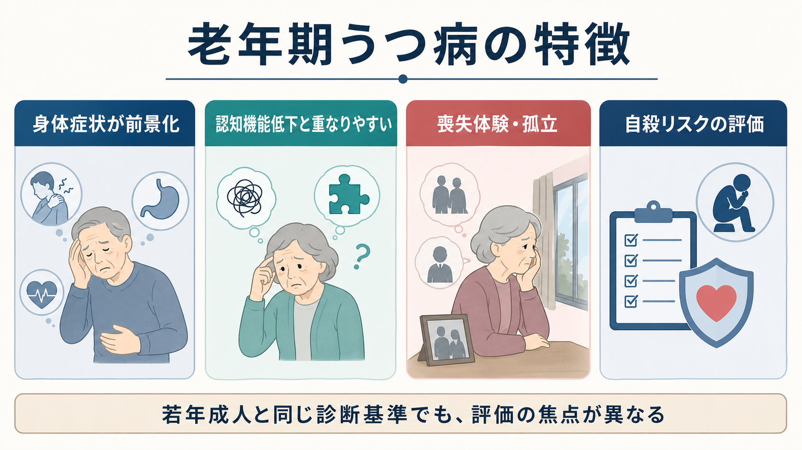
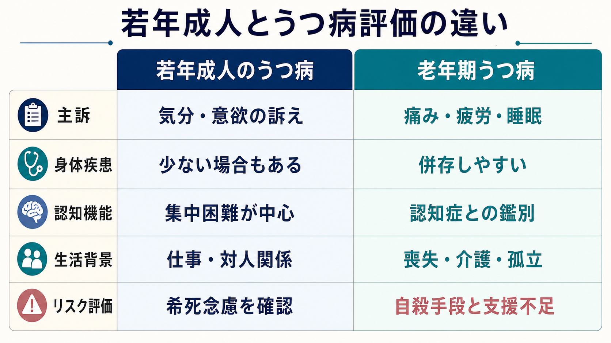
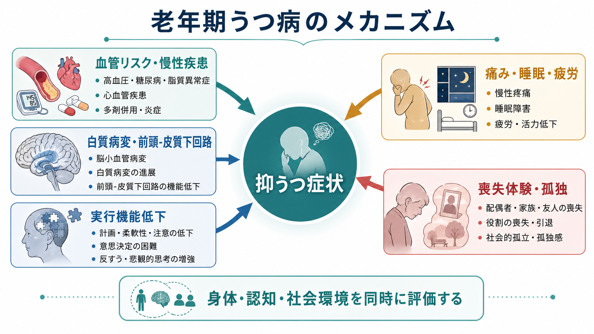

# 老年期うつ病は若年成人のうつ病と何が違うのか

## 要点

- 老年期うつ病は、[[うつ病とは何か|うつ病]]の診断基準そのものが別物になるわけではない。しかし、気分の訴えよりも、痛み、疲労、睡眠、食欲、活動量低下などの身体症状や生活機能低下として見えやすい[1][2]。
- 若年成人では仕事、対人関係、自己評価、将来不安が前景化しやすいのに対し、老年期では慢性疾患、服薬、疼痛、感覚機能低下、介護、退職、死別、孤立が症状の背景に入りやすい[2][7]。
- 老年期うつ病では、注意、処理速度、実行機能、記憶の訴えが目立ち、[[うつ病と認知症はどう鑑別するのか|認知症との鑑別]]や併存評価が重要になる[3][4]。
- 血管リスクや白質病変、前頭-皮質下回路の機能低下は、一部の老年期うつ病を理解する重要な枠組みである。ただし、すべてを「血管性」と説明できるわけではない[5][6]。
- 高齢者では自殺死亡の致死性が高く、抑うつの重症度、孤立、疼痛、睡眠、過去の自殺企図、支援不足を丁寧に評価する必要がある[2][8]。

## この記事で答える問い

1. 老年期うつ病は、若年成人の[[大うつ病性障害とは何か|大うつ病性障害]]と何が違って見えるのか。
2. 身体症状、認知機能低下、喪失体験、自殺リスクは、どのように評価を変えるのか。
3. 「高齢だから落ち込むのは自然」と片づけず、研究・臨床で何を見落とさないようにするべきか。

## まず結論

老年期うつ病の違いは、「別の病名」というより、**同じ抑うつ症候群が、老化、身体疾患、認知機能、社会的喪失の文脈の中で別の姿をとる**点にある。若年成人のうつ病では、抑うつ気分、興味の低下、自己評価の低下、学業・仕事・対人関係の障害が比較的そのまま訴えられやすい。一方、老年期では「気分が落ち込む」よりも、「体がつらい」「眠れない」「食べられない」「物忘れが増えた」「外出しなくなった」「病院通いが増えた」として現れることがある[1][3]。

そのため、老年期うつ病の評価では、精神症状だけでなく、身体疾患、薬剤、疼痛、睡眠、栄養、認知機能、ADL/IADL、死別や孤立、自殺手段へのアクセスを同時に見る。これは個別診断や治療指示ではなく、教育・研究目的の整理である。

## 背景

NICE の成人うつ病ガイドラインは、うつ病を、喜びや関心の低下、抑うつ気分に加えて、認知、身体、行動の症状を伴う幅広い状態として整理している[1]。この基本は若年成人にも高齢者にも共通する。ただし、WHO は高齢者のメンタルヘルスについて、慢性疾患、機能低下、認知症、孤独、社会的孤立、介護負担、死別、退職、貧困、虐待などが重なりやすく、精神疾患が過小認識・過小治療されやすいと強調している[2]。

若年成人のうつ病では、主な問題が「本人の内的気分」「学業・仕事」「対人関係」に集まりやすい。もちろん身体症状や自殺リスクも重要だが、身体疾患や認知症との鑑別が最初から中心課題になるとは限らない。老年期では逆に、抑うつが身体疾患や認知低下に隠れたり、身体疾患の結果として見えたり、認知症の前駆症状や併存症状として現れたりする[3][4]。

## 基本概念

### 老年期うつ病

[[老年期うつ病とは何か|老年期うつ病]]は、一般に高齢期にみられるうつ病エピソードを指す臨床・研究上の概念である。初発年齢によって、若い頃から再発している早発型と、老年期に初めて目立つ遅発型に分けて論じられることがある。遅発型では、家族歴が相対的に少なく、脳血管リスク、認知機能低下、身体疾患、機能障害と結びついて検討されることが多い[3][5]。

### 若年成人のうつ病との違い

若年成人のうつ病では、気分、意欲、興味、自己評価、罪責感、将来への絶望、仕事や学業の遂行困難が中心に語られやすい。老年期では同じ抑うつでも、本人の表現が「悲しい」ではなく「疲れやすい」「眠れない」「胃腸が悪い」「何もする気が起きない」「頭が働かない」に置き換わりやすい[3][4]。

| 観点 | 若年成人で目立ちやすい形 | 老年期で目立ちやすい形 |
|---|---|---|
| 主訴 | 抑うつ気分、意欲低下、仕事・対人関係の不調 | 疼痛、疲労、睡眠障害、食欲低下、活動量低下 |
| 身体疾患 | 併存することはあるが中心課題とは限らない | 慢性疾患、服薬、疼痛、フレイルと重なりやすい |
| 認知機能 | 集中困難、考えがまとまらない | 処理速度、実行機能、記憶の訴え、認知症との鑑別 |
| 生活背景 | 仕事、学業、恋愛、家族形成 | 退職、配偶者との死別、介護、孤立、役割喪失 |
| リスク評価 | 希死念慮、衝動性、物質使用など | 自殺手段、身体疾患、疼痛、独居、支援不足も重視 |

## 仕組み

### 1. 身体症状が前景化しやすい

老年期うつ病では、気分の落ち込みよりも、痛み、倦怠感、食欲低下、体重減少、便秘、睡眠障害、めまい、息切れ、活動量低下として現れることがある。これは「心理的な問題が身体に置き換わっている」という単純な話ではない。慢性疼痛、心血管疾患、糖尿病、脳血管障害、神経変性疾患、薬剤性の眠気や食欲変化が、抑うつと双方向に影響するからである[2][3]。

したがって、[[身体疾患に伴う抑うつ症状とは何か|身体疾患に伴う抑うつ症状]]を考えるときは、身体疾患があるから精神症状ではない、あるいは精神症状だから身体評価はいらない、という二分法を避ける。身体症状、抑うつ症状、生活機能の低下を同じ時間軸で見ることが重要である。

### 2. 認知機能低下と重なりやすい

老年期うつ病では、注意、処理速度、実行機能、記憶の困難が前景化することがある[4]。本人は「物忘れが増えた」と訴え、家族は「認知症ではないか」と心配する。実際には、うつ病による認知機能低下、認知症に伴う抑うつ、両者の併存、将来の認知症リスクを高める状態が混在しうる[3][4]。

ここで重要なのは、短時間の認知スクリーニングの点数だけで決めないことである。発症時期、経過、日内変動、本人の苦痛、家族から見た変化、ADL/IADL、薬剤、睡眠、せん妄、感覚障害を合わせて見る必要がある。[[認知症とは何か|認知症]]との鑑別は、うつ病を除外する作業ではなく、うつ病と認知症がどの程度重なっているかを見積もる作業である。

### 3. 血管リスクと前頭-皮質下回路

老年期うつ病の一部は、血管リスクや白質病変、前頭-皮質下回路の機能低下と関連して説明される。いわゆる血管性うつ病仮説では、脳小血管病変や白質病変が、気分調節、認知制御、実行機能に関わるネットワークを障害し、抑うつ、精神運動制止、治療反応性の低下、機能障害につながる可能性が検討されてきた[5][6]。

ただし、この枠組みはすべての老年期うつ病を血管病変に還元するものではない。臨床的には、血管リスク、慢性疾患、炎症、睡眠、疼痛、認知制御、社会的孤立が相互に増幅する、複数要因モデルとして理解する方が実用的である。

### 4. 喪失体験と孤立が症状を形づくる

老年期には、退職、配偶者や友人との死別、身体機能の低下、運転免許の返納、介護される側への変化、住み慣れた場所からの移動など、役割と関係性の喪失が重なりやすい。[[喪失反応と大うつ病はどう違うのか|喪失反応]]は自然な悲嘆として理解される面を持つが、持続する興味の喪失、強い自己否定、生活機能の低下、希死念慮がある場合は、うつ病としての評価が必要になる[2][7]。

National Academies の報告は、社会的孤立と孤独が高齢者の健康と生活の質に大きく関わり、独居、家族・友人の喪失、慢性疾患、感覚障害が孤立を悪化させうると整理している[7]。これは単に「寂しいから落ち込む」という話ではない。外出、運動、服薬管理、受診継続、食事、睡眠、助けを求める行動のすべてに影響する。

### 5. 自殺リスクは「念慮の有無」だけでは不十分

[[自殺リスク評価では何を聞くべきか|自殺リスク評価]]では、希死念慮や自殺念慮だけでなく、計画性、手段へのアクセス、過去の企図、飲酒、疼痛、睡眠障害、絶望感、独居、支援者の不在、医療・介護との接点を確認する。老年期うつ病における自殺行動の系統的レビューでは、抑うつの重症度、自殺念慮、過去の企図、身体的・認知的要因、睡眠やアルコール関連要因などがリスクとして整理されている[8]。

高齢者では、助けを求めるサインが控えめだったり、身体疾患や喪失体験の説明に吸収されてしまったりする。したがって、「死にたいと言っていないから安全」と判断するのではなく、生活機能の急な低下、受診中断、食事・服薬の放棄、身辺整理、孤立の深まりを含めて評価する。

## 図解

上の 3 枚の図は、次の読み方を想定している。

1. 1枚目は、老年期うつ病で前景化しやすい身体症状、認知機能、喪失体験、自殺リスクを概観する。
2. 2枚目は、血管リスク、白質病変、実行機能低下、疼痛・睡眠、喪失体験が抑うつ症状に収束する複数要因モデルを示す。
3. 3枚目は、若年成人とうつ病評価の違いを、主訴、身体疾患、認知機能、生活背景、リスク評価の軸で比較する。

図は理解補助であり、個別症例の診断や治療方針を決めるものではない。

## 臨床・研究との接続

臨床評価では、まず通常のうつ病評価を省略しない。抑うつ気分、興味・喜びの低下、睡眠、食欲、疲労、集中、罪責感、精神運動変化、希死念慮を確認する。そのうえで、老年期では次を追加して評価する。

- 慢性疾患、疼痛、フレイル、転倒、感覚障害、栄養状態
- 服薬変更、多剤併用、アルコール、睡眠薬、抗コリン作用のある薬剤
- 認知機能、処理速度、実行機能、ADL/IADL、金銭管理や服薬管理
- 死別、退職、介護負担、独居、社会的孤立、虐待や経済的不安
- 希死念慮、自殺念慮、手段へのアクセス、支援者、緊急時の連絡経路

研究では、老年期うつ病を単一のカテゴリーとして扱うだけでは限界がある。早発型と遅発型、血管リスクの有無、認知機能低下の有無、身体疾患の重症度、孤立や喪失体験の程度によって、病態も経過も治療反応も異なる可能性がある[5][6]。[[ライフスパン精神医学とは何か|ライフスパン精神医学]]の観点では、若年期からの再発性うつ病と、老年期に初めて目立つうつ病を同じ時間軸で比較することが重要になる。

## よくある誤解

### 誤解1: 高齢者が落ち込むのは自然な老化である

老化に伴う喪失や身体機能低下は現実にある。しかし、持続する抑うつ、興味の喪失、生活機能低下、希死念慮を「年齢相応」と見なすと、治療可能なうつ病や支援可能な社会的困難を見落とす[2][3]。

### 誤解2: 身体症状が多いなら精神疾患ではない

老年期では、身体疾患とうつ病が互いに影響する。痛み、睡眠障害、疲労が抑うつを悪化させ、抑うつが活動量低下や受診・服薬の困難を通じて身体状態を悪化させることがある[3]。[[疼痛と精神疾患は脳内でどうつながるのか|疼痛と精神疾患]]の関係も、この文脈で重要である。

### 誤解3: 物忘れがあるなら認知症であり、うつ病ではない

うつ病でも認知機能低下は起こりうるし、認知症にうつ病が併存することもある。点数だけで二分せず、発症時期、経過、本人の苦痛、家族情報、生活機能、治療後の変化を見る必要がある[4]。

### 誤解4: 自殺リスクは「死にたい」と言うかどうかで分かる

高齢者では、希死念慮を直接語らない場合でも、身体疾患、疼痛、睡眠障害、孤立、支援不足、過去の企図が重なるとリスクは高まりうる[8]。[[精神疾患と自殺リスクはどう関係するのか|精神疾患と自殺リスク]]を考えるときは、発言だけでなく生活の変化を見る。

## 関連ノート

- [[老年期うつ病とは何か]]
- [[うつ病とは何か]]
- [[大うつ病性障害とは何か]]
- [[うつ病と認知症はどう鑑別するのか]]
- [[認知症とは何か]]
- [[身体疾患に伴う抑うつ症状とは何か]]
- [[喪失反応と大うつ病はどう違うのか]]
- [[自殺リスク評価では何を聞くべきか]]
- [[精神疾患と自殺リスクはどう関係するのか]]
- [[ライフスパン精神医学とは何か]]
- [[老年期の心理発達とは何か]]

## MOC更新候補

- `content/00_MOC/` 配下の精神医学、気分障害、老年精神医学、ライフスパン精神医学に関する MOC があれば、本記事へのリンク追加候補とする。
- 並列ジョブとの競合を避けるため、このタスクでは MOC 本体は更新しない。

## 理解チェック

1. 老年期うつ病で、気分の訴えよりも身体症状や生活機能低下が前景化しやすい理由は何か。
2. うつ病による認知機能低下と認知症を、点数だけでなく経過から見る必要があるのはなぜか。
3. 血管性うつ病仮説は、老年期うつ病のどの側面を説明し、どこに限界があるか。
4. 死別や退職などの喪失体験を、通常の悲嘆と大うつ病のどちらかに単純化しない方がよい理由は何か。
5. 高齢者の自殺リスク評価で、希死念慮の有無以外に確認すべき点は何か。

## 未解決問題

- 老年期うつ病に伴う認知機能低下のうち、どの部分が可逆的で、どの部分が将来の神経変性疾患リスクを示すのかは、個人差が大きい。
- 血管リスク、炎症、睡眠、疼痛、孤立がどの順序で抑うつを悪化させるのかは、縦断研究と介入研究の両方が必要である。
- 高齢者の自殺予防では、精神科治療だけでなく、身体医療、介護、地域支援、孤立対策をどう統合するかが実践上の課題である。

## 参考文献

[1] National Institute for Health and Care Excellence. (2022). *Depression in adults: treatment and management (NICE guideline NG222).* https://www.ncbi.nlm.nih.gov/books/NBK583074/

[2] World Health Organization. (2025). *Mental health of older adults.* https://www.who.int/en/news-room/fact-sheets/detail/mental-health-of-older-adults

[3] Lenze, E. J., & Reynolds, C. F. (2021). Late-life depression: The essentials and the essential distinctions. *Focus*, 19(3), 301-308. https://pmc.ncbi.nlm.nih.gov/articles/PMC8475940/

[4] Wilkins, C. H., Mathews, J., & Sheline, Y. I. (2009). Late life depression with cognitive impairment: Evaluation and treatment. *Clinical Interventions in Aging*, 4, 51-57. https://pmc.ncbi.nlm.nih.gov/articles/PMC2685224/

[5] Alexopoulos, G. S., Meyers, B. S., Young, R. C., Campbell, S., Silbersweig, D., & Charlson, M. (1997). Vascular depression hypothesis. *Archives of General Psychiatry*, 54(10), 915-922. https://doi.org/10.1001/archpsyc.1997.01830220033006

[6] Alexopoulos, G. S. (2019). Mechanisms and treatment of late-life depression. *Translational Psychiatry*, 9, 188. https://pubmed.ncbi.nlm.nih.gov/31383842/

[7] National Academies of Sciences, Engineering, and Medicine. (2020). *Social Isolation and Loneliness in Older Adults: Opportunities for the Health Care System.* National Academies Press. https://doi.org/10.17226/25663

[8] Fernández-Rodrigues, V., Sanchez-Carro, Y., Lagunas, L. N., Rico-Uribe, L. A., Pemau, A., Diaz-Carracedo, P., Diaz-Marsa, M., Hervas, G., & de la Torre-Luque, A. (2022). Risk factors for suicidal behaviour in late-life depression: A systematic review. *World Journal of Psychiatry*, 12(1), 187-203. https://doi.org/10.5498/wjp.v12.i1.187
