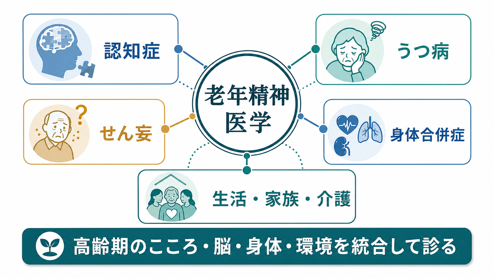
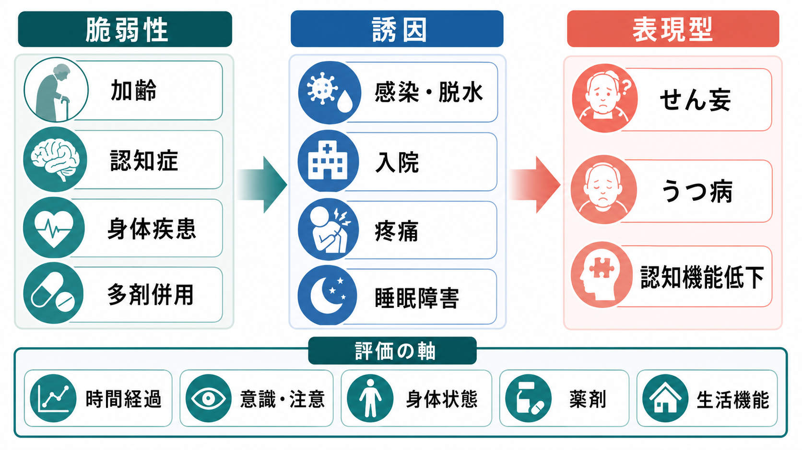

# 老年精神医学とは何か

## 要点

- 老年精神医学は、高齢期のこころの症状を、脳の加齢変化、身体疾患、薬剤、認知機能、生活機能、家族・介護環境の相互作用として診る精神医学の領域である[1][2]。
- 中心的な対象には、[[認知症とは何か|認知症]]、[[うつ病とは何か|うつ病]]、[[せん妄とは何か|せん妄]]、不安、睡眠障害、精神病症状、身体疾患に伴う精神症状、介護者支援が含まれる[1][2][3]。
- 高齢期では、症状名だけでなく「急性か慢性か」「意識・注意は保たれているか」「薬剤や身体疾患で説明できるか」「生活機能がどう変わったか」を同時に見る必要がある[4][5]。
- 認知症とうつ病、せん妄と認知症、薬剤性精神症状はしばしば重なり、単一診断で片づけると見落としが生じる[4][6]。
- 本記事は教育・研究目的の整理であり、個別の診断や治療指示ではない。

## この記事で答える問い

1. 老年精神医学は、通常の成人精神医学や老年医学と何が違うのか。
2. 高齢期の認知症・うつ病・せん妄・身体合併症は、なぜ一体として扱う必要があるのか。
3. 臨床や研究では、どのような評価軸をもつと見通しがよくなるのか。

## まず結論

老年精神医学とは、高齢者の精神症状を「こころだけの問題」としても、「脳だけの病気」としても扱わず、[[精神医学とは何か|精神医学]]、神経認知、身体医学、薬理、リハビリテーション、介護、家族支援を統合する領域である。AAGP は老年精神医学を、高齢者の情緒的・精神的障害の予防、評価、診断、治療に焦点を当てる専門領域として説明している[1]。

高齢期では、同じ「元気がない」「混乱している」「眠れない」という訴えでも、背景は大きく異なる。認知症の進行、うつ病、せん妄、疼痛、感染、脱水、薬剤、感覚障害、孤立、介護負担が重なりうる。したがって老年精神医学の基本は、診断名を急いで貼ることではなく、時間経過、意識・注意、認知機能、身体状態、薬剤、生活機能、本人の価値観を並べて読むことである[4][5]。

## 背景

世界的に人口高齢化が進み、WHO は2023年時点で60歳以上人口が11億人、2050年には21億人に近づくと推計している。70歳以上の約14%が何らかの精神障害を有し、孤独、社会的孤立、虐待、慢性疼痛、フレイル、認知症、身体疾患の併存が高齢期のメンタルヘルスを左右する[2]。

認知症は老年精神医学の中核テーマである。WHO は、2021年に世界で5700万人が認知症とともに生活し、毎年約1000万人の新規発症があると報告している。認知症は記憶や思考だけでなく、感情、行動、動機づけ、家族・介護者、社会経済的負担に広く影響する[3]。

一方で、老年精神医学は「認知症だけ」を扱う領域ではない。高齢者のうつ病は身体疾患、疼痛、機能低下、孤立、喪失体験と絡みやすく、慢性身体疾患がある人ではうつ病がより多く、機能予後や身体疾患の経過にも影響しうる[6]。また、せん妄は急性の注意・認知障害であり、感染、脱水、手術、入院、薬剤、睡眠障害などを契機に起こる。見逃すと転倒、入院長期化、機能低下、死亡リスクと関連するため、老年精神医学と一般身体診療の境界領域で特に重要である[4][5]。

## 基本概念

### 高齢期の精神症状は「多因子性」である

高齢期の精神症状は、単一の原因で説明できることもあるが、多くは複数の要因が重なる。たとえば認知症がある人が、尿路感染、脱水、睡眠不足、抗コリン作用のある薬剤、入院環境の変化を契機にせん妄を起こすことがある。あるいは、慢性疼痛と社会的孤立を背景にうつ病が生じ、集中困難や記憶低下が目立って認知症のように見えることもある。

このため、[[鑑別診断とは何か|鑑別診断]]では「どの疾患名が正しいか」だけでなく、「可逆的な要因は何か」「複数の病態が同時に存在していないか」「今すぐ安全に関わる問題は何か」を分ける。

### 時間経過が診断の入口になる

せん妄は時間から時間、日から日の急な変動が特徴で、注意障害と意識水準の変化を伴いやすい[4][5]。認知症は通常、月から年の単位で進行する。うつ病は数週間以上の気分・興味・意欲・睡眠・食欲・希死念慮・罪責感などのまとまりとして評価するが、高齢者では身体症状や不安、焦燥、認知機能低下が前景に出ることがある[6]。したがって、[[現病歴はどのように構造化するべきか|現病歴]]の時間軸は老年精神医学で特に重い。

### 認知症・うつ病・せん妄は重なって見える

認知症とうつ病、せん妄と認知症は互いに鑑別が必要であり、同時に併存もしうる。NICE の認知症ガイドラインは、認知症を疑う場合でも、せん妄、うつ病、感覚障害、抗コリン負荷を含む薬剤性の認知障害など、可逆的な原因を評価したうえで専門サービスにつなぐことを推奨している[5]。これは [[うつ病と認知症はどう鑑別するのか]]、[[せん妄と認知症はどう違うのか]] と直接つながる視点である。

### 生活機能と意思決定を評価する

老年精神医学では、症状の有無だけでなく、服薬、金銭管理、食事、排泄、移動、買い物、家事、対人交流、介護サービス利用などの生活機能を評価する。認知症やせん妄が疑われる場合には、本人の意思、理解、判断、表明の支援も重要になる。これは [[意思決定能力とは何か]]、[[共同意思決定とは何か]] の臨床応用である。

## 仕組み

老年精神医学の中心的な仕組みは、「脆弱性」と「誘因」と「表現型」の組み合わせとして整理できる。

### 1. 脆弱性

脆弱性とは、症状が出やすい土台である。加齢に伴う予備力低下、既存の認知症、脳血管障害、フレイル、慢性身体疾患、感覚障害、睡眠障害、アルコール使用、孤立、多剤併用などが含まれる。とくに高齢者では、[[薬剤性精神症状とは何か|薬剤性精神症状]]や抗コリン負荷が、認知機能低下、転倒、せん妄様症状に関わることがある[5][7]。

### 2. 誘因

誘因とは、症状を急に表面化させる出来事である。感染、脱水、便秘、疼痛、手術、入院、環境変化、睡眠不足、急な薬剤変更、身体拘束、感覚遮断などが代表的である。JAMA のレビューは、せん妄の予防と対応では、不動、機能低下、視覚・聴覚障害、脱水、睡眠不足など修正可能なリスクに働きかける多要素的な非薬物的介入が重要であるとまとめている[4]。

### 3. 表現型

表現型とは、臨床場面で見える症状のまとまりである。せん妄、うつ病、認知機能低下、不安、幻覚・妄想、易怒性、拒否、徘徊、睡眠覚醒リズムの乱れなどとして現れる。重要なのは、表現型が同じでも背景機序が異なることである。たとえば「幻視」はレビー小体型認知症、せん妄、薬剤、視覚障害、精神病性うつ病などで見られうる。

## 図解

| 図 | 役割 | 読み方 |
|---|---|---|
| 図1 | 老年精神医学の概念地図 | 認知症、うつ病、せん妄、身体合併症、生活・家族・介護を同じ評価面に置く。 |
| 図2 | 脆弱性・誘因・表現型モデル | 高齢期の精神症状を、もともとの脆弱性、急性誘因、現れている症状の三層で読む。 |

図を作らず文章で理解するなら、老年精神医学は「症状の名前」から始めるよりも、「時間経過」「身体状態」「薬剤」「注意・意識」「生活機能」「本人と家族の困りごと」を順に並べる領域だと考えるとよい。

## 臨床・研究との接続

### 臨床評価

初期評価では、本人の語りに加えて、家族・介護者・施設職員からの情報が重要になる。認知症の評価でも、NICE は本人と、可能であれば本人をよく知る人から、認知症状、行動・心理症状、日常生活への影響を聴取することを勧めている[5]。これは [[家族面接では何を評価するべきか]]、[[精神科初診で何を確認するべきか]] と接続する。

### 多職種連携

老年精神医学は、精神科医だけで完結しにくい。内科、神経内科、看護、薬剤師、心理職、作業療法士、理学療法士、ソーシャルワーカー、ケアマネジャー、介護職、家族が情報を持ち寄る必要がある。とくに認知症では、診断後のケア調整、介護者支援、本人の意思決定支援、併存症管理が継続課題になる[5]。これは [[精神科で多職種連携はなぜ重要なのか]] の典型例である。

### 身体合併症と薬剤

高齢期の精神症状では、[[身体合併症は精神科診療でなぜ重要なのか|身体合併症]]の評価を省略できない。心不全、呼吸器疾患、腎機能低下、糖尿病、甲状腺疾患、脳血管障害、感染症、疼痛、栄養障害、睡眠時無呼吸などは、気分、認知、活動性、睡眠に影響する。NICE のうつ病と慢性身体疾患のガイドラインも、うつ病の評価では症状数だけでなく機能障害、身体疾患、服薬、対人関係、生活環境を含めた包括的評価を求めている[6]。

### 研究

研究では、認知症、うつ病、せん妄、フレイル、ポリファーマシー、孤立、介護負担を別々の箱に分けすぎると、現実の重なりを捉えにくい。縦断研究、電子カルテ研究、介護データ、神経心理検査、脳画像、薬剤情報、生活機能指標、介護者アウトカムを組み合わせる設計が重要になる。単一疾患モデルではなく、複数病態と生活環境の相互作用を扱う点で、老年精神医学は [[ライフスパン精神医学とは何か|ライフスパン精神医学]] の後半部を担う。

## よくある誤解

### 誤解1：老年精神医学は認知症だけを扱う

認知症は重要な中核テーマだが、老年精神医学はうつ病、せん妄、不安、睡眠障害、精神病症状、喪失、虐待、孤立、身体疾患、薬剤、介護者支援まで含む。認知症の人にも、せん妄、うつ病、疼痛、不安、薬剤性症状が重なりうる。

### 誤解2：高齢だから物忘れや意欲低下は仕方がない

年齢はリスク因子だが、認知症は通常の加齢そのものではない[3]。また、うつ病、せん妄、薬剤、感覚障害、睡眠障害、身体疾患など、介入可能な要因が隠れていることがある。老年精神医学では「加齢のせい」と早く決めない。

### 誤解3：せん妄には鎮静薬を使えばよい

せん妄では安全確保が必要な場面もあるが、基本は原因検索、環境調整、睡眠、脱水、疼痛、感覚障害、不動、薬剤などへの多要素的な対応である。JAMA のレビューは、薬物療法の利益が害を上回りにくく、重度の興奮で安全上のリスクがある場合などに限定して考えるべきだと述べている[4]。

### 誤解4：家族や介護者は情報提供者にすぎない

家族や介護者は、本人の生活史、変化の時間経過、日常機能、価値観を知る重要な協働者である。同時に、介護負担や抑うつリスクを抱える当事者でもある。WHO と NICE は、認知症や高齢者メンタルヘルスにおいて介護者支援を明確に位置づけている[2][5]。

## 関連ノート

- [[精神医学とは何か]]
- [[ライフスパン精神医学とは何か]]
- [[認知症とは何か]]
- [[うつ病とは何か]]
- [[老年期うつ病とは何か]]
- [[せん妄とは何か]]
- [[うつ病と認知症はどう鑑別するのか]]
- [[せん妄と認知症はどう違うのか]]
- [[身体合併症は精神科診療でなぜ重要なのか]]
- [[薬剤性精神症状とは何か]]
- [[ミニ精神状態検査MMSEとは何か]]
- [[意思決定能力とは何か]]
- [[精神科で多職種連携はなぜ重要なのか]]

MOC更新候補: バッチ統合時に `content/00_MOC/MOC｜精神医学.md` の発達・ライフスパン領域、または老年精神医学関連の小見出しへ `[[老年精神医学とは何か]]` を追加する。

## 理解チェック

1. 老年精神医学で「時間経過」が重要なのはなぜか。
2. せん妄、認知症、うつ病を見分けるとき、意識・注意、気分、認知機能、生活機能のどこを見るか。
3. 高齢者の精神症状を評価するとき、薬剤と身体疾患を確認しないと何を見落とすか。
4. 家族・介護者支援は、なぜ本人の治療やケアの一部と考えられるのか。

## 参考文献

[1] American Association for Geriatric Psychiatry. About Geriatric Psychiatry. https://aagponline.org/families-caregivers/about-geriatric-psychiatry/

[2] World Health Organization. Mental health of older adults. 8 October 2025. https://www.who.int/en/news-room/fact-sheets/detail/mental-health-of-older-adults

[3] World Health Organization. Dementia. 31 March 2025. https://www.who.int/news-room/fact-sheets/detail/dementia

[4] Oh ES, Fong TG, Hshieh TT, Inouye SK. Delirium in Older Persons: Advances in Diagnosis and Treatment. *JAMA*. 2017;318(12):1161-1174. doi:10.1001/jama.2017.12067 https://pubmed.ncbi.nlm.nih.gov/28973626/

[5] National Institute for Health and Care Excellence. Dementia: assessment, management and support for people living with dementia and their carers. NICE guideline NG97. 2018; reviewed 2025. https://www.nice.org.uk/guidance/ng97/chapter/recommendations

[6] National Institute for Health and Care Excellence. Depression in adults with a chronic physical health problem: recognition and management. NICE guideline CG91. 2009; reviewed 2024. https://www.nice.org.uk/guidance/cg91

[7] Griffiths R, Lim S, Lin J, Bates A, Jones L, Ibrahim K. Deprescribing Anticholinergic Medications in Hospitalised Older Adults: A Systematic Review. *Basic Clin Pharmacol Toxicol*. 2025;137(4):e70103. doi:10.1111/bcpt.70103 https://pubmed.ncbi.nlm.nih.gov/40887761/

## 未解決問題

- 認知症、うつ病、せん妄、フレイルを同時に予測する臨床モデルを、どこまで個別化できるか。
- 抗コリン負荷やポリファーマシーを減らす介入が、認知機能、転倒、せん妄、生活機能を長期的にどこまで改善するか。
- 介護者支援、孤立対策、地域資源が、本人の精神症状と入院・施設入所リスクにどのように影響するか。
- 高齢者本人の意思決定支援と安全確保を、認知症・せん妄・身体疾患の併存下でどう両立するか。
