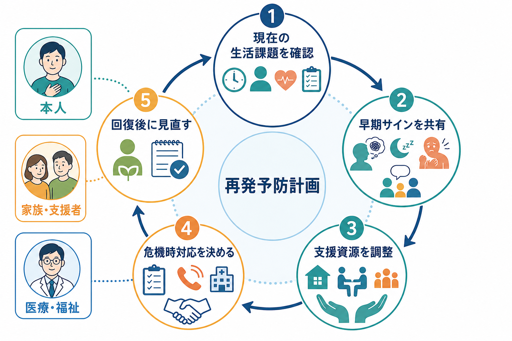
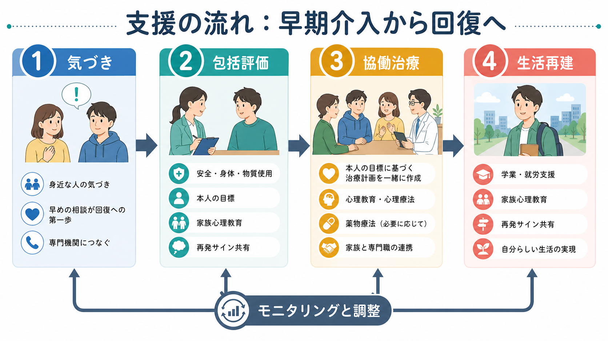
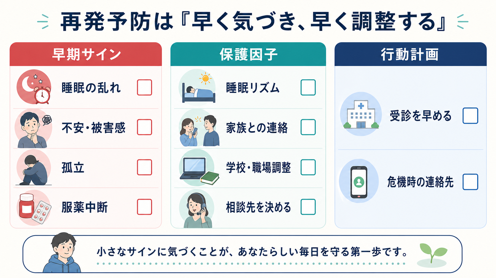

# 若年成人の初発精神病はどう支援するのか

## 要点

- 初発精神病の支援は、診断名を早く貼ることではなく、[[幻覚とは何か|幻覚]]、[[妄想とは何か|妄想]]、混乱、陰性症状、気分症状、物質使用、身体疾患、安全リスク、生活機能を同時に評価し、本人の回復目標に結び直す作業である。
- NICE は、初発または初回提示の精神病に対して、年齢や未治療期間にかかわらず早期介入サービスへアクセスできること、薬物・心理・社会・職業・教育的介入を含む包括支援を提供することを推奨している[1]。
- 早期介入サービスは通常治療よりも、治療中断、入院、症状、学校・仕事への参加などで良い転帰と関連する[3]。
- 家族は「原因」ではなく、本人の安全、生活リズム、受診継続、早期サイン共有を支える共同者である。家族心理教育・家族介入は再発予防に有用である[6][7]。
- 若年成人では、学業・就労・対人関係・自立の発達課題を失わないことが中心目標になる。支援は症状軽減だけでなく、役割回復を測る必要がある[4][8]。

## この記事で答える問い

1. 初発精神病を疑う若年成人では、何をどの順番で評価するのか。
2. 本人、家族、学校・職場、医療・福祉はどのように役割分担するのか。
3. 薬物療法、心理療法、家族支援、学業・就労支援をどう統合するのか。
4. 再発予防は「服薬を守る」だけでなく、どのような生活計画として作るのか。

## まず結論

若年成人の初発精神病では、最初の支援設計を「症状を消す」だけに狭めない。安全を確保し、精神病症状の評価を行い、気分症状、物質使用、トラウマ、発達特性、身体疾患を確認しながら、本人が戻りたい生活、続けたい学業、働き方、家族との距離感を一緒に整理する。NICE の早期介入サービスの考え方では、初発精神病には薬物療法、心理療法、社会的支援、職業・教育支援を組み合わせた包括的な支援が求められる[1]。

実務上は、次の順序が使いやすい。

| 段階 | 主な問い | 支援の焦点 |
|---|---|---|
| 気づき | 何が変わったか | 睡眠、孤立、被害感、幻聴、学業・仕事の低下 |
| 包括評価 | 精神病だけで説明してよいか | [[鑑別診断とは何か|鑑別診断]]、安全、身体、物質使用、気分症状 |
| 協働治療 | 何を優先するか | [[共同意思決定とは何か|共同意思決定]]、薬物療法、心理療法、家族支援 |
| 生活再建 | どの役割を戻すか | 学業・就労、対人関係、生活リズム、制度利用 |
| 再発予防 | 早期サインにどう気づくか | 睡眠、服薬、相談先、危機時対応、家族との合図 |

## 背景

初発精神病は、多くの場合、進学、就職、一人暮らし、親密な関係、自立の開始と重なる。若年成人にとってこの時期は、症状そのものだけでなく「大学に戻れるのか」「職場に説明すべきか」「友人関係が変わるのか」「家族にどこまで頼るのか」という生活上の問いを伴う。したがって評価は、[[精神症候学とは何か|精神症候学]]の記述だけでなく、機能、役割、関係、希望を含む。

早期介入が重視される理由は、未治療期間を短くし、入院や治療中断を減らし、学業・就労を含む生活機能を保つためである。NICE の品質基準では、初発精神病の人が早期介入サービスに遅れなく、目安として 2 週間以内に接続されることが示されている[2]。メタ解析でも、早期介入サービスは通常治療よりも治療中断、入院、症状、学校・仕事への関与で良好な結果と関連していた[3]。

## 基本概念

### 初発精神病

初発精神病とは、精神病症状が初めて臨床的に問題となり、評価・治療・支援が必要になった状態を指す実践的な概念である。統合失調症だけでなく、短期精神病性障害、統合失調感情症、双極症やうつ病に伴う精神病症状、物質誘発性精神病、身体疾患に伴う精神病症状などが鑑別に入る。

### 早期介入

早期介入は、単に早く薬を出すことではない。NICE は、早期介入サービスが薬物療法、心理療法、社会的支援、職業・教育的介入を含む「full range」の支援を提供することを求めている[1]。ここでいう早期介入は、本人の生活を中心に置く多職種支援であり、[[治療関係とは何か|治療関係]]と継続的な関与が中核になる。

### 回復

回復は症状の消失だけではない。本人が意味ある役割、関係、活動、学業・仕事、自分らしい選択を取り戻す過程である。RAISE-ETP の NAVIGATE 研究では、包括的なチーム支援を受けた群で、生活の質、症状、仕事・学校への参加が通常治療より改善した[4]。

## 仕組み

### 1. 評価は「精神病かどうか」だけにしない

初回評価では、まず安全を確認する。自傷他害、希死念慮、被害妄想に伴う行動リスク、食事・睡眠の破綻、住居の喪失、搾取や被害、家族の疲弊を確認する。必要に応じて[[自殺リスク評価では何を聞くべきか|自殺リスク評価]]を行う。

次に、症状の内容と経過を具体化する。幻聴はいつ、どのような声として聞こえるのか。被害感はどの場面で強くなるのか。考えがまとまらない、周囲が自分に関係しているように感じる、感情が鈍くなる、学校や仕事を避ける、といった変化を時系列で見る。ここで[[5Pモデルとは何か|5Pモデル]]を使うと、素因、誘因、維持因子、保護因子、現在の問題を分けて整理しやすい。

同時に、気分エピソード、物質使用、発達特性、トラウマ、睡眠障害、てんかん・内分泌疾患・自己免疫疾患などの身体疾患、薬剤影響を確認する。NICE も初期治療期には、うつ、不安、物質 misuse などの併存状態を日常的にモニターすることを勧めている[1]。

### 2. 薬物療法は「最小限」ではなく「共同で調整する」

初発精神病では、抗精神病薬が重要な選択肢になる。ただし若年成人では、眠気、体重増加、性機能、月経、学業・仕事への影響、スティグマ、服薬への抵抗が治療継続を左右する。したがって、薬を出すかどうかだけでなく、何を期待し、何を副作用として監視し、いつ見直すかを共有する。

WHO mhGAP は、初回精神病エピソードで寛解した成人に対し、効果、副作用、本人の希望を慎重に比較しながら、少なくとも 7-12 か月の抗精神病薬維持療法を提供することを推奨している[5]。これは全員に同じ期間を機械的に命じるという意味ではない。本人の価値観、再発リスク、副作用、生活目標をふまえ、専門家と相談して調整するという意味で理解する。

### 3. 家族支援は「説得役」ではなく「環境調整」

家族は、本人を受診させるための圧力装置ではない。むしろ、睡眠の乱れ、食事の低下、孤立、被害感、服薬中断、学校・仕事の負担を早く見つけ、本人が孤立しないように調整する支援者である。

家族心理教育では、症状の説明、薬物療法と心理社会的支援、再発サイン、コミュニケーション、危機時対応、家族自身の疲弊への対処を扱う。WHO は、精神病の維持期に家族介入、家族心理教育、心理教育、CBT などの心理社会的介入を提供することを強く推奨している[6]。また初発精神病に限ったメタ解析でも、家族介入は 24 か月までの再発率、入院期間、症状、機能に有利な結果を示した[7]。

ここで重要なのは、家族の協力を得る前に、本人の同意、情報共有の範囲、プライバシーを確認することである。若年成人では、親の関与が有用である一方、自立や関係修復の課題もある。家族支援は、本人の自律性を奪わない形で設計する。

### 4. 学業・就労支援は治療の「後」ではなく治療の一部

初発精神病の若年成人にとって、学校や仕事は単なる社会復帰先ではなく、自己効力感、友人関係、将来計画、経済的自立の土台である。症状が完全に消えるまで待つと、休学・離職・孤立が長引き、戻るハードルが上がることがある。

支援では、本人が望む役割を確認し、段階的な負荷調整、合理的配慮、休学・復学計画、欠席や勤務調整の説明文書、通院時間の確保、スティグマへの対処を扱う。IPS などの援助付き就労は、若年成人や初発精神病の職業回復を助ける可能性があり、初発精神病の RCT でも 6 か月時点の就労率改善が示されている[8]。ただし教育アウトカムや長期維持には課題もあるため、就労だけでなく学業支援を明示的に組み込む必要がある。

## 図解

### 再発予防計画の最小セット

| 項目 | 本人と共有する内容 |
|---|---|
| 早期サイン | 睡眠の乱れ、不安・被害感、孤立、服薬中断、活動低下 |
| 保護因子 | 睡眠リズム、安心できる人、学校・職場調整、趣味、身体健康 |
| 行動計画 | 相談先、受診を早める基準、家族へ伝える合図、危機時連絡先 |
| 見直し | 副作用、効果、生活負荷、学業・就労状況、本人の希望 |

## 臨床・研究との接続

早期介入研究は、初発精神病支援を「薬物療法だけ」から「チームによる包括支援」へ広げてきた。Correll らのメタ解析では、早期介入サービスは通常治療よりも、治療中断、入院、症状、学校・仕事への関与などで有利だった[3]。RAISE-ETP の NAVIGATE は、個別心理教育・心理療法、家族教育、薬物療法、援助付き就労・教育支援を組み合わせ、生活の質や学校・仕事への参加を改善した[4]。

研究上の課題は、効果がサービス終了後にどの程度維持されるか、どの成分が誰に効くか、文化・地域・保険制度が異なる環境でどのように実装できるかである。若年成人では、症状指標だけでなく、休学・復学、就労、対人関係、居住、自立、本人の主観的回復を測る必要がある。

## よくある誤解

### 誤解1: 初発精神病なら、まず診断名を確定しないと支援できない

診断は重要だが、支援開始の条件ではない。安全、睡眠、食事、物質使用、身体疾患、学校・仕事、家族の疲弊は、診断確定前から評価し支援できる。むしろ初期には、診断名だけで本人を説明しないことが治療関係を守る。

### 誤解2: 家族は原因なので距離を置けばよい

家族関係がストレスになる場合はあるが、家族を単純に原因扱いすると支援資源を失う。本人の同意と境界を保ちながら、家族に情報、相談先、再発サイン、危機時対応を共有する方が実用的である。

### 誤解3: 症状が落ち着いてから学業・就労を考えればよい

完全な無症状を待つと、役割喪失が固定化することがある。学業・就労支援は、治療と並行して「どの負荷なら可能か」「何を調整すれば戻れるか」を考える支援である。

### 誤解4: 再発予防は服薬遵守だけでよい

服薬は重要だが、それだけでは不十分である。睡眠、物質使用、ストレス、孤立、家族との摩擦、学校・仕事の過負荷、相談先の不明確さも再発リスクに関わる。[[アドヒアランスとは何か|アドヒアランス]]は、本人が納得して治療を続けられる条件づくりとして扱う。

## 関連ノート

- [[精神症候学とは何か]]
- [[幻覚とは何か]]
- [[妄想とは何か]]
- [[鑑別診断とは何か]]
- [[5Pモデルとは何か]]
- [[心理教育とは何か]]
- [[共同意思決定とは何か]]
- [[アドヒアランスとは何か]]
- [[自殺リスク評価では何を聞くべきか]]

## MOC更新候補

- `content/00_MOC/` 配下の精神医学、臨床実践、発達・ライフスパン関連 MOC に追加候補。
- 並列ジョブとの衝突を避けるため、本ジョブでは MOC ファイル自体は更新しない。

## 今後の作成候補

- 初発精神病とは何か
- 早期介入サービスとは何か
- 家族心理教育とは何か
- 援助付き就労IPSとは何か
- 精神病の再発予防計画とは何か

## 理解チェック

1. 初発精神病の評価で、症状以外に安全、身体、物質使用、学業・就労、家族状況を確認する理由を説明できるか。
2. 早期介入サービスが薬物療法だけでなく、心理・社会・職業・教育的介入を含む理由を説明できるか。
3. 家族支援を「本人を説得する役割」に狭めると、何が問題になるか。
4. 再発予防計画に、睡眠、服薬、相談先、早期サイン、危機時対応を入れる理由を説明できるか。

## 未解決問題

- 若年成人の初発精神病で、早期介入サービス終了後の効果をどう維持するか。
- 薬物療法の維持期間を、再発予防と副作用・本人の希望の間でどのように個別化するか。
- 学業支援と就労支援を、地域の医療・福祉・教育機関でどのように実装するか。
- 家族支援を、本人の自律性とプライバシーを損なわずに行う具体的手順をどう標準化するか。

## 参考文献

[1] National Institute for Health and Care Excellence. (2014). *Psychosis and schizophrenia in adults: prevention and management (CG178), Recommendations*. https://www.nice.org.uk/guidance/cg178/chapter/Recommendations

[2] National Institute for Health and Care Excellence. (2015). *Psychosis and schizophrenia in adults: Quality standard QS80, Quality statement 1: Referral to early intervention in psychosis services*. https://www.nice.org.uk/guidance/qs80/chapter/Quality-statement-1-Referral-to-early-intervention-in-psychosis-services

[3] Correll, C. U., Galling, B., Pawar, A., et al. (2018). Comparison of early intervention services vs treatment as usual for early-phase psychosis: A systematic review, meta-analysis, and meta-regression. *JAMA Psychiatry, 75*(6), 555-565. https://doi.org/10.1001/jamapsychiatry.2018.0623

[4] Kane, J. M., Robinson, D. G., Schooler, N. R., et al. (2016). Comprehensive versus usual community care for first-episode psychosis: 2-year outcomes from the NIMH RAISE Early Treatment Program. *American Journal of Psychiatry, 173*(4), 362-372. https://doi.org/10.1176/appi.ajp.2015.15050632

[5] World Health Organization. (2023). *Duration of antipsychotic treatment in individuals with a first psychotic episode*. mhGAP Evidence Centre. https://www.who.int/teams/mental-health-and-substance-use/treatment-care/mental-health-gap-action-programme/evidence-centre/psychosis-and-bipolar-disorders/duration-of-antipsychotic-treatment-in-individuals-with-a-first-psychotic-episode

[6] World Health Organization. (2023). *Psychoeducation, family interventions and cognitive-behavioural therapy*. mhGAP Evidence Centre. https://www.who.int/teams/mental-health-and-substance-use/treatment-care/mental-health-gap-action-programme/evidence-centre/psychosis-and-bipolar-disorders/psychoeducation-family-interventions-and-cognitive-behavioural-therapy

[7] Camacho-Gomez, M., & Castellvi, P. (2020). Effectiveness of family intervention for preventing relapse in first-episode psychosis until 24 months of follow-up: A systematic review with meta-analysis of randomized controlled trials. *Schizophrenia Bulletin, 46*(1), 98-109. https://doi.org/10.1093/schbul/sbz038

[8] Killackey, E., Allott, K., Jackson, H. J., et al. (2019). Individual placement and support for vocational recovery in first-episode psychosis: randomised controlled trial. *British Journal of Psychiatry, 214*(2), 76-82. https://doi.org/10.1192/bjp.2018.191
