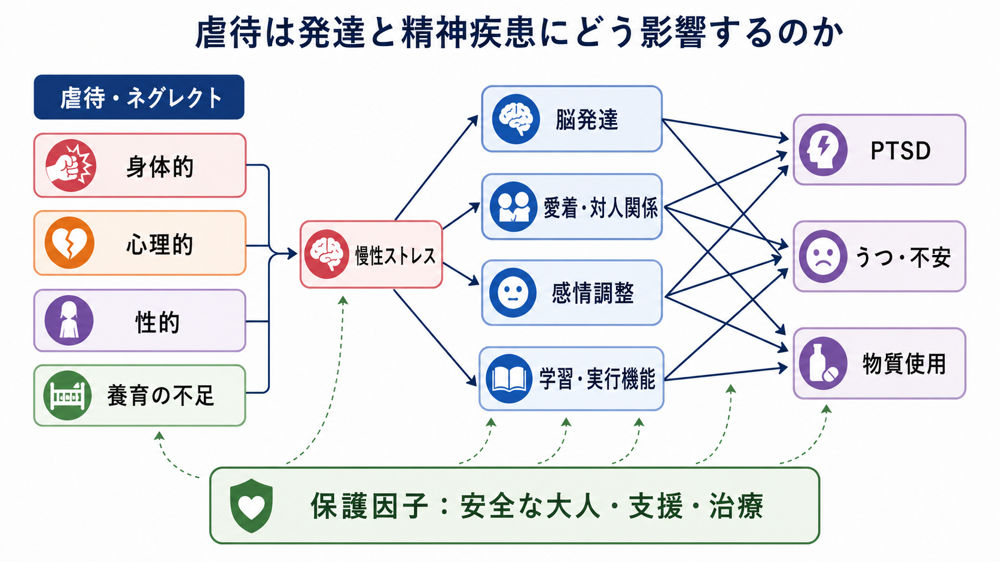
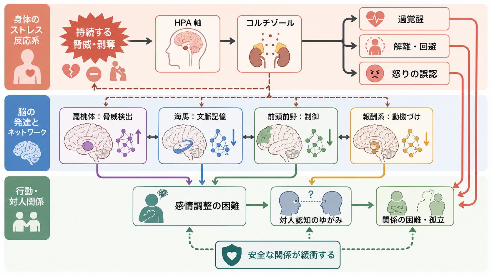
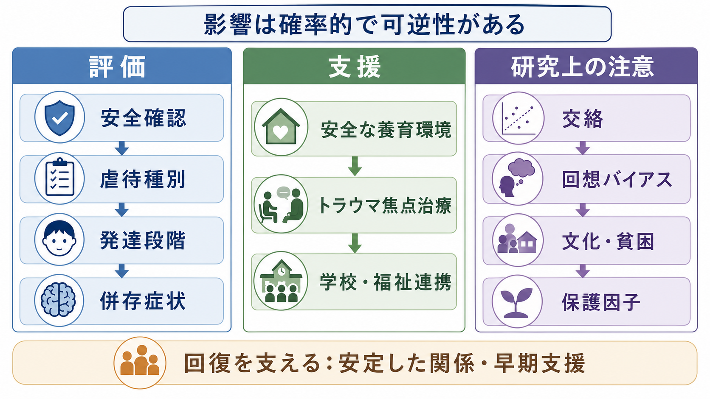

# 虐待は発達と精神疾患にどう影響するのか

## 要点

- 虐待・ネグレクトは、子どもの安全、予測可能性、養育者との関係、発達に必要な刺激を損なう経験であり、身体的虐待、心理的虐待、性的虐待、ネグレクト、搾取を含む[1]。
- 影響は「虐待を受けたら必ず精神疾患になる」という決定論ではない。遺伝的脆弱性、貧困、家族機能、学校、支援者、発達時期、曝露の長さが重なって、リスクと回復可能性が変わる[5][6]。
- 中心的な経路は、慢性ストレス反応、脅威学習、剥奪による認知・言語・社会刺激の不足、愛着と対人予測の変化、感情調整の困難である[3][4]。
- 精神疾患との関連は、[[PTSDとは何か|PTSD]]、うつ、不安、物質使用、解離、自傷、人格機能の困難などに広がるが、同じ経験から同じ症状が生じるわけではない[2][7]。
- 臨床では、個別の診断名だけでなく、現在の安全、発達段階、生活環境、保護因子を同時に評価する必要がある。

## この記事で答える問い

1. 虐待・ネグレクトは、発達中の脳と身体にどのような負荷をかけるのか。
2. なぜ虐待は、PTSD だけでなく、うつ、不安、物質使用、対人関係の困難にも関わるのか。
3. 「脅威」と「剥奪」を分けて考えると、何が見えやすくなるのか。
4. 臨床・研究では、虐待経験をどのように扱うべきか。

## まず結論

虐待の影響は、単一の「心の傷」ではなく、発達中のシステム全体にかかる慢性的な負荷として理解するとよい。子どもは、危険を避け、養育者との関係を保ち、日々を生き延びるために適応する。その適応は短期的には意味をもつが、環境が変わった後にも残ると、過覚醒、回避、解離、怒りの爆発、自己評価の低さ、他者不信、学習困難として現れうる。

重要なのは、虐待の影響を「脳が壊れた」と表現しないことである。研究は、扁桃体、海馬、前頭前野、報酬系、感覚野、白質結合などの変化を報告しているが、それらは発達環境に対する経験依存的な変化であり、可塑性と回復可能性も含めて理解する必要がある[3]。[[レジリエンスは発達過程でどう育つのか|レジリエンス]]、安全な大人、安定した生活、学校・福祉・医療の連携は、リスクを緩衝しうる[8]。

## 背景

WHO は、児童虐待を、18歳未満の子どもに対する身体的・情緒的な不適切な扱い、性的虐待、ネグレクト、商業的・その他の搾取を含むものとして定義している[1]。この定義で重要なのは、虐待が「殴る」「性的に侵害する」といった明白な行為だけでなく、子どもの健康、生存、発達、尊厳を損なう関係性の問題として扱われる点である。

公衆衛生研究では、虐待は [[逆境的小児期体験ACEとは何か|逆境的小児期体験 ACE]] の一部として位置づけられる。ACE 研究は、児童期の虐待や家庭機能不全が、成人期の身体疾患、精神疾患、物質使用、リスク行動と用量反応的に関連することを示した[2]。ただし、この関連を読むときは、記憶の回想バイアス、社会経済的要因、遺伝的交絡、他の逆境との重なりを考慮する必要がある[6]。

したがって、本記事では虐待を「単一原因」としてではなく、[[発達精神病理学とは何か|発達精神病理学]] の観点から、発達時期、環境、脳と身体、関係性、症状の相互作用として整理する。

## 基本概念

### 虐待の種類

| 種類 | 例 | 発達上の主な論点 |
|---|---|---|
| 身体的虐待 | 殴打、蹴る、火傷を負わせる、過度な体罰 | 脅威検出、過覚醒、身体感覚への警戒 |
| 心理的虐待 | 侮辱、脅迫、拒絶、孤立化、過度な支配 | 自己評価、対人予測、恥・罪悪感 |
| 性的虐待 | 性的接触、性的強要、性的搾取 | 身体境界、解離、対人安全感、PTSD |
| ネグレクト | 食事・衛生・医療・監督・情緒的応答の不足 | 剥奪、認知・言語刺激の不足、愛着、実行機能 |

これらはしばしば重なって生じる。たとえば、身体的虐待を受けている子どもは心理的脅迫や家庭内暴力の目撃も経験していることがある。したがって、評価では「どの虐待名に当てはまるか」だけでなく、いつ、どのくらい、誰から、どのような保護因子があったかを確認する。

### 脅威と剥奪

近年の発達神経科学では、小児期逆境を「脅威」と「剥奪」に分けて考える枠組みが使われる[4]。脅威とは、身体的・心理的な安全が侵害される経験であり、恐怖学習、過覚醒、脅威への注意バイアスに関わりやすい。剥奪とは、期待される入力が不足する経験であり、言語、認知、社会的学習、報酬経験の不足に関わりやすい。

この区別は、虐待を単純な重症度だけで見ないために役立つ。身体的虐待は脅威の側面が強く、ネグレクトは剥奪の側面が強いことが多いが、現実には両者が混在する。[[愛着とは何か|愛着]] の問題も、脅威と剥奪の両方から生じうる。

## 仕組み

### 1. 慢性ストレス反応

虐待環境では、子どもにとって家庭や養育者が安全基地として機能しにくい。危険が予測できず、逃げることも難しい場合、身体は警戒状態を保つ。[[HPA軸は精神疾患にどう関わるのか|HPA軸]]、交感神経系、免疫系は、短期的な生存には役立つが、慢性化すると睡眠、食欲、痛み、注意、情動反応、身体疾患リスクに影響しうる[1][3]。

この経路は [[トラウマは発達にどう影響するのか|トラウマ発達影響]] の中核でもある。たとえば、怒鳴り声、足音、表情の変化に過敏になることは、危険な家庭では適応的かもしれない。しかし学校や職場では、相手の曖昧な表情を脅威として読み取り、対人衝突や回避につながることがある。

### 2. 脳発達とネットワーク

脳画像研究は、虐待経験と扁桃体、海馬、前頭前野、脳梁、報酬系、感覚関連皮質などの構造・機能・結合の違いを関連づけている[3]。これらの領域は、脅威検出、文脈記憶、感情制御、意思決定、報酬学習、身体感覚の処理に関わる。

ただし、脳画像所見は個人診断には使えない。集団平均として差が観察されても、個人の脳画像から「虐待を受けた」「将来この疾患になる」と判定することはできない。研究として重要なのは、[[扁桃体過活動は不安症やPTSDにどう関わるのか|扁桃体の脅威検出]]、[[海馬萎縮はストレスやうつ病と関係するのか|海馬と文脈記憶]]、前頭前野による制御の発達が、環境経験によってどう変化しうるかである。

### 3. 愛着・対人関係・自己理解

子どもは養育者との相互作用を通じて、「困ったときに助けを求めてもよい」「自分の感情は理解されうる」「他者は完全には危険ではない」という対人予測を学ぶ。虐待環境では、養育者が安全の源であると同時に脅威の源にもなるため、接近と回避が混ざる。

その結果、対人関係では次のようなパターンが生じやすい。

- 拒絶される前に相手を遠ざける。
- 相手の小さな表情変化を危険信号として読む。
- 怒り、恥、罪悪感、無力感を区別しにくい。
- 助けを求めたいが、助けを求めること自体が危険に感じられる。
- 親密さと支配、保護と侵害の境界が混乱する。

これらは「性格の問題」と片づけるより、発達環境に適応して形成された対人予測として理解するほうが臨床的に有用である。

### 4. 精神疾患リスク

虐待経験は、PTSD だけでなく、[[うつ病とは何か|うつ病]]、[[不安症群とは何か|不安症]]、物質使用、摂食の問題、自傷、解離、精神病様体験、人格機能の困難と関連する[7]。システマティックレビューとメタ分析は、観察研究だけでなく準実験的研究を用いても、児童期虐待と精神健康問題の関連が残ることを示している[7]。一方で、効果量や因果解釈は研究デザインに左右され、交絡を完全に取り除けるわけではない[6][7]。

精神疾患リスクが広がる理由は、虐待が単一症状を直接作るのではなく、感情調整、報酬学習、睡眠、身体感覚、自己評価、対人信頼、実行機能など、複数の中間過程を変えるからである。これが「トランス診断的」な影響である。

## 図解

次の図は、臨床・研究で虐待影響を扱うときの見取り図である。安全確認、発達段階、併存症状、支援資源、研究上の交絡を同時に見る必要がある。

## 臨床・研究との接続

### 臨床での見方

[[児童精神医学とは何か|児童精神医学]] では、虐待経験を尋ねることは重要だが、質問の仕方には配慮が必要である。個別診断や治療指示としてではなく、教育・研究目的の一般論として言えば、評価では次を分けて考える。

| 観点 | 確認すること |
|---|---|
| 現在の安全 | いま危険が続いていないか、保護者・学校・福祉との連携が必要か |
| 発達段階 | 年齢相応の言語、認知、睡眠、食事、学習、遊び、対人関係 |
| 症状 | PTSD、うつ、不安、解離、自傷、怒り、身体症状、物質使用 |
| 環境 | 養育者の負担、家庭内暴力、貧困、孤立、学校適応 |
| 保護因子 | 信頼できる大人、安定した生活、治療アクセス、本人の強み |

この観点は [[子どものアセスメントでは何を確認するのか|子どものアセスメント]] と重なる。とくに、子どもが語る内容の正確性を疑うためではなく、子どもの安全を守り、本人の負担を増やさないために、多情報源・多場面・時間経過で評価する。

### 支援の考え方

CDC は、ACE の予防と影響軽減には、安全で安定した養育関係と環境、親支援、経済的支援、質の高い教育、暴力予防、地域資源へのアクセスが重要だと整理している[8]。これは「個人の治療」だけでなく、家庭、学校、地域、制度を含めた介入が必要であることを意味する。

治療や支援では、トラウマ焦点の心理療法が役立つ場合がある一方で、最初から詳細な外傷記憶を語らせることが常に適切とは限らない。安全、安定、睡眠、生活リズム、感情調整、信頼できる関係を整えることが、記憶処理や対人回復の前提になる。

### 研究での注意

虐待研究には、いくつかの難しさがある。

- 虐待の定義、重症度、時期、頻度、加害者との関係が研究によって異なる。
- 複数の逆境が重なり、どの要因がどの経路に関わるかを分離しにくい。
- 回想式調査では記憶バイアスがあり、行政記録では把握漏れがある。
- 遺伝的要因、親の精神疾患、社会経済的要因が交絡しうる[6]。
- 文化的背景によって、養育規範、体罰、支援アクセス、語りやすさが異なる。

そのため、研究知見は「虐待の影響は存在しない」でも「虐待がすべてを説明する」でもなく、複数の証拠を統合して確率的に読む必要がある。

## よくある誤解

### 「虐待を受けた人は必ず精神疾患になる」

ならない。虐待は強いリスク因子だが、結果は発達時期、曝露の長さ、支援、本人の特性、社会環境によって変わる。保護因子は現実に重要であり、支援によって生活機能が改善する余地もある[8]。

### 「脳が変わったなら回復できない」

これも誤解である。脳は経験によって変化するからこそ、悪影響も生じるが、同時に安全な関係、治療、学習、安定した生活による変化も起こりうる。脳画像所見は、不可逆性の証明ではない。

### 「虐待の影響は PTSD だけで説明できる」

PTSD は重要だが、虐待の影響はより広い。うつ、不安、物質使用、自己評価、対人関係、身体症状、学習、実行機能などが絡み合う。診断名だけでなく、どの機能が困っているのかを見る必要がある。

### 「親を責めれば原因が分かる」

虐待の責任を曖昧にしてよいわけではない。しかし、臨床・公衆衛生では、責任追及だけでは子どもの安全や回復に届かない。養育者自身のトラウマ、貧困、孤立、物質使用、精神疾患、制度的支援の不足も含めて、再発防止と安全確保を考える必要がある。

## 関連ノート

- [[逆境的小児期体験ACEとは何か]]
- [[トラウマは発達にどう影響するのか]]
- [[愛着とは何か]]
- [[発達精神病理学とは何か]]
- [[HPA軸は精神疾患にどう関わるのか]]
- [[扁桃体過活動は不安症やPTSDにどう関わるのか]]
- [[海馬萎縮はストレスやうつ病と関係するのか]]
- [[PTSDとは何か]]
- [[うつ病とは何か]]
- [[不安症群とは何か]]
- [[児童精神医学とは何か]]
- [[子どものアセスメントでは何を確認するのか]]
- [[レジリエンスは発達過程でどう育つのか]]

## MOC更新候補

- `content/00_MOC/MOC｜精神医学.md`
- `content/00_MOC/MOC｜発達・愛着・社会心理.md`
- `content/00_MOC/MOC｜神経科学と精神疾患.md`

## 理解チェック

1. 虐待の影響を「脅威」と「剥奪」に分けると、どのような発達経路が見えやすくなるか。
2. 虐待と精神疾患の関連を、なぜ決定論ではなく確率的リスクとして読む必要があるか。
3. 脳画像研究の知見を、個人診断にそのまま使えない理由は何か。
4. 臨床評価で、診断名以外に確認すべき環境・保護因子は何か。

## 参考文献

[1] World Health Organization. (2024). *Child maltreatment*. https://www.who.int/news-room/fact-sheets/detail/child-maltreatment

[2] Felitti, V. J., Anda, R. F., Nordenberg, D., Williamson, D. F., Spitz, A. M., Edwards, V., Koss, M. P., & Marks, J. S. (1998). Relationship of childhood abuse and household dysfunction to many of the leading causes of death in adults: The Adverse Childhood Experiences Study. *American Journal of Preventive Medicine, 14*(4), 245-258. https://doi.org/10.1016/S0749-3797(98)00017-8

[3] Teicher, M. H., Samson, J. A., Anderson, C. M., & Ohashi, K. (2016). The effects of childhood maltreatment on brain structure, function and connectivity. *Nature Reviews Neuroscience, 17*, 652-666. https://doi.org/10.1038/nrn.2016.111

[4] McLaughlin, K. A., Sheridan, M. A., & Lambert, H. K. (2014). Childhood adversity and neural development: Deprivation and threat as distinct dimensions of early experience. *Neuroscience & Biobehavioral Reviews, 47*, 578-591. https://doi.org/10.1016/j.neubiorev.2014.10.012

[5] Teicher, M. H., & Samson, J. A. (2016). Annual Research Review: Enduring neurobiological effects of childhood abuse and neglect. *Journal of Child Psychology and Psychiatry, 57*(3), 241-266. https://doi.org/10.1111/jcpp.12507

[6] Baldwin, J. R., Sallis, H. M., Schoeler, T., Taylor, M. J., Kwong, A. S. F., Tielbeek, J. J., et al. (2023). A genetically informed Registered Report on adverse childhood experiences and mental health. *Nature Human Behaviour, 7*, 269-290. https://doi.org/10.1038/s41562-022-01482-9

[7] Baldwin, J. R., Wang, B., Karwatowska, L., Schoeler, T., Tsaligopoulou, A., Munafò, M. R., & Pingault, J.-B. (2021). Childhood maltreatment and mental health problems: A systematic review and meta-analysis of quasi-experimental studies. *American Journal of Psychiatry, 178*(5), 397-406. https://doi.org/10.1176/appi.ajp.2020.20081118

[8] Centers for Disease Control and Prevention. (2019). *Preventing Adverse Childhood Experiences (ACEs): Leveraging the Best Available Evidence*. National Center for Injury Prevention and Control. https://stacks.cdc.gov/view/cdc/82316
