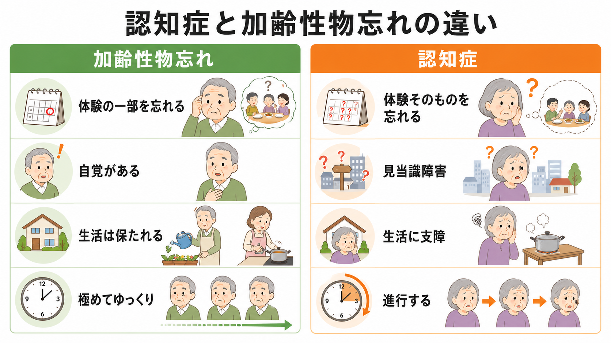
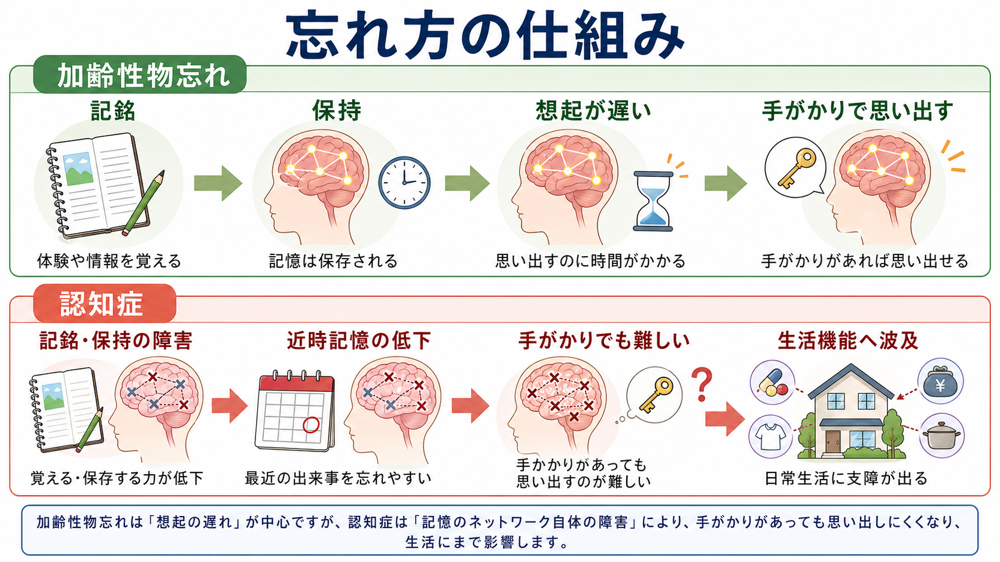
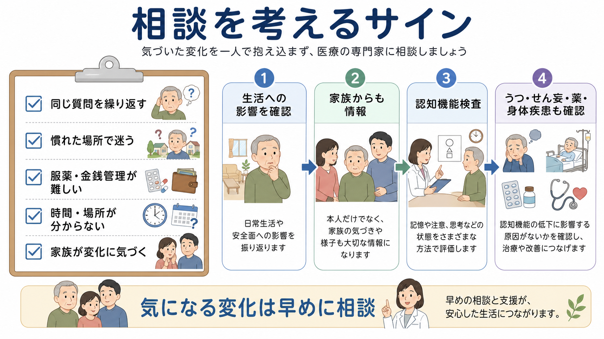

# 認知症と加齢性物忘れはどう違うのか

## 要点

- 加齢性物忘れは、名前や予定の一部を思い出すのに時間がかかるような「想起の遅れ」が中心で、生活全体は保たれやすい。
- 認知症では、記憶だけでなく、判断、注意、言語、視空間認知、段取り、社会生活の維持に支障が広がる。日常生活への影響が鑑別の中心になる[1][2]。
- 「朝食のメニューを忘れる」と「朝食を食べた体験そのものを忘れる」は、臨床的な意味が違う。後者は新しい出来事の記銘・保持の障害を示しやすい[1][4]。
- 見当識障害、慣れた場所で迷う、同じ質問を繰り返す、金銭・服薬・火の管理が難しくなる、家族が変化に気づく場合は、早めの相談が必要になる[1][3][4]。
- ただし、物忘れがあるから直ちに認知症とは限らない。うつ、せん妄、睡眠不足、薬剤、甲状腺機能低下症、感染症、感覚障害など、評価すべき要因がある[1][5]。

## この記事で答える問い

1. 年齢相応の物忘れと、認知症を疑う物忘れはどこで分かれるのか。
2. 日常生活への影響、進行性、見当識障害、自覚の有無は、どのように見ればよいのか。
3. 本人や家族が「そろそろ相談した方がよい」と考える目安は何か。

## まず結論

最も実用的な違いは、**思い出すのに時間がかかるだけか、生活の構造が崩れ始めているか**である。加齢性物忘れでは、物の置き場所や人名を忘れても、手がかりがあれば思い出し、予定や家事、金銭管理、服薬、外出などの生活はおおむね維持される。認知症では、最近の出来事そのものが抜け落ちる、時間や場所が分からなくなる、慣れた作業ができなくなる、判断が悪くなる、周囲が変化に気づく、といった形で生活機能に影響が出る[1][2][4]。

ここで重要なのは、認知症を「物忘れの強い版」と考えないことである。認知症は、複数の病気により脳の機能が障害され、記憶、思考、行動、日常生活動作に影響する症候群であり、多くの場合は時間とともに進行する[3][5]。一方、加齢性物忘れは、情報が完全に失われるというより、検索や処理速度が遅くなる側面が目立つ。

## 背景

高齢になると、誰でも新しい名前を覚えにくくなったり、会話中に言葉が出てくるまで時間がかかったりする。これは珍しいことではない。CDC は、加齢に伴う記憶変化として、鍵の置き場所を時々忘れる、言葉が出にくいが後で思い出す、知人の名前を忘れる、といった例を挙げ、それだけでは日常生活を大きく妨げないと説明している[2]。

一方で、認知症は通常の加齢とは別の問題である。WHO は、認知症を、記憶や思考、日常活動を行う能力に影響する複数の疾患の総称として整理し、症状は時間とともに悪化し、やがて日常生活で支援が必要になることが多いと説明している[3]。政府広報オンラインも、認知症を「脳の神経細胞の働きが徐々に変化し、認知機能が低下して、社会生活に支障を来した状態」と説明している[1]。

このため、臨床では「忘れるかどうか」だけでなく、次のような問いを重視する。

| 観点 | 加齢性物忘れで多い形 | 認知症を疑う形 |
|---|---|---|
| 忘れ方 | 体験の一部を忘れる | 体験そのものを忘れる |
| 手がかり | ヒントで思い出しやすい | ヒントがあっても思い出しにくい |
| 自覚 | 本人が困っていることが多い | 本人の自覚が乏しいことがある |
| 生活 | おおむね保たれる | 家事、金銭、服薬、外出に支障 |
| 時間・場所 | 曜日を一時的に間違えても修正できる | 日時、季節、場所、道順が分からなくなる |
| 経過 | きわめてゆっくり | 進行する、または段階的に悪化する |

## 基本概念

### 加齢性物忘れ

加齢性物忘れは、年齢とともに記憶や処理速度が変化する現象の一部である。典型的には、名前、単語、予定、物の置き場所を一時的に思い出せないが、後で思い出す、メモや会話の手がかりで補える、という形をとる。政府広報は、朝食を食べたことは覚えているがメニューが思い出せない例を「加齢によるもの忘れ」の例としている[1]。

この段階では、本人は「最近、物忘れが増えた」と自覚しやすい。失敗は不快だが、家事、買い物、服薬、金銭管理、交通機関の利用などはおおむね維持される。重要なのは、加齢性物忘れがゼロリスクという意味ではなく、疲労、睡眠、抑うつ、不安、聴力低下、薬剤、生活環境の変化によって目立ち方が変わる点である。

### 認知症

認知症は、記憶だけでなく、注意、言語、視空間認知、遂行機能、判断、社会的行動などが障害され、生活に支障を来す状態である[2][3][5]。アルツハイマー病、血管性認知症、レビー小体型認知症、前頭側頭葉変性症など原因は複数あり、症状の出方も一様ではない。

アルツハイマー型認知症では、最近の出来事を覚えにくい、同じ質問を繰り返す、予定や服薬を忘れる、といった近時記憶の障害が目立ちやすい。血管性認知症では、脳血管障害の部位や経過により、段階的な悪化、注意・遂行機能の低下、歩行や身体症状との組み合わせが問題になることがある。レビー小体型認知症では、認知機能の変動、幻視、パーキンソン症状、睡眠行動異常などが伴うことがある。したがって、「物忘れがあるか」だけで認知症の型や原因を決めることはできない[5]。

### 軽度認知障害 MCI

加齢性物忘れと認知症の間には、軽度認知障害、すなわち MCI と呼ばれる臨床概念がある。MCI は、年齢相応よりも認知機能の低下が目立つが、日常生活への影響はまだ認知症ほど大きくない状態として説明される[6]。MCI の人すべてが認知症に進むわけではなく、安定する人や改善する人もいる[6]。

MCI は、本人の自覚や家族の気づき、認知機能検査、生活機能の評価を合わせて判断する必要がある。この記事の主題である「加齢性物忘れか認知症か」という二分法だけでは、実際の臨床の中間領域を扱いきれない。

## 仕組み

### 1. 「記銘・保持」と「想起」の違い

記憶は大まかに、情報を取り入れる、保持する、必要な時に取り出す、という過程からなる。加齢性物忘れでは、情報はおおむね保持されているが、取り出しに時間がかかることがある。たとえば、俳優の名前がすぐ出ないが、後で思い出す、頭文字を聞くと思い出す、といった形である。

認知症、とくにアルツハイマー病では、新しい出来事の記銘や保持そのものが障害されやすい。本人にとっては「思い出せない」のではなく、出来事が記憶として残りにくい。だから、朝食のメニューではなく、朝食を食べた事実そのものが抜け落ちる、同じ質問を短時間に繰り返す、約束をしたこと自体が残らない、といった形になる[1][4]。

### 2. 日常生活への影響

日常生活への影響は、最も重要な境界線である。CDC は、認知症を、記憶、思考、判断が日常生活に影響する状態として説明している[2]。Alzheimer's Association も、日常生活を妨げる記憶障害、計画や問題解決の困難、慣れた作業の困難、時間や場所の混乱を警告サインとして挙げている[4]。

具体的には、次のような変化が続く場合に注意する。

- 同じ質問や確認を何度も繰り返す。
- 慣れた道で迷う、いつもの店や駅で混乱する。
- 料理、服薬、金銭管理、支払い、火の管理が難しくなる。
- 約束の日時や場所を何度も間違える。
- 財布や通帳をなくし、盗られたと疑う。
- 趣味、会話、外出、身だしなみへの関心が低下する。
- 家族や同僚が「以前と違う」と感じる。

ただし、これらは診断基準そのものではない。うつ、[[高齢者のせん妄はなぜ重要なのか|せん妄]]、薬剤、睡眠障害、感覚障害、身体疾患でも似た変化は起こる。教育・研究目的の一般整理として理解し、個別の診断は医療者の評価に委ねる必要がある。

### 3. 見当識障害

見当識とは、今がいつで、ここがどこで、自分がどの状況にいるかを把握する能力である。認知症では、日付、曜日、季節、場所、道順、出来事の順序が分からなくなることがある[3][4]。たとえば、慣れた場所で迷う、家にいるのに「帰らなければ」と言う、季節に合わない服装をする、約束の日時を繰り返し間違える、といった形で現れる。

加齢性物忘れでも、曜日を一時的に間違えることはある。しかし、多くの場合はカレンダーや会話で修正でき、なぜ間違えたかの見通しも保たれる。認知症を疑うのは、修正が難しい、生活上の失敗に直結する、本人が混乱して不安や怒りを示す、周囲の支援が必要になる場合である。

### 4. 自覚と家族の気づき

加齢性物忘れでは、本人が困りごとを強く自覚していることが多い。これに対して認知症では、本人の自覚が乏しいことがある。ただし、これは単純な区別ではない。政府広報は、認知症でも初期には自覚があることが少なくないと補足している[1]。また、MCI や初期の認知症では、本人が不安を抱えながらも、周囲に言い出せない場合がある。

したがって、本人の訴えだけでなく、家族、同居者、職場、介護者から見た変化も重要になる。本人は「大丈夫」と言うが、家族は服薬ミス、支払い忘れ、運転の危なさ、火の消し忘れを把握していることがある。一方で、家族の不安が強く、本人の自立が過小評価される場合もあるため、評価では本人の尊厳と生活史を保つ必要がある。

## 図解

| 図 | 役割 | 読み方 |
|---|---|---|
| 図1 | 加齢性物忘れと認知症の比較 | 体験の一部を忘れるのか、体験そのものや生活機能に影響するのかを見る。 |
| 図2 | 記憶の仕組み | 加齢性物忘れは想起の遅れ、認知症は記銘・保持やネットワーク障害が問題になりやすい。 |
| 図3 | 相談を考えるサイン | 生活への影響、家族からの情報、認知機能評価、身体疾患や薬剤の確認を一連の流れで見る。 |

## 臨床・研究との接続

### 評価では生活機能を必ず見る

認知症の評価では、記憶検査の点数だけでなく、ADL、IADL、服薬、金銭管理、運転、料理、買い物、電話、社会参加、安全面を見る。日本神経学会の認知症疾患診療ガイドラインは、認知症全般、症候、評価尺度、診断、検査を体系的に扱っており、認知機能障害だけでなく日常生活動作や全般的重症度の評価も臨床上の重要項目として整理している[5]。

これは [[老年精神医学とは何か]] の基本姿勢とも重なる。高齢者の精神医学では、症状名だけでなく、身体疾患、薬剤、感覚機能、生活環境、家族支援、社会資源を合わせて評価する必要がある。

### 鑑別では、うつとせん妄を外せない

高齢者の認知機能低下では、[[老年期うつ病は若年成人のうつ病と何が違うのか|老年期うつ病]] と [[高齢者のせん妄はなぜ重要なのか|せん妄]] が重要な鑑別になる。うつでは、集中困難、処理速度の低下、意欲低下、睡眠・食欲の変化が前景に出て、本人が「物忘れ」を強く訴えることがある。せん妄では、数時間から数日の急な変動、注意障害、意識水準の変化、夜間悪化が目立ちやすい。

この区別は、安全面にも関わる。急に混乱した場合は、認知症の進行と決めつけず、感染、脱水、低酸素、低血糖、薬剤、痛み、便秘、入院環境の変化などを確認する必要がある。とくに急性の変化は、早めの医療相談が重要である。

### 研究では「連続性」と「異質性」を扱う

研究上は、正常加齢、主観的認知機能低下、MCI、認知症を連続的に捉える視点が重要である。ただし、この連続性は「全員が同じ道筋で認知症に進む」という意味ではない。MCI でも改善・安定する人がいる[6]。認知症にも複数の原因疾患があり、記憶障害が中心の人、注意や遂行機能が中心の人、言語や行動の変化が中心の人がいる。

このため、[[ライフスパン精神医学とは何か|ライフスパン精神医学]] の観点では、若年期からの教育歴、職業歴、生活習慣、身体疾患、社会的孤立、聴力や視力、うつ、不安、睡眠、介護環境を、晩年の認知機能と切り離さずに見ることが重要になる。

## よくある誤解

### 誤解1: 物忘れがあるなら認知症である

物忘れは、加齢、疲労、睡眠不足、不安、抑うつ、薬剤、聴力低下、視力低下、身体疾患でも起こる。問題は、忘れること自体より、生活への影響、経過、周囲から見た変化、見当識、判断、遂行機能である[1][2]。

### 誤解2: 本人が自覚しているなら認知症ではない

初期の認知症や MCI では、本人が変化を自覚していることがある[1][6]。逆に、本人の自覚が乏しいからといって、本人の語りを無視してよいわけではない。本人の困りごとと家族の観察の両方を合わせる必要がある。

### 誤解3: 年を取れば認知症になるのは自然である

認知症は高齢者に多いが、通常の加齢そのものではない[2][3]。多くの高齢者は認知症にならずに生活する。年齢は重要なリスク要因だが、認知症を「年のせい」と片づけると、支援、治療可能な要因の確認、安全調整の機会を逃す。

### 誤解4: 診断されても何もできない

認知症そのものを完全に止めることが難しい場合でも、原因疾患の評価、薬剤調整、生活環境の整備、介護サービス、家族支援、運転や金銭管理の安全確認、将来の意思決定支援には意味がある。早期の相談は、本人の尊厳を保つ準備にもつながる[3][4]。

## 関連ノート

- [[老年精神医学とは何か]]
- [[ライフスパン精神医学とは何か]]
- [[高齢者のせん妄はなぜ重要なのか]]
- [[老年期うつ病は若年成人のうつ病と何が違うのか]]
- [[高齢者の不安症はどう現れるのか]]
- [[成人期の精神発達課題とは何か]]

関連ノート候補:

- 認知症とは何か
- 軽度認知障害とは何か
- アルツハイマー病とは何か
- レビー小体型認知症とは何か
- 血管性認知症とは何か
- 認知機能検査では何を評価するのか

MOC更新候補:

- `content/00_MOC/` 配下の精神医学・老年精神医学・ライフスパン精神医学関連 MOC に、本記事 `[[認知症と加齢性物忘れはどう違うのか]]` を追加する。
- 並列生成ジョブとの競合を避けるため、本記事では MOC 本体は更新しない。

## 理解チェック

1. 「朝食のメニューを忘れる」と「朝食を食べたこと自体を忘れる」は、どのように違うか。
2. 加齢性物忘れと認知症を分けるうえで、日常生活への影響が重要なのはなぜか。
3. 慣れた場所で迷う、時間や場所が分からない、同じ質問を繰り返す場合、どのような評価や相談が必要になるか。
4. 物忘れを見たとき、うつ、せん妄、薬剤、身体疾患を確認すべき理由は何か。

## 未解決問題

- 加齢性物忘れ、主観的認知機能低下、MCI、認知症の境界は連続的であり、単一の質問だけで明確に切り分けることは難しい。
- 認知症の早期診断は有用だが、過剰な不安やスティグマにつながらない説明方法が必要である。
- 本人の自律性を守りながら、運転、金銭管理、服薬、火の管理などの安全をどう調整するかは、家族・医療・福祉の共同課題である。

## 参考文献

[1] 政府広報オンライン. (2025). 知っておきたい認知症の基本. https://www.gov-online.go.jp/useful/article/201308/1.html?p=1708

[2] Centers for Disease Control and Prevention. (2024). Signs and Symptoms of Dementia. https://www.cdc.gov/alzheimers-dementia/signs-symptoms/index.html

[3] World Health Organization. (2025). Dementia. https://www.who.int/news-room/fact-sheets/detail/dementia

[4] Alzheimer's Association. 10 Early Signs and Symptoms of Alzheimer's and Dementia. https://www.alz.org/alzheimers-dementia/10_signs

[5] 日本神経学会 監修, 「認知症疾患診療ガイドライン」作成委員会 編集. (2017). 認知症疾患診療ガイドライン2017. https://www.neurology-jp.org/guidelinem/nintisyo_2017.html

[6] Mayo Clinic. Mild cognitive impairment (MCI): Symptoms and causes. https://www.mayoclinic.org/diseases-conditions/mild-cognitive-impairment/symptoms-causes/syc-20354578
