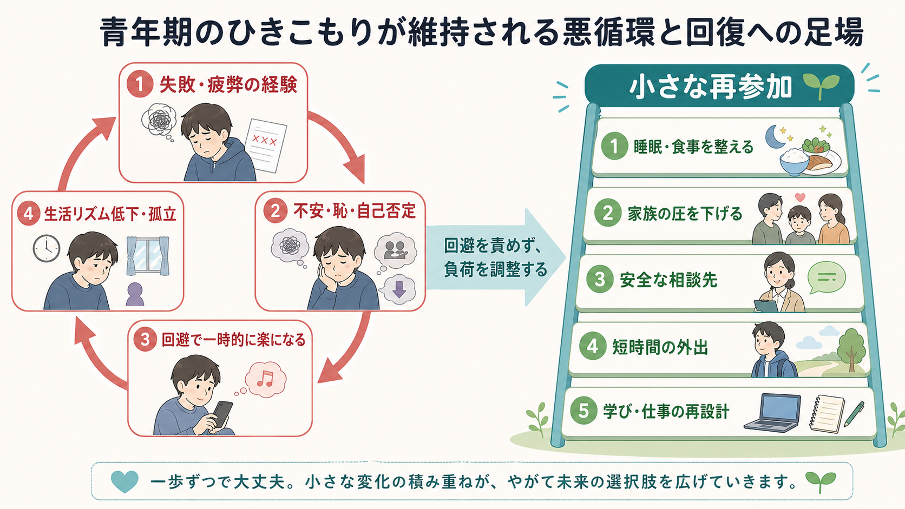
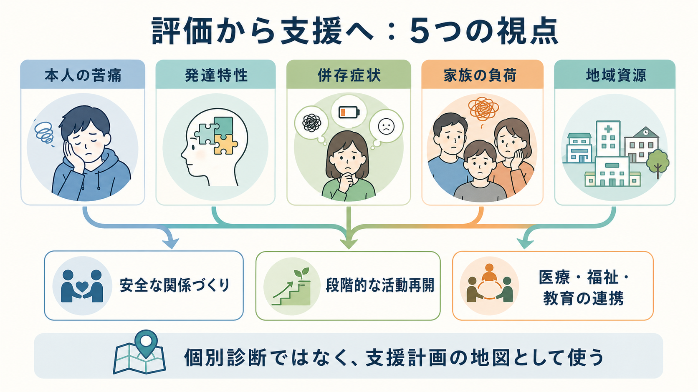

# 青年期のひきこもりはどう理解するのか

## 要点

- 青年期のひきこもりは、単一の疾患名というより、社会参加が長く狭まり、本人と家族の生活機能が落ちている「状態像」として理解する。
- 背景には、[[神経発達症とは何か|発達特性]]、[[児童青年期の不安症はどう現れるのか|不安]]、[[児童青年期のうつ病はどう現れるのか|抑うつ]]、学校・職場での失敗体験、家族関係、生活リズム、ネット利用、地域資源の不足が重なりやすい。
- 支援では「外に出す」ことを最初の目標にしない。安全な関係づくり、評価、家族支援、小さな再参加、医療・福祉・教育の連携を順に組み立てる。
- 医療的評価は重要だが、個別診断や治療指示に短絡しない。この記事は教育・研究目的の整理であり、個別事例では専門機関への相談が必要である。

## この記事で答える問い

この記事では、青年期のひきこもりを「怠け」「甘え」「親子問題」などに還元せず、複数の要因が相互に維持しあうプロセスとして整理する。特に、[[不登校は精神医学的にどう理解するのか|不登校]]からの連続、[[DSMとICDは何が違うのか|診断分類]]では捉えきれない生活機能、そして[[5Pモデルとは何か|5Pモデル]]的なケースフォーミュレーションとの接続を扱う。

## まず結論

青年期のひきこもりは、「何が原因か」よりも「何が維持しているか」を見ると理解しやすい。きっかけは不登校、いじめ、受験・就職の失敗、体調不良、発達特性に合わない環境、家庭内葛藤など多様である。しかし長期化すると、外出や対人接触を避けることで一時的に不安が下がり、その結果として経験不足、昼夜逆転、自己効力感の低下、家族の疲弊が進む。この悪循環が、ひきこもり状態を固定しやすくする。

厚生労働省のガイドラインは、ひきこもりを「様々な要因の結果として社会的参加を回避し、原則として6か月以上おおむね家庭にとどまり続けている状態」とする現象概念として扱う[1]。国際的にも、病的な社会的ひきこもりは6か月以上の家庭中心の生活、社会参加の著しい回避、苦痛または機能障害を伴う状態として整理されている[3][4]。したがって、評価の焦点は「本人がなぜ出ないのか」だけでなく、「本人・家族・学校・医療・地域のどこに介入可能な足場があるか」に置かれる。

## 背景

ひきこもりは日本固有の文化現象として語られてきたが、現在は国際的なメンタルヘルス課題として研究されている。Teo と Gaw は、ひきこもりの多くが既存の精神疾患で説明できる一方、既存診断に完全には収まらない一群もあると論じた[6]。Kato らのレビューも、ひきこもりを生物・心理・社会的要因が重なる多次元的状態として扱い、評価・支援・国際比較の必要性を強調している[3]。

日本の支援政策でも、ひきこもりは本人だけの問題ではなく、孤立、自己肯定感の低下、相談しにくさ、地域資源へのつながりにくさを含む社会的課題として位置づけられている。厚生労働省は、相談窓口、居場所づくり、ネットワークづくり、当事者会・家族会などを含む地域支援体制の整備を進めている[2]。これは、個人の意志の問題として叱責するのではなく、環境と支援経路を設計する発想である。

青年期では、学校適応、同年代関係、進路選択、身体発達、親からの心理的自立が同時に進む。そのため、社会参加のつまずきは「一つの失敗」では終わらず、自己像、家族関係、睡眠、学習機会、将来設計に波及しやすい。[[児童精神医学とは何か|児童精神医学]]では、このような症状や行動を、発達段階と環境の組み合わせとして読むことが重要になる。

## 基本概念

### ひきこもりは診断名ではなく状態像である

ひきこもりは、統合失調症、うつ病、不安症、強迫症、ASD、ADHD、摂食障害などと併存しうる。しかし、ひきこもりそのものを一つの疾患名として扱うと、生活機能、家族負担、社会参加の障壁が見えにくくなる。ガイドラインでも、気分障害、統合失調症、発達障害などの評価を行いながら、長期的関与の中で情報を蓄積することが重視される[1]。

### 「出られない」と「出ない」は分けにくい

本人が「出たくない」と言う場合でも、その背後には強い不安、疲労、失敗予期、感覚過敏、対人場面の読み取り困難、抑うつによる意欲低下があることが多い。したがって、意志の弱さとして扱うと評価を誤る。特に青年期では、本人が苦痛を言語化できず、家族には反抗や無関心として見えることがある。

### 社会参加は段階的に考える

社会参加は「学校に戻る」「就労する」だけではない。家族以外と短く話す、昼間に起きる、近所を歩く、オンラインで相談する、学習を再開する、居場所に行くなど、負荷の小さい行動も再参加の一部である。支援の初期目標は、外出頻度ではなく、安全感、予測可能性、生活リズム、相談可能性を回復することに置きやすい。

## 仕組み

### 1. 発達特性と環境不適合

ASD や ADHD などの発達特性は、ひきこもりの直接原因というより、環境との不適合を通じてリスクを高める。臨床研究では、ひきこもり群で自閉スペクトラム傾向が高く、社会的ネットワークや支援が乏しい傾向が報告されている[7]。ASD 診断のある成人男性を対象にした研究でも、ひきこもり状態を伴う群では、抑うつ、社会不安、感覚症状が強い傾向が示された[8]。

ここで重要なのは、「発達特性があるからひきこもる」と単純化しないことである。むしろ、雑音や集団活動がつらい、暗黙のルールが読みにくい、予定変更に弱い、叱責後に回復しにくい、といった特性に対して環境調整が不足すると、失敗体験が蓄積しやすい。

### 2. 不安・抑うつ・恥の悪循環

不安や抑うつは、外出や対人接触の負荷を上げる。回避すれば一時的に不安は下がるが、長期的には「自分はできない」という予測が強まり、次の外出がさらに難しくなる。青年期研究では、ひきこもり重症度に関連する要因として、不安・抑うつ、身体愁訴、親同士のコミュニケーション不足、インターネット過用が示されている[5]。

この悪循環は、本人の中だけで完結しない。家族が強く説得すると本人の不安や恥が増え、家族が何も言えなくなると支援の入口が失われる。本人と家族の双方が疲弊するほど、問題は「外出するかしないか」から「安全に話し合えるか」へ移る。

### 3. 家族関係は原因探しではなく支援資源として見る

家族関係は重要だが、「親が悪い」と読むのは臨床的に粗い。家族はしばしば、本人の安全を守りながら、生活費、食事、相談先探し、近隣・学校・親族への説明を背負っている。家族支援の目的は、犯人探しではなく、対立の減少、会話可能性の回復、支援機関との接続、家族自身の孤立予防である[1][2]。

### 4. 社会参加困難は個人内要因だけではない

学校・職場側の柔軟性、欠席後に戻る経路、通信制・別室登校・短時間就労・福祉サービスの選択肢、地域の相談窓口が少ないと、本人の回復意欲があっても再参加の足場がない。青年期の支援では、医療だけで完結せず、教育、福祉、就労支援、地域の居場所を組み合わせる必要がある。

## 図解

次の図は、評価項目を診断ラベルに直結させるのではなく、支援計画を作るための地図として使うための整理である。本人の苦痛、発達特性、併存症状、家族の負荷、地域資源を分けて評価し、それぞれを「安全な関係づくり」「段階的な活動再開」「医療・福祉・教育の連携」につなげる。

## 臨床・研究との接続

### 評価の入口

評価では、期間、外出範囲、家庭内での交流、睡眠、食事、ネット利用、学校・就労歴、いじめや失敗体験、身体疾患、自傷・希死念慮、暴力リスク、家族負担を確認する。[[GAFやWHODASは何を評価するのか|WHODAS]]のような機能評価の発想は、診断名だけでは見えない生活上の困難を把握する助けになる。

### 支援の順序

支援の順序は、一般に「関係づくり」「家族支援」「安全評価」「生活リズム」「本人の関心に沿った小目標」「学校・福祉・就労との調整」と考えると組み立てやすい。本人が相談に来られない場合でも、家族相談から開始できる。ガイドラインでも、家族が本人に来談・受診を説明しやすくなるよう助言を継続すること、地域連携やアウトリーチを含む段階的支援が重視される[1]。

### 研究上の注意

ひきこもり研究では、定義、期間、外出頻度、苦痛の有無、併存疾患の扱いが研究ごとに異なる。近年は、病的な社会的ひきこもりの診断基準案として、少なくとも6か月の著しい社会的孤立、家庭内にとどまる傾向、機能障害または苦痛を重視する整理が提案されている[4]。ただし、これは個別診断の代替ではなく、研究と支援の共通言語を作るための枠組みとして読む必要がある。

## よくある誤解

### 誤解1: ひきこもりは怠けである

怠けに見える行動の背後に、不安、抑うつ、感覚過敏、対人恐怖、失敗予期、身体症状があることは少なくない。行動だけを見て叱責すると、恥と回避が強まりやすい。

### 誤解2: ネットをやめれば解決する

ネット利用は悪循環の一部になりうるが、唯一の原因とは限らない。オンライン上の関係が、本人にとって唯一の社会的接点である場合もある。評価では、使用時間だけでなく、睡眠、食事、対人関係、学習、相談可能性への影響を見る。

### 誤解3: 家族が厳しくすれば外に出る

強い圧力で一時的に外出しても、恐怖や対立が増えれば継続しにくい。支援では、本人の回避を責めず、負荷を下げた小さな行動から再参加の経験を作る。

### 誤解4: 診断がつけば支援方針は決まる

診断は重要だが、同じ診断名でも必要な支援は異なる。社会参加の障壁、家族負担、地域資源、本人の関心、危機リスクを合わせて見る必要がある。

## 関連ノート

- [[不登校は精神医学的にどう理解するのか]]
- [[神経発達症とは何か]]
- [[児童青年期のうつ病はどう現れるのか]]
- [[児童青年期の不安症はどう現れるのか]]
- [[子どものアセスメントでは何を確認するのか]]
- [[5Pモデルとは何か]]
- [[DSMとICDは何が違うのか]]
- [[GAFやWHODASは何を評価するのか]]

### MOC更新候補

- [[MOC｜精神医学]]
- [[MOC｜発達・愛着・社会心理]]
- [[MOC｜臨床実践・治療]]

## 理解チェック

1. ひきこもりを「疾患名」ではなく「状態像」として見る利点は何か。
2. 回避が短期的には本人を助け、長期的には状態を維持するとはどういうことか。
3. 発達特性を、本人の問題ではなく環境との不適合として読むと、支援方針はどう変わるか。
4. 家族支援を「親の責任追及」ではなく「支援資源の回復」として扱う理由は何か。
5. 再参加の目標を、登校・就労だけに限定しない方がよいのはなぜか。

## 参考文献

[1] 厚生労働科学研究「思春期のひきこもりをもたらす精神科疾患の実態把握と精神医学的治療・援助システムの構築に関する研究」. (2010). *ひきこもりの評価・支援に関するガイドライン*. 厚生労働省. https://www.mhlw.go.jp/content/12000000/000807675.pdf

[2] 厚生労働省. (2025). *ひきこもり支援に関する取組*. https://www.mhlw.go.jp/stf/seisakunitsuite/bunya/hukushi_kaigo/seikatsuhogo/hikikomori/index.html

[3] Kato, T. A., Kanba, S., & Teo, A. R. (2019). Hikikomori: Multidimensional understanding, assessment, and future international perspectives. *Psychiatry and Clinical Neurosciences, 73*(8), 427-440. https://doi.org/10.1111/pcn.12895

[4] Kato, T. A., Kanba, S., & Teo, A. R. (2020). Defining pathological social withdrawal: Proposed diagnostic criteria for hikikomori. *World Psychiatry, 19*(1), 116-117. https://doi.org/10.1002/wps.20705

[5] Hamasaki, Y., Pionnie-Dax, N., Dorard, G., Tajan, N., & Hikida, T. (2021). Identifying social withdrawal (hikikomori) factors in adolescents: Understanding the hikikomori spectrum. *Child Psychiatry & Human Development, 52*, 808-817. https://doi.org/10.1007/s10578-020-01064-8

[6] Teo, A. R., & Gaw, A. C. (2010). Hikikomori, a Japanese culture-bound syndrome of social withdrawal? A proposal for DSM-5. *The Journal of Nervous and Mental Disease, 198*(6), 444-449. https://doi.org/10.1097/NMD.0b013e3181e086b1

[7] Katsuki, R., Tateno, M., Kubo, H., et al. (2020). Autism spectrum conditions in hikikomori: A pilot case-control study. *Psychiatry and Clinical Neurosciences, 74*(12), 652-658. https://doi.org/10.1111/pcn.13154

[8] Yamada, M., Kato, T. A., Katsuki, R. I., et al. (2023). Pathological social withdrawal in autism spectrum disorder: A case control study of hikikomori in Japan. *Frontiers in Psychiatry, 14*, 1114224. https://doi.org/10.3389/fpsyt.2023.1114224

## 未解決問題

- 青年期ひきこもりの長期予後を、診断名、家族支援、学校復帰、就労、生活満足度のどの指標で測るべきか。
- オンライン支援や遠隔相談が、孤立の固定化ではなく再参加の足場になる条件は何か。
- 発達特性、感覚過敏、社会不安、抑うつを統合した支援プログラムを、地域資源の差が大きい環境でどう実装するか。
