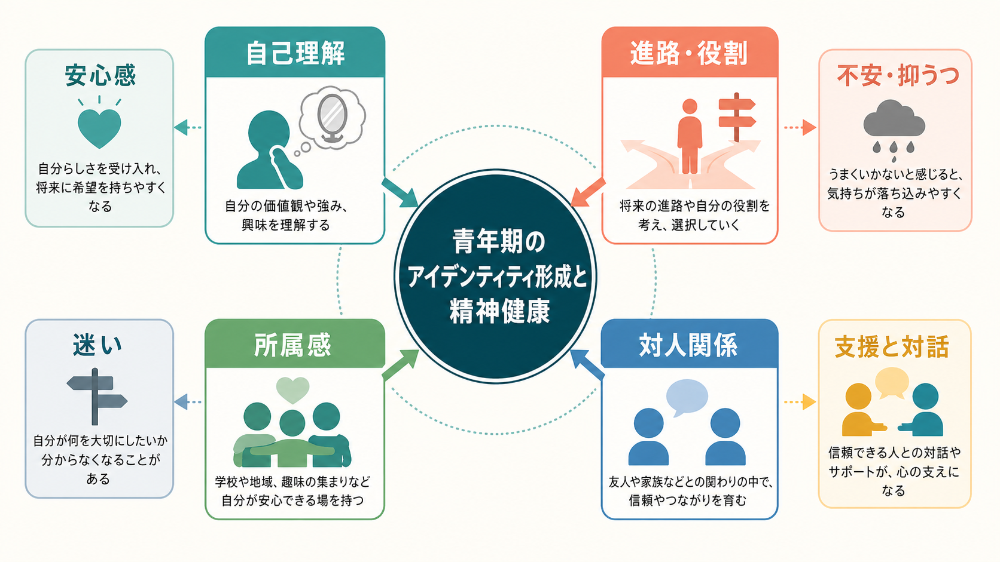
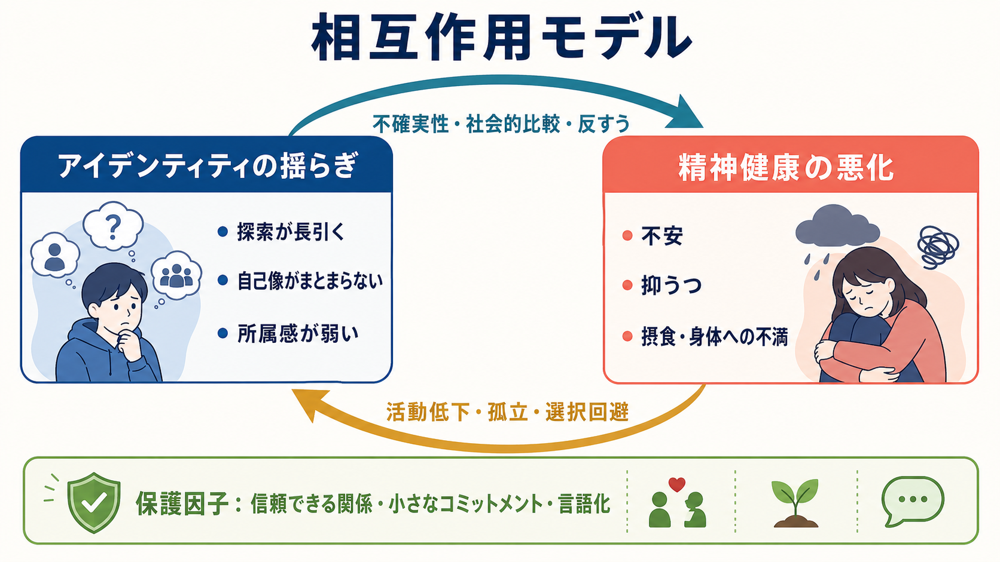
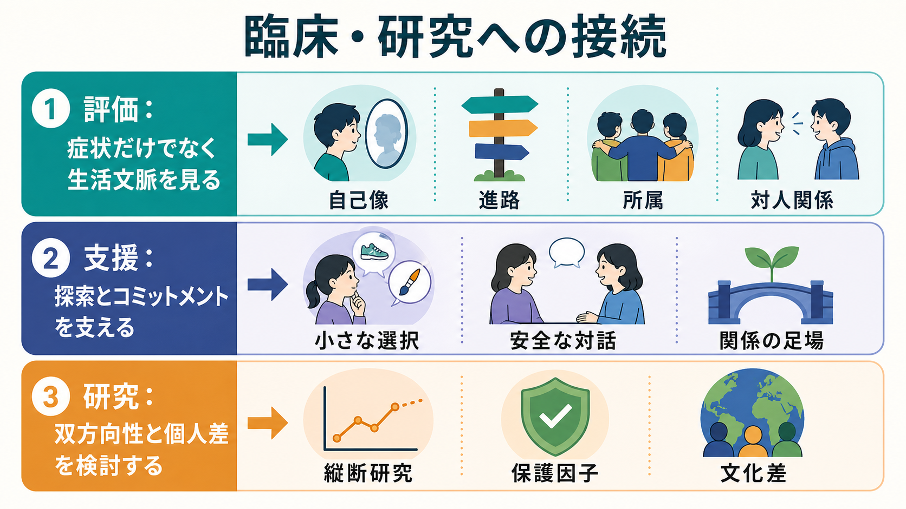

# 青年期のアイデンティティ形成と精神健康はどう関係するのか

## 要点

- 青年期のアイデンティティ形成は、「自分は何者か」だけでなく、進路、価値観、身体、親密な関係、所属集団、オンラインでの自己提示を含む発達課題である[2]。
- アイデンティティの揺らぎはそれ自体が病気ではない。問題になるのは、揺らぎが強い苦痛、反すう、孤立、選択回避、学校・家庭・友人関係での機能低下と結びつくときである[1][4]。
- 研究全体では、アイデンティティの統合が高いほど不安・抑うつ・摂食関連症状が少なく、混乱が高いほど症状が多い傾向が示される。ただし因果は単方向ではなく、症状がアイデンティティ形成を妨げる経路もある[4][6]。
- 支援では「早く決めさせる」より、本人が安全に探索し、小さなコミットメントを試し、関係の中で自分の物語を言語化できる環境を整えることが重要である[2][7]。

## この記事で答える問い

1. 青年期のアイデンティティ形成とは何を指すのか。
2. 自己理解・進路・所属感・対人関係の揺らぎは、どのように精神症状と結びつくのか。
3. 臨床や研究では、症状だけでなく何を評価すればよいのか。

## まず結論

青年期のアイデンティティ形成と精神健康は、片方が片方を一方的に決める関係ではない。アイデンティティの混乱は、不確実性、社会的比較、自己批判、反すうを通じて不安や抑うつを強めうる。一方で、不安や抑うつが強いと、外出、対人接触、進路探索、失敗を含む試行錯誤が難しくなり、アイデンティティ形成の材料が減る。この相互作用を、[[発達精神病理学とは何か|発達精神病理学]]の観点から、本人の特性、家族・学校・友人関係、文化、デジタル環境の中で読む必要がある[1][2][4]。

## 背景

WHO は青年期を、身体的・情緒的・社会的変化が重なり、精神健康のリスクと保護因子がともに形成される時期として位置づけている。10〜19歳の約7人に1人が精神健康上の問題を経験し、不安、抑うつ、行動上の問題はこの時期の主要な疾病負荷である[1]。この時期に生じる困難は、学校出席、学業、友人関係、家族関係、将来の機会に影響しやすい。

同時に、青年期は[[青年期のアイデンティティ形成とは何か|アイデンティティ形成]]が進む時期でもある。近年のレビューは、アイデンティティ発達が単なる「段階」ではなく、日々の経験、親子関係、友人関係、移行イベント、語り直しを通じて動くプロセスだと整理している[2]。したがって精神健康を理解するには、症状名だけでなく、「その人がどのような自己像を作ろうとしているのか」「どの関係の中で自分を試しているのか」を見る必要がある。

## 基本概念

### アイデンティティ

アイデンティティとは、時間や状況を超えて「自分は自分である」と感じられる連続性、価値観、目標、役割、所属、身体感覚、他者から見られる自己像を統合する働きである。[[アイデンティティとは何か|アイデンティティ]]は固定された本質ではなく、経験の中で更新される[[自己概念とは何か|自己概念]]である。

### 探索とコミットメント

青年期には、進路、友人関係、恋愛、趣味、信念、身体イメージ、文化的所属などを試す「探索」と、ある程度の選択や所属を引き受ける「コミットメント」が並行する。縦断研究では、年齢とともに高コミットメントの状態が増える傾向がある一方、かなりの個人差と安定性もある[3]。つまり「迷うこと」自体は発達の一部であり、すぐに問題視する必要はない。

### アイデンティティ混乱

アイデンティティ混乱は、自己像、価値観、所属、進路、対人役割がまとまらず、本人が強い苦痛や空虚感を感じたり、選択回避や関係不安が持続したりする状態を指す。臨床研究では、精神科受診中の青年において、診断群によってアイデンティティ発達の困難の程度が異なることが示されている[7]。ただし、アイデンティティ混乱は単独で診断名を意味しない。

## 仕組み

### 1. 自己理解の揺らぎが反すうを増やす

「自分は何を大切にしたいのか」「なぜ周囲のように決められないのか」という問いは、探索として働くときには成長を支える。しかし、自己批判や社会的比較に巻き込まれると、反すうが増え、不安や抑うつを強めることがある。縦断研究のレビューでは、アイデンティティの統合と混乱は、うつ・不安・摂食関連症状と関連するが、研究の質や測定の違いが大きく、強い因果断定には注意が必要だとされる[4]。

### 2. 症状が探索の機会を狭める

不安が強い青年は、新しい関係や活動を避けやすくなる。抑うつが強い青年は、興味、エネルギー、将来への見通しが低下し、選択や試行錯誤が重くなる。5波の縦断研究では、高不安群の青年は低不安群に比べ、コミットメントが弱まり、再考が強まる困難なアイデンティティ発達を示した[5]。別の多標本縦断研究も、アイデンティティ過程と抑うつ症状の関係を、脆弱性モデルと「症状が後に傷跡を残す」モデルの両方から検討している[6]。

### 3. 所属感と対人関係が足場になる

アイデンティティは一人で内省するだけでは作られない。家族、友人、学校、地域、趣味の共同体、オンライン空間など、複数の場で「こう振る舞ってみる」「受け止められる」「違和感を修正する」という循環が起こる。[[社会的支援は健康にどう影響するのか|社会的支援]]や[[親密性はどのように形成されるのか|親密性]]は、自己像を試すための安全な場として機能する。

### 4. デジタル環境は量より質が重要になる

SNS は、青年が自己を表現し、他者から反応を受け、所属を試す場になっている。2025年の系統的レビューでは、単なる利用時間よりも、能動的参加、真正な自己表現、社会的比較など「何をしているか」が、探索、自己概念の明確さ、アイデンティティ苦痛と異なる関連を持つと整理されている[8]。これは、オンライン環境を一律に悪者にするのではなく、比較、承認依存、排除、支援的交流を分けて見る必要があることを示す。

## 図解

上の図の要点は、次の循環である。

| 局面 | 起こりやすいこと | 精神健康への接続 |
|---|---|---|
| 探索 | 進路、関係、価値観、所属を試す | 適度なら成長、過剰な反すうなら不安 |
| コミットメント | 選択や所属をいったん引き受ける | 安定感と見通しを支える |
| 混乱 | 自己像や目標がまとまらない | 抑うつ、空虚感、孤立と結びつくことがある |
| 症状 | 不安、抑うつ、身体不満、摂食問題 | 活動低下や回避を通じて探索機会を減らす |
| 保護因子 | 信頼できる関係、小さな選択、言語化 | 悪循環を弱め、回復可能性を広げる |

## 臨床・研究との接続

臨床では、アイデンティティの問題を「早く将来を決めれば解決する」と短絡しない。むしろ、本人が何を恐れているのか、どの場面では自分らしくいられるのか、どの関係では役割を演じすぎているのかを丁寧に聞く。[[精神科面接とは何か|精神科面接]]では、症状、生活機能、安全性、発達段階、家族・学校・友人関係、文化的背景を合わせて確認する。

研究では、アイデンティティと症状の関係を横断的な相関だけでなく、縦断データ、日誌法、経験サンプリング、ネットワーク分析などで捉える方向が重要になる。とくに、同じ「探索」でも、好奇心に基づく探索、強迫的な再考、社会的比較に駆動された探索は精神健康との意味が異なる可能性がある[2][4][8]。

## よくある誤解

### 誤解1: アイデンティティが揺らぐのは病気である

揺らぎは青年期の自然な発達過程である。病的かどうかは、苦痛の強さ、持続、生活機能、安全性、孤立、併存症状との関係で判断する。

### 誤解2: 進路を決めれば精神症状は消える

進路決定は見通しを与えることがあるが、症状の原因が不安症、うつ病、トラウマ、発達特性、家庭内ストレス、いじめなどにある場合、それだけでは不十分である。[[児童青年期のうつ病はどう現れるのか|うつ症状]]や[[児童青年期の不安症はどう現れるのか|不安症状]]の評価が必要になる。

### 誤解3: SNS はアイデンティティ形成に悪いだけである

SNS は比較や排除を強めることもあるが、表現、情報探索、少数派の所属、支援的交流の場にもなる。重要なのは利用時間だけでなく、利用の質と、その後の気分・睡眠・対人関係への影響である[8]。

### 誤解4: 本人の自己理解だけを深めればよい

自己理解は重要だが、環境が変わらなければ探索の機会は増えない。家庭、学校、地域、医療、福祉、オンライン環境を含めた足場づくりが必要である[1][2]。

## 関連ノート

- [[青年期のアイデンティティ形成とは何か]]
- [[アイデンティティとは何か]]
- [[自己概念とは何か]]
- [[社会の中の自己はどのように形成されるのか]]
- [[思春期精神医学とは何か]]
- [[ライフスパン精神医学とは何か]]
- [[児童青年期のうつ病はどう現れるのか]]
- [[児童青年期の不安症はどう現れるのか]]
- [[社会的支援は健康にどう影響するのか]]
- [[青年期のひきこもりはどう理解するのか]]

### MOC更新候補

- `content/00_MOC/MOC｜精神医学.md`
- `content/00_MOC/MOC｜発達・愛着・社会心理.md`
- `content/00_MOC/MOC｜意識・自己・身体性.md`

## 理解チェック

1. アイデンティティの「探索」と「コミットメント」は、それぞれ何を意味するか。
2. アイデンティティ混乱が精神症状と結びつく経路を、反すう、社会的比較、選択回避の語を使って説明できるか。
3. 不安や抑うつが、逆にアイデンティティ形成を妨げる理由は何か。
4. SNS を評価するとき、利用時間だけでなく何を見る必要があるか。

## 参考文献

[1] World Health Organization. (2025). *Mental health of adolescents*. https://www.who.int/news-room/fact-sheets/detail/adolescent-mental-health

[2] Branje, S., de Moor, E. L., Spitzer, J., & Becht, A. I. (2021). Dynamics of identity development in adolescence: A decade in review. *Journal of Research on Adolescence, 31*(4), 908-927. https://doi.org/10.1111/jora.12678

[3] Meeus, W., van de Schoot, R., Keijsers, L., Schwartz, S., & Branje, S. (2010). On the progression and stability of adolescent identity formation: A five-wave longitudinal study in early-to-middle and middle-to-late adolescence. *Child Development, 81*(5), 1565-1581. https://doi.org/10.1111/j.1467-8624.2010.01492.x

[4] Potterton, R., Austin, A., Robinson, L., Webb, H., Allen, K. L., & Schmidt, U. (2022). Identity development and social-emotional disorders during adolescence and emerging adulthood: A systematic review and meta-analysis. *Journal of Youth and Adolescence, 51*, 16-29. https://doi.org/10.1007/s10964-021-01536-7

[5] Crocetti, E., Klimstra, T., Keijsers, L., Hale, W. W., & Meeus, W. (2009). Anxiety trajectories and identity development in adolescence: A five-wave longitudinal study. *Journal of Youth and Adolescence, 38*(6), 839-849. https://doi.org/10.1007/s10964-008-9302-y

[6] Becht, A. I., Luyckx, K., Nelemans, S. A., Goossens, L., Branje, S. J. T., Vollebergh, W. A. M., & Meeus, W. H. J. (2019). Linking identity and depressive symptoms across adolescence: A multisample longitudinal study testing within-person effects. *Developmental Psychology, 55*(8), 1733-1742. https://doi.org/10.1037/dev0000742

[7] Jung, E., Pick, O., Schlüter-Müller, S., & Schmeck, K. (2013). Identity development in adolescents with mental problems. *Child and Adolescent Psychiatry and Mental Health, 7*, 26. https://doi.org/10.1186/1753-2000-7-26

[8] Avci, H., Baams, L., & Kretschmer, T. (2025). A systematic review of social media use and adolescent identity development. *Adolescent Research Review, 10*, 219-236. https://doi.org/10.1007/s40894-024-00251-1

## 未解決問題

- アイデンティティ混乱と症状の双方向性は、どの年齢、文化、症状領域で強くなるのか。
- 「探索」が成長につながる場合と、反すう・比較・苦痛につながる場合を分ける実用的指標は何か。
- 学校、家庭、オンライン環境のどの介入要素が、本人の自律性を損なわずにコミットメント形成を支えるのか。
