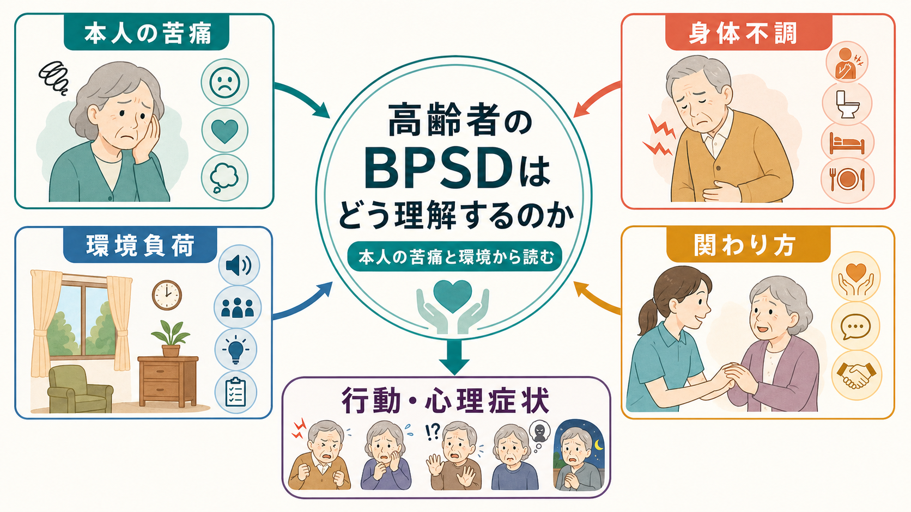
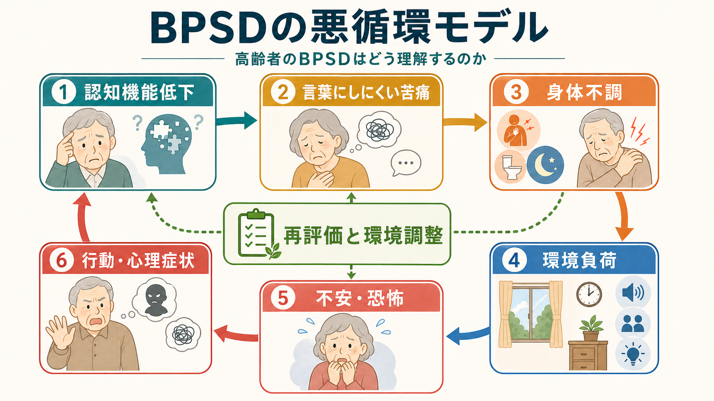
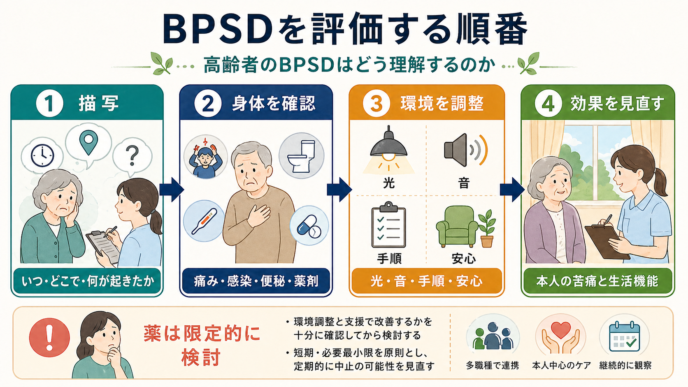

# 高齢者のBPSDはどう理解するのか

## 要点

- [[BPSDとは何か|BPSD]]は、認知症に伴う興奮、攻撃性、幻覚、妄想、徘徊、不安、抑うつ、アパシー、睡眠・食行動の変化などを含む行動・心理症状の総称である[1]。
- 高齢者のBPSDは「困った行動」ではなく、[[認知症とは何か|認知症]]による理解・記憶・見当識の低下、身体不調、環境負荷、本人の不安や痛み、介護者との相互作用が重なったサインとして読む。
- 急な変化では、認知症の進行だけで説明せず、痛み、感染、便秘、脱水、薬剤、睡眠障害、[[せん妄とは何か|せん妄]]を確認する[2][3]。
- 初期対応の中心は、本人中心のケア、環境調整、生活リズムの再構成、介護者支援である。薬物療法は危険や著しい苦痛がある場合に、利益と害を検討して限定的に位置づける[2][5][6]。

## この記事で答える問い

1. 高齢者のBPSDを「症状名」だけで見ないためには、何を観察すればよいか。
2. 興奮、幻覚、妄想、徘徊は、どのように本人の苦痛や環境との不一致として理解できるか。
3. 評価とケアでは、身体要因、環境要因、関わり方をどう整理するか。
4. 薬物療法をどこに位置づけ、どこに注意すべきか。

## まず結論

高齢者のBPSDを理解する第一歩は、「なぜその行動をやめないのか」ではなく、「その行動は何を伝えているのか」と問うことである。

認知症が進むと、本人は痛み、不安、尿意、便秘、孤独、寒さ、まぶしさ、騒音、場所のわからなさを、言葉で整理して伝えにくくなる。すると、歩き回る、怒る、拒む、同じことを尋ねる、誰かに盗られたと訴える、見えないものに反応する、といった形で外に現れることがある。

この意味でBPSDは、「本人が周囲を困らせる行動」ではなく、「本人も困っている状態」の表現である。ケアの目標は、行動をただ抑え込むことではなく、本人の苦痛を減らし、生活機能と安全を保ち、介護者の疲弊も下げることである。

## 背景

BPSDは、認知症の非認知症状をまとめて扱うための臨床・研究上の概念である。レビューでは、BPSDは認知症の経過で頻繁にみられ、生活機能低下、介護者負担、施設入所、薬剤使用、医療費と関連すると整理されている[1]。

ただし、高齢者のBPSDは単に「認知症だから起こる」とは言い切れない。[[アルツハイマー型認知症とは何か|アルツハイマー型認知症]]では記憶障害や見当識障害が、[[レビー小体型認知症とは何か|レビー小体型認知症]]では幻視、認知変動、睡眠関連症状が、[[前頭側頭型認知症とは何か|前頭側頭型認知症]]では脱抑制や常同行動が前景に出やすい。さらに、同じ疾患名でも、痛み、生活史、居住環境、家族関係、感覚障害、薬剤の影響によって表れ方は変わる。

したがって、BPSDは「診断名から自動的に決まる症状」ではなく、脳の変化と生活世界の摩擦から生じる現象として理解するほうが実践的である。

## 基本概念

### 行動の奥にある「苦痛」を読む

BPSDの評価では、まず症状名を付ける前に、行動が出た場面を具体的に記述する。たとえば「徘徊」と呼ばれる行動でも、本人にとっては次のような意味を持ちうる。

| 観察される行動 | 背景にありうる苦痛・目的 | 確認したいこと |
|---|---|---|
| 夜間に歩き回る | トイレを探す、不安、昼夜逆転、痛み、空腹 | 排尿、疼痛、睡眠、照明、日中活動量 |
| 入浴を拒む | 寒さ、羞恥、手順の理解困難、過去の怖い体験 | 室温、説明、同性介助、痛み、タイミング |
| 怒る・大声を出す | 過要求、騒音、待たされる不安、空腹、便秘 | 直前の声かけ、周囲の刺激、身体不調 |
| 盗られたと訴える | 置き忘れ、記憶障害、喪失感、対人不信 | 物の定位置、本人の不安、関係性 |

この読み方は、本人を「正しい・間違っている」で裁くためではない。本人の現実理解が変化しているなかで、どの刺激が安全に感じられ、どの刺激が脅威になっているのかを探るための観察である。

### BPSDは本人・身体・環境・関係の相互作用である

BPSDを理解するうえでは、少なくとも4つの層を分けると整理しやすい。

1. 本人の認知・情動の変化  
   記憶、注意、見当識、言語理解、遂行機能、感情制御が弱くなると、状況を予測し、選択肢を比べ、助けを求めることが難しくなる。

2. 身体の不快  
   痛み、感染、便秘、脱水、低酸素、不眠、視聴覚障害、薬剤性の眠気やアカシジアは、興奮や拒否として見えることがある[2][3]。

3. 環境の負荷  
   騒音、暗さ、まぶしさ、混雑、見慣れない場所、複雑な手順、急な介助は、本人の処理能力を超えやすい。

4. 関わり方と介護者の疲弊  
   介護者が悪いという意味ではない。疲労、睡眠不足、情報不足、孤立があると、声かけが速くなり、本人の不安が増え、さらに対応が難しくなる。

## 仕組み

BPSDは、脳の変化が直接「興奮」や「妄想」を作るだけではなく、本人が環境を解釈し、身体の不快を処理し、周囲に助けを求める過程が崩れることで生じる。

たとえば、記憶障害がある人は、財布を自分でしまったことを思い出せない。そのとき、周囲に知らない人が出入りしている、家族が急いでいる、本人が孤立している、最近ものを失うことが増えている、という文脈が重なると、「盗られた」という説明が本人にとって最も納得しやすくなることがある。これは単なる虚偽ではなく、不確実な世界を理解しようとする試みでもある。

幻覚も同様である。レビー小体型認知症では幻視がよく知られているが、薄暗い照明、視力低下、睡眠覚醒リズムの乱れ、発熱、薬剤、孤立が加わると、知覚体験はさらに不安定になる。したがって、幻覚を聞いたときは、内容だけでなく、本人が怖がっているか、生活を妨げているか、せん妄や薬剤の影響がないかを確認する。

### 悪循環として見る

BPSDはしばしば悪循環を作る。

1. 認知機能低下により、状況の理解や予測が難しくなる。
2. 痛み、便秘、不眠、空腹、尿意などの不快を言葉にしにくい。
3. 騒音、暗さ、急な介助、複雑な説明が負荷になる。
4. 本人は不安や恐怖を感じ、興奮、拒否、徘徊、訴えとして反応する。
5. 介護者は疲弊し、急いだ声かけや制止が増える。
6. 本人の脅威感が高まり、さらに行動が強まる。

この悪循環を断つには、本人だけを変えようとするより、身体要因、環境、声かけ、活動量、介護者支援を同時に見直す必要がある。

## 図解

この記事の図は、次の順番で読むとよい。

| 図 | 役割 |
|---|---|
| 1枚目 | BPSDを本人の苦痛、脳の変化、身体不調、環境負荷、関わり方の相互作用として見る |
| 2枚目 | 不快と環境ミスマッチが興奮・幻覚・妄想・徘徊へつながる悪循環を示す |
| 3枚目 | 評価とケアの順番を、描写、身体確認、環境調整、再評価として整理する |

## 臨床・研究との接続

### DICEアプローチ

BPSDの評価とケアを実践的に整理する枠組みとして、DICEアプローチがある。DICEは、Describe、Investigate、Create、Evaluateの循環であり、行動の描写、背景要因の調査、対応計画の作成、効果の評価を順に行う[3]。

| 段階 | 日本語での要点 | 具体例 |
|---|---|---|
| Describe | 何が起きたかを描写する | いつ、どこで、誰と、何の直後に起きたか |
| Investigate | 背景を調べる | 痛み、感染、便秘、薬剤、睡眠、せん妄、環境 |
| Create | 対応計画を作る | 声かけ、手順、照明、活動、介護者支援を調整 |
| Evaluate | 効果を見直す | 本人の苦痛、安全、生活機能、介護負担を再評価 |

NICEの認知症ガイドラインも、苦痛や行動症状への対応では、痛み、せん妄、不適切なケア、環境要因などを含む構造化評価を行い、心理社会的・環境的介入を初期対応として位置づけている[2]。

### 非薬物的介入は「薬を使わないこと」ではない

非薬物的介入とは、我慢や放置ではなく、本人の生活史、好み、残存能力、睡眠覚醒リズム、感覚機能、環境刺激、介護者の声かけを調整する積極的なケアである。JAMAのレビューでは、行動症状の体系的スクリーニング、原因の同定、個別化された対応、介護者教育が重視されている[7]。

実践では、次のような小さな調整が重要になる。

| 領域 | 調整の例 |
|---|---|
| 光と音 | 夜間は暗すぎず、日中は光を入れ、騒音を減らす |
| 手順 | 一度に複数の指示を出さず、短い言葉で一つずつ伝える |
| 見当識 | 時計、カレンダー、部屋の目印、物の定位置を整える |
| 身体 | 痛み、便秘、排尿、口渇、睡眠、視聴覚を確認する |
| 関係 | 反論より安心を優先し、本人の面子と選択感を守る |

### 薬物療法の位置づけ

抗精神病薬は、BPSD全体への一般的な第一選択ではない。APAのガイドラインは、抗精神病薬を使う場合でも、症状が重度、危険、または著しい苦痛を伴うか、非薬物的対応を含む他の選択肢と比べて利益が上回るかを検討する枠組みを示している[5]。Cochraneレビューも、抗精神病薬の効果は限定的で、有害事象や死亡リスクを含めた慎重な比較が必要だと整理している[6]。

一方で、2023年に米国FDAは、アルツハイマー病による認知症に伴う興奮に対する初の薬剤として brexpiprazole を承認した[8]。これは「BPSDは薬で解決する」という意味ではない。薬物療法が検討される場面がある一方で、個別の診断、苦痛、危険性、身体疾患、併用薬、環境調整の余地を評価する必要がある、という位置づけで理解するのがよい。

この記事は教育・研究目的の整理であり、個別の診断や治療指示ではない。

## よくある誤解

### 誤解1: BPSDは性格の問題である

高齢者のBPSDは、もともとの性格だけで説明できない。認知症による理解力の低下、身体不調、環境負荷、喪失体験、対人関係の不安が重なって現れる。性格に帰すと、痛みやせん妄のような可逆的要因を見落としやすい。

### 誤解2: 徘徊はただ止めればよい

徘徊には、帰宅願望、トイレ探索、不安、運動欲求、痛み、日中活動不足、睡眠リズムの乱れが関わることがある。危険を減らす工夫は必要だが、ただ制止すると不安や興奮が強まる場合がある。

### 誤解3: 妄想には反論して現実を教えるべきである

もの盗られ妄想などでは、正誤をめぐって説得し続けると、本人の不安や被害感が強まることがある。まず安心を作り、物の定位置や探す手順を整え、本人が失敗を責められていると感じない関わり方を考える。

### 誤解4: 介護者の対応が悪いからBPSDが起こる

環境と関わり方は重要だが、介護者の責任に還元してはいけない。夜間対応、見守り、身体介助、家族関係の調整は大きな負担であり、介護者支援そのものがBPSDケアの一部である。

## 関連ノート

- [[BPSDとは何か]]
- [[認知症とは何か]]
- [[神経認知障害群とは何か]]
- [[せん妄とは何か]]
- [[せん妄と認知症はどう違うのか]]
- [[アルツハイマー型認知症とは何か]]
- [[レビー小体型認知症とは何か]]
- [[前頭側頭型認知症とは何か]]
- [[認知症と精神病症状はどう関係するのか]]
- [[精神科診察で睡眠をどう評価するか]]

## MOC更新候補

- `content/00_MOC/` 配下の精神医学、老年精神医学、認知症、神経認知障害に関するMOCへ追加候補。
- 並列ジョブとの衝突を避けるため、本記事ではMOC本体は更新していない。

## 理解チェック

1. BPSDを「問題行動」とだけ呼ぶと、何を見落としやすいか。
2. 夜間の徘徊を見たとき、確認すべき身体要因と環境要因を3つずつ挙げられるか。
3. もの盗られ妄想に対して、反論より安心を優先する理由は何か。
4. DICEアプローチの4段階を説明できるか。
5. 抗精神病薬を検討する前に、どのような評価が必要か。

## 未解決問題

- 本人の言語報告が乏しい状況で、痛み、不安、孤独、感覚過敏をどのように高精度に評価するか。
- 在宅、施設、急性期病院で、環境調整と介護者支援をどのように継続可能な形にするか。
- センサーやデジタル記録をBPSD評価に使う場合、本人の尊厳とプライバシーをどう守るか。
- 薬物療法、非薬物的介入、介護者支援の組み合わせ効果を、どのアウトカムで比較すべきか。

## 参考文献

[1] Cerejeira, J., Lagarto, L., & Mukaetova-Ladinska, E. B. (2012). Behavioral and psychological symptoms of dementia. *Frontiers in Neurology, 3*, 73. https://doi.org/10.3389/fneur.2012.00073

[2] National Institute for Health and Care Excellence. (2018). *Dementia: assessment, management and support for people living with dementia and their carers* (NICE guideline NG97). https://www.nice.org.uk/guidance/ng97/chapter/recommendations

[3] Kales, H. C., Gitlin, L. N., & Lyketsos, C. G. (2015). Assessment and management of behavioral and psychological symptoms of dementia. *BMJ, 350*, h369. https://doi.org/10.1136/bmj.h369

[4] Cummings, J. L. (1997). The Neuropsychiatric Inventory: assessing psychopathology in dementia patients. *Neurology, 48*(5 Suppl 6), S10-S16. https://doi.org/10.1212/WNL.48.5_Suppl_6.10S

[5] Reus, V. I., Fochtmann, L. J., Eyler, A. E., et al. (2016). The American Psychiatric Association Practice Guideline on the Use of Antipsychotics to Treat Agitation or Psychosis in Patients With Dementia. *American Journal of Psychiatry, 173*(5), 543-546. https://doi.org/10.1176/appi.ajp.2015.173501

[6] Mühlbauer, V., Möhler, R., Dichter, M. N., & Zuidema, S. U. (2021). Antipsychotics for agitation and psychosis in people with Alzheimer's disease and vascular dementia. *Cochrane Database of Systematic Reviews, 2021*(12), CD013304. https://doi.org/10.1002/14651858.CD013304.pub2

[7] Gitlin, L. N., Kales, H. C., & Lyketsos, C. G. (2012). Nonpharmacologic management of behavioral symptoms in dementia. *JAMA, 308*(19), 2020-2029. https://doi.org/10.1001/jama.2012.36918

[8] U.S. Food and Drug Administration. (2023). FDA approves first drug to treat agitation symptoms associated with dementia due to Alzheimer's disease. https://www.fda.gov/news-events/press-announcements/fda-approves-first-drug-treat-agitation-symptoms-associated-dementia-due-alzheimers-disease
