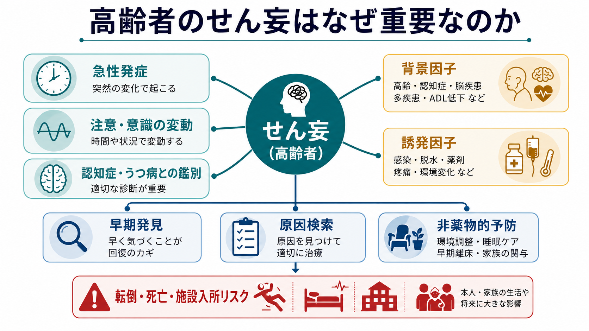
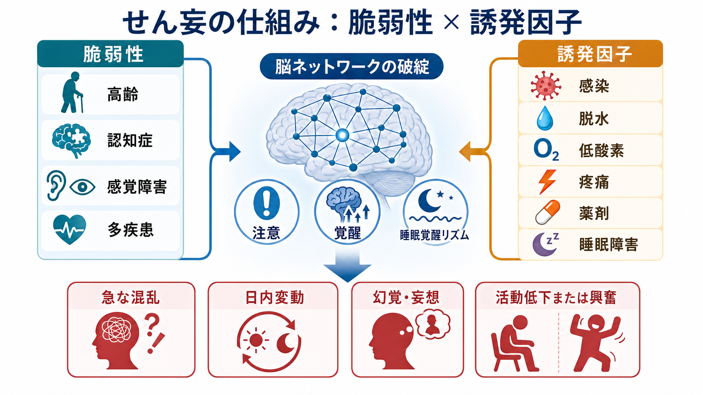
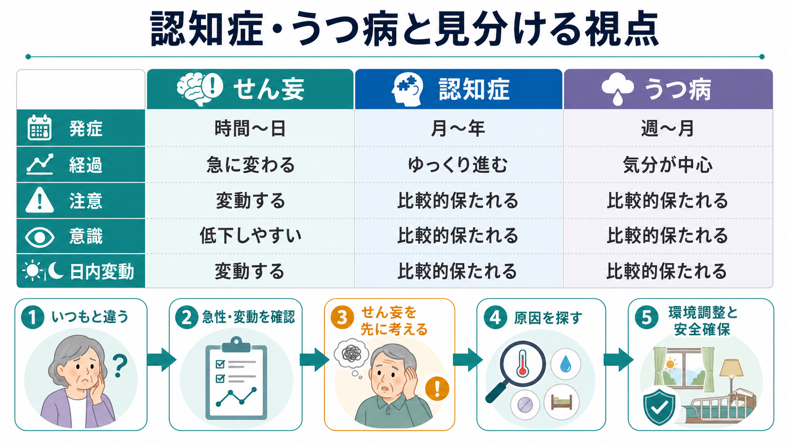

# 高齢者のせん妄はなぜ重要なのか

## 要点

- せん妄は、注意・意識・認知が数時間から数日の単位で急に変化し、日内変動を示しやすい急性の脳機能障害である[1]。
- 高齢者では、認知症、感覚障害、多疾患、薬剤、脱水、感染、疼痛、睡眠障害などが重なり、軽い身体変化でもせん妄が起こりやすい[2][3]。
- 見逃すと、転倒、身体拘束、入院期間延長、施設入所、死亡、長期認知機能低下と結びつくため、「年のせい」「認知症が進んだ」と片づけないことが重要である[4][5]。
- 早期対応の中心は、原因検索、危険因子の補正、見当識を保つ環境、睡眠・疼痛・脱水・低酸素・薬剤の見直しなどの多成分非薬物的介入である[2][6][7]。

## この記事で答える問い

高齢者が急に混乱したとき、それは[[老年精神医学とは何か|老年精神医学]]でどのように考えるべきなのか。認知症、うつ病、単なる疲労、性格変化と見分けるには何を見るべきか。なぜ、せん妄を早く見つけることが本人・家族・医療者にとって重要なのか。

## まず結論

高齢者のせん妄は「急に脳が弱った状態のサイン」である。したがって、症状名として終わらせるのではなく、感染、脱水、低酸素、疼痛、便秘、尿閉、薬剤、手術、睡眠剥奪、環境変化など、背後にある身体・環境要因を探す入口として扱う必要がある[2][5]。

認知症は多くの場合、月から年の単位で進む。うつ病は気分、興味、意欲、睡眠、食欲、希死念慮などを中心に、週から月の単位で把握されることが多い。これに対して、せん妄は「昨日までと違う」「昼は落ち着くが夜に悪化する」「質問への注意が続かない」「眠そう、ぼんやりしている、または急に興奮する」といった急性・変動性が鍵になる[1][2]。

## 背景

せん妄は入院高齢者で頻度が高く、医療安全上も重要な症候群である。NICE は、病院や長期ケア施設でせん妄リスクを考えるべき人として、65歳以上、認知機能障害または認知症、股関節骨折、重症疾患を挙げている[2]。つまり、せん妄は「特殊な精神症状」ではなく、急性期医療、周術期、リハビリテーション、介護、在宅移行の各場面で日常的に問題になる。

重要なのは、せん妄がしばしば低活動型として現れる点である。興奮して大声を出す場合は気づかれやすいが、実際には「元気がない」「眠ってばかり」「反応が遅い」「食べない」「話さない」という形でも現れる。低活動型は認知症、うつ病、疲労、老衰に見誤られやすく、対応が遅れやすい[5][7]。

## 基本概念

DSM-5-TR では、せん妄は注意と意識の障害を中核とし、短期間で発症し、1日の中で変動し、認知の追加的障害を伴い、他の神経認知障害だけでは説明されず、身体疾患・物質・薬剤・複数要因などによって生じるものとして整理される[1]。

実践的には、次の3点をまず確認する。

| 観察点 | せん妄で重要な所見 | 認知症・うつ病との違い |
|---|---|---|
| 発症 | 数時間から数日で急に変化する | 認知症は月から年、うつ病は週から月で目立つことが多い |
| 変動 | 日内変動、夜間悪化、場面による揺れ | 認知症でも変動はありうるが、急性変化の有無が重要 |
| 注意・意識 | 会話を追えない、眠そう、過覚醒、ぼんやり | うつ病では注意低下があっても意識水準は通常保たれる |

## 仕組み

高齢者のせん妄は、単一の原因だけで説明されにくい。基本的には「脆弱性」と「誘発因子」の掛け算で考えると理解しやすい[3][5]。

脆弱性には、高齢、認知症、脳血管疾患、パーキンソン病、視覚・聴覚障害、低栄養、多疾患、ADL低下、ポリファーマシーなどが含まれる。誘発因子には、感染、脱水、電解質異常、低酸素、疼痛、手術、麻酔、睡眠障害、尿閉、便秘、環境変化、ベンゾジアゼピン系薬、抗コリン作用をもつ薬剤などが含まれる[2][7]。

これらが重なると、炎症、神経伝達物質の不均衡、ストレス反応、睡眠覚醒リズムの乱れ、脳ネットワークの効率低下が生じ、注意、覚醒、見当識、知覚、思考の統合が崩れる。結果として、急な混乱、幻覚、妄想、興奮、活動低下、昼夜逆転が現れる[3][5]。

## 図解

せん妄を見分けるうえで最も重要なのは、「内容」よりも「時間経過」である。奇妙な発言、幻覚、拒否、怒り、無気力だけを見ると、認知症、うつ病、精神病症状、性格変化のように見えることがある。しかし、発症が急で、注意が続かず、意識水準が揺れ、夜間に悪化し、身体状態や薬剤変更と時間的に結びつくなら、せん妄を先に考える。

## 臨床・研究との接続

臨床では、せん妄の評価は「精神症状の評価」と「身体疾患の探索」を切り離さない。発熱、SpO2低下、脱水、疼痛、尿路感染、肺炎、便秘、尿閉、低血糖、電解質異常、薬剤変更、アルコール・鎮静薬離脱などを確認する。これは個別診断や治療指示ではなく、研究・教育目的の一般的整理である。

スクリーニングとしては、4AT のような短時間ツールが臨床で使われる。4AT は覚醒度、見当識、注意、急性変化・変動を短時間で見る設計で、入院高齢者で妥当性が検証されている[8]。ただし、スクリーニング陽性は診断そのものではなく、急性変化の病歴、身体診察、薬剤確認、検査、家族・介護者からの情報と統合する必要がある。

予防・対応の研究では、多成分介入が中心である。Hospital Elder Life Program 型の介入は、見当識づけ、睡眠支援、早期離床、視聴覚補助、脱水予防、認知刺激など、複数のリスク因子に同時に働きかける[6]。AGS の術後せん妄ガイドラインも、リスクのある高齢者に対する多職種の非薬物的介入、原因検索、疼痛管理、せん妄を誘発しやすい薬剤の回避を重視している[7]。

[[ライフスパン精神医学とは何か|ライフスパン精神医学]]の視点では、せん妄は高齢期だけの問題ではなく、脳の予備能、身体疾患、生活環境、ケア体制が交差する地点にある。だからこそ、せん妄を「一過性の混乱」とだけ見るのではなく、その人の脆弱性、回復力、生活の継続性を評価する窓として扱う必要がある。

## よくある誤解

**誤解1: せん妄は認知症が急に進んだだけである。**  
認知症はせん妄の重要な危険因子だが、せん妄そのものではない。認知症のある人が急に悪化した場合は、「認知症だから仕方ない」ではなく、せん妄が重なっていないかを考える。

**誤解2: 興奮していなければせん妄ではない。**  
低活動型せん妄では、眠そう、反応が遅い、食事が進まない、会話が減る、ぼんやりするという形をとる。これはうつ病や疲労に見えるため、急性変化と注意障害を確認する。

**誤解3: せん妄にはまず鎮静薬を使う。**  
薬物療法が必要になる状況はありうるが、基本は原因検索と非薬物的対応である。AGS は、低活動型せん妄への抗精神病薬やベンゾジアゼピン使用を避けること、重度の興奮で危険がある場合も最小限・短期間で慎重に考えることを推奨している[7]。

**誤解4: せん妄は治れば終わりである。**  
せん妄経験後には、死亡、施設入所、認知症リスクの上昇が報告されている[4]。急性期を越えた後も、認知・ADL・服薬・栄養・睡眠・家族支援を見直す必要がある。

## 関連ノート

- [[老年精神医学とは何か]]
- [[ライフスパン精神医学とは何か]]

関連ノート候補:

- 認知症とは何か
- 老年期うつ病はどう現れるのか
- ポリファーマシーと精神症状
- 入院高齢者の認知機能評価
- 医療安全と精神症状

MOC更新候補:

- `content/00_MOC/` 配下の精神医学・ライフスパン・老年精神医学系 MOC に、本記事へのリンクを追加する候補。

## 理解チェック

1. 高齢者のせん妄を疑うとき、発症時期と日内変動について何を確認するか。
2. 認知症のある人で急に混乱が強くなったとき、なぜ「認知症の進行」と即断してはいけないか。
3. 低活動型せん妄は、うつ病や疲労とどのように紛らわしいか。
4. せん妄の対応で、薬剤だけでなく環境調整、睡眠、脱水、疼痛、感覚補助を確認する理由は何か。
5. せん妄後の長期的なリスクとして、どのようなアウトカムが問題になるか。

## 未解決問題

- せん妄が長期認知機能低下を直接引き起こすのか、それとも脆弱な脳のマーカーなのかは、なお議論が残る。
- 低活動型せん妄を、一般病棟、在宅、介護施設でどのように高感度かつ過剰診断を避けて検出するかは実装上の課題である。
- 非薬物的多成分介入を、少人数の現場や地域包括ケアの中でどのように持続可能にするかは、研究と制度設計の接点である。

## 参考文献

[1] American Psychiatric Association. (2022). *Diagnostic and Statistical Manual of Mental Disorders, Fifth Edition, Text Revision (DSM-5-TR)*. American Psychiatric Association Publishing. https://doi.org/10.1176/appi.books.9780890425787

[2] National Institute for Health and Care Excellence. (2010, updated 2023). *Delirium: prevention, diagnosis and management in hospital and long-term care (CG103)*. https://www.nice.org.uk/guidance/cg103

[3] Inouye, S. K., Westendorp, R. G. J., & Saczynski, J. S. (2014). Delirium in elderly people. *The Lancet, 383*(9920), 911-922. https://doi.org/10.1016/S0140-6736(13)60688-1

[4] Witlox, J., Eurelings, L. S. M., de Jonghe, J. F. M., Kalisvaart, K. J., Eikelenboom, P., & van Gool, W. A. (2010). Delirium in elderly patients and the risk of postdischarge mortality, institutionalization, and dementia: A meta-analysis. *JAMA, 304*(4), 443-451. https://doi.org/10.1001/jama.2010.1013

[5] Marcantonio, E. R. (2017). Delirium in hospitalized older adults. *New England Journal of Medicine, 377*(15), 1456-1466. https://doi.org/10.1056/NEJMcp1605501

[6] Inouye, S. K., Bogardus, S. T., Jr., Charpentier, P. A., Leo-Summers, L., Acampora, D., Holford, T. R., & Cooney, L. M., Jr. (1999). A multicomponent intervention to prevent delirium in hospitalized older patients. *New England Journal of Medicine, 340*(9), 669-676. https://doi.org/10.1056/NEJM199903043400901

[7] American Geriatrics Society Expert Panel on Postoperative Delirium in Older Adults. (2015). American Geriatrics Society abstracted clinical practice guideline for postoperative delirium in older adults. *Journal of the American Geriatrics Society, 63*(1), 142-150. https://doi.org/10.1111/jgs.13281

[8] Bellelli, G., Morandi, A., Davis, D. H. J., Mazzola, P., Turco, R., Gentile, S., Ryan, T., Cash, H., Guerini, F., Torpilliesi, T., Del Santo, F., Trabucchi, M., Annoni, G., & MacLullich, A. M. J. (2014). Validation of the 4AT, a new instrument for rapid delirium screening: A study in 234 hospitalised older people. *Age and Ageing, 43*(4), 496-502. https://doi.org/10.1093/ageing/afu021

## 更新ログ

- 2026-04-28: 初版作成。高齢者せん妄の重要性、鑑別、機序、早期対応、関連画像を追加。
