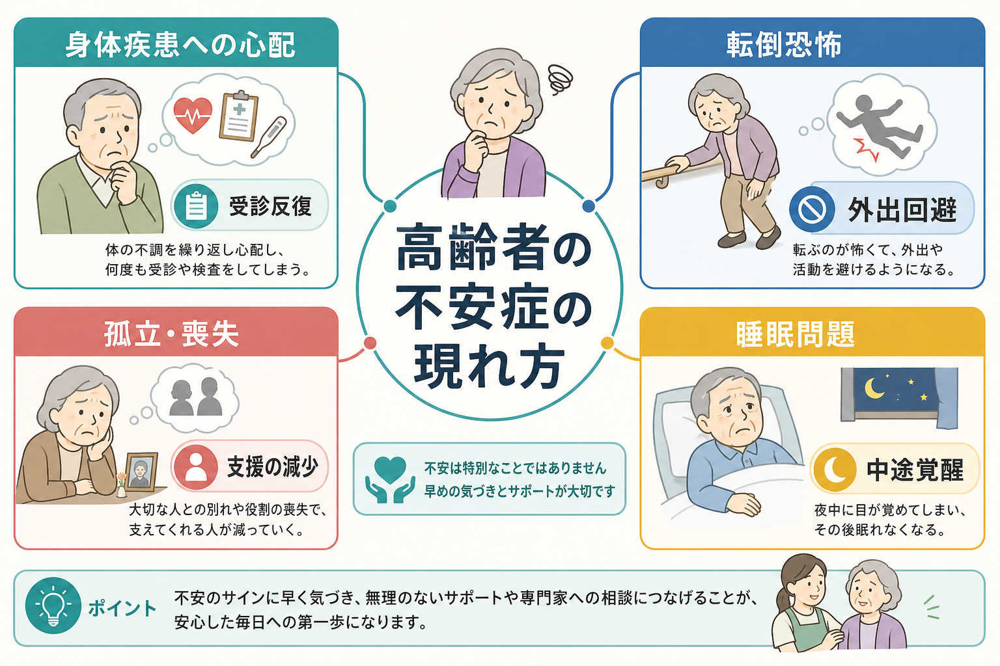
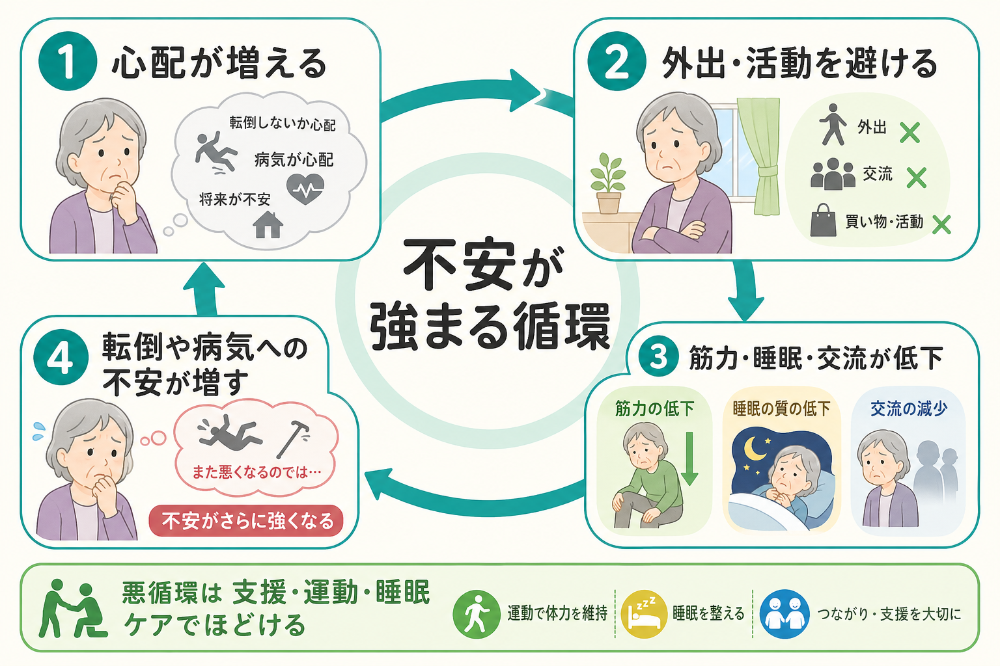

# 高齢者の不安症はどう現れるのか

## 要点

- 高齢者の不安症は、「不安です」という訴えよりも、身体疾患への心配、検査・受診の反復、転倒への恐怖、外出回避、眠れなさ、孤立として現れやすい。
- 身体疾患、疼痛、薬剤、認知機能低下、喪失体験、介護負担が絡むため、若年成人と同じ症状リストだけでは見落としやすい。
- 転倒恐怖や睡眠問題は単なる随伴症状ではなく、活動低下、筋力低下、社会的孤立を介して不安を維持する。
- 評価では「診断名を当てる」だけでなく、生活範囲、身体疾患、睡眠、服薬、認知機能、支援資源を同時に見る必要がある。
- 本稿は教育・研究目的の整理であり、個別の診断や治療指示ではない。

## この記事で答える問い

高齢者の不安症は、なぜ若年成人と違って見えやすいのか。とくに、身体疾患への心配、転倒恐怖、孤立、睡眠問題は、不安症の中でどのような意味を持つのか。

## まず結論

高齢者の不安症は、主観的な「心配」の強さだけでなく、生活の縮小として読むと理解しやすい。たとえば、心疾患やがんへの心配から受診を繰り返す、転ぶのが怖くて外出を避ける、配偶者や友人を失って相談先が減る、夜間覚醒後に考えごとが止まらなくなる、といった形で表面化する。これらは別々の問題に見えても、[[不安症群とは何か]]、[[全般不安症とは何か]]、[[病気不安症とは何か]]、[[睡眠障害は脳機能にどのような影響を与えるのか]]にまたがる共通の悪循環を作る。

## 背景

高齢期には、慢性疾患、痛み、退職、収入変化、配偶者との死別、介護役割、移動能力の低下が重なりやすい。WHOは、70歳以上の成人で精神疾患が一定の負担を持ち、孤独や社会的孤立が高齢期のメンタルヘルスの重要なリスク因子であると整理している[1]。したがって、高齢者の不安は「心配性」という性格だけに還元できない。

一方で、高齢者の不安症は過小認識されやすい。身体疾患が多いほど、動悸、息苦しさ、めまい、胃腸症状、疲労、睡眠障害が「年齢のせい」「持病のせい」と見なされやすく、精神症状としての不安が背景にあるかどうかが見えにくくなる[2][3]。この点は、[[不安症とうつ病はどう併存するのか]]や[[うつ病と認知症はどう鑑別するのか]]と同じく、症状の重なりを慎重に扱う必要がある。

## 基本概念

### 身体疾患への心配

高齢者では、健康に関する心配が現実的な根拠を持つことが少なくない。実際に高血圧、糖尿病、心疾患、脳血管疾患、がん治療後、慢性疼痛などがある場合、「病気が悪化するのではないか」という心配は自然に生じる。しかし、心配が過度に長く続き、検査結果で一時的に安心してもすぐ別の病気を疑う、身体感覚を過剰に監視する、日常活動が狭まる場合には、[[病気不安症とは何か]]や[[全般不安症とは何か]]との連続性を考える。

健康不安は高齢期で過小診断されやすく、身体疾患の併存が評価を複雑にする[4]。重要なのは、「身体疾患があるから不安ではない」とも、「不安だから身体疾患はない」とも決めつけないことである。医療的評価と心理社会的評価を並行させる。

### 転倒恐怖

転倒恐怖は、実際に転倒歴がある人だけでなく、転倒を見聞きした人、筋力低下やめまいを感じる人にも生じる。転倒恐怖は高齢者で広くみられ、身体機能低下、抑うつ症状、過去の転倒と関連し、将来の転倒、機能低下、生活範囲の縮小とも結びつく[5]。したがって、転倒恐怖は「慎重でよいこと」とだけ見るのではなく、活動を避けすぎて筋力やバランスがさらに落ちる悪循環を評価する必要がある。

### 孤立・喪失

高齢期の不安は、つながりの変化と深く関わる。配偶者や友人の死、退職、免許返納、感覚機能の低下、デジタル機器へのアクセス困難は、相談先と活動機会を減らす。WHOは、孤独と社会的孤立が身体的・精神的健康、生活の質、寿命に影響する公衆衛生上の課題であり、高齢者でも約1割が孤独を経験し、約4分の1が社会的に孤立していると報告している[6]。

孤立は不安の原因にも結果にもなる。不安が強いと外出や連絡を避け、避けるほど他者からの安心材料や現実検討の機会が減り、さらに不安が強まる。

### 睡眠問題

睡眠問題は高齢者の不安症で非常に重要である。高齢期には睡眠が浅くなり、夜間覚醒や早朝覚醒が増えやすいが、不安があると覚醒後の反すうや身体感覚への注意が強まりやすい。全般不安症の高齢者を対象にした研究では、睡眠への不満が非常に高頻度で、睡眠障害の重症度も高かった[7]。また、高齢者の不眠には医学的要因、薬剤、痛み、概日リズム変化、心理社会的要因が重なりやすい[8]。

## 仕組み

高齢者の不安症は、しばしば「脅威の評価」と「回避」の循環として維持される。

1. 身体感覚、転倒の記憶、夜間覚醒、孤立感が脅威として評価される。
2. 不安を下げるために、受診反復、血圧・脈拍の確認、外出回避、家族への確認、昼寝の増加などが起こる。
3. 一時的には安心するが、活動量、筋力、睡眠圧、社会的接触が減る。
4. 生活機能が落ちることで、「やはり危ない」「一人では無理だ」という予測が強くなる。

この循環は、扁桃体を中心とした脅威検出、前頭前野による再評価、身体感覚への注意、睡眠・覚醒調節が相互に関わる。神経機構としては[[扁桃体過活動は不安症やPTSDにどう関わるのか]]、[[ノルアドレナリン系は不安と覚醒にどう関わるのか]]、[[前頭頭頂ネットワークは認知制御をどう支えるのか]]とも接続できる。

## 図解

図1は、高齢者の不安症が身体疾患への心配、転倒恐怖、孤立・喪失、睡眠問題として現れやすいことを示す。図2は、不安が回避を生み、回避が活動・睡眠・交流を弱め、さらに不安を強める循環を示す。

画像を使わずに把握するなら、次の表が要点になる。

| 表れ方 | よく見える訴え | 評価で確認する点 |
|---|---|---|
| 身体疾患への心配 | 「検査は大丈夫と言われたが、まだ心配」 | 実際の疾患、薬剤、身体感覚の監視、受診反復 |
| 転倒恐怖 | 「転ぶのが怖くて外に出ない」 | 転倒歴、筋力、バランス、活動範囲、家屋環境 |
| 孤立・喪失 | 「相談できる人がいない」 | 死別、退職、移動手段、家族関係、地域資源 |
| 睡眠問題 | 「夜中に起きると考えが止まらない」 | 不眠型、昼寝、痛み、薬剤、睡眠時無呼吸、抑うつ |

## 臨床・研究との接続

臨床では、まず身体疾患と薬剤の評価を省かない。高齢者の不安症状には、心肺疾患、内分泌疾患、神経疾患、薬剤性の焦燥や不眠が紛れ込むことがある[2]。同時に、身体疾患があるからといって心理的介入が不要になるわけではない。むしろ、疾患管理、活動調整、家族支援、心理教育を組み合わせる必要がある。

評価面では、若年成人向けの不安尺度をそのまま使うと、身体症状項目が持病の影響を拾いすぎたり、逆に高齢者特有の心配を拾いきれなかったりする[3]。問診では、症状名よりも「何を避けるようになったか」「安心確認は増えたか」「眠れない夜に何を考えるか」「誰に相談できるか」を聞くと、生活機能とのつながりが見えやすい。

研究上は、転倒恐怖、健康不安、孤独、不眠を別個の領域として測るだけでなく、それらが同じ人の中でどう循環するかを追跡することが重要である。生活機能、移動、睡眠、社会的ネットワークを含めた縦断研究は、老年期の不安症をライフスパン精神医学の対象として扱ううえで有用である。ここは[[ライフスパン精神医学とは何か]]の具体例でもある。

## よくある誤解

### 「高齢者なら心配が増えて当然なので、治療対象ではない」

現実的な心配と、生活を狭める不安は区別する。病気や転倒のリスクが現実にあっても、不安への対処が活動低下、睡眠悪化、孤立を強めている場合は支援対象になる。

### 「身体症状があるなら精神症状ではない」

身体疾患と不安は排他的ではない。身体疾患が不安を引き起こすことも、不安が身体感覚の監視を強めることもある。鑑別は一回の説明で終わらず、経過と生活機能を追う。

### 「転倒恐怖は安全行動なので放置してよい」

適切な注意は必要だが、過度の回避は筋力低下、バランス低下、外出機会の減少を招き、かえって転倒リスクや不安を強めうる[5]。安全確保と活動維持を同時に考える。

### 「眠れなさは年齢のせい」

加齢に伴う睡眠変化はあるが、不眠が日中機能を損ない、不安や反すうを強めるなら評価が必要である。高齢者の不眠は、身体疾患、薬剤、生活リズム、心理的要因を含めて整理する[8]。

## 関連ノート

- [[ライフスパン精神医学とは何か]]
- [[不安症群とは何か]]
- [[全般不安症とは何か]]
- [[病気不安症とは何か]]
- [[不安症とうつ病はどう併存するのか]]
- [[うつ病と認知症はどう鑑別するのか]]
- [[睡眠障害は脳機能にどのような影響を与えるのか]]
- [[扁桃体過活動は不安症やPTSDにどう関わるのか]]
- [[ノルアドレナリン系は不安と覚醒にどう関わるのか]]

### MOC更新候補

- `content/00_MOC/MOC｜精神医学.md`
- `content/00_MOC/MOC｜認知科学・心理学.md`

### 今後の作成候補

- 高齢者のうつ病はどう現れるのか
- 転倒恐怖とは何か
- 高齢者の孤独と精神健康
- 老年期の不眠はどう評価するのか
- 高齢者の病気不安はどう評価するのか

## 理解チェック

1. 高齢者の不安症が「身体疾患への心配」として現れたとき、身体疾患を否定するだけでは不十分なのはなぜか。
2. 転倒恐怖が強い人で、外出回避が長期化するとどのような悪循環が起こりうるか。
3. 孤立は不安の原因と結果の両方になりうる。具体例を一つ挙げよ。
4. 高齢者の不眠を評価するとき、心理的要因以外に確認すべき項目は何か。
5. 「加齢による自然な心配」と「支援対象となる不安」を分ける実用的な基準は何か。

## 未解決問題

- 高齢者の不安症において、健康不安、転倒恐怖、孤独、不眠がどの順序で悪循環を作るのかは、個人差が大きい。
- 身体疾患を持つ高齢者で、不安尺度の身体症状項目をどう解釈するかには測定上の課題が残る。
- 独居、認知機能低下、感覚障害、デジタル格差を含む支援モデルは、地域資源に依存するため一般化が難しい。

## 参考文献

[1] World Health Organization. (2025). *Mental health of older adults*. https://www.who.int/westernpacific/newsroom/fact-sheets/detail/mental-health-of-older-adults

[2] Porensky, E. K., Dew, M. A., Karp, J. F., Skidmore, E., Rollman, B. L., Shear, M. K., Lenze, E. J. (2009). Medical conditions and depressive, anxiety, and somatic symptoms in older adults with and without generalized anxiety disorder. *Aging & Mental Health, 13*(6), 764-768. https://pmc.ncbi.nlm.nih.gov/articles/PMC4066633/

[3] Balsamo, M., Cataldi, F., Carlucci, L., & Fairfield, B. (2018). Assessment of anxiety in older adults: a review of self-report measures. *Clinical Interventions in Aging, 13*, 573-593. https://doi.org/10.2147/CIA.S114100

[4] El-Gabalawy, R., Mackenzie, C. S., Thibodeau, M. A., Asmundson, G. J. G., & Sareen, J. (2013). Health anxiety disorders in older adults: conceptualizing complex conditions in late life. *Clinical Psychology Review, 33*(8), 1096-1105. https://doi.org/10.1016/j.cpr.2013.08.010

[5] MacKay, S., Ebert, P., Harbidge, C., & Hogan, D. B. (2021). Fear of Falling in Older Adults: A Scoping Review of Recent Literature. *Canadian Geriatrics Journal, 24*(4), 379-394. https://doi.org/10.5770/cgj.24.521

[6] World Health Organization. (2025). *Reducing social isolation and loneliness among older people*. https://www.who.int/health-topics/ageing/reducing-social-isolation-and-loneliness-among-older-people

[7] Brenes, G. A., Miller, M. E., Stanley, M. A., Williamson, J. D., Knudson, M., & McCall, W. V. (2009). Insomnia in older adults with generalized anxiety disorder. *The American Journal of Geriatric Psychiatry, 17*(6), 465-472. https://doi.org/10.1097/JGP.0b013e3181987747

[8] Patel, D., Steinberg, J., & Patel, P. (2018). Insomnia in the Elderly: A Review. *Journal of Clinical Sleep Medicine, 14*(6), 1017-1024. https://doi.org/10.5664/jcsm.7172
