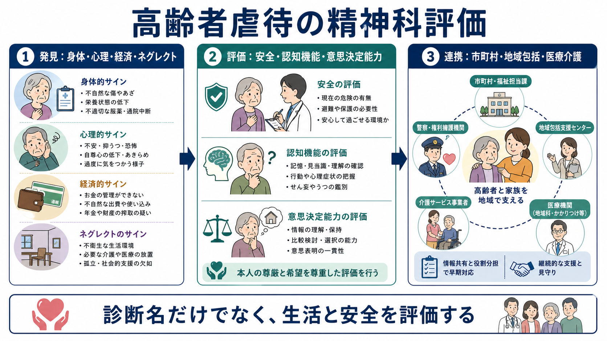
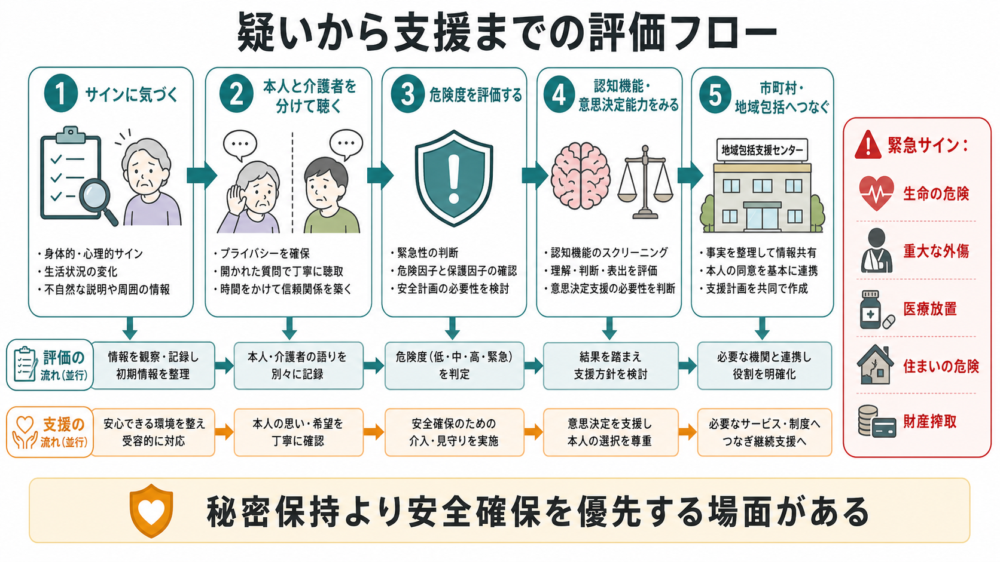

# 高齢者虐待は精神科でどう評価するのか

## 要点

- 高齢者虐待は、身体的暴力だけではなく、心理的虐待、性的虐待、経済的虐待、介護・世話の放棄、医療や生活上の必要を満たさないネグレクトを含む。WHOは、信頼関係のある関係の中で起こり、高齢者に害や苦痛をもたらす単回または反復の行為、または適切な行為の欠如として整理している[1]。
- 精神科では「虐待かどうかを断定する」前に、本人の安全、認知機能、せん妄・認知症・うつ・精神病症状、意思決定能力、介護者の負担、経済管理、生活環境を同時に評価する。
- 日本では、市町村が高齢者虐待対応の中心的な実施主体となる。医療者は、疑いを抱いた段階で記録し、本人の同意を尊重しつつも、生命・身体・財産の危険が高い場合には市町村、地域包括支援センター、警察、救急医療などと連携する必要がある[2]。
- スクリーニング尺度は補助であり、陰性なら安心、陽性なら虐待確定という道具ではない。EASIのような短時間質問票は「疑いを立てる」助けにはなるが、精査と支援につなぐ設計が必要である[7]。
- 本記事は教育・研究目的の整理であり、個別事例の診断、法的判断、通報要否の最終判断を代替しない。

## この記事で答える問い

1. 精神科で高齢者虐待を疑うサインは何か。
2. 身体的・心理的・経済的虐待、ネグレクトをどう区別し、重なりをどう見るのか。
3. 認知症、せん妄、うつ、精神病症状、意思決定能力は評価にどう関わるのか。
4. 本人の希望と安全確保がぶつかるとき、何を記録し、どこにつなぐのか。

## まず結論

高齢者虐待の精神科評価は、「虐待の有無を尋問する面接」ではない。本人が安全に話せる環境を作り、身体所見、精神症状、認知機能、生活機能、金銭管理、介護関係、支援資源を時系列で整理し、危険度に応じて地域の保護・支援システムへつなぐ作業である。虐待はしばしば隠れ、本人が否認したり、介護者をかばったり、認知機能低下のために説明が揺れたりする。したがって、本人の語りを尊重しながらも、単一の説明に依存せず、観察、診察、家族・支援者情報、介護サービス記録、薬局・かかりつけ医情報を統合する。

## 背景

高齢者虐待は公衆衛生、精神医学、老年医学、介護、法制度が交差する問題である。WHOは、地域で暮らす60歳以上の約6人に1人が過去1年に何らかの虐待を経験したと推定している[1]。施設や長期ケアの場では把握がさらに難しく、報告される数字は氷山の一角である。被害を受ける高齢者は、依存、孤立、羞恥、報復への恐怖、家族関係の維持、認知機能低下などにより、被害を語れないことがある。

精神科が関わる理由は三つある。第一に、うつ、不安、PTSD様症状、睡眠障害、希死念慮、精神病症状、せん妄、認知症が虐待の結果としても背景因子としても現れるからである。第二に、本人の判断・記憶・見当識・理解力が、支援の同意や保護の必要性に直結するからである。第三に、介護者側の精神疾患、物質使用、介護負担、経済的依存が、虐待リスクと結びつくことがあるからである。医師との接触は、孤立した被害者を発見し多職種対応へつなぐ重要な機会にもなる[4][5]。

## 基本概念

高齢者虐待は、単一の行為類型ではなく、複数の害が重なる臨床状況として扱う。CDCは高齢者虐待を、信頼される人による意図的行為または不作為で、高齢者に害や害のリスクを作るものとして説明し、身体的虐待、性的虐待、心理的虐待、ネグレクト、経済的虐待を主要類型として挙げる[3]。日本の高齢者虐待防止法の実務でも、身体的虐待、介護・世話の放棄・放任、心理的虐待、性的虐待、経済的虐待を区別しつつ、早期発見と市町村対応が重視される[2]。

| 類型 | 精神科で見るサイン | 評価の焦点 |
|---|---|---|
| 身体的虐待 | 説明と合わない外傷、複数時期のあざ、受診遅れ、過鎮静 | 外傷の時系列、薬剤、転倒との鑑別、緊急性 |
| 心理的虐待 | 怯え、萎縮、抑うつ、不安、不眠、介護者の前で話せない | 本人単独面接、脅し・侮辱・隔離の有無 |
| 経済的虐待 | 年金や預金の使途不明、急な契約、本人が生活費を使えない | 金銭管理能力、代理人、通帳・カード管理 |
| ネグレクト | 低栄養、脱水、不衛生、服薬中断、医療放置 | 介護能力、支援不足、セルフネグレクトとの区別 |
| 性的虐待 | 説明困難な性器症状、恐怖、急な行動変化 | 安全確保、身体診察、トラウマ配慮、専門機関連携 |

重要なのは、類型を機械的に分類することではない。たとえば、認知症のある人の年金を家族が管理し、本人に十分な食事や医療を提供していない場合、経済的虐待とネグレクトが同時に起こりうる。心理的虐待は、身体的外傷がないため見逃されやすいが、抑うつ、不安、孤立、希死念慮と結びつくことがある。

## 仕組み

虐待は「悪意ある加害者」と「無力な被害者」だけで説明すると見誤る。リスクは、本人側、介護者側、関係性、環境の層で積み上がる。地域在住高齢者を対象にした系統的レビューでは、本人側の認知機能低下、行動症状、精神的問題、身体的フレイル、低所得、過去のトラウマ、介護者側の負担や精神的問題、家族不和、低い社会的支援などが反復してリスク因子として報告されている[5]。この視点は、[[ライフスパン精神医学とは何か]]のように、年齢だけでなく生活史、身体疾患、社会的文脈を合わせて見る態度と相性がよい。

精神科で特に重要なのは、認知機能と意思決定能力である。認知症やせん妄があると、被害を説明する力、危険を見積もる力、支援を受け入れる力が低下することがある。一方で、認知機能低下があるからといって、本人の語りを無効にしてよいわけではない。意思決定能力は全か無かではなく、特定の判断について、理解、認識、比較検討、選択の表明を評価する機能的概念である[8]。この点は、[[認知機能低下はどのように評価するのか]]、[[せん妄とは何か]]、[[認知症とは何か]]と接続して考える必要がある。

## 図解

図1は、高齢者虐待評価を「発見」「評価」「連携」の三層で示している。発見では、身体的サインだけでなく、心理的萎縮、金銭管理の変化、ネグレクトを拾う。評価では、安全、認知機能、意思決定能力、精神症状、身体疾患を分けて見る。連携では、市町村、地域包括支援センター、医療機関、介護サービス、必要時の警察・権利擁護機関が役割を分担する。

図2は、疑いを持った後の実務フローである。本人と介護者を分けて聴くこと、緊急サインを先に見ること、認知機能と意思決定能力を評価すること、そして記録と情報共有を支援へつなぐことが中心になる。

## 臨床・研究との接続

### 面接

面接では、最初から「虐待されていますか」と迫るより、生活の変化から入るほうがよいことが多い。「食事や薬は予定通り取れていますか」「お金を自分のために使えていますか」「家で怖い思いをすることはありますか」「介護してくれる人との関係で困っていることはありますか」といった開かれた質問で始める。本人と介護者は可能な範囲で別々に聴く。介護者の前では本人が話せないことがあるからである。

記録では、解釈より事実を優先する。「長男が虐待している」と断定する前に、「右上腕に直径3cmの紫斑が2個」「本人は『昨日つかまれた』と述べた」「同席者は『転んだ』と説明」「受診まで48時間経過」のように、観察、本人発言、第三者説明、時間軸を分ける。写真記録や身体診察が必要な場合は、施設方針と法的・倫理的手続きを確認する。

### 危険度

危険度評価では、生命の危険、重篤な外傷、医療放置、脱水・低栄養、住環境の危険、財産搾取、閉じ込め、脅迫、希死念慮、自傷他害、介護者の暴力・物質使用、武器へのアクセスを確認する。緊急性が高い場合、通常の同意取得や外来フォローだけでは不十分であり、救急、保護、市町村、警察との連携を検討する[2]。

### スクリーニング

USPSTFは、2025年時点で、虐待やネグレクトの徴候がない高齢者・脆弱成人に対する一律スクリーニングについて、利益と害のバランスを判断するには証拠不十分としている[6]。これは「聞かなくてよい」という意味ではない。むしろ、症状、外傷、生活機能低下、金銭問題、不自然な説明など、臨床的なサインがあるときには、系統的に評価し、支援につなぐ必要がある。

EASIは、認知機能が保たれた外来高齢者に短時間で使えるよう開発された疑い検出ツールであり、医師が虐待の可能性に気づくための補助として位置づけられる[7]。ただし、感度は十分に高いとは言い切れず、認知症、せん妄、急性期、施設場面、言語・文化差がある場面では、尺度だけに依存しない。

### 連携

精神科医療だけで虐待対応を完結させることはできない。市町村、地域包括支援センター、介護支援専門員、訪問看護、かかりつけ医、薬局、法律・権利擁護、成年後見、警察、救急医療が、それぞれ異なる情報と権限を持つ。厚生労働省の国マニュアルは、未然防止、早期発見、迅速かつ適切な対応、再発防止を目的に、市町村・都道府県の対応と養護者支援を整理している[2]。

精神科が提供できる貢献は、診断名の付与だけではない。本人の精神症状、認知機能、意思決定能力、リスク、治療可能なせん妄・うつ・不眠、介護者の精神的限界を評価し、「どの支援が今すぐ必要か」を言語化することである。

## よくある誤解

### 誤解1: 外傷がなければ虐待ではない

心理的虐待、経済的虐待、ネグレクトでは、目立つ外傷がないことが多い。むしろ、急な抑うつ、不安、不眠、萎縮、孤立、服薬中断、受診遅れ、生活費の不足が重要なサインになる。

### 誤解2: 認知症の人の証言は信用できない

認知機能低下は記憶や時間順序の誤りを増やすが、苦痛や恐怖の訴えを無視してよい理由にはならない。必要なのは、本人の語りを尊重しつつ、観察、身体所見、生活記録、第三者情報を統合することである。

### 誤解3: 介護者を責めれば解決する

虐待対応には保護と責任追及が必要な場面がある。一方で、介護者の孤立、睡眠不足、精神疾患、物質使用、経済的困窮、支援不足が背景にある場合、養護者支援を組み込まないと再発防止につながらない[2][5]。

### 誤解4: 本人が「大丈夫」と言えば介入できない

本人の意思は最大限尊重する。しかし、生命・身体・財産の重大な危険、意思決定能力の低下、脅迫や支配、医療放置が疑われる場合は、本人の表明だけで安全と判断しない。何について同意・拒否しているのか、理解と比較検討が保たれているのか、選択が一貫しているのかを評価する[8]。

## 関連ノート

- [[ライフスパン精神医学とは何か]]
- [[虐待は発達と精神疾患にどう影響するのか]]
- [[虐待リスクを精神科でどう評価するか]]
- [[認知機能低下はどのように評価するのか]]
- [[認知症とは何か]]
- [[せん妄とは何か]]
- [[遅発性精神病とは何か]]

MOC更新候補: バッチ統合時に `content/00_MOC/` 配下の精神医学、総論・診断・面接、老年精神医学、地域精神医療に関するMOCへ追加する。

## 理解チェック

1. 高齢者虐待の評価で、本人と介護者を分けて聴く理由は何か。
2. 身体的虐待、心理的虐待、経済的虐待、ネグレクトはどのように重なりうるか。
3. 認知機能低下がある本人の訴えを、どのように尊重しつつ検証するか。
4. 秘密保持より安全確保を優先すべき可能性があるサインは何か。
5. 精神科が地域連携に提供できる情報は、診断名以外に何があるか。

## 未解決問題

- 高齢者虐待の一律スクリーニングが、実際に安全、生活機能、精神健康、再発防止を改善するかについては、なお研究が限られている。
- 認知症がある人の経済的虐待や心理的虐待を、本人の自己決定を尊重しながら早期に把握する実装方法は十分に確立していない。
- 日本の地域包括ケアの中で、精神科、老年医学、介護、法的支援、警察、金融機関がどの情報をどのタイミングで共有するのが最も安全で侵襲が少ないかは、地域差を含めて検討が必要である。

## 参考文献

[1] World Health Organization. Abuse of older people. 15 June 2024. https://www.who.int/news-room/fact-sheets/detail/abuse-of-older-people

[2] 厚生労働省. 市町村・都道府県における高齢者虐待への対応と養護者支援について（国マニュアル）. https://www.mhlw.go.jp/stf/seisakunitsuite/bunya/0000200478_00004.html

[3] Centers for Disease Control and Prevention. About Abuse of Older Persons. Updated Nov 7, 2024. https://www.cdc.gov/elder-abuse/about/index.html

[4] Lachs MS, Pillemer KA. Elder Abuse. *New England Journal of Medicine*. 2015;373(20):1947-1956. https://doi.org/10.1056/NEJMra1404688

[5] Johannesen M, LoGiudice D. Elder abuse: a systematic review of risk factors in community-dwelling elders. *Age and Ageing*. 2013;42(3):292-298. https://doi.org/10.1093/ageing/afs195

[6] US Preventive Services Task Force. Intimate Partner Violence and Caregiver Abuse of Older or Vulnerable Adults: Screening. Final Recommendation Statement. June 24, 2025. https://www.uspreventiveservicestaskforce.org/uspstf/index.php/recommendation/intimate-partner-violence-and-abuse-of-elderly-and-vulnerable-adults-screening

[7] Yaffe MJ, Wolfson C, Lithwick M, Weiss D. Development and validation of a tool to improve physician identification of elder abuse: the Elder Abuse Suspicion Index (EASI). *Journal of Elder Abuse & Neglect*. 2008;20(3):276-300. https://doi.org/10.1080/08946560801973168

[8] Appelbaum PS, Grisso T. Assessing patients' capacities to consent to treatment. *New England Journal of Medicine*. 1988;319(25):1635-1638. https://doi.org/10.1056/NEJM198812223192504
