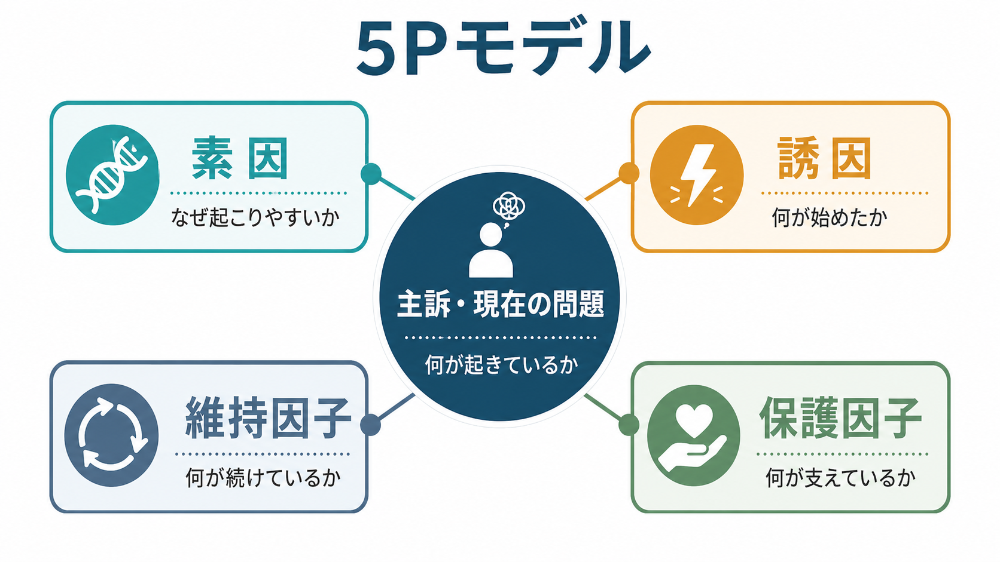
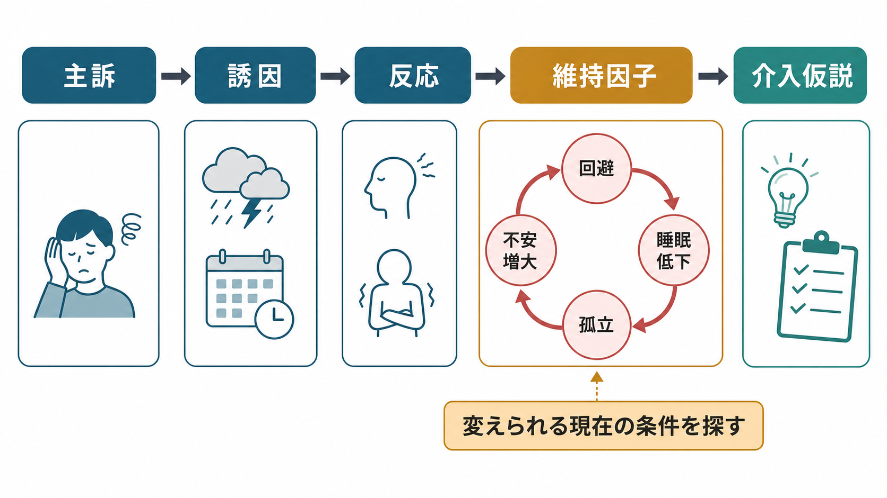
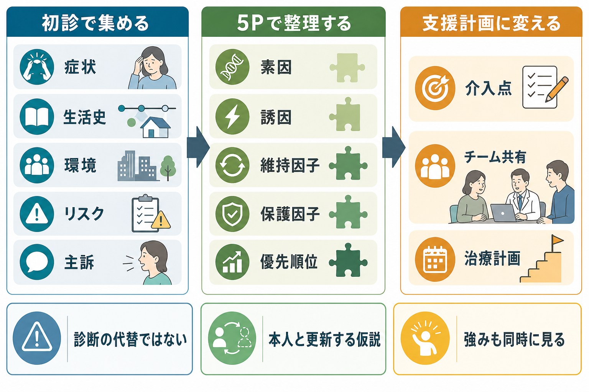

# 5Pモデルとは何か

## 要点

- 5Pモデルは、精神科面接や心理療法で得た情報を「主訴・現在の問題」「素因」「誘因」「維持因子」「保護因子」に分けて整理する[[ケースフォーミュレーションとは何か|ケースフォーミュレーション]]の型である[1]。
- 目的は、診断名を置き換えることではなく、「なぜこの人が、いま、この問題で困っているのか」を本人・家族・多職種チームで共有できる仮説にすることである[1][2]。
- 特に重要なのは維持因子である。過去の原因を一つに決めるより、現在も困りごとを続けている条件を見つける方が、支援計画に結びつきやすい[1][4]。
- 保護因子は「問題が軽い」という意味ではない。本人の強み、関係性、生活資源、価値、治療関係など、リスクと同時に見落としてはいけない回復資源である[1][5]。
- 5Pモデルは教育・研究・臨床推論のための整理枠であり、個別の診断や治療指示そのものではない。

## この記事で答える問い

この記事では、次の問いに答える。

1. 5Pモデルは何を整理するための道具か。
2. 5つのPは、それぞれどのような情報を指すのか。
3. 診断、[[生物心理社会モデルとは何か|生物心理社会モデル]]、[[主訴はどのように聞くべきか|主訴の聴取]]とどうつながるのか。
4. 臨床で使うとき、どこに注意すべきか。

## まず結論

5Pモデルとは、主訴をめぐる情報を「現在何が問題か」「起こりやすくした背景は何か」「始まりのきっかけは何か」「今も続けている条件は何か」「支えている資源は何か」に分ける定式化方法である。Macneilらは、精神保健では診断だけで介入の優先順位を決めるには限界があり、本人に固有の寄与因子と強みを含めて整理することが、より個別化された支援につながると述べている[1]。

ここでの「モデル」は、疾患の唯一の原因を断定する理論ではない。むしろ、面接で得られた情報を一時的な作業仮説として並べ、本人と確認しながら更新するための地図である。したがって、5Pモデルの良し悪しは、項目が埋まっているかどうかよりも、本人にとって意味が通り、支援の優先順位を考える役に立つかどうかで決まる[2][4]。

## 背景

精神医学では、診断名は重要である。診断は症状群、経過、鑑別、リスク、治療選択、制度利用を共有するための言語になる。一方で、同じ診断名でも、困りごとの始まり方、生活への影響、維持している条件、使える資源は大きく異なる。たとえば、同じ不安症状でも、睡眠不足、回避、職場負荷、家庭内葛藤、身体疾患、トラウマ体験、孤立、薬物使用、完璧主義的な信念など、介入すべき場所は人によって異なる。

この限界を補う枠組みとして、ケースフォーミュレーションが用いられる。ケースフォーミュレーションは、評価と治療・支援の橋渡しであり、本人の経験、臨床理論、研究知見を統合して、困りごとがどのように生じ、維持され、どこから変えられるかを整理する作業である[1][4]。英国心理学会のガイドラインも、心理学的定式化を、本人の困難を理解し、支援方針を組み立て、関係者の共有理解を作る中核的な実践として位置づけている[2]。

5Pモデルは、この定式化を比較的短時間で構造化するための形式である。背景には、疾患を生物学的異常だけでなく、心理、行動、対人関係、社会環境との相互作用として理解する[[生物心理社会モデルとは何か|生物心理社会モデル]]がある。Engelは、従来の生物医学モデルだけでは、病を持つ人の経験、生活条件、医療関係、社会的文脈を十分に扱えないと批判し、生物心理社会モデルを提案した[3]。5Pモデルは、この広い見方を、面接記録やチーム共有に使いやすい形へ落とし込む道具と考えられる。

## 基本概念

### 1. 主訴・現在の問題

主訴・現在の問題は、本人がいま困っていること、生活上の支障、周囲が心配していること、臨床的に優先して扱うべきリスクを含む。診断名だけではなく、「何が、どの場面で、どの程度、生活を妨げているか」を具体化する。

たとえば「うつ病」だけではなく、「朝起きられず欠勤が増えている」「家族への罪悪感が強く、相談を避けている」「希死念慮が夜間に強まる」などと書く。ここは[[主訴はどのように聞くべきか|主訴の聴取]]、[[現病歴はどのように構造化するべきか|現病歴の構造化]]、[[精神科初診で何を確認するべきか|初診評価]]と直結する。

### 2. 素因

素因は、問題が起こりやすくなる背景条件である。生物学的脆弱性、家族歴、発達歴、気質、認知スタイル、愛着、トラウマ、慢性疾患、社会経済的困難、差別経験、文化的背景などが含まれる[1]。

素因は「本人の欠点」ではない。むしろ、長期的な背景を理解し、どのような負荷に弱く、どのような支援が必要になりやすいかを推測するための情報である。[[素因ストレスモデルとは何か|素因ストレスモデル]]や[[ストレス脆弱性モデルとは何か|ストレス脆弱性モデル]]は、この項目を理解する補助線になる。

### 3. 誘因

誘因は、現在の困りごとが始まる、または悪化するきっかけである。喪失、失業、進学、出産、身体疾患、薬剤変更、対人葛藤、睡眠リズムの乱れ、トラウマ想起、物質使用、ライフイベントなどが該当する。

誘因は、必ずしも「原因のすべて」ではない。すでに脆弱性や負荷がある状態で、最後にバランスを崩した出来事として働くことが多い。誘因を把握すると、本人が「なぜ今つらくなったのか」を理解しやすくなり、再発予防や危機対応の手がかりにもなる。

### 4. 維持因子

維持因子は、問題を現在も続けている条件である。回避、反すう、睡眠不足、過活動、孤立、家族内の悪循環、職場の負荷、薬物・アルコール使用、治療中断、スティグマ、経済的不安、身体症状への過度の注意などが含まれる。

5Pモデルで最も実践的に重要なのは、しばしばこの維持因子である。素因や誘因は変えにくいことが多いが、維持因子は現在の生活、行動、関係、環境の中にあり、介入可能性を検討しやすい。たとえば「不安があるから外出できない」だけでなく、「外出を避けるため短期的には安心するが、長期的には不安と自信低下が続く」という循環として見ると、支援の焦点が明確になる[1][4]。

### 5. 保護因子

保護因子は、困りごとを悪化させにくくし、回復を支える要素である。本人の価値、得意な対処、過去に乗り越えた経験、信頼できる関係、家族・友人・学校・職場の支援、医療アクセス、経済的資源、趣味、信仰、地域資源、治療への希望などが含まれる[1][5]。

保護因子を入れる理由は、単に「よい面も見る」ためではない。強みを含めた定式化は、本人が理解されている感覚、協働的な治療関係、現実的な支援計画に関わる。Kuykenらの協働的ケース概念化でも、問題だけでなく強みを各段階で組み込むことが重視されている[4][5]。

## 仕組み

5Pモデルは、情報を5つの箱に分けるだけの表ではない。実際には、次のような推論の流れを作る。

| 項目 | 中心の問い | 例 |
|---|---|---|
| 主訴・現在の問題 | いま何に困っているか | 不眠、欠勤、希死念慮、家族葛藤 |
| 素因 | なぜ起こりやすかったか | 家族歴、発達特性、慢性ストレス、過去のトラウマ |
| 誘因 | 何が始まり・悪化のきっかけか | 失職、喪失、身体疾患、対人葛藤 |
| 維持因子 | 何が続けているか | 回避、孤立、反すう、睡眠低下、治療中断 |
| 保護因子 | 何が支えているか | 支援者、価値、治療関係、過去の成功体験 |

この表を埋めたあとに重要なのは、因果の線を引くことである。たとえば、「長期の完璧主義的信念」が素因としてあり、「職場異動」が誘因となり、「失敗を避けるための欠勤」が維持因子となり、「上司への相談経験」と「家族の支援」が保護因子になる、というように整理する。ここから「欠勤を責める」ではなく、「回避が短期的な安心をもたらす一方で、長期的には不安と職場復帰の困難を強めている」という仮説が立つ。

この仮説は、本人とすり合わせる必要がある。臨床家だけが作った定式化は、本人の経験からずれることがある。良い定式化は、本人の言葉を残し、専門用語を必要以上に増やさず、あとから修正できる形で共有される。実際、専門用語を避けた経験に近い言葉の定式化でも、一定の信頼性をもって評価できることが報告されている[7]。

## 図解

5Pモデルを使うときは、次の3段階で考えると実践しやすい。

1. 初診・面接で、症状、生活史、環境、リスク、本人の希望を集める。
2. 5Pで、主訴・素因・誘因・維持因子・保護因子に整理する。
3. 優先順位、介入点、チーム共有、本人との再確認へつなげる。

この流れは、[[精神科診断は何のためにあるのか|診断]]と対立しない。診断は症候群と鑑別の言語であり、5Pモデルはその人の困りごとがどのように生じ、どの条件で維持され、どこから支援できるかを考える言語である。両者を併用することで、診断名だけでも、雑多な生活情報だけでもない、臨床的に使える理解が作りやすくなる。

## 臨床・研究との接続

### 精神科面接

5Pモデルは、面接の質問リストとしても使える。ただし、機械的に「素因は何ですか」「誘因は何ですか」と聞くより、本人の語りから後で整理する方が自然である。面接では、まず[[治療関係とは何か|治療関係]]と安全を優先し、本人が何を問題と感じ、何を望んでいるかを確認する。そのうえで、生活史、家族歴、病前機能、病前性格、トラウマ歴、身体疾患、物質使用、社会資源などを、必要に応じて広げていく。

### 多職種チーム

多職種チームでは、5Pモデルが共有言語になる。医師は診断と薬物療法、心理職は認知・行動・感情の循環、看護師は日常生活と安全、精神保健福祉士は制度・住居・経済・家族支援、作業療法士は活動と役割を見やすい。5Pにまとめることで、誰がどの維持因子や保護因子に関わるかを話し合いやすくなる。

### 心理療法

CBTや支持的面接では、5Pモデルは治療目標の共有に役立つ。Kuykenらは、ケース概念化をCBTの基盤としつつ、本人との協働、時間とともに発展する概念化、強みの組み込みを重視している[4][5]。これは[[共同意思決定とは何か|共同意思決定]]、[[心理教育とは何か|心理教育]]、[[アドヒアランスとは何か|アドヒアランス]]とも接続する。

### 研究・教育

研究や教育では、5Pモデルは症例提示を構造化する枠組みになる。ただし、定式化の質は訓練に左右される。Eellsらの研究では、専門家・経験者・初心者の定式化の質に差が見られ、定式化は訓練可能な技能であることが示唆される[6]。したがって、5Pモデルを教えるときは、表を暗記させるだけでなく、根拠、代替仮説、本人との協働、更新可能性を含めて扱う必要がある。

## よくある誤解

### 誤解1: 5Pモデルは原因を一つに決める道具である

5Pモデルは、単一原因を探す道具ではない。精神的困難は、生物学的、心理的、社会的な複数の条件が相互作用して生じることが多い。むしろ5Pモデルは、原因を一つに絞りすぎないための枠組みである[1][3]。

### 誤解2: 素因を書くと本人を責めることになる

素因は責任追及ではない。家族歴、発達特性、養育環境、差別、貧困、慢性疾患などを含む背景条件を理解するための項目である。書き方が雑だと責める表現になりうるため、「性格が弱い」ではなく「対人評価に敏感になりやすい経験がある」など、観察可能で尊重的な表現にする。

### 誤解3: 保護因子は最後に少し書けばよい

保護因子は付け足しではない。安全計画、再発予防、心理教育、家族支援、職場調整、治療継続のどれにおいても、保護因子は介入の土台になる。特に[[自殺リスク評価では何を聞くべきか|自殺リスク評価]]では、リスク因子だけでなく、本人を生につなぎとめる要素、相談先、危機時の行動計画を同時に確認する必要がある。

### 誤解4: 5Pに入らない情報は不要である

5Pは整理のための枠であって、現実を完全に表すものではない。文化的背景、権力関係、制度的障壁、身体疾患、薬剤、発達特性、トラウマ、家族システムなど、重要な情報は必要に応じて補足する。枠に合わせて情報を削るのではなく、枠を使って重要な情報を見失わないようにする。

## 関連ノート

- [[ケースフォーミュレーションとは何か]]
- [[生物心理社会モデルとは何か]]
- [[主訴はどのように聞くべきか]]
- [[精神科初診で何を確認するべきか]]
- [[素因ストレスモデルとは何か]]
- [[ストレス脆弱性モデルとは何か]]
- [[生活歴はなぜ重要なのか]]
- [[家族歴から何がわかるのか]]
- [[病前機能とは何か]]
- [[病前性格とは何か]]
- [[治療関係とは何か]]
- [[共同意思決定とは何か]]
- [[心理教育とは何か]]
- [[アドヒアランスとは何か]]

## MOC更新候補

- `content/00_MOC/` 配下の精神医学、診断・面接、ケースフォーミュレーション関連 MOC があれば、本記事 `[[5Pモデルとは何か]]` を追加候補とする。
- 並列生成ジョブとの競合を避けるため、本タスクでは MOC ファイル自体は更新しない。

## 理解チェック

1. 5Pモデルで「素因」と「誘因」はどう違うか。
2. 維持因子を見つけると、なぜ支援計画が立てやすくなるか。
3. 保護因子を入れない定式化には、どのような臨床上の弱点があるか。
4. 5Pモデルは診断名とどのように併用できるか。
5. 本人と定式化を共有するとき、どのような表現上の配慮が必要か。

## 未解決問題

- 5Pモデルを使うことで、実際に治療成績や安全性がどの程度改善するかについては、診断や介入法ほど強いエビデンスが蓄積しているわけではない[4][6]。
- 定式化の質は臨床家の訓練、理論背景、面接時間、チーム文化に影響されるため、標準化と柔軟性のバランスが課題になる[2][6]。
- 本人と協働して作る定式化と、専門職間で共有する定式化の間には、表現の粒度や守秘の範囲に違いがある。どの情報を誰と共有するかは、同意と安全を踏まえて判断する必要がある。

## 参考文献

[1] Macneil, C. A., Hasty, M. K., Conus, P., & Berk, M. (2012). Is diagnosis enough to guide interventions in mental health? Using case formulation in clinical practice. *BMC Medicine, 10*, 111. https://doi.org/10.1186/1741-7015-10-111

[2] British Psychological Society, Division of Clinical Psychology. (2011). *Good Practice Guidelines on the use of psychological formulation*. https://doi.org/10.53841/bpsrep.2011.rep100

[3] Engel, G. L. (1977). The need for a new medical model: A challenge for biomedicine. *Science, 196*(4286), 129-136. https://doi.org/10.1126/science.847460

[4] Kuyken, W., Padesky, C. A., & Dudley, R. (2008). The science and practice of case conceptualization. *Behavioural and Cognitive Psychotherapy, 36*(6), 757-768. https://doi.org/10.1017/S1352465808004815

[5] Kuyken, W., Padesky, C. A., & Dudley, R. (2009). *Collaborative Case Conceptualization: Working Effectively with Clients in Cognitive-Behavioral Therapy*. Guilford Press. https://www.guilford.com/books/Collaborative-Case-Conceptualization/Kuyken-Padesky-Dudley/9781462504480

[6] Eells, T. D., Lombart, K. G., Kendjelic, E. M., Turner, L. C., & Lucas, C. P. (2005). The quality of psychotherapy case formulations: A comparison of expert, experienced, and novice cognitive-behavioral and psychodynamic therapists. *Journal of Consulting and Clinical Psychology, 73*(4), 579-589. https://doi.org/10.1037/0022-006X.73.4.579

[7] Sørbye, Ø., Dahl, H.-S. J., Eells, T. D., Amlo, S., Hersoug, A. G., Haukvik, U. K., Hartberg, C. B., Høglend, P. A., & Ulberg, R. (2019). Psychodynamic case formulations without technical language: A reliability study. *BMC Psychology, 7*, 67. https://doi.org/10.1186/s40359-019-0337-5

[8] APA Presidential Task Force on Evidence-Based Practice. (2006). Evidence-based practice in psychology. *American Psychologist, 61*(4), 271-285. https://doi.org/10.1037/0003-066X.61.4.271
