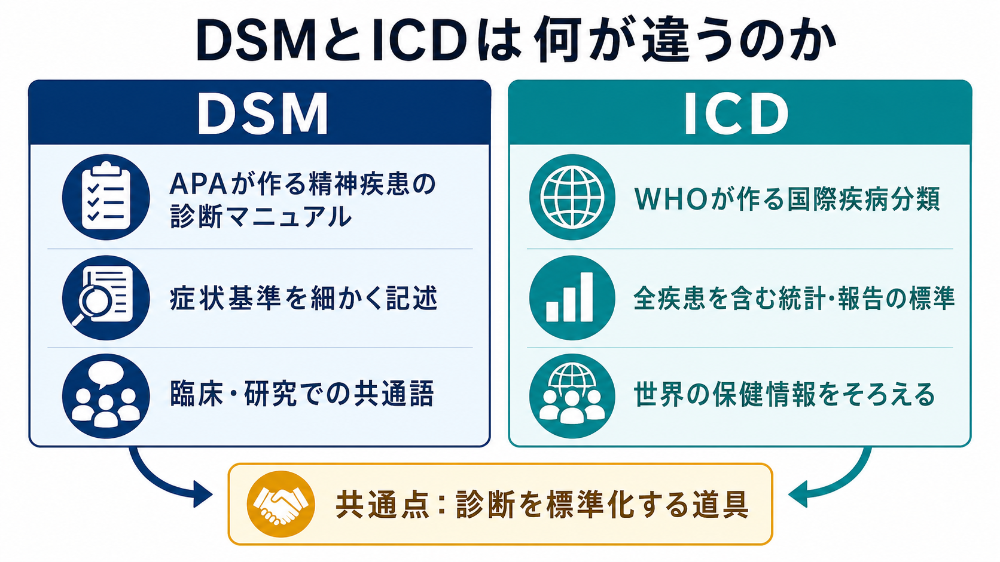
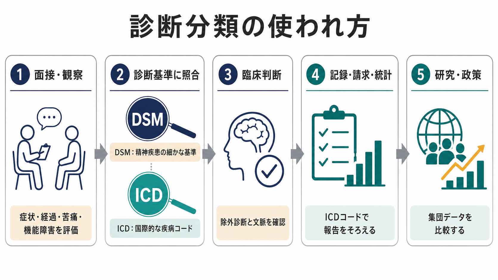
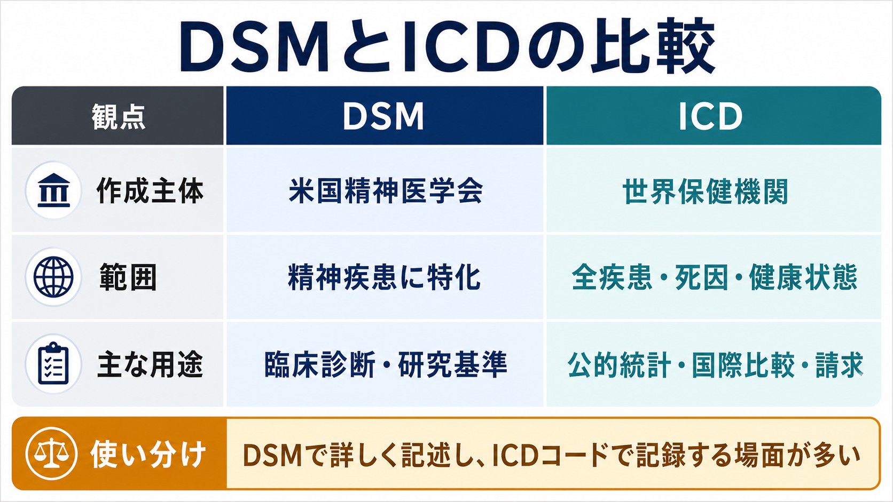

# DSMとICDは何が違うのか

## 要点

- DSMは、米国精神医学会が作る精神疾患の診断マニュアルであり、精神疾患を診断・分類するための記述と基準を詳しく示す。DSM-5-TRは2022年に公刊され、診断基準、説明文、文化関連情報、ICD-10-CMコードなどを更新した[1][2]。
- ICDは、世界保健機関が作る国際疾病分類であり、精神疾患だけでなく全疾患、死因、健康状態を記録・報告・比較するための国際標準である。ICD-11は2019年に世界保健総会で採択され、2022年1月から保健統計報告の基礎として発効した[4][5]。
- ざっくり言えば、DSMは「精神科診断を詳しく記述する臨床・研究の共通語」、ICDは「医療全体を国際的にそろえるコード体系」である。ただし、ICD-11 CDDRは精神疾患の臨床診断を支える詳細な診断ガイダンスも提供している[4][6]。
- どちらも人をラベル化する道具ではなく、[[精神疾患とは何か]]、鑑別診断、経過、重症度、文化的背景、機能障害を整理するための暫定的な分類である。

## この記事で答える問い

1. DSMとICDは、誰が何のために作っているのか。
2. 両者の構造と診断基準は、どのように似ていて、どこが違うのか。
3. 臨床現場では、DSMとICDをどう使い分けるのか。
4. 「DSM診断」「ICDコード」「実際の臨床判断」を混同しないために、何に注意すべきか。

## まず結論

DSMとICDは競合する「正解表」ではなく、重なり合う用途をもつ二つの分類体系である。DSMは精神疾患の診断基準と説明を詳しくまとめ、臨床家や研究者が同じ言葉で症状群を議論できるようにする。ICDは、疾患名を国や制度を超えて記録できるようにし、死亡・疾病統計、医療記録、請求、政策、国際比較を支える。

したがって、臨床では「DSMの記述で症状を整理し、ICDコードで記録・報告する」という組み合わせが起こりやすい。米国ではDSM-5-TRにICD-10-CMコードが掲載され、診断名を医療記録・保険請求・統計に接続する仕組みが説明されている[2]。一方、世界的にはICD-11が保健情報の標準であり、精神疾患についてもICD-11 CDDRが臨床診断を支える詳しい記述を提供する[4][5]。

## 背景

精神医学では、うつ、不安、幻覚、強迫、衝動性、認知機能低下などの現象が、単一の検査値だけで区切れることは少ない。診断分類は、この曖昧さを完全に消すものではなく、症状、持続期間、苦痛、機能障害、除外条件、経過を共通の言葉で扱うための道具である。

DSMは1952年以来、米国精神医学会が改訂してきた精神疾患分類である。DSM-5-TRはDSM-5のテキスト改訂版として、各障害の説明文、文献、診断基準の明確化、遷延性悲嘆症の追加、自殺行動や非自殺性自傷に関するコードなどを更新した[1][3]。DSMは精神疾患に焦点を絞るため、診断基準、鑑別診断、併存、発達と経過、文化関連事項を比較的詳しく記述しやすい。

ICDは、19世紀以来の国際的な死因・疾病統計の流れをもつ分類体系であり、現在はWHOが管理する。ICD-11は全疾患を扱うデジタル分類で、疾患・傷害・死因を体系的に記録し、国や地域や時点を超えた比較を可能にする[5]。精神疾患章については、ICD-11 CDDRが臨床家向けの診断記述と要件を提供し、世界中の専門家と臨床家を含む国際的な開発・検証過程を経て作られた[4][6]。

## 基本概念

### DSM

DSMは *Diagnostic and Statistical Manual of Mental Disorders* の略である。現在の主要版はDSM-5-TRで、精神疾患を診断・分類し、診断名、基準、説明文、文化関連情報、鑑別診断、併存、重症度や特定用語を整理する[1][3]。

DSMの強みは、精神疾患ごとの診断基準が比較的明示的で、研究対象者の選定や臨床教育に使いやすい点にある。たとえば、症状の数、持続期間、臨床的に意味のある苦痛や機能障害、物質・身体疾患・他の精神疾患による説明可能性を確認する構造をもつ。これは[[カテゴリ診断と次元診断は何が違うのか]]のうち、カテゴリ診断の実用性を高める発想に近い。

ただしDSMは、治療方針そのものを自動的に決める本ではない。同じ診断名でも、重症度、生活史、身体疾患、家族関係、文化的背景、本人の価値観によって支援の優先順位は変わる。ここでは[[生物心理社会モデルとは何か]]やケースフォーミュレーションの視点が必要になる。

### ICD

ICDは *International Classification of Diseases* の略である。ICD-11は疾患・死因・健康関連状態を記録・報告する国際標準であり、死亡・罹患統計、医療記録、保険・償還、医療安全、政策、研究、国際比較の基盤になる[5]。

ICDの特徴は、精神疾患に限らず、身体疾患、傷害、外因、健康状態を含む包括的なコード体系である点にある。精神疾患だけを深く掘るDSMに対して、ICDは医療全体の言語をそろえる。WHOはICD-11について、標準化された用語と共通の健康言語を提供し、各国の保健システムで再利用可能なデータを作るための分類として位置づけている[4][5]。

ICD-11の精神疾患章は、臨床有用性とグローバルな適用可能性を重視して改訂された。特に、発達段階を横断する見方、文化関連のガイダンス、パーソナリティ障害や一次性精神病性障害における次元的要素が取り入れられた[6]。

## 仕組み

診断分類を使う流れは、単純なチェックリスト作業ではない。まず面接・観察・検査・家族や支援者からの情報を通じて、症状、経過、苦痛、生活上の障害、安全リスク、身体疾患や薬物の影響を評価する。次に、DSMやICDの診断要件と照合し、除外診断と文脈を確認する。最後に、診断名やコードを記録し、治療計画、支援、研究、統計に接続する。

重要なのは、DSMとICDが完全に別々の世界ではないことである。DSM-5とICD-11の開発では、WHOとAPAが分類構造を近づける努力を行い、障害群の大枠はかなり似た構造になった[7]。一方で、作成主体、対象読者、制度上の用途、グローバルな適用可能性への重みづけが異なるため、個別の診断要件や章立てには差が残る[7]。

## 図解

| 観点 | DSM | ICD |
|---|---|---|
| 作成主体 | American Psychiatric Association | World Health Organization |
| 主な範囲 | 精神疾患に特化 | 全疾患・死因・健康関連状態 |
| 主な目的 | 精神疾患の診断記述、臨床・研究での共通語 | 記録、報告、統計、国際比較、医療制度での標準コード |
| 現行の主要版 | DSM-5-TR | ICD-11 |
| コードとの関係 | DSM診断に対応するICDコードを掲載する | ICD自体が国際的な疾病コード体系である |
| 臨床上の使い方 | 症状基準、鑑別、重症度、記述を詳しく確認する | 診断を国際標準のコードで記録・報告する |

この表は便利だが、単純化しすぎない注意が必要である。ICDは統計用コードだけではなく、ICD-11 CDDRのように精神疾患の臨床診断を支える詳細なマニュアルも持つ[4]。逆にDSMも、単なる研究用マニュアルではなく、臨床家が診断を整理するために広く使われる[1][3]。

## 臨床・研究との接続

臨床では、診断分類は「困りごとを共有可能な言葉にする」ために使われる。診断名があることで、予後、併存、リスク、治療選択肢、心理教育、社会資源、保険や公的制度への接続が進みやすくなる。ただし、診断名だけでは支援計画は不十分である。症状の意味づけ、本人の目標、生活環境、家族関係、身体疾患、薬物、トラウマ、文化的背景を合わせて評価する必要がある。

研究では、DSMやICDは対象者を定義するための入口になる。たとえば「DSM-5の大うつ病エピソード」や「ICD-11の複雑性PTSD」のように基準を明示することで、研究間の比較がしやすくなる。一方で、診断カテゴリの中には異質性が大きいものがあり、同じ診断名でも症状プロフィールや神経生物学的機序が異なる可能性がある。この問題意識は、[[RDoCは精神疾患研究をどう変えたのか]]のような次元的・機能ドメイン型の研究枠組みにつながる。

制度面では、ICDコードの役割が特に大きい。WHOはICDを、死亡・罹患データの記録、分析、解釈、比較に使う国際標準として位置づけており、医療費償還、資源配分、サービス計画、品質管理、医療研究にも関わる[5]。DSMがどれほど臨床的に有用でも、記録・請求・統計の場面ではICDコードとの接続が必要になる。

## よくある誤解

### 誤解1: DSMは米国だけ、ICDは世界だけで使う

DSMは米国発の分類だが、精神医学の教育・研究・臨床で国際的に参照される。一方、ICDは国際標準だが、精神疾患の臨床診断のための詳細な記述も提供する。実際には、国、制度、診療領域、研究目的によって両者を組み合わせて使う。

### 誤解2: DSMとICDのどちらかが常に正しい

両者は同じ現象を別の目的から整理するため、差が残ることがある。DSMとICDの構造はかなり調和されたが、診断要件や章立て、重症度や特定用語の扱いには違いがある[7]。違いがあるから一方が間違いというより、分類の目的と制度的背景が違うと考える方が実用的である。

### 誤解3: 診断基準を満たせば、治療は自動的に決まる

診断名は治療計画の入口であって、治療方針そのものではない。安全性、重症度、本人の希望、併存症、身体疾患、生活機能、家族・職場・学校との関係を見なければ、具体的な支援は決められない。診断分類は、GAFやWHODASのような機能評価や、ケースフォーミュレーションのような個別理解と合わせて使う必要がある。

### 誤解4: DSMやICDは固定された自然種の一覧である

精神疾患分類は、科学的知見、臨床有用性、社会制度、文化的配慮の中で改訂される。DSM-5-TRもICD-11も、文化関連の診断情報や次元的評価を取り入れ、従来のカテゴリ分類だけでは不十分な点を補おうとしている[3][4][6]。分類は重要だが、暫定的で更新される地図として読む必要がある。

## 関連ノート

既存ノート:

- [[精神疾患とは何か]]
- [[生物心理社会モデルとは何か]]
- [[RDoCは精神疾患研究をどう変えたのか]]

今後の作成候補:

- カテゴリ診断と次元診断は何が違うのか
- 鑑別診断とは何か
- GAFやWHODASは何を評価するのか
- ケースフォーミュレーションとは何か
- ICD-11の精神疾患分類は何が変わったのか

MOC更新候補:

- `content/00_MOC/` 配下の精神医学、診断・面接、臨床精神医学関連MOCに追加候補。ただし並列ジョブとの衝突を避けるため、このタスクではMOC本体は更新しない。

## 理解チェック

1. DSMとICDの作成主体と主な目的は、それぞれ何か。
2. DSMが精神疾患の診断基準を詳しく記述する一方で、ICDが医療制度や国際比較に強い理由は何か。
3. 「DSMで診断を考え、ICDコードで記録する」という使い方は、どのような場面で起こりやすいか。
4. 診断名だけで治療方針を決めてはいけない理由を、機能障害、文化的背景、併存症の観点から説明できるか。

## 参考文献

[1] American Psychiatric Association. (2022). *Diagnostic and Statistical Manual of Mental Disorders, Fifth Edition, Text Revision (DSM-5-TR)*. American Psychiatric Association Publishing. https://doi.org/10.1176/appi.books.9780890425787

[2] American Psychiatric Association. (2022). *Coding and Recording Procedures*. https://www.psychiatry.org/File%20Library/Psychiatrists/Practice/DSM/DSM-5-TR/APA-DSM5TR-Coding.pdf

[3] First, M. B., Yousif, L. H., Clarke, D. E., Wang, P. S., Gogtay, N., & Appelbaum, P. S. (2022). DSM-5-TR: overview of what’s new and what’s changed. *World Psychiatry, 21*(2), 218-219. https://pmc.ncbi.nlm.nih.gov/articles/PMC9077590/

[4] World Health Organization. (2024). *Clinical descriptions and diagnostic requirements for ICD-11 mental, behavioural and neurodevelopmental disorders*. https://www.who.int/publications/i/item/9789240077263

[5] World Health Organization. (2022). *ICD-11 2022 release*. https://www.who.int/news/item/11-02-2022-icd-11-2022-release

[6] Reed, G. M., First, M. B., Kogan, C. S., Hyman, S. E., Gureje, O., Gaebel, W., Maj, M., Stein, D. J., Maercker, A., Tyrer, P., et al. (2019). Innovations and changes in the ICD-11 classification of mental, behavioural and neurodevelopmental disorders. *World Psychiatry, 18*(1), 3-19. https://doi.org/10.1002/wps.20611

[7] First, M. B., Gaebel, W., Maj, M., Stein, D. J., Kogan, C. S., Saunders, J. B., Poznyak, V. B., Gureje, O., Lewis-Fernández, R., Maercker, A., Brewin, C. R., Cloitre, M., Claudino, A., Pike, K. M., Baird, G., Skuse, D., Krueger, R. B., Briken, P., Burke, J. D., ... Reed, G. M. (2021). An organization- and category-level comparison of diagnostic requirements for mental disorders in ICD-11 and DSM-5. *World Psychiatry, 20*(1), 34-51. https://pmc.ncbi.nlm.nih.gov/articles/PMC7801846/
