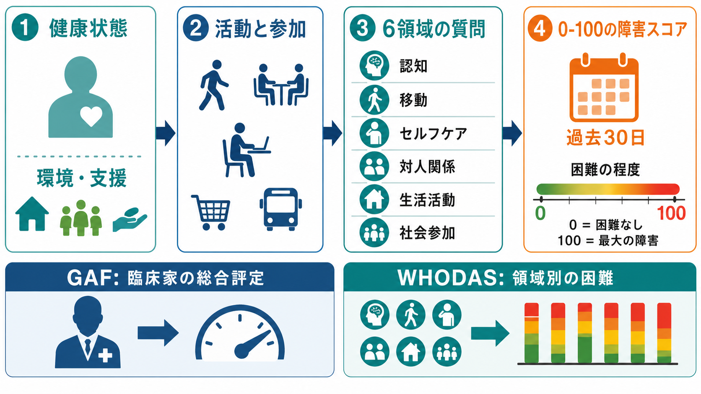

# GAFやWHODASは何を評価するのか

## 要点

- GAF（Global Assessment of Functioning）は、症状の重さと社会・職業・心理的機能を、臨床家が 0-100 点で総合評定する尺度である。
- WHODAS 2.0（World Health Organization Disability Assessment Schedule 2.0）は、健康状態に伴う「活動と参加」の困難を、6領域に分けて測る尺度である[1][2]。
- DSM-5 では多軸診断と Axis V の GAF が廃止され、機能障害の評価には WHODAS 2.0 が提示された[3]。
- どちらも[[精神疾患とは何か|精神疾患]]の診断そのものではなく、診断名だけでは見えにくい生活上の困難、支援ニーズ、変化を記録するための補助線である。

## この記事で答える問い

GAF や WHODAS は、単に「重症度」を点数化する道具ではない。この記事では、精神科診療や研究でしばしば混同される「症状」「機能」「障害」「生活上の困難」を区別し、GAF と WHODAS 2.0 がそれぞれ何を測り、どのような限界をもつのかを整理する。

## まず結論

GAF は「その人の状態を臨床家が一つの総合点にまとめる」尺度である。簡便で全体像をつかみやすい一方、症状の重さ、対人関係、仕事、学業、日常生活、評価者の判断が一つの点数に混ざりやすい。

WHODAS 2.0 は「健康状態によって、過去30日間にどの活動・参加領域でどれだけ困ったか」を領域別に聞く尺度である[1][2]。診断名や症状名ではなく、認知、移動、セルフケア、対人関係、生活活動、社会参加という生活機能の側から見る。

## 背景

精神科診断では、[[DSMとICDは何が違うのか|DSMやICD]]によって症状のまとまりを分類する。しかし、同じ診断名でも、働けるか、家事ができるか、対人関係を維持できるか、支援なしに通院できるかは大きく異なる。診断名だけでは、本人が実際に困っている生活領域や支援ニーズを十分に表せない。

そこで、症状尺度とは別に、生活機能や障害を評価する尺度が必要になる。たとえば抑うつ症状の量は下がっても復職困難が残ることがあり、幻聴の頻度が変わらなくても対処法や環境調整によって社会参加が改善することがある。この差を記録する視点が、[[精神科で生活機能をどう評価するか|生活機能評価]]である。

WHO の ICF（International Classification of Functioning, Disability and Health）は、障害を単なる個人内の欠損ではなく、健康状態、身体機能・構造、活動、参加、環境因子が相互作用するものとして整理する枠組みである[4]。WHODAS 2.0 はこの ICF の考え方、とくに「活動と参加」に対応する形で作られている[1][2]。

## 基本概念

### GAF

GAF は DSM-IV の多軸診断で Axis V に用いられた尺度で、心理的・社会的・職業的機能を 0-100 点で総合評定する。高得点ほど機能が良く、低得点ほど症状や機能障害が重いと解釈される。

GAF の特徴は、短時間で「現在の全体的な重さ」を表せることである。一方で、点数には症状の重さと機能障害が同時に反映されるため、同じ 50 点でも「症状が強いから低い」のか、「生活機能が低いから低い」のかが曖昧になりやすい。レビューでは、GAF の信頼性・妥当性には一定の知見がある一方、評価者間のばらつきやアンカーの解釈の問題が繰り返し指摘されている[5][6]。

### WHODAS 2.0

WHODAS 2.0 は、疾患横断的に健康と障害を測る WHO の尺度である。成人では 36項目版、12項目版、12+24項目版があり、自己記入、面接、代理回答などの形式が用意されている[1][2]。

6領域は次の通りである[2]。

| 領域 | 評価する主な内容 |
|---|---|
| 認知 | 理解、集中、記憶、コミュニケーション |
| 移動 | 立つ、歩く、外出する |
| セルフケア | 入浴、更衣、食事、一人で過ごすこと |
| 対人関係 | 他者とのやりとり、親密な関係 |
| 生活活動 | 家事、仕事、学校、日常の責任 |
| 社会参加 | 地域活動、社会的障壁、周囲への負担感 |

WHODAS 2.0 は、過去30日間の困難を評価し、0-100 の障害スコアに換算できる。0 は障害なし、100 は最大の障害を意味する[2]。この点で、[[病前機能とは何か|病前機能]]や現在の生活機能を、面接の印象だけでなく構造化して記録する助けになる。

## 仕組み

GAF は、臨床家が面接、観察、診療録、周囲からの情報を統合して、ひとつの総合点をつける。評価の焦点は「全体的機能」であり、点数は便利だが情報は圧縮される。点数の変化は、症状改善、生活環境の変化、入院・退院、評価者の違いなど複数の要因で動く。

WHODAS 2.0 は、領域ごとの質問項目に回答し、それを合計または IRT ベースの方法で換算する。WHO は、簡便な単純加算と、項目の難易度を考慮した複雑採点の両方を提示している[2]。36項目版は領域別のプロフィールを出しやすく、12項目版は短時間のスクリーニングや調査に向く。

重要なのは、WHODAS 2.0 が「精神疾患の症状そのもの」ではなく、「健康状態によって活動や参加がどの程度難しくなっているか」を尋ねる点である。したがって、同じうつ病でも、認知領域の困難が目立つ人、対人関係が主な困難の人、家事・仕事の生活活動が中心の人を分けて記述できる。

## 図解

GAF と WHODAS 2.0 の違いは、次のようにまとめられる。

| 観点 | GAF | WHODAS 2.0 |
|---|---|---|
| 評価の単位 | 0-100 の総合点 | 6領域と総合スコア |
| 主な回答者 | 臨床家 | 本人、面接者、代理回答者 |
| 何を測るか | 心理・社会・職業的機能の全体像 | 活動と参加における困難 |
| 長所 | 簡便、全体像を共有しやすい | 領域別に困難を見やすい、ICF と接続しやすい |
| 注意点 | 症状と機能が混ざる、評価者差が出る | 主観評価の影響、文化・環境差、回答能力の影響 |
| 診断との関係 | DSM-IV Axis V で使用 | DSM-5 で機能障害評価の候補として提示 |

この表から分かるように、GAF は「全体評定」、WHODAS 2.0 は「領域別の生活機能プロフィール」と考えると理解しやすい。

## 臨床・研究との接続

臨床では、尺度を[[精神科診断は何のためにあるのか|診断]]の代わりに使うのではなく、面接で得た理解を補助する道具として使う。たとえば、WHODAS 2.0 で社会参加の困難が高い場合、症状だけでなく、経済状況、交通手段、家族関係、スティグマ、支援制度へのアクセスも確認する必要がある。

研究では、診断名や症状尺度だけでは捉えにくいアウトカムとして、生活機能や社会参加が重要になる。DSM-5 以降、GAF の代替として WHODAS 2.0 が注目された背景には、診断分類だけでなく、横断的・次元的な機能評価を取り入れる流れがある[3]。精神病性障害の外来患者を対象にした研究でも、12項目 WHODAS 2.0 は症状重症度、身体合併症、生活状況などと関連し、臨床的妥当性を支持する結果が報告されている[7]。

ただし、WHODAS 2.0 も万能ではない。自己記入では本人の洞察、抑うつ的な自己評価、認知機能、文化的期待が影響する。代理回答では、家族や支援者の見方が反映される。したがって、尺度点数は[[心理測定とは何か|心理測定]]上の観察値であり、[[妥当性とは何か|妥当性]]や[[信頼性とは何か|信頼性]]の限界を踏まえて解釈する必要がある。

## よくある誤解

### 「GAF が低い = 診断が重い」

GAF は診断名の重さではなく、症状と機能の総合的な状態を表す。診断が同じでも、環境支援や役割期待によって点数は変わりうる。

### 「WHODAS は症状尺度である」

WHODAS 2.0 は症状の頻度や強さを直接測る尺度ではない。抑うつ気分、幻聴、不安発作の有無ではなく、それらを含む健康状態によって生活活動や社会参加がどれだけ難しくなったかを見る。

### 「点数だけで支援方針が決まる」

点数は会話の入口であり、支援方針そのものではない。治療計画では、本人の価値、希望、環境、リスク、保護因子、利用できる社会資源を合わせて検討する。これは[[精神医学における回復とは何か|回復]]を単なる症状消失ではなく、生活の再構築として見る視点ともつながる。

### 「WHODAS なら評価者差がなくなる」

自己記入式であっても、質問の理解、回答スタイル、文化、症状による自己評価の偏りは残る。面接者が補助する場合には、説明の仕方や補正の判断も影響する。評価者差が消えるのではなく、何を聞いているかが明確になり、比較可能性が上がると考える方がよい。

## 関連ノート

- [[精神科で生活機能をどう評価するか]]
- [[病前機能とは何か]]
- [[精神科診断は何のためにあるのか]]
- [[DSMとICDは何が違うのか]]
- [[心理測定とは何か]]
- [[妥当性とは何か]]
- [[信頼性とは何か]]
- [[精神医学における回復とは何か]]

## MOC更新候補

- `content/00_MOC/` 配下の精神医学・診断・面接関連 MOC に、本記事を「機能評価・評価尺度」の項目として追加する候補。
- 心理測定・尺度関連 MOC がある場合、GAF と WHODAS 2.0 を「臨床評価尺度」の例として相互参照する候補。

## 理解チェック

1. GAF の 0-100 点には、症状と生活機能のどちらが含まれるか。
2. WHODAS 2.0 の 6領域は、症状名ではなく何を分類しているか。
3. 同じ WHODAS 総合点でも、臨床的に確認すべき領域別情報は何か。
4. GAF や WHODAS の点数を、診断名や治療方針そのものとして扱うと何が危険か。

## 未解決問題

- 精神疾患では、主観的困難と客観的生活機能が一致しない場面がある。どちらをどのように重みづけるかは、研究目的や臨床場面によって変わる。
- WHODAS 2.0 は疾患横断的な比較に向くが、精神疾患特有の認知機能障害、陰性症状、社会的スティグマをどこまで細かく捉えられるかには限界がある。
- 日本語版の運用では、文化的な役割期待、家族同居、就労制度、福祉制度との関係を踏まえた解釈が必要である。

## 参考文献

[1] Üstün, T. B., Kostanjsek, N., Chatterji, S., Rehm, J., & World Health Organization. (2010). *Measuring health and disability: Manual for WHO Disability Assessment Schedule (WHODAS 2.0).* World Health Organization. https://iris.who.int/handle/10665/43974

[2] World Health Organization. (2012). WHO Disability Assessment Schedule 2.0 (WHODAS 2.0). https://www.who.int/classifications/icf/whodasii/en/

[3] Gold, L. H. (2014). DSM-5 and the assessment of functioning: The World Health Organization Disability Assessment Schedule 2.0 (WHODAS 2.0). *Journal of the American Academy of Psychiatry and the Law, 42*(2), 173-181. https://jaapl.org/content/42/2/173

[4] CDC National Center for Health Statistics. (2024). ICF: International Classification of Functioning, Disability and Health. https://www.cdc.gov/nchs/icd/icf/index.html

[5] Aas, I. H. M. (2010). Global Assessment of Functioning (GAF): Properties and frontier of current knowledge. *Annals of General Psychiatry, 9*, 20. https://doi.org/10.1186/1744-859X-9-20

[6] Jones, S. H., Thornicroft, G., Coffey, M., & Dunn, G. (1995). A brief mental health outcome scale: Reliability and validity of the Global Assessment of Functioning (GAF). *British Journal of Psychiatry, 166*(5), 654-659. https://doi.org/10.1192/bjp.166.5.654

[7] Holmberg, C., Gremyr, A., Torgerson, J., & Mehlig, K. (2021). Clinical validity of the 12-item WHODAS-2.0 in a naturalistic sample of outpatients with psychotic disorders. *BMC Psychiatry, 21*, 147. https://doi.org/10.1186/s12888-021-03101-9

