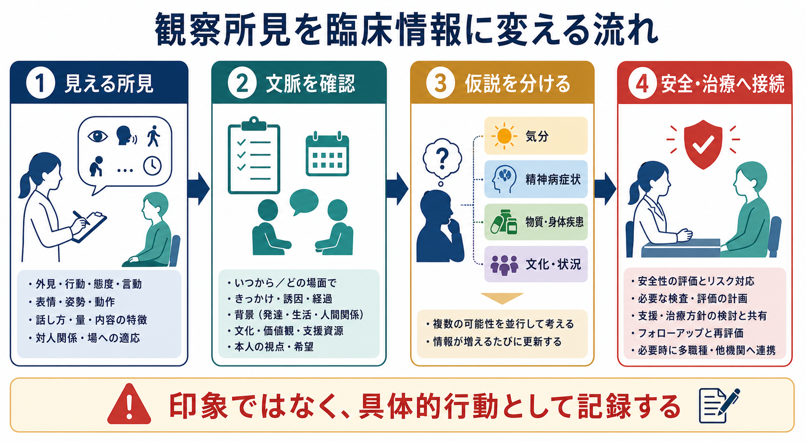
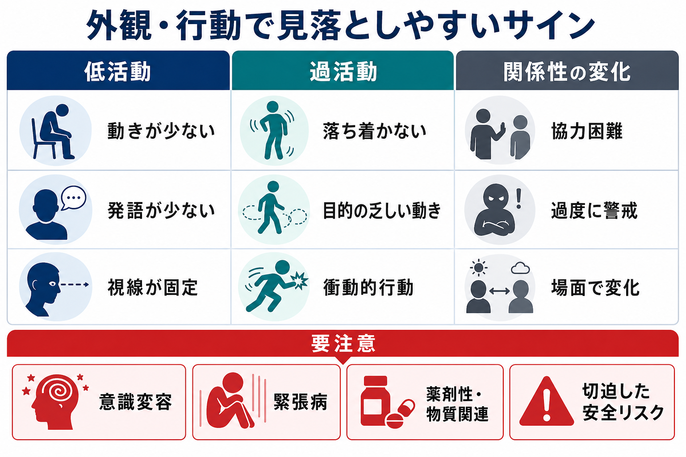
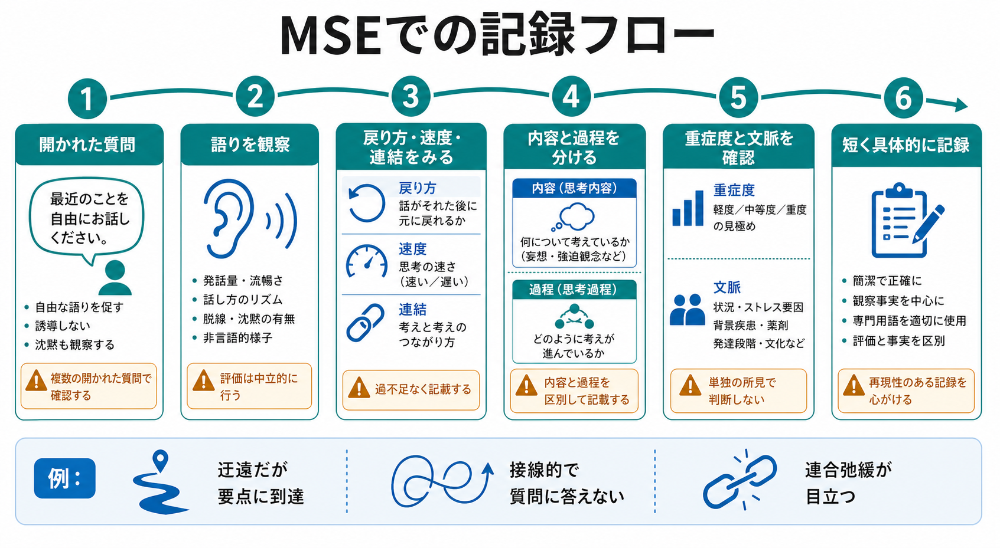

# MSEで外観と行動から何を観察するか

## 要点

- MSE（mental status examination; 精神状態診察）における外観と行動は、面接開始前から得られる「観察可能な臨床データ」である。
- 身だしなみ、姿勢、歩行、視線、表情、精神運動、協力度は、気分症状、精神病症状、物質・薬剤影響、神経疾患、意識障害、生活機能低下の手がかりになる[1][2]。
- ただし、外観や態度だけで診断を決めない。文化、状況、身体疾患、疼痛、睡眠不足、発達特性、トラウマ反応、面接者との関係を確認する[3][5]。
- 記録では「不潔」「非協力的」などの評価語を単独で置かず、観察された行動を短く具体的に書く。

## この記事で答える問い

1. MSEの「外観と行動」では何を観察するのか。
2. 身だしなみ・姿勢・視線・精神運動・協力度は、どのような臨床仮説につながるのか。
3. 観察所見を、偏見や決めつけではなく、臨床的に有用な記録へ変えるにはどうすればよいのか。

## まず結論

外観と行動の観察は、患者を「見た印象」で分類する作業ではない。面接中に実際に見える所見を、本人の語り、現病歴、身体所見、薬剤、物質使用、生活背景、文化的文脈と照合し、次に確認すべき問いを作る作業である[1][3][4]。

たとえば、身だしなみの乱れはセルフケア低下を示すことがあるが、貧困、急な受診、身体疾患、住環境、文化的慣習でも生じる。視線が合わないことは不安や抑うつ、精神病症状、発達特性、文化的規範、警戒やトラウマ反応のいずれでもありうる。重要なのは、単独所見を診断名に飛ばさず、複数の観察と質問で文脈化することである[2][5]。

## 背景

MSEは、現在の精神機能を体系的に評価する診察であり、外観、一般行動、精神運動、発話、気分・感情、思考、知覚、認知、病識、判断などを含む[1][2]。外観と行動は、その中でも面接の最初から最後まで観察できる領域である。

[[精神科面接とは何か]]や[[精神科初診で何を確認するべきか]]では、本人の訴えを聞くことが中心になる。一方、外観と行動の観察は、本人が言語化していない苦痛、機能低下、安全リスク、薬剤副作用、身体疾患の可能性を拾う役割をもつ[3]。そのため、[[精神科診断における除外診断とは何か]]や[[器質性精神障害を見逃さないためには何を見るべきか]]とも密接に関係する。

## 基本概念

### 身だしなみ・衛生

観察するのは、衣服の清潔さ、季節や場面との適合、体臭、栄養状態の印象、傷や瘢痕、注射痕、自傷痕、極端な服装変化などである[1][3]。これらは、セルフケア低下、抑うつ、躁状態、精神病症状、認知障害、物質使用、身体疾患、住環境の困難を考える入口になる。

記録例は「衣服に数日以上の汚れが目立ち、強い体臭あり」「冬季だが薄手の半袖のみで来院」「前腕に線状瘢痕を複数認める」のように、評価より先に観察を書く。

### 姿勢・歩行・身体の使い方

姿勢は、うつむき、緊張、硬さ、落ち着かなさ、椅子への座り方、距離の取り方として現れる。歩行は、ふらつき、小刻み歩行、失調、動作緩慢、疼痛回避、薬剤性の錐体外路症状を疑う手がかりになる[1][2]。

動作の遅さは抑うつや神経認知障害だけでなく、パーキンソニズム、鎮静薬、疼痛、睡眠不足でも起こる。逆に落ち着かなさは不安、躁状態、アカシジア、物質影響、離脱、せん妄のいずれでもありうる。

### 視線・表情・対人距離

視線は、接触の少なさ、多さ、固定、周囲への過度な走査、面接者への警戒として観察される。表情は、乏しさ、硬さ、緊張、不安、易刺激性、場面にそぐわない笑いなどを見る。これらは[[ラポールはどのように形成されるのか]]や[[治療関係とは何か]]にも関係する。

ただし、視線や表情の意味は文化、神経発達、対人不安、トラウマ、権力関係、面接環境で大きく変わる。APAの文化的定式化面接は、背景、アイデンティティ、支援資源、ケアへの期待、臨床家との関係を確認する枠組みを提供している[5]。

### 精神運動

精神運動は、動きの量、速さ、目的性、反復性、抑制、興奮、奇異な姿勢、常同運動、チック、不随意運動を観察する領域である[1][2]。精神運動制止は抑うつ、緊張病、神経疾患、薬剤性鎮静で見られることがある。精神運動焦燥は不安、躁状態、精神病性興奮、アカシジア、物質関連、疼痛、せん妄で生じうる。

緊張病が疑われる場合は、昏迷、無言、凝視、姿勢保持、拒絶、常同運動、反響症状、目的の乏しい興奮などを確認する。Bush-Francis Catatonia Rating Scaleは、緊張病の系統的評価に用いられる代表的尺度である[6]。

### 協力度・態度

協力度は、質問への反応、面接の継続可能性、修正や再説明への応答、境界設定への反応、情報提供の範囲として観察する。「協力的／非協力的」とだけ書くと、患者の人格評価に見えやすい。よりよい記録は「開かれた質問には短く応答するが、服薬歴の質問では沈黙が増える」「安全確認の質問で離席を試みる」のように、場面と行動を結びつける。

協力度の変化は、病識、妄想的警戒、認知機能、羞恥、トラウマ反応、文化的誤解、面接者への不信、強制的状況への反応でも起こる。[[精神科面接で境界設定はなぜ必要なのか]]や[[精神科面接で避けるべき対応は何か]]と合わせて考える。

## 仕組み

外観と行動から臨床情報を得る流れは、次の4段階に分けると誤解が減る。

1. 見える所見を集める  
   「落ち着かない」「視線が固定」「衣服が汚れている」「反応まで時間がかかる」など、観察可能な行動を記述する。

2. 文脈を確認する  
   いつから、どの場面で、普段と比べてどう変わったかを確認する。本人のベースライン、家族や支援者の情報、身体疾患、薬剤、物質使用、睡眠、疼痛も見る[3][4]。

3. 仮説を分ける  
   気分症状、精神病症状、物質・薬剤影響、神経疾患、意識障害、文化・状況要因を並行して考える。[[薬剤性精神症状とは何か]]や[[物質使用歴はどのように聞くべきか]]もここに接続する。

4. 安全と治療に接続する  
   自傷・他害、セルフネグレクト、急性錯乱、緊張病、重い薬剤副作用が疑われる場合は、[[精神科救急では何を優先するべきか]]や[[精神科で重症度をどう判断するか]]に沿って優先順位を上げる。

## 図解

外観と行動の観察は、低活動、過活動、関係性の変化という3つの軸で整理すると見落としが減る。

| 軸 | 観察例 | 確認したいこと |
|---|---|---|
| 低活動 | 動きが少ない、発語が少ない、視線が固定、反応が遅い | 抑うつ、緊張病、せん妄、鎮静、神経疾患、疲労、疼痛 |
| 過活動 | そわそわする、立ち歩く、目的の乏しい動き、衝動的行動 | 不安、躁状態、アカシジア、物質影響、離脱、興奮、安全リスク |
| 関係性の変化 | 協力困難、過度な警戒、怒り、場面で大きく変わる | 妄想的警戒、トラウマ反応、文化的齟齬、境界設定、面接環境 |

## 臨床・研究との接続

臨床では、外観と行動の観察は初診時の診断仮説だけでなく、経過評価にも使う。たとえば、前回より身だしなみが整った、視線が増えた、座位保持が安定した、焦燥が減った、面接への参加が増えた、という変化は治療反応や生活機能の回復を示す補助情報になる[1][3]。

一方、薬剤治療中には、精神症状の変化と副作用を分けて見る必要がある。抗精神病薬使用中の不随意運動は、AIMS（Abnormal Involuntary Movement Scale）のような尺度で、顔面・口部、四肢、体幹、全般重症度、本人の自覚を系統的に確認できる[7]。緊張病が疑われる場合も、単なる「反応が乏しい」ではなく、無言、昏迷、凝視、姿勢保持、拒絶、常同運動などを分けて記録する[6]。

研究や教育では、外観と行動の記録は評価者間一致の課題を含む。MSEは観察者の技能や専門性に影響されるため、評価語を減らし、行動レベルで記述し、必要に応じて構造化尺度を併用することが再現性を高める[1][2]。

## よくある誤解

### 誤解1：身だしなみが乱れていれば精神疾患である

身だしなみの乱れは重要なサインだが、精神疾患に固有ではない。身体疾患、貧困、住居不安定、災害、介護負担、急な受診、文化的慣習でも起こる。診断仮説にする前に、本人の通常状態と生活文脈を確認する。

### 誤解2：視線が合わない人は話す気がない

視線の少なさは、不安、抑うつ、発達特性、文化的規範、トラウマ、恥、被害的警戒、面接者との相性などで起こる。協力度を評価する場合も、視線だけではなく、質問への応答、再説明への反応、面接継続の可否を合わせて見る。

### 誤解3：落ち着かなさは「性格」か「反抗」である

落ち着かなさは、アカシジア、離脱、疼痛、せん妄、躁状態、不安、精神病性興奮のサインになりうる。薬剤変更後に始まったか、座っていられるか、内的なむずむず感があるか、睡眠や物質使用に変化があるかを確認する。

### 誤解4：外観と行動は客観的だから偏りがない

観察される行動は客観的に見えるが、解釈には面接者の文化的前提が入りやすい。文化的定式化では、本人にとって重要な背景、支援、ストレス、ケアへの期待、臨床家との関係を確認する[5]。外観と行動の意味づけも、この文脈に置き直す必要がある。

## 記録のコツ

| 避けたい記録 | よりよい記録 |
|---|---|
| だらしない | 衣服に食物様の汚れが複数あり、強い体臭を認める |
| 非協力的 | 服薬歴の質問では沈黙し、話題を変えると短く応答する |
| 目つきが悪い | 面接者を凝視し、質問後も数秒間沈黙する |
| 落ち着きがない | 10分の面接中に4回立ち上がり、室内を歩く |
| 奇妙 | 両腕を胸の前で固定した姿勢を約5分保持する |

記録では、質、範囲、強度、変動性、適切さを入れると使いやすい。たとえば「精神運動焦燥あり」だけでなく、「両下肢を持続的に揺らし、着席保持は可能。質問への応答は保たれる」のように書く。

## 関連ノート

- [[精神科面接とは何か]]
- [[精神科初診で何を確認するべきか]]
- [[精神科診断における除外診断とは何か]]
- [[器質性精神障害を見逃さないためには何を見るべきか]]
- [[精神科で重症度をどう判断するか]]
- [[精神科救急では何を優先するべきか]]
- [[薬剤性精神症状とは何か]]
- [[物質使用歴はどのように聞くべきか]]
- [[ラポールはどのように形成されるのか]]
- [[治療関係とは何か]]

## MOC更新候補

- `content/00_MOC/MOC｜精神医学.md`
- `content/00_MOC/MOC｜臨床実践・治療.md`

## 理解チェック

1. 「身だしなみが乱れている」という所見から、少なくとも5つの鑑別仮説を挙げられるか。
2. 視線が合わない患者について、文化的背景や発達特性を含めて確認すべき質問を作れるか。
3. 「非協力的」と書かずに、観察可能な行動として記録できるか。
4. 精神運動焦燥を見たとき、アカシジア、躁状態、不安、物質関連、せん妄をどう分けて考えるか。
5. 緊張病や薬剤性不随意運動が疑われるとき、どの尺度や追加評価を検討するか。

## 未解決問題

- MSEの外観・行動所見は、評価者間一致を高めるためにどこまで構造化すべきか。
- 文化差や神経発達特性を踏まえた「視線」「協力度」「場への適応」の記録標準は、どの程度共有可能か。
- 外観・行動の経時変化を、生活機能や治療反応の指標としてどのように定量化できるか。

## 参考文献

[1] Voss RM, Das JM. *Mental Status Examination*. StatPearls. Last Update: 2024-04-30. NCBI Bookshelf. https://www.ncbi.nlm.nih.gov/books/NBK546682/

[2] Martin DC. *The Mental Status Examination*. In: Walker HK, Hall WD, Hurst JW, eds. *Clinical Methods: The History, Physical, and Laboratory Examinations*. 3rd ed. NCBI Bookshelf. https://www.ncbi.nlm.nih.gov/books/NBK320/

[3] First MB, Zimmerman M. *Initial Psychiatric Assessment*. Merck Manual Professional Edition. Reviewed/Revised 2024-10; Modified 2026-01. https://www.merckmanuals.com/professional/psychiatric-disorders/approach-to-the-patient-with-psychiatric-symptoms/initial-psychiatric-assessment

[4] Silverman JJ, Galanter M, Jackson-Triche M, et al.; American Psychiatric Association. The American Psychiatric Association Practice Guidelines for the Psychiatric Evaluation of Adults. *American Journal of Psychiatry*. 2015;172(8):798-802. doi:10.1176/appi.ajp.2015.1720501

[5] American Psychiatric Association. *DSM-5-TR Cultural Formulation Interview*. https://www.psychiatry.org/File%20Library/Psychiatrists/Practice/DSM/DSM-5-TR/APA-DSM5TR-CulturalFormulationInterview.pdf

[6] Adnane L, Tao A, Lipsey JR. *Catatonia*. Johns Hopkins Psychiatry Guide. https://www.hopkinsguides.com/hopkins/view/Johns_Hopkins_Psychiatry_Guide/787168/2.0/Catatonia

[7] Guy W. *Abnormal Involuntary Movement Scale (AIMS)*. ECDEU Assessment Manual for Psychopharmacology, revised. NIMH Psychopharmacology Research Branch, 1976. PDF hosted by Oregon Health & Science University. https://www.ohsu.edu/sites/default/files/2019-10/%28AIMS%29%20Abnormal%20Involuntary%20Movement%20Scale.pdf
