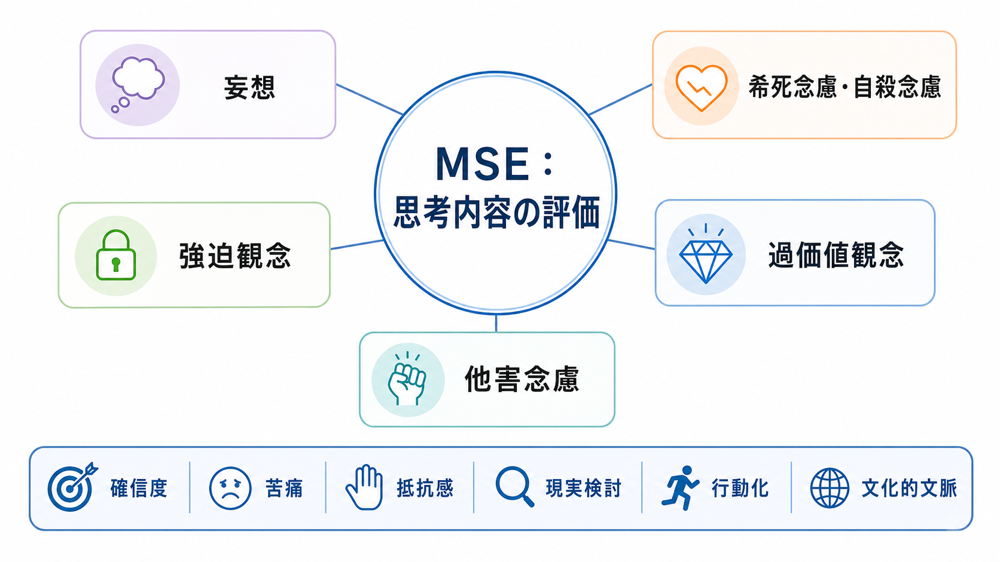
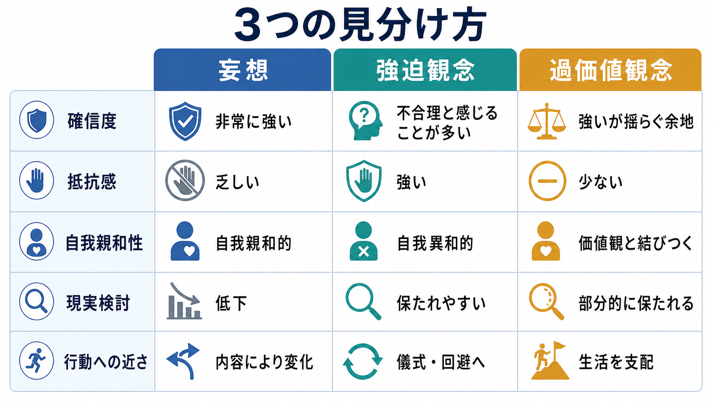
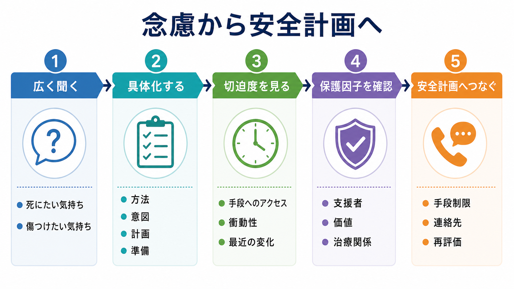

# MSEで思考内容をどう評価するか

## 要点

- MSEの「思考内容」は、患者が何を考えているかを単に列挙する欄ではなく、信念・念慮・侵入思考が、確信度、苦痛、抵抗感、現実検討、行動化、文化的文脈とどう結びつくかを記述する領域である[1]。
- 最低限確認したい内容は、妄想、希死念慮・自殺念慮、他害念慮、強迫観念、過価値観念である。自殺・他害に関わる内容は、計画、意図、手段へのアクセス、準備行動、保護因子まで具体化する[1][2]。
- 妄想、強迫観念、過価値観念は、内容の奇異さだけでなく、本人がどれほど確信しているか、不合理さをどの程度認識しているか、その考えに抵抗するか、生活や行動をどれほど支配しているかで見分ける[3][4][7]。
- 評価は診断名を急いで付ける作業ではない。まず安全を確認し、次に症状の性質を記述し、最後に[[鑑別診断とは何か|鑑別診断]]や支援計画につなげる。

## この記事で答える問い

1. MSEで「思考内容」を見るとは、何を観察し、何を質問することか。
2. 妄想、強迫観念、過価値観念をどう区別するか。
3. 希死念慮、自殺念慮、他害念慮をどの深さまで確認するか。
4. 記録では、どのように臨床的に使える形でまとめるか。

## まず結論

思考内容の評価は、「異常な考えがあるか」を探す検問ではない。面接全体を通じて、本人が抱えている信念、心配、侵入的な考え、死や加害に関する考えを、本人の言葉で把握し、それが安全、苦痛、生活機能、治療関係にどう影響しているかを整理する作業である[1][2]。

実践上は、次の順序で考えると見落としが少ない。

1. まず安全に関わる内容を確認する。希死念慮、自殺念慮、他害念慮、命令性幻聴、被害的確信、衝動性、手段へのアクセスを確認する。
2. 次に、考えの性質を記述する。妄想か、強迫観念か、過価値観念か、通常の心配か、文化的・宗教的信念かを、確信度と現実検討を軸に見る。
3. 最後に、評価を支援へ接続する。安全計画、フォローアップ、家族・支援者との連携、薬物・身体疾患・せん妄などの除外を検討する。

## 背景

[[精神科初診で何を確認するべきか|精神科初診]]や[[精神科面接とは何か|精神科面接]]では、主訴や現病歴だけでなく、精神状態診察として「いま面接場面で観察・聴取できる状態」を記述する。MSEの思考内容は、そのうち「考えの主題」を扱う。StatPearlsのMSE解説でも、思考内容では自殺念慮、他害念慮、妄想を重要な確認対象としている[1]。

ただし、思考内容はチェックリストだけでは評価できない。たとえば「誰かに見られている気がする」という発言は、不安、現実的な危険、トラウマ反応、被害妄想、薬物影響、文化的背景の違いなど、複数の可能性を持つ。したがって、発言内容をそのまま診断名に変換せず、時間経過、確信度、根拠の扱い、生活への影響、感情反応、行動化を確認する必要がある。

## 基本概念

### 思考内容

思考内容とは、考えの「流れ」ではなく「中身」である。話が飛ぶ、まとまらない、迂遠である、といった特徴は主に思考過程に属する。一方で、被害的確信、罪業感、誇大的信念、身体に関する誤った確信、死にたい気持ち、他者を傷つけたい考え、侵入的な加害イメージなどは思考内容に含まれる。

記録では、単に「妄想あり」「希死念慮なし」と書くより、次のように具体化する。

| 見る軸 | 記録に残したいこと |
|---|---|
| 内容 | 何を信じているか、何を恐れているか、何をしたいと思っているか |
| 確信度 | 疑える余地があるか、反証をどう扱うか |
| 苦痛 | その考えがどの程度つらいか |
| 抵抗感 | 考えを望まないものとして体験しているか |
| 現実検討 | 別の説明を検討できるか |
| 行動化 | 回避、確認、準備、接近、攻撃、自傷などにつながっているか |
| 文脈 | 文化、宗教、生活史、トラウマ、物質使用、身体疾患との関係 |

### 妄想

妄想は、明確な反証があっても変わりにくい、強く保持された誤った信念として扱われる[3]。臨床では「本当に間違っているか」を面接者が即断するより、本人がどの程度確信しているか、反証をどう受け止めるか、生活や安全にどのような影響があるかを見る。

妄想の主題には、被害、関係、誇大、嫉妬、罪業、貧困、身体、宗教、被支配などがある。被害妄想や嫉妬妄想は、本人の恐怖だけでなく、逃避、自傷、他害、家族関係の悪化につながることがあるため、[[他害リスク評価では何を見るべきか|他害リスク評価]]や[[自殺リスク評価では何を聞くべきか|自殺リスク評価]]と切り離さずに扱う。

### 希死念慮・自殺念慮

希死念慮は「消えてしまいたい」「目が覚めなければよい」といった死への願望を含む広い概念である。自殺念慮は、自分で命を絶つことを考える状態を指す。C-SSRSは、自殺念慮の重症度を、死にたい願望、非特異的な自殺念慮、方法を伴う念慮、意図、計画を伴う意図として段階的に整理し、頻度、持続時間、制御可能性、抑止因子、理由も評価対象にしている[6]。

NICEは、自傷後の評価でリスク尺度や「低・中・高」の層別化だけで退院や治療可否を決めないよう推奨している[5]。これはMSEにも重要である。念慮の有無だけでなく、切迫度と保護因子を具体的に見て、支援計画に変換する必要がある。

### 他害念慮

他害念慮は、誰かを傷つけたい考え、死んでほしいという願望、具体的な攻撃計画、命令性幻聴や被害的確信に基づく防衛的攻撃の可能性を含む。評価では、対象、理由、意図、計画、手段、接近行動、衝動性、物質使用、過去の暴力、保護因子を確認する[2]。

ここで重要なのは、考えがあることと行動化の切迫性を分けることである。強迫症の加害強迫のように、本人が望まない侵入思考として強い恐怖と回避を伴う場合もある。一方で、被害的確信や怒り、物質使用、武器へのアクセス、対象への接近が重なる場合は、より具体的な安全対応が必要になる。

### 強迫観念

強迫観念は、反復的・持続的で、侵入的かつ望まない思考、衝動、イメージとして体験され、強い不安や苦痛を伴う[4]。本人はそれを無視したり抑えたり、別の考えや行為で中和しようとする。典型例は、汚染、確認、加害、性的・宗教的タブー、対称性などである[4]。

MSEでは、強迫観念の内容そのものよりも、「本人がそれを望んでいるのか」「不合理だと感じているのか」「中和行為や回避があるか」を確認する。加害強迫は他害念慮と混同されやすいが、本人にとって自我異和的で恐ろしく、実行したい意図ではなく「そうしてしまったらどうしよう」という不安として語られることが多い。

### 過価値観念

過価値観念は、妄想ほど固定的ではないが、本人の価値観や人生史と結びつき、生活や行動を大きく支配する信念として扱われる。近年のレビューでは、過価値観念は妄想や強迫観念と明確な線で分かれるというより、確信度、人格・価値観との親和性、社会的共有可能性、行動支配性の連続体として理解される[7]。

たとえば、身体醜形、摂食、健康不安、嫉妬、政治・宗教的信念などは、通常の信念、過価値観念、妄想の境界で揺れうる。評価では、「変わった考え」として扱うより、どの程度生活を狭め、他者との関係や安全を損なっているかを確認する。

## 仕組み

### 1. 広く聞き、必要なところを深掘りする

最初から「妄想はありますか」「自殺念慮はありますか」と尋ねるだけでは、本人の体験を取り逃がしやすい。まずは広く聞く。

- 「最近、頭から離れない考えはありますか」
- 「自分でも変だと思うけれど、気になってしまうことはありますか」
- 「誰かに狙われている、監視されている、特別な意味があると感じることはありますか」
- 「死にたい、消えたい、傷つけたい、誰かを傷つけたいと思うことはありますか」

そのうえで、出てきた内容を具体化する。内容、頻度、持続時間、制御可能性、確信度、苦痛、行動化、保護因子を順に確認する。

### 2. 「内容」だけでなく「関係の仕方」を見る

同じ「誰かを傷つけるイメージ」でも、臨床的意味は大きく異なる。

| 体験のされ方 | 評価上の焦点 |
|---|---|
| 望まない侵入思考で、本人が強く恐れて回避している | 強迫観念、苦痛、儀式、回避、機能障害 |
| 怒りや復讐心と結びつき、対象・計画・手段がある | 他害リスク、切迫度、安全確保 |
| 命令性幻聴や被害的確信に従う必要を感じている | 精神病症状、現実検討、安全対応 |
| 比喩的表現として「殴りたいほど腹が立つ」と言っている | 感情調整、衝動性、実行意図の有無 |

したがって、MSEでは「考えのテーマ」だけでなく、本人がその考えをどう位置づけているかを記述する。

### 3. 安全に関わる念慮は具体的に確認する

希死念慮、自殺念慮、他害念慮は、存在を確認して終わりではない。APAの精神医学的評価ガイドラインの要約では、自殺リスク評価において、現在の自殺念慮、計画、意図、過去の企図、中断・中止された企図、非自殺性自傷、絶望感、衝動性、物質使用、心理社会的ストレス、攻撃的・精神病的な考えを確認することが示されている[2]。

実際の面接では、次のように具体化する。

- 死にたい気持ち、消えたい気持ち、自分を傷つけたい気持ちの区別
- 方法、意図、計画、準備行動
- 手段へのアクセス
- いつ、どこで、どの程度実行に近づいたか
- 抑止因子、支援者、治療関係、本人の価値
- 今日から次回までの安全確保

### 4. 身体疾患・物質・薬剤・せん妄を見逃さない

妄想様の訴え、急な被害的確信、加害念慮、強い不安、混乱は、精神疾患だけで説明しない。急性発症、意識・注意の変動、高齢発症、発熱、頭部外傷、神経症状、物質使用、薬剤変更、睡眠不足がある場合は、[[精神科診断における除外診断とは何か|除外診断]]を強く意識する。

特に、せん妄、認知症、てんかん、内分泌疾患、自己免疫疾患、感染症、薬剤性精神症状、アルコール・薬物中毒や離脱は、MSE上の思考内容に大きく影響する。思考内容は、身体所見やバイタル、検査、生活歴と統合して評価する。

## 図解

上の3枚は、思考内容評価の使い分けを示している。

| 図 | 使い方 |
|---|---|
| 概念地図 | MSEで最低限見落としたくない思考内容の全体像を確認する |
| 比較表 | 妄想、強迫観念、過価値観念を、確信度・抵抗感・現実検討で区別する |
| 評価フロー | 希死念慮・他害念慮を、安全計画と再評価へつなげる |

## 臨床・研究との接続

臨床では、思考内容の評価は三つの目的を持つ。

第一に、安全評価である。自殺念慮や他害念慮は、単なる症状リストではなく、当日の対応、手段制限、支援者連絡、入院・救急対応、フォローアップ間隔を決める情報である[2][5]。

第二に、診断仮説の整理である。妄想、強迫観念、過価値観念は、統合失調症スペクトラム、気分障害、強迫症、身体症状症、摂食障害、パーソナリティ特性、物質・薬剤性、身体疾患などと関係する。ここでは[[精神科で重症度をどう判断するか|重症度]]、[[病識とは何か|病識]]、[[文化的背景は診断にどう影響するのか|文化的背景]]も合わせて考える。

第三に、治療関係の形成である。思考内容を聞くときに、面接者が急に疑ったり、論破したり、安心させようとして反証を押しつけたりすると、本人は話しにくくなる。特に妄想的確信や強迫的な加害イメージでは、「その考えがあること」と「本人が危険な人であること」を短絡させない姿勢が重要である。

研究では、C-SSRSのような標準化尺度が、自殺念慮と自殺行動の区別、重症度、強度、行動、致死性を整理する枠組みを提供してきた[6]。一方で、尺度は臨床判断を代替しない。NICEが強調するように、リスク尺度や層別化だけで処遇を決めるのではなく、個別のニーズ、安全、支援計画に変換する必要がある[5]。

## よくある誤解

### 「妄想かどうか」は内容の奇異さで決まる

内容の奇異さは参考になるが、決定的ではない。現実に起こりうる内容でも、反証への不応性、確信度、現実検討の低下、生活への影響が強ければ妄想として評価されうる[3]。逆に、文化的・宗教的に共有されている信念を、面接者の価値観だけで妄想と扱ってはいけない。

### 強迫観念は「危険な願望」である

強迫観念は、多くの場合、本人にとって望まない侵入思考であり、強い苦痛や不安を伴う[4]。加害強迫では、内容だけを見ると他害念慮に見えるが、本人がそれを恐れて回避し、実行したい意図を持たないことが多い。もちろん、安全評価は必要だが、強迫観念をそのまま実行意図とみなすのは不正確である。

### 希死念慮がなければ安全である

希死念慮が否定されても、急性の絶望、衝動性、物質使用、最近の喪失、手段へのアクセス、過去の企図、命令性幻聴、強い不眠などがあればリスクは残る。逆に、念慮があっても、保護因子や支援計画が機能している場合もある。評価は「あり・なし」ではなく、切迫度と対応可能性を見る。

### 過価値観念は軽い妄想である

過価値観念は、妄想の弱い形とだけ考えると見誤る。本人の価値観や自己像に深く結びつくため、反証で簡単に変わるとは限らず、生活や対人関係を強く支配することがある[7]。妄想、強迫観念、過価値観念は連続的に考え、診断名よりも評価軸を明確にする。

## 関連ノート

既存ノート:

- [[精神科初診で何を確認するべきか]]
- [[精神科面接とは何か]]
- [[自殺リスク評価では何を聞くべきか]]
- [[他害リスク評価では何を見るべきか]]
- [[精神科診断における除外診断とは何か]]
- [[鑑別診断とは何か]]
- [[病識とは何か]]
- [[文化的背景は診断にどう影響するのか]]
- [[精神科で重症度をどう判断するか]]

今後の作成候補:

- MSEで思考過程をどう評価するか
- 妄想と過価値観念はどう違うのか
- 強迫観念と自殺・他害念慮をどう区別するか
- 命令性幻聴をどう評価するか
- 安全計画とは何か

MOC更新候補:

- `content/00_MOC/` 配下の精神医学・臨床実践・面接関連MOC

## 理解チェック

1. 「誰かを傷つけるイメージが浮かぶ」と語られたとき、他害念慮と強迫観念を区別するために何を確認するか。
2. 妄想と過価値観念を区別するとき、内容の奇異さ以外にどの軸を見るか。
3. 自殺念慮があるとき、「あり」と記録するだけでは不十分な理由は何か。
4. 文化的・宗教的信念を妄想と誤認しないために、何を確認するか。

## 未解決問題

- 妄想、過価値観念、強迫観念の境界は、診断体系や研究領域によって定義が揺れる。
- 自殺・他害リスクの評価は、尺度だけで高精度に予測できるものではなく、支援計画と再評価を含む臨床的プロセスとして扱う必要がある。
- 文化的背景、社会的孤立、オンライン環境、陰謀論的信念と臨床症状の境界は、今後さらに整理が必要である。

## 参考文献

[1] Voss, R. M., & M Das, J. (2023). Mental Status Examination. *StatPearls*. NCBI Bookshelf. https://www.ncbi.nlm.nih.gov/books/NBK546682/

[2] American Academy of Family Physicians. (2016). APA Updates Guidelines on Psychiatric Evaluation in Adults. *American Family Physician*, 94(1), 62-63. https://www.aafp.org/pubs/afp/issues/2016/0701/p62.html

[3] Keshavan, M. S. (2025). Delusional Disorder. *Merck Manual Professional Edition*. https://www.merckmanuals.com/professional/psychiatric-disorders/schizophrenia-and-related-disorders/delusional-disorder

[4] Phillips, K. A., & Stein, D. J. (2026). Obsessive-Compulsive Disorder (OCD). *Merck Manual Professional Edition*. https://www.merckmanuals.com/professional/psychiatric-disorders/obsessive-compulsive-and-related-disorders/obsessive-compulsive-disorder-ocd

[5] National Institute for Health and Care Excellence. (2022). *Self-harm: assessment, management and preventing recurrence* (NICE Guideline NG225). https://www.ncbi.nlm.nih.gov/books/NBK588208/

[6] Posner, K., Brown, G. K., Stanley, B., et al. (2011). The Columbia-Suicide Severity Rating Scale: Initial validity and internal consistency findings from three multisite studies with adolescents and adults. *American Journal of Psychiatry*, 168(12), 1266-1277. https://pmc.ncbi.nlm.nih.gov/articles/PMC3893686/

[7] Sorrell, S., & Bhui, K. (2025). Pathological fixation on shared beliefs: a review and bibliometric analysis of extreme, overvalued and delusion-like beliefs. *Frontiers in Psychiatry*. https://pmc.ncbi.nlm.nih.gov/articles/PMC12711862/
