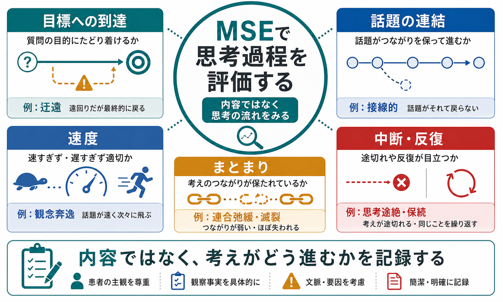
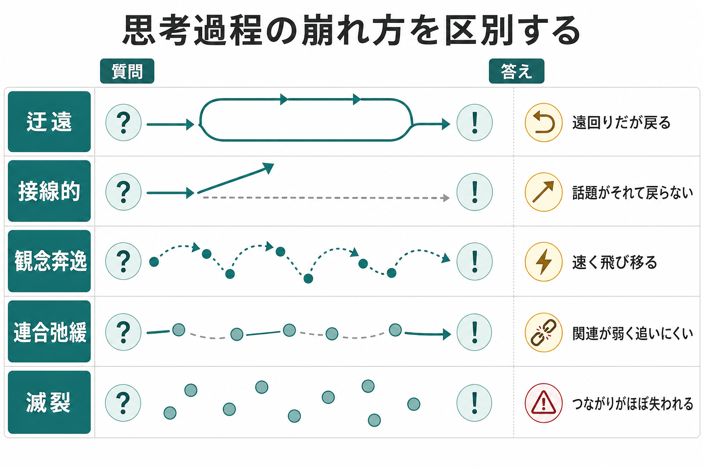

# MSEで思考過程をどう評価するか

## 要点

- MSEにおける思考過程とは、「何を考えているか」ではなく、「考えがどのように進み、言葉としてどのように組織されるか」を観察する項目である[1][5]。
- 基本は、開かれた質問への自然な語りを聴き、目標への到達、話題間の連結、速度、まとまり、中断、反復をみることである[1][2]。
- 迂遠は遠回りでも最終的に戻る、接線的は話題が逸れて戻らない、観念奔逸は速く飛び移る、連合弛緩は関連が弱く追いにくい、滅裂はつながりがほぼ失われる状態として区別する[1][2]。
- 思考過程の乱れは統合失調症だけでなく、躁状態、抑うつ、物質使用、神経認知障害、発達特性、身体疾患などでも現れうるため、単独所見で診断を断定しない[2][5][7]。
- 記録では「連合弛緩あり」とだけ書くより、「質問への回答が話題間で飛び、質問に戻らず、要点を追いにくい」のように観察事実を添える。

## この記事で答える問い

1. MSEでいう「思考過程」は、思考内容と何が違うのか。
2. 迂遠、接線的、観念奔逸、連合弛緩、滅裂、思考途絶、保続をどう見分けるのか。
3. 面接中にどのような質問と観察で評価するのか。
4. 診断や研究、臨床記録へどう接続するのか。

## まず結論

MSEで思考過程を評価するときは、患者の発言を「正しいか・奇妙か」で裁くのではなく、発言が質問の目的へどのように向かうか、話題同士がどの程度つながるか、速度が速すぎないか、途中で途切れたり同じ場所に戻ったりしないかを観察する。つまり、評価対象は「信念の内容」ではなく「語りの構造」である。

たとえば「政府に監視されている」という発言は、思考内容としては被害的な内容かもしれない。しかし、その話が質問に沿って整理されているのか、質問からそれて戻らないのか、次々に話題が飛ぶのか、語と語の関係がほぼ追えないのかは、思考過程として別に記述する。この区別は、[[精神科面接とは何か]]、[[精神科初診で何を確認するべきか]]、[[精神科診断における除外診断とは何か]]と直結する。

## 背景

精神状態診察、すなわち Mental Status Examination（MSE）は、面接時点の外観、行動、発話、気分、感情、思考、知覚、認知、病識、判断などを構造化して記述する枠組みである[1]。その中で「思考」はしばしば、思考過程と思考内容に分けて扱われる。

思考内容は、妄想、希死念慮、自殺念慮、他害念慮、強迫観念、過価値観念など、「何が考えられているか」を扱う。一方、思考過程は、線状性、目標志向性、まとまり、連想のつながり、速度、中断、反復など、「考えがどう流れるか」を扱う[1]。この区別を曖昧にすると、奇異な内容を話しているが過程は整っている人と、内容は日常的でも話題のつながりが著しく崩れている人を混同しやすい。

形式的思考障害（formal thought disorder）は、思考の内容ではなく形式や言語・コミュニケーションの障害として整理されてきた概念であり、現在では統合失調症に限らず、気分障害、神経認知障害、物質関連状態などを含む広い文脈で検討されている[5][7]。MSEでの評価は、診断名を即断するためではなく、臨床的な観察を再現可能な言葉へ変換するために行う。

## 基本概念

### 線状・目標志向的

線状で目標志向的な思考過程では、質問に対する答えが大きく逸れず、必要な背景を示しながら要点に到達する。話題の展開には前後関係があり、聞き手が「何について話しているか」を追いやすい。

### 迂遠

迂遠（circumstantiality）は、不要な細部や回り道が多いが、最終的には質問や主題に戻る話し方である[1][2]。たとえば「最終学歴は何ですか」と聞かれて、高校時代の先生、部活動、大学受験の経緯を長く語った後に「大学卒業です」と答える場合、遠回りではあるが目標に到達している。

### 接線的

接線的（tangentiality）は、話題が質問から逸れ、最終的に元の質問へ戻らない状態である[1][2]。迂遠との違いは「戻るかどうか」である。接線的な語りでは、発言の一部には連結があっても、質問への回答としては要点に到達しない。

### 観念奔逸

観念奔逸（flight of ideas）は、話題が速く次々に移り、連想の速度が聞き手の追跡を超えやすい状態である[1][2]。音、語呂、外部刺激、感情の高まりに引かれて話題が飛ぶことがあり、躁状態や物質使用などの文脈でも観察される。

### 連合弛緩・脱線

連合弛緩（loosening of associations）や脱線（derailment）は、発言同士の意味的なつながりが弱く、聞き手が話の筋を追いにくくなる状態である。軽度では「関連はありそうだが飛躍が大きい」と感じられ、重度では文脈が急に切り替わる[1][4]。

### 滅裂・ incoherence

滅裂、あるいは incoherence は、語、文、話題のつながりが大きく失われ、聞き手が全体の意味をほとんど把握できない状態である。DSM-5の統合失調症基準でも、解体した発話は頻回な脱線や incoherence の例として示されるが、MSE上はまず観察された発話の形式として記述する[3]。

### 思考途絶・保続

思考途絶（thought blocking）は、考えや発話が急に止まり、再開が難しくなるように見える状態である[1]。保続（perseveration）は、質問や話題が変わっても同じ語、主題、反応に戻り続ける状態で、思考内容との関連も含めて記録する必要がある[1]。

## 仕組み

### 1. まず自由な語りを確保する

思考過程は、はい・いいえで答えられる質問だけでは評価しにくい。最初は「最近困っていることを、はじめから順に教えてください」「今日ここに来るまでの経緯を教えてください」のような開かれた質問を使う。[[開かれた質問と閉じた質問はどう使い分けるのか]]で扱うように、開かれた質問は語りの構造を観察するための入口になる。

### 2. 話の「内容」ではなく「流れ」を聴く

面接者は、発言の内容に反応しすぎると、過程の観察を見落とす。次の観点を分けて見る。

| 観点 | 見ること | 記録例 |
|---|---|---|
| 目標への到達 | 質問に答えられるか | 「迂遠だが最終的に質問へ戻る」 |
| 話題の連結 | 前後の話題に意味的関連があるか | 「話題間の関連が弱く、要点を追いにくい」 |
| 速度 | 速すぎる、遅すぎる、圧迫的か | 「発話が速く、話題が次々に移る」 |
| まとまり | 文や段落として理解できるか | 「文脈の切り替わりが急で、話の筋が不明瞭」 |
| 中断・反復 | 急に止まる、同じ主題に戻るか | 「質問を変えても同じ訴えに戻る」 |

### 3. 重症度と文脈を同時に見る

同じ「話がまとまりにくい」でも、緊張、せん妄、神経認知障害、聴覚障害、発達特性、言語能力、文化差、物質使用、薬剤影響、躁状態、精神病症状などで意味が変わる[2][5]。特に急性発症、意識変容、発熱、神経学的所見、物質使用が疑われる場合は、[[器質性精神障害を見逃さないためには何を見るべきか]]や[[物質使用歴はどのように聞くべきか]]と合わせて評価する。

### 4. 必要なら焦点化して確認する

自由な語りだけで判断せず、必要に応じて「今の話は、最初の質問とどうつながりますか」「結論から言うと、何が一番困っていますか」「先ほどの話に戻ると、いつから始まりましたか」と焦点化する。焦点化しても戻れないのか、促せば戻れるのかは、重症度や注意障害との鑑別に役立つ。

### 5. 記録は短く具体的にする

記録では、専門用語と観察事実を組み合わせる。

- よい例: 「思考過程は迂遠。質問から脱線するが、促しにより要点へ戻る。」
- よい例: 「発話は圧迫的で、話題が睡眠、仕事、宗教的主題へ急速に移る。観念奔逸が疑われる。」
- よい例: 「話題間の関連が弱く、質問への回答が成立しにくい。連合弛緩が目立つ。」
- 避けたい例: 「支離滅裂」「変」「統合失調症っぽい」だけで終える。

## 図解

図1は、MSEで思考過程を見るときの全体像を示している。中心は「内容ではなく、考えがどう進むか」である。図2は、迂遠、接線的、観念奔逸、連合弛緩、滅裂を、質問から答えへ向かうルートの違いとして比較している。図3は、面接での観察から記録までの流れを示している。

## 臨床・研究との接続

臨床では、思考過程の評価は[[鑑別診断とは何か]]の材料になる。解体した発話は統合失調症スペクトラムで重要な所見だが、躁状態、物質使用、せん妄、神経認知障害、発達特性、極度の不安や緊張でも語りは乱れうる。そのため、MSEの記述は診断名への近道ではなく、症状の構造、重症度、経過、安全性、生活機能への影響を整理するための情報である。

研究では、形式的思考障害は、TLCなどの評価尺度によって、脱線、接線性、貧困発話、 incoherence などの複数次元として操作化されてきた[4][6]。近年のレビューでは、形式的思考障害は統合失調症に限定される単一症状ではなく、陽性・陰性、主観的・客観的、言語・意味・実行機能などが関わる多次元構成概念として扱われる[5][8]。統合失調症と双極性障害の比較研究でも、急性期の陽性形式的思考障害は両者で重なりうる一方、持続的な陽性障害や陰性形式的思考障害は群差に関わる可能性が示されている[7]。

このため、MSEの教育では「用語を暗記する」だけでは不十分である。観察、促しへの反応、文脈、経過、生活機能への影響を合わせて記録することで、[[操作的診断とは何か]]や[[DSMとICDは何が違うのか]]に接続しやすくなる。

## よくある誤解

### 誤解1: 思考過程の乱れがあれば統合失調症である

解体した発話は統合失調症スペクトラムで重要だが、形式的思考障害は複数の精神疾患や身体・神経学的状態で現れうる[5][7]。診断には持続期間、他の症状、機能低下、除外診断、経過が必要である。

### 誤解2: 迂遠と接線的は同じである

両者は「話が遠回り」という点で似ているが、迂遠は最終的に質問へ戻る。接線的は戻らない[1][2]。この違いは、面接での情報収集のしやすさや促しへの反応を考えるうえで重要である。

### 誤解3: 内容が奇妙なら思考過程も乱れている

奇異な信念や妄想的内容を語っていても、話の構造は線状で目標志向的な場合がある。逆に、内容は日常的でも、話題の連結が弱く、質問への回答が成立しない場合もある。思考内容と思考過程は分けて記録する。

### 誤解4: 用語だけ書けば十分である

「連合弛緩あり」だけでは、どの程度、どの場面で、促しに反応するのかが伝わりにくい。MSEの記録では、用語に加えて短い観察事実を書く。

## 関連ノート

既存ノート:

- [[精神科面接とは何か]]
- [[精神科初診で何を確認するべきか]]
- [[精神科診断における除外診断とは何か]]
- [[鑑別診断とは何か]]
- [[器質性精神障害を見逃さないためには何を見るべきか]]
- [[物質使用歴はどのように聞くべきか]]
- [[操作的診断とは何か]]
- [[精神科で重症度をどう判断するか]]

今後の作成候補:

- MSEで思考内容をどう評価するか
- MSEで発話をどう評価するか
- 形式的思考障害とは何か
- 妄想と過価値観念はどう違うか

MOC更新候補:

- `content/00_MOC/` 配下の精神医学、診断、精神科面接関連MOCに追加候補。並列ジョブとの競合を避けるため、本記事ではMOC本体は更新しない。

## 理解チェック

1. 迂遠と接線的の最も重要な違いは何か。
2. 「話が奇妙である」と「思考過程が乱れている」はなぜ同じではないのか。
3. 観念奔逸を記録するとき、速度以外に何を観察するとよいか。
4. 連合弛緩を診断名に直結させず、文脈と合わせて見る必要があるのはなぜか。
5. 「連合弛緩あり」を、観察事実を含む記録文に書き換えるとどうなるか。

## 未解決問題

- 形式的思考障害を臨床面接で短時間にどこまで信頼性高く評価できるか。
- 自然言語処理による発話分析を、臨床判断の補助としてどのように安全に使えるか。
- 文化差、母語差、発達特性、教育歴を、思考過程評価でどのように補正するか。
- 患者の尊厳を損なわずに、専門用語を記録へどう反映するか。

## 参考文献

[1] Voss RM, Das JM. Mental Status Examination. *StatPearls*. Updated 2024-04-30. NCBI Bookshelf. https://www.ncbi.nlm.nih.gov/books/NBK546682/

[2] Balaram K, Marwaha R. Circumstantiality. *StatPearls*. Updated 2024-12-11. NCBI Bookshelf. https://www.ncbi.nlm.nih.gov/books/NBK532945/

[3] Hany M, Rizvi A. Schizophrenia. *StatPearls*. Updated 2024-02-23. NCBI Bookshelf. https://www.ncbi.nlm.nih.gov/books/NBK539864/

[4] Andreasen NC. Thought, language, and communication disorders. I. Clinical assessment, definition of terms, and evaluation of their reliability. *Archives of General Psychiatry*. 1979;36(12):1315-1321. https://doi.org/10.1001/archpsyc.1979.01780120045006

[5] Kircher T, Bröhl H, Meier F, Engelen J. Formal thought disorders: from phenomenology to neurobiology. *The Lancet Psychiatry*. 2018;5(6):515-526. https://doi.org/10.1016/S2215-0366(18)30059-2

[6] Andreasen NC. Scale for the assessment of thought, language, and communication (TLC). *Schizophrenia Bulletin*. 1986;12(3):473-482. https://doi.org/10.1093/schbul/12.3.473

[7] Yalincetin B, Bora E, Binbay T, Ulas H, Akdede BB, Alptekin K. Formal thought disorder in schizophrenia and bipolar disorder: A systematic review and meta-analysis. *Schizophrenia Research*. 2017;185:2-8. https://doi.org/10.1016/j.schres.2016.12.015

[8] Oeztuerk OF, Pigoni A, Antonucci LA, Koutsouleris N. Association between formal thought disorders, neurocognition and functioning in the early stages of psychosis: a systematic review of the last half-century studies. *European Archives of Psychiatry and Clinical Neuroscience*. 2022;272:381-393. https://doi.org/10.1007/s00406-021-01295-3
