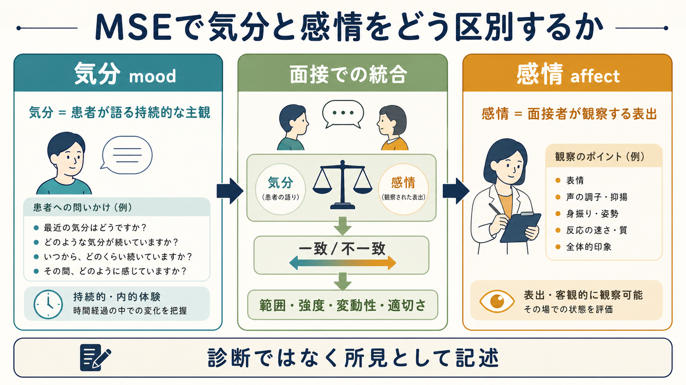
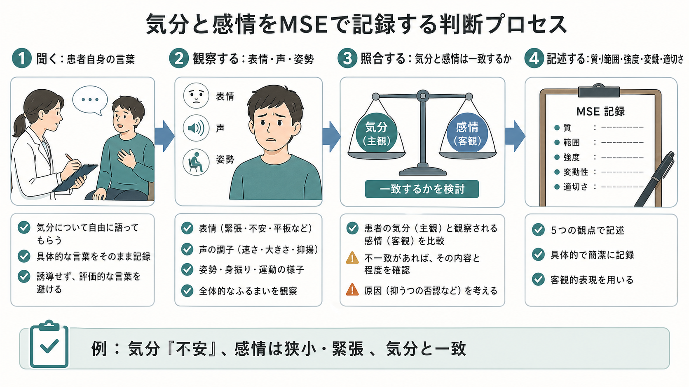
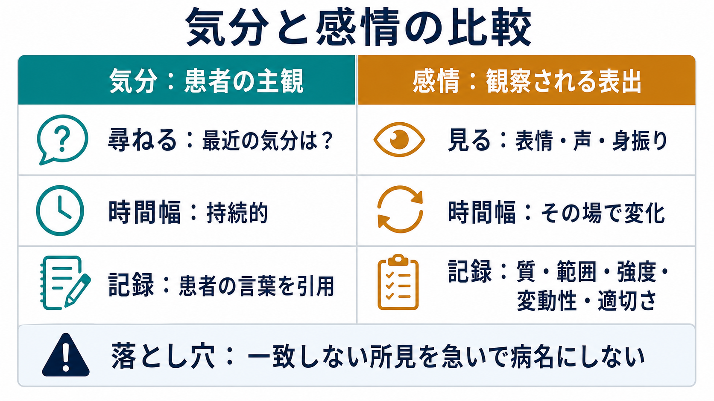

# MSEで気分と感情をどう区別するか

## 要点

- MSEにおける「気分」は、患者が自分の内的状態をどう経験し、どう言語化するかを指す。基本は患者自身の言葉で尋ね、可能なら引用して記録する[1]。
- 「感情」は、面接中に観察される表情、声の調子、姿勢、身振り、反応の速さ、変動の仕方などから面接者が記述する表出である[1][2]。
- 気分と感情は一致することも、不一致であることもある。不一致は重要な所見だが、それだけで診断名を決めるものではない[1]。
- 感情は「質」だけでなく、範囲、強度、変動性、状況への適切さ、気分との一致/不一致を分けて書くと、[[診療録は精神科でどう書くべきか]]に接続しやすい[1][2]。
- 本記事は教育・研究目的の整理であり、個別の診断や治療方針を指示するものではない。

## この記事で答える問い

1. MSEでいう「気分」と「感情」は何が違うのか。
2. 面接では、それぞれをどのように尋ね、観察し、記録するのか。
3. 気分と感情が一致しないとき、どのように臨床的に扱うのか。
4. よくある記載ミスを避けるには、何を分けて考えればよいのか。

## まず結論

実務上の最短ルールは、「気分は患者に聞く、感情は面接者が見る」である。気分は「最近の気分はどうですか」「どのような感じが続いていますか」と尋ねて、患者自身の言葉を中心に記録する。感情は、面接中に観察される情動表出を、表情、声、姿勢、反応、変化の幅として記述する[1][2]。

ただし、この区別は「主観」と「客観」を機械的に二分するためのものではない。気分にも表情や行動は関係するし、感情の観察にも面接者の解釈が入る。そのため、MSEでは「患者は『落ち込んでいる』と述べる」「感情は狭小で、声量は小さく、話題に応じた変化は乏しい」のように、発言と観察を分けて書くことが重要になる[1]。これは[[精神科面接とは何か]]で扱う「聞くこと」と「観察すること」の両方を、記録上で混同しないための工夫である。

## 背景

精神状態診察、すなわちMSEは、外観、行動、発話、気分、感情、思考過程、思考内容、知覚、認知、病識、判断力などを構造的に評価する枠組みである[1][2]。身体診察が現在の身体所見を記述するように、MSEは面接時点の心理・行動・認知の状態を記述する。ただし、MSEは検査値のように単独で診断を決めるものではなく、現病歴、生活歴、身体疾患、物質使用、文化的背景、リスク評価などと統合して理解する必要がある[3][4]。

気分と感情の区別が重要なのは、両者が異なる情報源から得られるからである。気分は患者の内的経験に近く、本人の語りを尊重しないと把握しにくい。一方、感情は面接場面で観察される表出に近く、本人が「大丈夫」と述べていても、涙ぐむ、表情が乏しい、急に笑う、話題にそぐわない反応を示す、といった形で現れることがある[1][2]。

この違いは、[[精神科診断は何のためにあるのか]]や[[操作的診断とは何か]]とも関係する。診断基準は症状の組み合わせを扱うが、MSEの記述はその前段階として、どのような発言と観察があったのかを残す。したがって「抑うつ的」と一語で済ませるより、「気分は『気が重い』、感情は抑うつ的で範囲は狭い」のように分けた方が、後から読んだ人が判断過程を追いやすい。

## 基本概念

### 気分

気分 mood は、比較的持続する主観的な感情状態である。MSEでは、患者自身が自分の状態をどう言い表すかを重視する[1]。典型的には「憂うつ」「不安」「いらいらする」「空っぽ」「普通」「高揚している」「落ち着かない」などの言葉で語られる。

記録では、できるだけ患者の言葉を保つ。たとえば「気分：『何をしても楽しくない』と述べる」「気分：『不安で胸がざわざわする』」のように書く。面接者が要約する場合も、「抑うつ気分を訴える」「不安気分を訴える」と、訴えであることを明示すると混乱が少ない。

気分を聞くときは、単に「気分は？」と聞くだけでは不十分なことがある。時間幅、きっかけ、日内変動、睡眠や食欲との関係、生活機能への影響を確認することで、[[精神科初診で何を確認するべきか]]や[[現病歴はどのように構造化するべきか]]の情報と接続できる。

### 感情

感情 affect は、面接中に観察される情動表出である。Clinical Methods は、affect を「患者の即時的な感情表現」、mood を「より持続的な情動的状態」として区別している[2]。StatPearls も、mood は患者自身の言葉による主観的記述、affect は非言語的表出を含む臨床家の観察として整理している[1]。

感情は、少なくとも次の観点で記述できる。

| 観点 | 見るもの | 記載例 |
|---|---|---|
| 質 | どのような情動に見えるか | 抑うつ的、不安、易刺激的、怒り、明るい、緊張 |
| 範囲 | 表情や反応の幅 | 広い、狭い、平板、鈍麻 |
| 強度 | 表出の強さ | 軽度、中等度、強い、過度 |
| 変動性 | 面接中の変化 | 安定、変動しやすい、易変性、急に涙ぐむ |
| 適切さ | 話題や状況との関係 | 状況に相応、話題に比して不適切 |
| 一致 | 気分との関係 | 気分と一致、気分と不一致 |

「平板」「鈍麻」「狭小」「易変性」などの言葉は便利だが、ラベルだけでは再現性が乏しい。可能なら「表情変化は乏しく、声量は小さい」「悲しい話題で笑みが出る」「話題の変化に伴って涙と笑顔が急に入れ替わる」のように、観察事実を添える。

## 仕組み

気分と感情の評価は、次の4段階で考えると整理しやすい。

### 1. 聞く

まず、患者が自分の状態をどう説明するかを聞く。ここでは誘導を避け、「最近の気分を、ご自身の言葉で言うとどうですか」「その感じはいつ頃から、どのくらい続いていますか」といった問いが使いやすい。患者が「普通です」と答えた場合も、「その普通は、いつもの普通に近いですか」「つらさや不安はありますか」と具体化する。

### 2. 観察する

次に、患者の表情、視線、声の調子、発話速度、姿勢、身振り、反応のタイミングを見る。感情は言語報告と独立して観察されるため、患者が「平気です」と述べながら涙ぐむ、あるいは「悲しい」と述べながら表情が乏しい場合、そこに臨床的な情報がある[1]。

ただし、表出の乏しさをすぐに病的とみなすのは危険である。パーキンソン病、薬剤性パーキンソニズム、顔面神経麻痺、発達特性、文化的規範、疲労、面接への緊張などでも表情や声は変わる。Clinical Methods も、affect は状況や先行する観察の文脈で判断すべきだと述べている[2]。これは[[器質性精神障害を見逃さないためには何を見るべきか]]とも関係する。

### 3. 照合する

気分と感情が一致しているかを確認する。たとえば「気分は『つらい』、感情は抑うつ的で涙ぐみ、気分と一致」と書ける場合もあれば、「気分は『最高』、感情は涙ぐみ、気分と不一致」と書く場合もある[1]。

不一致は重要な所見だが、単独では診断名ではない。物質使用、睡眠不足、躁状態、抑うつ、解離、緊張、文化的な感情表出、対人場面での防衛、神経疾患など、複数の可能性がある。したがって「不一致がある」ことと「何の疾患である」ことを分ける必要がある。

### 4. 記述する

最後に、気分と感情を分けて記録する。良い記載は、後から読んだ人が「患者が何を述べ、面接者が何を見たのか」を追える。たとえば次のように書く。

> 気分：「不安で落ち着かない」と述べる。感情：不安げで緊張が目立つ。表情は硬く、声量は小さい。範囲は狭小。気分と一致。

> 気分：「特に困っていない」と述べる。感情：話題により涙ぐみ、質問への反応は遅い。本人の気分報告とは一部不一致。

このような記録は、[[鑑別診断とは何か]]や[[精神科で重症度をどう判断するか]]の検討で、症状の存在だけでなく、その確からしさや文脈を見直す助けになる。

## 図解

図の要点は、気分と感情を「どちらが正しいか」で比べるのではなく、情報源の違いとして扱うことである。気分は本人にとっての内的経験であり、感情は面接場面で観察される表出である。臨床では両方を並べて見て、相互に補う。

## 臨床・研究との接続

臨床では、気分と感情の区別は診断、リスク評価、治療経過の把握に役立つ。たとえば、抑うつ気分の訴えと感情の狭小化が持続し、睡眠、食欲、活動性、希死念慮などと関連する場合、[[うつ病とは何か]]や[[自殺リスク評価では何を聞くべきか]]の評価につながる。逆に、患者が高揚感を語り、感情も高揚しており、発話量増加、睡眠欲求低下、観念奔逸などが伴えば、[[躁状態とは何か]]の評価と接続する。

一方、気分と感情の所見は単独で完結しない。MSE全体では、発話、思考過程、思考内容、知覚、認知、病識、判断力も合わせて見る[1][2]。感情が平板に見える場合でも、発話量、思考内容、社会的文脈、薬剤、神経疾患、文化的背景を統合しなければ、[[精神疾患とは何か]]の理解としては粗くなる。

研究や教育では、気分と感情を分けて記録することが評価者間のずれを減らす。特に、学生や初学者は「患者が悲しいと言った」ことと「悲しそうに見えた」ことを同じ欄に書きがちである。MSE教育では、発言の引用、観察事実、面接者の解釈を分ける練習が有効である。StatPearls は、MSEが診断とモニタリングに使われる一方で、観察者や文脈による主観性を含むことも指摘している[1]。

## よくある誤解

### 誤解1：気分は「本当の気持ち」、感情は「外見上の演技」である

この分け方は適切ではない。気分も感情も、その人の状態を理解するための情報である。感情表出が本人の意図的な演技だと決めつけると、観察が評価的になりすぎる。MSEでは「演技」「不自然」と断定する前に、どのような表出が、どの文脈で、どの程度見られたかを書く。

### 誤解2：気分と感情が不一致なら、ただちに重症である

不一致は注意すべき所見だが、重症度を単独で決めるものではない。感情表出には文化、対人場面、身体疾患、薬剤、疲労、緊張、トラウマ歴などが影響する[2][4]。重症度は、苦痛、機能障害、リスク、病識、判断力、生活背景と合わせて評価する。

### 誤解3：「感情：抑うつ的」と書けば十分である

「抑うつ的」は質を表す言葉にすぎない。範囲、強度、変動性、適切さ、気分との一致を加えると情報量が大きく増える。たとえば「抑うつ的、範囲狭小、声量小、涙ぐむ、気分と一致」の方が、後から経過を比較しやすい。

### 誤解4：患者の言葉と観察が違うときは、観察の方が正しい

これも危険である。患者の主観的経験は、それ自体が重要な臨床情報である。観察はそれを補うが、置き換えるものではない。両者が違うときは「どちらが正しいか」ではなく、「なぜ違って見えるのか」「どの情報を追加すれば理解できるのか」と考える。

## 関連ノート

既存ノート：

- [[精神科面接とは何か]]
- [[精神科初診で何を確認するべきか]]
- [[現病歴はどのように構造化するべきか]]
- [[診療録は精神科でどう書くべきか]]
- [[鑑別診断とは何か]]
- [[精神科で重症度をどう判断するか]]
- [[自殺リスク評価では何を聞くべきか]]
- [[器質性精神障害を見逃さないためには何を見るべきか]]
- [[うつ病とは何か]]
- [[躁状態とは何か]]

今後の作成候補：

- 精神状態診察MSEとは何か
- MSEで話し方から何がわかるのか
- MSEで思考過程をどう評価するか
- MSEで思考内容をどう評価するか
- MSEで認知機能をどう評価するか
- MSEで病識と判断力をどう評価するか

MOC更新候補：

- `content/00_MOC/` 配下の精神医学、診断・面接、臨床実践関連MOC
- 並列ジョブとの競合を避けるため、本タスクではMOC本体を更新しない。

## 理解チェック

1. MSEで「気分」を記録するとき、患者の言葉を引用する利点は何か。
2. 「感情：平板」とだけ書くより、「表情変化が乏しく、声量も小さい」と書く方がよいのはなぜか。
3. 「気分は『大丈夫』、感情は涙ぐみ、気分と不一致」という所見から、ただちに診断名を決めてはいけない理由は何か。
4. 感情を記述するとき、質、範囲、強度、変動性、適切さ、一致/不一致のうち、どの観点を見落としやすいか。
5. 感情表出が乏しい患者を評価するとき、精神疾患以外に確認すべき要因は何か。

## 参考文献

[1] Voss, R. M., & Das, J. M. (2024). *Mental Status Examination*. StatPearls. NCBI Bookshelf. https://www.ncbi.nlm.nih.gov/books/NBK546682/

[2] Martin, D. C. (1990). The mental status examination. In H. K. Walker, W. D. Hall, & J. W. Hurst (Eds.), *Clinical Methods: The History, Physical, and Laboratory Examinations* (3rd ed.). Butterworths. NCBI Bookshelf. https://www.ncbi.nlm.nih.gov/books/NBK320/

[3] Merck Manual Professional Edition. (2025). *Initial Psychiatric Assessment*. https://www.merckmanuals.com/professional/psychiatric-disorders/approach-to-the-patient-with-psychiatric-symptoms/initial-psychiatric-assessment

[4] American Psychiatric Association Work Group on Psychiatric Evaluation. (2015). The American Psychiatric Association Practice Guidelines for the Psychiatric Evaluation of Adults. *American Journal of Psychiatry, 172*(8), 798-802. https://doi.org/10.1176/appi.ajp.2015.1720501

[5] Merck Manual Professional Edition. (2025). *How To Assess Mental Status*. https://www.merckmanuals.com/professional/neurologic-disorders/neurologic-examination/how-to-assess-mental-status
