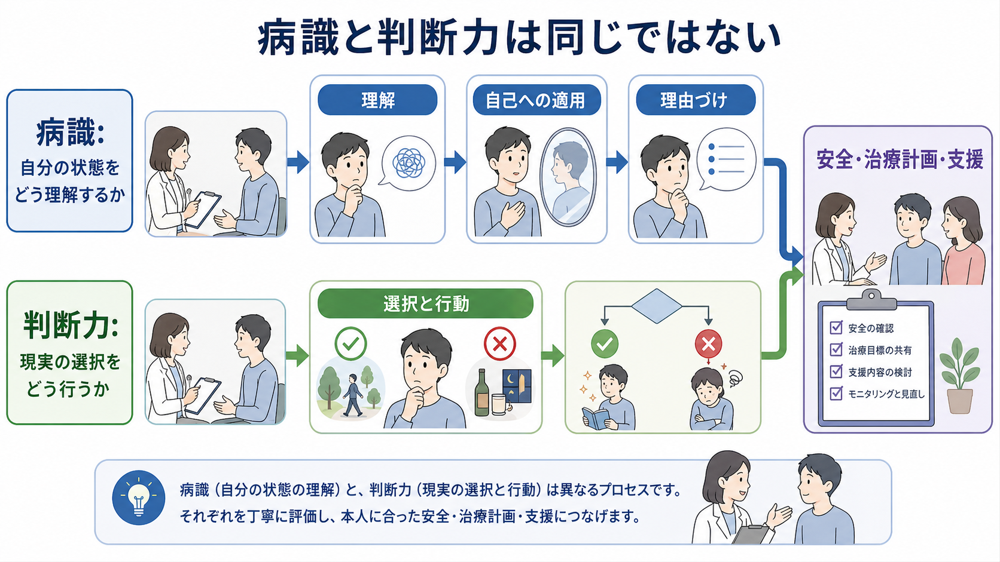
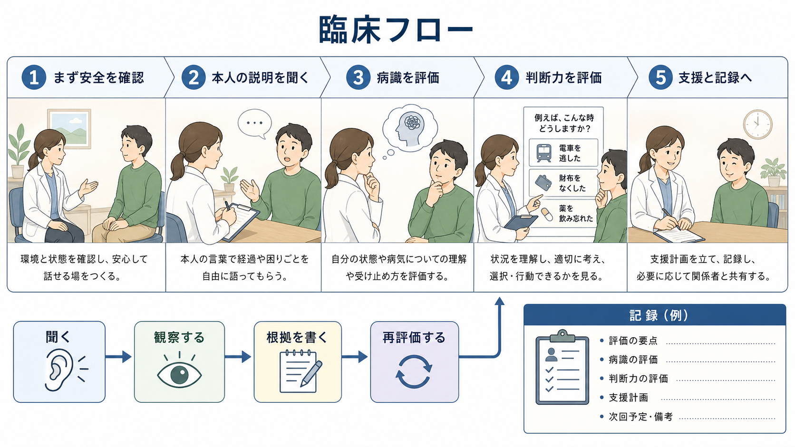

# MSEで病識と判断力をどう評価するか

## 要点

- [[精神状態診察MSEとは何か|MSE]]における病識は、本人が自分の症状や困りごとをどのように理解し、何に原因を帰属し、治療や支援の必要性をどう捉えているかを見る領域である[1][2]。
- 判断力は、現実の状況、リスク、生活上の制約を踏まえて、どの程度安全で一貫した選択や行動ができるかを見る領域である[1]。
- 病識が乏しいことと、判断力が一律に乏しいこと、あるいは[[意思決定能力とは何か|意思決定能力]]がないことは同じではない[3][4]。
- 評価では「本人の説明」「観察された行動」「家族・支援者情報」「リスク」「治療選択の文脈」を分けて記録する。

## この記事で答える問い

1. MSEで「病識」と「判断力」は何を指すのか。
2. どのような質問と観察で評価するのか。
3. 病識低下、判断力低下、同意能力低下をどう区別するのか。
4. 記録では何を根拠として残すべきか。

## まず結論

MSEで病識と判断力を評価するときは、「正しい病名を言えるか」だけを見ない。病識では、本人が症状、機能低下、周囲からの懸念、治療や支援の意味をどのように説明しているかを見る。判断力では、その理解を現実の選択や行動にどう結びつけているかを見る。

たとえば「自分は病気ではない」と述べても、服薬すると再入院を避けやすいと経験的に理解して通院を継続できる人がいる。逆に、診断名を言えても、現在の自傷・他害リスク、金銭管理、服薬中断、睡眠剥奪、物質使用などへの現実的対応が難しい人もいる。したがって、病識と判断力は重なりつつも別の観察対象として扱う。



## 背景

MSEは、面接時点の精神状態を、外観、行動、発話、気分・感情、思考、知覚、認知、病識、判断力などに整理して記述する方法である[1]。病識と判断力はMSEの末尾に短く書かれがちだが、実際には治療関係、リスク評価、[[インフォームドコンセントは精神科でどう行うのか|インフォームドコンセント]]、退院支援、地域生活支援に直結する。

病識は古典的には、精神疾患があることの認識、治療への協力、妄想や幻覚などの異常体験を病的なものとして再ラベル化できる能力など、複数の次元から捉えられてきた[2]。このため「病識あり／なし」の二分法では粗すぎる。MSEでは、どの側面が保たれ、どの側面が揺らいでいるのかを記述するほうが臨床的に有用である。

## 基本概念

### 病識

病識は、本人が自分の状態をどの程度「問題として理解しているか」を見る概念である。典型的には次の側面を確認する。

| 側面 | 見ること | 質問例 |
|---|---|---|
| 症状への気づき | 気分、思考、知覚、行動の変化を認識しているか | 「最近、ご自身でいつもと違うと感じることはありますか」 |
| 原因への理解 | 変化を何に関連づけているか | 「その変化は何が関係していると思いますか」 |
| 治療必要性 | 服薬、心理教育、休養、支援の意味を理解しているか | 「治療や支援は、どの点に役立つと思いますか」 |
| 生活への影響 | 学業、仕事、対人関係、セルフケアへの影響を認識しているか | 「生活で困っていることは何ですか」 |

病識の評価では、本人が専門用語を使えるかよりも、本人の言葉で困りごと、変化、説明モデル、支援への態度を述べられるかを見る。[[病識とは何か]]で扱うように、病識は症状、認知機能、文化的背景、治療者との信頼関係、スティグマの影響を受ける。

### 判断力

判断力は、状況に応じた現実的な選択と行動の能力を評価する領域である[1]。ここでいう判断力は「価値観が医療者と一致するか」ではない。本人が置かれている状況、利用できる資源、予測される利益とリスクを踏まえて、どの程度一貫した行動方針を立てられるかを見る。

| 観察対象 | 見ること | 質問例 |
|---|---|---|
| 安全判断 | 自傷・他害、セルフネグレクト、危険行動への対応 | 「つらさが強くなったとき、まず誰に連絡しますか」 |
| 治療判断 | 服薬、通院、休養、入院、支援利用への現実的見通し | 「薬を飲まない場合、何が起こりそうですか」 |
| 社会的判断 | 金銭、仕事、家庭、対人関係での選択 | 「今週の生活で、優先して整えることは何ですか」 |
| 柔軟性 | 新しい情報や反証に応じて考えを修正できるか | 「別の可能性があるとしたら、何が考えられますか」 |

判断力は、本人の過去の行動、現在の行動、面接中の応答、周囲からの情報を統合して評価する。仮想場面だけで判断すると、実生活での行動を見落とすことがある。

## 仕組み

病識と判断力は、次のような流れで評価すると混乱しにくい。

1. まず覚醒水準、注意、記憶、言語、せん妄、薬剤・物質、身体疾患の影響を確認する。
2. 本人の説明を遮らずに聞き、症状や困りごとの意味づけを把握する。
3. 病識を、症状への気づき、原因理解、治療必要性、生活影響の各側面に分けて見る。
4. 判断力を、具体的な選択、リスク予測、代替案の比較、行動計画として確認する。
5. 本人の価値観、文化的背景、支援資源を踏まえ、必要なら再説明や再評価を行う。

この流れは、[[同意能力の評価はどのように行うのか|同意能力の評価]]とも接続する。医療上の意思決定能力では、理解、自己への適用、理由づけ、選択の表明という機能が重視される[3][4][5]。ただし、MSEの病識・判断力評価は、法的な能力判定そのものではなく、臨床的に「いま何を支援すれば本人の判断が成立しやすいか」を明らかにするための所見である。



## 図解

図1は、病識を「自分の状態をどう理解するか」、判断力を「現実の選択をどう行うか」と分けている。両者は安全確認、治療計画、支援調整へ合流するが、同一の能力ではない。

図2は、臨床での確認順序を示す。最初に安全と環境を整え、本人の説明を聞き、病識と判断力を分けて評価し、支援計画と記録へ接続する。

## 臨床・研究との接続

### アドヒアランス

病識は[[アドヒアランスとは何か|アドヒアランス]]と関連するが、単独で治療継続を決めるわけではない。統合失調症スペクトラム障害における抗精神病薬アドヒアランスの系統的レビューでは、薬への肯定的態度と病識が比較的一貫して良好なアドヒアランスと関連していた一方、研究方法や測定の違いが大きいことも指摘されている[6]。したがって、病識を「服薬する／しない」の単純な説明に使うのではなく、本人の経験、効果実感、副作用、治療関係、生活上の制約を合わせて見る。

### 共同意思決定

判断力の評価は、本人の選択を置き換える作業ではない。NICEの共同意思決定ガイドラインは、医療者とサービス利用者が治療やケアの選択について協働すること、リスク・利益・結果を分かりやすく共有することを重視している[7]。精神科でも、病識や判断力に揺らぎがある場合ほど、説明方法、時間、支援者同席、意思決定支援を調整する必要がある。これは[[共同意思決定とは何か]]や[[治療関係とは何か]]の実践と重なる。

### 鑑別診断と安全

病識や判断力の低下は、精神病性障害だけでなく、せん妄、認知症、気分障害、発達特性、物質使用、薬剤性症状、身体疾患、睡眠不足、強いストレスでも生じうる。急性変化、意識変容、注意障害、身体所見がある場合は、[[器質性精神障害を見逃さないためには何を見るべきか|器質性精神障害]]や[[鑑別診断とは何か|鑑別診断]]を優先して考える。

## よくある誤解

### 誤解1: 病名を認めない人は全員「病識なし」である

病名への同意は一部にすぎない。本人が睡眠不足、強い不安、声への困惑、家族との衝突、仕事への影響を理解しているなら、病識の一部は保たれている。記録では「診断名への同意なし」だけでなく、「どの問題は認め、どの説明を拒んでいるか」を書く。

### 誤解2: 病識が低いと判断力も必ず低い

病識と判断力は関連するが同一ではない。自分の体験を病的とは捉えなくても、休養、通院、危険回避、家族への連絡などを現実的に選べる場合がある。逆に、診断名を言えても、急性リスクや生活上の制約を行動に反映できない場合がある。

### 誤解3: 医療者と違う選択をすることは判断力低下である

本人が医療者と異なる選択をすること自体は、判断力低下ではない。重要なのは、必要な情報を理解し、自分の状況に適用し、理由を述べ、選択を表明できるかである[3][4]。価値観に基づく選択と、妄想、せん妄、認知障害、強い衝動性による判断困難を区別する。

### 誤解4: MSEの「判断力」は法的能力判定である

MSE上の判断力は臨床所見であり、法的な能力判定と同じではない。医療上の意思決定能力は、特定の決定、時点、リスク水準に応じて評価される[4][5]。記録では「判断力不良」とだけ書かず、どの決定に関して、どの情報理解や理由づけに困難があったかを具体化する。

## 記録の書き方

短い記録でも、次の順序で書くと読み手が判断しやすい。

```text
病識: 本人は「眠れていないこと」と「仕事に支障が出ていること」は認める。一方、被害的確信については病的可能性を否定し、薬物療法の必要性は限定的に理解している。
判断力: 服薬への抵抗はあるが、睡眠悪化時に家族へ連絡し、外出を控える計画は立てられる。自傷他害の切迫した意図は否定。次回受診と支援者同席には同意。
```

避けたい記録は、「病識なし」「判断力低下」だけで終わる書き方である。根拠となる発言、観察、行動、支援計画を添える。

## 関連ノート

- [[精神状態診察MSEとは何か]]
- [[病識とは何か]]
- [[意思決定能力とは何か]]
- [[同意能力の評価はどのように行うのか]]
- [[インフォームドコンセントは精神科でどう行うのか]]
- [[共同意思決定とは何か]]
- [[アドヒアランスとは何か]]
- [[治療関係とは何か]]
- [[鑑別診断とは何か]]
- [[器質性精神障害を見逃さないためには何を見るべきか]]

MOC更新候補: `content/00_MOC/` 配下の精神医学、精神科面接、診断・評価、治療関係に関するMOC。並列生成ジョブとの競合を避けるため、本記事ではMOC本体を更新しない。

## 理解チェック

1. 病識を「診断名への同意」だけで評価すると、何を見落とすか。
2. 病識が乏しくても判断力の一部が保たれている例を説明できるか。
3. 判断力低下と、医療者とは異なる価値観に基づく選択をどう区別するか。
4. MSE上の判断力評価と、医療上の意思決定能力評価はどう違うか。
5. 「病識なし」とだけ書かずに記録するなら、どのような根拠を添えるべきか。

## 未解決問題

- 病識のどの側面が治療継続、リスク低減、生活機能の改善に最も強く関係するかは、疾患、病期、文化、支援資源によって異なる。
- MSEの短い記述と、MacCAT-Tなどの構造化された意思決定能力評価を、日常臨床でどのように接続するかは今後も実践上の課題である。
- 病識を高める介入が、スティグマや絶望感を増やさずに回復感を支える条件は、さらに丁寧な検討が必要である。

## 参考文献

[1] Voss, R. M., & Das, J. M. (2024). *Mental Status Examination*. StatPearls. NCBI Bookshelf. https://www.ncbi.nlm.nih.gov/books/NBK546682/

[2] David, A. S. (1990). On insight and psychosis: Discussion paper. *Journal of the Royal Society of Medicine, 83*(5), 325-329. https://doi.org/10.1177/014107689008300517

[3] Appelbaum, P. S., & Grisso, T. (1988). Assessing patients' capacities to consent to treatment. *New England Journal of Medicine, 319*(25), 1635-1638. https://doi.org/10.1056/NEJM198812223192504

[4] Barstow, C., Shahan, B., & Roberts, M. (2018). Evaluating medical decision-making capacity in practice. *American Family Physician, 98*(1), 40-46. https://www.aafp.org/pubs/afp/issues/2018/0701/p40.html

[5] Palmer, B. W., & Harmell, A. L. (2016). Assessment of healthcare decision-making capacity. *Archives of Clinical Neuropsychology, 31*(6), 530-540. https://doi.org/10.1093/arclin/acw051

[6] Sendt, K. V., Tracy, D. K., & Bhattacharyya, S. (2015). A systematic review of factors influencing adherence to antipsychotic medication in schizophrenia-spectrum disorders. *Psychiatry Research, 225*(1-2), 14-30. https://doi.org/10.1016/j.psychres.2014.11.002

[7] National Institute for Health and Care Excellence. (2021). *Shared decision making*. NICE Guideline NG197. https://www.ncbi.nlm.nih.gov/books/NBK572428/
