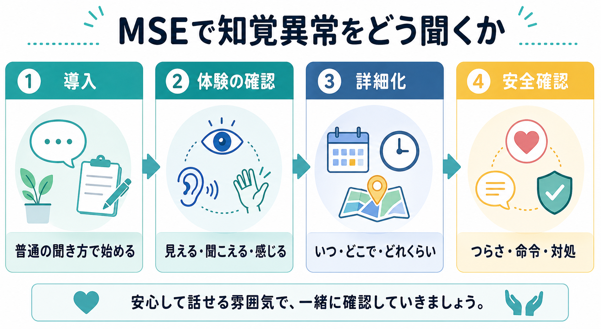
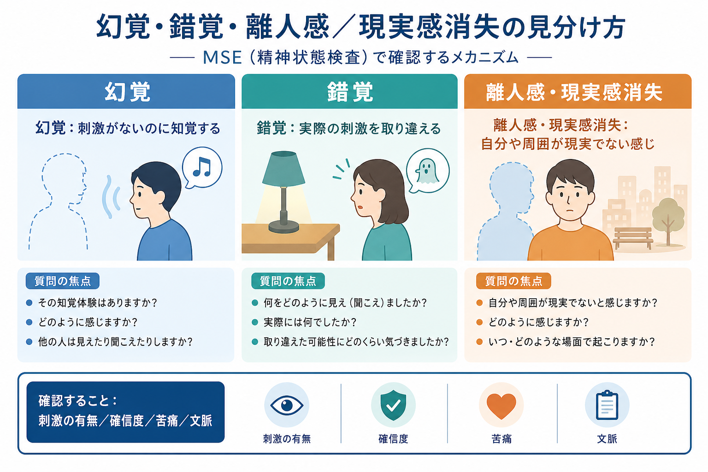
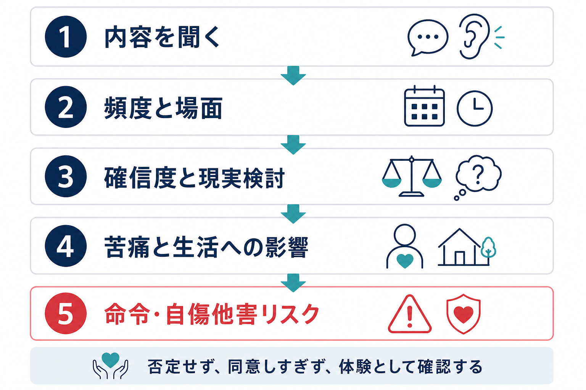

# MSEで知覚異常をどう聞くか

## 要点

- MSEの知覚評価は「幻覚があるか」を詰問する作業ではなく、患者が体験している「見える・聞こえる・感じる・自分や周囲が現実でない感じ」を、恥や恐怖を増やさずに記述してもらう作業である。
- 幻覚は外的刺激がないのに知覚される体験、錯覚は実際の刺激を取り違える体験として整理される。MSEでは、刺激の有無、感覚モダリティ、頻度、文脈、確信度、苦痛、生活への影響を分けて聞く[1][2]。
- 離人感・現実感消失は、自己や周囲から切り離されたように感じる体験であり、現実検討が保たれることが多い。精神病症状と即断せず、本人が「現実ではないと分かっているか」を丁寧に確認する[3]。
- 命令幻聴や自傷他害に関わる内容は、体験の有無だけでなく、命令内容、声の力への評価、従った経験、衝動性、物質使用、手段へのアクセス、保護因子まで具体化する[4][5][6]。
- 本稿は教育・研究目的の整理であり、個別の診断や治療指示ではない。急性の安全リスク、意識障害、神経症状、薬物・物質影響、身体疾患が疑われる場合は、緊急度に応じた臨床評価が必要である。

## この記事で答える問い

1. MSEで知覚異常を聞くとき、どの順番で質問すると話してもらいやすいか。
2. 幻覚、錯覚、離人感・現実感消失をどう区別して聞くか。
3. 命令幻聴や苦痛が強い体験を、安全確認につなげるには何を聞くべきか。
4. 診療録にはどの程度まで書けばよいか。

## まず結論

最初から「幻覚はありますか」と聞くより、まず「疲れている時や緊張している時に、普段と違う見え方・聞こえ方・感じ方をすることはありますか」と、体験を広く置く方が話しやすい。次に、本人が出した言葉を使って「どんなふうに聞こえるのか」「どの場面で起こるのか」「他の人にも確認できるものなのか」「どのくらい確かに感じるのか」を絞る。

安全確認は、体験を否定した後に行うのではなく、「それがつらい時に、何かしてしまいそうになることはありますか」「声が何かを命令することはありますか」と自然につなげる。命令幻聴は単独でリスクを決める所見ではないが、内容、従う可能性、過去の従属、声の力への評価、衝動性、物質使用、自傷他害の手段へのアクセスを聞くことで、対応の緊急度を判断しやすくなる[5][6]。

## 背景

[[精神科面接とは何か]]や[[精神科初診で何を確認するべきか]]では、主訴や現病歴だけでなく、現在の精神状態を構造化して把握する。MSEの知覚評価はその一部であり、思考内容、気分、意識、認知、薬物・身体疾患、文化的背景と切り離しては解釈できない[4]。

知覚異常は、患者にとって恥ずかしい、怖い、誤解されそう、入院させられそう、という不安を伴いやすい。したがって、聞き方の中心は「症状名を当てること」ではなく、「患者がどのような体験として持っているか」を共同で確認することにある。これは[[開かれた質問と閉じた質問はどう使い分けるのか]]の実践でもある。

## 基本概念

### 幻覚

幻覚は、外的刺激がないにもかかわらず知覚される体験として定義される。MSEでは、聴覚、視覚、体感、嗅覚、味覚などのモダリティを分けて聞く[1][2]。ただし、入眠時・覚醒時の体験、睡眠麻痺に伴う体験、強い疲労や感覚遮断に伴う一過性体験は、文脈を確認しなければ病的体験と断定できない[1]。

質問例:

- 「最近、周りに人がいないのに声や音が聞こえるように感じることはありますか」
- 「見えているものについて、他の人には見えていないようだと感じたことはありますか」
- 「皮膚に触れられている、虫が這う、体の中で何かが動くように感じることはありますか」

### 錯覚

錯覚は、実際にある刺激を別のものとして知覚する体験である。暗い部屋の影を人影と感じる、物音を自分の名前の呼びかけとして聞く、雑音を言葉のように聞く、といった形で語られる。重要なのは「刺激があったか」「後から見直すと取り違えだったと思えるか」「どのくらい確信していたか」である[1]。

質問例:

- 「実際には別の音や影だったけれど、その時は声や人影のように感じたことはありますか」
- 「明るい場所で確認すると違っていた、ということはありますか」
- 「その時点では、どのくらい本当にそうだと思いましたか」

### 離人感・現実感消失

離人感は、自分の身体、感情、思考、行動から切り離されたように感じる体験である。現実感消失は、周囲の人や物、世界が夢のよう、膜を隔てたよう、現実でないように感じる体験である[3]。これらは不安、抑うつ、トラウマ、睡眠不足、物質使用、てんかんなどとも関連しうるため、精神病症状と即断しない。

質問例:

- 「自分の体や感情が自分のものではないように感じることはありますか」
- 「周りの景色や人が、夢の中のように遠く感じることはありますか」
- 「その時、それが本当に現実ではないと思いますか。それとも、そう感じるけれど現実だとは分かっていますか」

## 仕組み

### 1. 広く聞く

導入では、患者が「変だと思われる」と感じにくい言葉を使う。

- 「ストレスや睡眠不足があると、普段と違う感じ方をする人がいます」
- 「確認のために、見え方や聞こえ方についても少し伺います」
- 「話しにくければ、答えられる範囲で大丈夫です」

ここで「幻覚」「妄想」「解離」といった専門語を先に出しすぎると、患者は該当しないと考えて否定したり、逆に診断名を言われたように感じたりする。

### 2. 患者の言葉で詳しくする

患者が「声がする」「誰かがいる感じ」「現実感がない」と述べたら、その言葉を使って続ける。

| 確認する軸 | 質問例 | 診療録に残したい情報 |
|---|---|---|
| モダリティ | 「声、音、映像、におい、触られる感じのどれに近いですか」 | 聴覚、視覚、体感、嗅覚、味覚 |
| 内容 | 「何と言っていますか」「何が見えますか」 | 具体的内容、反復性、命令性 |
| 文脈 | 「いつ、どこで、どんな時に起こりますか」 | 時間帯、睡眠、ストレス、物質、身体症状 |
| 確信度 | 「その時、どのくらい本当だと感じますか」 | 現実検討、洞察、反証可能性 |
| 苦痛 | 「どのくらいつらいですか」 | 不安、恐怖、回避、睡眠障害 |
| 生活影響 | 「仕事、家事、人間関係に影響していますか」 | 機能障害、対処、支援ニーズ |

### 3. 否定せず、同意しすぎずに扱う

面接者は「それは本当ではありません」と早く否定しすぎる必要も、「確かに誰かがいますね」と体験内容に同意する必要もない。実践的には、「そのように聞こえる体験があるのですね」「それが起こるとかなり怖いのですね」と、体験と苦痛を確認する。

この態度は、[[ラポールはどのように形成されるのか]]や[[共感的理解とは何か]]と直結する。患者の体験内容に同意するのではなく、患者がそれを体験している事実と、それに伴う感情を受け止める。

## 図解

上の2枚は、知覚異常を聞く入口と、幻覚・錯覚・離人感の区別を示す。次の図は、聴覚体験や命令内容が出てきた時の追加確認である。

## 臨床・研究との接続

### 命令幻聴は「ある・ない」だけで終わらせない

命令幻聴があると聞くと、ただちに危険と判断したくなる。しかし研究では、命令幻聴の存在だけで自傷他害を十分に予測できるわけではないという報告もある一方、命令内容や声への従属、声の力への評価、過去の従属、物質使用、衝動性などがリスク評価に関わるとされる[5][6]。

したがって、質問は次のように具体化する。

- 「その声は、何かをするように命令しますか」
- 「命令に従わないと何が起こると感じますか」
- 「これまで、その声の言う通りにしたことはありますか」
- 「今後、従ってしまいそうだと思いますか」
- 「自分や誰かを傷つける内容はありますか」
- 「そのための道具や場所に近づいていますか」

これは[[自殺リスク評価では何を聞くべきか]]や[[他害リスク評価では何を見るべきか]]に接続する。リスク評価は、単一項目のチェックではなく、現在の切迫度、手段、意図、保護因子、支援につながる可能性を統合する作業である[4][7]。

### 身体疾患・物質・睡眠を同時に確認する

幻覚様体験は、せん妄、てんかん、神経疾患、内分泌・代謝異常、感染、薬剤、アルコールや薬物、睡眠不足、感覚障害などでも起こりうる。特に高齢発症、急性発症、意識や注意の変動、発熱、頭部外傷、神経局在症状、薬剤変更、物質使用がある場合は、[[器質性精神障害を見逃さないためには何を見るべきか]]や[[物質使用歴はどのように聞くべきか]]の観点が重要になる[4]。

### 文化的・宗教的文脈を確認する

声を聞く、霊的存在を感じる、故人の存在を感じる、といった体験は、文化的・宗教的文脈によって意味づけが変わる。APAの精神科評価ガイドラインや文化的定式化面接は、患者の説明モデル、文化的背景、支援資源、臨床家との関係のずれを評価することを勧めている[4][8]。ここでは[[精神科における文化的定式化とは何か]]や[[文化的背景は診断にどう影響するのか]]が関連する。

実用的には、次のように聞く。

- 「その体験は、ご本人やご家族、地域の中ではどのように理解されていますか」
- 「宗教的・文化的には、どのような意味があると感じていますか」
- 「その理解は、安心につながっていますか。それとも生活上の困りごとにつながっていますか」

## よくある誤解

### 「幻覚はありますか」と聞けば十分である

十分ではない。患者は「幻覚」という言葉に抵抗を感じたり、自分の体験が幻覚に当たるか分からなかったりする。MSEでは、感覚体験として聞き、患者の言葉で具体化する方が情報を得やすい。

### 幻覚があれば統合失調症である

幻覚は統合失調症スペクトラムで重要な症状だが、それだけで診断は決まらない。気分障害、PTSD、解離症状、物質・薬剤、身体疾患、睡眠関連体験、文化的・宗教的体験などを鑑別する必要がある[1][2][3]。

### 離人感は現実検討が悪いという意味である

多くの場合、離人感・現実感消失では「そう感じるが、実際には現実だと分かっている」という現実検討が保たれる[3]。この点を確認せずに精神病症状として扱うと、患者の体験を誤って分類しやすい。

### 危険な内容を聞くと危険になる

自傷他害や命令内容を聞くことは、患者を誘導するためではなく、安全を確認するためである。APAの精神科評価では、自殺リスクや攻撃性リスクの評価に、現在の考え、意図、手段、物質使用、心理社会的ストレス、精神病的内容を含めて確認することが推奨されている[4]。

## 診療録にどう書くか

診療録では、症状名だけでなく、観察・聴取した根拠を書く。

記載例:

> 知覚: 夕方から夜にかけて、名前を呼ばれるような声を週3回程度自覚。周囲に人がいない状況で起こることが多い。声は本人を批判する内容で、命令性は否定。本人は「疲れると強くなる。実際に誰かがいるとは限らないと思う」と述べ、現実検討は一部保たれる。苦痛は中等度、睡眠への影響あり。自傷他害の指示、手段準備は否定。

このように書くと、[[診療録は精神科でどう書くべきか]]の観点からも、次回診察で変化を追いやすい。

## 関連ノート

既存ノート:

- [[精神科面接とは何か]]
- [[精神科初診で何を確認するべきか]]
- [[開かれた質問と閉じた質問はどう使い分けるのか]]
- [[ラポールはどのように形成されるのか]]
- [[共感的理解とは何か]]
- [[器質性精神障害を見逃さないためには何を見るべきか]]
- [[物質使用歴はどのように聞くべきか]]
- [[自殺リスク評価では何を聞くべきか]]
- [[他害リスク評価では何を見るべきか]]
- [[精神科における文化的定式化とは何か]]
- [[文化的背景は診断にどう影響するのか]]
- [[診療録は精神科でどう書くべきか]]

今後の作成候補:

- 幻覚と錯覚はどう区別するか
- 命令幻聴をどう評価するか
- 離人感・現実感消失をどう聞くか
- 睡眠関連幻覚をどう扱うか

MOC更新候補:

- `content/00_MOC/` 配下の精神医学・臨床面接・MSE関連MOCに、本記事へのリンクを追加する候補。並列ジョブとの競合を避けるため、本タスクではMOCファイルを編集しない。

## 理解チェック

1. 「声が聞こえる」と言われた時、最初に確認したい4つの軸は何か。
2. 幻覚と錯覚を分けるために、どのような質問が役立つか。
3. 離人感・現実感消失と精神病症状を区別する時、現実検討についてどう聞くか。
4. 命令幻聴がある時、「命令の内容」以外に何を確認するべきか。
5. 文化的・宗教的体験を病的体験と即断しないために、どのような聞き方ができるか。

## 参考文献

[1] Voss, R. M., & Das, J. M. (2023). Mental Status Examination. *StatPearls*. NCBI Bookshelf. https://www.ncbi.nlm.nih.gov/sites/books/n/statpearls/article-24998/

[2] Martin, D. C. (1990). The Mental Status Examination. In H. K. Walker, W. D. Hall, & J. W. Hurst (Eds.), *Clinical Methods: The History, Physical, and Laboratory Examinations* (3rd ed.). NCBI Bookshelf. https://www.ncbi.nlm.nih.gov/books/NBK320/

[3] Spiegel, D. (2026). Depersonalization/Derealization Disorder. *Merck Manual Professional Edition*. https://www.merckmanuals.com/en-pr/professional/psychiatric-disorders/dissociative-disorders/depersonalization-derealization-disorder

[4] Armstrong, C. (2016). APA Updates Guidelines on Psychiatric Evaluation in Adults. *American Family Physician*, 94(1), 62-64. https://www.aafp.org/pubs/afp/issues/2016/0701/p62.html

[5] Hellerstein, D., Frosch, W., & Koenigsberg, H. W. (1987). The clinical significance of command hallucinations. *American Journal of Psychiatry*, 144(2), 219-221. https://doi.org/10.1176/ajp.144.2.219

[6] Dugré, J. R., Guay, J.-P., & Dumais, A. (2018). Risk factors of compliance with self-harm command hallucinations in individuals with affective and non-affective psychosis. *Schizophrenia Research*, 195, 115-121. https://doi.org/10.1016/j.schres.2017.09.001

[7] Saab, M. M., Murphy, M., Meehan, E., et al. (2022). Suicide and Self-Harm Risk Assessment: A Systematic Review of Prospective Research. *Archives of Suicide Research*, 26(4), 1645-1665. https://doi.org/10.1080/13811118.2021.1938321

[8] American Psychiatric Association. (2013/2022). *Cultural Formulation Interview (CFI) Supplementary Modules*. https://www.psychiatry.org/File%20Library/Psychiatrists/Practice/DSM/DSM-5-TR/APA-DSM5TR-CulturalFormulationInterviewSupplementaryModules.pdf
