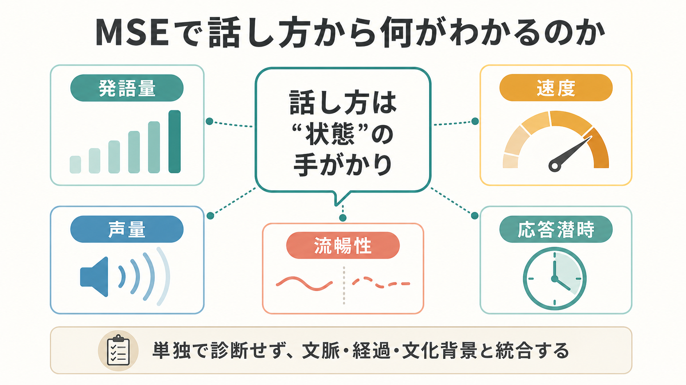
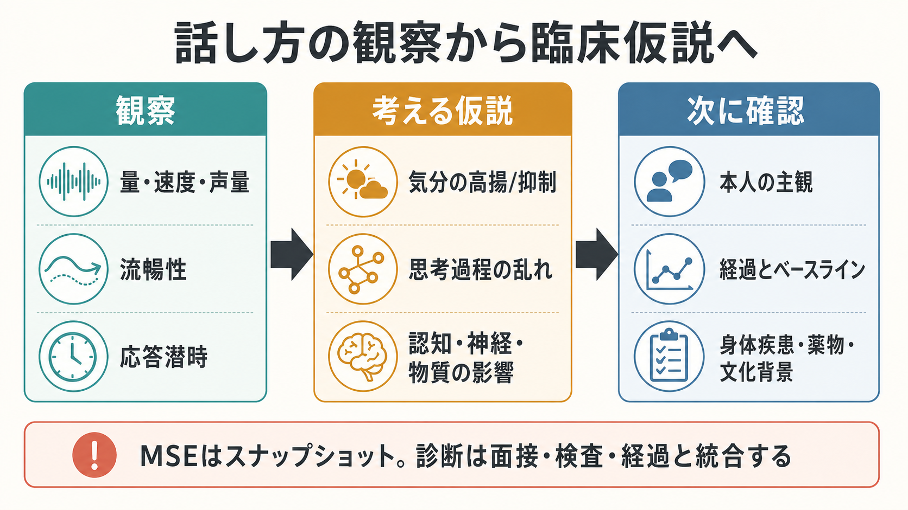

# MSEで話し方から何がわかるのか

## 要点

- MSE（Mental Status Examination; 精神状態診察）では、話し方を「発語量」「速度」「声量」「流暢性」「応答潜時」「韻律・調子」「まとまり」として観察する。
- 話し方は、気分の高揚や抑制、精神運動性の変化、思考過程のまとまり、認知機能、神経学的問題、物質・薬剤の影響を考える入口になる[1]。
- ただし、話し方だけで診断を確定しない。本人の普段の話し方、文化・言語背景、疲労、聴覚、発達特性、身体疾患、薬剤、物質使用を統合して読む。
- 「速いから躁」「遅いからうつ」と短絡せず、睡眠、活動性、気分、思考内容、身体所見、経過、生活機能と合わせて仮説を更新する。
- 本稿は教育・研究目的の整理であり、個別の診断や治療指示を行うものではない。

## この記事で答える問い

1. MSEでは、話し方のどの要素を見るのか。
2. 発語量・速度・声量・流暢性・応答潜時は、どのような臨床仮説につながるのか。
3. 話し方から気分や思考過程を評価するとき、どのような誤解を避けるべきか。
4. 研究では、音声や言語特徴はどのように扱われているのか。

## まず結論

MSEで話し方を見る目的は、「診断名を当てること」ではなく、面接時点のこころと身体の働き方を、観察可能な手がかりとして記述することにある。精神状態診察では、外見、行動、気分、感情、思考過程、思考内容、知覚、認知、洞察、判断などを系統的に観察するが、話し方はその中でも、面接全体を通じて自然に得られる情報である[1]。

たとえば、普段より明らかに多弁で、話題が急速に移り、睡眠欲求の低下や活動性亢進が伴う場合、躁状態や軽躁状態を考える手がかりになる。DSM-5の躁病エピソード基準でも、「普段より多弁、または話し続けなければならない圧迫感」と「観念奔逸または思考奔逸の主観的体験」は主要な評価項目に含まれる[2]。一方、発語が少なく、声が小さく、反応まで時間がかかり、動作も遅い場合には、うつ病に伴う精神運動制止、認知症、せん妄、薬剤性鎮静、神経疾患など複数の可能性を考える。

したがって話し方は、[[精神科面接とは何か]]や[[精神科初診で何を確認するべきか]]で得た病歴と、[[鑑別診断とは何か]]の枠組みを結びつける観察情報である。話し方を「印象」だけで終わらせず、具体的な観察語に落とし込むほど、診断仮説、リスク評価、治療方針の共有に使いやすくなる。

## 背景

MSEは、精神科面接で得られる現在の精神状態を構造化して記述する方法である。身体診察が現在の身体所見を記録するように、MSEは現在の意識、態度、行動、発語、気分、感情、思考、知覚、認知、洞察、判断を記録する。話し方は、患者が自分の体験を語るための媒体であると同時に、それ自体が観察対象でもある。

話し方の評価が重要なのは、内的体験がそのまま外から見えるわけではないからである。気分の高揚、抑うつ、焦燥、緊張、思考の混乱、語想起困難、注意障害、鎮静、失語、構音障害は、しばしば発語量、速度、声量、間、語の選び方、話題のつながりに表れる[1]。

ただし、話し方は個人差が大きい。普段から寡黙な人、地域や職業文化として間を長く取る人、第二言語で話している人、聴覚障害がある人、緊張しやすい人、発達特性として話題転換が速い人もいる。MSEで必要なのは、「平均的な話し方」からのズレではなく、「その人の普段、文脈、現在の困りごとから見た変化」である。この点は[[文化的背景は診断にどう影響するのか]]とも接続する。

## 基本概念

### 発語量

発語量は、どれくらい話すかである。少ない場合は、抑うつ、不安、緊張、陰性症状、疲労、認知症、失語、薬剤性鎮静、思考途絶、関係形成の難しさなどを考える。多い場合は、躁状態、焦燥、不安、物質使用、パーソナリティ傾向、状況への過適応などを考える。

ここで大切なのは、単に「多い」「少ない」とせず、「質問に短く答えるのみ」「自発話が乏しい」「制止しないと話し続ける」「話題が増えすぎて要点に戻りにくい」のように記述することである。記述が具体的であるほど、[[精神科で重症度をどう判断するか]]や生活機能評価につなげやすい。

### 速度

話す速度は、精神運動性や思考のテンポを考える手がかりになる。速い発語は、躁状態の多弁・観念奔逸、焦燥、不安、刺激薬使用などで見られることがある[2][3]。遅い発語は、うつ病の精神運動制止、認知機能低下、せん妄、鎮静、神経疾患などと関連しうる[1][4]。

躁状態では、話す速度だけでなく、睡眠欲求の低下、活動性の増加、気分の高揚または易怒性、注意散漫、誇大的な内容、衝動性を合わせて見る[3]。うつ病では、速度低下だけでなく、表情、姿勢、動作、思考の遅さ、疲労感、興味低下、食欲・睡眠変化を合わせて見る。話す速度は、単独所見ではなく、全体の運動性・気分・認知の一部である。

### 声量と調子

声量が小さい場合は、抑うつ、引きこもり、緊張、疲労、身体的衰弱、パーキンソン症状、薬剤の影響などを考える。声量が大きい場合は、興奮、焦燥、躁状態、聴覚の問題、状況理解の低下などを考える[1]。

声の調子や抑揚も重要である。単調で抑揚が乏しい場合、抑うつ、陰性症状、神経疾患、薬剤性パーキンソニズムなどを考える。感情表出と話している内容が合わない場合は、感情の不一致、解離、精神病症状、神経学的問題、文化的表現差などを丁寧に検討する。

### 流暢性

流暢性は、言葉が滑らかに出るか、詰まりや言い直しが多いか、語想起困難があるか、構音が明瞭かを含む。非流暢な発語は、不安や緊張だけでなく、失語、構音障害、認知機能低下、せん妄、薬剤・物質の影響を示す場合がある[1]。

精神科面接では、言語の問題を「心理的抵抗」とだけ読まないことが重要である。言葉が出にくいとき、本人が話したくないのか、話せないのか、言葉を探しているのか、注意が続かないのか、聴覚や理解の問題があるのかを分けて考える。これは[[器質性精神障害を見逃さないためには何を見るべきか]]とも密接に関係する。

### 応答潜時

応答潜時は、質問してから返答が始まるまでの時間である。長い応答潜時は、抑うつ、精神運動制止、思考途絶、幻聴への反応、認知機能低下、せん妄、鎮静、緊張、文化的な間の取り方などで起こりうる[1]。短すぎる、または相手の質問が終わる前に話し出す場合は、焦燥、躁状態、不安、衝動性、注意制御の難しさを考える。

応答潜時を見るときは、沈黙を急いで埋めない。沈黙が、考えるための時間なのか、強い不安なのか、思考途絶なのか、聞こえていないのか、理解できていないのかを観察する。ここでは[[沈黙は精神科面接でどう扱うべきか]]や[[傾聴とは何か]]の技法が役立つ。

## 仕組み

話し方は、単一の機能ではなく、複数の処理が重なって生じる。

1. 気分と覚醒水準：高揚、焦燥、不安、抑うつ、疲労が発語量や速度に影響する。
2. 精神運動性：動作の速さや遅さと同じく、発語の開始、速度、間、声量にも反映される。
3. 思考過程：観念奔逸、迂遠、脱線、連合弛緩、保続、思考途絶は、話題のつながりとして表れる。
4. 言語・認知機能：語想起、理解、注意、作業記憶、実行機能が、流暢性やまとまりに影響する。
5. 神経・身体・物質の影響：せん妄、認知症、脳血管障害、パーキンソニズム、薬剤、アルコールや他の物質が発語に影響する。
6. 対人文脈：面接者への緊張、信頼、警戒、文化的規範、言語背景が、話す量や間を変える。

精神運動制止の研究では、うつ病における遅い発語、動作低下、認知処理の遅さが古くから注目されてきた。レビューでは、精神運動制止が抑うつの機能障害や治療反応の理解に関係し、発語の遅さや声の変化も観察対象になることが整理されている[4]。一方、統合失調症スペクトラムでは、発語の乏しさ、抑揚の乏しさ、まとまりの低下、形式的思考障害が、陰性症状や陽性症状の評価と関連してきた[5][6]。

## 図解

### 観察項目を5つに分ける

話し方の観察は、まず「発語量」「速度」「声量」「流暢性」「応答潜時」に分けると整理しやすい。これに、話題のまとまり、韻律、構音、語想起、質問への適切さを加える。記録では、評価語だけでなく具体的なふるまいを書く。

| 観察項目 | 見ること | ありうる仮説 | 記録例 |
|---|---|---|---|
| 発語量 | 自発話の多さ、質問への返答量 | 躁状態、不安、抑うつ、陰性症状、認知機能低下 | 「質問に一語で答えるのみ」「制止困難な多弁」 |
| 速度 | 速い、遅い、変動する | 躁状態、焦燥、精神運動制止、鎮静、神経疾患 | 「発語速度は速く、話題転換が頻回」 |
| 声量 | 小さい、大きい、単調 | 抑うつ、興奮、聴覚問題、薬剤性変化 | 「声量は小さく、抑揚に乏しい」 |
| 流暢性 | 詰まり、語想起困難、構音 | 不安、失語、認知症、せん妄、物質影響 | 「語想起に時間を要し、言い直しが多い」 |
| 応答潜時 | 返答までの間 | 抑うつ、思考途絶、幻聴、認知低下、文化的間 | 「質問後、10秒ほど沈黙してから返答」 |

### 観察から仮説へ進む

話し方を見たら、すぐに診断名へ飛ばない。まず「気分」「思考過程」「認知・神経・物質」「文脈」に分けて仮説を置く。次に、本人の主観、経過、ベースライン、身体所見、薬剤・物質、睡眠、生活機能を確認する。この流れを踏むと、[[薬剤性精神症状とは何か]]や[[精神科診断における除外診断とは何か]]の視点を落としにくい。

## 臨床・研究との接続

### 臨床では「現在の状態」と「普段との差」を分ける

臨床では、話し方を「その人らしさ」と「状態変化」に分ける。普段から早口な人が早口であることと、睡眠が減り、活動性が上がり、話し続け、話題が飛び、リスク行動が増えていることは意味が違う。同じように、普段から寡黙な人が短く答えることと、急に発語が乏しくなり、意識が変動し、見当識が揺らいでいることも意味が違う。

そのため、可能であれば家族や支援者から「いつもと違うか」を確認する。[[家族歴から何がわかるのか]]や[[家族面接では何を評価するべきか]]の情報は、発語の変化を読む助けになる。睡眠との関連は特に重要で、躁状態、うつ病、せん妄、物質使用、身体疾患では睡眠の変化と話し方の変化が同時に現れることがある。これは[[精神科診察で睡眠をどう評価するか]]と接続する。

### 研究では音声特徴の定量化が進んでいる

近年は、発語速度、ピッチ、声質、ポーズ、抑揚などを音響特徴として抽出し、症状評価や疾患群分類に使う研究が進んでいる。統合失調症スペクトラムを対象にした研究では、面接音声から抽出した音響特徴により、患者群と対照群、また陽性症状優位と陰性症状優位の区別を機械学習で試みている[6]。

ただし、こうした研究は臨床判断の代替ではない。録音環境、言語、文化、課題、サンプル、併存症、薬剤、年齢、教育歴によって音声特徴は変わる。臨床で重要なのは、定量化の可能性を理解しつつ、本人の語り、面接文脈、身体・神経学的評価、生活機能を統合して判断することである。

### 記録では「ラベル」より「観察」を優先する

MSEの記録では、「躁的」「変」「まとまりがない」といった印象だけでは不十分である。たとえば次のように書くと、次の診察者にも伝わりやすい。

- 「発語量は多く、質問への回答中に複数の話題へ移る。話題間の連想は一部追えるが、要点に戻すために頻回の介入を要する。」
- 「発語量は少なく、声量は小さい。質問後の応答潜時が長く、返答は短文。意識清明で見当識は保たれる。」
- 「語想起困難があり、言い直しが多い。構音は明瞭。第二言語での面接であり、通訳利用を検討する。」

このように記録すると、[[精神科で生活機能をどう評価するか]]や治療経過の比較に使いやすくなる。

## よくある誤解

### 誤解1: 早口なら躁状態である

早口は躁状態で見られることがあるが、早口だけで躁状態とは言えない。不安、緊張、文化的な話し方、発達特性、刺激薬、カフェイン、痛み、時間制約でも早口になる。躁状態を考えるには、気分、活動性、睡眠欲求、思考奔逸、注意散漫、衝動性、機能障害を合わせて評価する[2][3]。

### 誤解2: 返答が遅いのは抵抗である

応答潜時の延長は、抵抗だけでなく、抑うつ、精神運動制止、思考途絶、幻聴、認知機能低下、せん妄、聴覚の問題、言語理解の難しさ、鎮静などで起こる。特に高齢者、急性発症、日内変動、身体症状、薬剤変更がある場合は、[[器質性精神障害を見逃さないためには何を見るべきか]]の観点が必要になる。

### 誤解3: 話がまとまらないのは性格の問題である

話題のまとまりの低下は、焦燥、不安、注意障害、躁状態、精神病症状、せん妄、認知症、物質使用、文化・言語背景の不一致などで起こりうる。形式的思考障害の研究では、話し言葉の構造や意味のつながりが、統合失調症の思考過程評価と関連してきた[5]。人格評価に飛ぶ前に、状態変化と医学的要因を確認する。

### 誤解4: 音声AIで客観的に診断できる

音声解析は有望な研究領域だが、現時点では「音声だけで診断する」ものではない。研究で示される分類精度は、特定のサンプル、課題、解析条件に依存する。臨床では、音声特徴を一つの補助情報として扱い、本人の困りごと、経過、身体・神経学的評価、生活機能、リスクを統合する必要がある[6]。

## 関連ノート

既存ノート:

- [[精神科面接とは何か]]
- [[精神科初診で何を確認するべきか]]
- [[精神科診断における除外診断とは何か]]
- [[鑑別診断とは何か]]
- [[DSMとICDは何が違うのか]]
- [[精神科で重症度をどう判断するか]]
- [[精神科で生活機能をどう評価するか]]
- [[器質性精神障害を見逃さないためには何を見るべきか]]
- [[薬剤性精神症状とは何か]]
- [[精神科診察で睡眠をどう評価するか]]
- [[傾聴とは何か]]
- [[沈黙は精神科面接でどう扱うべきか]]
- [[文化的背景は診断にどう影響するのか]]

今後の作成候補:

- 「MSEで思考過程をどう記述するか」
- 「精神運動制止とは何か」
- 「観念奔逸と迂遠はどう違うのか」
- 「アロギアとは何か」
- 「精神科面接で通訳をどう使うか」

MOC更新候補:

- `content/00_MOC/` 配下の精神医学・診断・面接関連MOCに、本記事へのリンクを追加する。

## 理解チェック

1. 話し方を評価するとき、発語量以外に少なくとも4つ挙げると何か。
2. 「早口」から躁状態を考える前に、追加で確認すべき症状や文脈は何か。
3. 応答潜時が長いとき、抵抗以外にどのような仮説を考えるか。
4. MSEの記録で「まとまりがない」とだけ書くより、どのように具体化できるか。
5. 音声解析研究の知見を臨床で使うとき、どのような限界に注意するか。

## 参考文献

[1] Voss RM, Das JM. Mental Status Examination. *StatPearls*. Updated 2023. NCBI Bookshelf. https://www.ncbi.nlm.nih.gov/books/NBK546682/

[2] Substance Abuse and Mental Health Services Administration. DSM-IV to DSM-5 Manic Episode Criteria Comparison. In: *DSM-5 Changes: Implications for Child Serious Emotional Disturbance*. NCBI Bookshelf. https://www.ncbi.nlm.nih.gov/books/NBK519712/table/ch3.t7/

[3] Dailey MW, Saadabadi A. Mania. *StatPearls*. Updated 2023. NCBI Bookshelf. https://www.ncbi.nlm.nih.gov/books/NBK493168/

[4] Buyukdura JS, McClintock SM, Croarkin PE. Psychomotor retardation in depression: biological underpinnings, measurement, and treatment. *Prog Neuropsychopharmacol Biol Psychiatry*. 2011;35(2):395-409. https://doi.org/10.1016/j.pnpbp.2010.10.019

[5] Radanovic M, de Sousa RT, Valiengo L, Gattaz WF, Forlenza OV. Formal thought disorder and language impairment in schizophrenia. *Arq Neuropsiquiatr*. 2013;71(1):55-60. https://doi.org/10.1590/S0004-282X2012005000015

[6] de Boer JN, Voppel AE, Brederoo SG, et al. Acoustic speech markers for schizophrenia-spectrum disorders: a diagnostic and symptom-recognition tool. *Psychological Medicine*. 2023;53(4):1302-1312. https://doi.org/10.1017/S0033291721002804

[7] American Psychiatric Association. *Diagnostic and Statistical Manual of Mental Disorders, Fifth Edition, Text Revision (DSM-5-TR)*. American Psychiatric Association Publishing; 2022. https://doi.org/10.1176/appi.books.9780890425787

## 未解決問題

- 日本語話者のMSEにおける発語特徴を、文化差・方言・敬語・面接関係を含めてどう標準化して記述するか。
- 音声解析を臨床補助に使う場合、録音同意、プライバシー、バイアス、説明可能性をどう扱うか。
- 発語特徴を、本人の主観的苦痛や生活機能、治療反応とどの程度結びつけられるか。
