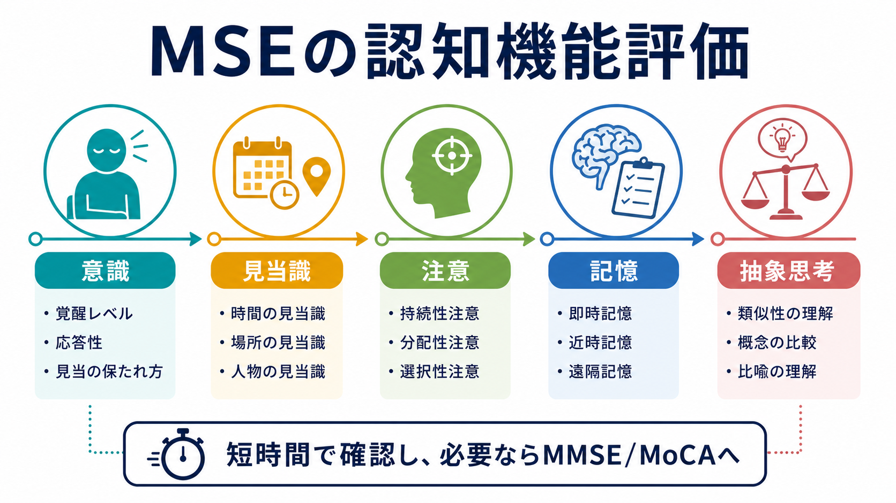
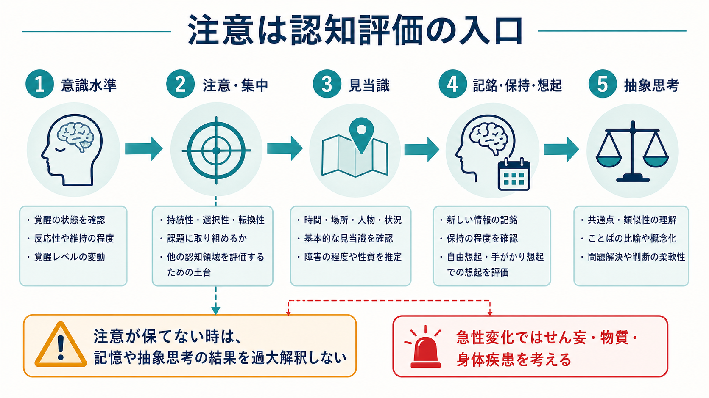
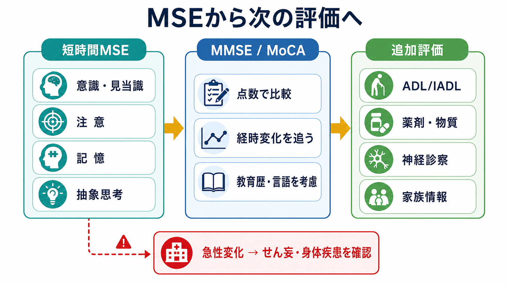

# MSEで認知機能をどう評価するか

## 要点

- MSE（Mental Status Examination; 精神状態診察）での認知機能評価は、短時間で「意識水準、見当識、注意、記憶、抽象思考」を確認し、面接全体の所見を解釈する土台を作る作業である[1][2]。
- もっとも先に見るのは注意である。注意が保てない状態では、記憶課題や抽象思考課題の低下を「記憶障害」や「知能低下」と単純に読めない[3][4]。
- 急性発症、日内変動、注意・覚醒の低下がある場合は、せん妄、物質・薬剤、身体疾患、神経疾患を優先して考える[5]。
- MSEはスクリーニングであり、診断名を単独で決める検査ではない。必要に応じて[[ミニ精神状態検査MMSEとは何か|MMSE]]、MoCA、神経心理検査、家族情報、ADL/IADL、身体診察・検査と統合する[3][6][7]。
- 文化、教育歴、言語、聴力・視力、不安、疲労、睡眠不足、抑うつ、発達特性は成績に影響するため、「できた／できない」だけでなく条件と観察所見を書く。

## この記事で答える問い

1. MSEで認知機能を見るとき、どの領域を短時間で確認するのか。
2. 意識、見当識、注意、記憶、抽象思考をどの順番で評価すると解釈しやすいのか。
3. どの所見が、せん妄・認知症・物質使用・薬剤性精神症状・身体疾患の追加評価につながるのか。
4. MMSEやMoCAと、MSE内の短時間評価をどう使い分けるのか。

## まず結論

MSEの認知機能評価は、「この人は今、面接に参加できるだけの覚醒と注意を保てているか」から始める。そこが不安定なら、見当識、記憶、抽象思考の結果は二次的に崩れる。したがって、記録では「3単語を言えなかった」だけでなく、「眠気が強く、質問の途中で注意が逸れ、繰り返し促しを要した」のように、結果を生んだ条件を書く。

短時間評価の実用的な順番は、次のように考えるとよい。

| 領域 | 確認すること | 例 | 解釈の注意 |
|---|---|---|---|
| 意識水準 | 覚醒、反応性、刺激への応答 | 声かけで開眼するか、会話を維持できるか | 低下があれば身体疾患・薬剤・物質・せん妄を優先 |
| 見当識 | 人・場所・時間・状況 | 今日の日付、今いる場所、受診理由 | 時間の見当識は崩れやすく、人物の見当識低下は重いことが多い |
| 注意 | 持続、選択、転換 | 数字の順唱・逆唱、曜日逆唱、100-7 | 注意低下があると他の認知課題の信頼性が下がる |
| 記憶 | 記銘、保持、想起、手がかり効果 | 3単語即時再生、数分後再生、最近の出来事 | 注意低下、聴覚障害、抑うつ、不安の影響を受ける |
| 抽象思考 | 共通性、比喩、概念化 | 「りんごとみかんの共通点」 | 教育歴、文化、言語に強く依存する |

## 背景

[[精神状態診察MSEとは何か|MSE]]は、面接時点の精神機能と行動を観察・質問によって記述する枠組みである。APAの精神科評価ガイドラインでも、初期評価には気分、不安、思考内容・過程、知覚、認知などの確認が含まれる[1]。MSEの認知領域には、覚醒度、注意・集中、見当識、即時・短期・長期記憶、抽象思考、言語、実行機能、判断などが含まれる[1][3]。

認知機能の評価が重要なのは、精神症状のように見える訴えの背景に、せん妄、認知症、薬剤性、物質使用、代謝異常、感染、神経疾患が隠れることがあるためである。Merck Manualは、急性または慢性の認知変化が疑われる場合に精神状態評価を行い、注意が保てない患者にそれ以上の認知検査を進めても有用性が限られると説明している[3]。この点は、[[器質性精神障害を見逃さないためには何を見るべきか]]や[[鑑別診断とは何か]]と直結する。

一方で、MSEは詳細な神経心理検査ではない。数分で全領域を精密に測ることはできないため、目的は「異常の有無を荒く見る」「追加評価が必要な方向を決める」「経時変化を記録できる形にする」ことである。

## 基本概念

### 意識水準

意識水準は、覚醒して環境に反応できるかを示す。MSEでは「清明、傾眠、昏迷、昏睡」のようなラベルだけでなく、どの刺激で覚醒するか、応答がどれくらい続くか、会話を維持できるかを観察する[2][3]。たとえば「声かけで開眼するが、数十秒で閉眼し、質問の反復を要する」と書けば、後から比較しやすい。

意識水準が低い場合、まず身体疾患、薬剤、物質、せん妄を考える。これは[[薬剤性精神症状とは何か]]や[[物質使用歴はどのように聞くべきか]]に接続する所見である。

### 見当識

見当識は、時間、場所、人、状況をどの程度把握しているかである。典型的には「今日は何月何日ですか」「ここはどこですか」「私は誰ですか」「なぜ来院しましたか」と確認する[2][3]。

時間の見当識は、睡眠不足、入院環境、高齢、注意低下でも崩れやすい。場所や人物の見当識が崩れる場合は、より重い意識・記憶・認知の障害を疑う。急に見当識が崩れた場合は、一次的な精神疾患だけでなく、せん妄や身体疾患の評価を優先する[5]。

### 注意

注意は、面接全体の信頼性を支える入口である。注意は会話中の集中、話題の追跡、質問への応答、課題への取り組み方から観察できる。直接検査としては、数字の順唱・逆唱、曜日や月の逆唱、100から7を引く、特定の音や文字に反応する課題などが使われる[2][3]。

注意が不安定なとき、記憶課題の失敗は「覚えられない」のではなく「そもそも入っていない」可能性がある。抽象思考課題の失敗も、概念化の障害ではなく、課題理解や集中維持の失敗かもしれない。したがって、注意は他の認知領域より先に解釈する。

### 記憶

MSEでの記憶評価は、少なくとも「即時記銘」「数分後の遅延再生」「最近の出来事」「遠隔記憶」を分けて考える。StatPearlsは、即時再生、遅延再生、最近記憶、長期記憶を区別し、遅延再生では手がかりで想起できるかも情報になると述べている[2]。

短時間では、3語を提示してすぐ反復してもらい、別課題を挟んで数分後に再生してもらう方法が使いやすい。ここで重要なのは、提示時に聞こえていたか、理解していたか、注意が保てていたかである。聴力、母語、教育歴、不安、抑うつ、疲労、鎮静薬の影響を記録に残す。

### 抽象思考

抽象思考は、共通性、比喩、カテゴリー化、概念の柔軟性を見る領域である。たとえば「りんごとみかんの共通点は何ですか」「石の上にも三年とはどういう意味ですか」と尋ねる。ただし、ことわざの解釈は文化・教育歴・言語に依存しやすい。正誤判定よりも、具体的な答えに固着するのか、比喩や共通概念へ移れるのかを観察する。

抽象思考の低下は、前頭葉機能、実行機能、統合失調症圏の思考障害、認知症、せん妄、重いうつ状態などで見られうるが、MSE単独で病因は決められない。[[MSEで話し方から何がわかるのか]]や思考過程の評価と合わせて読む。

## 仕組み

認知機能評価は階層的に読むと誤解が減る。まず覚醒が十分でなければ注意は成立しにくい。注意が保てなければ、情報の記銘、保持、想起、抽象化は安定しない。Clinical Methodsは、注意と記憶を高次機能の土台に位置づけ、言語、構成、抽象思考がその上に重なると説明している[4]。

この階層性は、せん妄の評価で特に重要である。せん妄は、注意と意識・覚醒の障害が短期間に出現し、変動し、記憶、見当識、言語、視空間、知覚などの認知変化を伴う症候群として整理される[5]。したがって、急に「物忘れが強い」「質問が通らない」「話がかみ合わない」と見える場合、まず注意と覚醒の変動を確認する。

## 図解

MSE内の短時間評価は、異常を見つけた時点で終わりではなく、次に何を確認するかを決めるための分岐点である。

画像の要点を文章でまとめると、次のようになる。

1. まず短時間MSEで、意識、見当識、注意、記憶、抽象思考を確認する。
2. 慢性的な認知低下が疑われる、ベースラインとの差を数値化したい、経時変化を追いたい場合は、MMSEやMoCAなどの標準化スクリーニングを検討する[6][7]。
3. 急性変化、注意低下、覚醒変動がある場合は、せん妄、薬剤・物質、身体疾患、神経疾患を優先して評価する[5]。
4. 認知検査の点数だけでなく、ADL/IADL、家族情報、教育歴、言語、視聴覚、服薬、物質使用、身体診察と統合する。

## 臨床・研究との接続

MSEの認知評価は、[[精神科初診で何を確認するべきか]]の中で、リスク評価、鑑別診断、治療計画の土台になる。たとえば、急性の注意低下と見当識障害があれば、精神科的診断名を急いで付けるより先に、身体疾患や薬剤・物質の確認が必要になる。慢性的な記憶低下と生活機能低下があれば、認知症や軽度認知障害の評価へ進む。

研究や尺度評価では、MMSEやMoCAのような標準化尺度が使われる。MMSEは認知状態を簡便に評定する目的で開発され、見当識、記銘、注意・計算、再生、言語などを含む[6]。MoCAは、注意、実行機能、記憶、言語、視空間、抽象、計算、見当識など、より広い認知領域を短時間で見るスクリーニングとして報告された[7]。ただし、点数は教育歴、言語、文化、感覚障害、疲労、急性疾患に影響されるため、MSEの観察所見と切り離して読まない。

[[同意能力の評価はどのように行うのか]]や[[意思決定能力とは何か]]を考える場合も、認知機能は重要だが十分条件ではない。意思決定能力では、情報理解、認識、推論、選択の表明が問われるため、記憶や抽象思考の低下があっても、支援や説明方法の調整によって能力が保たれる場合がある。

## よくある誤解

### 「日付を間違えたので認知症」とは言えない

日付の誤りは、睡眠不足、入院、時差、環境変化、不安、注意低下でも起こる。認知症を疑うには、記憶、実行機能、言語、視空間、生活機能、経時変化、家族情報を統合する必要がある。

### 「3単語を覚えられない＝記憶障害」とは限らない

記銘時に注意が向いていなければ、情報は十分に入らない。聞こえにくさ、言語理解の問題、過度の不安、鎮静、せん妄、抑うつも確認する。

### 「抽象思考課題は知能を測る課題」ではない

ことわざや共通性課題は、教育歴と文化差の影響を強く受ける。臨床的には、答えの正誤だけでなく、具体例に固着するか、柔軟に言い換えられるか、課題の意味を理解しているかを見る。

### 「MMSEやMoCAをすればMSEは不要」ではない

標準化尺度は有用だが、覚醒、協力度、注意の変動、面接中の自然な振る舞い、身体状態、薬剤・物質の影響までは十分に説明しない。MSEは、尺度の点数を読む文脈を与える。

## 関連ノート

- [[精神状態診察MSEとは何か]]
- [[ミニ精神状態検査MMSEとは何か]]
- [[MSEで話し方から何がわかるのか]]
- [[器質性精神障害を見逃さないためには何を見るべきか]]
- [[薬剤性精神症状とは何か]]
- [[物質使用歴はどのように聞くべきか]]
- [[鑑別診断とは何か]]
- [[精神科初診で何を確認するべきか]]
- [[同意能力の評価はどのように行うのか]]
- [[意思決定能力とは何か]]

## 理解チェック

1. 注意が保てない患者で、3単語遅延再生ができなかった場合、どのような代替解釈を考えるべきか。
2. 見当識障害が急に出現したとき、一次的な精神疾患以外に何を確認する必要があるか。
3. MMSEやMoCAを使う前に、MSEで確認しておくべき条件は何か。
4. 抽象思考課題の結果を解釈するとき、文化・教育歴・言語はなぜ重要か。

## 未解決問題

- MSEの短時間認知評価を、忙しい外来・救急・病棟でどこまで標準化できるか。
- 日本語環境で、教育歴、方言、多文化背景、発達特性を考慮した簡便な課題選択をどう設計するか。
- MSE所見、MMSE/MoCA、ADL/IADL、家族情報、ウェアラブルやデジタル課題をどう統合すれば、過剰診断と見逃しの両方を減らせるか。

## 参考文献

[1] American Psychiatric Association. *The American Psychiatric Association Practice Guidelines for the Psychiatric Evaluation of Adults*. 3rd ed. 2016. https://www.psychiatry.org/File%20Library/Psychiatrists/Practice/Clinical%20Practice%20Guidelines/psychevaladults.pdf

[2] Voss RM, Das JM. Mental Status Examination. *StatPearls*. Last update 2024-04-30. https://www.ncbi.nlm.nih.gov/sites/books/n/statpearls/article-24998/

[3] Newman G, Levin MC. How To Assess Mental Status. *Merck Manual Professional Edition*. Reviewed/Revised 2025-08. https://www.merckmanuals.com/professional/neurologic-disorders/neurologic-examination/how-to-assess-mental-status

[4] Martin DC. Chapter 207: The Mental Status Examination. In: Walker HK, Hall WD, Hurst JW, eds. *Clinical Methods: The History, Physical, and Laboratory Examinations*. 3rd ed. Butterworths; 1990. https://www.ncbi.nlm.nih.gov/books/NBK320/

[5] Merck Manual Professional Edition. Delirium. DSM-5-TR criteria summary. https://www.merckmanuals.com/professional/neurologic-disorders/delirium-and-dementia/delirium

[6] Folstein MF, Folstein SE, McHugh PR. “Mini-mental state”: A practical method for grading the cognitive state of patients for the clinician. *Journal of Psychiatric Research*. 1975;12(3):189-198. https://doi.org/10.1016/0022-3956(75)90026-6

[7] Nasreddine ZS, Phillips NA, Bedirian V, et al. The Montreal Cognitive Assessment, MoCA: A brief screening tool for mild cognitive impairment. *Journal of the American Geriatrics Society*. 2005;53(4):695-699. https://doi.org/10.1111/j.1532-5415.2005.53221.x
