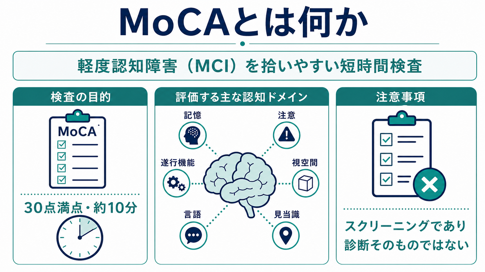
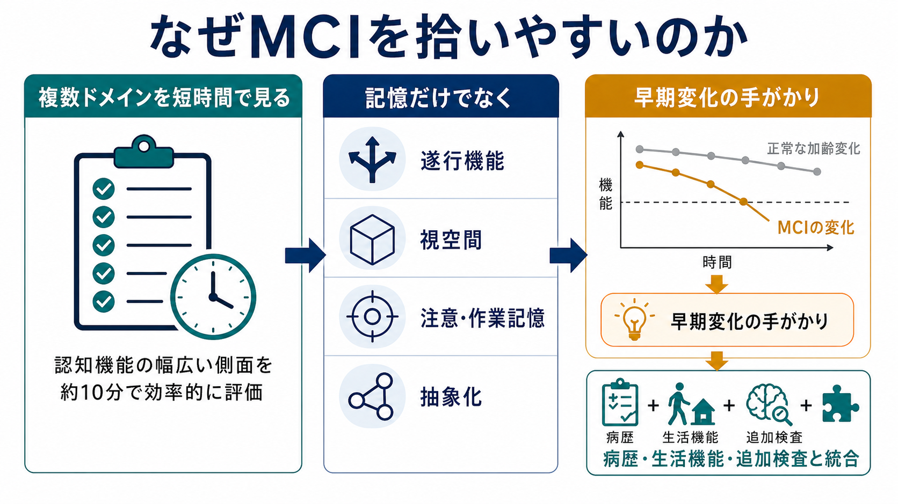
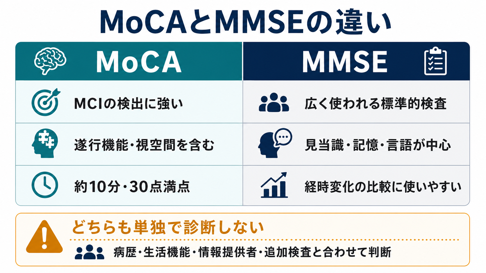

# MoCAとは何か

## 要点

- MoCA（Montreal Cognitive Assessment）は、軽度認知障害（MCI）を拾い上げる目的で開発された、30点満点・約10分の認知機能スクリーニング検査である[1][2]。
- [[ミニ精神状態検査MMSEとは何か|MMSE]]より、遂行機能、視空間機能、注意・作業記憶、抽象化などを広く含むため、早期・軽度の認知変化に敏感になりやすい[1][5]。
- ただし、MoCAの点数は診断そのものではない。[[現病歴はどのように構造化するべきか|病歴]]、生活機能、情報提供者からの情報、身体疾患・薬剤、必要に応じた神経心理検査や画像検査と統合して読む[6][7]。

## この記事で答える問い

- MoCAは何を測る検査なのか。
- なぜ軽度認知障害の検出に使われるのか。
- MMSEとは何が違うのか。
- 臨床・研究で点数をどう扱うべきか。

## まず結論

MoCAは「認知症かどうかを一発で決める検査」ではなく、[[認知機能検査は何を測っているのか|認知機能検査]]の一つとして、認知の複数ドメインを短時間で広く見るための道具である。特に、本人や家族が「もの忘れはあるが日常生活は大きく崩れていない」と感じる段階では、MMSEが正常域でもMoCAで低下が示されることがある[1][5]。

一方で、カットオフを機械的に当てはめると偽陽性も増える。教育年数、母語、文化、視聴覚障害、運動障害、うつ、不安、せん妄、睡眠不足、薬剤の影響を見落とすと、点数の意味を誤る[3][6]。

## 背景

認知機能低下の評価では、早く気づくことと、過剰に診断しないことの両方が必要になる。MoCAは、MCIのような軽度の段階を拾うために作られた検査で、原著研究ではMCI群・軽度アルツハイマー病群・健常高齢者群に対してMoCAとMMSEを比較し、MoCAがMCI検出に高い感度を示した[1]。

日本語版MoCA（MoCA-J）についても、高齢日本人を対象にした妥当性研究があり、日本語環境での使用可能性が検討されている[4]。ただし、翻訳版や地域集団では最適カットオフが変わりうるため、「26点未満なら異常」と単純に固定するより、対象集団・目的・事前確率を考える必要がある[2][6]。

## 基本概念

MoCA Fullは30点満点で、概ね10分で実施される。公式情報では、短期記憶、視空間能力、遂行機能、注意・集中・作業記憶、言語、時間・場所の見当識などを評価すると説明されている[2]。

臨床的には、次のように読むと理解しやすい。

| 見る領域 | 何の手がかりになるか | 関連ノート |
|---|---|---|
| 遅延再生・記憶 | 新しい情報の保持、検索の困難 | [[長期記憶とは何か]] |
| 注意・作業記憶 | 集中の維持、情報の一時保持 | [[注意とは何か]]、[[ワーキングメモリとは何か]] |
| 遂行機能 | 切り替え、計画、抑制、系列化 | [[実行機能とは何か]] |
| 視空間 | 図形処理、空間構成、構成行為 | [[空間認知とは何か]] |
| 言語・抽象化 | 言語表出、概念化、類似性判断 | [[言語理解はどのように行われるのか]] |
| 見当識 | 時間・場所の定位 | [[MSEで認知機能をどう評価するか]] |

## 仕組み

MoCAがMCIを拾いやすい理由は、記憶だけに寄せず、遂行機能・視空間・注意・抽象化を含めて「軽度のつまずき」が出やすい側面を広く見る点にある[1][2]。

例えば、日常会話では目立たないが、複数のルールを保持して切り替える、視覚情報を構成する、一定時間注意を保つ、といった課題で低下が出ることがある。これは[[認知機能低下はどのように評価するのか|認知機能低下の評価]]において、本人の主観的訴えや家族の観察だけでは見えにくい部分を補う。

ただし、MoCAの高い感度は、裏返すと偽陽性の増加を伴うことがある。Cochraneレビューでは、認知症検出において26点未満の閾値では感度が高い一方、特異度が低くなりやすいことが指摘されている[6]。したがって、陽性所見は「追加評価の入口」として扱うのが妥当である。

## 図解

MoCAとMMSEの違いは、「どちらが常に優れているか」ではなく、「何を目的に使うか」で決まる。

| 観点 | MoCA | MMSE |
|---|---|---|
| 主な強み | MCIや軽度変化の拾い上げ | 広く知られた標準的な短時間検査 |
| 評価の幅 | 遂行機能・視空間・注意・抽象化を比較的含む | 見当識、記憶、注意計算、言語が中心 |
| MCI検出 | メタ分析でMMSEより良好な検出性能が示される[5] | MCIには鈍感になりやすい[1][5] |
| 経時評価 | 代替版の利用で練習効果を減らす設計がある[2][3] | 長期的に蓄積された臨床経験が多い |
| 注意点 | 偽陽性、教育・文化・言語の影響、実施資格 | 天井効果、遂行機能・視空間の薄さ |

MMSEは1975年に発表された短時間の精神状態評価法で、現在も認知症診療・研究の基準的な検査として広く使われている[8]。しかし、MCIのように日常機能が比較的保たれた段階では、MMSEの天井効果により変化が見えにくい場合がある。

## 臨床・研究との接続

MoCAを実施する場面は、本人のもの忘れの訴え、家族からの変化の報告、服薬管理や金銭管理のミス、運転や仕事でのミス、[[精神状態診察MSEとは何か|精神状態診察]]での認知機能低下の疑いなどである。AANのMCIガイドラインは、適切な場面で妥当性のあるツールを用いて評価し、機能障害、修正可能なリスク因子、行動・精神症状、経時変化を評価することを推奨している[7]。

臨床での読み方は、次の順序が実用的である。

1. まず、視聴覚障害、手の麻痺、失語、疼痛、疲労、睡眠不足、うつ・不安、せん妄、薬剤、飲酒、身体疾患の影響を確認する。
2. 次に、総点だけでなく、どの領域で失点しているかを読む。
3. [[生活歴はなぜ重要なのか|生活歴]]、教育歴、職業歴、日常生活機能、家族や支援者の観察と照合する。
4. 必要に応じて、血液検査、画像検査、詳細な神経心理検査、専門医評価につなげる。

精神科・心療内科では、認知症だけでなく、うつ病、双極症、統合失調症、発達特性、物質使用、睡眠障害、薬剤性認知機能低下なども鑑別に入る。特に急性・亜急性の変化では、[[器質性精神障害を見逃さないためには何を見るべきか|器質性精神障害]]やせん妄を優先して考える。

研究では、MoCAは介入前後の認知機能の変化、集団のスクリーニング、神経疾患・精神疾患に伴う認知機能の把握に使われる。ただし、集団や言語版によりカットオフが異なるため、研究目的では採用した版、実施条件、教育補正、カットオフ、欠測処理を明記する必要がある[4][6]。

## よくある誤解

**誤解1：MoCAが低いなら認知症である。**  
MoCAはスクリーニングであり、認知症診断は生活機能の低下、経過、原因疾患、鑑別診断を含めて行う。MCIでは日常生活の自立が比較的保たれるため、点数だけで認知症と断定してはいけない[6][7]。

**誤解2：26点未満なら常に異常で、26点以上なら問題ない。**  
26/30は広く使われる目安だが、地域、言語、教育年数、対象集団、疾患によって最適閾値は変わる。公式情報も、検証研究に合う集団では別の最適カットオフがありうることを認めている[2]。

**誤解3：MoCAはMMSEの上位互換である。**  
MoCAはMCI検出に有用だが、MMSEには広い普及、過去データとの比較、重症度追跡での利用しやすさがある。目的に応じて選ぶべきであり、両者とも単独で診断を完結させる検査ではない[5][8]。

**誤解4：誰が実施しても同じ結果になる。**  
MoCAは標準化された実施・採点が重要で、公式FAQでは一定の臨床・研究利用におけるトレーニングと認証の必要性が説明されている[3]。検査者の説明、採点、環境、被検者の疲労で結果は変わりうる。

## 関連ノート

- [[ミニ精神状態検査MMSEとは何か]]
- [[認知機能検査は何を測っているのか]]
- [[認知機能低下はどのように評価するのか]]
- [[MSEで認知機能をどう評価するか]]
- [[実行機能とは何か]]
- [[ワーキングメモリとは何か]]
- [[注意とは何か]]
- [[長期記憶とは何か]]
- [[現病歴はどのように構造化するべきか]]
- [[生活歴はなぜ重要なのか]]
- [[器質性精神障害を見逃さないためには何を見るべきか]]

## MOC更新候補

- `content/00_MOC/MOC｜認知機能.md`
- `content/00_MOC/MOC｜認知科学・心理学.md`
- 精神医学の診断・面接系MOCがある場合は、MMSE、MSE、器質性精神障害評価と並べて追加する。

## 理解チェック

1. MoCAがMMSEよりMCIを拾いやすいとされる主な理由は何か。
2. MoCAの総点だけで診断を決めると、どのような誤りが起こりうるか。
3. MoCAの結果を解釈するとき、病歴・生活機能・教育歴・身体疾患・薬剤をなぜ確認する必要があるか。
4. MoCAとMMSEを、どのような目的で使い分けるとよいか。

## 未解決問題

- 日本語版MoCAの最適カットオフは、地域、教育歴、年齢層、臨床設定によってどこまで変えるべきか。
- 総点だけでなく、領域別失点パターンを疾患鑑別や予後予測にどう使えるか。
- 遠隔実施、デジタル実施、代替版利用の妥当性を、どの臨床集団まで一般化できるか。

## 参考文献

[1] Nasreddine ZS, Phillips NA, Bédirian V, et al. The Montreal Cognitive Assessment, MoCA: a brief screening tool for mild cognitive impairment. *Journal of the American Geriatrics Society*. 2005;53(4):695-699. https://doi.org/10.1111/j.1532-5415.2005.53221.x

[2] MoCA Cognition. Paper: MoCA Full. https://mocacognition.com/paper

[3] MoCA Cognition. FAQ: Administration, training/certification, scoring, and education correction. https://mocacognition.com/faq/

[4] Fujiwara Y, Suzuki H, Yasunaga M, et al. Brief screening tool for mild cognitive impairment in older Japanese: validation of the Japanese version of the Montreal Cognitive Assessment. *Geriatrics & Gerontology International*. 2010;10(3):225-232. https://doi.org/10.1111/j.1447-0594.2010.00585.x

[5] Ciesielska N, Sokołowski R, Mazur E, Podhorecka M, Polak-Szabela A, Kędziora-Kornatowska K. Is the Montreal Cognitive Assessment (MoCA) test better suited than the Mini-Mental State Examination (MMSE) in mild cognitive impairment (MCI) detection among people aged over 60? Meta-analysis. *Psychiatria Polska*. 2016;50(5):1039-1052. https://doi.org/10.12740/PP/45368

[6] Davis DHJ, Creavin ST, Yip JLY, Noel-Storr AH, Brayne C, Cullum S. Montreal Cognitive Assessment for the detection of dementia. *Cochrane Database of Systematic Reviews*. 2021;7:CD010775. https://doi.org/10.1002/14651858.CD010775.pub3

[7] Petersen RC, Lopez O, Armstrong MJ, et al. Practice guideline update summary: Mild cognitive impairment. *Neurology*. 2018;90(3):126-135. https://doi.org/10.1212/WNL.0000000000004826

[8] Folstein MF, Folstein SE, McHugh PR. “Mini-mental state”: A practical method for grading the cognitive state of patients for the clinician. *Journal of Psychiatric Research*. 1975;12(3):189-198. https://doi.org/10.1016/0022-3956(75)90026-6
