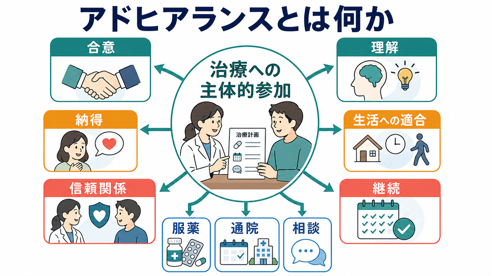
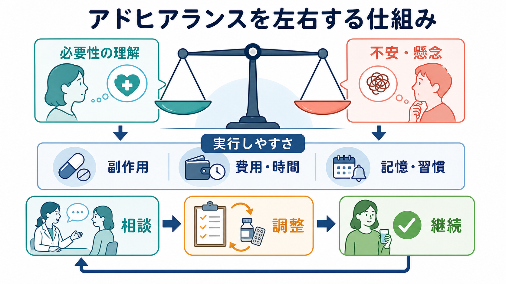
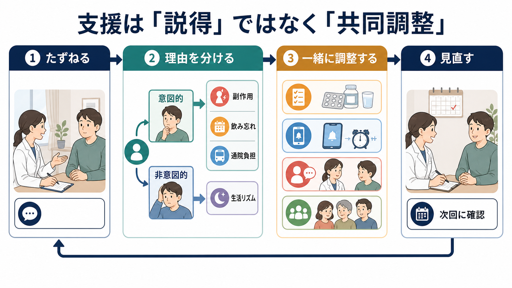

# アドヒアランスとは何か

## 要点

- アドヒアランスは、患者が治療方針を理解し、納得し、生活のなかで実行できるように、医療者と患者が合意して治療を進めることを指す。
- 「言われた通りに従うか」を見るコンプライアンスよりも、患者の価値観、生活条件、副作用、費用、通院負担、治療関係を含めて考える概念である[1][2]。
- 非アドヒアランスは、意図的な拒否だけでなく、飲み忘れ、理解不足、生活リズム、アクセスの悪さ、抑うつや認知機能の問題などでも起こる[1][7]。
- 支援の中心は説得ではなく、理由を分けて聞き、治療を共同で調整し、次回に見直すことである[2][4]。

## この記事で答える問い

- アドヒアランスはコンプライアンスと何が違うのか。
- 服薬や通院が続かないとき、どのような要因を見ればよいのか。
- 精神科臨床では、[[治療関係とは何か]]や[[精神科面接とは何か]]とどのようにつながるのか。
- 患者を責めずに、継続を支える面接・支援をどう組み立てるのか。

## まず結論

アドヒアランスとは、「患者が医療者の指示に従う程度」ではなく、「患者と医療者が合意した治療方針を、患者の生活と価値観に合わせて継続できる程度」である。WHO は、長期治療のアドヒアランスを、服薬、食事、生活習慣の変更などの行動が、医療者との合意された推奨にどの程度一致しているかとして整理した[1]。この定義で重要なのは、「命令への服従」ではなく「合意」である。

精神科では、とくにこの点が重要になる。症状の自覚、病識、治療への期待、薬への不安、副作用経験、スティグマ、生活リズム、家族や職場との関係が、服薬や通院の継続に直接影響するからである[7]。したがって、アドヒアランスを扱う面接では、単に「薬を飲んでいますか」と確認するだけでなく、「何が続けやすく、何が続けにくいのか」を一緒に見つける必要がある。

## 背景

アドヒアランスが注目される背景には、慢性疾患の治療では「処方すること」と「実際に続くこと」の間に大きな隔たりがある、という臨床上の問題がある。Osterberg と Blaschke は、服薬アドヒアランスが治療効果、安全性、医療費に関わる基本問題であり、測定方法にも自己申告、薬剤補充記録、電子モニタリングなど複数の限界があることを整理した[3]。

WHO の報告は、アドヒアランスを患者個人の意思だけに還元せず、医療制度、疾患、治療、患者、社会経済的条件という複数の次元から見る必要があるとした[1]。この見方は、精神科で重視される[[生物心理社会モデルとは何か]]とも相性がよい。たとえば、同じ「服薬中断」でも、薬の必要性に納得していない場合、副作用がつらい場合、通院費が負担な場合、生活が不安定で飲み忘れる場合では、支援の焦点が異なる。

## 基本概念

### コンプライアンスとの違い

コンプライアンスは、患者が医師の指示にどの程度従ったかを測るニュアンスを持つ。これに対してアドヒアランスは、患者と医療者の合意を前提にする。NICE の服薬アドヒアランス指針も、処方薬に関する意思決定に患者を関与させ、患者の考えや懸念を確認し、支援を個別化することを強調している[2]。

この違いは言葉の置き換えだけではない。コンプライアンス的な発想では、「なぜ守らないのか」が中心になりやすい。アドヒアランスの発想では、「何が合意されていて、何が実行を難しくしているのか」を見る。これは[[共感的理解とは何か]]、[[傾聴とは何か]]、[[反映とは何か]]といった面接技法と結びつく。

### 意図的・非意図的な非アドヒアランス

非アドヒアランスには、意図的なものと非意図的なものがある。意図的な非アドヒアランスは、薬への不信、副作用への不安、病気として捉えたくない気持ち、スティグマなどから起こる。非意図的な非アドヒアランスは、飲み忘れ、理解不足、複雑な服薬スケジュール、認知機能の問題、費用や交通手段の問題などで起こる[1][2]。

この区別は臨床的に大きい。意図的な非アドヒアランスにリマインダーだけを増やしても効果は限られる。逆に、非意図的な飲み忘れに対して説得を重ねても、患者は責められていると感じやすい。まず理由を分けて聞くことが、支援の出発点になる。

## 仕組み

アドヒアランスを左右する中心的な仕組みの一つは、「治療の必要性の認知」と「治療への懸念」のバランスである。Horne らのメタ分析は、薬が自分に必要だという信念が強いほどアドヒアランスが高く、薬への懸念が強いほどアドヒアランスが低くなる傾向を示した[5]。

ただし、必要性と懸念だけで説明しきれない。実際には、副作用、費用、時間、通院距離、服薬回数、生活リズム、対人関係、医療者への信頼が絡む。Cochrane レビューでは、アドヒアランス改善介入はしばしば複雑で、単純な情報提供だけでは不十分であり、継続的で個別化された支援が必要になりやすいことが示されている[4]。

## 図解

アドヒアランス支援は、次の4段階で考えると整理しやすい。

1. たずねる  
   服薬・通院の事実だけでなく、患者がどう理解し、どう感じ、何を負担にしているかを聞く。

2. 理由を分ける  
   意図的な中断か、非意図的な中断かを区別する。副作用、飲み忘れ、通院負担、生活リズム、費用、対人関係を分けて確認する。

3. 一緒に調整する  
   説得ではなく、患者の優先順位と医学的安全性の両方を見ながら、服薬方法、情報提供、リマインダー、家族支援、受診間隔、相談先を調整する。

4. 見直す  
   一度の説明で終わらせず、次回に「実際に続けられたか」「何が難しかったか」を確認する。

## 臨床・研究との接続

精神科臨床では、アドヒアランスは[[治療関係とは何か]]と切り離せない。治療同盟とアドヒアランスの関連を扱ったレビューでは、患者と治療者の関係性が治療継続や服薬行動と関係することが示されている[6]。したがって、アドヒアランスの問題は「患者のやる気」だけでなく、治療者がどのように聞き、説明し、合意を作るかの問題でもある。

研究では、アドヒアランスは測定が難しい。自己申告は過大評価されやすく、薬剤補充記録は実際に飲んだかを直接示さない。電子モニタリングは詳細だが、費用や行動変容そのものの影響がある[3]。そのため、研究結果を読むときは、どの測定方法で、どの期間を、どの疾患・治療で見ているかを確認する必要がある。

精神疾患の薬物療法では、非アドヒアランスは再燃、再入院、機能低下と関連しうるが、これを個別患者への単純な予測や責任追及に使うべきではない。Semahegn らの系統的レビューとメタ分析は、精神疾患における向精神薬の非アドヒアランスが多因子的であり、薬物関連要因、疾患関連要因、患者要因、医療者・制度要因を含めて評価する必要があることを示している[7]。

## よくある誤解

### 「飲まないのは病識がないから」だけではない

病識は重要な要因の一つだが、それだけで説明すると見落としが増える。副作用、費用、生活リズム、スティグマ、医療者への不信、家族関係、仕事や学校の都合も影響する[1][7]。

### 「説明すれば続く」とは限らない

情報提供は必要だが、それだけでは十分でないことが多い。患者の懸念を聞き、生活上の実行可能性を調整し、継続的に見直す必要がある[2][4]。

### 「アドヒアランスを上げる」と「患者を従わせる」は違う

アドヒアランス支援は、患者の主体性を弱める作業ではない。むしろ、患者が治療の意味を理解し、自分の生活のなかで選択しやすくする作業である。これは[[精神医学における回復とは何か]]の発想ともつながる。

### 「副作用を我慢させること」ではない

副作用や不安があるときは、我慢を求めるのではなく、症状、重症度、タイミング、患者の困りごとを確認し、医学的安全性を保ちながら調整の選択肢を検討する。この記事は教育・研究目的の一般的整理であり、個別の服薬変更や中止を指示するものではない。

## 関連ノート

- [[治療関係とは何か]]
- [[ラポールはどのように形成されるのか]]
- [[精神科面接とは何か]]
- [[精神科初診で何を確認するべきか]]
- [[傾聴とは何か]]
- [[共感的理解とは何か]]
- [[反映とは何か]]
- [[要約は面接でなぜ重要なのか]]
- [[生物心理社会モデルとは何か]]
- [[精神医学における回復とは何か]]

MOC 更新候補: `content/00_MOC/` 配下の精神医学・精神科面接・臨床実践系 MOC があれば、統合ジョブで本記事へのリンク追加を検討する。

## 理解チェック

1. アドヒアランスとコンプライアンスの違いを、「合意」という語を使って説明できるか。
2. 非アドヒアランスを、意図的なものと非意図的なものに分けて例示できるか。
3. 「必要性の理解」と「不安・懸念」のバランスが、服薬継続にどう関わるかを説明できるか。
4. 患者を責めずに服薬・通院継続を支える面接の流れを、4段階で説明できるか。

## 参考文献

[1] World Health Organization. (2003). *Adherence to Long-Term Therapies: Evidence for Action*. https://apps.who.int/iris/handle/10665/42682

[2] National Institute for Health and Care Excellence. (2009). *Medicines adherence: involving patients in decisions about prescribed medicines and supporting adherence (CG76)*. https://www.nice.org.uk/guidance/cg76

[3] Osterberg, L., & Blaschke, T. (2005). Adherence to medication. *The New England Journal of Medicine*, 353(5), 487-497. https://doi.org/10.1056/NEJMra050100

[4] Nieuwlaat, R., Wilczynski, N., Navarro, T., et al. (2014). Interventions for enhancing medication adherence. *Cochrane Database of Systematic Reviews*, 2014(11), CD000011. https://doi.org/10.1002/14651858.CD000011.pub4

[5] Horne, R., Chapman, S. C. E., Parham, R., Freemantle, N., Forbes, A., & Cooper, V. (2013). Understanding patients' adherence-related beliefs about medicines prescribed for long-term conditions: a meta-analytic review. *PLOS ONE*, 8(12), e80633. https://doi.org/10.1371/journal.pone.0080633

[6] Thompson, L., & McCabe, R. (2012). The effect of clinician-patient alliance and communication on treatment adherence in mental health care: a systematic review. *BMC Psychiatry*, 12, 87. https://doi.org/10.1186/1471-244X-12-87

[7] Semahegn, A., Torpey, K., Manu, A., Assefa, N., Tesfaye, G., & Ankomah, A. (2020). Psychotropic medication non-adherence and its associated factors among patients with major psychiatric disorders: a systematic review and meta-analysis. *Systematic Reviews*, 9, 17. https://doi.org/10.1186/s13643-020-1274-3

## 未解決問題

- 精神疾患ごとに、どのアドヒアランス支援が最も有効かは一様ではない。
- デジタルリマインダー、オンライン診療、薬剤師介入、家族支援をどう組み合わせるかは、医療制度と個人の生活条件に依存する。
- アドヒアランスを高める支援と、患者の自己決定・治療拒否の尊重をどう両立するかは、臨床倫理上の継続課題である。
