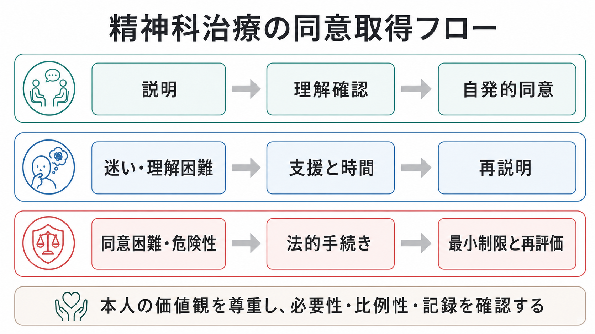
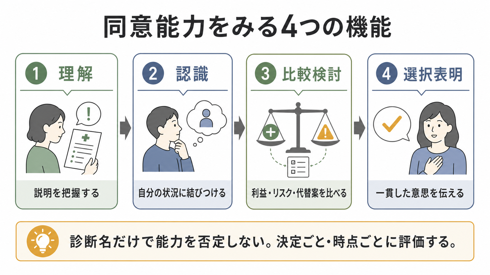
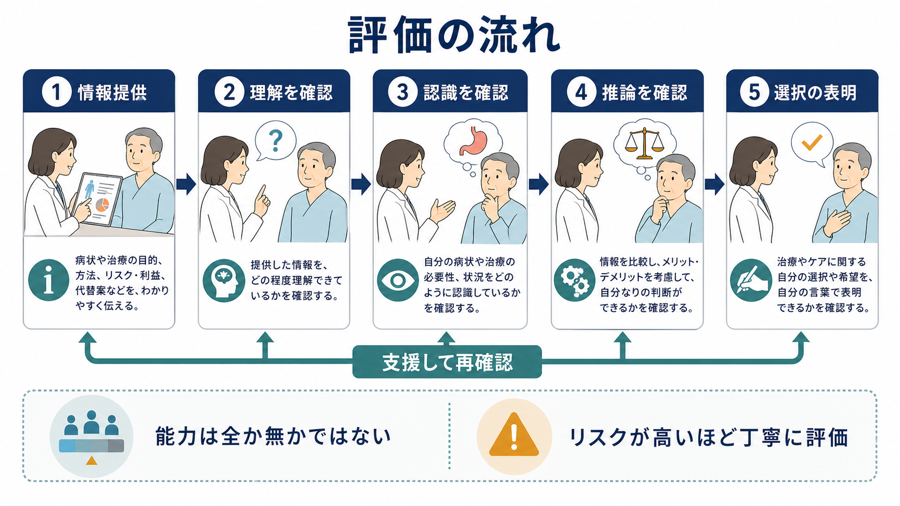

# インフォームドコンセントは精神科でどう行うのか

## 要点

- インフォームドコンセントは、説明書に署名をもらう手続きではなく、本人が理解し、比較検討し、自発的に同意または拒否できるようにする臨床プロセスである[1]。
- 精神科では、症状そのものが理解、病識、危険の見積もり、治療者への信頼に影響するため、同意能力を「診断名」ではなく、決定ごと・時点ごとに評価する[2][3]。
- 同意能力は、理解、認識、比較検討、選択表明という4つの機能でみると整理しやすい[2][3]。
- 自発性は、強制がないことだけでなく、病棟・家族・司法・経済・職場などの圧力を本人がどう受け止めているかまで含めて確認する。
- 入院や身体拘束など、本人の自由を制限しうる場面では、法的根拠、必要性、比例性、最小制限、再評価、記録を明確にする必要がある[5][6]。

## この記事で答える問い

1. 精神科でインフォームドコンセントが難しくなるのはなぜか。
2. 説明すべき内容は何か。
3. 同意能力はどのように評価するのか。
4. 同意が得られない、または拒否されたときに何を考えるべきか。
5. 記録には何を残すべきか。

## まず結論

精神科のインフォームドコンセントは、「説明」「理解確認」「同意能力評価」「自発性の確認」「同意または拒否の記録」「必要時の再説明」という一連の作業である。医療者は、診断名、症状、入院形態だけで本人の同意能力を判断してはならない。本人がその時点の治療選択について、必要な情報を理解し、自分の状況に結びつけ、利益・リスク・代替案を比べ、安定した意思を表明できるかを確認する[2][3]。

同意が難しい場合も、ただちに「能力なし」と結論づけるのではなく、説明を短くする、視覚資料を使う、時間を置く、家族や支援者の同席を本人の希望に沿って調整する、苦痛・不眠・せん妄・急性精神病症状を軽減するなど、本人が最大限意思決定に参加できる条件を整える[2][3]。これは[[共同意思決定とは何か]]や[[コンコーダンスとは何か]]の基盤でもある。

## 背景

インフォームドコンセントは、患者の自己決定権と医療者の説明義務を結びつける考え方である。世界医師会のリスボン宣言は、判断能力のある成人には診断・治療について同意または拒否する権利があり、そのために必要な情報を受ける権利があると整理している[1]。

精神科でこの原則が特に重要になるのは、治療対象である精神症状が、治療への理解や信頼に直接影響しうるからである。たとえば、被害妄想が強い人は薬物療法を「害を加えるもの」と受け取るかもしれない。重度のうつ病では、治療効果を過小評価し、将来の回復可能性を極端に低く見積もることがある。躁状態では、リスクの評価が甘くなり、入院や休養の必要性を過小評価することがある。

しかし、これらは「精神疾患がある人は同意できない」という意味ではない。むしろ逆で、精神科では本人の理解を支える工夫がより重要になる。[[精神科面接とは何か]]や[[治療関係とは何か]]で扱う信頼形成は、同意取得の前提でもある。

## 基本概念

### インフォームドコンセント

インフォームドコンセントは、少なくとも次の3要素から成る。

| 要素 | 精神科での確認点 |
|---|---|
| 十分な説明 | 診断仮説、治療目的、選択肢、利益、リスク、副作用、代替案、治療しない場合の見通しを説明する |
| 同意能力 | 本人が理解、認識、比較検討、選択表明をその決定について行えるかをみる |
| 自発性 | 脅し、過度な誘導、家族や病棟の圧力、退院や処遇をめぐる不均衡が同意を歪めていないかをみる |

ここでいう説明は、専門用語を並べることではない。本人が自分の言葉で言い直せるか、疑問を出せるか、生活上の不安と結びつけて考えられるかが重要である。

### 同意能力

同意能力は、一般的な知能や診断名ではなく、「いま問われている具体的な決定」に対する能力である。低リスクで単純な決定と、高リスクで不可逆的な決定では、求められる理解の精度も異なる[3]。

4つの機能は次のように整理できる[2][3]。

| 機能 | 見ること | 面接での問いの例 |
|---|---|---|
| 理解 | 説明された情報を把握できるか | 「今日説明した治療の目的を、どのように理解しましたか」 |
| 認識 | 情報を自分の状況に当てはめられるか | 「その説明は、いまのご自身の状態とどう関係していると思いますか」 |
| 比較検討 | 利益、リスク、代替案を比べられるか | 「薬を始める場合と始めない場合で、何が違いそうですか」 |
| 選択表明 | 一貫した選択を伝えられるか | 「現時点では、どの選択を希望しますか。その理由は何ですか」 |

重要なのは、本人の選択が医療者の推奨と一致するかではなく、判断の過程が成り立っているかである。本人が治療を拒否していても、十分に理解し、自分の価値観に沿って理由を述べ、リスクも認識しているなら、拒否は尊重されるべき意思表示になりうる[1][2]。

### 自発性

精神科の自発性は単純ではない。本人が「同意します」と言っていても、退院したい一心で同意している、家族に強く迫られている、医療者に逆らうと不利益があると感じている、病棟環境の中で選択肢が狭まっている、といった場合がある。

したがって、同意の確認では次の点を丁寧にみる。

- 本人は「断ってよい」ことを理解しているか。
- 断った場合の見通しが、脅しではなく臨床的・法的に正確に説明されているか。
- 家族同席が本人の助けになっているか、それとも圧力になっているか。
- 入院、退院、外出、薬物療法、職場復帰などの条件が、暗黙の取引として提示されていないか。
- 本人の価値観や過去の希望が確認されているか。

## 仕組み

### 1. 決める対象を具体化する

まず、「治療に同意するか」では広すぎる。次のように決定単位を分ける。

- 抗精神病薬を開始するか。
- 薬剤を増量するか、変更するか。
- 入院を継続するか、外来へ移行するか。
- 家族にどこまで情報共有するか。
- 電気けいれん療法、長時間作用型注射製剤、隔離・身体拘束など、侵襲性や自由制限の大きい介入を行うか。

決定単位を具体化すると、説明内容、必要な理解の深さ、記録すべき事項が明確になる。

### 2. 説明内容を構造化する

説明では、少なくとも次の項目を扱う。

| 項目 | 内容 |
|---|---|
| 現在の見立て | 確定診断だけでなく、鑑別診断や不確実性も説明する |
| 治療目的 | 症状軽減、再発予防、安全確保、睡眠回復、生活機能改善など |
| 選択肢 | 薬物療法、心理社会的支援、環境調整、経過観察、入院・外来の選択肢 |
| 利益 | 期待される効果、効果発現までの時間、生活上の利点 |
| リスク | 副作用、依存、離脱、行動制限、スティグマ、費用、通院負担 |
| 代替案 | 別の薬、用量調整、心理教育、家族支援、地域資源 |
| 治療しない場合 | 自然経過、悪化リスク、安全面の懸念、再診の目安 |
| 取り消し・再相談 | 同意後も見直せること、いつ相談できるか |

これは[[心理教育とは何か]]や[[アドヒアランスとは何か]]とも関係する。本人が治療の意味を理解し、生活の中で続けられる形に調整できなければ、形式的な同意は長期的な治療参加につながりにくい。

### 3. 理解を確認する

説明したあとに「わかりましたか」と聞くだけでは不十分である。本人は遠慮して「はい」と答えることがある。確認には、本人の言葉で説明してもらう teach-back が有用である。

例:

- 「私の説明がわかりにくかったかもしれないので、薬を使う理由をどのように理解したか教えてください」
- 「副作用について、特に気になった点はどれですか」
- 「治療を始めない場合、どのようなことが起こりうると考えていますか」

理解が不十分なら、それはただちに能力欠如を意味しない。説明の量を減らす、紙に書く、図表にする、時間を置く、睡眠や不安を整える、信頼できる支援者の同席を検討する。

### 4. 同意能力を評価する

同意能力の評価は、本人の答えを「正解・不正解」で採点する作業ではない。見るべきなのは、判断に必要な情報を自分の状況に結びつけ、理由を述べられるかである[2][3]。

たとえば、抗精神病薬を拒否する人が「副作用が心配だから、まず低用量で試したい」と述べる場合と、「薬はすべて毒で、医師は自分を消そうとしている」と述べる場合では、同じ拒否でも評価の焦点が異なる。前者では価値観とリスク選好の問題かもしれない。後者では、被害妄想が認識や比較検討をどの程度妨げているかを確認する必要がある。

### 5. 同意・拒否・保留を記録する

記録には次を残す。

- 説明した治療選択肢、利益、リスク、代替案。
- 本人が示した理解内容。
- 本人が重視した価値観、不安、希望。
- 同意能力の評価根拠。
- 同意、拒否、保留の内容。
- 家族や支援者が同席した場合、その理由と本人の希望。
- 法的手続きが関係する場合、根拠、必要性、最小制限、再評価予定。

「本人同意あり」だけでは、あとから同意の質を検討できない。精神科では状態が変動しやすいため、同意は一回で終わるものではなく、経過の中で更新する。

## 図解

### 図1: 精神科治療の同意取得フロー

1枚目の図は、通常の説明から自発的同意に至る流れと、理解困難・危険性がある場合の分岐を示している。ポイントは、迷いや理解困難がある場合に、すぐ強制へ進むのではなく、支援、時間、再説明をはさむことである。

### 図2: 同意能力をみる4つの機能

2枚目の図は、同意能力を「理解」「認識」「比較検討」「選択表明」に分けて示している。診断名や知能検査の点数だけではなく、その決定について判断過程が成り立つかを見る。

### 図3: 評価と再確認の流れ

3枚目の図は、情報提供、理解確認、認識確認、推論確認、選択表明という流れを示している。能力は全か無かではなく、支援で改善しうる。リスクが高い決定ほど、説明と評価を丁寧に行う。

## 臨床・研究との接続

### 薬物療法

薬物療法では、効果だけでなく副作用、開始量、増量計画、中止時の注意、モニタリング、妊娠・授乳、運転、飲酒、他剤併用などを扱う。精神科薬物療法では、効果が遅れて現れ、副作用が先に出ることがある。そのため、本人が「いつ何を期待し、何が起きたら相談するか」を理解していることが重要である。

### 入院

任意入院では、本人の同意が中心になる。精神保健福祉法上も、精神障害者の入院では本人の同意に基づく入院が行われるよう努めることが定められている[6]。一方、医療保護入院など本人の同意によらない入院制度が関係する場合は、法律上の要件と手続き、本人への説明、退院請求等の権利、家族等の関与、退院支援を明確にする必要がある[6][7]。

ここで重要なのは、法的に可能なことと倫理的に望ましいことを混同しないことである。本人の同意によらない介入は、必要性、比例性、最小制限、継続的な再評価を伴うべきであり、WHO/OHCHRのガイダンスも、精神保健法制において本人の権利と尊厳を尊重する方向を強く求めている[5]。

### 家族との情報共有

家族は治療継続の重要な支援者になりうるが、本人の秘密保持や自発性を損なう可能性もある。[[家族面接では何を評価するべきか]]で扱うように、家族同席の目的、本人の希望、共有範囲、家族の負担、家族からの圧力を分けて確認する。本人が同意能力を持つ場合、家族に何を伝えるかも本人の意思決定の対象である。

### 研究参加

研究参加の同意では、診療上の利益と研究目的を混同しないことが重要である。治療者が研究者を兼ねる場合、本人は「断ると治療に不利益がある」と感じることがある。研究参加は、治療同意よりもさらに自発性の確認が重要になる[1]。

## よくある誤解

### 誤解1: 精神疾患があると同意能力はない

これは誤りである。精神疾患があっても、多くの人は具体的な治療決定に参加できる。能力は診断名ではなく、決定ごと・時点ごとに評価する[3]。[[病識とは何か]]が不十分でも、治療の一部について理解し、同意できることがある。

### 誤解2: 医師の推奨に従わないなら能力がない

拒否は能力欠如の証拠ではない。本人がリスクを理解し、自分の価値観に沿って選択しているなら、医療者と異なる選択も尊重される[1][2]。ただし、拒否の理由が妄想、重い抑うつ、せん妄、認知障害などによって判断過程を大きく歪めている場合は、より丁寧な評価が必要である。

### 誤解3: 同意書があれば十分である

同意書は記録の一部であって、同意そのものではない。同意の質は、説明内容、理解確認、自発性、本人の価値観、再確認のプロセスによって支えられる。

### 誤解4: 緊急時には説明しなくてよい

緊急時には説明や同意取得が制限される場合があるが、それは説明不要という意味ではない。可能な範囲で本人に説明し、あとから状況、理由、継続の必要性、今後の選択肢を再確認する。本人の自由を制限した場合ほど、記録と再評価が重要になる[5][6]。

## 関連ノート

- [[共同意思決定とは何か]]
- [[コンコーダンスとは何か]]
- [[アドヒアランスとは何か]]
- [[心理教育とは何か]]
- [[病識とは何か]]
- [[精神科面接とは何か]]
- [[治療関係とは何か]]
- [[家族面接では何を評価するべきか]]
- [[精神科初診で何を確認するべきか]]

## MOC更新候補

- `content/00_MOC/` 配下の精神医学・精神科面接・臨床倫理に関するMOCがある場合、本記事を「総論・診断・面接」または「治療関係・意思決定」関連として追加する。
- 並列生成ジョブとの競合を避けるため、本タスクではMOCファイルの直接更新は行わない。

## 理解チェック

1. インフォームドコンセントの3要素は何か。
2. 同意能力を評価するとき、なぜ診断名だけで判断してはいけないのか。
3. 「治療拒否」と「同意能力なし」はどのように区別するか。
4. 精神科で自発性を確認するとき、どのような圧力を考えるべきか。
5. 本人の同意によらない入院や処遇が関係する場合、記録に何を残すべきか。

## 未解決問題

- 日本の精神科臨床で、同意能力評価をどの程度構造化して記録するべきかについては、施設差が大きい。
- 急性期の安全確保と本人の自己決定支援をどのように両立するかは、法制度、病床体制、地域資源に左右される。
- 共同意思決定支援ツールの効果は一般医療では研究が多いが、精神科急性期、強制入院、重症精神病圏では適用条件を慎重に検討する必要がある。

## 参考文献

[1] World Medical Association. *WMA Declaration of Lisbon on the Rights of the Patient*. Reaffirmed 2015. https://www.wma.net/policy-types/declaration-of-lisbon/

[2] Appelbaum PS, Grisso T. Assessing patients' capacities to consent to treatment. *New England Journal of Medicine*. 1988;319(25):1635-1638. https://doi.org/10.1056/NEJM198812223192504

[3] Palmer BW, Harmell AL. Assessment of Healthcare Decision-making Capacity. *Archives of Clinical Neuropsychology*. 2016;31(6):530-540. https://doi.org/10.1093/arclin/acw051

[4] National Institute for Health and Care Excellence. *Shared decision making: NICE guideline NG197*. 2021. https://www.nice.org.uk/guidance/ng197

[5] World Health Organization, Office of the High Commissioner for Human Rights. *Mental health, human rights and legislation: guidance and practice*. 2023. https://www.who.int/publications/i/item/9789240080737

[6] 精神保健及び精神障害者福祉に関する法律. 日本法令外国語訳データベース. https://www.japaneselawtranslation.go.jp/ja/laws/view/4235/ja

[7] 厚生労働省. 令和4年精神保健及び精神障害者福祉に関する法律の一部改正について. https://www.mhlw.go.jp/stf/seisakunitsuite/bunya/hukushi_kaigo/shougaishahukushi/kaisei_seisin/index_00003.html
