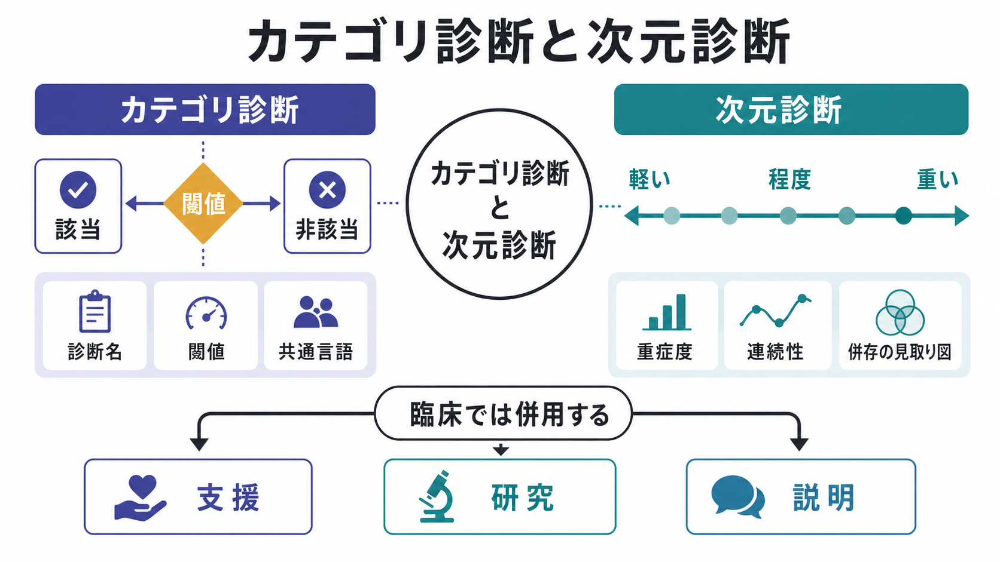
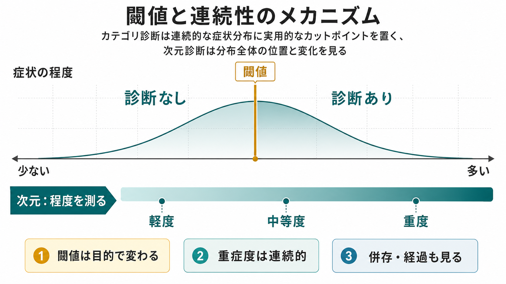
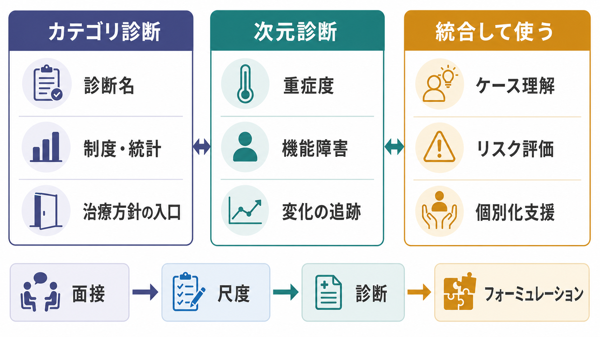

# カテゴリ診断と次元診断は何が違うのか

## 要点

- **カテゴリ診断**は、ある基準を満たすかどうかで「診断あり / なし」を区切る方法である。臨床コミュニケーション、制度、統計、研究対象の定義に強い。
- **次元診断**は、症状や機能障害を「どの程度か」「どの方向に連続しているか」として捉える方法である。重症度、併存、経過、個人差の理解に強い。
- 精神医学では、カテゴリと次元は対立物ではなく、目的の違う道具として併用される。DSM-5-TR や ICD-11 もカテゴリ体系を中心にしつつ、重症度、特定用語、機能障害、発達経過、文化的文脈などを扱う[1][2]。
- RDoC や HiTOP は、従来の診断名だけでは捉えにくい連続性、診断横断性、症状の階層構造を研究する枠組みとして重要である[3][4][5]。
- この記事は教育・研究目的の整理であり、個別の診断や治療指示を行うものではない。

## この記事で答える問い

1. カテゴリ診断と次元診断は、何を分けているのか。
2. 精神疾患では、なぜ「有無」だけでなく「程度」が問題になるのか。
3. DSM / ICD、RDoC、HiTOP は、この違いにどう関係するのか。
4. 臨床や研究では、どちらをどのように使えばよいのか。

## まず結論

カテゴリ診断は「この診断名に該当するか」を決めるための方法であり、次元診断は「症状、苦痛、機能障害、リスクがどの程度か」を測るための方法である。

たとえば、うつ病の診断を考えるとき、カテゴリ診断では「主要な症状が一定数以上あり、期間や機能障害などの基準を満たすか」を見る。一方、次元診断では、抑うつ気分、興味の低下、睡眠、食欲、疲労感、集中困難、自殺念慮、社会機能の低下などを、それぞれ連続的な強さとして見る。前者は診断名を決めるのに役立ち、後者は重症度、治療反応、再発リスク、併存状態の把握に役立つ。

したがって、よい臨床判断は「カテゴリか次元か」の二者択一ではない。診断名を共有語として用いながら、重症度、持続期間、機能障害、文化的文脈、生活史、身体疾患、物質使用、発達特性を組み合わせて理解する必要がある。この点は、[[精神疾患とは何か]]や[[生物心理社会モデルとは何か]]とも直接つながる。

## 背景

医学の多くの領域では、診断はカテゴリと次元の両方を含む。高血圧や糖尿病も、血圧や血糖値という連続量に実用的な閾値を置いてカテゴリ化している。精神医学でも同じように、症状の多くは連続的に分布するが、臨床・制度・研究のためには「診断あり / なし」を決める場面がある。

精神医学でこの問題が特に難しいのは、多くの診断が単一の検査値ではなく、症状のまとまり、持続期間、苦痛、機能障害、除外条件、文脈判断の組み合わせで成立するからである。DSM-5-TR と ICD-11 は、診断カテゴリを標準化することで共通言語を与えるが、同時に重症度、経過、特定用語、文化的背景などを併せて扱う必要がある[1][2]。

さらに、精神疾患では併存が多い。同じ人が不安、抑うつ、物質使用、睡眠障害、注意困難を同時に抱えることは珍しくない。このような状況では、診断名を横断する症状次元を測ることが、研究にも支援計画にも重要になる[3][4]。

## 基本概念

### カテゴリ診断

カテゴリ診断とは、あらかじめ定めた基準を満たすかどうかで、ある診断カテゴリに入るかを判断する方法である。典型的には「診断 A に該当する」「診断 A には該当しない」という形をとる。

カテゴリ診断の利点は、共通言語として使いやすいことである。診断名があると、臨床家同士の情報共有、診療録、保険・福祉制度、疫学調査、治療研究の対象定義がしやすくなる。DSM と ICD は、この役割を担う代表的な分類体系である[1][2]。

ただし、カテゴリ診断には限界もある。第一に、閾値の近くにはグレーゾーンがある。第二に、同じ診断名でも症状の組み合わせや重症度が大きく異なる。第三に、複数の診断が同時に付くことが多く、診断カテゴリだけでは個人の困りごとを十分に表せない場合がある[3][6]。

### 次元診断

次元診断とは、症状や機能の特徴を連続量として扱う方法である。ここでいう「次元」は、抑うつ、不安、衝動性、外在化、認知機能、睡眠、対人機能、生活機能、苦痛の強さなどを含む。

次元診断の利点は、軽い状態から重い状態までを連続的に表せることである。診断基準をわずかに満たさない人でも、症状が生活に影響していれば支援が必要な場合がある。また、同じ診断名の人でも、どの症状次元が中心かによって支援の焦点は変わる。

次元診断の限界は、単独では制度上の判断や治療研究の対象定義に使いにくい場合があることである。また、尺度得点だけを見て本人の語り、文化的文脈、身体疾患、薬物、生活環境を軽視すると、臨床判断が狭くなる。

## 仕組み

カテゴリ診断の中心にあるのは「閾値」である。連続的に分布する症状や機能障害のどこかに、実用上の線を引く。線を越えれば診断あり、越えなければ診断なしと扱う。

次元診断の中心にあるのは「位置」と「変化」である。ある人が症状の連続体のどこにいるのか、時間とともにどう動いているのか、どの次元が強く、どの次元が比較的保たれているのかを追う。

重要なのは、閾値が「自然界に完全な境界線として存在する」とは限らないことである。閾値は、研究上の一貫性、臨床上の支援必要性、安全性、制度運用、予後予測などの目的に応じて設定される。したがって、閾値の近くでは、診断名の有無だけでなく、本人の苦痛、生活機能、安全性、支援資源を丁寧に評価する必要がある。

## 図解

カテゴリ診断と次元診断の違いは、次のように整理できる。

| 観点 | カテゴリ診断 | 次元診断 |
|---|---|---|
| 基本の問い | その診断に該当するか | どの症状がどの程度あるか |
| 出力 | 診断名、該当 / 非該当 | 尺度得点、重症度、プロフィール |
| 強み | 共通言語、制度、統計、研究対象の定義 | 個人差、経過、併存、治療反応の把握 |
| 弱み | グレーゾーン、診断内の異質性、併存の多さ | 境界設定が難しい、制度利用に直結しにくい |
| 向いている場面 | 診断書、疫学、治療研究の登録基準 | 面接、経過観察、ケースフォーミュレーション |

RDoC は、DSM や ICD の診断名ではなく、報酬、脅威、認知、社会過程、覚醒・調節などの機能ドメインを研究単位にする枠組みである[4]。これは、診断カテゴリをただ置き換えるというより、精神疾患を診断横断的な機能次元として研究する試みである。詳しくは[[RDoCは精神疾患研究をどう変えたのか]]で扱う。

HiTOP は、症状や症候群の共変動をもとに、精神病理を階層的な次元構造として整理するモデルである。内在化、外在化、思考障害などの高次元から、より具体的な症状次元までをつなげるため、併存や診断内の異質性を説明しやすい[5]。この発想は[[精神疾患の次元的理解とは何か]]と近い。

## 臨床・研究との接続

臨床では、カテゴリ診断は「入口」として有用である。診断名があることで、標準的な評価項目、リスク評価、治療選択肢、心理教育、家族説明、福祉制度の利用が整理しやすくなる。

しかし、診断名だけでは十分ではない。たとえば同じ「不安症」でも、パニック発作が中心なのか、回避行動が中心なのか、慢性的な心配が中心なのか、社交場面での恐怖が中心なのかで、支援の焦点は異なる。次元的な評価は、この違いを見えるようにする。

研究では、カテゴリ診断はサンプルを定義するために便利である。一方で、診断名だけで群を分けると、同じカテゴリ内の異質性や複数カテゴリにまたがる共通メカニズムを見落とすことがある。RDoC や HiTOP は、この問題に対して、症状次元、機能次元、階層構造を用いる研究戦略を示している[4][5][7]。

実践的には、次の順序で考えると扱いやすい。

1. まず安全性、急性リスク、身体疾患、物質使用、薬剤影響を確認する。
2. DSM / ICD などのカテゴリ診断で、共通言語としての位置づけを整理する。
3. 症状の重症度、持続期間、機能障害、併存、発達史、生活史を次元的に評価する。
4. 本人の目標、環境資源、文化的文脈を含めてケースフォーミュレーションを作る。
5. 経過の中で、診断名だけでなく尺度得点、生活機能、本人の語りの変化を追跡する。

## よくある誤解

### 誤解1: カテゴリ診断は古く、次元診断だけが正しい

そうではない。カテゴリ診断は、臨床・制度・研究で必要な共通言語として今も重要である。問題はカテゴリを使うことではなく、カテゴリだけで本人を説明しきったと考えることである。

### 誤解2: 次元診断は診断名を否定する

次元診断は診断名を否定するというより、診断名の中身を細かく見る方法である。同じ診断名でも、重症度、症状プロフィール、機能障害、併存、経過、背景要因は異なる。次元はこの違いを補う。

### 誤解3: 尺度を取れば次元診断になる

尺度は重要だが、それだけでは不十分である。尺度得点は、面接、観察、身体医学的評価、生活背景、文化的文脈と統合して初めて意味を持つ。点数だけで個別診断や治療方針を機械的に決めるのは避けるべきである。

### 誤解4: 閾値を越えなければ支援は不要である

診断基準を満たさない場合でも、苦痛や機能障害が大きい、リスクが高い、生活上の困難が続いているなら支援が必要なことがある。逆に診断名が付いても、支援の内容は重症度、本人の希望、環境、併存状態に応じて変わる。

## 関連ノート

- [[精神疾患とは何か]]
- [[精神疾患の次元的理解とは何か]]
- [[RDoCは精神疾患研究をどう変えたのか]]
- [[生物心理社会モデルとは何か]]

MOC 更新候補: [[MOC｜精神医学]]、[[MOC｜計算論的精神医学]]

今後の作成候補:

- DSMとICDは何が違うのか
- HiTOPは精神疾患分類をどう変えるのか
- 診断閾値はどのように決められるのか
- 精神医学におけるケースフォーミュレーションとは何か

## 理解チェック

1. カテゴリ診断が「共通言語」として役立つ場面を 2 つ挙げられるか。
2. 次元診断が、診断カテゴリ内の異質性を補える理由を説明できるか。
3. 「閾値は実用的な線であり、自然界の完全な境界とは限らない」とはどういう意味か。
4. RDoC と HiTOP は、それぞれカテゴリ診断のどの限界に対応しようとしているか。

## 参考文献

[1] American Psychiatric Association. (2022). *Diagnostic and Statistical Manual of Mental Disorders, Fifth Edition, Text Revision (DSM-5-TR)*. American Psychiatric Association Publishing. https://doi.org/10.1176/appi.books.9780890425787

[2] World Health Organization. (2024). *Clinical descriptions and diagnostic requirements for ICD-11 mental, behavioural and neurodevelopmental disorders*. World Health Organization. https://www.who.int/publications/i/item/9789240077263

[3] Clark, L. A., Cuthbert, B., Lewis-Fernandez, R., Narrow, W. E., & Reed, G. M. (2017). Three approaches to understanding and classifying mental disorder: ICD-11, DSM-5, and the National Institute of Mental Health's Research Domain Criteria (RDoC). *Psychological Science in the Public Interest, 18*(2), 72-145. https://doi.org/10.1177/1529100617727266

[4] Insel, T., Cuthbert, B., Garvey, M., Heinssen, R., Pine, D. S., Quinn, K., Sanislow, C., & Wang, P. (2010). Research domain criteria (RDoC): Toward a new classification framework for research on mental disorders. *American Journal of Psychiatry, 167*(7), 748-751. https://doi.org/10.1176/appi.ajp.2010.09091379

[5] Kotov, R., Krueger, R. F., & Watson, D. (2018). A paradigm shift in psychiatric classification: The Hierarchical Taxonomy of Psychopathology (HiTOP). *World Psychiatry, 17*(1), 24-25. https://doi.org/10.1002/wps.20478

[6] Widiger, T. A., & Samuel, D. B. (2005). Diagnostic categories or dimensions? A question for the Diagnostic and Statistical Manual of Mental Disorders--Fifth Edition. *Journal of Abnormal Psychology, 114*(4), 494-504. https://doi.org/10.1037/0021-843X.114.4.494

[7] Krueger, R. F., & Markon, K. E. (2011). A dimensional-spectrum model of psychopathology: Progress and opportunities. *Archives of General Psychiatry, 68*(1), 10-11. https://doi.org/10.1001/archgenpsychiatry.2010.188
