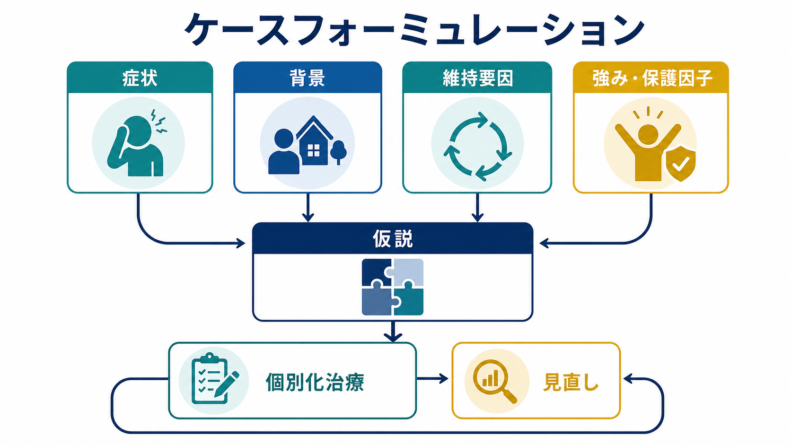
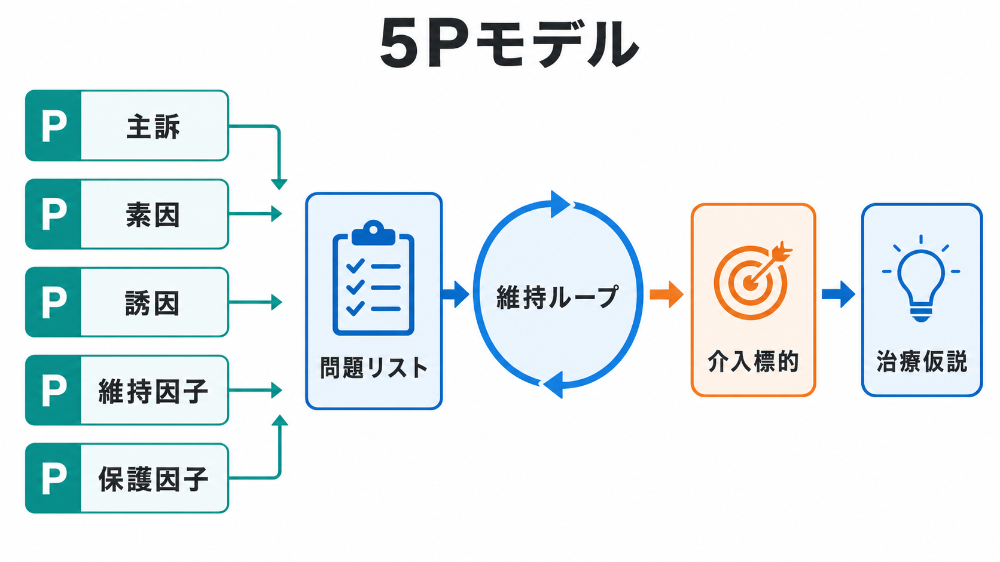

# ケースフォーミュレーションとは何か

## 要点

- ケースフォーミュレーションは、診断名だけでは説明しきれない「この人の困りごとが、どのような経路で生じ、何によって続き、どこから変えられるか」を整理する臨床的仮説である[1][2]。
- 典型的には、主訴・症状、発症や悪化の背景、維持要因、保護因子、強み、本人の価値や希望を統合し、治療計画の優先順位を決める[1][3]。
- よく使われる枠組みの一つが、主訴、素因、誘因、維持因子、保護因子をみる 5P モデルである[1]。
- フォーミュレーションは最終判定ではなく、面接・観察・治療反応に応じて更新する作業仮説である[2][4]。
- 医療・精神医学では、個別の診断や治療指示ではなく、教育・研究目的の概念として理解する必要がある。

## この記事で答える問い

1. ケースフォーミュレーションは、[[精神科診断は何のためにあるのか|診断]]や[[精神科面接とは何か|精神科面接]]と何が違うのか。
2. どのような情報を統合すれば、治療に使える仮説になるのか。
3. 5P モデルはどのように維持要因と介入標的を見つけるのか。
4. 臨床・研究で使うとき、どのような限界や誤解に注意するべきか。

## まず結論

ケースフォーミュレーションとは、症状を単に分類する作業ではなく、症状、生活史、発達歴、対人関係、身体状態、環境、文化的背景、本人の強みを結びつけて、「なぜこの問題がこの人にこの形で起き、何が続けており、どこに介入すると変化が起きやすいか」を説明する仮説である[1][2]。

たとえば同じ「抑うつ症状」でも、睡眠相の乱れ、仕事上の喪失体験、慢性疼痛、孤立、自己批判的な信念、アルコール使用、家族内役割、経済的不安、援助希求のしにくさ、過去のトラウマによって、支援の優先順位は変わる。診断は共通言語として重要だが、ケースフォーミュレーションは「この人にとって何が問題で、何が変化の足場になるか」を扱う。

## 背景

精神医学では、[[DSMとICDは何が違うのか|DSMやICD]] のような分類体系が、症状群を整理し、研究や診療の共通語を提供する。一方で、同じ診断カテゴリに入る人でも、発症経路、維持要因、リスク、回復資源、治療への好みは大きく異なる。Macneil らは、診断だけでは精神保健介入の十分な指針になりにくく、個人に固有の寄与因子と強みに基づくフォーミュレーションが必要だと論じている[1]。

この発想は、[[生物心理社会モデルとは何か|生物心理社会モデル]] とも親和的である。Engel は、生物医学モデルだけでは病いの心理的・社会的側面を扱いにくいと批判し、生物・心理・社会の相互作用として健康と病いを理解する必要を示した[7]。ケースフォーミュレーションは、この大きな枠組みを実際の面接と治療計画に落とし込む作業といえる。

## 基本概念

### 診断との違い

診断は、症状のまとまりを分類し、鑑別、予後、治療選択、研究上の比較を可能にする。ケースフォーミュレーションは、診断を置き換えるものではなく、診断を「その人の生活文脈」の中で使える形にする。つまり、診断が「何の症候群か」を問うのに対し、フォーミュレーションは「なぜ、今、どのように続いているのか」を問う。

この違いは、[[鑑別診断とは何か]] や [[精神科診断における除外診断とは何か]] と矛盾しない。身体疾患、薬剤、物質使用、せん妄、認知症、双極性障害などの見落としを避ける診断作業は不可欠である。そのうえで、診断名だけでは治療同盟、目標設定、介入順序、再発予防、心理教育の内容までは決まらない。

### 仮説としての性質

ケースフォーミュレーションは、確定した物語ではなく、検証と修正を前提にした仮説である[2][4]。最初の面接で作られた説明は、治療が進むにつれて、本人の語り、家族や支援者からの情報、症状変化、介入への反応によって更新される。

よいフォーミュレーションは、次の条件を満たす。

- 本人と臨床家が共有できる言葉で書ける。
- 問題リストと治療目標につながる。
- 維持要因と介入標的が区別されている。
- 強み、保護因子、回復資源を含む。
- 新しい情報で修正できる。

### 5Pモデル

5P モデルは、ケースフォーミュレーションを構造化する実用的な枠組みである[1]。

| 項目 | 見るもの | 例 |
|---|---|---|
| 主訴・提示問題 | 今、本人や周囲が困っていること | 不眠、欠勤、希死念慮、パニック、家族衝突 |
| 素因 | 問題が起こりやすくなる背景 | 発達特性、家族歴、逆境体験、身体疾患、性格傾向 |
| 誘因 | 発症や悪化のきっかけ | 喪失、異動、対人葛藤、出産、身体疾患、薬剤変更 |
| 維持因子 | 問題を続ける現在の仕組み | 回避、安全行動、睡眠不足、孤立、自己批判、物質使用 |
| 保護因子 | 回復を支える資源 | 支援者、価値、技能、安定した住居、治療意欲、趣味 |

## 仕組み

ケースフォーミュレーションの中心は、「原因探し」よりも「維持ループの同定」にある。過去の出来事や素因は重要だが、治療で直接動かせるのは、現在の睡眠、活動、認知、対人行動、環境調整、薬物療法の位置づけ、支援資源へのアクセスなどである。

たとえば、不安が強い人が外出を避けると、短期的には不安が下がる。しかし、避けるほど「外は危険だ」という予測は修正されず、活動範囲が狭まり、孤立や自己効力感の低下が進む。この場合、維持因子は「不安そのもの」だけではなく、回避、安全行動、睡眠リズム、家族の巻き込み、仕事や学業での失敗予測などに分かれる。

同じように、[[ストレス脆弱性モデルとは何か]] や [[素因ストレスモデルとは何か]] は、脆弱性とストレスの関係を説明するが、ケースフォーミュレーションではさらに「今、何を変えると悪循環が緩むか」を具体化する。

## 図解

上の1枚目は、症状、背景、維持要因、強み・保護因子を統合して仮説を作り、個別化治療と見直しにつなげる流れを示している。2枚目は、5P モデルによって問題リストを作り、維持ループと介入標的を整理する流れを示している。

重要なのは、図をチェックリストとして固定的に使わないことである。実際の臨床では、本人の語り、[[現病歴はどのように構造化するべきか|現病歴]]、[[生活歴はなぜ重要なのか|生活歴]]、[[家族歴から何がわかるのか|家族歴]]、身体疾患、薬剤、文化的背景、安全上のリスクを行き来しながら、仮説を少しずつ精緻化する。

## 臨床・研究との接続

### 面接と治療関係

ケースフォーミュレーションは、[[ラポールはどのように形成されるのか|ラポール]] や [[治療関係とは何か|治療関係]] の上に成り立つ。本人の経験を無視して臨床家だけが作った説明は、支援計画として機能しにくい。APA の evidence-based practice in psychology は、研究知見、臨床専門性、患者の特徴・文化・好みを統合することを重視し、その中に評価、ケースフォーミュレーション、治療関係、介入を位置づけている[6]。

したがって、フォーミュレーションは「専門家が本人を説明する文書」ではなく、本人と支援者が治療の方向を共有するための地図である。[[心理教育とは何か]] や [[共同意思決定とは何か]] と組み合わせると、治療目標、介入の理由、再発予防、危機時対応を説明しやすくなる。

### 文化的背景

文化的背景は、症状の訴え方、援助希求、家族の関与、病気の意味づけ、治療への期待に影響する。DSM-5-TR の Cultural Formulation Interview は、本人が問題をどう理解しているか、原因をどう考えるか、支援や障壁をどう見ているかを尋ねるための半構造化面接として用意されている[8]。これは、ケースフォーミュレーションを文化的に個別化する補助線になる。

ただし、文化を固定的な属性として扱ってはいけない。年齢、ジェンダー、職場、宗教、移住経験、言語、地域、家族内役割、医療不信、制度へのアクセスなどが重なり合う。本人の言葉で確認することが重要である。

### 研究と教育

ケースフォーミュレーション研究では、フォーミュレーションの質、信頼性、熟達差、訓練効果が検討されてきた。Eells らは、熟練者と初心者のフォーミュレーションの質を比較し、臨床経験や訓練によって仮説の包括性や有用性が変わりうることを示した[4]。また、短時間の汎用的トレーニングでもフォーミュレーションの質が改善しうるという報告がある[5]。

一方で、フォーミュレーションは自由度が高いため、評価者間信頼性や理論的偏りが課題になりやすい。近年の研究では、専門用語を避け、経験に近い言葉で書かれたフォーミュレーションでも、一定の包括性と信頼性を得られる可能性が示されている[3]。教育では、理論名を並べるよりも、本人の問題、維持メカニズム、治療方針との対応を明確にすることが重要である。

## よくある誤解

### 誤解1: フォーミュレーションは診断の代わりである

代わりではない。診断は、除外診断、安全評価、治療選択、研究上の比較に必要である。フォーミュレーションは、診断を個別の文脈に接続する作業である。

### 誤解2: 原因を一つ見つければよい

精神疾患や心理的困難は、多くの場合、単一原因では説明できない。過去の逆境、現在のストレス、身体状態、認知、行動、対人関係、制度的要因が相互に影響する。臨床的には、「最初の原因」よりも「今も続けている要因」と「変えられる要因」が重要になる。

### 誤解3: 弱みや問題だけを整理する

強みと保護因子を含まないフォーミュレーションは、治療計画として不十分である。支援者、価値、技能、これまで乗り越えた経験、本人の希望、安定した生活資源は、介入の足場になる[1]。

### 誤解4: 一度作れば終わりである

フォーミュレーションは更新される。介入に反応しない場合、仮説が不十分だった可能性、未評価の身体疾患や物質使用、トラウマ、発達特性、環境要因、安全上の問題を再検討する。

## 関連ノート

既存ノート:

- [[精神科面接とは何か]]
- [[生物心理社会モデルとは何か]]
- [[精神科診断は何のためにあるのか]]
- [[DSMとICDは何が違うのか]]
- [[現病歴はどのように構造化するべきか]]
- [[生活歴はなぜ重要なのか]]
- [[家族歴から何がわかるのか]]
- [[心理教育とは何か]]
- [[共同意思決定とは何か]]
- [[治療関係とは何か]]
- [[ラポールはどのように形成されるのか]]
- [[ストレス脆弱性モデルとは何か]]

今後の作成候補:

- 5Pモデルとは何か
- ケース概念化と診断はどう違うのか
- 維持要因とは何か
- 保護因子とは何か
- 文化的定式化面接とは何か

MOC更新候補:

- `content/00_MOC/` 配下の精神医学、診断・面接、精神療法、臨床実践関連 MOC に追加候補。
- 並列ジョブとの衝突を避けるため、このタスクでは MOC 本体は更新しない。

## 理解チェック

1. ケースフォーミュレーションは、診断名だけでは説明しきれない何を補うのか。
2. 5P モデルの「維持因子」と「保護因子」は、治療計画でどのように使い分けられるか。
3. 同じ診断名でも、ケースフォーミュレーションが異なると介入の優先順位が変わるのはなぜか。
4. フォーミュレーションを本人と共有するとき、どのような言葉づかいに注意するべきか。
5. 初回の仮説を修正すべきサインには何があるか。

## 未解決問題

- ケースフォーミュレーションの質を、臨床的有用性、治療同盟、症状改善、生活機能改善のどの指標で評価するのがよいか。
- 標準化されたフォーミュレーション様式と、本人の語りに即した柔軟な記述をどう両立するか。
- AI 補助記録や電子カルテテンプレートが、個別化を助けるのか、逆に定型化を強めるのか。
- 文化的背景、制度的要因、社会的決定要因を、個人の病理として誤読せずに記述する方法。

## 参考文献

[1] Macneil, C. A., Hasty, M. K., Conus, P., & Berk, M. (2012). Is diagnosis enough to guide interventions in mental health? Using case formulation in clinical practice. *BMC Medicine, 10*, 111. https://doi.org/10.1186/1741-7015-10-111

[2] Eells, T. D. (2025). The role of case formulation in the current practice of psychotherapy. *World Psychiatry, 24*(3), 342-343. https://doi.org/10.1002/wps.21341

[3] Sørbye, Ø., Dahl, H.-S. J., Eells, T. D., Amlo, S., Hersoug, A. G., Haukvik, U. K., Hartberg, C. B., Høglend, P. A., & Ulberg, R. (2019). Psychodynamic case formulations without technical language: A reliability study. *BMC Psychology, 7*, 67. https://doi.org/10.1186/s40359-019-0337-5

[4] Eells, T. D., Lombart, K. G., Kendjelic, E. M., Turner, L. C., & Lucas, C. P. (2005). The quality of psychotherapy case formulations: A comparison of expert, experienced, and novice cognitive-behavioral and psychodynamic therapists. *Journal of Consulting and Clinical Psychology, 73*(4), 579-589. https://doi.org/10.1037/0022-006X.73.4.579

[5] Kendjelic, E. M., & Eells, T. D. (2007). Generic psychotherapy case formulation training improves formulation quality. *Psychotherapy: Theory, Research, Practice, Training, 44*(1), 66-77. https://doi.org/10.1037/0033-3204.44.1.66

[6] APA Presidential Task Force on Evidence-Based Practice. (2006). Evidence-based practice in psychology. *American Psychologist, 61*(4), 271-285. https://doi.org/10.1037/0003-066X.61.4.271

[7] Engel, G. L. (1977). The need for a new medical model: A challenge for biomedicine. *Science, 196*(4286), 129-136. https://doi.org/10.1126/science.847460

[8] American Psychiatric Association. (2022). *DSM-5-TR Cultural Formulation Interview*. https://www.psychiatry.org/File%20Library/Psychiatrists/Practice/DSM/DSM-5-TR/APA-DSM5TR-CulturalFormulationInterview.pdf
