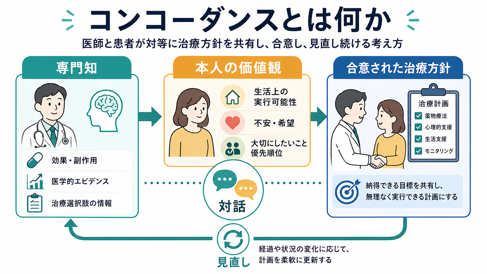
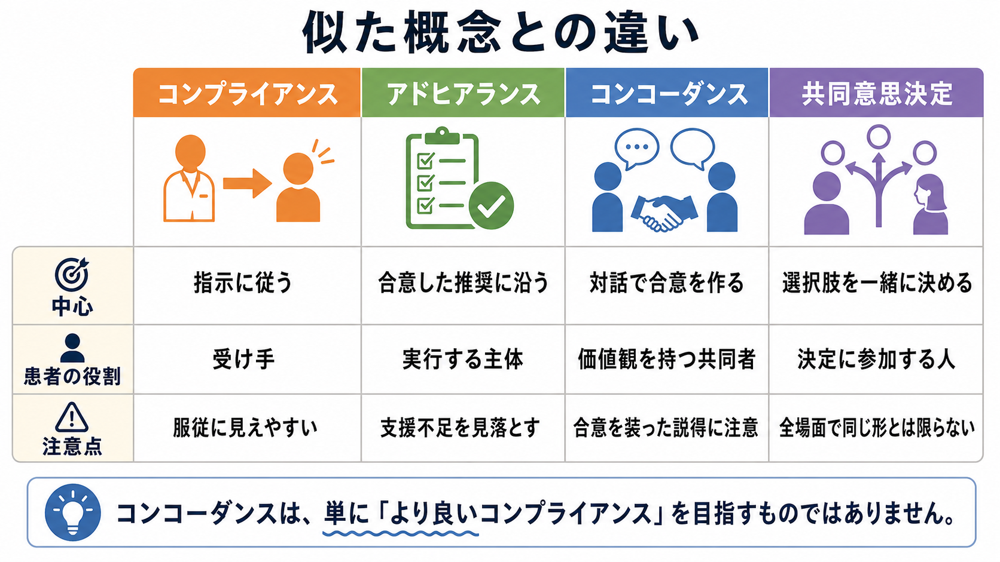

# コンコーダンスとは何か

## 要点

- コンコーダンスとは、医師が治療方針を一方的に指示するのではなく、医師の専門知と患者の価値観・生活条件・不安を突き合わせ、納得できる治療計画を共同で作る考え方である。
- 服薬領域では、コンプライアンスからアドヒアランス、さらにコンコーダンスへという言葉の変化が、患者を「指示に従う人」から「治療方針を共に作る人」へ捉え直す流れを示してきた [1][2]。
- ただし、コンコーダンスは「患者の希望をそのまま通すこと」ではない。効果、副作用、リスク、実行可能性を開示し、同意できる点と合意できない点を明確にする臨床的な対話である [3][5]。
- 精神科では、長期治療、服薬継続、副作用、病識、強制性、家族・支援者の関与が絡むため、コンコーダンスは [[治療関係とは何か]] や [[精神医学における回復とは何か]] と強く接続する。

## この記事で答える問い

1. コンコーダンスは、コンプライアンスやアドヒアランスと何が違うのか。
2. 医師と患者が「対等に合意する」とは、臨床場面で具体的に何を意味するのか。
3. 精神科面接や服薬支援では、コンコーダンスをどのように実装できるのか。
4. コンコーダンスには、どのような限界や誤解があるのか。

## まず結論

コンコーダンスは、「患者に治療を守らせる技術」ではなく、「治療方針がその人の生活と価値観の中で意味を持つように、医師と患者が合意を作るプロセス」である。医師は医学的エビデンス、診断、リスク評価、治療選択肢を提示する。患者は症状の体験、生活上の制約、副作用への不安、希望、優先順位を提示する。両者はそれらを対話の中で照合し、実行できる治療方針を決める。

この意味で、コンコーダンスは [[インフォームドコンセントとは何か]] の延長にある。説明と同意が「治療を受けるかどうか」の倫理的条件を整えるのに対して、コンコーダンスは「治療をどのように続け、調整し、見直すか」を扱う。特に慢性疾患や精神疾患では、治療は一回の同意で終わらず、生活の中で何度も再交渉される。

## 背景

医療では長く、患者が医師の指示にどれだけ従うかを「コンプライアンス」と呼んできた。この言葉は、医師の処方や指示を正解とし、患者の行動を従属的に評価しやすい。服薬しない患者は「不遵守」とされ、なぜ飲めないのか、何を心配しているのか、生活上どこで詰まるのかが見えにくくなる。

その後、アドヒアランスという語が広がった。NICE はアドヒアランスを、患者の行動が「合意された推奨」と一致する程度として整理している [3]。この定義では、少なくとも医師の一方的指示ではなく、合意が前提になる。しかし実践上は、アドヒアランスも「結局、薬を飲んだかどうか」の評価に寄りやすい。

コンコーダンスは、この問題をさらに一歩進める。Horne らの報告は、コンコーダンス、アドヒアランス、コンプライアンスの違いを整理し、治療者と患者の相互作用、患者の信念、医療者のコミュニケーションを重視した [1]。また、コンコーダンスはコンプライアンスやアドヒアランスと同義ではない、という批判的整理もなされている [2]。中心にあるのは、服薬行動そのものよりも、治療方針をめぐる関係と合意の質である。

WHO も長期治療のアドヒアランスを、患者だけの問題ではなく、社会経済的要因、医療チーム・医療制度、疾患、治療、患者関連要因が絡む多次元的問題として扱っている [4]。これは、服薬できない理由を「意志の弱さ」に還元しない点で、コンコーダンスの発想と重なる。

## 基本概念

### コンプライアンス、アドヒアランス、コンコーダンス

コンプライアンスは「指示に従う」モデルである。患者の役割は、専門家が決めた方針を実行する受け手になりやすい。急性期で迅速な判断が必要な場面では、明確な指示が重要になることもあるが、長期治療では患者の主体性や生活条件を見落としやすい。

アドヒアランスは「合意した推奨に沿って実行する」モデルである。コンプライアンスより患者の参加を含みやすいが、評価の焦点はなお実行率に置かれやすい。したがって、なぜ実行できたのか、なぜできなかったのかを丁寧に扱わなければ、支援不足が患者責任にすり替わる。

コンコーダンスは「対話で合意を作る」モデルである。医師の専門知と患者の経験知は同じ種類の知識ではないが、どちらも治療方針を作るために必要である。医師は、効果とリスク、代替案、緊急性、医学的限界を説明する。患者は、治療で何を得たいか、何を避けたいか、何なら続けられるかを語る。ここでの合意は、単なる署名や同意ではなく、治療の意味と実行可能性を共同で確認する作業である。

### 共同意思決定との関係

コンコーダンスは、共同意思決定と非常に近い。NICE の共同意思決定ガイドラインは、本人と医療者が協働してケアに関する共同の決定に到達する過程として共同意思決定を定義し、リスク・利益・結果の伝え方、意思決定支援ツール、組織文化への実装を重視している [6]。Elwyn らの three-talk model も、team talk、option talk、decision talk によって、選択肢の存在を共有し、比較し、本人の選好に基づいて決定する流れを示している [5]。

違いをあえて言えば、共同意思決定は「選択肢から何を選ぶか」に焦点を置きやすく、コンコーダンスは特に「その選択をどのように生活の中で続けるか」に焦点を置きやすい。薬物療法では、開始時の選択だけでなく、副作用が出たとき、効果が不十分なとき、飲み忘れが続くとき、妊娠・就労・通学・家族関係が変わるときに、合意を更新する必要がある。

## 仕組み

コンコーダンスは、次の循環として理解できる。

1. 医師が、診断仮説、治療選択肢、期待される効果、よくある副作用、重大なリスクを説明する。
2. 患者が、治療への理解、不安、過去の経験、生活上の制約、優先順位を語る。
3. 両者が、治療の利益と負担を比較し、必要なら選択肢を修正する。
4. 合意した方針を、実行できる単位に落とし込む。
5. 経過、効果、副作用、納得感を見直し、必要に応じて再合意する。

この循環で重要なのは、「合意できないこと」も情報として扱う点である。たとえば、患者が薬を飲みたくないと語ったとき、それを直ちに拒否や抵抗と見なすのではなく、副作用の記憶、依存への不安、スティグマ、費用、眠気による仕事への影響、家族の反対、病気の理解のずれを探索する。これは [[傾聴とは何か]] や [[要約は面接でなぜ重要なのか]] と同じく、治療方針の質を上げるための情報収集でもある。

精神科では、症状そのものが意思決定に影響することがある。抑うつでは悲観性が強まり、躁状態ではリスク評価が甘くなり、精神病症状では被害的解釈が治療不信につながることがある。したがって、コンコーダンスは「いつも同じ対等性で話し合える」と仮定しない。意思決定能力、安全性、緊急性、支援者の関与、法的枠組みを確認しながら、可能な範囲で本人の理解と選好を尊重する。

## 図解

この記事の図は三つの層で整理している。第一に、医師の専門知、本人の価値観、合意された治療方針をつなぐ概念地図である。第二に、必要性の理解、不安・懸念、実行しやすさ、相談、調整、継続という、治療継続を左右する仕組みである。第三に、コンプライアンス、アドヒアランス、コンコーダンス、共同意思決定の違いである。

文章でまとめると、コンコーダンスは次の式に近い。

$$
\text{コンコーダンス}
= \text{医学的情報}
+ \text{本人の価値観}
+ \text{生活上の実行可能性}
+ \text{継続的な見直し}
$$

これは厳密な数式ではない。むしろ、治療方針を「正しい説明」だけで完結させず、本人が生活の中で使える計画に変換するための実用的な見取り図である。

## 臨床・研究との接続

### 精神科面接

[[精神科面接とは何か]] では、診断情報の収集と関係形成が分けられない。コンコーダンスも同じである。患者の語りを聞かずに治療方針を決めると、見かけ上は合理的な処方でも、本人の生活では実行できないことがある。逆に、本人の希望だけを聞いて医学的リスクを曖昧にすると、医療者の責任が果たされない。

したがって精神科面接では、「この薬を飲んでください」だけでなく、「何がよくなることを期待しますか」「何が一番心配ですか」「前に薬で困った経験はありますか」「どの時間帯なら続けやすいですか」「眠気が出たらどの時点で相談しましょうか」といった問いが重要になる。これらは接遇ではなく、治療計画を設計するための臨床情報である。

### 回復志向と服薬管理

重い精神疾患の服薬管理では、コンプライアンスという枠組みだけでは、本人が長期にわたり病気と生活をどう調整するかを捉えにくい。Deegan と Drake は、服薬を単なる遵守ではなく、回復過程の中で利点と不利益を評価する能動的な意思決定として扱い、本人と臨床家という二人の専門家のパートナーシップを強調した [7]。これは [[精神医学における回復とは何か]] の視点とよく合う。

### 研究

研究では、共同意思決定やコンコーダンスは、意思決定への関与、満足度、治療継続、服薬アドヒアランス、治療同盟、生活の質などの指標と関連づけて検討される。重い精神疾患を対象とした共同意思決定介入の系統的レビューでは、意思決定支援ツール、ピア支援、共同ケア計画、危機計画など多様な介入が検討されており、意思決定への関与や一部の治療参加に良い影響を示す可能性がある一方、対象集団やアウトカムが多様で、標準化された評価が今後の課題とされている [8]。

## よくある誤解

### 「患者の言う通りにすること」である

違う。コンコーダンスは、医学的判断を放棄することではない。医師は、効果、副作用、禁忌、緊急性、代替案、治療しない場合のリスクを明確に説明する責任を持つ。そのうえで、患者が何を重視し、何を恐れ、何なら実行できるかを確認する。

### 「合意できれば何でもよい」

違う。合意は重要だが、安全性、倫理、法的責任、意思決定能力の確認を置き換えない。自傷他害リスク、せん妄、重い精神病症状、虐待、身体疾患の見逃しが疑われる場合には、患者の希望を尊重しつつも、必要な評価や保護を優先する場面がある。

### 「アドヒアランスを上げるための説得技術」である

違う。結果として服薬継続が改善する可能性はあるが、目的は患者を説得して同意させることではない。むしろ、飲めない理由、飲みたくない理由、飲む意味が見えない理由を表に出し、治療方針を再設計することである。

### 「時間がある外来でしかできない」

短時間診療でも、全部を一度に扱う必要はない。「一番心配な副作用は何ですか」「続けるうえで困りそうな点は何ですか」「次回、何を基準に見直しましょうか」といった短い問いだけでも、合意の質は変わる。重要なのは、患者の価値観と実行可能性を治療計画の中に入れることである。

## 関連ノート

### 既存ノート

- [[治療関係とは何か]]
- [[精神科面接とは何か]]
- [[傾聴とは何か]]
- [[共感的理解とは何か]]
- [[要約は面接でなぜ重要なのか]]
- [[インフォームドコンセントとは何か]]
- [[精神医学における回復とは何か]]
- [[生物心理社会モデルとは何か]]
- [[主訴はどのように聞くべきか]]

### 今後の作成候補

- 共同意思決定とは何か
- アドヒアランスとは何か
- コンプライアンスとは何か
- 心理教育とは何か
- 服薬支援とは何か
- 意思決定能力とは何か

### MOC更新候補

- `content/00_MOC/` 配下の精神医学、精神科面接、臨床実践、医療コミュニケーション関連 MOC に本記事 `[[コンコーダンスとは何か]]` を追加する。
- 並列ジョブとの競合を避けるため、このタスクでは MOC 本体は更新しない。

## 理解チェック

1. コンコーダンスは、コンプライアンスやアドヒアランスとどの点で異なるか。
2. 「医師と患者が対等に話し合う」とは、医学的責任を放棄することとどう違うか。
3. 精神科の服薬支援で、患者の不安や生活上の制約を確認する質問を三つ挙げられるか。
4. コンコーダンスが治療同盟や回復志向と接続する理由を説明できるか。
5. 緊急性や意思決定能力の問題がある場面で、コンコーダンスをどのように調整すべきか。

## 参考文献

[1] Horne, R., Weinman, J., Barber, N., Elliott, R., & Morgan, M. (2005). *Concordance, adherence and compliance in medicine taking*. National Co-ordinating Centre for NHS Service Delivery and Organisation. https://kclpure.kcl.ac.uk/portal/en/publications/concordabe-adherence-and-compliance-in-medicine-taking

[2] Bell, J. S., Airaksinen, M. S., Lyles, A., Chen, T. F., & Aslani, P. (2007). Concordance is not synonymous with compliance or adherence. *British Journal of Clinical Pharmacology, 64*(5), 710-711. https://doi.org/10.1111/j.1365-2125.2007.02971_1.x

[3] National Institute for Health and Care Excellence. (2009). *Medicines adherence: involving patients in decisions about prescribed medicines and supporting adherence* (CG76). https://www.nice.org.uk/guidance/cg76

[4] World Health Organization. (2003). *Adherence to long-term therapies: evidence for action*. World Health Organization. https://iris.who.int/handle/10665/42682

[5] Elwyn, G., Durand, M. A., Song, J., Aarts, J., Barr, P. J., Berger, Z., et al. (2017). A three-talk model for shared decision making: multistage consultation process. *BMJ, 359*, j4891. https://doi.org/10.1136/bmj.j4891

[6] National Institute for Health and Care Excellence. (2021). *Shared decision making* (NG197). https://www.nice.org.uk/guidance/ng197

[7] Deegan, P. E., & Drake, R. E. (2006). Shared decision making and medication management in the recovery process. *Psychiatric Services, 57*(11), 1636-1639. https://doi.org/10.1176/ps.2006.57.11.1636

[8] Thomas, E. C., Ben-David, S., Treichler, E., Roth, S., Dixon, L. B., Salzer, M., & Zisman-Ilani, Y. (2021). A systematic review of shared decision-making interventions for service users with serious mental illnesses: State of the science and future directions. *Psychiatric Services, 72*(11), 1288-1300. https://doi.org/10.1176/appi.ps.202000429

## 未解決問題

- コンコーダンスを、短時間外来、オンライン診療、多職種チーム、入院治療、強制性を伴う場面でどのように測定・実装するか。
- 患者の希望、家族の希望、医療者のリスク評価がずれるとき、どのように合意形成と安全確保を両立するか。
- 共同意思決定支援ツールやピアサポートが、どの患者群・どの治療選択で最も有効か。

