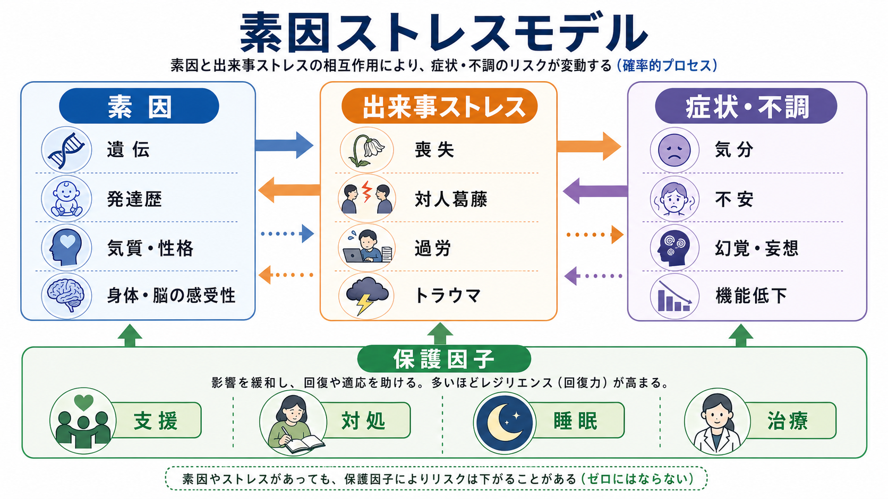
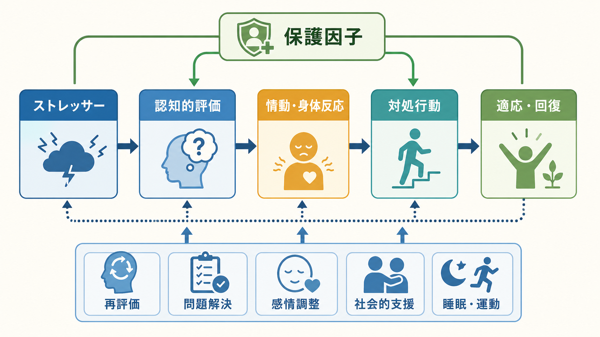
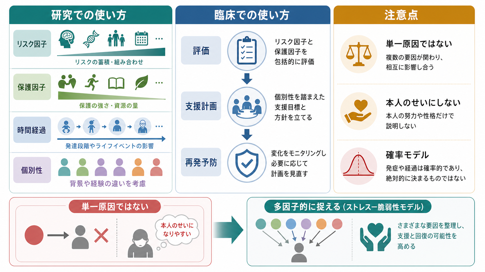

# ストレス脆弱性モデルとは何か

## 要点

- ストレス脆弱性モデルは、精神疾患や症状エピソードを「個体側の脆弱性」と「環境・身体・心理的ストレス」の組み合わせとして理解する枠組みである[1][2]。
- 脆弱性は、遺伝だけではなく、発達歴、神経生物学的特徴、身体疾患、睡眠、認知スタイル、過去の逆境、社会的孤立などを含む。
- ストレスは、重大なライフイベントだけではなく、慢性的な対人緊張、貧困、差別、過労、睡眠不足、身体負荷、日常的な負担の蓄積も含む[3][4]。
- 発症は単純な足し算ではない。保護因子、対処スキル、社会的支援、治療、時間経過によって、同じストレスでも結果は変わりうる。
- このモデルは有用な「ケース理解の地図」だが、個人を診断したり、本人の努力不足として説明したりする道具ではない。

## この記事で答える問い

1. ストレス脆弱性モデルは何を説明するモデルなのか。
2. 「脆弱性」と「ストレス」は、それぞれ何を指すのか。
3. 発症リスク、保護因子、閾値はどのように考えるとよいのか。
4. 研究や臨床の場面で、このモデルをどう使い、どこに限界があるのか。

## まず結論

ストレス脆弱性モデルとは、精神症状の発現を「もともとの弱さ」や「環境のせい」のどちらか一方に還元せず、複数のリスク因子と保護因子が時間の中で組み合わさる過程として捉えるモデルである。統合失調症研究で Zubin と Spring が提案した脆弱性モデルでは、外的・内的な挑戦が危機を起こし、そのストレスの強さと本人の耐性閾値の関係によって、恒常性が保たれる場合もあれば、症状エピソードへ移行する場合もあると考えられた[1]。

この考え方は、[[生物心理社会モデルとは何か]]と相性がよい。生物学的な要因、心理的な評価・対処、社会的環境を別々に並べるだけでなく、「どの要因が、どの時期に、どの経路で、どの症状や生活機能に影響しているのか」を仮説として整理できるからである。ただし、これは教育・研究目的の説明であり、個別の診断や治療方針をこのモデルだけから決めるものではない。

## 背景

精神疾患の説明では、かつて「遺伝か環境か」「脳か心か」「本人の性格か社会環境か」という二分法が使われやすかった。しかし、うつ病、統合失調症、不安症、PTSD、物質使用、摂食障害などの多くは、単一原因で説明しにくい。診断名が同じでも発症経路、症状の出方、経過、回復資源は大きく異なる。これは[[精神疾患とは何か]]を考えるうえでも重要な点である。

ストレス脆弱性モデルは、この複雑さを「すべてが関係する」と曖昧に言うためのものではない。むしろ、リスクを層に分けて整理するための実用的な枠組みである。生活ストレス研究では、ストレス出来事を測るときに、出来事の数だけでなく、持続期間、文脈、本人にとっての意味、出来事が脆弱性によって生じやすくなる可能性まで考える必要があると指摘されてきた[3]。

## 基本概念

### 脆弱性

脆弱性とは、ある条件で症状が出やすくなる個体側・生活史側の傾きである。遺伝的リスク、神経発達、神経伝達、認知スタイル、過去の逆境、身体疾患、睡眠不足、薬物使用、孤立、経済的困難などが含まれる。ここでいう脆弱性は「人格の弱さ」ではない。多くは本人が選んだものではなく、しかも状況によって影響の大きさが変わる。

たとえば統合失調症研究では、遺伝的リスク、発達、ストレス、ドパミン機能の変化が統合的に論じられている[7]。関連して、[[ドパミン仮説は統合失調症をどこまで説明できるのか]]は神経伝達物質の側から、[[HPA軸は精神疾患にどう関わるのか]]はストレス応答系の側から、このモデルの一部を理解する入口になる。

### ストレス

ストレスとは、外界または身体内の負荷に対して、心理・身体システムが調整を迫られる状態である。失業、喪失、対人葛藤、災害、虐待、差別、過重労働のような出来事だけでなく、睡眠不足、疼痛、感染、薬物、生活リズムの乱れもストレスになりうる。

McEwen は、ストレス反応には短期的に保護的な側面がある一方で、慢性的・反復的に動員されると「アロスタティック負荷」として身体と脳に負担を残すと整理した[4]。この観点は、[[ノルアドレナリンは覚醒とストレスにどう関わるのか]]、[[扁桃体回路は情動をどう処理するのか]]、[[海馬萎縮はストレスやうつ病と関係するのか]]とも接続する。

### 閾値と保護因子

モデルの直感的な読み方は、「ストレスが高く、脆弱性も高いと、症状エピソードのリスクが上がる」というものである。ただし、重要なのは閾値が固定値ではない点である。睡眠、安心できる対人関係、治療、問題解決、経済的支援、学校・職場の配慮、身体疾患の管理、意味づけの変化は、負荷を下げたり、耐えられる範囲を広げたりする。

そのため臨床的には、リスク因子を列挙するだけでは不十分である。「何が負荷を増やしているか」と同時に、「何が保護的に働いているか」「どこを変えると全体の循環が変わるか」を見る必要がある。

## 仕組み

ストレス脆弱性モデルの仕組みは、次のように読むと理解しやすい。

1. 遺伝、発達歴、身体状態、過去の経験、認知・情動の傾きが、ある範囲の脆弱性をつくる。
2. 生活上の出来事、慢性的負荷、身体ストレス、社会的孤立が、その時点のストレス水準を上げる。
3. ストレスは、評価・予測・対処行動を通じて増幅または緩和される。
4. HPA軸、自律神経、睡眠、炎症、ドパミン系などの生物学的システムが、短期適応と長期負荷の両方に関わる[4][7]。
5. 保護因子が十分なら、症状が出ても回復しやすく、機能低下が短く済むことがある。
6. 負荷が閾値を超えると、気分症状、不安、幻覚妄想、解離、衝動性、身体症状、生活機能低下などの形で表面化することがある。

この流れは、因果関係を単線的に決める図ではない。症状が出ると睡眠が崩れ、睡眠が崩れると情動調整が難しくなり、それが対人関係や学業・仕事の負荷を増やす、といった循環が起こりうる。したがって、モデルは「最初の原因探し」よりも、「現在の維持要因と介入可能な点を整理する」ために有用である。

## 図解

図1は、脆弱性、ストレス、保護因子の全体像を示している。脆弱性とストレスは発症リスクを高めうるが、保護因子はその影響を緩和する。リスクはゼロか一かではなく、確率的に変化する。

図2は、ストレス刺激から評価・対処、身体反応、アロスタティック負荷、症状エピソードへ至る流れを示す。HPA軸や自律神経の反応は短期的には適応に役立つが、慢性的に高い負荷が続くと睡眠、認知、情動、身体状態に影響しやすい。

図3は、研究と臨床での使い方を整理したものである。研究ではリスク因子、保護因子、時間経過、個別性を仮説化する。臨床では、評価、支援計画、再発予防の補助線になる。ただし、単一原因を決めたり、本人のせいにしたりする使い方は避ける必要がある。

## 臨床・研究との接続

臨床では、ストレス脆弱性モデルはケースフォーミュレーションに使いやすい。診断名の確認に加えて、発症前の脆弱性、直近の誘因、症状を維持している循環、保護因子、支援資源を整理できるからである。これは診断を置き換えるものではなく、診断のあとに「この人にとって何が問題を維持し、何が回復を助けるか」を考えるための枠組みである。

研究では、遺伝環境相互作用の議論と関係が深い。Caspi らは、5-HTTLPR 多型が生活ストレスとうつ病リスクの関係を調整する可能性を報告し、遺伝と環境の相互作用研究に大きな影響を与えた[5]。一方で、その後のメタ分析では、この特定の候補遺伝子相互作用を一貫して支持する証拠は得られないと報告された[6]。したがって、ストレス脆弱性モデルは「特定の遺伝子が原因である」という単純な主張ではなく、複数要因の相互作用を慎重に検証する研究プログラムとして読むべきである。

近年の精神医学研究では、RDoC のように、診断カテゴリだけでなく、脳・行動・遺伝子・環境・発達をまたいで基本的な機能系を調べる枠組みも使われる。NIMH は RDoC を診断ガイドではなく、心理・生物学的システムの機能不全を次元的に理解する研究枠組みとして位置づけている[8]。この意味で、ストレス脆弱性モデルは、診断横断的なリスク理解とも接続しやすい。

## よくある誤解

### 誤解1: 脆弱性が高い人は必ず発症する

発症は確率的であり、保護因子、支援、治療、生活環境、偶然の出来事によって変わる。脆弱性は運命ではない。

### 誤解2: ストレスだけが原因である

ストレスは重要だが、同じストレスでも反応は人によって異なる。身体状態、発達歴、認知、睡眠、社会的支援などが関係する。逆に、ストレスが見えにくい場合でも、身体負荷や慢性的孤立が背景にあることがある。

### 誤解3: 本人の弱さを説明するモデルである

このモデルでいう脆弱性は、道徳的評価ではない。むしろ、本人を責めずに、リスクと保護因子を具体的に見つけるための言葉である。

### 誤解4: 遺伝子と環境の相互作用は簡単に見つかる

候補遺伝子研究の歴史は、魅力的な仮説が大規模研究で再現されないことがあることを示している[5][6]。関連して、研究知見を読むときには[[相関研究で因果を言えないのはなぜか]]も重要になる。

## 関連ノート

- [[生物心理社会モデルとは何か]]
- [[精神疾患とは何か]]
- [[HPA軸は精神疾患にどう関わるのか]]
- [[ノルアドレナリンは覚醒とストレスにどう関わるのか]]
- [[扁桃体回路は情動をどう処理するのか]]
- [[海馬萎縮はストレスやうつ病と関係するのか]]
- [[セロトニン仮説はうつ病をどこまで説明できるのか]]
- [[ドパミン仮説は統合失調症をどこまで説明できるのか]]
- [[相関研究で因果を言えないのはなぜか]]

## MOC更新候補

- [[MOC｜精神医学]]
- [[MOC｜神経科学と精神疾患]]
- [[MOC｜臨床実践・治療]]

## 理解チェック

1. ストレス脆弱性モデルが、単一原因モデルと異なる点は何か。
2. 「脆弱性」は、なぜ本人の性格の弱さとは言えないのか。
3. 保護因子は、発症リスクや再発リスクをどのように変えうるか。
4. 5-HTTLPR とストレスの研究史から、遺伝環境相互作用を読むときの注意点は何か。
5. 臨床でこのモデルを使うとき、診断名とケースフォーミュレーションをどう区別すべきか。

## 未解決問題

- 脆弱性、ストレス、保護因子を、個人レベルでどの程度正確に測定できるか。
- 急性ストレス、慢性ストレス、発達早期の逆境を、同じモデル内でどう区別するか。
- 遺伝子、神経回路、内分泌、睡眠、社会環境を、過剰に単純化せず統合する方法は何か。
- 研究で得られた集団レベルのリスク知見を、個別支援にどこまで使えるか。

## 参考文献

[1] Zubin, J., & Spring, B. (1977). Vulnerability: A new view of schizophrenia. *Journal of Abnormal Psychology*, 86(2), 103-126. https://doi.org/10.1037/0021-843X.86.2.103

[2] Ingram, R. E., & Luxton, D. D. (2005). Vulnerability-stress models. In B. L. Hankin & J. R. Z. Abela (Eds.), *Development of Psychopathology: A Vulnerability-Stress Perspective*. SAGE. https://doi.org/10.4135/9781452231655.n2

[3] Monroe, S. M., & Simons, A. D. (1991). Diathesis-stress theories in the context of life stress research: Implications for the depressive disorders. *Psychological Bulletin*, 110(3), 406-425. https://doi.org/10.1037/0033-2909.110.3.406

[4] McEwen, B. S. (1998). Protective and damaging effects of stress mediators. *New England Journal of Medicine*, 338(3), 171-179. https://doi.org/10.1056/NEJM199801153380307

[5] Caspi, A., Sugden, K., Moffitt, T. E., Taylor, A., Craig, I. W., Harrington, H., McClay, J., Mill, J., Martin, J., Braithwaite, A., & Poulton, R. (2003). Influence of life stress on depression: Moderation by a polymorphism in the 5-HTT gene. *Science*, 301(5631), 386-389. https://doi.org/10.1126/science.1083968

[6] Risch, N., Herrell, R., Lehner, T., Liang, K. Y., Eaves, L., Hoh, J., Griem, A., Kovacs, M., Ott, J., & Merikangas, K. R. (2009). Interaction between the serotonin transporter gene (5-HTTLPR), stressful life events, and risk of depression: A meta-analysis. *JAMA*, 301(23), 2462-2471. https://doi.org/10.1001/jama.2009.878

[7] Howes, O. D., McCutcheon, R., Owen, M. J., & Murray, R. M. (2017). The role of genes, stress, and dopamine in the development of schizophrenia. *Biological Psychiatry*, 81(1), 9-20. https://doi.org/10.1016/j.biopsych.2016.07.014

[8] National Institute of Mental Health. (n.d.). *About RDoC*. https://www.nimh.nih.gov/research/research-funded-by-nimh/rdoc/about-rdoc

