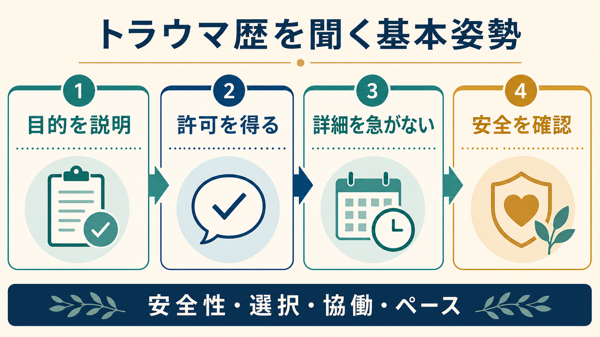
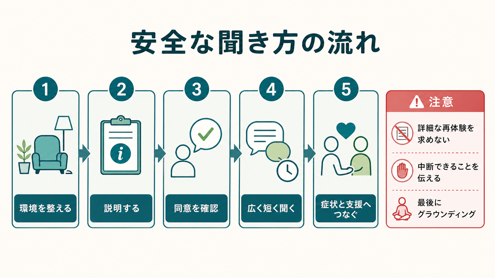

# トラウマ歴はどのように聞くべきか

## 要点

- トラウマ歴を聞く目的は、出来事の詳細を引き出すことではなく、現在の症状、安全、生活機能、支援ニーズ、治療上の配慮を理解することである[1][2]。
- 面接者は、質問の目的、守秘とその限界、答えない権利、中断できることを先に説明する。これは [[精神科面接とは何か]] や [[守秘義務とは何か]] の実践そのものである[1][4]。
- スクリーニングや初期評価では、詳細な再体験を求めず、必要最小限の範囲で「何が起きたか」よりも「今何に影響しているか」を確認する[4]。
- 現在も危険が続いている可能性があれば、自殺リスク、他害、家庭内暴力、虐待、搾取、保護の必要性を優先して評価する[4][6]。
- ACE やトラウマ曝露の有無は集団レベルでは健康リスクと関連するが、単純な点数で個人の予後や治療方針を決めるべきではない[7][8]。

## この記事で答える問い

1. なぜ精神科面接でトラウマ歴を確認する必要があるのか。
2. どの順序で、どの程度まで聞くと安全なのか。
3. トラウマ歴を聞くときに避けるべき対応は何か。
4. 聞いた情報を、診断・リスク評価・支援計画にどう接続するのか。

このノートは教育・研究目的の整理であり、個別の診断や治療指示ではない。実際の面接では、本人の状態、緊急性、年齢、文化的背景、法的保護義務、所属機関の手順に沿って判断する。

## まず結論

トラウマ歴は「聞くべき項目」ではなく、「安全に扱うべき文脈」である。したがって、最初に必要なのは質問票を埋めることではなく、本人が話せる条件を整えることである。具体的には、目的を説明し、許可を得て、広く短く聞き、現在の影響と安全を確認し、最後に要約して支援につなぐ。

たとえば、初回面接では次のように始められる。

> これから、これまでのつらい出来事や安全に関わる経験について、今の症状や支援を考えるために少し確認します。詳しく話す必要はありません。答えたくない質問は飛ばせますし、途中で止めても大丈夫です。

この一文には、目的、選択、ペース、安全の四つが含まれる。SAMHSA のトラウマインフォームド・アプローチも、安全、信頼、協働、エンパワメント、選択、文化的・歴史的背景への配慮を中核に置く[1]。つまりトラウマ歴の聴取は、[[ラポールはどのように形成されるのか|ラポール]]、[[共同意思決定とは何か|共同意思決定]]、[[支持的面接とは何か|支持的面接]]と切り離せない。

## 背景

成人精神医学的評価では、気分、不安、思考、知覚、認知、治療歴などと並んで、トラウマ歴を確認することが推奨されている[2]。これは、トラウマ曝露が PTSD だけでなく、抑うつ、不安、物質使用、身体症状、睡眠、対人関係、医療場面への不信に影響しうるからである[3][4]。

NICE の PTSD ガイドラインは、再体験、回避、過覚醒、解離、否定的認知や気分、機能障害を評価し、症状がある場合には過去の外傷的出来事について具体例を示しながら確認することを勧めている[3]。一方で、VA National Center for PTSD は、一般医療場面で陽性スクリーニングが出た場合でも、適切な訓練と役割がない限り、詳細なトラウマ叙述を引き出したり、本人の語りに挑戦したりしないよう注意している[4]。

この二つは矛盾しない。臨床評価ではトラウマを見落とさない必要があるが、評価の名目で本人を再外傷化してはいけない。必要なのは「聞かない配慮」ではなく、「安全に、目的を明確にして、必要な範囲だけ聞く配慮」である。

## 基本概念

### トラウマ歴

トラウマ歴とは、生命・身体・尊厳・安全感を脅かす出来事への曝露歴である。事故、災害、暴力、性被害、虐待、家庭内暴力、医療外傷、戦争、拷問、突然の喪失、慢性的な支配や搾取などが含まれうる[3]。ただし、出来事の種類だけで臨床的意味は決まらない。重要なのは、本人がどのように経験し、現在の症状、身体反応、対人関係、医療アクセス、生活機能にどう影響しているかである。

### トラウマインフォームドな聞き方

トラウマインフォームドな聞き方は、「何が起きたのか」を詰問する姿勢ではなく、「何が起きた可能性があり、今どのような配慮が必要か」を理解する姿勢である。SAMHSA は、トラウマの広範な影響を理解し、徴候を認識し、制度・手続き・実践に知識を組み込み、再外傷化を避けることを重視している[1]。

面接の言葉に直すと、次のようになる。

| 面接上の原則 | 実際のふるまい |
|---|---|
| 安全性 | 個室、同席者、時間、退出や中断の可否を確認する |
| 信頼性 | 何のために聞くか、記録と共有範囲を説明する |
| 選択 | 答えない権利、後日に回す選択肢を明示する |
| 協働 | 本人が扱える深さと順序を一緒に決める |
| エンパワメント | 生き延びてきた力、対処、支援資源にも目を向ける |
| 文化的配慮 | 恥、家族、宗教、移民経験、差別、ジェンダーを単純化しない |

### スクリーニングと臨床面接

トラウマ曝露の確認には、Trauma History Screen や Trauma History Questionnaire のような自己記入式尺度がある[5]。尺度は、曝露の有無や種類を広く把握する助けになる。一方で、尺度の項目に丸を付けることと、本人が安全に語れることは同じではない。尺度を使う場合も、目的、任意性、結果の扱い、陽性時の支援経路を先に説明する必要がある[4][5]。

## 仕組み

トラウマ歴の聴取で再外傷化が起こりやすいのは、面接者が「情報を取る」ことに集中し、本人の身体反応、恥、恐怖、解離、支配されている感覚を見落とすときである。過去の出来事を詳しく語ることは、本人にとって記憶の再生ではなく、身体感覚や情動の再体験になることがある。

したがって、面接の仕組みは次の順序で考えるとよい。

1. 環境を整える。個室、同席者、通訳、録音・記録、退室可能性を確認する。
2. 説明する。なぜ聞くのか、何を聞くのか、どこまで記録するのかを述べる。
3. 同意を確認する。「今少し確認してよいですか」と許可を取る。
4. 広く短く聞く。出来事の詳細より、種類、時期、現在の影響、安全を確認する。
5. 支援へつなぐ。症状、リスク、保護、治療選択、社会資源を整理する。
6. 終了時に整える。要約、訂正の機会、今の気分、帰宅後の安全、次回扱う範囲を確認する。

この流れは、[[開かれた質問と閉じた質問はどう使い分けるのか|開かれた質問と閉じた質問]]の使い分けでもある。入口では「これまでの経験で、今の体調や気分に影響しているかもしれないことはありますか」と広く聞き、必要に応じて「命の危険を感じる出来事」「望まない性的経験」「家で安全でない経験」「子どもの頃の暴力やネグレクト」「災害や事故」「医療処置でつらかった経験」などを短く例示する。安全確認では、「今も続いていますか」「今日帰る場所は安全ですか」「その人と同居していますか」のように具体化する。

## 図解

図 1 は、トラウマ歴聴取の全体像を「目的を説明、許可を得る、詳細を急がない、安全を確認」に圧縮したものである。図 2 は、面接の実際の流れを「環境、説明、同意、短い確認、支援接続」として示している。

この二つの図で重要なのは、トラウマ歴の評価を「過去の出来事の発掘」ではなく「現在の安全と支援の設計」として見る点である。過去を詳しく聞かなくても、現在のフラッシュバック、悪夢、回避、過覚醒、解離、羞恥、自責、対人不信、医療手続きへの恐怖は評価できる[3][4]。逆に、出来事の詳細を多く聞いても、安全や支援につながらなければ臨床的価値は低い。

## 臨床・研究との接続

### 診断との接続

PTSD や複雑性 PTSD を疑う場合、出来事への曝露、再体験、回避、過覚醒、否定的認知・気分、解離、機能障害、併存症を整理する[3]。ただし、トラウマ曝露があることは PTSD の診断そのものではない。曝露後に症状が自然に軽快する人も多く、症状の種類、持続、生活障害、文化的文脈を合わせて評価する必要がある[4]。

診断面接では、[[鑑別診断とは何か|鑑別診断]]も重要である。不眠、過覚醒、集中困難、怒り、身体症状は、PTSD 以外にも、うつ病、不安症、双極症、物質使用、疼痛、睡眠障害、発達特性、身体疾患で見られる。[[生物心理社会モデルとは何か|生物心理社会モデル]]の視点で、身体、心理、社会、文化、制度を合わせて見る。

### リスク評価との接続

トラウマ歴を聞いたら、現在の安全を必ず確認する。自殺念慮、自傷、他害、希死念慮、家庭内暴力、性暴力、児童虐待、高齢者虐待、障害者虐待、ストーカー、住居喪失、搾取が疑われる場合は、通常の心理教育よりも安全計画と連携が優先される[4][6]。ここでは [[自殺リスク評価では何を聞くべきか]] と [[虐待リスクを精神科でどう評価するか]] が直接関係する。

WHO の親密なパートナー暴力・性暴力への対応ガイドラインは、女性中心のケアと一次的支援を重視し、LIVES、すなわち傾聴、ニーズ確認、妥当化、安全強化、支援接続を示している[6]。この枠組みは、暴力被害の詳細を追及する前に、本人の安全、選択、支援資源を確認する点で、精神科面接にも応用できる。

### 研究との接続

ACE 研究は、子ども時代の虐待や家庭機能不全の累積が、成人期の健康リスクと段階的に関連することを示した代表的研究である[8]。この知見は、逆境体験を個人の性格や意志の問題に還元せず、長期的な健康の文脈で理解する上で重要である。関連して [[逆境的小児期体験ACEとは何か]]、[[トラウマは発達にどう影響するのか]]、[[PTSDでは恐怖記憶ネットワークに何が起きているのか]] も参照できる。

ただし、近年のレビューは ACE スクリーニングについて、実施すれば必ず利益があるとは限らず、アウトカム改善の証拠、支援資源、倫理的配慮、潜在的害を検討すべきだと指摘している[7]。したがって、研究では集団レベルのリスク指標として扱い、臨床では個別の意味、保護因子、現在の支援可能性を中心に解釈する必要がある。

## 実際の聞き方

### 導入

導入では、面接者の都合ではなく本人の安全を優先する。

- 「今後の支援を考えるために、これまでのつらい出来事が今に影響しているかを少し確認してもよいですか。」
- 「詳しい内容は話さなくて大丈夫です。答えにくいものは飛ばせます。」
- 「もし途中でしんどくなったら、止めたり、別の話題に戻したりできます。」

この段階で本人が拒否した場合、それ自体を尊重する。拒否は「抵抗」ではなく、今の時点では安全でない、言葉にする準備がない、以前の支援で傷ついた、同席者がいる、記録が怖いなどの情報かもしれない。

### 初期確認

初期確認では、詳細ではなくカテゴリと現在の影響を聞く。

- 「命の危険を感じるような出来事を経験したことがありますか。」
- 「子どもの頃や大人になってから、家や学校、職場、人間関係で安全でないと感じた経験はありますか。」
- 「望まない性的な経験や、断れない状況での経験が影響していることはありますか。」
- 「その出来事が、今の睡眠、気分、身体反応、人間関係、医療への不安に影響している感じはありますか。」

本人が話し始めたら、[[傾聴とは何か|傾聴]]と [[要約は面接でなぜ重要なのか|要約]]を使い、必要以上に掘り下げない。「それは何年ごろのことですか」「今も続いていますか」「今いちばん困っている影響は何ですか」のように、現在の支援につながる範囲へ戻す。

### 安全確認

安全確認は、曖昧にせず具体的に聞く。

- 「その危険は今も続いていますか。」
- 「今日、帰る場所は安全ですか。」
- 「その人と今も会う必要がありますか。」
- 「自分を傷つけたい気持ちや、消えてしまいたい気持ちはありますか。」
- 「子ども、高齢者、障害のある方など、今すぐ守る必要がある人はいますか。」

守秘義務には限界がある。児童虐待、差し迫った自傷他害、保護を要する虐待などでは、本人の同意だけで完結しない対応が必要になる場合がある。だからこそ、聞く前に「安全に関わる場合は、守るために他職種や関係機関と相談することがあります」と説明しておく。

### 終了

トラウマ歴を扱った面接は、終わり方が重要である。最後に、内容の要約、訂正の機会、今の状態、帰宅後の過ごし方、次に扱う範囲を確認する。

- 「今日は、詳しい出来事ではなく、今の睡眠と安全に影響している点を確認しました。」
- 「私の理解で違っているところはありますか。」
- 「今この場で、気持ちや身体の反応はどうですか。」
- 「この後、少し落ち着くためにできることはありますか。」
- 「次回は、必要なら支援先や症状への対応を一緒に整理しましょう。」

## よくある誤解

### 「トラウマ歴は詳しく聞くほどよい」

詳しい叙述は、治療や専門的評価の文脈では役立つことがある。しかし、初期面接やスクリーニングで詳細を急ぐと、再体験、解離、羞恥、不信を強めることがある[4]。聞く深さは、目的、本人の同意、面接者の役割、支援につながる見通しによって決める。

### 「聞くと悪化するから避けた方がよい」

聞き方が悪ければ有害になりうるが、まったく聞かないこともリスクである。現在の暴力、虐待、自殺リスク、医療手続きへの恐怖、PTSD 症状が見落とされると、安全確保や治療選択が遅れる。必要なのは、避けることではなく、説明、許可、ペース、安全確認を伴って聞くことである[3][4]。

### 「ACE スコアで個人のリスクが決まる」

ACE スコアは集団レベルの関連を示す研究指標として有用だが、個人の将来や治療方針を機械的に決めるものではない[7][8]。保護因子、現在の関係性、社会資源、身体疾患、文化的背景、本人の意味づけを合わせて見る必要がある。

### 「泣かないなら大丈夫」

トラウマの反応は、涙だけで表れるわけではない。淡々と話す、笑う、話題を変える、身体感覚が鈍くなる、記憶が断片的になる、急に眠くなる、過剰に説明する、面接者を試すように見えるなど、多様な形を取る。面接者は反応の有無で苦痛を判定せず、本人のペースを確認する。

## 関連ノート

- [[精神科面接とは何か]]
- [[ラポールはどのように形成されるのか]]
- [[開かれた質問と閉じた質問はどう使い分けるのか]]
- [[守秘義務とは何か]]
- [[自殺リスク評価では何を聞くべきか]]
- [[虐待リスクを精神科でどう評価するか]]
- [[逆境的小児期体験ACEとは何か]]
- [[トラウマは発達にどう影響するのか]]
- [[PTSDでは恐怖記憶ネットワークに何が起きているのか]]
- [[生物心理社会モデルとは何か]]

MOC 更新候補: `content/00_MOC/` 配下の精神医学、臨床面接、PTSD/トラウマ、発達・逆境体験関連 MOC に、本記事を「面接での安全な評価」または「トラウマインフォームドケア」項目として追加する。

## 理解チェック

1. トラウマ歴を聞く前に、本人へ説明すべきことを 4 つ挙げられるか。
2. 「詳細を聞くこと」と「現在の影響を評価すること」の違いを説明できるか。
3. トラウマ歴を聞いた後、必ず確認すべき安全項目は何か。
4. ACE スコアを個人の診断や予後判定として使うことの問題点を説明できるか。
5. 本人が話したくないと言ったとき、面接者はどのように応答できるか。

## 未解決問題

- 一般精神科外来で、どの時点・どの深さでトラウマ歴を標準的に確認するのが最も安全で有用か。
- ACE やトラウマ曝露のスクリーニングが、支援接続や症状改善にどの程度寄与するか。
- 文化、ジェンダー、移民経験、障害、年齢によって、トラウマ歴の語りやすさと安全配慮はどう変わるか。
- 電子問診、オンライン診療、AI 支援面接でトラウマ歴を扱う場合、説明・同意・安全確認をどう実装するか。

## 参考文献

[1] Substance Abuse and Mental Health Services Administration. (2024). *Trauma-Informed Approaches and Programs*. https://www.samhsa.gov/mental-health/trauma-violence/trauma-informed-approaches-programs

[2] Silverman, J. J., Galanter, M., Jackson-Triche, M., Jacobs, D. G., Lomax, J. W., Riba, M. B., Tong, L. D., Watkins, K. E., Fochtmann, L. J., Rhoads, R. S., Yager, J., & American Psychiatric Association. (2015). The American Psychiatric Association practice guidelines for the psychiatric evaluation of adults. *American Journal of Psychiatry, 172*(8), 798-802. https://doi.org/10.1176/appi.ajp.2015.1720501

[3] National Institute for Health and Care Excellence. (2018). *Post-traumatic stress disorder: NICE guideline NG116*. https://www.nice.org.uk/guidance/ng116/chapter/1-Recommendations

[4] VA National Center for PTSD. (2025). *PTSD Screening and Referral: For Health Care Providers*. https://www.ptsd.va.gov/professional/treat/care/screening_referral.asp

[5] Carlson, E. B., Smith, S. R., Palmieri, P. A., Dalenberg, C. J., Ruzek, J. I., Kimerling, R., Burling, T. A., & Spain, D. A. (2011). Development and validation of a brief self-report measure of trauma exposure: The Trauma History Screen. *Psychological Assessment, 23*(2), 463-477. https://doi.org/10.1037/a0022294

[6] World Health Organization. (2013). *Responding to intimate partner violence and sexual violence against women: WHO clinical and policy guidelines*. https://www.who.int/publications/i/item/9789241548595

[7] Austin, A. E., Anderson, K. N., Goodson, M., & Bacon, S. (2024). Screening for adverse childhood experiences: A critical appraisal. *Pediatrics, 154*(6), e2024067307. https://doi.org/10.1542/peds.2024-067307

[8] Felitti, V. J., Anda, R. F., Nordenberg, D., Williamson, D. F., Spitz, A. M., Edwards, V., Koss, M. P., & Marks, J. S. (1998). Relationship of childhood abuse and household dysfunction to many of the leading causes of death in adults: The Adverse Childhood Experiences Study. *American Journal of Preventive Medicine, 14*(4), 245-258. https://doi.org/10.1016/S0749-3797(98)00017-8
