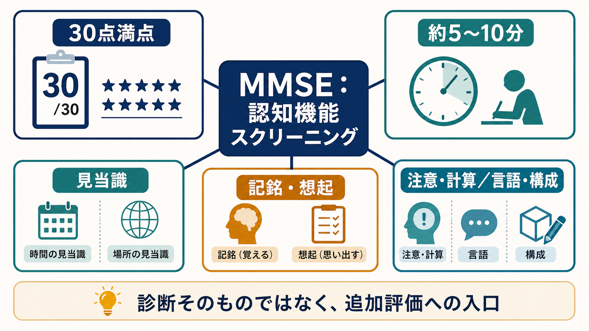
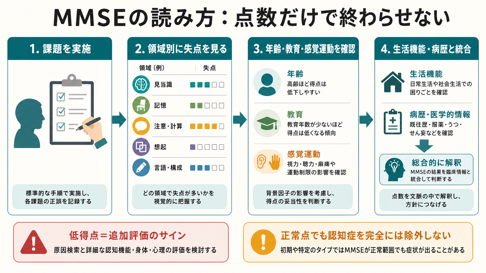
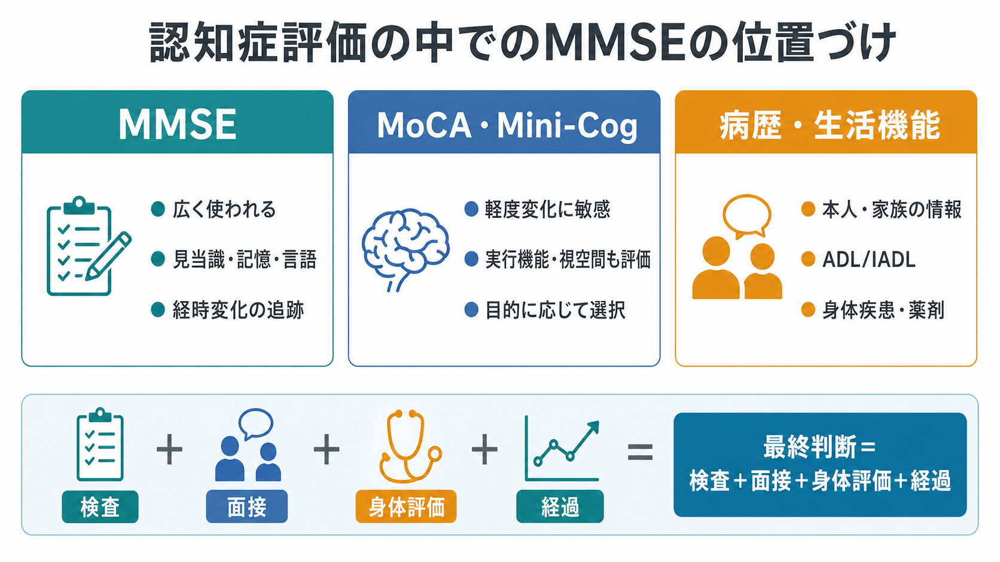

# ミニ精神状態検査MMSEとは何か

## 要点

- ミニ精神状態検査 MMSE（Mini-Mental State Examination）は、認知機能低下の可能性を短時間で把握するための代表的な認知機能スクリーニング検査である[1]。
- 30点満点で、見当識、記銘、注意・計算、想起、言語、視空間的構成などを広く見る。ただし、詳細な神経心理検査や認知症診断そのものを置き換えるものではない[1][2]。
- 点数は年齢、教育歴、言語、文化、感覚障害、運動障害、せん妄、うつ状態、検査状況の影響を受ける。したがって単独のカットオフで判断せず、病歴・生活機能・身体疾患・薬剤・経過と統合して読む[3][4]。
- MMSEは研究では群の記述や経時変化の指標として便利だが、軽度認知障害や実行機能障害には感度が十分でないことがある[2][5]。

## この記事で答える問い

1. MMSEは何を測る検査なのか。
2. 30点満点の内訳を、臨床的にはどう理解すればよいのか。
3. 低得点や正常範囲の点数を、どこまで認知症評価に使えるのか。
4. [[認知機能検査は何を測っているのか]]、[[認知機能低下はどのように評価するのか]]、[[精神状態診察MSEとは何か]]とどのように接続するのか。

## まず結論

MMSEは「認知症かどうかを決める検査」ではなく、「認知機能のどの領域に、追加評価が必要そうな失点があるかを短時間で見る検査」である。30点満点という単純な形式のため、経時変化や研究データの比較に使いやすい。一方で、正常点でも本人や家族が明らかな生活上の変化を訴える場合、あるいは実行機能・社会的認知・複雑な注意の障害が疑われる場合には、MMSEだけで「問題なし」とは言えない[2][6]。

臨床で重要なのは総点だけではない。どの領域で失点したか、本人の教育歴や母語、聴力・視力、手指運動、疲労、緊張、抑うつ、せん妄の可能性がどう影響したかを読み解く必要がある。検査は[[鑑別診断とは何か]]の入口であり、診断の出口ではない。

## 背景

MMSEは1975年にFolsteinらが、臨床家がベッドサイドで認知状態を構造化して把握できる方法として提案した[1]。それ以前にも精神状態の診察は行われていたが、検査者ごとの聞き方や記録の差が大きく、比較可能な短時間検査が求められていた。MMSEは短く、採点が明確で、多くの研究で用いられたため、認知症評価の共通語として広く普及した。

ただし、普及の広さは万能性を意味しない。Cochraneレビューは、MMSEが認知症診断に寄与する一方で、単独で疾患を確定したり除外したりすべきではないと整理している[2]。USPSTFも、認知機能スクリーニング検査はMCIや認知症を直接診断するためのものではなく、陽性の場合には血液検査、画像検査、医学的・神経心理学的評価などへ進む必要があると述べている[6]。

## 基本概念

### 何を評価するのか

MMSEは、短時間で複数の認知領域を横断的に観察する。代表的には、時間や場所に関する見当識、新しい情報を一時的に保持する記銘、注意と計算、遅延後の想起、呼称や復唱を含む言語、指示理解、書字、視空間的構成などが含まれる[1][6]。これらは[[精神状態診察MSEとは何か]]の「認知」領域を、より標準化された課題として切り出したものと考えると理解しやすい。

この検査で見ているのは、脳の単一部位ではなく、複数の認知過程の働きである。たとえば記憶課題の失点には、記銘そのものの障害だけでなく、注意低下、聴力低下、理解困難、不安、疲労、言語背景の違いも入り込む。したがって、失点をそのまま「海馬障害」や「認知症」と読み替えるのは粗い。

### 30点満点の意味

MMSEは30点満点で表されるため、しばしば「24点未満なら認知症疑い」のように説明される。しかし、カットオフ値は検査目的、対象集団、有病率、年齢、教育歴で変わる。地域住民を対象にした標準値研究では、MMSE得点は年齢が高いほど、教育年数が短いほど低くなる傾向が示されている[4]。そのため、同じ23点でも、読み方は本人の背景によって変わる。

点数の使い方は、血液検査の単一値よりも「認知機能の要約指標」に近い。総点、領域別失点、前回からの変化、日常生活上の変化、検査時の状態を組み合わせて解釈する。

## 仕組み

### 実施から解釈まで

MMSEの実施では、検査者が標準化された手順で短い課題を提示し、反応を点数化する。ここで重要なのは、採点が終わった瞬間に判断が完了するわけではないという点である。

1. 課題への反応を標準化して記録する。
2. 総点と領域別失点を確認する。
3. 年齢、教育歴、母語、視聴覚、運動機能、疲労、情動状態を確認する。
4. 本人・家族からの病歴、ADL/IADL、薬剤、身体疾患、[[認知機能低下はどのように評価するのか|認知機能低下の経過]]と統合する。
5. 必要に応じて詳細な神経心理検査、画像、血液検査、専門医評価につなぐ。

### なぜ総点だけでは不十分か

総点は便利だが、異なる認知プロフィールを同じ点数にまとめてしまう。たとえば、見当識と遅延想起で失点する人、注意課題で大きく失点する人、言語や構成課題で失点する人は、同じ総点でも疑う背景が異なる。前者ではアルツハイマー型の記憶障害、後者ではせん妄、抑うつ、薬剤、脳血管障害、失語、視空間障害など、別の仮説が必要になる。

また、MMSEは前頭葉実行機能、処理速度、複雑な注意、社会的認知の評価としては十分でないことがある。軽度認知障害や高学歴者の早期変化では、MMSEが正常範囲に残ることもある[5][6]。この場合、MoCA、時計描画、遂行機能課題、情報提供者からの評価、生活機能評価などを併用する。

## 図解

図1は、MMSEを「30点満点の検査」としてだけでなく、認知症評価への入口として見るための全体像である。中心にあるのはスクリーニングであり、周囲に見当識、記憶、注意、言語、構成、背景因子が並ぶ。

図2は、MMSEの実施から解釈までの流れを示す。点数を出すだけでなく、領域別失点と背景因子を確認し、病歴・生活機能と統合する必要がある。

図3は、MMSEと他の認知症評価情報の位置づけを示す。検査、面接、生活機能、身体評価、経過観察は競合するものではなく、互いに補い合う。

## 臨床・研究との接続

### 臨床での使い方

臨床では、MMSEは次のような場面で役立つ。

- 認知機能低下の有無を短時間で見積もる。
- 認知領域ごとの失点パターンから追加評価の方向を立てる。
- 診療録上、経時的変化を比較しやすい形で残す。
- 家族説明や多職種共有で、現在の認知状態を共通言語にする。

ただし、認知症診断では本人の訴えだけでなく、家族や支援者から見た変化、ADL/IADL、身体疾患、薬剤、睡眠、気分、せん妄、感覚障害、文化・教育背景を確認する必要がある[6][7]。MMSEはこの評価の一部であり、[[認知機能検査は何を測っているのか]]や[[鑑別診断とは何か]]で扱う広い判断過程に組み込まれる。

### 研究での使い方

研究では、MMSEは対象者の認知状態を記述したり、群間差や経時変化を示したりする指標として使われる。多数の研究で用いられてきたため、先行研究との比較がしやすい。一方で、天井効果、教育歴の影響、練習効果、軽度変化への感度の限界がある。介入研究でMMSEが0.5〜1点変化したとしても、それが本人の日常生活上どの程度意味を持つかは別に検討する必要がある[6]。

## よくある誤解

### 誤解1：MMSEが低ければ認知症である

低得点は重要なサインだが、認知症だけを意味しない。せん妄、うつ状態、睡眠不足、薬剤、アルコール、感染、代謝異常、疼痛、不安、聴力・視力の問題、言語理解の問題でも得点は下がる。低得点のときほど、可逆的要因と身体疾患を丁寧に探す必要がある。

### 誤解2：MMSEが正常なら認知症ではない

正常範囲の点数でも、初期の認知症、軽度認知障害、高学歴者の微細な低下、実行機能障害が隠れることがある。本人や家族が「以前と違う」と述べ、生活上のミスや仕事・家事の変化が明確なら、MMSEだけで終了しない。

### 誤解3：カットオフはどの人にも同じ意味を持つ

カットオフは便利な目安だが、背景から独立した絶対線ではない。年齢と教育歴で得点分布が変わることは大規模標準値研究で示されている[4]。臨床判断では、数値を背景に戻して読む必要がある。

### 誤解4：MMSEは詳細な神経心理検査である

MMSEは短時間のスクリーニングであり、詳細な認知プロフィールを描く検査ではない。失語、注意障害、実行機能障害、視空間障害、記憶障害を精密に分けるには、目的に合った追加検査が必要になる。

## 関連ノート

既存ノートとしては、[[精神状態診察MSEとは何か]]、[[認知機能検査は何を測っているのか]]、[[認知機能低下はどのように評価するのか]]、[[鑑別診断とは何か]]と接続しやすい。今後の作成候補としては、MoCA、Mini-Cog、時計描画検査、CDR、ADL/IADL評価、せん妄と認知症の鑑別、アルツハイマー型認知症の評価がある。

MOC更新候補: `content/00_MOC/` 配下の精神医学、認知機能、老年精神医学、神経心理評価に関するMOC。

## 理解チェック

1. MMSEの総点だけで認知症診断を確定してはいけない理由を、背景因子と鑑別診断の観点から説明できるか。
2. 同じ23点でも、年齢・教育歴・検査状況によって解釈が変わる理由を説明できるか。
3. MMSEが正常範囲でも追加評価を考えるべき状況を3つ挙げられるか。
4. MMSE、MoCA、生活機能評価、家族からの情報がそれぞれ何を補うのか説明できるか。

## 未解決問題

- 日本語版MMSEのカットオフや標準値は、年齢、教育歴、地域、言語背景、感覚障害をどこまで補正すべきか。
- MMSEの経時変化を、本人にとって意味のある生活機能変化へどう翻訳するか。
- デジタル認知評価や日常行動データが普及したとき、MMSEの役割はスクリーニング、研究比較、経過観察のどこに残るか。

## 参考文献

[1] Folstein MF, Folstein SE, McHugh PR. (1975). "Mini-mental state": A practical method for grading the cognitive state of patients for the clinician. *Journal of Psychiatric Research*, 12(3), 189-198. https://doi.org/10.1016/0022-3956(75)90026-6

[2] Creavin ST, Wisniewski S, Noel-Storr AH, et al. (2016). Mini-Mental State Examination (MMSE) for the detection of dementia in clinically unevaluated people aged 65 and over in community and primary care populations. *Cochrane Database of Systematic Reviews*, CD011145. https://doi.org/10.1002/14651858.CD011145.pub2

[3] Tombaugh TN, McIntyre NJ. (1992). The Mini-Mental State Examination: A comprehensive review. *Journal of the American Geriatrics Society*, 40(9), 922-935. https://doi.org/10.1111/j.1532-5415.1992.tb01992.x

[4] Crum RM, Anthony JC, Bassett SS, Folstein MF. (1993). Population-based norms for the Mini-Mental State Examination by age and educational level. *JAMA*, 269(18), 2386-2391. https://doi.org/10.1001/jama.1993.03500180078038

[5] Lopez MN, Charter RA, Mostafavi B, Nibut LP, Smith WE. (2005). Psychometric properties of the Folstein Mini-Mental State Examination. *Assessment*, 12(2), 137-144. https://doi.org/10.1177/1073191105275412

[6] US Preventive Services Task Force. (2020). Screening for Cognitive Impairment in Older Adults: US Preventive Services Task Force Recommendation Statement. *JAMA*, 323(8), 757-763. https://doi.org/10.1001/jama.2020.0435

[7] Alzheimer's Association. Cognitive Assessment Tools. https://www.alz.org/professionals/health-systems-medical-professionals/clinical-resources/cognitive-assessment-tools
