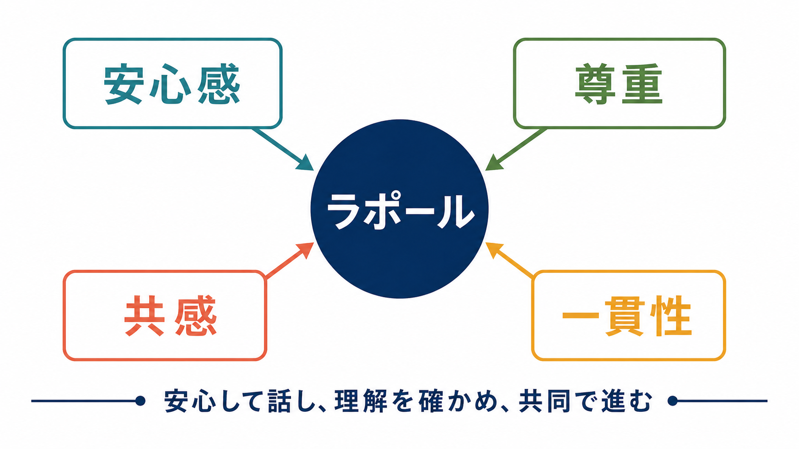
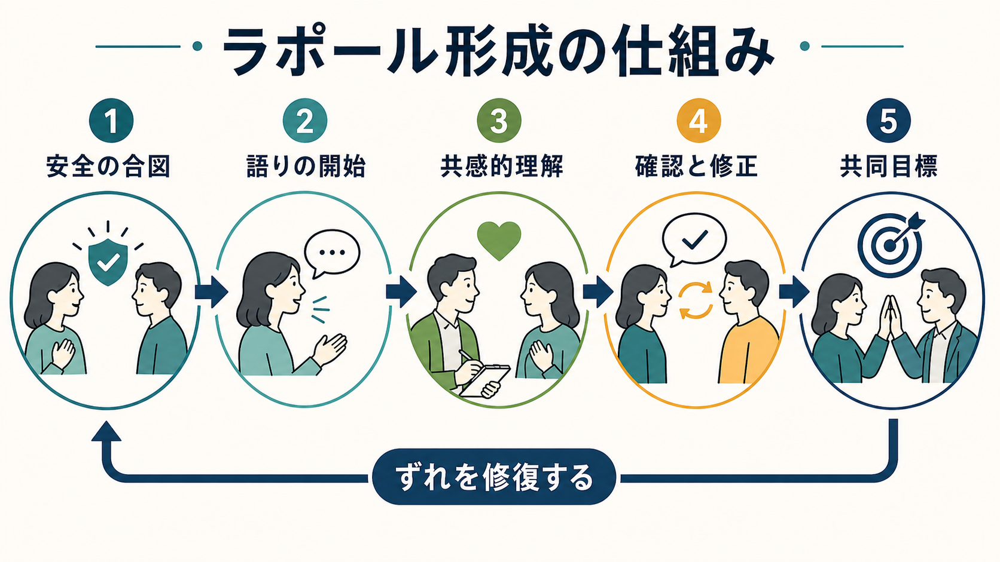
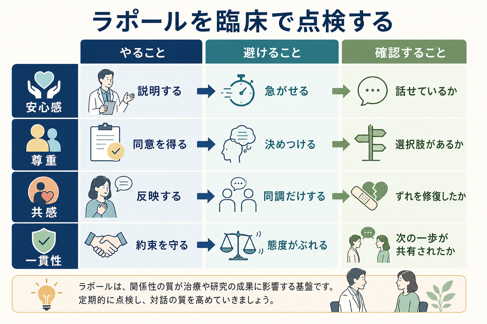

# ラポールはどのように形成されるのか

## 要点

- ラポールは「感じのよさ」だけではなく、本人が安全に話せ、面接者が理解を確かめ、双方が次の一歩を共有できる関係の質である。
- 中核は、安心感、尊重、共感、一貫性である。これらは態度だけでなく、説明、守秘、境界、確認、約束を守ることとして観察できる。
- 心理療法研究では、治療同盟は目標、課題、情緒的な結びつきから成る作業関係として整理され、転帰とも関連する[1][3]。
- ラポールは初回面接で完成するものではない。誤解、沈黙、抵抗、怒り、不信が出たときに、ずれを見つけて修復する過程で強くなる[5]。
- 医療・精神医学の面接では、ラポール形成は診断や治療指示そのものではなく、評価、説明、共同意思決定、継続支援を可能にする土台である。

## この記事で答える問い

1. ラポールは何によって生まれるのか。
2. 共感、尊重、安心感、一貫性は、面接中のどの行動として現れるのか。
3. ラポールが壊れかけたとき、どのように修復するのか。
4. 精神科面接、心理療法、[[精神科診断は何のためにあるのか|精神科診断]]、[[生物心理社会モデルとは何か|生物心理社会モデル]]とどのようにつながるのか。

## まず結論

ラポールは、面接者が「理解しているふり」をすることで生まれるのではない。本人が「ここでは急がされない」「否定されない」「自分の言葉が確認される」「次に何をするかが見える」と感じられるときに、少しずつ形成される。したがって、ラポール形成は、温かい態度だけでなく、面接の構造化、守秘の説明、境界の明確化、要約、感情の反映、理解の確認、合意形成によって支えられる。

Bordin は治療同盟を、目標への合意、課題への合意、情緒的な結びつきとして整理した[1]。この見方を精神科面接に応用すると、ラポールとは「好きになってもらう技術」ではなく、「本人と面接者が、何を扱い、どのように進めるかを共有できる関係」である。これは[[精神医学とは何か|精神医学]]における評価と支援の実践的な前提になる。

## 背景

精神科面接では、本人の語りは症状、生活史、身体状態、対人関係、文化的背景、リスク、希望を含む。これらは質問票だけでは十分に把握できない。本人が警戒している、恥を感じている、過去の医療体験で傷ついている、家族や制度への不信がある場合、情報は断片的になりやすい。ラポールは、その断片を無理に引き出す技術ではなく、本人が話せる条件を整える実践である。

心理療法研究では、治療同盟が心理療法の転帰と一貫して関連することがメタ分析で示されている[3]。ただし、これは「関係さえよければよい」という意味ではない。評価、診断、治療法、支援資源、本人の希望が機能するためには、関係の質が媒介的な役割をもつ、という理解が現実的である。

## 基本概念

### 安心感

安心感は、本人が「ここで話しても危険ではない」と感じる条件である。具体的には、面接の目的、時間、守秘とその限界、記録の扱い、緊急時の対応を説明することから始まる。安心感は単なる優しさではなく、予測可能性と境界によって作られる。精神科面接では、自傷他害リスクや虐待・保護の問題など、守秘に例外がありうるため、曖昧にせず説明することが重要である。

### 尊重

尊重は、本人の価値観、言葉、選択肢、沈黙を扱う姿勢に現れる。診断名や専門用語を急いで当てはめると、本人は「分類された」と感じやすい。尊重とは、本人の語りをそのまま肯定することではなく、「そう感じた背景を知ろうとすること」「決めつけずに確認すること」「本人が選べる余地を残すこと」である。

### 共感

共感は、相手と同じ気持ちになることではなく、相手の経験を相手の視点から理解し、その理解を相手が検討できる形で返すことである。Rogers は、共感的理解、無条件の肯定的配慮、自己一致を心理療法関係の中核条件として論じた[2]。その後のレビューでも、共感は心理療法の関係要因として重視されている[4][6]。

### 一貫性

一貫性は、面接者の態度、説明、約束、境界が大きくぶれないことである。前回と言うことが違う、約束した連絡がない、急に態度が冷たくなる、説明なしに方針が変わる、といった経験はラポールを損なう。一貫性は、信頼を「気分」から「予測できる関係」へ変える。

## 仕組み

ラポール形成は、次の循環として理解しやすい。

1. 面接者が安全の合図を出す。目的、守秘、時間、進め方を説明し、急がせない姿勢を示す。
2. 本人が語り始める。最初は事実だけ、あるいは断片的な言葉だけでもよい。
3. 面接者が共感的に理解し、要約や反映で返す。
4. 本人が「合っている」「少し違う」と修正できる。
5. 双方が、次に扱う課題や目標を共有する。

この循環の中心にあるのは、正確さよりも修正可能性である。面接者の理解は必ず不完全なので、「こういう理解で合っていますか」「違っていたら直してください」と確認することが、本人の主体性を守る。Safran らが論じるように、治療同盟には破綻やずれが起こりうるが、それを検出し修復すること自体が関係を深める機会になる[5]。

動機づけ面接でも、関係形成は「engaging」から始まり、焦点化、喚起、計画へ進む過程として整理される[7]。これは、説得より先に、本人の価値観、迷い、変化への理由を面接の中心に置くという点で、ラポール形成と相性がよい。

## 図解

ラポール形成は、面接者の「やること」「避けること」「確認すること」に分けると点検しやすい。

| 柱 | やること | 避けること | 確認すること |
|---|---|---|---|
| 安心感 | 目的、時間、守秘、緊急時対応を説明する | すぐ本題に入り、本人の警戒を無視する | 本人が話せる速度になっているか |
| 尊重 | 言葉を置き換えすぎず、選択肢を示す | 決めつけ、説教、過度な正常化 | 本人が選べる余地を感じているか |
| 共感 | 感情と意味を反映し、要約する | 同調だけで終わる、安易に励ます | 理解のずれを修正できたか |
| 一貫性 | 約束、境界、説明を守る | 態度や方針が説明なく変わる | 次の一歩が共有されているか |

## 臨床・研究との接続

臨床では、ラポールは評価の質を高める。本人が話せると、症状の経過、生活機能、併存する身体問題、服薬、物質使用、家族関係、リスク、希望が見えやすくなる。これは[[精神疾患とは何か|精神疾患]]を単なる症状リストとしてではなく、本人の生活と機能の文脈で理解することにつながる。

研究では、ラポールや治療同盟は、介入効果を考えるうえで重要な関係要因である。Norcross と Wampold は、エビデンスに基づく心理療法関係を、技法とは別の「非特異的要因」として片づけるのではなく、治療実践に組み込むべき要素として論じている[4]。患者中心コミュニケーションの実践でも、開かれた質問、感情への応答、共同の計画が重視される[8]。

ただし、ラポールは万能ではない。重い精神病症状、躁状態、せん妄、認知症、強い自殺念慮、暴力リスク、薬物中毒、虐待や支配関係がある場合、安心感を作る努力と同時に、安全確保、身体評価、法的・制度的対応が必要になる。ラポール形成は、専門的判断を先送りする理由ではなく、専門的判断を本人に伝え、共同できる形にするための土台である。

## よくある誤解

### 誤解1: ラポールは相手に好かれることである

ラポールは好感とは違う。本人が面接者を好きでなくても、「この人は話を聞き、説明し、約束を守る」と感じられれば、面接関係は成立しうる。

### 誤解2: 共感とは同意することである

共感は、本人の経験を理解しようとすることであり、すべての判断や行動に同意することではない。リスクがある場面では、共感的に理解しながらも、安全のために明確な対応を取る必要がある。

### 誤解3: 沈黙や抵抗はラポール失敗の証拠である

沈黙、ためらい、拒否、怒りは、関係の中で読まれるサインである。本人が何を守ろうとしているのか、どこに不安や恥があるのかを考える手がかりになる。急いで埋めるより、「今は話しにくい感じがありますか」と確認するほうがよい場合がある。

### 誤解4: ラポールを作るには長時間が必要である

時間は助けになるが、最初の数分でも、名乗る、目的を説明する、本人の呼ばれ方を確認する、守秘を説明する、最初の問いを開く、といった行動で関係の方向は決まる。

## 関連ノート

- [[精神医学とは何か]]
- [[精神科診断は何のためにあるのか]]
- [[生物心理社会モデルとは何か]]
- [[精神疾患とは何か]]
- [[精神医学における回復とは何か]]
- [[精神医学におけるレジリエンスとは何か]]

MOC更新候補: `content/00_MOC/` 配下に精神医学・臨床面接系のMOCがある場合、本記事を「面接」「治療関係」「診断と支援の前提」に追加する。

## 理解チェック

1. ラポールを「好かれること」と定義すると、臨床面接で何を見落としやすいか。
2. 安心感を作るために、初回面接の冒頭で説明すべきことは何か。
3. 共感と同意はどのように違うか。
4. ラポールのずれを見つけたとき、面接者はどのように修復できるか。
5. ラポール形成は、[[精神科診断は何のためにあるのか|精神科診断]]や支援計画にどのように関係するか。

## 未解決問題

- ラポールや治療同盟を、短時間の精神科初診でどの程度信頼性高く評価できるか。
- オンライン面接では、視線、沈黙、間、身体的安全の合図がどのように変化するか。
- 文化、言語、権力差、強制入院や司法的文脈があるとき、ラポール形成の指標をどう調整するか。
- 急性期で安全確保が優先される場面と、本人の主体性を尊重する面接姿勢をどう両立するか。

## 参考文献

[1] Bordin, E. S. (1979). The generalizability of the psychoanalytic concept of the working alliance. *Psychotherapy: Theory, Research & Practice, 16*(3), 252-260. https://doi.org/10.1037/h0085885

[2] Rogers, C. R. (1957). The necessary and sufficient conditions of therapeutic personality change. *Journal of Consulting Psychology, 21*(2), 95-103. https://doi.org/10.1037/h0045357

[3] Horvath, A. O., Del Re, A. C., Fluckiger, C., & Symonds, D. (2011). Alliance in individual psychotherapy. *Psychotherapy, 48*(1), 9-16. https://doi.org/10.1037/a0022186

[4] Norcross, J. C., & Wampold, B. E. (2011). Evidence-based therapy relationships: Research conclusions and clinical practices. *Psychotherapy, 48*(1), 98-102. https://doi.org/10.1037/a0022161

[5] Safran, J. D., Muran, J. C., & Eubanks-Carter, C. (2011). Repairing alliance ruptures. *Psychotherapy, 48*(1), 80-87. https://doi.org/10.1037/a0022140

[6] Elliott, R., Bohart, A. C., Watson, J. C., & Greenberg, L. S. (2011). Empathy. *Psychotherapy, 48*(1), 43-49. https://doi.org/10.1037/a0022187

[7] Miller, W. R., & Rollnick, S. (2013). *Motivational Interviewing: Helping People Change* (3rd ed.). Guilford Press. https://www.guilford.com/books/Motivational-Interviewing/Miller-Rollnick/9781609182274

[8] Hashim, M. J. (2017). Patient-centered communication: Basic skills. *American Family Physician, 95*(1), 29-34. https://www.aafp.org/pubs/afp/issues/2017/0101/p29.html
