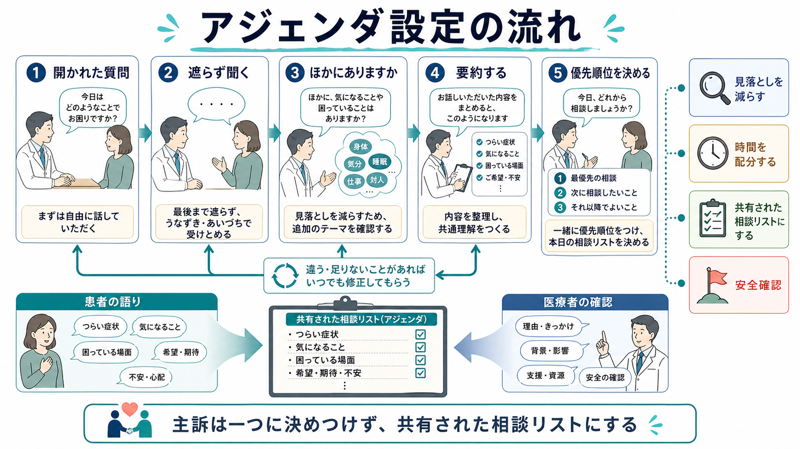
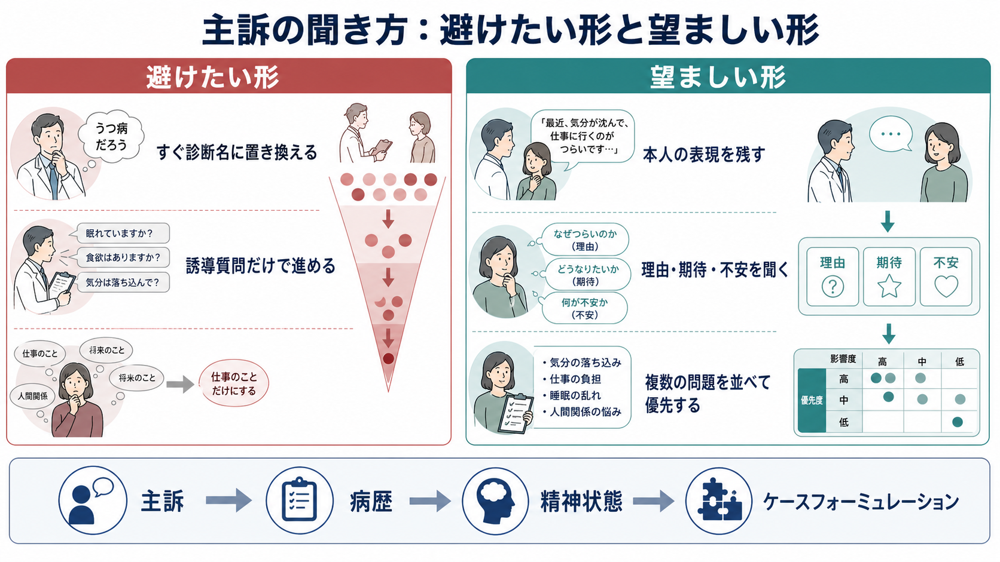

# 主訴はどのように聞くべきか

## 要点

- 主訴は、医療者が最初に思いついた診断名ではなく、患者が受診に持ち込んだ問題、困りごと、期待、緊急性を臨床的に整理した入口である。
- 最初の質問はできるだけ開かれた形にし、患者の第一声を早く遮らず、複数の相談事項がないかを確認する。開口部で患者の問題を十分に聞かないと、重要な関心事が残りやすい [1][2]。
- 主訴は一つに決めつけるより、「今日扱う相談リスト」として患者と共有する方が安全である。追加の関心事を尋ね、要約し、優先順位を合意することが、時間管理にも見落とし予防にも役立つ [3][4]。
- 精神科面接では、症状名だけでなく、本人の表現、生活への影響、受診理由、何を心配しているか、何を期待しているかを聞く。これは[[生物心理社会モデルとは何か|生物心理社会モデル]]や文化的定式化とも接続する [5][6]。
- ただし主訴を尊重することは、リスク評価や鑑別を後回しにすることではない。希死念慮、暴力・虐待、せん妄、身体疾患、薬物・物質使用などの安全確認は、主訴の整理と並行して行う。

## この記事で答える問い

この記事では、[[精神医学とは何か]]、[[精神科診断は何のためにあるのか]]で扱う臨床面接の入口として、主訴をどう聞くべきかを整理する。具体的には、次の問いに答える。

1. 主訴は「患者の言葉をそのまま書く」だけで十分なのか。
2. 最初の質問、追加確認、要約、優先順位づけはどう組み立てるのか。
3. 精神科面接では、症状名、受診理由、生活上の困りごと、安全確認をどう分けて聞くのか。
4. よい主訴の聞き方は、診断、ケースフォーミュレーション、研究・教育とどうつながるのか。

## まず結論

主訴は「一番目に出た症状」ではなく、「患者が今日ここに来た理由を、患者の言葉を残しながら、臨床的に扱える形へ整理したもの」である。したがって、よい聞き方は、最初に患者の語りを広げ、次に相談事項を並べ、最後に優先順位を共有する流れになる。

実際の面接では、たとえば次のように始める。

> 今日は、どのようなことで相談に来られましたか。

患者が話し始めたら、すぐに診断名や症状リストへ置き換えず、短い相づち、沈黙、反映で語りを支える。一区切りついたら、「ほかに今日相談しておきたいことはありますか」と追加の関心事を尋ねる。最後に、「今のお話では、眠れないこと、仕事に行きづらいこと、今後どうなるか不安なことの三つがありました。今日はどれを最初に扱うのがよさそうでしょうか」と要約して合意する。

この流れは、患者の自律性を尊重するだけでなく、医療者の時間管理にも役立つ。開口部で一つの問題だけに飛びつくと、後から別の重要問題が出てきたり、患者が本当に相談したかったことが未処理のまま残ったりする [2][3]。

## 背景

医療面接では、医療者が「情報を集める」必要がある。一方で、患者は「困っている経験を聞いてもらう」ために来ている。この二つは対立しないが、面接の最初で医療者が早く方向づけすぎると、患者の問題の全体像が狭くなる。

Beckman と Frankel の古典的研究では、外来診療の録音を分析し、患者が冒頭の関心事を言い終える機会が少なく、多くの場面で医師が早期に特定の問題へ質問を向けていたことが示された [1]。その後の Marvel らの研究でも、医師が患者の関心事を尋ねても、十分に全体のアジェンダを引き出す前に方向づけることが課題として残っていた [2]。

この知見は、「患者を遮るな」という単純な道徳ではない。重要なのは、面接の序盤に患者の相談事項をリスト化し、患者と医療者の双方が「今日は何を扱うのか」を見える形にすることである。Robinson らは、追加の関心事を尋ねる方法やタイミングが、患者の応答に影響することを会話分析から検討している [3]。

精神科面接では、この問題がさらに重要になる。主訴は、抑うつ、不安、不眠、幻聴、怒り、集中困難、家族関係、仕事の失敗、受診への抵抗など、症状名・生活問題・対人問題・制度上の必要が混ざって語られることが多い。したがって主訴の聞き方は、[[DSMとICDは何が違うのか|診断分類]]の入口であると同時に、[[生物心理社会モデルとは何か|生物心理社会的理解]]の入口でもある。

## 基本概念

### 主訴

主訴とは、患者が受診した主要な理由である。ただし臨床的には、単にカルテの一行に書かれる「不眠」「気分の落ち込み」「動悸」だけを指すわけではない。主訴には、本人が何を問題と見ているか、何が一番つらいか、何を解決したいか、誰に勧められて来たか、今日の診療で何を期待しているかが含まれる。

たとえば「眠れません」という一言でも、背景は大きく異なる。うつ病の睡眠障害かもしれないし、躁状態の前駆、PTSD の過覚醒、疼痛、カフェイン、薬剤、夜勤、家庭内ストレス、身体疾患かもしれない。主訴を丁寧に聞くとは、最初から一つの診断へ収束させることではなく、患者の言葉を起点に、病歴と文脈へ展開できるようにすることである。

### 患者の言葉

「患者の言葉を尊重する」とは、医療者が専門用語を一切使わないという意味ではない。むしろ、患者の表現と医療者の概念を混同しないことである。

たとえば患者が「頭が止まらない」と言ったとき、すぐに「不安ですね」と置き換えると、本人の経験の輪郭が失われることがある。まず「頭が止まらない、というのは、考えが次々浮かぶ感じですか。それとも眠りたいのに緊張が抜けない感じですか」と確認する。患者の比喩、身体感覚、生活場面を残しておくと、後の[[精神科診断は何のためにあるのか|診断]]やケースフォーミュレーションで情報量が増える。

### アジェンダ設定

アジェンダ設定とは、診察で扱う問題を患者と医療者が共有することである。Calgary-Cambridge Guide では、面接の開始において、ラポール形成、相談理由の同定、患者の問題を自分の言葉で話してもらうこと、要約して確認することが重視される [4]。

主訴を聞く場面でのアジェンダ設定は、次の四つを分けると実践しやすい。

| 層 | 聞くこと | 例 |
|---|---|---|
| 患者の表現 | 本人は何と言っているか | 「気力が出ない」「胸がざわざわする」 |
| 受診理由 | なぜ今日来たのか | 「仕事に行けなくなった」「家族に勧められた」 |
| 困りごと | 何が生活を妨げているか | 睡眠、食事、対人関係、学業・仕事、セルフケア |
| 期待・優先順位 | 何を相談したいか | 診断、薬、休職、家族への説明、不安の整理 |

## 仕組み

### 1. 開かれた質問で始める

最初の質問は、患者が自分の言葉で話せる形にする。たとえば「どこが悪いですか」より、「今日はどのようなことで相談に来られましたか」「いちばん困っていることから教えてください」の方が、受診理由と困りごとの両方を引き出しやすい。

NICE の患者経験ガイダンスでも、患者を一人の個人として理解し、信念、懸念、希望を聞き、開かれた質問を使い、最後に要約して理解を確認することが推奨されている [5]。

### 2. 早く閉じすぎない

患者が「眠れなくて」と言った直後に、「入眠困難ですか、中途覚醒ですか」と閉じた質問に移ることは、後で必要になる。しかし最初から閉じた質問だけにすると、「眠れない」の背後にある「仕事に行けない」「死にたい気持ちがある」「家族に怒鳴ってしまう」「病院に来ること自体が怖い」などが見えにくくなる。

したがって、面接の冒頭では、まず患者の語りを受け止める。その後で、症状の持続、頻度、重症度、誘因、経過、身体症状、薬物・物質使用、リスクを構造化して確認する。開かれた質問と閉じた質問は対立するものではなく、順序が重要である。

### 3. 「ほかにありますか」を一度で終わらせない

患者は、最初から最も重要な問題を言うとは限らない。恥ずかしいこと、言いにくいこと、医師に叱られそうなこと、関係ないと思っていることは後から出る。追加の関心事を尋ねることは、診察時間を浪費する行為ではなく、時間配分を決めるための作業である [3]。

実践的には、次のように聞く。

- 「ほかに、今日のうちに相談しておきたいことはありますか。」
- 「今の話に加えて、気になっていることを先に並べておくとしたら何がありますか。」
- 「全部を今日深く扱えるとは限りませんが、まず相談したいことをリストにしておきましょう。」

### 4. 要約して、患者に訂正してもらう

要約は、医療者が理解を示すためだけでなく、誤解を修正するために行う。患者の言葉を残しつつ、臨床的に扱いやすい形へ整理する。

たとえば、次のように返す。

> いま伺った範囲では、ここ2か月の不眠、仕事に行く前の強い不安、家族に迷惑をかけているという気持ちが大きいのですね。今日いちばん相談したいのは、まず眠れないことへの対処で、同時に休職が必要かも気になっている、という理解で合っていますか。

この返し方では、患者の主観、症状、生活機能、期待が同時に整理される。間違っていれば、患者が訂正できる。正しければ、面接の共通地図になる。

### 5. 安全確認を組み込む

主訴を尊重することは、患者が言わない限り危険を聞かないという意味ではない。精神科面接では、希死念慮、自傷、他害、虐待、DV、せん妄、急性中毒、離脱、重い身体疾患、薬剤性症状、食事・水分摂取の破綻、セルフネグレクトなどを必要に応じて確認する。

重要なのは、患者の話を中断して尋問するのではなく、文脈を説明して聞くことである。

> 安全に関わることなので、皆さんに確認している質問があります。つらさが強いときに、消えてしまいたい、死にたい、自分を傷つけたいと思うことはありますか。

このように理由を添えると、患者の語りを尊重しながら、臨床的に必要な評価を行いやすい。

## 図解

図1は、主訴を一つの症状名に縮約せず、共有された相談リストへ変換する流れを示している。最初に開かれた質問で患者の語りを受け取り、追加の関心事を尋ね、要約し、優先順位を合意する。

図2は、患者の語りを医療者が反映・要約し、患者が訂正・追加することで共有理解が深まる仕組みを示している。主訴の聞き取りは、情報抽出ではなく相互確認である。

図3は、避けたい聞き方と望ましい聞き方の比較である。早すぎる診断名への置き換え、誘導質問だけの進行、一つの困りごとへの決めつけは、見落としを増やす。望ましい聞き方では、本人の表現、理由・期待・不安、複数問題の優先順位づけを残す。

## 臨床・研究との接続

### 精神科診断との接続

主訴は診断名ではない。しかし、診断に向かう入口である。患者が「不安」と言っても、それは全般不安症、パニック発作、うつ病の焦燥、双極症の混合状態、PTSD、強迫症、物質使用、甲状腺機能異常、薬剤性アカシジアなど、さまざまな可能性を開く。

したがって、主訴を聞く段階では、「患者の言葉」と「医療者の仮説」を分けておく。カルテには、患者の表現を引用に近い形で残し、その後に医療者の整理を書くとよい。

例：

- 患者の表現：「朝になると胸がざわざわして、仕事に行こうとすると涙が出る」
- 医療者の整理：2か月前からの不安・抑うつ症状、出勤困難、睡眠障害を主訴に受診

この区別があると、後から診断仮説が変わっても、初診時の経験を失わずに済む。

### 文化的定式化との接続

DSM-5-TR の Cultural Formulation Interview は、本人が問題をどう理解し、何を一番困っていると感じ、どのような支援や障壁があるかを尋ねる半構造化面接である。公式資料でも、問題や懸念、最も困っていること、本人なりの説明、原因理解、ストレス、支援、期待を聞く構成になっている [6]。

これは、主訴の聞き方に直接関係する。患者が「うつです」と言っても、その言葉が医学的診断名を意味するのか、気分の落ち込みの一般表現なのか、職場や家族に説明するための言葉なのかは確認しなければ分からない。文化的背景、言語、宗教、家族の期待、制度経験、スティグマは、何を主訴として語るかに影響する。

### 患者中心の医療との接続

患者中心の臨床方法では、疾患だけでなく、患者の illness experience、すなわち症状が本人にとってどのような意味を持つかを探索し、共通基盤を見つけることが重視される [7]。主訴の聞き方は、この患者中心性の最初の実践である。

ただし、患者中心とは「患者の言う通りにする」ことではない。本人の経験を理解し、医療者の専門的評価と突き合わせ、現実的な優先順位を一緒に決めることである。これは[[モチベーション面接は行動変容をどう支えるのか|モチベーション面接]]の協働性や自律性支援とも重なる。

### 教育・研究との接続

主訴の聞き方は、教育可能な技能である。録音・逐語、模擬患者、フィードバック、チェックリストを使うと、医療者がどの時点で遮ったか、追加の関心事を尋ねたか、患者の表現を要約したかを評価できる。

研究面では、主訴の聞き方は会話分析、医療コミュニケーション研究、臨床教育、自然言語処理と接続する。たとえば、患者の第一声、医療者の割り込み、追加質問、要約、合意形成を定量化すれば、面接技術と診療満足度、見落とし、治療継続、診断精度との関係を検討できる。

## よくある誤解

### 誤解1: 主訴は患者の言葉をそのまま書けばよい

患者の言葉は重要だが、それだけでは不十分である。「眠れない」と書くだけでは、いつから、どの程度、何に困っているか、今日なぜ受診したかが分からない。望ましい記載は、患者の表現を残しつつ、臨床的に必要な文脈を添えることである。

### 誤解2: 主訴は一つに絞るべきである

診療記録上は一つの主訴を選ぶことがある。しかし面接の実践では、最初から一つに絞ると見落としが増える。まず複数の相談事項を並べ、そのうえで「今日最初に扱う問題」を選ぶ方がよい。

### 誤解3: 開かれた質問は時間がかかる

開かれた質問は、無制限に話してもらうことではない。最初に相談事項を見える化することで、むしろ後半の混乱を減らす。必要なのは、自由に話す時間と、構造化して確認する時間を切り替えることである。

### 誤解4: 精神科では主訴より診断基準が大事である

診断基準は重要である。しかし診断基準をどの症状に適用するかは、患者の語り、経過、生活機能、文化的文脈、安全リスクを聞かなければ決まらない。主訴を丁寧に聞くことは、診断基準を曖昧にするのではなく、診断基準を適切に使うための前提である。

## 関連ノート

既存ノートとして、次の内部リンクが関連する。

- [[精神医学とは何か]]
- [[精神科診断は何のためにあるのか]]
- [[DSMとICDは何が違うのか]]
- [[生物心理社会モデルとは何か]]
- [[正常と異常はどこで分けられるのか]]
- [[モチベーション面接は行動変容をどう支えるのか]]
- [[インタビュー研究とは何か]]

今後の作成候補：

- 精神状態診察とは何か
- 受診動機はどのように聞くべきか
- 希死念慮はどのように聞くべきか
- 文化的定式化面接とは何か
- ケースフォーミュレーションとは何か

MOC更新候補：

- `content/00_MOC/MOC｜精神医学.md` の「総論・診断・面接」領域
- `content/00_MOC/MOC｜臨床実践・治療.md` の面接・コミュニケーション関連領域

このタスクでは、並列ジョブとの衝突を避けるため MOC 本体は更新しない。

## 理解チェック

1. 主訴を「最初に出た症状名」とだけ捉えると、どのような情報が抜けやすいか。
2. 開かれた質問、追加の関心事の確認、要約、優先順位づけは、それぞれ何のために行うのか。
3. 患者の言葉と医療者の診断仮説を分けて記録する利点は何か。
4. 精神科面接で、主訴を尊重しながら安全確認を行うには、どのような前置きが有用か。
5. Cultural Formulation Interview の発想は、主訴の聞き方にどのように役立つか。

## 参考文献

[1] Beckman, H. B., & Frankel, R. M. (1984). The effect of physician behavior on the collection of data. *Annals of Internal Medicine, 101*(5), 692-696. https://doi.org/10.7326/0003-4819-101-5-692

[2] Marvel, M. K., Epstein, R. M., Flowers, K., & Beckman, H. B. (1999). Soliciting the patient's agenda: Have we improved? *JAMA, 281*(3), 283-287. https://doi.org/10.1001/jama.281.3.283

[3] Robinson, J. D., Tate, A., & Heritage, J. (2016). Agenda-setting revisited: When and how do primary-care physicians solicit patients' additional concerns? *Patient Education and Counseling, 99*(5), 718-723. https://doi.org/10.1016/j.pec.2015.12.009

[4] Kurtz, S., Silverman, J., Benson, J., & Draper, J. (2003). Marrying content and process in clinical method teaching: Enhancing the Calgary-Cambridge guides. *Academic Medicine, 78*(8), 802-809. https://doi.org/10.1097/00001888-200308000-00011

[5] National Institute for Health and Care Excellence. (2012, updated 2021). *Patient experience in adult NHS services: improving the experience of care for people using adult NHS services* (CG138). https://www.nice.org.uk/guidance/CG138

[6] American Psychiatric Association. (2022). *Cultural Formulation Interview (CFI), DSM-5-TR*. https://www.psychiatry.org/File%20Library/Psychiatrists/Practice/DSM/DSM-5-TR/APA-DSM5TR-CulturalFormulationInterview.pdf

[7] Stewart, M., Brown, J. B., Weston, W. W., McWhinney, I. R., McWilliam, C. L., & Freeman, T. R. (2003). *Patient-centered Medicine: Transforming the Clinical Method* (2nd ed.). Radcliffe Medical Press. 概要レビュー: https://pmc.ncbi.nlm.nih.gov/articles/PMC5060226/

## 未解決問題

- 主訴の聞き方の訓練効果を、医療者の自己評価ではなく、録音・逐語、患者満足度、診断修正、治療継続、安全アウトカムでどこまで評価できるか。
- 精神科初診、救急、学校・職場連携、オンライン診療では、アジェンダ設定の最適な時間配分がどのように異なるか。
- 患者の語りを電子カルテや自然言語処理で扱うとき、本人の表現を保ちながら、プライバシーと臨床的有用性をどう両立するか。
