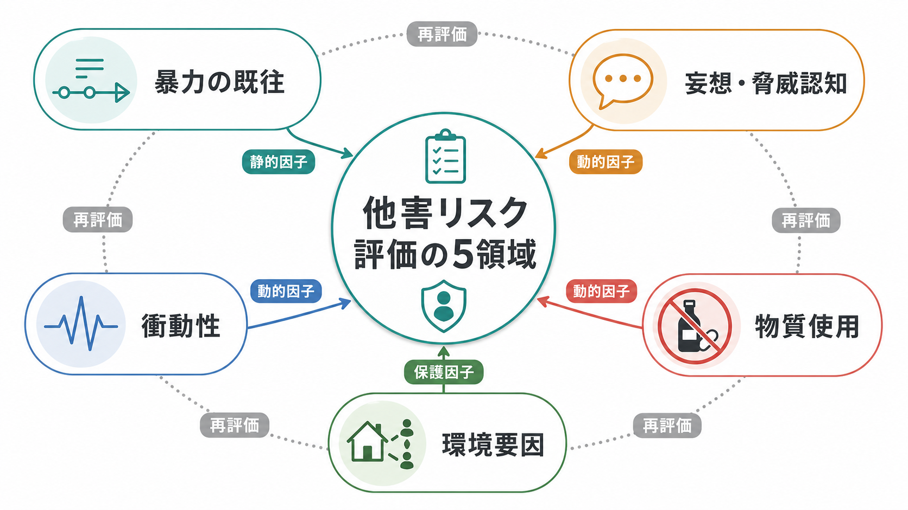
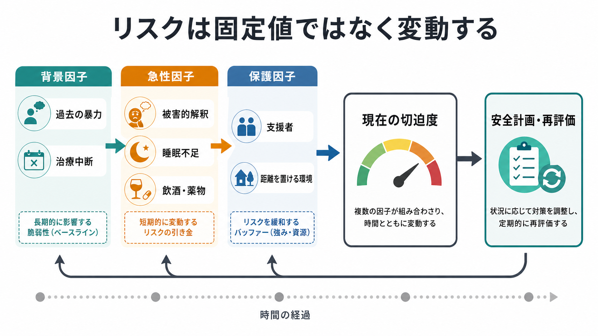
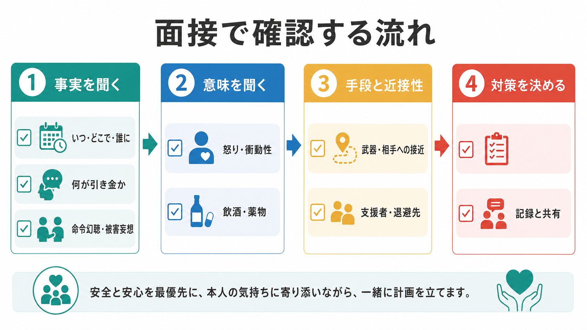

# 他害リスク評価では何を見るべきか

## 要点

- 他害リスク評価は「危険な人を当てる作業」ではなく、暴力が起こりやすくなる条件と、下げられる条件を具体化する作業である。
- 重点は、暴力の既往、現在の妄想・脅威認知、怒りと衝動性、物質使用、被害者への近接性、武器や手段へのアクセス、支援者・住環境・治療継続である。
- 精神疾患の診断名だけでリスクを判断してはいけない。研究では、暴力リスクは物質使用、過去の暴力、敵意、治療不遵守、環境ストレスなどと強く結びつく[4][5]。
- 面接では、本人の語りを尊重しつつ、曖昧な聞き方で済ませない。対象、意図、計画、手段、時間的切迫性、保護因子を具体的に確認する。
- 評価の最終目的は、リスク分類ではなく、今日必要な安全確保、治療、家族・支援者との連携、再評価の予定を決めることである。

## この記事で答える問い

1. 他害リスク評価では、どの情報を優先して確認するべきか。
2. 妄想、衝動性、物質使用、環境要因は、どのように暴力リスクと結びつくのか。
3. 精神科面接で、本人を責めずに具体的な安全確認をするにはどう聞けばよいか。
4. 評価結果を、安全計画と再評価にどうつなげるか。

## まず結論

他害リスク評価では、次の5領域を見る。

| 領域 | 見るべきこと | 面接での焦点 |
|---|---|---|
| 暴力の既往 | 過去の暴力、脅迫、器物破損、DV、逮捕歴、治療場面での攻撃性 | 「いつ、誰に、何が起き、何が前後していたか」 |
| 妄想・脅威認知 | 被害妄想、嫉妬妄想、命令幻聴、相手への確信、怒りを伴う解釈 | 「誰が、何をしてくると感じるか。どの程度確信しているか」 |
| 衝動性 | 怒りの急上昇、待てなさ、抑制困難、睡眠不足、躁状態、焦燥 | 「止まれる条件と止まれなくなる条件は何か」 |
| 物質使用 | 飲酒、薬物、処方外使用、離脱、混合使用、使用後の行動変化 | 「使用が判断、怒り、近接行動、服薬に何をしているか」 |
| 環境要因 | 対象者への近接性、同居、孤立、支援者、武器、経済・住居問題 | 「距離を置けるか。誰が見守れるか。何を今日変えられるか」 |

## 背景

精神科臨床では、自傷リスクと同じように、他害リスクも安全確認の一部である。これは本人を犯罪者扱いするためではない。怒り、恐怖、被害的確信、混乱、物質使用、関係葛藤、睡眠不足、経済的困難などが重なったときに、本人や周囲を守るための手立てを早く作るためである。

NICE の暴力・攻撃性ガイドラインは、短期的な暴力や攻撃性への対応では、予防、ディエスカレーション、身体的介入の最小化、薬物による鎮静の安全性、事後レビューを一連の管理課題として扱う[1]。APA の成人精神医学的評価ガイドラインも、初期評価の中で自殺リスクだけでなく攻撃行動リスク、物質使用、医学的状態、文化的要因、治療意思決定への本人参加を確認することを求めている[2]。

重要なのは、診断名だけで判断しないことである。統合失調症や他の精神病性障害と暴力の関連を調べたメタ分析では、精神病だけで説明するよりも、併存する物質使用が過剰リスクの大きな部分を説明することが示されている[4]。また、退院後患者を地域住民と比較した MacArthur Violence Risk Assessment Study では、物質使用症状がある場合に暴力率が上がり、物質使用症状がない群では差が小さくなることが示された[6]。

## 基本概念

### リスクは静的因子と動的因子に分けて考える

静的因子とは、過去の暴力、早期からの反社会的行動、犯罪歴、過去の治療反応など、今日の面接で変えにくい情報である。これらはベースラインの注意水準を決める。

動的因子とは、現在の怒り、被害的確信、飲酒、薬物使用、睡眠不足、服薬中断、相手への接近、孤立、支援者不在など、短期的に変わりうる情報である。今日の対応で変えられることが多いため、臨床では特に重要である。精神病圏の暴力リスク要因を調べた系統的レビューでは、敵意、最近の薬物使用、最近のアルコール使用、衝動制御不良、治療不遵守などの動的因子が有意に関連していた[5]。

### 構造化専門家判断を「考え方」として使う

HCR-20V3 は、暴力リスク評価と管理のための Structured Professional Judgment、つまり構造化専門家判断モデルを代表するツールである。過去の要因、現在の臨床要因、今後のリスク管理要因を分けて検討する点が特徴で、司法・矯正・精神科の文脈で使われる[3]。

日常の一般精神科面接で、HCR-20V3 をそのまま全例に実施する必要はない。しかし「過去」「現在」「これからの環境」を分ける発想は有用である。[[現病歴はどのように構造化するべきか]] と同じく、時間軸を整えることで、単なる印象ではなく、対応可能な仮説に変えられる。

### 他害リスク評価は治療関係と矛盾しない

他害リスクを聞くことは、本人を疑うことと同じではない。むしろ、本人が「自分でも怖い」「相手に近づいてしまいそう」「飲むと止まらない」と感じている場合、具体的に聞かれることで支援につながることがある。[[開かれた質問と閉じた質問はどう使い分けるのか]] で扱うように、最初は本人の語りを開き、その後で安全上必要な点を閉じた質問で確認する。

## 仕組み

### 1. 暴力の既往を見る

最も基本的な情報は、過去の暴力である。ここでいう暴力は、重大事件だけではない。殴る、蹴る、押す、物を投げる、刃物や工具を持ち出す、相手の職場や家に押しかける、脅迫する、器物を壊す、ペットや家族に危害を示唆する、といった行動も含めて確認する。

聞くときは、道徳評価ではなく時系列で整理する。

- いつ起きたか。
- 誰に向かったか。
- 何が引き金だったか。
- その前に、飲酒、薬物、睡眠不足、妄想、怒り、別れ話、金銭問題があったか。
- 手段や武器はあったか。
- 本人は止まれたか、誰かが止めたか。
- その後、後悔、謝罪、再接近、治療中断、逮捕、保護命令、入院があったか。

既往は「また必ず起こる」という意味ではない。何が危険を上げ、何が止めたのかを知る情報である。

### 2. 妄想内容と脅威認知を見る

妄想があるかどうかだけでは不十分である。暴力リスクに関係しやすいのは、相手が自分や家族を傷つけるという確信、相手を先に止めなければならないという解釈、命令幻聴、嫉妬妄想、強い怒りを伴う被害的確信である。

MacArthur データを再解析した研究では、妄想そのものが一律に将来の暴力を予測するわけではなく、妄想に伴う怒りや時間的近接性が重要であると報告された[7]。したがって、聞くべきなのは「妄想があるか」だけではない。

- 誰が加害者・標的として体験されているか。
- その相手は現実に近くにいるか。
- 確信度はどのくらいか。
- その考えが出たとき、怒り、恐怖、焦りはどの程度か。
- 「自分が動かなければならない」と感じるか。
- 命令幻聴がある場合、内容、頻度、抵抗可能性はどうか。
- 相手に連絡した、待ち伏せした、近づいた、検索した、道具を準備したことがあるか。

ここでは、妄想の真偽を面接中に論破するより、本人にとっての切迫感と行動化の近さを見る。

### 3. 衝動性と怒りの制御を見る

衝動性は、性格の問題として片づけるべきではない。睡眠不足、躁状態、焦燥、アルコール、薬物、疼痛、せん妄、発達特性、頭部外傷、強い対人ストレスで変動する。

確認したいのは、怒りが上がる速度、止まれる条件、止まれなかった過去、面接中の行動である。[[衝動性とは何か]] とつなげると、衝動性は「考えがない」ことではなく、報酬・脅威・抑制・時間割引がうまく働かない状態として理解できる。

具体的には、次を聞く。

- 怒りは何分くらいで最大になるか。
- その場を離れる、電話する、薬を飲む、寝るなどで下げられるか。
- 怒りのときに、相手へ連絡する、追いかける、物を壊す、車を運転する、刃物や工具に近づくことがあるか。
- 飲酒・薬物・睡眠不足の後に悪化するか。
- 面接中に、声量、姿勢、視線、落ち着きなさ、被刺激性がどう変わるか。

### 4. 物質使用を見る

物質使用は、他害リスク評価で外せない。重要なのは物質名だけではなく、使用が生活・身体・安全に何をしているかである。統合失調症・他の精神病性障害と暴力のメタ分析では、物質使用併存がある場合のリスク上昇が大きく、物質使用のない精神病群ではリスク推定値が低くなる[4]。リスク要因レビューでも、最近の薬物使用、最近のアルコール使用、物質使用歴は重要な動的因子として示されている[5]。

聞く項目は次である。

- アルコール、覚醒剤、大麻、鎮静薬、睡眠薬、処方外使用、市販薬、カフェイン、混合使用。
- 使用量、頻度、最後の使用、離脱、ブラックアウト。
- 使用後に怒り、被害感、嫉妬、衝動性、記憶欠落、相手への接近が増えるか。
- 服薬中断、通院中断、家族葛藤、金銭問題と結びついているか。
- 手元にある量、入手しやすさ、今日から減らせる環境調整は何か。

## 図解

リスクは固定値ではなく、背景因子、急性因子、保護因子の組み合わせで変動する。過去の暴力や治療反応は背景の注意水準を決めるが、今日の切迫度は、被害的解釈、睡眠不足、飲酒、薬物、相手への接近、支援者の有無で大きく変わる。

面接では、事実、意味、手段と近接性、対策の順に整理するとよい。これは[[精神科面接とは何か]]の情報収集と関係形成を、安全計画に接続するための流れである。

## 臨床・研究との接続

### 面接での聞き方

他害リスクは、遠回しすぎると確認できない。たとえば「危ないことはありませんか」だけでは不十分である。次のように、開いた質問から具体化する。

> 「最近、誰かに強い怒りや恐怖を感じて、近づきたい、問い詰めたい、傷つけたいと思ったことはありますか。」

> 「その相手は誰ですか。今、会える距離にいますか。連絡先や住所を知っていますか。」

> 「実際に行く、連絡する、待つ、道具を用意するなど、何か準備したことはありますか。」

> 「その気持ちが強くなったとき、止めてくれる人、離れられる場所、連絡できる支援先はありますか。」

聞いた内容は、単に「リスク高い」と記録するのではなく、具体的に書く。対象、意図、計画、手段、近接性、物質使用、保護因子、本人の協力可能性、次の連絡・受診予定を分けて記載する。

### 環境要因と保護因子

環境要因は、リスクを上げる側にも下げる側にも働く。相手と同居している、同じ職場にいる、SNSで接触し続けている、武器や工具が手元にある、飲酒しやすい環境にいる、支援者がいない場合、短期リスクは上がりやすい。

一方で、支援者、退避先、同意に基づく情報共有、服薬支援、物質使用を避ける環境、金銭・住居支援、職場・学校との調整は保護因子になる。[[生物心理社会モデルとは何か]] の観点では、他害リスクは個人内の症状だけでなく、対人関係と生活環境の中で変動する。

### 研究知見を個別支援に使うときの注意

研究は「集団でどの因子が関連するか」を示す。個別面接では、それをそのまま機械的に当てはめるのではなく、本人の時間軸、現在の切迫性、支援可能性に翻訳する必要がある。初回精神病の暴力リスクに関する近年のレビューでも、暴力の時期や重症度によって関連因子が異なる可能性が指摘されている[8]。

したがって、評価は一回で完結しない。通院、入院、退院、家族面接、物質使用の再燃、関係葛藤の変化ごとに再評価する。[[精神科初診で何を確認するべきか]] で扱う初期評価は、継続評価の起点である。

## よくある誤解

### 「精神疾患がある人は危険である」

誤りである。多くの精神疾患をもつ人は暴力を行わない。診断名だけで危険性を決めることは、スティグマを強め、評価精度も下げる。見るべきなのは、過去の暴力、物質使用、現在の脅威認知、怒り、衝動性、相手への近接性、手段、保護因子である。

### 「妄想があるならすぐ危険である」

妄想の有無だけでは不十分である。内容、対象、確信度、怒り、命令性、相手への近接性、行動準備が重要である。妄想に怒りが伴い、対象が近く、手段があり、本人が「動くしかない」と感じている場合は切迫度が上がる。

### 「スコアを付ければ判断できる」

尺度や構造化ツールは有用だが、判断を置き換えない。HCR-20V3 のような構造化専門家判断も、点数だけではなく、シナリオ、管理方針、再評価を重視する[3]。臨床では、評価結果が具体的な安全計画に変換されているかが重要である。

### 「聞くと暴力を誘発する」

通常、具体的に聞くこと自体が暴力を誘発するわけではない。むしろ、曖昧に避けることで危険な準備や切迫性を見落とすことがある。ただし、聞き方は重要である。責める口調ではなく、「安全のために確認します」と目的を明示し、本人が話せるペースを保つ。

## 関連ノート

既存ノート:

- [[精神科面接とは何か]]
- [[精神科初診で何を確認するべきか]]
- [[現病歴はどのように構造化するべきか]]
- [[生活歴はなぜ重要なのか]]
- [[生物心理社会モデルとは何か]]
- [[鑑別診断とは何か]]
- [[開かれた質問と閉じた質問はどう使い分けるのか]]
- [[家族面接では何を評価するべきか]]
- [[自殺リスク評価では何を聞くべきか]]
- [[衝動性とは何か]]
- [[妄想は予測誤差処理の異常として説明できるのか]]

MOC更新候補:

- `content/00_MOC/` 配下の精神医学、精神科面接、臨床実践、安全評価に関する MOC に `[[他害リスク評価では何を見るべきか]]` を追加する。
- 並列ジョブとの競合を避けるため、本タスクでは MOC 本体は更新しない。

今後の作成候補:

- 「暴力リスク評価ツールとは何か」
- 「HCR-20V3とは何か」
- 「精神科救急でディエスカレーションはどう行うか」
- 「命令幻聴をどう評価するか」
- 「物質使用と精神症状はどう相互作用するか」

## 理解チェック

1. 他害リスク評価で、診断名だけを根拠にしてはいけない理由は何か。
2. 暴力の既往を聞くとき、「起きたかどうか」以外に何を確認するべきか。
3. 妄想内容の評価で、対象、確信度、怒り、近接性を確認する理由は何か。
4. 物質使用は、他害リスク評価でどのような動的因子として働くか。
5. 評価結果を「低・中・高」の分類で終わらせず、安全計画に変換するには何を決める必要があるか。

## 参考文献

[1] National Institute for Health and Care Excellence. (2015). *Violence and aggression: short-term management in mental health, health and community settings* (NICE Guideline NG10). https://www.ncbi.nlm.nih.gov/books/NBK305020/

[2] Silverman, J. J., Galanter, M., Jackson-Triche, M., Jacobs, D. G., Lomax, J. W., Riba, M. B., Tong, L. D., Watkins, K. E., Fochtmann, L. J., Rhoads, R. S., Yager, J., & American Psychiatric Association. (2015). The American Psychiatric Association practice guidelines for the psychiatric evaluation of adults. *American Journal of Psychiatry, 172*(8), 798-802. https://doi.org/10.1176/appi.ajp.2015.1720501

[3] Douglas, K. S., Hart, S. D., Webster, C. D., Belfrage, H., Guy, L. S., & Wilson, C. M. (2014). Historical-Clinical-Risk Management-20, Version 3 (HCR-20V3): Development and overview. *International Journal of Forensic Mental Health, 13*(2), 93-108. https://doi.org/10.1080/14999013.2014.906519

[4] Fazel, S., Gulati, G., Linsell, L., Geddes, J. R., & Grann, M. (2009). Schizophrenia and violence: Systematic review and meta-analysis. *PLOS Medicine, 6*(8), e1000120. https://doi.org/10.1371/journal.pmed.1000120

[5] Witt, K., van Dorn, R., & Fazel, S. (2013). Risk factors for violence in psychosis: Systematic review and meta-regression analysis of 110 studies. *PLOS ONE, 8*(2), e55942. https://doi.org/10.1371/journal.pone.0055942

[6] Steadman, H. J., Mulvey, E. P., Monahan, J., Robbins, P. C., Appelbaum, P. S., Grisso, T., Roth, L. H., & Silver, E. (1998). Violence by people discharged from acute psychiatric inpatient facilities and by others in the same neighborhoods. *Archives of General Psychiatry, 55*(5), 393-401. https://doi.org/10.1001/archpsyc.55.5.393

[7] Ullrich, S., & Keers, R. (2014). Delusions, anger, and serious violence: New findings from the MacArthur Violence Risk Assessment Study. *Schizophrenia Bulletin, 40*(5), 1174-1181. https://doi.org/10.1093/schbul/sbt126

[8] Youn, S., Watson, A. E., Guadagno, B. L., Murrihy, S., Byrne, L. K., Cheng, N., & Cotton, S. M. (2026). Systematic review and meta-analysis: Risk factors of violence during first-episode psychosis. *Trauma, Violence, & Abuse, 27*(1), 256-270. https://doi.org/10.1177/15248380241309297

## 未解決問題

- 日本の精神科初診や救急場面で、どの項目を標準化し、どの項目を個別化するのが最も実用的か。
- 本人の同意、守秘、第三者保護、家族支援をどのように両立するか。
- 物質使用、妄想、怒り、環境ストレスの変化を、外来でどの頻度・方法で再評価するか。
- スティグマを強めずに、暴力リスクを臨床チーム内で共有する記録表現をどう設計するか。
