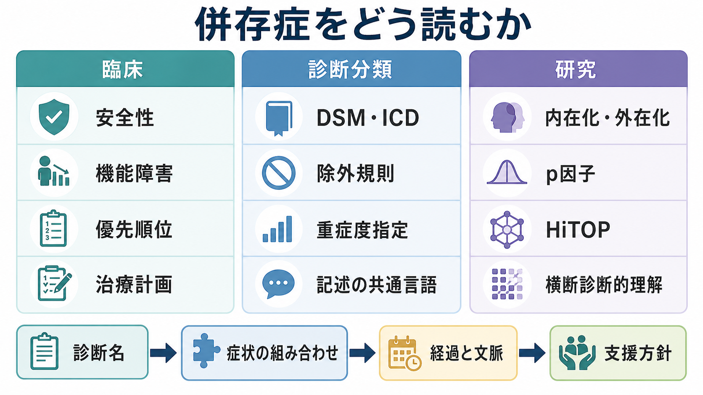
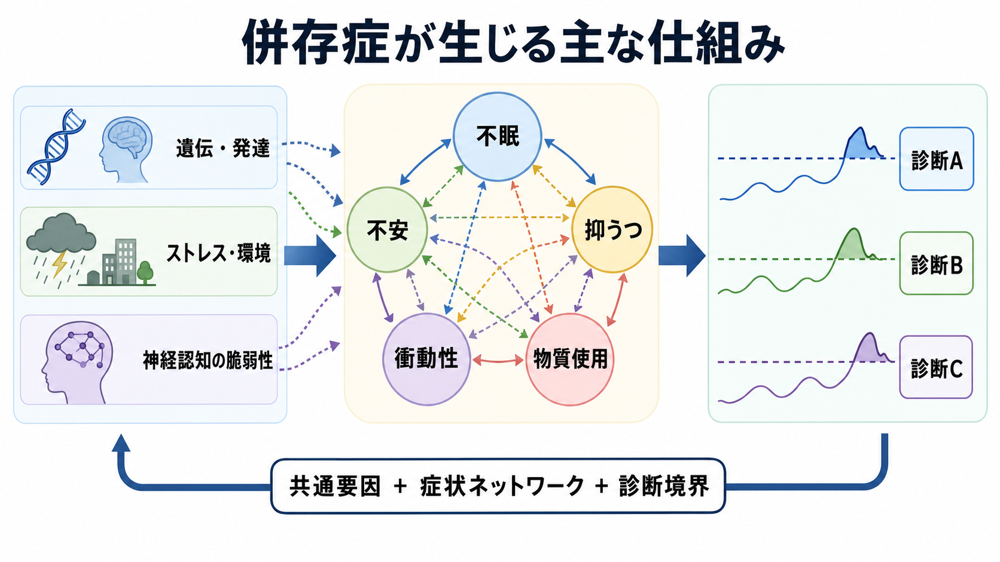

# 併存症とは何か

## 要点

- 併存症とは、同じ人に複数の疾患・障害の診断が同時期に成立することを指す。精神医学では、うつ病と不安症、物質使用症と気分症、発達特性と二次的な不安・抑うつなどが典型例になる。
- 併存症は「診断名が多いほど本質が複雑」という意味だけではない。症状の重なり、共通リスク因子、診断基準の境界、時間経過、評価者の視点が組み合わさって生じる。
- 臨床では、併存症の有無は重症度、機能障害、安全性、治療優先順位、予後評価に関わる。診断名の足し算ではなく、症状・経過・文脈を統合して読む必要がある。
- 研究では、併存症は従来のカテゴリー診断だけでは精神病理を十分に分けられないことを示す重要な手がかりであり、内在化・外在化、p因子、HiTOP、症状ネットワークなどの横断診断的モデルにつながる。

## この記事で答える問い

1. 併存症とは何を意味するのか。
2. なぜ精神疾患では複数診断が同時に成立しやすいのか。
3. 併存症は臨床判断で何を変えるのか。
4. 併存症は診断分類や研究にどのような問題を投げかけるのか。

## まず結論

併存症とは、単に「病名が複数ある」という記録上の事実ではなく、精神病理をどの粒度で切り分けるかという問題である。DSM-5-TR や ICD-11 CDDR のような診断体系は、臨床家が共通言語で評価・記録するための枠組みを提供するが、精神疾患の多くは症状、リスク因子、機能障害、経過が連続的に重なり合う[1], [2]。そのため併存症は、診断分類の失敗というより、精神病理の構造を理解するための重要な入口になる。

## 背景

身体医学では、糖尿病と高血圧、慢性腎臓病と心不全のように、複数の疾患が同時に存在することは珍しくない。精神医学でも同じように、ある診断基準を満たす人が別の診断基準も満たすことがある。ただし精神疾患では、検査値や病理標本だけで境界を引くことが難しく、主観的苦痛、行動、認知、対人機能、発達歴、文化的文脈を合わせて診断するため、併存症の意味は身体疾患よりも解釈を要する。

大規模疫学研究である National Comorbidity Survey Replication では、12か月 DSM-IV 精神疾患の有病率、重症度、併存が評価され、精神疾患が単独で現れるだけでなく、複数の診断が同時に成立しうることが示された[3]。このような所見は、精神疾患を完全に独立した箱として扱うより、共通する脆弱性や症状次元の重なりとして理解する方が有用な場面があることを示している。

## 基本概念

### 併存症と鑑別診断

併存症は、複数の診断が同時に成立するという判断である。一方、鑑別診断は、似た症状を示す複数の候補のうち、どれが現在の症状を最もよく説明するかを検討する作業である。たとえば不眠、集中困難、焦燥は、うつ病、不安症、双極症、物質使用、身体疾患、薬剤影響のいずれでも起こりうる。最初から「うつ病と不安症の併存」と決めるのではなく、経過、誘因、躁症状、物質・薬剤、身体疾患、安全性を確認する必要がある。

### 併存症と多疾患併存

英語では comorbidity と multimorbidity が区別されることがある。comorbidity は、ある主診断を中心に別の疾患が併存するという含みを持つ場合がある。multimorbidity は、主従を決めずに複数の健康問題が同時にある状態を指す。精神医学の記事では「併存症」として両者が混在して使われることが多いが、臨床では「主訴に最も関わる問題は何か」「安全性を左右する問題は何か」「長期的な機能障害に関わる問題は何か」を分けて考える。

### 診断名とケースフォーミュレーション

診断名は共通言語として重要だが、それだけで個人の困りごとは説明しきれない。[[精神疾患とは何か]]で扱うように、精神疾患の診断は症状、苦痛、機能障害、除外条件、文化的文脈を統合する実践である。併存症がある場合には、診断名を並べるだけでなく、発症順序、維持因子、保護因子、本人の価値観、生活環境を含めたケースフォーミュレーションが重要になる。

## 仕組み

併存症が生じる仕組みは一つではない。代表的には、次のような経路がある。

1. 共通リスク因子: 遺伝的脆弱性、発達過程、早期逆境、慢性ストレス、認知制御の困難などが、複数の診断領域にまたがって影響する。
2. 症状の重なり: 不眠、集中困難、易疲労感、回避、焦燥、衝動性などは、複数の診断基準に現れる。
3. 症状間の相互作用: 不眠が不安を強め、不安が回避を増やし、回避が抑うつを維持するように、症状がネットワークとして互いに増幅することがある[6]。
4. 診断境界の問題: DSM や ICD のカテゴリーは臨床的に有用な区分だが、精神病理が自然界でそのまま離散的に分かれているとは限らない。
5. 時間経過: ある時点では不安症として見えていた問題が、長期経過の中で抑うつ、物質使用、身体症状、対人問題と結びつくことがある。

Krueger と Markon は、併存症を単なる例外ではなく、精神疾患の背後にある潜在的な脆弱性スペクトラムの表れとして捉えるモデルを整理した[4]。この見方では、個別診断は完全に独立した病気というより、内在化、外在化、思考障害などの広い次元の上に位置づけられる。

## 図解

上の1枚目は、併存症を臨床、診断分類、研究の3つの観点から読むための地図である。臨床では安全性、機能障害、優先順位、治療計画が中心になる。診断分類では DSM・ICD、除外規則、重症度指定、記述の共通言語が重要になる。研究では、内在化・外在化、p因子、HiTOP、横断診断的理解が焦点になる。

2枚目は、併存症が生じる代表的な仕組みを示している。共通要因が複数の症状に影響し、症状同士がネットワークとして相互に強め合い、一定の閾値を超えると複数の診断基準を同時に満たす、という流れである。ただしこれは決定論的な因果図ではなく、臨床評価で仮説を立てるための概念図である。

## 臨床・研究との接続

### 臨床での意味

併存症があると、単独診断よりも重症度、慢性化、機能障害、安全性リスクが高くなることがある。たとえば不安症とうつ病が重なると、回避、意欲低下、不眠、自己評価の低下が相互に強まり、仕事・学業・対人関係への影響が大きくなることがある。物質使用が併存する場合には、離脱、衝動性、睡眠、服薬、安全性評価が治療計画を左右する。

自殺関連行動の研究でも、複数の精神疾患診断があることはリスク評価上の重要な情報になりうる。ただし、診断数だけでリスクが自動的に決まるわけではない。希死念慮、過去の自傷・自殺企図、絶望感、衝動性、物質使用、支援資源、アクセス可能な手段などを個別に評価する必要がある[7]。

### 研究での意味

併存症は、精神疾患分類の構造を考えるうえで中心的な問題である。Caspi らは、精神疾患が相互に併存し、再発・持続し、連続的に分布することに注目し、広範な精神病理に共通する一般因子として p因子を提案した[5]。この考え方は、すべてを単一因子で説明できるという意味ではないが、診断横断的な重症度や脆弱性を測る発想につながる。

HiTOP は、精神病理を症状、症候群、サブファクター、スペクトラムという階層構造で捉えようとする量的分類モデルである。従来の診断カテゴリーで生じる高い併存率や異質性を、内在化、外在化、思考障害などの次元として整理する点に特徴がある[8]。現在の臨床診断をそのまま置き換えるものではないが、研究、測定、ケース理解の補助線として重要である。

## よくある誤解

### 誤解1: 併存症は「診断しすぎ」の結果にすぎない

過剰診断の問題は確かにありうる。しかし、併存症のすべてを診断しすぎとして片づけると、本人の苦痛、機能障害、安全性、治療上の優先順位を見落とす。問題は診断数を減らすことではなく、各診断が現在の困りごとをどれだけ説明し、支援方針にどれだけ関わるかを検討することである。

### 誤解2: 併存診断が多いほど「重い人」だと決められる

診断数は重症度の一部の手がかりにはなるが、重症度そのものではない。診断基準上は複数診断を満たしても、機能が保たれている場合もある。逆に単一診断でも、急性リスクや生活機能の障害が大きい場合がある。重症度、持続期間、生活上の影響、安全性を別に評価する必要がある。

### 誤解3: 併存症があると治療は必ず複雑になり、何から始めてもよい

併存症があるほど、治療の優先順位づけは重要になる。急性の安全性、身体疾患・物質使用・薬剤影響、睡眠、生活リズム、支援資源、本人の希望を確認し、介入可能で効果が波及しやすい地点を選ぶ。[[生物心理社会モデルとは何か]]の観点からは、症状だけでなく、維持因子と保護因子を同時に整理することが実践的である。

## 関連ノート

既存ノート:

- [[精神疾患とは何か]]
- [[生物心理社会モデルとは何か]]
- [[精神医学は他の医学分野と何が違うのか]]

今後の作成候補:

- 鑑別診断とは何か
- ケースフォーミュレーションとは何か
- 内在化と外在化とは何か
- p因子とは何か
- HiTOPとは何か
- 症状ネットワークとは何か

MOC更新候補:

- `content/00_MOC/MOC｜精神医学.md`
- `content/00_MOC/MOC｜臨床実践・治療.md`
- `content/00_MOC/MOC｜計算論的精神医学.md`

## 理解チェック

1. 併存症と鑑別診断は何が違うか。
2. 精神疾患で併存症が多く見える理由を、症状の重なり、共通リスク因子、診断境界の3点から説明できるか。
3. 併存症があるケースで、診断名の数だけでなく確認すべき臨床情報は何か。
4. p因子や HiTOP は、併存症をどのように別の角度から説明しようとしているか。

## 未解決問題

- 併存症を、臨床的に意味のある複数診断と、診断基準の重なりによる見かけの併存にどう分けるか。
- カテゴリー診断、次元モデル、症状ネットワーク、発達的モデルを臨床現場でどう統合するか。
- 併存症がある人に対して、単一疾患別ガイドラインをどの順序で、どの程度組み合わせるべきか。
- 研究で得られる横断診断的指標を、個別ケースの支援方針にどこまで使えるか。

## 参考文献

[1] American Psychiatric Association. (2022). *Diagnostic and Statistical Manual of Mental Disorders, Fifth Edition, Text Revision (DSM-5-TR)*. American Psychiatric Association Publishing. https://doi.org/10.1176/appi.books.9780890425787

[2] World Health Organization. (2024). *Clinical descriptions and diagnostic requirements for ICD-11 mental, behavioural and neurodevelopmental disorders*. https://www.who.int/publications/i/item/9789240077263

[3] Kessler, R. C., Chiu, W. T., Demler, O., & Walters, E. E. (2005). Prevalence, severity, and comorbidity of twelve-month DSM-IV disorders in the National Comorbidity Survey Replication. *Archives of General Psychiatry, 62*(6), 617-627. https://doi.org/10.1001/archpsyc.62.6.617

[4] Krueger, R. F., & Markon, K. E. (2006). Reinterpreting comorbidity: A model-based approach to understanding and classifying psychopathology. *Annual Review of Clinical Psychology, 2*, 111-133. https://doi.org/10.1146/annurev.clinpsy.2.022305.095213

[5] Caspi, A., Houts, R. M., Belsky, D. W., Goldman-Mellor, S. J., Harrington, H., Israel, S., Meier, M. H., Ramrakha, S., Shalev, I., Poulton, R., & Moffitt, T. E. (2014). The p factor: One general psychopathology factor in the structure of psychiatric disorders? *Clinical Psychological Science, 2*(2), 119-137. https://doi.org/10.1177/2167702613497473

[6] Borsboom, D. (2017). A network theory of mental disorders. *World Psychiatry, 16*(1), 5-13. https://doi.org/10.1002/wps.20375

[7] Nock, M. K., Hwang, I., Sampson, N. A., & Kessler, R. C. (2010). Mental disorders, comorbidity and suicidal behavior: Results from the National Comorbidity Survey Replication. *Molecular Psychiatry, 15*(8), 868-876. https://doi.org/10.1038/mp.2009.29

[8] Kotov, R., Krueger, R. F., Watson, D., Cicero, D. C., Conway, C. C., DeYoung, C. G., Eaton, N. R., Forbes, M. K., Hallquist, M. N., Latzman, R. D., Mullins-Sweatt, S. N., Ruggero, C. J., Simms, L. J., Waldman, I. D., Waszczuk, M. A., & Wright, A. G. C. (2021). The Hierarchical Taxonomy of Psychopathology (HiTOP): A quantitative nosology based on consensus of evidence. *Annual Review of Clinical Psychology, 17*, 83-108. https://doi.org/10.1146/annurev-clinpsy-081219-093304
