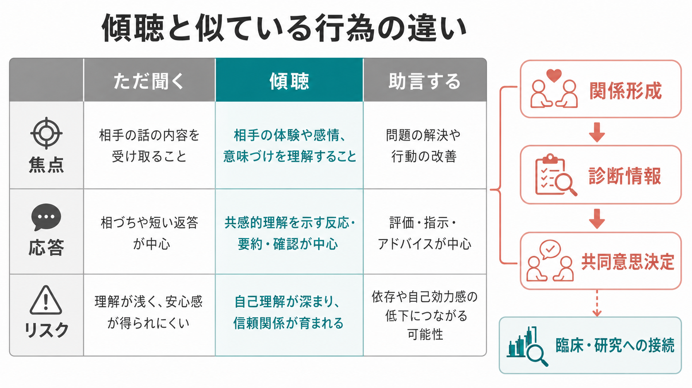
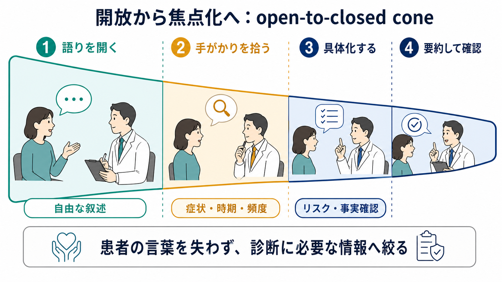
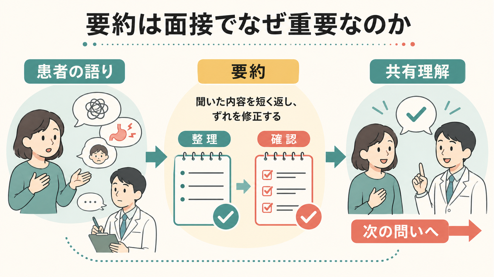

# 傾聴とは何か

## 要点

- 傾聴とは、患者の語りを早く分類・訂正・助言する前に、出来事、意味づけ、感情、生活上の困難を受け取り、理解を確認しながら面接を進める姿勢と技法である。
- 「ただ黙って聞く」ことではない。開かれた問い、沈黙、相づち、反映、要約、確認を使って、患者が自分の経験を言葉にできる場を作る。
- 精神科面接では、傾聴は [[共感的理解とは何か|共感的理解]]、[[治療関係とは何か|治療関係]]、診断情報の収集、共同意思決定の土台になる。
- ただし傾聴は安全評価や診断を先送りする口実ではない。自傷他害リスク、せん妄、身体疾患、薬物影響などは、患者の語りを尊重しながら必要に応じて構造化して確認する。

## この記事で答える問い

1. 傾聴は、単に相手の話を聞くことや同意することと何が違うのか。
2. 精神科面接では、患者の自由な語りと診断に必要な情報収集をどう両立するのか。
3. 傾聴は、共感、治療関係、診断、行動変容、共同意思決定にどう接続するのか。
4. 傾聴を使うとき、どのような限界や誤解に注意するべきか。

## まず結論

傾聴とは、患者の話を遮らずに受け止めるだけでなく、患者が何を経験し、それをどう意味づけ、どの感情や困難を抱えているのかを、面接者が仮説として理解し、その理解を短く返して確認する臨床技法である。Rogers は治療的人格変化の条件として、治療者の一致性、無条件の肯定的関心、クライエントの内的参照枠への共感的理解を重視した[1]。この流れの中で、傾聴は「専門家がすぐ解釈する」のではなく、「本人の経験世界に近づき、本人の訂正を受けながら理解する」姿勢として発展した。

臨床的には、傾聴は面接の最初だけに行う雰囲気づくりではない。患者が自由に話す段階、症状・時期・頻度を具体化する段階、リスクや鑑別を確認する段階、治療方針を共有する段階のすべてで働く。たとえば、患者が「もう限界です」と話したとき、すぐに「休みましょう」と助言する前に、「何が限界に感じられるのか」「いつからそうなったのか」「身体、仕事、家族、睡眠、安全面にどう出ているのか」を、患者の言葉を失わない形で整理する。

## 背景

精神医学の面接では、症状名を早く当てることだけでは不十分である。同じ「不眠」でも、うつ病、不安、躁状態、PTSD、身体疾患、薬剤、生活リズム、職場環境、家庭内ストレスによって意味が変わる。したがって、[[現病歴はどのように構造化するべきか|現病歴]] や [[生活歴はなぜ重要なのか|生活歴]] を聞く前提として、患者が何を問題として感じ、何を恐れ、何を守ろうとしているのかを聞く必要がある。

患者中心の医療コミュニケーションでは、早期に開かれた質問で患者のアジェンダを引き出し、早すぎる遮りを避け、焦点化された能動的傾聴を行うことが重視される[4]。これは時間を無制限に使うという意味ではない。むしろ、最初に語りを開き、途中で手がかりを拾い、後半で必要な情報へ焦点化することで、診断と関係形成の両方を支える。

NICE の成人メンタルヘルスサービス利用者経験ガイドラインも、医療者が希望と楽観性のある雰囲気で、信頼できる、支持的で、共感的で、非審判的な関係を築くことをケアの重要部分として位置づけている[3]。傾聴はこの関係性を作る具体的な行為である。

## 基本概念

### 傾聴

傾聴は、患者の語りを「情報」としてだけでなく、「その人の経験の組織化」として聞くことである。面接者は、症状、出来事、時系列、生活機能、安全リスクを聞き取ると同時に、患者がどの言葉を選び、どこで迷い、どの感情を避け、何を強調するのかにも注意を向ける。

臨床的共感の定義では、患者の状況、視点、感情、それに付随する意味を理解し、その理解を伝え、正確さを確認し、その理解にもとづいて患者とともに有用な行動をとることが重視される[2]。傾聴は、この「理解する」「伝える」「確認する」の部分を支える面接上の基礎である。

### 能動的傾聴

能動的傾聴は、黙って耐えることではない。面接者は、短い促し、沈黙、患者の言葉の反復、感情の反映、要約、確認を通じて、患者が自分の話を展開しやすいようにする。必要な場面では、「ここまでを確認してもよいですか」「今の話は、いつ頃から始まりましたか」のように、語りを壊さず焦点化する。

### 反映・要約・確認

反映は、患者の言葉や感情を面接者が短く返すことである。要約は、複数の発言を整理して患者と共有することである。確認は、「この理解で合っていますか」と患者に修正の余地を残すことである。これらは面接者の理解を押しつけるためではなく、患者が「違います」「それもありますが、むしろ」と言える余地を作るために行う。

## 仕組み

傾聴の中心には、患者の語りを開き、手がかりを拾い、必要な情報へ焦点化し、最後に共有理解へまとめる流れがある。医療面接の教育では、患者に早く自由に話してもらい、途中から症状、時期、頻度、重症度、関連因子を構造化して聞くことが推奨される[4]。

1. 語りを開く。  
   「今日は何がいちばん気になって来られましたか」「もう少し聞かせてください」といった開かれた問いで、患者が自分の順番で話せる入口を作る。

2. 沈黙と待機を使う。  
   患者が言葉を探しているとき、面接者がすぐ選択肢や解釈を差し込むと、重要な意味づけが失われることがある。短い沈黙は、回避ではなく、患者が自分の言葉を見つけるための時間になる。

3. 手がかりを拾う。  
   患者の「大丈夫です」「もう慣れました」「迷惑をかけたくない」といった短い言葉には、羞恥、罪責感、孤立、諦めが含まれることがある。面接者は「大丈夫と言いながら、かなり無理をされている感じもあります」と仮に返す。

4. 具体化する。  
   傾聴は抽象的な感情だけに留まらない。症状の開始時期、持続、頻度、悪化・軽減因子、機能障害、安全面を確認し、[[精神科診断における除外診断とは何か|除外診断]] や [[精神科診断は何のためにあるのか|診断の目的]] へつなげる。

5. 要約して確認する。  
   「ここまででは、眠れないこと自体もつらいが、それ以上に仕事で迷惑をかける不安が大きい、という理解で合っていますか」のように返す。患者が訂正できることが、傾聴の質を上げる。

## 図解

図1は、傾聴を「ただ聞く」「助言する」と比較し、焦点、応答、リスクの違いを示している。傾聴は、患者の体験や感情、意味づけを理解することに焦点を置き、反映・要約・確認を中心に進む。

図2は、面接の流れを「開放から焦点化へ」として表している。最初から閉じた質問だけで進めると、患者の言葉が痩せる。一方で、最後まで自由連想だけにすると、診断や安全評価に必要な情報が不足する。傾聴は、この二つを往復する技法である。

図3は、要約の役割を示している。要約は単なるメモの読み上げではなく、患者の語りを一度整理し、ずれを修正し、共有理解へ進むための節目である。

## 臨床・研究との接続

### 精神科面接

精神科面接では、傾聴は診断の前段階ではなく、診断そのものの質を支える。患者が最初に語る主訴は、診断基準の言葉とは違うことが多い。「動けない」「怖い」「自分ではない感じがする」「頭が回らない」といった表現から、症状、身体状態、生活環境、対人関係、安全リスクを丁寧にほどく必要がある。これは [[精神科初診で何を確認するべきか]] と強く接続する。

### 心理療法と治療関係

心理療法研究では、治療者の共感は治療アウトカムと関連する重要な関係要因として扱われている。Elliott らのメタ分析では、治療者の共感と心理療法アウトカムの間に中等度の関連が報告された[5]。ただし、これは「共感だけで治る」という意味ではない。傾聴は、技法、診断、薬物療法、心理社会的支援が患者に届くための関係的条件として理解するのがよい。

### 行動変容とモチベーション面接

モチベーション面接では、開かれた質問、是認、反映的傾聴、要約を通じて、本人の価値や両価性を探索する。SAMHSA の TIP 35 は、物質使用症治療における動機づけ強化アプローチとして、反映的傾聴や協働的な態度を重視している[6]。助言や説得を急ぐ前に、本人が何を変えたいのか、何を失うことを恐れているのかを聞くことが、変化への入口になる。

### 医療コミュニケーションとアドヒアランス

医師患者コミュニケーションと治療アドヒアランスを扱ったメタ分析では、医師のコミュニケーションの質が患者の治療遵守と関連し、コミュニケーション訓練も一定の効果を持つことが示された[7]。傾聴は、患者が治療に同意するよう説得する技術ではなく、患者の理解、懸念、生活上の実行可能性を明らかにし、治療計画を現実に合わせるための技術である。

### 現代の精神医療

近年の精神科領域では、電子カルテ、オンライン診療、短時間診療などにより、患者の語りが中断されやすい環境が増えている。精神科における mindful listening と mentalizing を扱う論文は、患者中心ケアを人間化するために、注意深い聴取と相手の心的状態を仮説として理解する態度が重要であると論じている[8]。これは、傾聴を単なる接遇ではなく、臨床判断の質に関わる実践として捉える視点である。

## よくある誤解

### 「傾聴は、ただ相手の話に同意すること」

傾聴は同意ではない。患者が「自分には価値がない」と語るとき、面接者はその内容に賛成しない。むしろ、「そう感じるほど追い詰められている」「失敗を自分全体の価値と結びつけている」可能性を確認する。発言の真偽と、その発言が患者にとって持つ意味は分けて扱う。

### 「傾聴すれば、質問してはいけない」

傾聴は質問を禁止しない。開かれた問いで語りを開き、必要に応じて閉じた質問で時期、頻度、重症度、安全面を確認する。問題は質問そのものではなく、面接者の都合だけで患者の語りを早く狭めることである。

### 「傾聴は時間がかかるだけで、診断には役立たない」

患者の自由な語りを許すことは、診断に必要な情報を減らすとは限らない。早すぎる遮りは、患者の本当の懸念や安全情報を遅れて出させることがある。傾聴は、診断と関係形成を分けるのではなく、患者が重要情報を語れる条件を作る。

### 「傾聴は安全評価より優先される」

安全評価は必要である。希死念慮、暴力リスク、せん妄、虐待、身体疾患、物質使用などが疑われる場合は、面接者が明確に確認する必要がある。ただし、その確認も「危ない人かどうかを判定する」だけでなく、「何がその危険を高め、何が保護因子になっているか」を理解する傾聴の中で行われる。

## 関連ノート

- [[共感的理解とは何か]]
- [[治療関係とは何か]]
- [[精神科初診で何を確認するべきか]]
- [[現病歴はどのように構造化するべきか]]
- [[生活歴はなぜ重要なのか]]
- [[精神科診断は何のためにあるのか]]
- [[精神科診断における除外診断とは何か]]
- [[生物心理社会モデルとは何か]]

MOC更新候補: `content/00_MOC/` 配下の精神医学、診断・面接、臨床実践関連 MOC に、本記事 `[[傾聴とは何か]]` を追加する。ただし並列ジョブとの衝突を避けるため、このタスクでは MOC 本体は更新しない。

今後の作成候補:

- 精神科面接で沈黙をどう使うか
- 反映的傾聴とは何か
- 共同意思決定とは何か
- 医療面接における開かれた質問と閉じた質問

## 理解チェック

1. 傾聴が「ただ聞く」ことや「同意する」ことと違う点を、反映・要約・確認の観点から説明できるか。
2. 患者の自由な語りを尊重しながら、症状、時期、頻度、安全面をどのように焦点化して聞けるか。
3. 傾聴が、共感的理解、治療関係、診断情報、共同意思決定にどうつながるか。
4. 自傷他害リスクやせん妄が疑われる場面で、傾聴と安全評価をどう両立するか。

## 参考文献

[1] Rogers, C. R. (1957). The necessary and sufficient conditions of therapeutic personality change. *Journal of Consulting Psychology*, 21(2), 95-103. https://doi.org/10.1037/h0045357

[2] Mercer, S. W., & Reynolds, W. J. (2002). Empathy and quality of care. *British Journal of General Practice*, 52(Suppl), S9-S12. https://pmc.ncbi.nlm.nih.gov/articles/PMC1316134/

[3] National Institute for Health and Care Excellence. (2011). *Service user experience in adult mental health: improving the experience of care for people using adult NHS mental health services* (NICE Clinical Guideline 136). https://www.ncbi.nlm.nih.gov/books/NBK612040/

[4] Hashim, M. J. (2017). Patient-centered communication: Basic skills. *American Family Physician*, 95(1), 29-34. https://www.aafp.org/pubs/afp/issues/2017/0101/p29.html

[5] Elliott, R., Bohart, A. C., Watson, J. C., & Greenberg, L. S. (2011). Empathy. *Psychotherapy*, 48(1), 43-49. https://doi.org/10.1037/a0022187

[6] Substance Abuse and Mental Health Services Administration. (2019). *TIP 35: Enhancing motivation for change in substance use disorder treatment*. https://library.samhsa.gov/product/tip-35-enhancing-motivation-change-substance-use-disorder-treatment/pep19-02-01-003

[7] Haskard Zolnierek, K. B., & DiMatteo, M. R. (2009). Physician communication and patient adherence to treatment: A meta-analysis. *Medical Care*, 47(8), 826-834. https://doi.org/10.1097/MLR.0b013e31819a5acc

[8] Bazargan-Hejazi, S., Shirazi, A., Shervington, D., Amani, S., & Shay, W. (2022). Addressing patient-centered care through mindful listening and mentalizing in psychiatry. *Focus*, 20(4), 409-410. https://doi.org/10.1176/appi.focus.20220046

