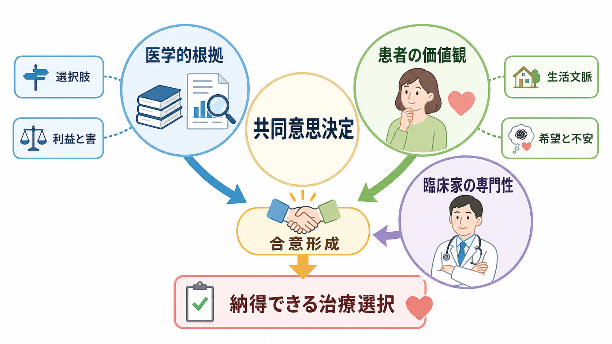
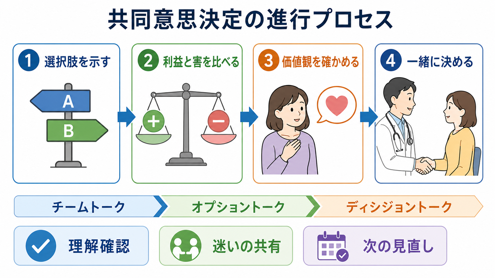

# 共同意思決定とは何か

## 要点

- 共同意思決定とは、患者と医療者が、医学的根拠、治療選択肢、利益と害、患者の価値観や生活文脈を共有し、最終的な方針を一緒に決めるプロセスである[1][2]。
- 単なる説明、同意取得、説得、患者への丸投げではない。医療者の専門性と患者の経験的専門性を、同じ意思決定の場に置く点が重要である[3][4]。
- 精神科では、症状、病識、認知機能、家族・支援者、強制性、危機対応が意思決定に影響するため、共同意思決定は[[精神科面接とは何か|精神科面接]]、[[治療関係とは何か|治療関係]]、[[インフォームドコンセントとは何か|インフォームドコンセント]]と密接につながる。
- 意思決定支援ツールは知識、リスク理解、価値に沿った選択を改善しうるが、面接そのものを置き換えるものではない[5]。
- 精神健康領域の介入研究では、本人が意思決定に参加したと感じる短期的効果は示唆される一方、症状や再入院などの臨床転帰については不確実性が残る[6]。

## この記事で答える問い

1. 共同意思決定は、通常の説明や同意取得と何が違うのか。
2. 患者の価値観と医学的根拠は、どのように同じ治療選択に統合されるのか。
3. 精神科臨床では、どの場面で共同意思決定が特に重要になるのか。
4. 共同意思決定を過度に理想化しないために、どの限界を押さえるべきか。

## まず結論

共同意思決定は、「医療者が正解を説明し、患者が従う」モデルでも、「患者が一人で選ぶ」モデルでもない。医療者は、診断、予後、治療選択肢、利益と害、不確実性をわかりやすく提示する。患者は、自分にとって何が大切か、何が不安か、どの負担なら受け入れられるかを語る。両者は、その情報を突き合わせて、いまの状況で実行可能で納得できる方針を作る[1][3]。

精神科では、このプロセスは特に重要である。薬物療法、心理療法、休職・復職、入院、家族支援、再発予防、危機時対応などは、医学的効果だけで決めにくい。副作用、スティグマ、仕事や学業、家族関係、本人の回復像、治療への不信や過去の体験が、選択の意味を大きく変えるからである。

## 背景

共同意思決定は、患者中心医療の中核として発展してきた。NICE のガイドライン NG197 は、共同意思決定を日常診療に組み込むため、組織文化、トレーニング、リスク・利益・結果の伝え方、意思決定支援ツールの活用を推奨している[1]。AHRQ の SHARE Approach も、患者参加を求め、選択肢を比較し、価値観を確認し、共同で決め、後で見直すという一連のプロセスとして整理する[2]。一方で、日常診療への実装には、意思決定が必要な場面を認識すること、利用可能な最良の根拠を理解すること、患者の価値観を組み込むことを、診療体制と教育の中に埋め込む必要がある[8]。

歴史的には、Charles らが「少なくとも二者が関与し、情報を共有し、双方が好ましい治療について意見を示し、合意に至る」という治療意思決定モデルを定式化した[7]。その後、Elwyn らは臨床で教えやすい形として、選択肢の存在を共有する「チームトーク」、選択肢の利益と害を比較する「オプショントーク」、本人の価値観を踏まえて方針を選ぶ「ディシジョントーク」を提案した[4]。

## 基本概念

共同意思決定を理解するには、三つの情報源を分けて考えるとよい。

第一に、医学的根拠である。診断、重症度、自然経過、治療効果、副作用、再発リスク、モニタリング方法などが含まれる。ここでは、エビデンスの確実性だけでなく、本人にどの程度当てはまるかも問題になる。

第二に、患者の価値観である。価値観とは、抽象的な信念だけでなく、「眠気は困る」「体重増加は避けたい」「再発予防を優先したい」「薬を増やすより心理療法を試したい」「家族には知られたくない」といった具体的な優先順位を含む。

第三に、実行可能性である。費用、通院頻度、服薬回数、家族の協力、仕事、通学、認知機能、住環境、危機時の支援資源が、治療の現実性を左右する。[[生物心理社会モデルとは何か|生物心理社会モデル]]で考えると、治療選択は生物学的効果だけではなく、心理的受け入れや社会的条件と結びついている。

このため、共同意思決定は[[意思決定とは何か|意思決定]]の一般論を臨床に持ち込むだけでは足りない。医療者が専門的情報を構造化し、患者が自分の生活と言葉に引き寄せて評価できるよう支える必要がある。

## 仕組み

共同意思決定は、面接中の一回の質問ではなく、小さな循環として進む。

1. 決めるべきことを明確にする。
   「薬を飲むか」ではなく、「今の不眠と再発リスクを考え、薬物療法、心理教育、睡眠調整、経過観察をどう組み合わせるか」のように、意思決定の対象を具体化する。

2. 選択肢を示す。
   選択肢は、治療あり・なしだけではない。薬の種類、用量、開始時期、心理療法、生活調整、家族支援、フォロー頻度、危機時プランなどを含む。

3. 利益と害を比較する。
   治療効果、発現までの時間、副作用、費用、通院負担、治療しない場合のリスクを、本人が理解できる言葉で説明する。数字を使う場合は、絶対リスク、自然頻度、時間軸を示すと誤解が減りやすい[1]。

4. 価値観と懸念を確認する。
   「どの副作用が一番心配ですか」「仕事を続けるうえで避けたいことは何ですか」「再発予防と眠気の少なさでは、どちらをより重視しますか」のように、比較の軸を患者の生活に戻す。

5. 合意し、見直しを予定する。
   決定は固定された終点ではない。効果、副作用、生活への影響を確認し、必要なら修正する。特に精神科では、状態が変動するため、見直しを前提にすることが本人の安心感につながる。

この流れでは、[[要約は面接でなぜ重要なのか|要約]]が重要になる。医療者が「ここまででは、再発予防は大切だが、日中の眠気は避けたいという理解で合っていますか」と返すことで、患者は訂正しやすくなる。これは[[ラポールはどのように形成されるのか|ラポール]]や治療同盟を支える具体的な行動でもある。

## 図解

### 図1: 全体像

1枚目の図は、医学的根拠、患者の価値観、臨床家の専門性が、合意形成を通じて納得できる治療選択へ向かうことを示している。ポイントは、「患者の価値観」が医学的根拠の外側にある飾りではなく、選択を決める中心的情報だという点である。

### 図2: プロセス

2枚目の図は、選択肢の提示、利益と害の比較、価値観の確認、共同決定という流れを示している。AHRQ の SHARE Approach と Elwyn らの three-talk model は表現が違うが、どちらも「選択肢があることを明確にし、比較し、本人にとっての意味を確認する」ことを重視する[2][4]。

## 臨床・研究との接続

### 精神科薬物療法

抗うつ薬、気分安定薬、抗精神病薬、睡眠薬などでは、効果と副作用のバランスが本人の生活に直結する。例えば、再発予防を重視する人と、日中の眠気や体重増加を強く避けたい人では、同じ薬の評価が変わる。ここで共同意思決定を行うと、アドヒアランスを単なる服従ではなく、本人が納得して継続できる治療計画として考えやすくなる。

### 心理療法・生活支援

心理療法、デイケア、家族支援、就労支援、ピアサポートなどは、本人の目標と合っていなければ継続しにくい。[[自己決定理論とは何か|自己決定理論]]の観点からも、自律性、関係性、有能感が支えられるほど、行動変容は本人のものになりやすい。共同意思決定は、[[モチベーション面接は行動変容をどう支えるのか|モチベーション面接]]と同様に、説得よりも本人の理由を明確にする。

### 意思決定支援ツール

意思決定支援ツールは、選択肢、利益と害、価値の明確化を整理するパンフレット、動画、ウェブツールなどである。Cochrane レビューでは、通常ケアに比べて、患者の知識、リスク認識、価値に沿った選択、意思決定への能動的参加が改善することが示されている[5]。ただし、ツールは面接の代替ではない。患者が何を心配しているか、説明をどう受け取ったかを確認する対話が必要である。

### 精神健康領域のエビデンス

精神健康領域の共同意思決定介入を扱った Cochrane レビューでは、15件のRCT、3141人を対象に検討され、介入直後の本人報告による参加感は改善する可能性がある一方、症状、回復、再入院、治療継続などの効果は不確実とされた[6]。これは「共同意思決定に意味がない」というより、精神科臨床では症状、制度、家族、支援資源、危機対応が複雑に絡むため、単純なアウトカムだけで評価しにくいことを示している。

## よくある誤解

### 誤解1: 共同意思決定は、患者にすべて決めてもらうことである

共同意思決定は丸投げではない。医療者は、医学的に妥当な選択肢と推奨を示す責任を持つ。ただし、その推奨は患者の価値観や生活条件を聞いたうえで調整される。

### 誤解2: エビデンスがあれば共同意思決定は不要である

エビデンスは平均的な効果と害を示すが、どの利益や害を重く見るかは患者によって異なる。特に、効果が近い複数の選択肢がある場合、価値観の確認が不可欠になる。

### 誤解3: 共同意思決定は時間がかかりすぎる

時間が必要な場面はあるが、精神健康領域のレビューでは、共同意思決定介入が診察時間を大きく延ばすとは限らないことも示されている[6]。重要なのは、すべてを長く説明することではなく、決めるべき点、比較すべき選択肢、本人が重視する軸を明確にすることである。

### 誤解4: 精神症状がある人には共同意思決定は難しい

症状が重いとき、認知機能が低下しているとき、切迫した安全リスクがあるときには、意思決定能力や緊急性に応じた対応が必要である。しかし、それは共同意思決定を一律に除外する理由ではない。情報量を減らす、選択肢を絞る、家族や支援者を同席させる、時間を分ける、後で見直すなどの調整によって、本人の参加を支えることができる。

## 関連ノート

- [[精神科面接とは何か]]
- [[治療関係とは何か]]
- [[ラポールはどのように形成されるのか]]
- [[要約は面接でなぜ重要なのか]]
- [[インフォームドコンセントとは何か]]
- [[意思決定とは何か]]
- [[自己決定理論とは何か]]
- [[モチベーション面接は行動変容をどう支えるのか]]

関連ノート候補: 「コンコーダンスとは何か」「アドヒアランスとは何か」「意思決定支援ツールとは何か」「精神科薬物療法における副作用説明とは何か」「治療同盟とは何か」。

MOC更新候補: `content/00_MOC/MOC｜精神医学.md` と `content/00_MOC/MOC｜臨床実践・治療.md` の「精神科面接」「治療計画」「医療コミュニケーション」領域に追加する。ただし並列ジョブとの衝突を避けるため、本タスクではMOC本体は更新しない。

## 理解チェック

1. 共同意思決定は、インフォームドコンセントとどの点で重なり、どの点で異なるか。
2. 医学的根拠、患者の価値観、実行可能性のうち、精神科薬物療法で特に見落とされやすいものは何か。
3. 「治療しない」という選択肢は、共同意思決定でどのように扱うべきか。
4. 精神症状が重い場面で、本人の参加を支えるためにどのような調整ができるか。
5. 意思決定支援ツールが有用でも、面接が不要にならないのはなぜか。

## 未解決問題

- 精神科の共同意思決定を、症状改善、回復、生活機能、本人の納得感のどの指標で評価するのが妥当か。
- 急性期、強制入院、リスク管理が必要な場面で、本人の参加と安全確保をどう両立するか。
- 家族、支援者、多職種チームが関与する意思決定で、本人の価値観をどのように中心に置くか。
- デジタル意思決定支援ツールを使うとき、低リテラシー、認知機能低下、言語・文化差への配慮をどう設計するか。

## 参考文献

[1] National Institute for Health and Care Excellence. (2021). *Shared decision making: NICE guideline NG197*. https://www.nice.org.uk/guidance/ng197

[2] Agency for Healthcare Research and Quality. (2020). *The SHARE Approach Essential Steps of Shared Decision Making*. https://www.ahrq.gov/health-literacy/curriculum-tools/shareddecisionmaking/tools/shareposter/index.html

[3] Elwyn, G., Frosch, D., Thomson, R., Joseph-Williams, N., Lloyd, A., Kinnersley, P., et al. (2012). Shared decision making: a model for clinical practice. *Journal of General Internal Medicine, 27*(10), 1361-1367. https://doi.org/10.1007/s11606-012-2077-6

[4] Elwyn, G., Durand, M. A., Song, J., Aarts, J., Barr, P. J., Berger, Z., et al. (2017). A three-talk model for shared decision making: multistage consultation process. *BMJ, 359*, j4891. https://doi.org/10.1136/bmj.j4891

[5] Stacey, D., Lewis, K. B., Smith, M., Carley, M., Volk, R., Douglas, E. E., et al. (2024). Decision aids for people facing health treatment or screening decisions. *Cochrane Database of Systematic Reviews, 2024*(1), CD001431. https://doi.org/10.1002/14651858.CD001431.pub6

[6] Aoki, Y., Yaju, Y., Utsumi, T., Sanyaolu, L., Storm, M., Takaesu, Y., et al. (2022). Shared decision-making interventions for people with mental health conditions. *Cochrane Database of Systematic Reviews, 2022*(11), CD007297. https://doi.org/10.1002/14651858.CD007297.pub3

[7] Charles, C., Gafni, A., & Whelan, T. (1997). Shared decision-making in the medical encounter: what does it mean? Or it takes at least two to tango. *Social Science & Medicine, 44*(5), 681-692. https://doi.org/10.1016/S0277-9536(96)00221-3

[8] Légaré, F., & Witteman, H. O. (2013). Shared decision making: examining key elements and barriers to adoption into routine clinical practice. *Health Affairs, 32*(2), 276-284. https://doi.org/10.1377/hlthaff.2012.1078
