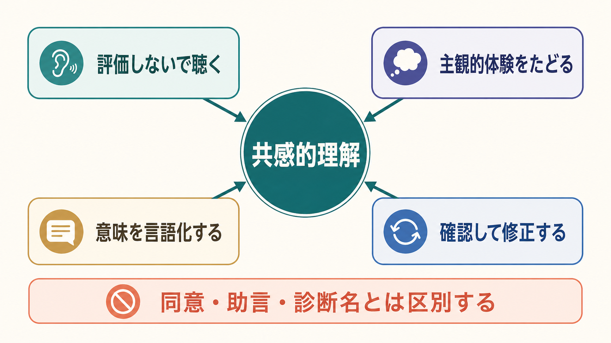
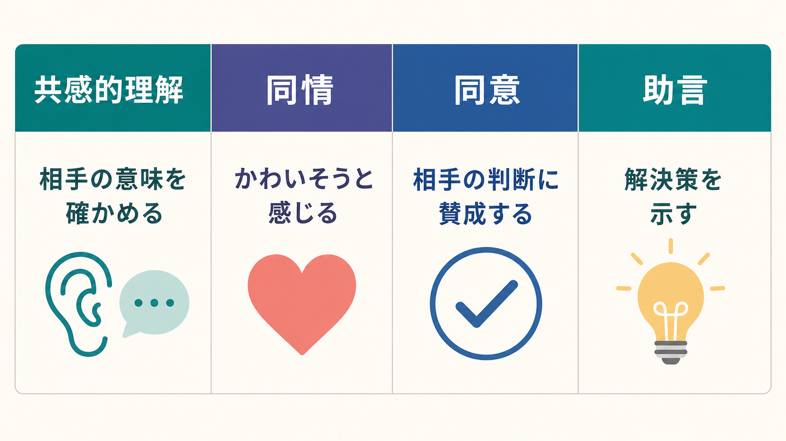
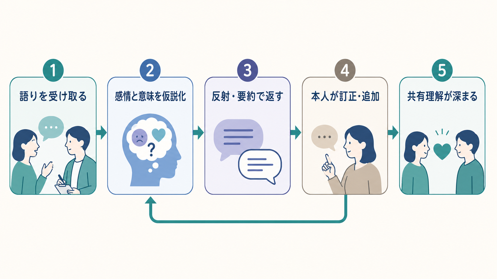

# 共感的理解とは何か

## 要点

- 共感的理解とは、患者の語りを「正しいか／間違っているか」とすぐ評価せず、患者自身の内的な参照枠から、状況・感情・意味づけを理解しようとする面接技法である[1][2]。
- 臨床的には、理解したつもりになることではなく、反射・要約・確認を通じて「いまの理解で合っているか」を患者に返し、修正してもらう循環である[3]。
- 共感的理解は、同情、同意、助言、診断名の付与とは異なる。相手の判断に賛成しなくても、相手にとって何が起きているかを理解しようとする態度は成立する。
- 精神医学的面接では、主観的体験、生活史、文化、対人関係、身体状態、安全面を統合して理解するための基盤になる。ただし、個別診断や治療指示は専門家による評価に基づく必要がある。

## この記事で答える問い

1. 共感的理解は、単なる「やさしい態度」や「同情」と何が違うのか。
2. 精神医学的面接では、どのような手順で患者の主観的体験を理解するのか。
3. 共感的理解は、診断、心理療法、共同意思決定、研究にどう接続するのか。
4. 共感的理解を使うとき、どのような誤解や限界に注意すべきか。

## まず結論

共感的理解とは、患者の経験世界を患者の側からたどり、その理解を言葉にして返し、患者本人の訂正を受けながら精度を上げる面接上の働きである。Rogers は心理療法の重要条件として、治療者がクライエントの内的な参照枠を共感的に理解し、それを伝えようとすることを位置づけた[1]。この考えは、人間性心理学だけでなく、現在の医療コミュニケーション、心理療法研究、患者中心のケアにも広く接続している。

重要なのは、共感的理解が「患者の言うことをすべて肯定する」ことではない点である。たとえば、患者が「自分は価値がない」と語るとき、面接者はその内容に同意する必要はない。むしろ、「そう感じるほど追い詰められている」「失敗を自分全体の価値に結びつけている」「誰にも迷惑をかけたくないという思いが強い」といった意味の構造を丁寧に確認する。ここで理解されるのは、発言の真偽だけではなく、発言がその人の生活史、感情、身体感覚、対人関係の中でどのような意味を持つかである。

## 背景

精神医学は、症状の有無だけでなく、本人の苦痛、生活機能、対人関係、文化的背景、身体状態を扱う領域である。したがって、面接では「何の症状があるか」と同時に、「その症状が本人にとってどう経験されているか」を聞く必要がある。これは [[精神医学は他の医学分野と何が違うのか]] や [[主観的経験は科学的に扱えるのか]] と接続する問題である。

Rogers のクライエント中心療法では、共感的理解、無条件の肯定的関心、一致性が、治療関係を支える中核条件として扱われた[1][2]。その後の心理療法研究でも、治療同盟、協働、目標の共有、共感などの関係要因は、特定技法だけでは説明できない治療過程の重要な部分として検討されている[4]。

医療全般でも、患者中心のケアでは、患者を「疾患を持つ身体」ではなく、固有の価値観、希望、不安、生活文脈を持つ人として理解することが重視される。NICE は成人医療サービス、成人メンタルヘルスサービスの質基準で、共感・尊厳・敬意を患者経験の基礎として位置づけている[5][6]。

## 基本概念

### 共感的理解

共感的理解は、相手の経験を自分の評価軸で急いで分類するのではなく、相手の視点から「世界がどう見えているか」を仮にたどる行為である。ここには、認知的な視点取得、情動的な反応、言語的な確認、治療的な応答が含まれる。

Mercer と Reynolds は、臨床的共感を、患者の状況・視点・感情とそれに付随する意味を理解し、その理解を伝えて正確さを確認し、患者とともに有用な形で行動する能力として整理している[3]。この定義が有用なのは、共感を「内側で感じること」だけに閉じず、「患者に伝わり、確認され、ケアに反映されること」まで含めている点である。

### 同情・同意・助言との違い

同情は「かわいそうだ」と感じる反応であり、共感的理解の一部になることはあるが、それだけでは患者の意味世界を理解したことにはならない。同意は、患者の判断や主張に賛成することである。助言は、面接者が解決策を示すことである。共感的理解は、そのどれとも一致しない。

たとえば、患者が「もう仕事に戻れない」と話す場合、同情は「つらいですね」、同意は「戻らない方がいいですね」、助言は「休職を延長しましょう」に近い。共感的理解は、「戻りたい気持ちもある一方で、また崩れるのではないかという恐怖が大きい、という感じでしょうか」のように、患者の中の葛藤や意味づけを仮説として返す。必要なら助言や診断も行われるが、それらは共感的理解を飛ばして行うものではない。

### 主観的体験を評価しないとは何か

「評価しない」とは、安全リスクや現実検討を無視することではない。精神医学的面接では、自傷他害リスク、せん妄、身体疾患、薬物影響、虐待、セルフネグレクトなどを評価する責任がある。ここでいう評価しないとは、患者が語り始めた瞬間に「大げさ」「認知が歪んでいる」「病識がない」と閉じるのではなく、まずその体験が患者にとってどのように成立しているかを聞くという意味である。

## 仕組み

共感的理解は、面接者の頭の中で一回だけ起こる推測ではなく、対話の中で更新される循環である。

1. 患者の語りを受け取る。  
   面接者は、症状名だけでなく、出来事、身体感覚、感情、思考、生活上の影響、対人関係を聞く。

2. 感情と意味を仮説化する。  
   「怒り」「不安」「恥」「孤独」などの感情と、「見捨てられた」「失敗した」「迷惑をかけた」などの意味づけを仮に置く。

3. 反射・要約で返す。  
   面接者は「つまり、A という出来事そのものよりも、B と受け取られたことが大きかったのですね」のように、患者の言葉に近い形で返す。

4. 患者が訂正・追加する。  
   患者が「少し違います」「それもありますが、むしろ...」と修正できることが重要である。ここで面接者の理解は精密になる。

5. 共有理解が深まる。  
   患者と面接者の間で、「何に困っているのか」「何が維持因子か」「どこから支援できるか」が共有される。

この循環は、[[インタビュー研究とは何か]] で扱われる質的面接の考え方とも一部重なる。ただし、臨床面接は研究面接ではなく、安全評価、診断、支援、治療関係を同時に扱う点が異なる。

## 図解

図1は、共感的理解を「評価しないで聴く」「主観的体験をたどる」「意味を言語化する」「確認して修正する」という4要素で示している。図2は、理解が面接者から患者へ一方向に与えられるのではなく、患者の訂正によって更新される循環であることを示す。図3は、共感的理解と同情・同意・助言の違いを整理している。

これらの図は、共感的理解を「雰囲気のよい会話」ではなく、臨床面接の中で反復される具体的な技法として見るための補助線である。

## 臨床・研究との接続

### 精神医学的面接

精神医学的面接では、診断基準に該当する症状を確認するだけでは不十分である。同じ「不眠」でも、身体疾患、薬物、うつ、不安、躁状態、PTSD、生活リズム、家庭環境、職場ストレスによって意味が変わる。共感的理解は、症状の背景にある本人の語りを聞き取り、[[精神科診断は何のためにあるのか]] や [[精神科診断における除外診断とは何か]] と接続する臨床判断を支える。

### 心理療法と治療関係

心理療法研究では、治療者の共感は、治療同盟や協働とともに重要な関係要因として扱われる[4]。これは、どの技法も「誰が、どの関係の中で、どのように届けるか」によって効果が変わることを示している。共感的理解は、技法の前にある礼儀ではなく、技法が患者に届くための通路である。

### 患者中心の医療コミュニケーション

医療面接における共感的・肯定的コミュニケーションを扱った系統的レビューとメタ分析では、共感的な診察や肯定的期待の伝達が、痛み、不安、満足度などに小さいが有意な利益をもたらす可能性が示された[7]。ただし、効果量は大きくなく、介入の内容や文脈にもばらつきがある。したがって、共感的理解は万能薬ではなく、診断、治療、環境調整、社会的支援と組み合わせて使う必要がある。

### モチベーション面接

[[モチベーション面接は行動変容をどう支えるのか]] では、反射的傾聴、開かれた質問、是認、要約などを通じて、本人の変化理由を本人の言葉として引き出す。SAMHSA の TIP 35 でも、動機づけ面接では共感を表すこと、両価性を探索すること、反射的傾聴を用いることが重視される[8]。共感的理解は、行動変容を押しつける前に、本人が何に価値を置き、何に抵抗し、何を恐れているかを理解するための前提になる。

## よくある誤解

### 「共感的理解は、相手に同意すること」

同意しなくても共感的理解はできる。たとえば、被害的な確信、強い自己否定、怒りに満ちた語りに対して、面接者は内容をそのまま事実認定する必要はない。しかし、その確信がどのような恐怖、孤立、過去経験、身体感覚、対人文脈の中で生じているかを理解しようとすることはできる。

### 「共感すれば診断やリスク評価はいらない」

共感的理解は、診断やリスク評価の代替ではない。むしろ、患者が安心して語れるほど、希死念慮、暴力リスク、虐待、物質使用、身体症状、生活上の困難が見えやすくなる場合がある。共感は評価を弱めるものではなく、評価の情報品質を高める働きを持つ。

### 「やさしい言葉を使えば共感的である」

やさしい言葉でも、患者の意味づけを外していれば共感的理解にはならない。逆に、短い確認でも、患者が「それが言いたかった」と感じるなら、理解は深まる。重要なのは、表面的な温かさではなく、患者の経験に照準が合っているかである。

### 「面接者が強く感じるほどよい」

共感的理解には、自己他者の区別が必要である。患者の苦痛に巻き込まれすぎると、面接者は急いで慰めたり助言したりしやすくなる。[[自己と他者はどのように区別されるのか]] で扱うように、他者の感情を理解することと、自分の感情として飲み込まれることは区別される。

## 関連ノート

- [[共感は認知機能としてどう理解できるのか]]
- [[心の理論とは何か]]
- [[自己と他者はどのように区別されるのか]]
- [[主観的経験は科学的に扱えるのか]]
- [[インタビュー研究とは何か]]
- [[精神医学は他の医学分野と何が違うのか]]
- [[精神科診断は何のためにあるのか]]
- [[精神科診断における除外診断とは何か]]
- [[生物心理社会モデルとは何か]]
- [[モチベーション面接は行動変容をどう支えるのか]]

## MOC更新候補

- バッチ統合時に `content/00_MOC/MOC｜精神医学.md` の「精神医学的面接」または「総論・診断・面接」領域へ `[[共感的理解とは何か]]` を追加する。
- 心理療法・医療コミュニケーション関連の MOC が整備されている場合、`[[共感は認知機能としてどう理解できるのか]]`、`[[モチベーション面接は行動変容をどう支えるのか]]` との相互参照を検討する。

## 理解チェック

1. 共感的理解は、同情・同意・助言とどのように違うか。
2. 「患者の主観的体験を評価しない」とは、リスク評価をしないという意味ではない。なぜか。
3. 面接者の理解を患者に返して確認することには、どのような臨床的意味があるか。
4. 共感的理解が診断や治療同盟に役立つのは、どのような経路によるか。
5. 共感的理解が過剰な巻き込まれにならないためには、どのような自己他者境界が必要か。

## 未解決問題

- 共感的理解を、面接者の自己評価、患者評価、録音評定、生理指標のどの水準で測るのが妥当か。
- オンライン診療やチャット相談では、非言語情報が少ない中で共感的理解をどう伝えるか。
- 文化的背景、通訳、発達特性、認知機能低下がある場合、患者の主観的体験をどのように確認するか。
- 共感的理解を重視しつつ、安全確保や現実検討が必要な場面で、どの順序で介入するか。

## 参考文献

[1] Rogers, C. R. (1957). The necessary and sufficient conditions of therapeutic personality change. *Journal of Consulting Psychology, 21*(2), 95-103. https://doi.org/10.1037/h0045357

[2] Rogers, C. R. (1975). Empathic: An unappreciated way of being. *The Counseling Psychologist, 5*(2), 2-10. https://doi.org/10.1177/001100007500500202

[3] Mercer, S. W., & Reynolds, W. J. (2002). Empathy and quality of care. *British Journal of General Practice, 52*(Suppl), S9-S12. https://pmc.ncbi.nlm.nih.gov/articles/PMC1316134/

[4] Norcross, J. C., & Wampold, B. E. (2011). Evidence-based therapy relationships: Research conclusions and clinical practices. *Psychotherapy, 48*(1), 98-102. https://doi.org/10.1037/a0022161

[5] NICE. (2019). Quality statement 1: Empathy, dignity and respect. *Patient experience in adult NHS services* (QS15). https://www.nice.org.uk/guidance/qs15/chapter/quality-statement-1-empathy-dignity-and-respect

[6] NICE. (2019). Quality statement 1: Empathy, dignity and respect. *Service user experience in adult mental health services* (QS14). https://www.nice.org.uk/guidance/qs14/chapter/Quality-statement-1-Empathy-dignity-and-respect

[7] Howick, J., Moscrop, A., Mebius, A., Fanshawe, T. R., Lewith, G., Bishop, F. L., Mistiaen, P., Roberts, N. W., Dieninytė, E., Hu, X.-Y., Aveyard, P., & Onakpoya, I. J. (2018). Effects of empathic and positive communication in healthcare consultations: A systematic review and meta-analysis. *Journal of the Royal Society of Medicine, 111*(7), 240-252. https://doi.org/10.1177/0141076818769477

[8] Substance Abuse and Mental Health Services Administration. (2019). *TIP 35: Enhancing Motivation for Change in Substance Use Disorder Treatment*. https://library.samhsa.gov/product/tip-35-enhancing-motivation-change-substance-use-disorder-treatment/pep19-02-01-003
