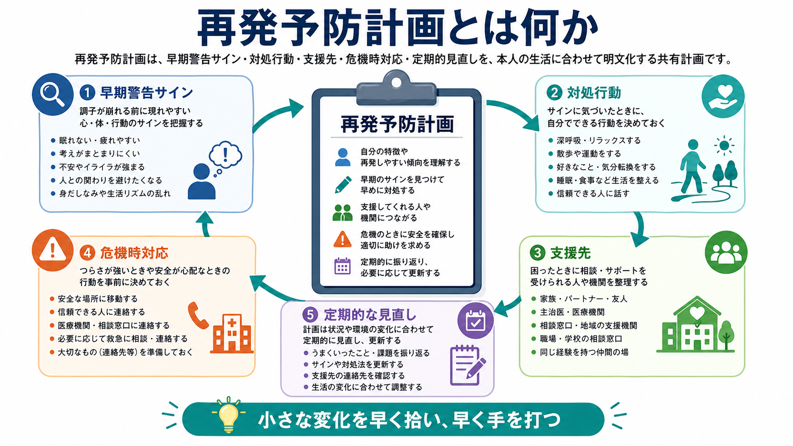
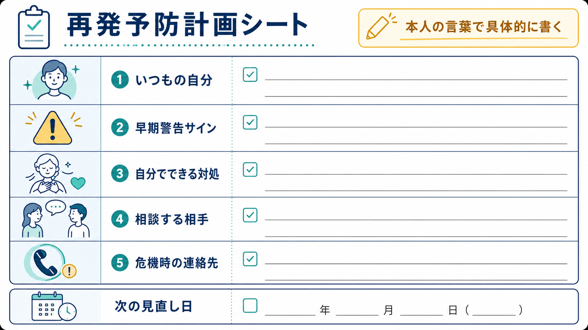

# 再発予防計画とは何か

## 要点

- 再発予防計画とは、症状が大きく崩れる前に現れやすい早期警告サイン、引き金、本人が取れる対処行動、相談先、危機時の連絡手順を、本人・家族・支援者が共有できる形にした計画である。
- 目的は「再発を完全にゼロにすること」ではなく、再燃の波を早く見つけ、重症化・入院・強制的対応・生活機能の低下をできるだけ小さくすることである。
- 有効な計画は、診断名から機械的に作るものではなく、本人の過去の経過、睡眠・対人関係・服薬・物質使用・ストレス反応・強みをもとに個別化する。
- うつ病、双極性障害、統合失調症、物質使用、摂食障害、自傷・自殺リスクなどで使われるが、疾患ごとに警告サインと安全確保の優先順位は異なる。
- 臨床では、[[心理教育とは何か]]、[[共同意思決定とは何か]]、[[アドヒアランスとは何か]]、[[家族面接では何を評価するべきか]]、[[精神科救急では何を優先するべきか]]と接続する。

## この記事で答える問い

1. 再発予防計画は、単なる「気をつけることリスト」と何が違うのか。
2. 早期警告サイン、対処行動、支援先はどのように整理すると実用的になるのか。
3. 研究・ガイドラインでは、再発予防計画や早期警告サインへの介入はどの程度支持されているのか。
4. 臨床で使うとき、本人の自律性と安全確保をどう両立するのか。

## まず結論

再発予防計画は、「調子が悪くなったら相談する」という一般論を、本人の生活に即した具体的な行動手順へ変える道具である。たとえば「睡眠が2日続けて短くなる」「人と会う約束を急に全部断る」「考えが止まらず夜中に活動が増える」といった本人固有のサインを、早期・中等度・危機の段階に分ける。そして各段階に対して、「睡眠を優先する」「予定を減らす」「家族に共有する」「主治医へ連絡する」「救急相談先に連絡する」などの行動をあらかじめ決めておく。

NICE の双極性障害ガイドラインは、本人と可能なら家族・介護者と共同でリスク管理計画を作り、個人の引き金、早期警告サイン、本人の対処、薬物療法上の対応、危機時の連絡先を含めることを勧めている[1]。うつ病の再発予防でも、ストレス状況、警告サイン、回避や反すうなどの不適応的行動を同定し、それぞれに対する具体的な contingency plan を作ることが推奨される[2]。

ただし、計画は「作ったら終わり」ではない。実際に使えたか、使いにくかったか、支援先が機能したかを振り返り、定期的に更新して初めて意味を持つ。

## 背景

精神疾患の経過は、直線的に「悪化する」または「治る」だけではない。寛解と再燃を繰り返しながら、生活リズム、対人関係、身体疾患、仕事・学校、家族関係、服薬、睡眠、社会資源との関係の中で揺れ動く。したがって再発予防は、症状だけでなく[[生物心理社会モデルとは何か]]の観点から考える必要がある。

再発予防計画が必要になるのは、危機の最中には判断・記憶・見通し・援助希求が落ちやすいからである。元気な時期に「どの変化をサインと見るか」「誰に何を伝えるか」「本人が望む支援と望まない支援は何か」を話し合っておくことで、危機時に本人と支援者が同じ地図を参照しやすくなる。

この意味で、再発予防計画は[[治療関係とは何か]]の副産物ではなく、治療関係を具体的な共同作業へ変換する面接技法でもある。本人の経験を尊重せずに専門家が一方的に作る計画は、実行されにくく、場合によっては管理されている感覚を強める。

## 基本概念

### 再発・再燃・危機

「再発」は、いったん改善または寛解した症状が再び診断閾値に達する程度に悪化することを指すことが多い。「再燃」は、診断閾値に届く前の悪化や、残遺症状の増悪を含む広い表現として使われることがある。臨床では厳密な用語の違いよりも、「どの段階なら本人が自分で対処できるか」「どの段階から支援者の関与が必要か」を明確にすることが重要である。

危機は、症状の重さだけでなく、安全、意思決定能力、孤立、住居、暴力・被害、自傷・自殺リスク、身体疾患、物質使用などが重なって、通常の外来対応では足りなくなる状態を指す。自傷や自殺念慮が関わる場合は、再発予防計画に加えて[[自殺リスク評価では何を聞くべきか]]と安全計画を明確に接続する。

### 早期警告サイン

早期警告サインとは、再燃の前に本人・家族・支援者が気づける変化である。統合失調症では、不眠、不安、抑うつ、疑念、集中困難、社会的引きこもりなどが再発前に現れることがある。Cochrane レビューでは、早期警告サインへの介入は再発率や再入院率を下げる可能性が示されたが、エビデンスの質は非常に低く、単独効果か他の心理社会的介入との組み合わせ効果かは明確でないとされる[3]。

双極性障害では、躁・軽躁とうつでサインが異なる。躁側では睡眠欲求の低下、活動量の増加、話す量の増加、計画の拡大、浪費、刺激への過敏性が目立つことがある。うつ側では朝起きられない、楽しみの低下、回避、反すう、希死念慮、食欲変化などが先行することがある。双極性障害を対象にした早期警告サイン介入の Cochrane レビューでは、再発までの時間、入院、機能に有利な結果が示されたが、データ欠損や研究数の限界に注意が必要である[4]。

### 引き金と維持因子

引き金は、再燃のきっかけになりやすい出来事や状態である。例として、睡眠不足、対人葛藤、仕事量の急増、服薬中断、アルコール・薬物、身体疾患、喪失体験、季節変化、出産・育児、記念日反応などがある。維持因子は、悪化した状態を長引かせる要因である。回避、孤立、反すう、過活動、生活リズムの乱れ、治療不信、家族内の高い緊張などが含まれる。

ここでは[[ストレス脆弱性モデルとは何か]]が役に立つ。再発予防計画は、脆弱性を本人の欠点として見るのではなく、ストレスを下げ、保護因子を増やし、早期対応の選択肢を増やすための実践的な道具である。

## 仕組み

再発予防計画は、次の5つの要素で組み立てると実用的になる。

| 要素 | 書くこと | 悪い例 | 良い例 |
|---|---|---|---|
| いつもの状態 | 本人にとっての安定時の睡眠、活動、対人、思考、服薬、楽しみ | 普通に過ごす | 23時頃に寝て7時間眠る。週3回散歩する。LINEの返信を翌日までに返せる |
| 早期警告サイン | 早めに気づける小さな変化 | 調子が悪い | 2日連続で4時間未満の睡眠。予定を詰めすぎる。人の視線が気になる |
| 対処行動 | 本人が実行できる具体的行動 | 無理しない | 予定を1つキャンセルする。カフェインを午後から避ける。10分散歩する |
| 支援先 | 誰に、何を、どの順番で伝えるか | 誰かに相談 | 妻に「睡眠が短い」と共有。翌営業日に外来看護師へ電話。緊急時は救急相談へ |
| 見直し | いつ、誰と、何を更新するか | 必要時に更新 | 外来で3か月ごとに確認。再燃後は退院前または退院後2週間以内に更新 |

### 1. 安定時の「いつもの自分」を書く

警告サインは、安定時の基準がないと見つけにくい。本人の通常の睡眠時間、活動量、人づきあい、食事、服薬、趣味、考え方、身体感覚を具体化する。これは症状評価だけでなく、[[精神科で生活機能をどう評価するか]]とも関係する。

### 2. サインを段階化する

サインは、軽度・中等度・危機の3段階に分けると使いやすい。

| 段階 | 目安 | 主な対応 |
|---|---|---|
| 黄色 | 本人が気づける小さな変化。睡眠、集中、対人、身体感覚の乱れ | セルフケア、予定調整、記録、身近な人への共有 |
| オレンジ | 変化が数日続く。生活・仕事・学業・服薬に影響が出る | 支援者へ相談、外来連絡、家族面接、治療計画の調整 |
| 赤 | 安全・判断・自傷他害・現実検討・生活維持に重大な懸念がある | 緊急連絡、救急受診、危機介入、安全確保 |

### 3. 対処行動は「本人が実行できる最小単位」にする

「ストレスを減らす」「相談する」は重要だが、危機時には抽象的すぎる。計画には、行動の単位を小さく書く。

- 眠れない: 「21時以降は仕事メールを見ない」「カフェインを昼以降やめる」「眠れない2日目に外来へ連絡」
- 引きこもり: 「午前中にカーテンを開ける」「家族に既読だけ返す」「訪問支援に短時間だけ会う」
- 躁的な高まり: 「大きな買い物を48時間保留する」「新しい契約をしない」「予定を半分に減らす」
- 希死念慮: 「一人で危険物の近くにいない」「安全な場所へ移動する」「決めた支援先へ連絡する」

### 4. 支援先は順番と役割を書く

支援先は「主治医」「家族」「友人」だけでは足りない。誰が何を担うかを分ける。

| 支援先 | 役割の例 |
|---|---|
| 本人 | サインの記録、対処行動の実行、希望・拒否の表明 |
| 家族・パートナー | 睡眠・行動変化の共有、受診同行、危機時の安全確保 |
| 主治医・外来看護師 | 診療上の評価、薬物療法や受診間隔の調整 |
| 精神保健福祉士・相談員 | 福祉制度、職場・学校調整、地域資源との接続 |
| 救急・地域危機対応 | 安全上の緊急性が高いときの対応 |

ここで重要なのは、本人が同意できる範囲で共有することである。守秘義務や情報共有の範囲は、[[守秘義務とは何か]]、[[家族への説明で何に注意するべきか]]と合わせて検討する。

### 5. 見直しを予定に入れる

計画は、生活状況や治療段階によって古くなる。退院時、復職・復学前、薬剤変更後、睡眠の乱れが続いた後、家族構成や支援先が変わった後には更新する。NICE のうつ病ガイドラインでも、再発予防は維持のための具体的計画と、その後の見直しを含むものとして整理されている[2]。

## 図解

上の3枚の図は、再発予防計画を次のように整理している。

1. **全体像**: 早期警告サイン、対処行動、支援先、危機時対応、定期的見直しを循環として捉える。
2. **危機時に動く仕組み**: 危機時には判断力が落ちるため、平時の合意を手順化しておく。
3. **記入シート**: いつもの自分、早期警告サイン、自分でできる対処、相談する相手、危機時の連絡先を本人の言葉で書く。

図で表せない重要点は、計画の「正しさ」よりも「使えること」である。本人が読んで納得できない計画、支援者が危機時に参照できない計画、連絡先が古い計画は、形式上は整っていても機能しない。

## 臨床・研究との接続

### 双極性障害

双極性障害では、睡眠と活動量の変化が再燃予防の中心になることが多い。NICE は、本人と共同でリスク管理計画を作り、個人の引き金、早期警告サイン、対処戦略、薬物療法上の対応、危機時連絡先を含めることを推奨している[1]。これは[[精神科診察で睡眠をどう評価するか]]と強く結びつく。

双極性障害の早期警告サイン介入に関する Cochrane レビューでは、通常治療に早期警告サイン介入を加えることで再発までの時間や入院に有利な結果が示された[4]。ただし、研究数や欠測の問題があり、すべての人に同じ形式で有効と考えるより、心理教育、家族支援、服薬継続、睡眠リズム調整と組み合わせて使うのが現実的である。

### 統合失調症・精神病性障害

統合失調症では、再発前に数週間単位で不眠、不安、疑念、引きこもり、集中困難などが増えることがある。早期警告サインの訓練は、再発率や再入院率を下げる可能性がある一方、Cochrane レビューはエビデンスの質が非常に低いこと、介入が他の心理社会的治療と併用されることが多いことを指摘している[3]。

したがって、早期警告サインの記録を「本人を監視する仕組み」にしないことが重要である。本人が望む生活、安心できる支援、再発時に避けたい対応を確認し、[[共同意思決定とは何か]]に基づいて計画化する。

### うつ病

うつ病では、再発予防計画は「寛解後の維持」と関係する。NICE は、再発リスクが高い人に対して、治療継続や心理療法の再発予防要素を検討し、ストレス状況、警告サイン、回避・反すうなどの行動を同定し、詳細な対処計画を作ることを推奨している[2]。

うつ病の計画では、睡眠、活動量、反すう、孤立、食事、仕事量、自己批判、希死念慮を分けて書くとよい。単に「ポジティブに考える」ではなく、「朝起きられない日が3日続いたら予定を減らして支援者へ連絡する」のように、行動と支援を結びつける。

### 危機計画・事前指示との接続

再発予防計画は、危機計画や精神科事前指示と重なる。Cochrane レビューでは、重い精神疾患に対する事前治療指示について、研究数が少なく確定的な推奨には不十分だが、共同危機計画のような高強度の形式は有望とされた[5]。一方、Lancet に掲載された大規模 RCT では、共同危機計画が強制治療を有意に減らすことは示されなかった[6]。つまり、危機計画は万能ではなく、計画を作るプロセス、支援体制、実際に参照される運用が重要である。

自殺リスクがある場合は、再発予防計画だけでなく安全計画を明確に作る。救急部門での Safety Planning Intervention とフォローアップは、通常ケアと比べて6か月後の自殺行動の低下と外来治療への参加増加に関連した[7]。この知見は、危機時の連絡先、手段へのアクセス低減、フォローアップを計画に含める重要性を示す。

### リカバリー志向の自己管理

Wellness Recovery Action Planning（WRAP）は、本人が自分のウェルネス、引き金、早期警告サイン、悪化時の行動、危機後の回復を整理する自己管理プログラムである。重い精神疾患をもつ成人を対象にした RCT では、WRAP は通常ケアに比べて精神症状、希望、生活の質の改善と関連した[8]。再発予防計画も、専門家がリスクを管理する紙ではなく、本人が生活を取り戻すための道具として位置づけると使いやすい。

## よくある誤解

### 誤解1: 再発予防計画があれば再発しない

再発予防計画は再発を完全に防ぐ保証ではない。再発の波を小さくし、早く気づき、被害を減らすための道具である。再発した場合も「計画が失敗した」と考えるより、「どのサインを見落としたか」「どの支援が機能したか」を振り返る。

### 誤解2: 計画は専門家が正しく作るもの

専門家は医学的リスクや支援制度を整理できるが、本人の早期サインや使える対処は本人の経験からしか出てこない。本人の言葉で書かれていない計画は、危機時に読みにくい。

### 誤解3: 家族に全部共有すれば安全になる

家族支援は有効なことが多いが、本人の同意、関係性、家族の負担、暴力・虐待・支配のリスクを評価する必要がある。情報共有は安全に役立つ範囲で行い、本人の自律性を損なわないよう調整する。

### 誤解4: 危機時の計画は「救急受診」だけでよい

救急受診は重要な選択肢だが、すべての悪化が救急段階ではない。黄色段階での睡眠調整、予定削減、相談、外来連絡が機能すれば、赤段階に進む前に手を打てる。

### 誤解5: 計画はリスク管理だけでよい

再発予防計画には、リスクだけでなく強みも入れる。回復を支えた人、場所、活動、価値観、生活リズム、安心できる習慣を明確にすることで、計画は制限ではなく回復支援になる。

## 関連ノート

- [[心理教育とは何か]]
- [[共同意思決定とは何か]]
- [[アドヒアランスとは何か]]
- [[コンコーダンスとは何か]]
- [[治療関係とは何か]]
- [[生物心理社会モデルとは何か]]
- [[ストレス脆弱性モデルとは何か]]
- [[精神科診察で睡眠をどう評価するか]]
- [[家族面接では何を評価するべきか]]
- [[家族への説明で何に注意するべきか]]
- [[精神科救急では何を優先するべきか]]
- [[自殺リスク評価では何を聞くべきか]]

## 理解チェック

1. 再発予防計画が「一般的な助言」ではなく「行動手順」になるために必要な要素は何か。
2. 早期警告サインを、本人の欠点や性格ではなく再燃のサインとして扱うには、どのような言葉づかいが必要か。
3. 黄色・オレンジ・赤の段階に分けたとき、それぞれに対応する支援先はどう変わるか。
4. 家族に情報共有することが有益な場合と、慎重にすべき場合はどう違うか。
5. 計画を作った後、どのタイミングで見直すべきか。

## 参考文献

[1] National Institute for Health and Care Excellence. (2014, updated 2025). *Bipolar disorder: assessment and management* (CG185), recommendation 1.4.1. https://www.nice.org.uk/guidance/cg185/chapter/1-Guidance

[2] National Institute for Health and Care Excellence. (2022, reviewed 2026). *Depression in adults: treatment and management* (NG222), section 1.8 Preventing relapse. https://www.nice.org.uk/guidance/ng222/chapter/Recommendations

[3] Morriss, R., Vinjamuri, I., Faizal, M. A., Bolton, C. A., & McCarthy, J. P. (2013). Training to recognise the early signs of recurrence in schizophrenia. *Cochrane Database of Systematic Reviews*, 2013(2), CD005147. https://doi.org/10.1002/14651858.CD005147.pub2

[4] Morriss, R., Faizal, M. A., Jones, A. P., Williamson, P. R., Bolton, C., & McCarthy, J. P. (2007). Interventions for helping people recognise early signs of recurrence in bipolar disorder. *Cochrane Database of Systematic Reviews*, 2007(1), CD004854. https://doi.org/10.1002/14651858.CD004854.pub2

[5] Campbell, L. A., & Kisely, S. R. (2009). Advance treatment directives for people with severe mental illness. *Cochrane Database of Systematic Reviews*, 2009(1), CD005963. https://doi.org/10.1002/14651858.CD005963.pub2

[6] Thornicroft, G., Farrelly, S., Szmukler, G., Birchwood, M., Waheed, W., Flach, C., Barrett, B., Byford, S., Henderson, C., Sutherby, K., Lester, H., Rose, D., Dunn, G., Leese, M., & Marshall, M. (2013). Clinical outcomes of Joint Crisis Plans to reduce compulsory treatment for people with psychosis: a randomised controlled trial. *The Lancet*, 381(9878), 1634-1641. https://doi.org/10.1016/S0140-6736(13)60105-1

[7] Stanley, B., Brown, G. K., Brenner, L. A., Galfalvy, H. C., Currier, G. W., Knox, K. L., Chaudhury, S. R., Bush, A. L., & Green, K. L. (2018). Comparison of the Safety Planning Intervention With Follow-up vs Usual Care of Suicidal Patients Treated in the Emergency Department. *JAMA Psychiatry*, 75(9), 894-900. https://doi.org/10.1001/jamapsychiatry.2018.1776

[8] Cook, J. A., Copeland, M. E., Jonikas, J. A., Hamilton, M. M., Razzano, L. A., Grey, D. D., Floyd, C. B., Hudson, W. B., Macfarlane, R. T., Carter, T. M., & Boyd, S. (2012). Results of a randomized controlled trial of mental illness self-management using Wellness Recovery Action Planning. *Schizophrenia Bulletin*, 38(4), 881-891. https://doi.org/10.1093/schbul/sbr012

## 関連ノート候補・MOC更新候補

- MOC 更新候補: `content/00_MOC/` 配下の精神医学・精神科面接・再発予防関連 MOC がある場合、バッチ統合時に本記事へのリンクを追加する。
- 今後の作成候補: 「安全計画とは何か」「共同危機計画とは何か」「早期警告サインとは何か」「WRAPとは何か」。

## 未解決問題

- 早期警告サイン介入の効果は、疾患、支援体制、家族関与、デジタルモニタリングの有無によってどの程度変わるか。
- 危機計画や事前指示が、強制治療の減少、本人の主観的安全感、治療同盟に与える影響は、国の制度や地域資源によってどの程度異なるか。
- 日本の地域精神保健体制で、外来・訪問看護・家族・自治体・救急が参照しやすい再発予防計画の標準形式をどう設計するか。
