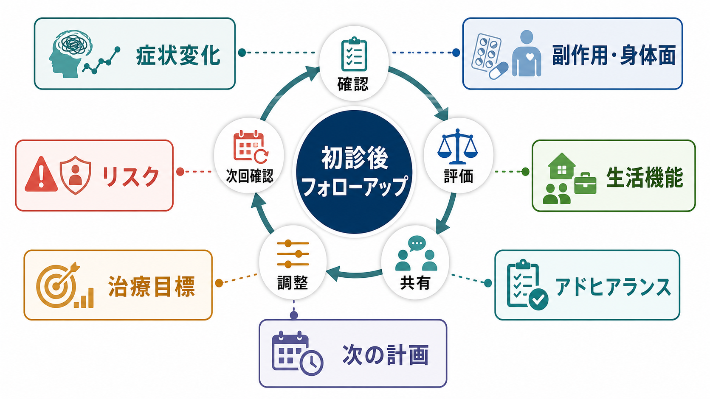
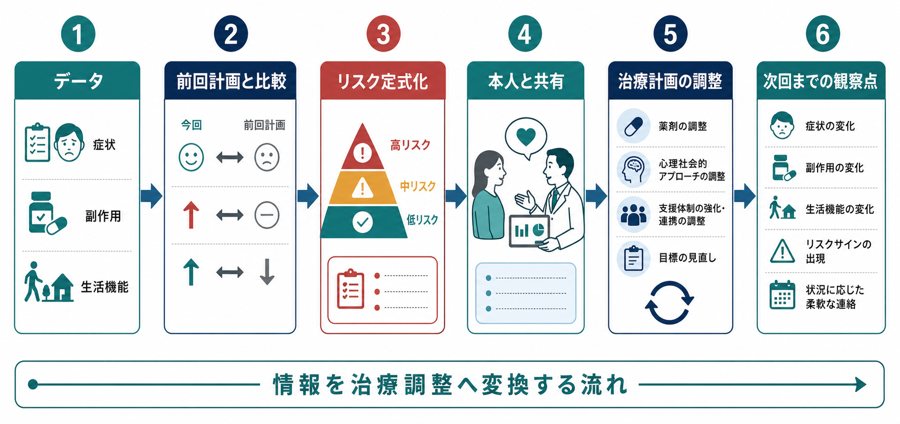
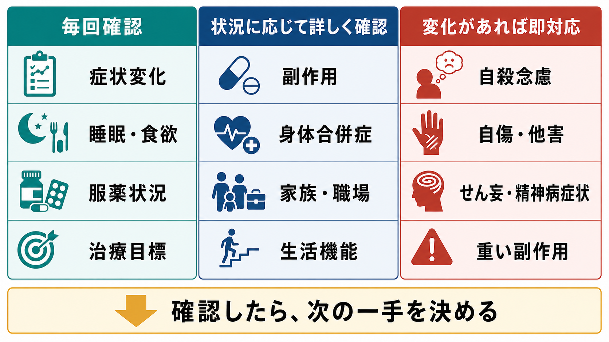

# 初診後のフォローアップでは何を確認するか

## 要点

- 初診後のフォローアップは、前回の[[精神科初診で何を確認するべきか|初診評価]]を繰り返す場ではなく、「前回立てた仮説と計画が、実生活の中でどう働いたか」を点検する場である。
- 毎回の中核は、症状変化、副作用・身体面、生活機能、アドヒアランス、リスク、治療目標、次回までの計画である。
- うつ病治療のNICEガイドラインは、治療開始後2〜4週で効果、治療コンコーダンス、副作用、有害事象、自殺念慮、アウトカム指標を確認することを勧めている[2]。
- 抗精神病薬では、症状反応だけでなく、体重、血圧、血糖・HbA1c、脂質、運動障害、アドヒアランスなどを系統的に追う必要がある[3]。
- リスク評価は「低・中・高」のラベルで終わらせず、本人のニーズと短期・長期の安全を支えるリスク定式化に変換する[5]。
- 本記事は教育・研究目的の整理であり、個別の診断や治療指示ではない。

## この記事で答える問い

1. 初診後の再診では、何を毎回確認すればよいか。
2. 症状、副作用、生活機能、リスク、治療目標をどの順序で評価すればよいか。
3. 尺度やチェックリストを、機械的な点検ではなく治療調整にどうつなげるか。
4. どのような変化があれば、診断仮説や治療計画を見直すべきか。

## まず結論

初診後のフォローアップは、次の7点を短くても毎回確認すると整理しやすい。

| 領域 | 確認すること | 次の判断につながる問い |
|---|---|---|
| 症状変化 | 中核症状、睡眠、食欲、活動性、不安、精神病症状など | 前回より何が軽くなり、何が残っているか |
| 副作用・身体面 | 眠気、賦活、不穏、錐体外路症状、体重、性機能、消化器症状、検査値 | 治療の害が利益を上回っていないか |
| 生活機能 | 家事、仕事、学業、対人関係、外出、セルフケア | 症状改善が生活の回復につながっているか |
| アドヒアランス | 服薬、受診、心理教育、セルフモニタリング、生活調整 | 実行できない理由は信念・不安か、実務上の困難か |
| リスク | 自殺念慮、自傷、他害、セルフネグレクト、急性増悪、身体リスク | 今日から次回まで安全をどう支えるか |
| 治療目標 | 本人が重視する目標、短期目標、長期目標 | 目標は本人にとって意味があり、測定可能か |
| 次の計画 | 継続、増減量、変更、検査、連携、危機時対応 | 次回までに誰が何を確認するか |

この流れは、[[精神科診療でSOAPはどう使うのか|SOAP]]の形に置き換えると、Sに本人の変化、Oに観察・尺度・検査、Aに診断仮説とリスク定式化、Pに治療調整と次回確認点を置く作業である。

## 背景

初診では、主訴、現病歴、既往歴、家族歴、生活歴、精神状態、身体面、リスク、支援資源を広く把握する。APAの成人精神科評価ガイドラインも、精神科評価を診断だけでなく、治療計画、安全、文化的・社会的背景、患者との協働に関わる過程として位置づけている[1]。しかし初診の情報は、まだ「診察室で得られた仮説」である。フォローアップでは、その仮説が時間経過の中で支持されるか、修正が必要かを確かめる。

たとえば「うつ病としてSSRIを開始した」後の再診では、抑うつ気分だけを聞けば十分ではない。睡眠が悪化していないか、焦燥や希死念慮が増えていないか、胃腸症状や性機能障害が服薬継続を妨げていないか、仕事や家庭で何が変わったか、本人が治療目標をどう感じているかを確認する必要がある。NICEのうつ病ガイドラインは、治療開始後のレビューで治療効果、コンコーダンス、副作用、有害事象、自殺念慮、アウトカム指標を確認することを明示している[2]。

同じことは薬物療法以外にも当てはまる。心理教育、心理療法、家族支援、職場調整、社会資源の利用も、提案しただけでは治療にならない。実行できたか、実行を妨げたものは何か、本人にとって意味があったかを確認し、[[精神科治療計画はどのように立てるのか|治療計画]]を更新していく必要がある。

## 基本概念

### フォローアップは「変化」を見る

再診で最初に確認するのは、前回からの変化である。変化は「良くなった・悪くなった」だけでは粗すぎる。少なくとも次のように分けて聞く。

- いつから変わったか
- 何が変わったか
- どの程度変わったか
- 生活のどの場面に影響したか
- 治療、環境、身体状態、物質使用、睡眠、対人ストレスのどれと関連しそうか
- 本人はその変化をどう意味づけているか

この確認は、[[精神科で重症度をどう判断するか|重症度]]の再評価であると同時に、診断仮説の再検討でもある。症状が改善しないとき、薬が効いていないとは限らない。服薬できていない、生活負荷が増えた、睡眠不足が続いている、身体疾患や薬剤性要因がある、診断仮説がずれている、治療目標が本人の目標と一致していない、など複数の可能性がある。

### アウトカムは症状だけではない

症状尺度は有用だが、治療の目的は点数を下げることだけではない。[[精神科で生活機能をどう評価するか|生活機能]]、役割、対人関係、セルフケア、本人の価値に沿った生活を同時に確認する必要がある。WHODAS 2.0は、認知、移動、セルフケア、対人関係、生活活動、参加という複数領域で健康と障害を評価する汎用的な方法として開発され、介入前後の変化を測るためにも使える[6]。

臨床では、尺度を使わなくても、次のように具体化できる。

- 朝起きて身支度できているか
- 食事、入浴、掃除、金銭管理が保てているか
- 仕事や学業の量、質、欠席・遅刻がどう変わったか
- 家族や同居者との衝突、孤立、支援要請がどう変わったか
- 外出、趣味、運動、社会参加が戻っているか
- 本人が「生活が少し戻った」と感じる場面はあるか

### アドヒアランスは責める対象ではない

服薬や通院が計画通りでないとき、それを「守れていない」とだけ見ると、治療関係を損ないやすい。NICEの薬剤アドヒアランスガイドラインは、非アドヒアランスはよくあることであり、処方・調剤・レビューのたびに非審判的に確認することを勧めている[4]。また、服薬しない理由は、薬への信念や不安による意図的なものと、飲み忘れ、費用、生活リズム、包装、理解不足などの非意図的なものに分けて考える必要がある[4]。

したがって再診では、次のように聞く方がよい。

> 「この薬は、実際にはどのくらい飲めましたか。飲みにくかった日があれば、その理由も一緒に見たいです。」

これは[[アドヒアランスとは何か|アドヒアランス]]を監視する質問ではなく、[[コンコーダンスとは何か|コンコーダンス]]と[[共同意思決定とは何か|共同意思決定]]を支える質問である。

## 仕組み

### 1. 前回の計画を短く再提示する

フォローアップは「前回、何を目標に何を試したか」を共有するところから始める。前回の計画が曖昧なままだと、改善・悪化・不変の意味が判断できない。

例:

- 「前回は、睡眠を整えることと、希死念慮が強まる時間帯を記録することを目標にしました。」
- 「薬は少量から始め、副作用と不安の変化を2週間で確認する予定でした。」
- 「職場への連絡は急がず、まず休養と診断書の必要性を今日相談することにしていました。」

この再提示により、本人と臨床家が同じ評価軸に立てる。

### 2. 症状変化を時系列で確認する

症状は、前回から今日までの時系列として聞く。精神科では、本人の主観的苦痛、周囲から見た変化、診察室での観察がずれることがある。そのため、本人の語り、家族・支援者からの情報、精神状態診察、尺度を組み合わせる。

確認する項目は診断仮説によって変わるが、一般には次が中核になる。

- 気分、不安、焦燥、興味・喜び
- 睡眠、食欲、体重、活動性
- 思考のまとまり、集中、決断、記憶
- 幻覚、妄想、被害感、現実検討
- 強迫、パニック、トラウマ反応
- 物質使用、カフェイン、アルコール、市販薬
- 日内変動、誘因、保護因子

尺度を使う場合は、PHQ-9、GAD-7、YMRS、PCL-5、AUDITなどを疾患仮説に応じて選ぶ。測定に基づくケアのレビューでは、うつ病において定期的なアウトカム測定と患者・治療者によるレビューを意思決定に使う介入が検討されており、測定を治療調整に結びつける発想が重要である[7]。

### 3. 副作用と身体面を「症状」と同じ重さで見る

副作用は、患者が自発的に話すとは限らない。眠気、倦怠感、胃腸症状、頭痛、性機能障害、体重増加、アカシジア、振戦、筋強剛、月経異常、乳汁分泌、便秘、排尿困難、発疹などは、具体的に尋ねないと見逃されやすい。[[薬剤性精神症状とは何か|薬剤性精神症状]]や[[身体合併症は精神科診療でなぜ重要なのか|身体合併症]]の視点も必要である。

抗精神病薬では特に、治療反応、行動変化、副作用、運動障害、体重、腹囲、脈拍、血圧、血糖・HbA1c、脂質、アドヒアランス、全身健康状態を系統的にモニターすることが推奨されている[3]。これは統合失調症だけの問題ではない。双極症、うつ病の増強療法、せん妄や不眠への処方などでも、薬剤ごとの身体リスクを意識する必要がある。

副作用確認では、次の3つを分ける。

1. 医学的に危険な副作用
2. 本人が耐えがたい副作用
3. 生活機能や服薬継続を妨げる副作用

医学的に軽い副作用でも、本人にとって耐えがたければ治療継続を妨げる。逆に、本人が気にしていなくても、代謝異常やQT延長、リチウム中毒などは医学的に見逃せない。

### 4. リスクは「予測」ではなく「支援計画」に変える

初診後のフォローアップで最も重要なのは、今日から次回までの安全をどう支えるかである。[[自殺リスク評価では何を聞くべきか|自殺リスク]]、[[他害リスク評価では何を見るべきか|他害リスク]]、自傷、虐待、セルフネグレクト、依存、急性精神病症状、重い身体副作用、家庭内暴力、保護を要する子どもや高齢者の安全を確認する。

NICEの自傷ガイドラインは、将来の自殺や自傷反復を予測する目的でリスク尺度や「低・中・高」の全体ラベルを使うことを推奨していない。代わりに、本人のニーズ、短期・長期の心理的・身体的安全、リスク定式化に焦点を当てる[5]。

再診での実務的な問いは、次のようになる。

- 希死念慮や自傷衝動は、前回より強いか弱いか
- 具体的な方法、準備、手段へのアクセスはあるか
- 衝動が強まる時間帯、状況、物質使用はあるか
- 助けを求められる相手、場所、連絡先はあるか
- 今日帰宅してよいか、受診間隔を短くする必要があるか
- [[クライシスプランとは何か|クライシスプラン]]や[[再発予防計画とは何か|再発予防計画]]を更新する必要があるか

### 5. 治療目標を本人の言葉で見直す

フォローアップでは、臨床家が設定した目標と本人が大切にしている目標がずれていないかを確認する。臨床家は「抑うつ症状の軽減」を目標にしていても、本人は「子どもの送迎に戻りたい」「朝に不安なく出勤したい」「薬で自分らしさが失われないか確認したい」と考えているかもしれない。

目標は、次のように階層化すると扱いやすい。

| 時間軸 | 目標の例 | 評価方法 |
|---|---|---|
| 短期 | 眠れる日を増やす、希死念慮が強い時間帯を乗り切る | 睡眠記録、危機時行動、受診間隔 |
| 中期 | 欠勤を減らす、家事を一部再開する、対人衝突を減らす | 生活機能、家族・職場情報、本人の負担 |
| 長期 | 再発を減らす、役割を回復する、価値に沿った生活を増やす | 再発サイン、支援資源、本人の満足度 |

目標の見直しは、治療への納得感にも関わる。薬剤の利益と害、心理療法や生活調整の負担、家族や職場との調整は、本人の価値観と切り離して決められない[4]。

## 図解

### 毎回確認するもの、詳しく確認するもの、即対応するもの

フォローアップの確認項目は、すべてを同じ深さで聞く必要はない。毎回の短い確認、状況に応じた詳しい確認、変化があれば即対応する項目に分けると、限られた診察時間でも安全性と継続性を保ちやすい。

| 層 | 代表的な項目 | 目的 |
|---|---|---|
| 毎回確認 | 症状変化、睡眠・食欲、服薬状況、治療目標、次回までの不安 | 変化の早期把握 |
| 状況に応じて詳しく確認 | 副作用、身体合併症、家族・職場、生活機能、検査値 | 治療調整 |
| 変化があれば即対応 | 自殺念慮、自傷・他害、せん妄、急性精神病症状、重い副作用 | 安全確保 |

## 臨床・研究との接続

### 臨床では「短く、毎回、同じ軸で」見る

フォローアップの質は、長い面接をすれば上がるとは限らない。重要なのは、毎回同じ軸で変化を追い、必要なところだけ深掘りすることである。たとえば、次のような定型質問を毎回使うと、変化を比較しやすい。

- 「前回から一番良くなったことは何ですか。」
- 「前回から一番困ったことは何ですか。」
- 「薬や治療で困ったことはありましたか。」
- 「仕事・学校・家事・人間関係は、どこまで戻っていますか。」
- 「死にたい気持ち、自分を傷つけたい気持ち、誰かを傷つけそうな感じはありましたか。」
- 「次回までに、何が少し変わるとよさそうですか。」

これにより、診察は「症状を聞いて処方する」だけでなく、「治療仮説を更新する」場になる。

### 研究では測定と対話を結びつける

測定に基づくケアは、尺度を定期的に取り、その結果を患者と治療者が共有し、治療意思決定に使う考え方である。うつ病を対象としたRCTのメタ解析では、測定に基づくケアが症状改善や反応・寛解に関連する可能性が検討されている[7]。ただし、尺度だけで臨床判断を置き換えることはできない。尺度得点、本人の語り、生活機能、リスク、身体面、治療関係を合わせて読む必要がある。

研究的には、次のような問いが重要になる。

- 症状尺度の改善は生活機能の改善と一致するか。
- 副作用や治療負担は、アドヒアランスや中断にどう影響するか。
- リスク定式化を記録することは、危機対応や連携の質を高めるか。
- 患者報告アウトカムを使うことで、共同意思決定は促進されるか。

## よくある誤解

### 誤解1: 再診では症状だけ聞けばよい

症状は重要だが、副作用、身体面、生活機能、リスク、治療目標を見なければ、治療が本人の生活にどう作用しているかは分からない。特に薬物療法では、効果と有害事象を同時に確認する必要がある[2][3]。

### 誤解2: 副作用は患者が困れば自分から言う

性機能障害、体重増加、眠気、アカシジア、便秘、月経異常などは、自発的に話されにくい。具体的に尋ね、本人にとっての負担を確認する必要がある。

### 誤解3: アドヒアランス不良は意欲の問題である

非アドヒアランスはよくあることであり、信念・不安・副作用・費用・生活リズム・理解不足など多くの理由がある。非審判的に確認し、本人に合う支援を一緒に考える[4]。

### 誤解4: リスク評価はスコアで決めればよい

リスク尺度や全体ラベルは、将来の自殺や自傷を正確に予測する道具ではない。安全を支えるには、現在の苦痛、手段へのアクセス、保護因子、支援資源、危機時の行動を具体化する必要がある[5]。

### 誤解5: 治療目標は医療者が設定するものだ

医学的目標は必要だが、本人が重視する生活上の目標と結びつかなければ、治療は続きにくい。目標は、本人の言葉で、短期・中期・長期に分けて確認する。

## 関連ノート

- [[精神科初診で何を確認するべきか]]
- [[精神科診療でSOAPはどう使うのか]]
- [[精神科治療計画はどのように立てるのか]]
- [[精神科で重症度をどう判断するか]]
- [[精神科で生活機能をどう評価するか]]
- [[アドヒアランスとは何か]]
- [[コンコーダンスとは何か]]
- [[共同意思決定とは何か]]
- [[薬剤性精神症状とは何か]]
- [[身体合併症は精神科診療でなぜ重要なのか]]
- [[自殺リスク評価では何を聞くべきか]]
- [[他害リスク評価では何を見るべきか]]
- [[クライシスプランとは何か]]
- [[再発予防計画とは何か]]

### MOC更新候補

- `content/00_MOC/` 配下の精神医学・診断・面接関連MOC
- `content/00_MOC/` 配下の臨床実践・治療計画関連MOC

本ジョブでは並列編集の競合を避けるため、MOC本体は更新しない。

### 今後の作成候補

- 「再診で治療反応をどう記録するか」
- 「抗精神病薬開始後の身体モニタリングでは何を見るか」
- 「治療目標を患者と共有するにはどうするか」
- 「測定に基づくケアとは何か」

## 理解チェック

1. 初診後フォローアップで「前回の計画」を最初に再確認する理由は何か。
2. 症状が改善しないとき、薬効不足以外にどのような可能性を考えるべきか。
3. 副作用確認で、医学的危険性と本人の耐えがたさを分ける理由は何か。
4. アドヒアランスを非審判的に聞くには、どのような言い方がよいか。
5. リスク評価を「低・中・高」で終わらせることの問題は何か。
6. 治療目標を本人の言葉で確認すると、フォローアップの質はどう変わるか。

## 参考文献

[1] Silverman, J. J., Galanter, M., Jackson-Triche, M., Jacobs, D. G., Lomax, J. W., Riba, M. B., Tong, L. D., Watkins, K. E., Fochtmann, L. J., Rhoads, R. S., & Yager, J. (2015). The American Psychiatric Association Practice Guidelines for the Psychiatric Evaluation of Adults. *American Journal of Psychiatry, 172*(8), 798-802. https://doi.org/10.1176/appi.ajp.2015.1720501

[2] National Institute for Health and Care Excellence. (2022). *Depression in adults: treatment and management* (NICE guideline NG222). https://www.nice.org.uk/guidance/ng222

[3] National Institute for Health and Care Excellence. (2014, amended 2021). *Psychosis and schizophrenia in adults: prevention and management* (NICE clinical guideline CG178). https://www.nice.org.uk/guidance/cg178

[4] National Institute for Health and Care Excellence. (2009). *Medicines adherence: involving patients in decisions about prescribed medicines and supporting adherence* (NICE clinical guideline CG76). https://www.nice.org.uk/guidance/cg76

[5] National Institute for Health and Care Excellence. (2022). *Self-harm: assessment, management and preventing recurrence* (NICE guideline NG225). https://www.nice.org.uk/guidance/ng225

[6] World Health Organization. (2010). *Measuring health and disability: Manual for WHO Disability Assessment Schedule (WHODAS 2.0).* https://www.who.int/publications/i/item/measuring-health-and-disability-manual-for-who-disability-assessment-schedule-%28-whodas-2.0%29/

[7] Zhu, M., Hong, R. H., Yang, T., Yang, X., Wang, X., Liu, J., Murphy, J. K., Michalak, E. E., Wang, Z., Yatham, L. N., Chen, J., & Lam, R. W. (2021). The efficacy of measurement-based care for depressive disorders: Systematic review and meta-analysis of randomized controlled trials. *Journal of Clinical Psychiatry, 82*(5), 21r14034. https://doi.org/10.4088/JCP.21r14034

## 未解決問題

- 疾患横断的な再診テンプレートを、診療時間を増やさずにどの程度まで標準化できるか。
- 尺度疲れを避けながら、患者報告アウトカムを継続的に使う方法は何か。
- リスク定式化を、電子カルテ上で防衛的記録ではなく支援計画として残すにはどうすればよいか。
- 本人の治療目標、家族の希望、医学的安全性が衝突するとき、どのように共同意思決定を進めるか。
