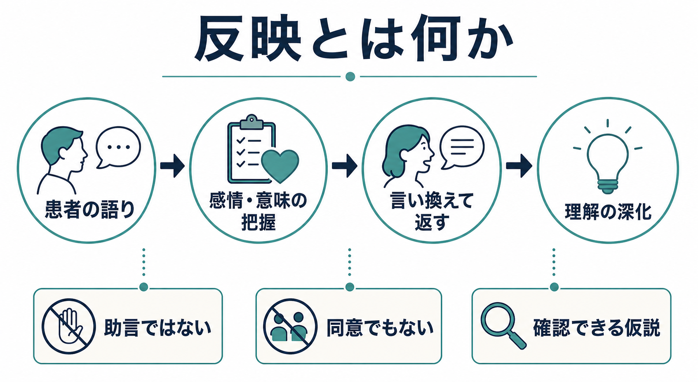
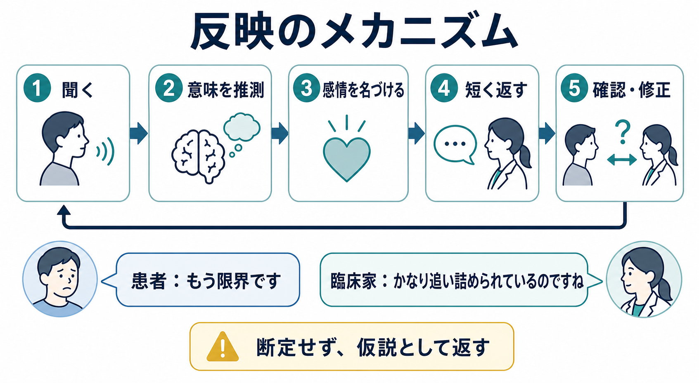

# 反映とは何か

## 要点

- 反映とは、患者が語った事実、感情、価値、葛藤、言外の意味を、臨床家が短く言い換えて返す面接技法である。
- 目的は「正しい解釈を当てること」ではなく、患者が自分の体験をもう一度聞き直し、理解を深め、必要なら修正できる場を作ることである。
- 反映は、助言、同意、励まし、解釈、要約、質問とは重なる部分をもちつつも区別される。
- 精神科面接では、診断情報を集めるだけでなく、治療関係、安全感、患者中心の意味理解を支える基本技法になる。
- 医療・心理臨床では教育・研究目的で学ぶべき技法であり、個別診断や治療指示を置き換えるものではない。

## この記事で答える問い

この記事では、[[精神医学とは何か]]や[[精神科診断は何のためにあるのか]]を前提に、面接中の「反映」が何をしているのかを扱う。

1. 反映とは何か。
2. 反映は傾聴、共感、質問、要約、解釈とどう違うのか。
3. なぜ患者の理解や治療関係を深めるのか。
4. 精神科面接、心理療法、動機づけ面接ではどのように使われるのか。

## まず結論

反映は、患者の言葉をそのまま繰り返すだけではない。臨床家が「この人は、何を大切にし、何に傷つき、何を恐れ、何をまだ言葉にできずにいるのか」という仮説を、ごく短い言葉で返す行為である。たとえば患者が「もう何をしても無駄です」と語ったとき、単に「無駄だと思うのですね」と返すだけでなく、「かなり疲れ切っていて、先が見えなくなっているのですね」と返すことがある。これは断定ではなく、患者が「そうです」「少し違います」「本当は怒りの方が強いです」と調整できる仮説である。

この意味で、反映は来談者中心療法の共感的理解、動機づけ面接の OARS 技法、精神科面接の治療関係づくりに共通する中核的な面接スキルである。Rogers は、治療者の共感的理解を心理療法の重要条件として位置づけた[1]。動機づけ面接でも、反映的傾聴は患者の両価性を整理し、変化に向かう発話を引き出す中心技法とされる[2][3]。

## 背景

精神科面接では、症状、経過、生活歴、危険性、治療歴を確認する必要がある。しかし、情報収集だけを急ぐと、患者は「聴かれている」よりも「調べられている」と感じやすい。[[現病歴はどのように構造化するべきか]]や[[生活歴はなぜ重要なのか]]で扱うように、面接は情報を時系列に整理する作業であると同時に、患者が自分の体験を意味づけ直す場でもある。

反映は、この二つをつなぐ。患者の発話を受け、臨床家がその感情や意味を言い換えて返すことで、患者は「この人は自分の言葉の背後を理解しようとしている」と感じやすくなる。NICE の患者経験ガイドラインも、患者を尊重し、懸念や期待を聴き、わかりやすく情報共有することを医療コミュニケーションの基本としている[4]。反映は、その原則を面接の一文一文で実行する技法だといえる。

## 基本概念

### 反映とは何を返すのか

反映で返す対象は、発話の表面だけではない。少なくとも次の層がある。

| 層 | 例 | 反映の例 |
|---|---|---|
| 内容 | 「最近眠れません」 | 「眠れない日が続いているのですね」 |
| 感情 | 「もう嫌です」 | 「かなりしんどくなっているのですね」 |
| 意味 | 「職場に行けません」 | 「仕事に行くこと自体が、今は危険な場所に向かうように感じられているのですね」 |
| 価値 | 「子どもに迷惑をかけたくない」 | 「家族を大事にしたい気持ちが強いのですね」 |
| 葛藤 | 「変わりたいけど、怖いです」 | 「変わりたい気持ちと、今のまま守りたい気持ちが両方あるのですね」 |

この層の見立ては、[[共感は認知機能としてどう理解できるのか]]でいう情動的共感と認知的共感の両方に関わる。相手の苦痛に巻き込まれるだけでは不十分であり、相手の視点、文脈、自己理解を推測しながら、自分の推測を仮説として返す必要がある。

### 単純反映と複雑反映

動機づけ面接では、反映はしばしば単純反映と複雑反映に分けられる。単純反映は、患者の言葉に近い形で内容を返す。複雑反映は、患者が明示していない感情、意味、価値、葛藤を少し深めて返す。MITI では、複雑反映を、発話に意味や強調を加える反映として評価する[3]。

| 種類 | 目的 | 例 |
|---|---|---|
| 単純反映 | 聴いていることを示し、話の流れを保つ | 「眠れない日が続いているのですね」 |
| 感情反映 | 感情を言葉にする | 「不安がかなり強くなっているのですね」 |
| 意味反映 | 背景にある意味を返す | 「失敗したら自分の価値まで失うように感じているのですね」 |
| 両面反映 | 葛藤の両側を返す | 「休みたい気持ちと、休むと迷惑をかけるという怖さが両方あるのですね」 |
| 増幅・弱化反映 | 極端さや強さを調整して確認する | 「絶対に誰にも頼れない、と感じるほど追い詰められているのですね」 |

複雑反映は強力だが、深読みしすぎると患者の体験を奪う。したがって、語尾や姿勢は「そうに見えます」「そのようにも感じられます」「少し違っていたら教えてください」という仮説性を保つ。

## 仕組み

反映の仕組みは、情報処理として見るとわかりやすい。

1. 患者が言葉、沈黙、表情、姿勢、間、語調で体験を表す。
2. 臨床家が、その表現から内容、感情、意味、価値、葛藤を推測する。
3. 臨床家が、短く、評価を混ぜず、患者の言葉に近い言い方で返す。
4. 患者が、その返された言葉を聞いて、自分の体験を確認・修正する。
5. その修正によって、面接の焦点と理解が少し深くなる。

この循環は、単なる「優しい応答」ではない。患者の内的経験が、臨床家の言葉によっていったん外在化され、患者自身がそれを聞き直す。すると、曖昧だった感情が名づけられたり、混ざっていた気持ちが分かれたり、本人の価値や恐れが見えやすくなる。心理療法研究では、治療者の共感は治療成果と一貫して関連する要因として検討されてきた[5][6]。ただし、共感や反映は単独で効果を保証する魔法の技法ではなく、治療関係、治療法、患者特性、文脈と相互作用する。

## 図解

図1は、反映を「患者の語り」「感情・意味の把握」「言い換えて返す」「理解の深化」の循環として示している。重要なのは、反映が助言でも同意でもない点である。患者が「家族が全部悪い」と語ったとき、「家族が全部悪いのですね」と同意する必要はない。「家族との関係で、長く傷ついてきた感覚があるのですね」と返せば、体験を受け止めながら、事実認定や価値判断を急がずに済む。

図2は、実際の面接での反映の流れを示している。臨床家は、まず聴き、意味を推測し、感情を名づけ、短く返し、患者の反応を見て確認・修正する。このループは固定的な手順ではない。沈黙を待つ方がよい場面もあれば、安全確認や具体的質問を優先すべき場面もある。

## 臨床・研究との接続

### 精神科面接との接続

精神科面接では、反映は診断情報の収集を妨げるものではなく、むしろ情報の質を上げることがある。患者が防衛的になっているとき、いきなりチェックリスト的に症状を確認すると、重要な背景が閉じることがある。反映によって「何を一番恐れているのか」「どの言葉が本人にとって傷つくのか」「どの症状が生活上の危機と結びついているのか」が見えやすくなる。

APA の成人精神科評価ガイドラインは、精神科評価を症状確認だけでなく、患者との協働関係、文化的背景、リスク評価、治療計画と結びつく包括的プロセスとして位置づける[7]。反映は、この協働関係を具体的な応答として支える。

### 動機づけ面接との接続

動機づけ面接では、反映は OARS、すなわち開かれた質問、是認、反映、要約の一部として使われる[2]。患者が変化を望む気持ちと変化を避けたい気持ちの間で揺れているとき、両面反映はその両価性を言葉にする。

たとえば、「酒を減らしたいけど、仕事の後はそれしか楽しみがない」と語る患者に対し、「健康のために変えたい気持ちと、今の生活で唯一ほっとできるものを手放したくない気持ちが両方あるのですね」と返す。これは説得ではない。本人の中にすでにある二つの方向を並べ、本人がどちらをどう扱うかを考えやすくする。動機づけ面接のメタ分析では、物質使用や健康行動などで一定の効果が報告されているが、効果は対象、実施者、比較条件によって変動する[8]。[[行動変容はどのように起こるのか]]を考えるうえでも、反映は「外から押す」より「本人の意味を整理する」技法として位置づけられる。

### 研究・教育との接続

反映は、面接技能として観察・訓練・評価できる。MITI のようなコーディング体系では、面接者の発話を質問、反映、情報提供などに分類し、反映の量や質を評価する[3]。これは、反映を単なる性格的な優しさではなく、学習可能な行動として扱うために重要である。

一方で、反映の質は数だけでは測れない。多く反映すればよいわけではなく、患者の文脈、危機度、文化、認知機能、トラウマ歴、関係性に合っている必要がある。

## よくある誤解

### 誤解1: 反映は患者の言葉を繰り返すだけである

繰り返しは反映の一部だが、反映の本質ではない。反映の中心は、患者の発話に含まれる意味を、臨床家の理解として返すことである。機械的な復唱は、かえって不自然で、患者に「技法を使われている」と感じさせることがある。

### 誤解2: 反映すると患者の考えに同意したことになる

反映は同意ではない。患者が「誰も信用できない」と語ったとき、「誰も信用できないのですね」と同意するのではなく、「これまでの経験から、人を信用することがかなり危険に感じられているのですね」と返すことができる。これは患者の世界の見え方を理解する応答であり、事実判断とは別である。

### 誤解3: 深い反映ほどよい

深い反映は役に立つことがあるが、早すぎる深掘りは侵襲的になる。とくにトラウマ、希死念慮、虐待、差別、家族葛藤では、患者がまだ言葉にしていない意味を急いで名づけると、理解ではなく押しつけになる。安全感と同意を確認しながら進める必要がある。

### 誤解4: 反映だけで面接が成立する

反映だけでは不十分である。精神科面接では、開かれた質問、閉じた質問、要約、リスク評価、情報提供、心理教育、治療選択肢の提示も必要になる。反映はそれらを置き換える技法ではなく、患者の語りと臨床的整理をつなぐ技法である。

## 関連ノート

- [[精神医学とは何か]]
- [[精神科診断は何のためにあるのか]]
- [[現病歴はどのように構造化するべきか]]
- [[生活歴はなぜ重要なのか]]
- [[DSMとICDは何が違うのか]]
- [[共感は認知機能としてどう理解できるのか]]
- [[行動変容はどのように起こるのか]]

MOC更新候補: `content/00_MOC/MOC｜精神医学.md` の「総論・診断・面接」領域、および `content/00_MOC/MOC｜臨床実践・治療.md` の心理療法領域に追加候補。ただし並列ジョブとの衝突を避けるため、このタスクでは MOC 本体は更新しない。

今後の作成候補: 「開かれた質問とは何か」「要約とは何か」「動機づけ面接とは何か」「治療同盟とは何か」「心理教育とは何か」。

## 理解チェック

1. 反映と単なる復唱の違いを説明できるか。
2. 反映が同意や助言ではない理由を説明できるか。
3. 単純反映と複雑反映の例をそれぞれ挙げられるか。
4. 患者の感情を反映するとき、断定ではなく仮説として返す言い方を作れるか。
5. 反映よりも安全確認や具体的質問を優先すべき場面を考えられるか。

## 参考文献

[1] Rogers, C. R. (1957). The necessary and sufficient conditions of therapeutic personality change. *Journal of Consulting Psychology, 21*(2), 95-103. https://doi.org/10.1037/h0045357

[2] Substance Abuse and Mental Health Services Administration. (2019). *TIP 35: Enhancing Motivation for Change in Substance Use Disorder Treatment*. https://store.samhsa.gov/product/tip-35-enhancing-motivation-change-substance-use-disorder-treatment/pep19-02-01-003

[3] Moyers, T. B., Manuel, J. K., & Ernst, D. (2015). *Motivational Interviewing Treatment Integrity Coding Manual 4.2.1*. https://casaa.unm.edu/download/miti4_2.pdf

[4] National Institute for Health and Care Excellence. (2012). *Patient experience in adult NHS services: improving the experience of care for people using adult NHS services* (CG138). https://www.nice.org.uk/guidance/cg138

[5] Elliott, R., Bohart, A. C., Watson, J. C., & Greenberg, L. S. (2011). Empathy. *Psychotherapy, 48*(1), 43-49. https://doi.org/10.1037/a0022187

[6] Norcross, J. C., & Wampold, B. E. (2011). Evidence-based therapy relationships: Research conclusions and clinical practices. *Psychotherapy, 48*(1), 98-102. https://doi.org/10.1037/a0022161

[7] Silverman, J. J., Galanter, M., Jackson-Triche, M., et al. (2015). The American Psychiatric Association Practice Guidelines for the Psychiatric Evaluation of Adults. *American Journal of Psychiatry, 172*(8), 798-802. https://doi.org/10.1176/appi.ajp.2015.1720501

[8] Lundahl, B. W., Kunz, C., Brownell, C., Tollefson, D., & Burke, B. L. (2010). A meta-analysis of motivational interviewing: Twenty-five years of empirical studies. *Research on Social Work Practice, 20*(2), 137-160. https://doi.org/10.1177/1049731509347850

## 未解決問題

- 反映の「深さ」を、患者の主観的な理解感や治療成果とどのように対応づけて測定できるか。
- AI 面接支援や電子カルテ補助で、反映的応答を支援するとき、患者の語りを過度に定型化しない設計は可能か。
- 文化、年齢、発達特性、認知機能、トラウマ歴によって、望ましい反映の形はどの程度変わるか。
