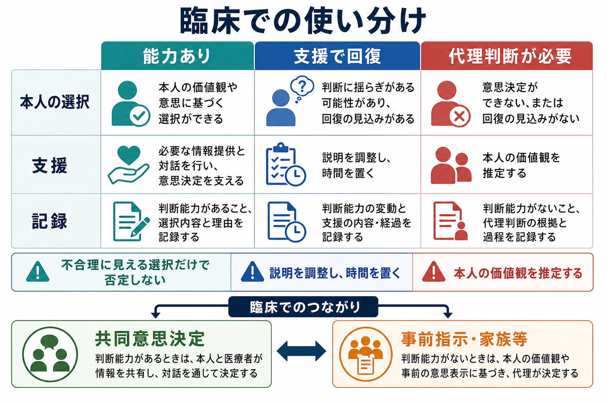
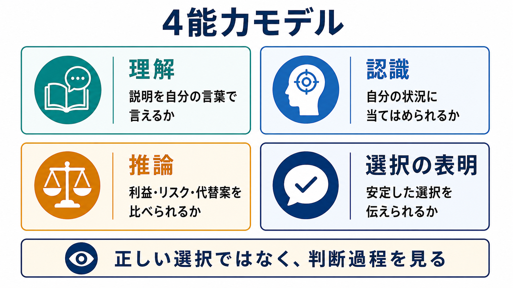
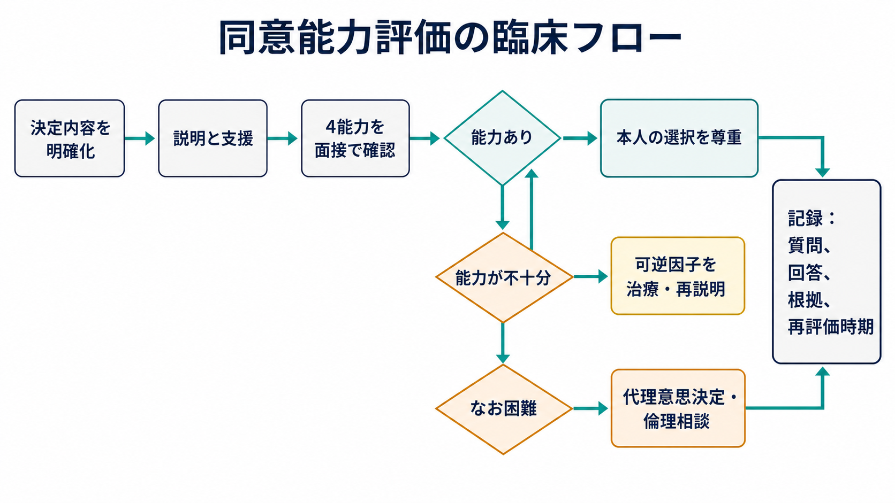

# 同意能力の評価はどのように行うのか

## 要点

- 同意能力は「その患者が、いま問題になっている具体的な医療判断を行えるか」を見る能力であり、人格全体への評価ではない。
- 中核は、治療情報の**理解**、自分の状況への**認識**、選択肢を比較する**推論**、一貫した**選択の表明**の4点である [1][2]。
- 不合理に見える選択だけで能力なしと決めず、説明の仕方、言語・聴覚・視覚、せん妄、薬剤、低酸素、感染、代謝異常、急性精神症状などの可逆的要因を先に確認する [3][7]。
- 評価は、本人を支援して能力を最大化する作業でもある。支援してなお困難な場合に、代理意思決定、倫理相談、法的手続きの検討へ進む [6][8]。

## この記事で答える問い

1. 同意能力は、認知機能や病名と何が違うのか。
2. 面接では何を質問し、どの回答を根拠に判断するのか。
3. いつ精神科コンサルト、代理意思決定、倫理相談を考えるのか。

## まず結論

同意能力の評価は、「本人が医療者の勧めに同意するか」を判定する作業ではない。評価すべきなのは、本人が十分に説明を受けたうえで、利益・不利益・代替案・無治療の結果を自分の状況に引きつけ、理由をもって選択できるかである [1][2]。

したがって、面接では「この治療を受けますか」だけでは足りない。患者自身の言葉で、病状、選択肢、予想される利益とリスク、受けない場合の見通し、本人が重視する価値、選択理由を確認する。判断が揺らぐ場合は、説明を短くする、図や筆談を使う、通訳や補聴器を整える、時間をおく、せん妄や身体疾患を治療するなど、能力を発揮しやすい条件を作ってから再評価する [6][7]。

## 背景

医療における同意は、情報提供、自由な意思、同意能力の3要素に支えられる。情報が不十分なら同意は形式的になり、強制や過度な誘導があれば自発性が損なわれる。そして、患者が情報を扱えない状態にあるなら、本人の意思を最大限尊重しつつも、支援や代理判断の仕組みが必要になる [2][6]。

精神科では、[[病識とは何か]]、妄想、抑うつ、躁状態、認知症、せん妄、物質使用、切迫した自殺リスクなどが同意能力の評価と交差する。ただし、精神疾患の診断があることは、ただちに同意能力がないことを意味しない。能力は疾患名ではなく、特定の判断に対する機能で評価する [3][4]。

## 基本概念

### 能力は「決定ごと」「時点ごと」に変わる

同意能力は、一般的な賢さや社会的能力ではない。低リスクで単純な処置に同意できる人が、高リスクで複雑な手術については十分に判断できないことがある。逆に、認知機能検査の点数が低くても、本人にとってよく知っている単純な選択なら能力が保たれることがある [3][7]。

この性質のため、記録には「この患者には同意能力がない」と広く書くより、「○月○日、○○治療を受けるかどうかについて、説明後も利益・リスクを自分の状況に当てはめられず、再説明後も一貫した選択理由を示せなかった」のように、対象となる判断と時点を明記する。

### 能力と法的な行為能力は分ける

英語圏では capacity は臨床的判断、competence は裁判所などが扱う法的判断として区別されることが多い [2][7]。日本語では「判断能力」「同意能力」「意思決定能力」が文脈により使い分けられるため、臨床記録では「何について、どの能力を、どの根拠で評価したか」を具体化するのが安全である。

### 不同意は能力欠如ではない

患者が医療者にとって望ましくない選択をしても、それだけで能力なしとはいえない。重要なのは、本人が関連情報を理解し、自分への影響を認識し、価値観に沿って比較し、選択を表明できるかである [1][6]。この点は、[[治療関係とは何か]]や[[精神科面接とは何か]]で扱う協働的な面接姿勢と直結する。

## 仕組み

### 4能力モデル

同意能力評価の標準的枠組みは、Appelbaum と Grisso が整理した4能力モデルである [1][2]。

| 領域 | 見ること | 面接での問いの例 |
|---|---|---|
| 理解 | 病状、治療、利益、リスク、代替案、無治療の結果を説明できるか | 「いま医師が心配している病状を、あなたの言葉で説明するとどうなりますか」 |
| 認識 | その情報を自分自身の状況に当てはめられるか | 「この治療を受けない場合、あなたには何が起こりそうだと思いますか」 |
| 推論 | 選択肢を比較し、本人なりの理由を示せるか | 「何を一番重視して、その選択にしましたか」 |
| 選択の表明 | 選択を伝えられ、急に無根拠に変動しないか | 「今の時点で、どの選択を希望しますか」 |

### 構造化評価ツール

日常診療では、上の4領域を短い面接で確認することが多い。一方、判断が難しい場合や記録の透明性が必要な場合には、MacArthur Competence Assessment Tool for Treatment（MacCAT-T）や Aid to Capacity Evaluation（ACE）のような構造化面接が役立つ [4][5]。これらは「採点すれば自動的に結論が出る」道具ではなく、臨床判断の根拠を整理する補助線である。

ACE は、具体的な医療判断ごとに、理解、認識、推論、選択表明を質問で確認する形式をとる。AAFP のレビューでは、構造化面接と形式的ツールの使用が評価精度を上げうること、ただし最終判断は治療責任者が臨床状況を踏まえて行うことが整理されている [7]。

## 図解

同意能力評価は、次の順序で進めると混乱しにくい。

1. **決定内容を特定する**  
   何に同意するのかを具体化する。検査、薬物療法、入院、退院、手術、身体拘束、研究参加では、必要な情報とリスクが異なる。

2. **必要情報を説明する**  
   病状、目的、期待される利益、起こりうる不利益、代替案、何もしない場合を、患者の理解に合わせて説明する。

3. **4能力を面接で確認する**  
   はい・いいえではなく、本人の言葉で説明してもらう。矛盾や理解不足があれば、どの領域でつまずいているかを分ける。

4. **支援で改善するかを見る**  
   説明を短くする、家族や支援者を同席させる、通訳を使う、感覚障害を補う、時間帯を変える、せん妄や身体疾患を治療する。

5. **判断と記録を残す**  
   質問、患者の回答、判断根拠、支援内容、再評価時期、代理意思決定に移る根拠を記録する [6][7]。

## 臨床・研究との接続

### 精神科面接での実践

[[精神科面接とは何か]]では、主訴や現病歴だけでなく、患者が何を恐れ、何を守りたいのかを聞く。同意能力評価でも同じである。たとえば治療拒否があるとき、拒否そのものを問題視する前に、治療への恐怖、過去の医療体験、宗教的・文化的価値、家族関係、経済的懸念、[[疾病受容とは何か]]の過程を聞く必要がある。

[[心理教育とは何か]]は、同意能力を支える介入にもなる。専門用語を減らし、本人の理解に合わせて情報を再構成することで、「能力がない」と見えた状態が改善することがある。これは、患者を説得して医療者の望む結論に導くことではなく、本人が自分の価値に沿って判断できる条件を整える作業である [6]。

### 身体疾患と可逆因子

能力低下が疑われるときは、精神症状だけに帰属しない。低酸素、低血糖、感染、頭部外傷、薬剤性せん妄、アルコール・薬物の中毒や離脱、疼痛、睡眠不足、感覚障害は、短時間で判断能力を大きく揺らす。高リスクの判断ほど、バイタルサイン、意識水準、神経所見、薬剤、採血、画像検査の必要性を検討する [7]。

### 代理意思決定と本人中心性

支援しても本人が特定の判断を行えない場合、家族等の代理意思決定、事前指示、倫理相談、多職種カンファレンスを検討する。厚生労働省の認知症の意思決定支援ガイドラインは、本人の意思、価値観、過去の表明を中心に据え、周囲が本人の意思決定を支えることを強調している [8]。

## よくある誤解

### 誤解1：認知症や統合失調症なら同意能力はない

診断名だけでは結論は出ない。必要なのは、対象となる医療判断について4能力が保たれているかを確認することである。症状が強くても、単純で低リスクな判断では能力が保たれることがあり、軽度認知障害でも複雑で重大な判断では支援が必要になる。

### 誤解2：医師の勧めに従わないなら能力がない

不同意、退院希望、治療拒否は、評価のきっかけにはなりうるが、能力欠如の証拠ではない。本人が関連情報を理解し、自分への影響を認識し、価値観に沿って理由を述べられるなら、医療者にとって不合理に見える選択も尊重される [1][6]。

### 誤解3：認知機能検査で決めればよい

認知機能検査は補助情報であり、同意能力そのものの検査ではない。点数が極端に低い場合や高い場合には参考になるが、中間域では、具体的な医療判断に関する理解、認識、推論、選択表明を直接確認する必要がある [7]。

### 誤解4：一度能力なしなら以後も能力なし

同意能力は変動する。せん妄、躁状態、重いうつ、薬剤性の意識障害、疼痛、睡眠不足が改善すれば、判断能力が回復することがある [1][7]。緊急性が低い判断では、再説明や再評価の機会を置くことが望ましい。

## 関連ノート

- [[精神科面接とは何か]]
- [[治療関係とは何か]]
- [[病識とは何か]]
- [[心理教育とは何か]]
- [[疾病受容とは何か]]
- [[主訴はどのように聞くべきか]]
- [[現病歴はどのように構造化するべきか]]

### 関連ノート候補

- 意思決定支援とは何か
- インフォームドコンセントとは何か
- 代理意思決定とは何か
- せん妄はどのように評価するのか
- 認知症における意思決定支援とは何か

### MOC更新候補

- `content/00_MOC/MOC｜精神医学.md`
- `content/00_MOC/MOC｜臨床倫理.md` がある場合は、本記事を「インフォームドコンセント」「意思決定支援」配下に追加

## 理解チェック

1. 同意能力が「決定ごと」「時点ごと」に評価されるのはなぜか。
2. 患者が治療を拒否したとき、能力欠如と判断する前に確認すべきことは何か。
3. 4能力モデルのうち、「理解」と「認識」はどう違うか。
4. 認知機能検査だけで同意能力を決めることの限界は何か。
5. 能力が不十分な場合、本人中心性を保つために記録すべき情報は何か。

## 未解決問題

- 日本の一般臨床で使いやすい、短時間かつ妥当性の高い同意能力評価ツールの標準化。
- 精神科救急、身体救急、認知症診療、終末期医療で、同意能力評価と代理意思決定をどう接続するか。
- 家族の関与が本人支援になる場合と、圧力や誘導になる場合をどう見分けるか。

## 参考文献

[1] Appelbaum, P. S., & Grisso, T. (1988). Assessing patients' capacities to consent to treatment. *New England Journal of Medicine*, 319(25), 1635-1638. https://doi.org/10.1056/NEJM198812223192504

[2] Appelbaum, P. S. (2007). Assessment of patients' competence to consent to treatment. *New England Journal of Medicine*, 357(18), 1834-1840. https://doi.org/10.1056/NEJMcp074045

[3] Sessums, L. L., Zembrzuska, H., & Jackson, J. L. (2011). Does this patient have medical decision-making capacity? *JAMA*, 306(4), 420-427. https://doi.org/10.1001/jama.2011.1023

[4] Grisso, T., Appelbaum, P. S., & Hill-Fotouhi, C. (1997). The MacCAT-T: A clinical tool to assess patients' capacities to make treatment decisions. *Psychiatric Services*, 48(11), 1415-1419. https://doi.org/10.1176/ps.48.11.1415

[5] Etchells, E., Darzins, P., Silberfeld, M., Singer, P. A., McKenny, J., Naglie, G., Katz, M., Guyatt, G. H., Molloy, D. W., & Strang, D. (1999). Assessment of patient capacity to consent to treatment. *Journal of General Internal Medicine*, 14(1), 27-34. https://doi.org/10.1046/j.1525-1497.1999.00277.x

[6] National Institute for Health and Care Excellence. (2018). *Decision-making and mental capacity: NICE guideline NG108*. https://www.nice.org.uk/guidance/ng108

[7] Barstow, C., Shahan, B., & Roberts, M. (2018). Evaluating medical decision-making capacity in practice. *American Family Physician*, 98(1), 40-46. https://www.aafp.org/pubs/afp/issues/2018/0701/p40.html

[8] 厚生労働省. (2025). 認知症の人の日常生活・社会生活における意思決定支援ガイドライン（第2版）. https://www.mhlw.go.jp/stf/seisakunitsuite/bunya/0000212395.html
