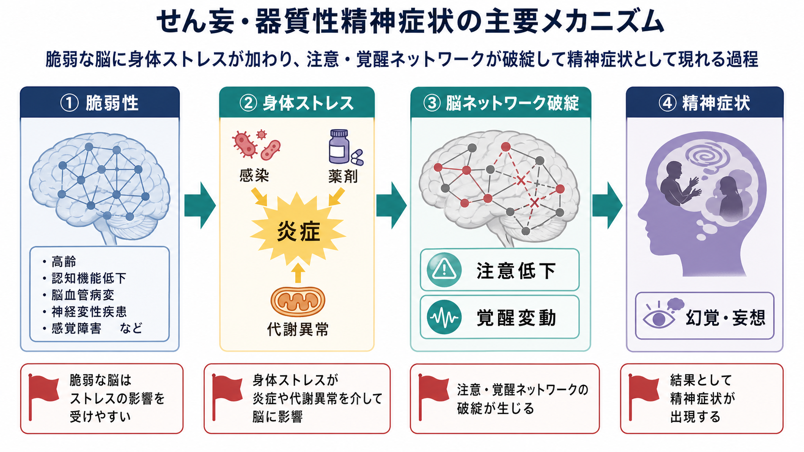
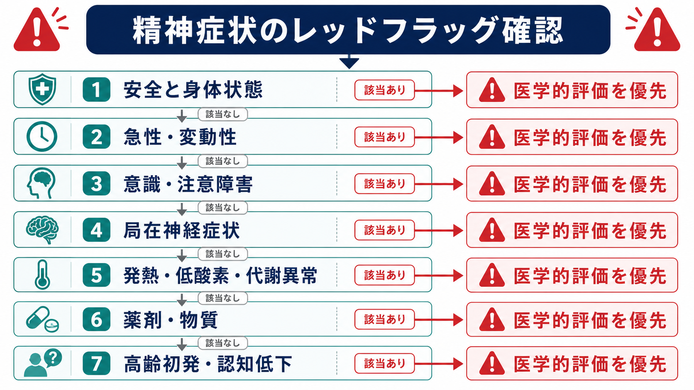

# 器質性精神障害を見逃さないためには何を見るべきか

## 要点

- 精神症状を見たとき、「精神疾患か、身体疾患か」と二分するのではなく、時間経過、意識・注意、神経所見、身体状態、薬剤・物質、年齢、認知変化を同時に見る。
- 急性発症、日内変動、注意障害、意識水準の変化は、せん妄や中枢神経・全身疾患を疑う強い手がかりである[1][2]。
- 局在神経症状、けいれん、頭痛、発熱、自律神経症状、異常運動、記憶障害を伴う精神症状では、脳炎、てんかん、脳血管障害、腫瘍、代謝・内分泌異常などを鑑別に入れる[3][4]。
- 高齢初発の幻覚・妄想、急な認知変化、視覚性幻覚、身体バイタル異常、薬剤変更後の症状は、一次性精神疾患だけで説明しない[2][5]。
- この記事は教育・研究目的の整理であり、個別診断や治療方針を示すものではない。実際の判断は臨床評価に基づく。

## この記事で答える問い

1. 器質性精神障害を疑うべきレッドフラッグは何か。
2. せん妄、自己免疫性脳炎、薬剤・物質、神経変性疾患などを、精神科面接のどこで拾うのか。
3. 「精神症状がある」ことと「一次性精神疾患である」ことを、なぜ分けて考える必要があるのか。

## まず結論

器質性精神障害を見逃さないために最初に見るべきものは、症状の内容そのものよりも「変化の仕方」である。急に始まったか、数時間から数日で揺れるか、注意が保てるか、意識水準が落ちていないか、身体状態や薬剤変更と同期していないかを見る。せん妄では、注意と意識の障害が短期間に起こり、日内変動し、医学的要因と関連することが診断の中核になる[1][2]。

次に見るのは、精神症状の周辺にある神経学的・身体医学的サインである。けいれん、異常運動、失語、片麻痺、歩行障害、頭痛、発熱、低酸素、脱水、代謝異常、内分泌異常、物質使用、薬剤追加・中止は、精神症状の「背景情報」ではなく、原因仮説を変える情報である。初発精神病の評価でも、身体健康、物質使用、認知評価、身体診察を含む包括的評価が推奨される[6][7]。

## 背景

精神医学では、本人の主観的体験、行動、生活機能、対人文脈を丁寧に扱う必要がある。この点は [[精神医学は他の医学分野と何が違うのか]] と接続する。しかし同時に、精神症状は脳・身体・薬剤・物質・環境の変化からも生じる。したがって、[[精神疾患とは何か]] を考えるときにも、診断名を急いで貼る前に、身体医学的な原因や併存を評価する必要がある。

「器質性」という語は、心理的・社会的要因を軽視するための語ではない。むしろ、精神症状を [[生物心理社会モデルとは何か|生物心理社会モデル]] のうち生物学的水準から見直し、神経系・全身状態・薬剤・物質・加齢変化を仮説に入れるための実務的な注意喚起である。

## 基本概念

### 器質性精神障害とは何か

器質性精神障害とは、脳疾患、全身疾患、薬剤、物質、代謝・内分泌異常、感染、免疫異常などが、認知、意識、情動、知覚、思考、行動の変化として現れる状態を指す。重要なのは、「画像で病変が見えるものだけ」を意味しない点である。せん妄のように、炎症、代謝、薬剤、環境負荷、脆弱性が重なって脳機能が一時的に破綻する状態も含まれる[2][8]。

### せん妄は最重要の鑑別である

せん妄は、急性に生じる注意・意識・認知の障害であり、変動性をもつ。特に高齢者では、興奮よりも静かで反応が乏しい低活動型せん妄が目立ち、うつ状態や認知症と誤認されやすい[2]。[[意識障害はどのように評価されるのか]] や [[覚醒と意識内容は何が違うのか]] と同じく、覚醒水準と注意の質を分けて見ることが重要である。

### 一次性精神疾患との違いは「症状名」だけでは決まらない

幻覚や妄想があるから統合失調症、抑うつがあるからうつ病、興奮があるから躁病、と直線的には判断できない。BMJ Best Practice は、医学的・物質関連の精神病では、バイタル異常、視覚性幻覚、重い認知障害、混乱、失見当識が目立ちやすいと整理している[5]。一方、一次性精神病でも身体疾患が併存しうるため、「どちらか一方」ではなく「両方の可能性」を保つ必要がある。

## 仕組み

器質性精神症状は、一つの病変が一つの症状を直接作るというより、脆弱性と誘発因子の相互作用として生じることが多い。高齢、既存の認知機能低下、脳血管病変、感覚障害、多剤併用、脱水、感染、睡眠不足、入院環境などは、脳の予備力を下げる。そこに炎症、低酸素、電解質異常、薬剤、疼痛、手術、物質離脱などが加わると、注意・覚醒ネットワーク、神経伝達、代謝、結合性が破綻し、混乱、幻覚、妄想、興奮、無動、睡眠覚醒リズム障害として現れる[2][8]。

この観点では、症状を「精神」だけに閉じない。[[脳幹網様体は覚醒ネットワークで何をしているのか]]、[[ノルアドレナリンは覚醒とストレスにどう関わるのか]]、[[アセチルコリンは注意や記憶にどう関わるのか]] のような覚醒・注意系の変化が、せん妄や認知変動の理解につながる。

## 図解

### レッドフラッグの見方

| 見るポイント | レッドフラッグ | 考えること |
|---|---|---|
| 時間経過 | 数時間から数日で急に悪化、日内変動 | せん妄、感染、代謝異常、薬剤、物質、脳血管イベント |
| 意識・注意 | ぼんやりする、注意が続かない、会話が追えない | せん妄、意識障害、低酸素、代謝・中毒 |
| 神経症状 | けいれん、異常運動、片麻痺、失語、歩行障害、頭痛 | 脳炎、てんかん、脳卒中、腫瘍、神経変性疾患 |
| 身体徴候 | 発熱、頻脈、血圧変動、低酸素、脱水、疼痛 | 感染、循環・呼吸、内分泌、炎症、離脱 |
| 薬剤・物質 | 新規薬剤、増量、中止、飲酒・離脱、違法薬物 | 薬剤性精神症状、抗コリン作用、ステロイド、ドパミン作動薬、物質誘発性 |
| 年齢・認知 | 高齢初発、認知低下、視覚性幻覚、パーキンソニズム | せん妄、認知症、レビー小体型認知症、脳血管性変化 |

### 自己免疫性脳炎・自己免疫性精神病を疑う場面

自己免疫性脳炎は、精神症状から始まることがある。Graus らの診断アプローチでは、亜急性に進む記憶障害、精神症状、意識変容に加えて、けいれん、髄液異常、MRI異常、局在神経所見などを組み合わせて早期診断を進める[3]。また、自己免疫性精神病の国際コンセンサスでは、けいれん、意識障害、異常運動、自律神経不安定、腫瘍、感染前駆、抗精神病薬への重い副作用などが注意すべきサインとして扱われる[4]。

ここで大切なのは、すべての初発精神症状に広範な特殊検査を行うという意味ではない。むしろ、通常の精神疾患の経過と合わない所見を見逃さず、神経内科・救急・身体科との連携が必要なケースを拾うことである。

## 臨床・研究との接続

### 面接で見る順番

精神科面接では、本人の語りを尊重しつつ、次の順に情報を集めると見落としが減る。

1. いつから、どの速さで、どの程度変わったか。
2. 眠気、ぼんやり、注意低下、見当識障害、日内変動があるか。
3. 発熱、頭痛、けいれん、転倒、失神、歩行変化、失語、異常運動があるか。
4. 新しい薬、増量、中止、市販薬、サプリメント、飲酒、離脱、薬物使用があるか。
5. 家族や周囲から見て、普段と何が違うか。
6. 高齢初発、認知機能低下、生活機能低下があるか。

特に認知変化では、本人の訴えだけでなく周囲の観察が重要になる。これは [[認知機能低下はどのように評価するのか]] とも接続する。

### 初発精神病の評価

初発精神病では、早期支援が重要である一方、医学的原因を除外・同定する評価も必要である。NICE は、初回精神病の評価で一般的健康、身体診察、薬物・アルコール、併存精神疾患を確認することを示している[7]。APA の統合失調症ガイドラインでも、可能な精神病性障害の初期評価に、身体健康、物質使用、認知評価、リスク評価、心理社会・文化的要因を含めることが推奨される[6]。

### 高齢発症では「精神病が老年期に初発した」とだけ見ない

高齢者の幻覚・妄想では、せん妄、認知症、薬剤、感覚障害、孤立、睡眠障害、身体疾患が重なりやすい。Merck Manual は、老年期に精神病が初発した場合、せん妄や認知症を示すことが多いと説明している[2]。[[レビー小体型認知症は神経回路にどのような影響を与えるのか]] や [[前頭側頭型認知症はなぜ人格や行動を変えるのか]] のように、神経変性疾患が幻覚、妄想、人格変化、行動変化として現れることもある。

## よくある誤解

### 「精神症状があるなら精神科だけでよい」

誤りである。精神症状は精神科で扱う重要な対象だが、発熱、低酸素、代謝異常、神経症状、薬剤・物質、急性変動がある場合は、身体医学的評価が中心になることがある。精神科と身体科の境界で見落としが起こりやすい。

### 「器質性なら画像や血液検査で必ず異常が出る」

誤りである。せん妄では原因探索に検査が役立つが、診断は注意・意識・認知の急性変動を含む臨床評価に基づく[1][2]。検査が正常だから器質性を完全に否定できるわけではなく、逆に軽微な検査異常だけで症状をすべて説明できるとも限らない。

### 「若年者なら器質性は考えなくてよい」

誤りである。自己免疫性脳炎、てんかん、物質、内分泌、感染、頭部外傷などは若年者にも起こる。特に急性・亜急性の経過、けいれん、意識変容、異常運動、自律神経不安定を伴う場合は注意が必要である[3][4]。

### 「一次性精神疾患と器質性精神障害は排他的である」

誤りである。統合失調症、双極症、うつ病、不安症などをもつ人にも、せん妄、薬剤性症状、認知症、感染、代謝異常は起こる。診断名が既にある人ほど、「いつもの症状」と見なして変化を見逃しやすい。

## 関連ノート

- [[精神疾患とは何か]]
- [[精神医学は他の医学分野と何が違うのか]]
- [[生物心理社会モデルとは何か]]
- [[意識障害はどのように評価されるのか]]
- [[覚醒と意識内容は何が違うのか]]
- [[認知機能低下はどのように評価するのか]]
- [[薬物療法は神経回路にどう作用するのか]]
- [[レビー小体型認知症は神経回路にどのような影響を与えるのか]]
- [[前頭側頭型認知症はなぜ人格や行動を変えるのか]]

MOC更新候補: [[MOC｜精神医学]], [[MOC｜臨床実践・治療]], [[MOC｜神経科学と精神疾患]], [[MOC｜意識・自己・身体性]]

今後の作成候補:

- せん妄とは何か
- 薬剤性精神症状をどう見分けるか
- 自己免疫性脳炎は精神症状としてどう現れるか
- 初発精神病の鑑別では何を確認するか

## 理解チェック

1. 急性発症・日内変動・注意障害がある精神症状で、まず疑うべき状態は何か。
2. 高齢初発の幻覚・妄想で、一次性精神病以外に考えるべき要因を3つ挙げられるか。
3. けいれん、異常運動、自律神経不安定を伴う精神症状では、どのような中枢神経疾患を鑑別に入れるか。
4. 既に精神科診断がある人で、器質性要因を見落としやすい理由は何か。

## 参考文献

[1] NICE. (2023). *Delirium: prevention, diagnosis and management in hospital and long-term care*. NICE Clinical Guidelines, No. 103. https://www.ncbi.nlm.nih.gov/books/NBK553009/

[2] Huang, J. (2025). *Delirium*. Merck Manual Professional Edition. https://www.merckmanuals.com/professional/neurologic-disorders/delirium-and-dementia/delirium

[3] Graus, F., Titulaer, M. J., Balu, R., et al. (2016). A clinical approach to diagnosis of autoimmune encephalitis. *The Lancet Neurology*, 15(4), 391-404. https://doi.org/10.1016/S1474-4422(15)00401-9

[4] Pollak, T. A., Lennox, B. R., Müller, S., et al. (2020). Autoimmune psychosis: an international consensus on an approach to the diagnosis and management of psychosis of suspected autoimmune origin. *The Lancet Psychiatry*, 7(1), 93-108. https://doi.org/10.1016/S2215-0366(19)30290-1

[5] BMJ Best Practice. (2024). *Evaluation of psychosis*. https://bestpractice.bmj.com/topics/en-us/1066

[6] American Psychiatric Association. (2020). *The American Psychiatric Association Practice Guideline for the Treatment of Patients With Schizophrenia, Third Edition*. https://www.psychiatry.org/File%20Library/Psychiatrists/Practice/Clinical%20Practice%20Guidelines/schizophrenia.pdf

[7] NICE. (2014). *Psychosis and schizophrenia in adults: prevention and management* (CG178). https://www.nice.org.uk/Guidance/CG178

[8] Wilson, J. E., Mart, M. F., Cunningham, C., et al. (2020). Delirium. *Nature Reviews Disease Primers*, 6, 90. https://doi.org/10.1038/s41572-020-00223-4
