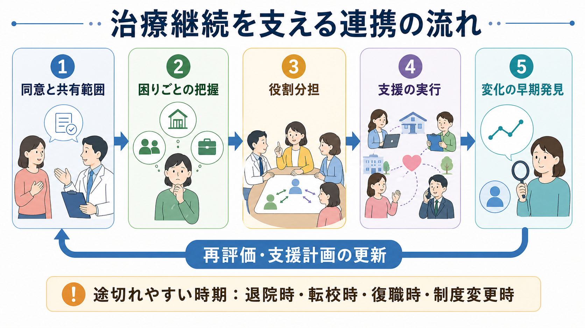
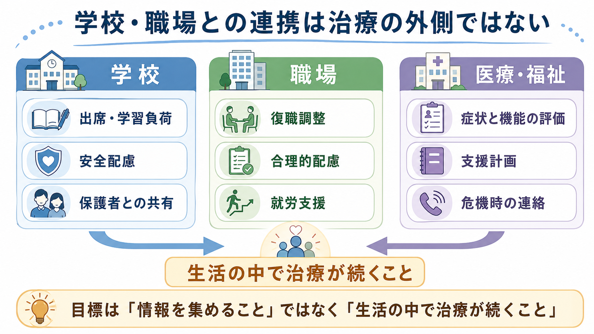

# 地域連携は精神科診療で何を意味するのか

## 要点

- 地域連携とは、診療室の中の治療を、本人の住まい・学校・職場・福祉制度・危機対応へ接続する実務である。
- 目的は「多くの関係者に情報を渡すこと」ではなく、本人の同意と目的共有のもとで、治療が途切れやすい場面を減らすことである。
- 精神科診療では、症状の軽減だけでなく、再受診、服薬や心理社会的支援への参加、住まい、学業、就労、家族支援、危機時の連絡経路が治療継続に直結する。
- 連携が有効になる条件は、同意、最小限の情報共有、役割分担、再評価、責任の所在の明確化である。

## この記事で答える問い

精神科診療で「地域と連携する」と言うとき、それは紹介状を書くこと、福祉窓口を案内すること、学校や職場へ診断名を伝えることだけを意味しない。この記事では、地域連携を「本人が生活の中で治療を続けられるように、医療・行政・福祉・教育・就労の支援を接続する仕組み」として整理する。

## まず結論

地域連携は、精神科治療の外側にある付加サービスではない。精神症状は生活リズム、対人関係、住居、経済状況、学校・職場での負荷、家族の理解、制度利用のしやすさに影響される。そのため精神科診療では、[[生物心理社会モデルとは何か]]の視点から、診療室内で得た情報を生活上の支援に変換する必要がある。

日本では「精神障害にも対応した地域包括ケアシステム」が、精神障害の有無や程度にかかわらず、誰もが地域の一員として安心して自分らしい暮らしをするという方向性を掲げている[1]。WHO も、精神保健サービスを施設中心から、本人中心・権利基盤・地域生活に近い支援ネットワークへ移すことを重視している[2][3]。つまり地域連携とは、治療の責任を薄めることではなく、治療の継続条件を地域の中に設計することである。

## 背景

精神科診療では、診断名や薬物療法だけでは治療継続を説明できない。予約に来られない、薬を中断する、退院後の生活が整わない、学校や職場で負荷が急増する、家族が対応に疲弊する、制度の切れ目で支援が止まる。こうした「途切れ」は、しばしば症状悪化や再入院の前段階になる。

退院時の移行支援は典型例である。NICE は、精神科入院から地域・ケアホームへの移行において、入院前後から退院後までの計画、本人と家族・介護者の関与、病院側と地域側の協働を重視している[4]。移行が不十分だと、退院後支援の不足、再入院、本人・家族が計画に関与できないことが問題になりやすい[4]。

## 基本概念

### 連携の単位は「機関」ではなく「継続課題」

地域連携では、関係機関名を並べるだけでは不十分である。医療機関、行政、福祉、学校、職場、家族・支援者が関わるとしても、中心に置くべき単位は「誰が、何を、いつまでに、どの情報に基づいて行うか」である。

たとえば、通院中断を防ぐ課題なら、医療機関は症状・副作用・予約調整を扱い、相談支援や訪問支援は生活上の障壁を拾い、行政窓口は制度利用を支える。学校や職場は、出席・勤務負荷、休職・復職、合理的配慮を検討する。ここで共有する情報は、診断名の詳細ではなく、支援目的に必要な機能情報に絞る。

### 同意と守秘は連携の前提である

地域連携は、本人の情報を広く流すことではない。[[インフォームドコンセントは精神科でどう行うのか]]と[[守秘義務とは何か]]の原則を踏まえ、誰に、何を、何の目的で共有するかを具体化する必要がある。本人の同意を得る過程そのものが、[[共同意思決定とは何か]]や[[コンコーダンスとは何か]]の実践になる。

例外的に安全確保や法令上の要請が関わる場面はあるが、その場合も「何でも共有してよい」という意味ではない。目的、緊急性、最小限性、記録、事後説明の可否を検討する。

### 連携はアドヒアランスを生活条件として扱う

[[アドヒアランスとは何か]]は、本人の意志の強さだけで決まるものではない。予約時間に行ける交通手段、薬を保管できる住環境、家族の理解、学校や職場の予定、経済的負担、制度手続きの難しさが影響する。地域連携は、治療方針を生活条件へ翻訳し、継続しやすい形に調整する作業である。

## 仕組み

### 1. 同意と共有範囲を決める

まず、本人と「何を連携したいのか」を確認する。退院後の生活、福祉サービス、通学、復職、家族支援、危機時対応など、目的を絞る。次に、共有する相手、共有する情報、共有しない情報、連絡方法、記録方法を決める。

この段階で曖昧なまま進めると、本人には「勝手に話された」という不信感が残り、支援者側には「どこまで動いてよいか分からない」という停滞が生じる。

### 2. 困りごとを症状と生活機能の両方から把握する

精神科診療では、症状評価だけでなく、生活機能と環境負荷を見立てる。たとえば抑うつ症状がある人に「復職可能か」を考える場合、気分症状、睡眠、集中、通勤、対人負荷、職務内容、職場の配慮、家族の支援を分けて評価する。学校連携では、出席、課題量、対人関係、保護者との共有、スクールカウンセラーや養護教諭との接続が論点になる。

### 3. 役割分担を明示する

多機関連携で最も起こりやすい失敗は、「誰かがやっているはず」という空白である。医師、看護師、精神保健福祉士、公認心理師、相談支援専門員、行政担当、学校担当、産業保健スタッフ、家族が関わる場合でも、主担当、連絡窓口、緊急時の判断、次回確認日を決めておく。

### 4. 支援を実行し、変化を早期に拾う

地域連携は一度の会議で完結しない。退院直後、転校・進学、休職・復職、支援制度の更新、家族構成の変化、症状悪化の前兆がある時期には、支援が途切れやすい。ACT やケースマネジメントの研究は、重い精神疾患をもつ人に対して、チームによる地域ベースの継続支援がサービス接触や入院、社会機能などの論点と関係することを示してきた[5]。

### 5. 再評価して計画を更新する

支援計画は、本人の状態、希望、環境が変われば更新される。地域連携の良し悪しは、会議の回数ではなく、本人の生活に合わせて支援を調整できたかで評価する。

## 図解

図のように、連携は「同意」「把握」「役割分担」「実行」「早期発見」の循環で考えると分かりやすい。特に退院時、転校時、復職時、制度変更時は、治療が途切れやすい移行点である。

学校・職場との連携は、診療の外側にある雑務ではない。学業や就労は、本人の生活リズム、自己効力感、社会参加、再発予防に関わる。NICE は若年者の精神病性障害で、本人の同意のもと学校・カレッジに連絡し、教育支援を求めることを推奨している[7]。また IPS 型の援助付き雇用は、重い精神疾患をもつ成人の競争的就労を増やす可能性が示されている[6]。

## 臨床・研究との接続

### 退院支援

退院支援では、退院日を決めることよりも、退院後に誰が何を見守るかが重要である。受診予約、薬の受け取り、住まい、金銭管理、家族の負担、危機時連絡、訪問支援、福祉サービスの開始時期を確認する。ここで[[家族への説明で何に注意するべきか]]や[[心理教育とは何か]]が関わる。

### 行政・福祉との連携

行政や福祉との連携では、障害福祉サービス、生活保護、住居、就労支援、相談支援、地域活動支援などが論点になる。医療者は制度の専門家でなくても、本人が制度に接続できるよう、診断書、意見書、情報提供、連絡窓口の確認を担うことがある。

### 学校との連携

学校連携では、診断名の開示よりも、出席、課題量、教室環境、試験、対人関係、安全配慮、保護者との共有範囲を扱う。本人が未成年の場合は、発達段階、同意能力、保護者の関与、虐待・安全配慮を含めて検討する。学校に伝える情報は、本人の学習継続と安全に必要な範囲に限る。

### 職場との連携

職場連携では、休職・復職、勤務時間、業務量、対人負荷、産業医・保健師、人事担当、就労支援機関との関係が問題になる。IPS や援助付き雇用の研究は、就労支援を医療・心理社会的支援と切り離さず、本人の希望する仕事と継続支援を重視する点に特徴がある[6]。

### 早期精神病支援

初回精神病エピソードでは、医療、家族支援、ケースマネジメント、心理社会的支援、教育・就労支援を組み合わせる coordinated specialty care が研究されてきた。NIMH の RAISE では、チーム型で本人・家族と個別化した治療計画を作る支援が、通常ケアより治療継続や症状、対人関係、生活の質の改善と関連したと報告されている[8]。

## よくある誤解

### 誤解1: 連携とは診療情報を詳しく渡すことである

必要なのは「詳しさ」ではなく「目的に合った最小限の情報」である。学校や職場には、診断名よりも、どの場面で負荷が高く、どの配慮が治療継続に役立つかが有用なことが多い。

### 誤解2: 本人が拒否したら連携は何もできない

拒否は終点ではなく、何が不安なのかを話し合う入口である。共有先、共有内容、時期、同席の有無、文書の確認権を調整すると、限定的な連携なら合意できることがある。

### 誤解3: 地域連携は医療者の責任を外へ移すことである

地域連携は責任放棄ではない。むしろ、医療者が診療室内の判断を生活場面に接続し、支援者間の空白を減らすための責任ある調整である。

### 誤解4: 会議が多いほど連携できている

会議の回数より、本人の目標、役割分担、連絡窓口、再評価日が明確かどうかが重要である。会議が多くても、次の行動が決まらなければ連携は進まない。

## 関連ノート

- [[アドヒアランスとは何か]]
- [[コンコーダンスとは何か]]
- [[共同意思決定とは何か]]
- [[インフォームドコンセントは精神科でどう行うのか]]
- [[守秘義務とは何か]]
- [[心理教育とは何か]]
- [[家族への説明で何に注意するべきか]]
- [[生物心理社会モデルとは何か]]
- [[治療関係とは何か]]

## 理解チェック

1. 地域連携の目的を「情報共有」ではなく「治療継続」として説明すると、何が変わるか。
2. 学校や職場へ共有する情報を最小限にするために、どのような問いを立てるべきか。
3. 退院時、転校時、復職時に支援が途切れやすい理由は何か。
4. 本人が連携を拒否した場合、同意形成のために調整できる要素は何か。

## 関連ノート候補

- 地域包括ケアシステムと精神科医療
- 退院支援とは何か
- ケースマネジメントとは何か
- ACTとは何か
- IPSと援助付き雇用
- 学校連携と精神科診療
- 復職支援と精神科診療

## MOC更新候補

- `content/00_MOC/` 配下の精神医学・臨床実践・地域精神保健に関する MOC
- `content/03_精神医学/総論・診断・面接` の索引相当ページがある場合は、本記事へのリンク追加

## 未解決問題

- 地域連携の効果は、疾患別介入だけでなく、地域資源、制度、チーム構造、支援密度に左右されるため、単一の介入名だけでは評価しにくい。
- 学校・職場連携では、本人の権利保護と安全配慮、合理的配慮、情報最小化のバランスを個別に検討する必要がある。
- 日本の地域精神保健では、医療、障害福祉、介護、教育、産業保健の制度境界をまたぐ実装研究がさらに必要である。

## 参考文献

[1] 厚生労働省. (2021). 「精神障害にも対応した地域包括ケアシステムの構築に係る検討会」報告書. https://www.mhlw.go.jp/stf/shingi2/0000152029_00003.html

[2] World Health Organization. (2021). *Guidance on community mental health services: promoting person-centred and rights-based approaches*. https://www.who.int/publications/i/item/9789240025707

[3] World Health Organization. (2021). *Comprehensive mental health service networks: promoting person-centred and rights-based approaches*. https://www.who.int/publications-detail-redirect/9789240025844

[4] National Institute for Health and Care Excellence. (2016). *Transition between inpatient mental health settings and community or care home settings* (NG53). https://www.nice.org.uk/guidance/ng53

[5] Mueser, K. T., Bond, G. R., Drake, R. E., & Resnick, S. G. (1998). Models of community care for severe mental illness: a review of research on case management. *Schizophrenia Bulletin, 24*(1), 37-74. https://doi.org/10.1093/oxfordjournals.schbul.a033314

[6] Kinoshita, Y., Furukawa, T. A., Kinoshita, K., Honyashiki, M., Omori, I. M., Marshall, M., Bond, G. R., Huxley, P., Amano, N., & Kingdon, D. (2013). Supported employment for adults with severe mental illness. *Cochrane Database of Systematic Reviews*, 2013(9), CD008297. https://doi.org/10.1002/14651858.CD008297.pub2

[7] National Institute for Health and Care Excellence. (2013/2016). *Psychosis and schizophrenia in children and young people: recognition and management* (CG155). https://www.nice.org.uk/guidance/cg155

[8] National Institute of Mental Health. (2023). RAISE-ing the Standard of Care for Schizophrenia: The Rapid Adoption of Coordinated Specialty Care in the United States. https://www.nimh.nih.gov/news/science-updates/2023/raise-ing-the-standard-of-care-for-schizophrenia-the-rapid-adoption-of-coordinated-specialty-care-in-the-united-states
