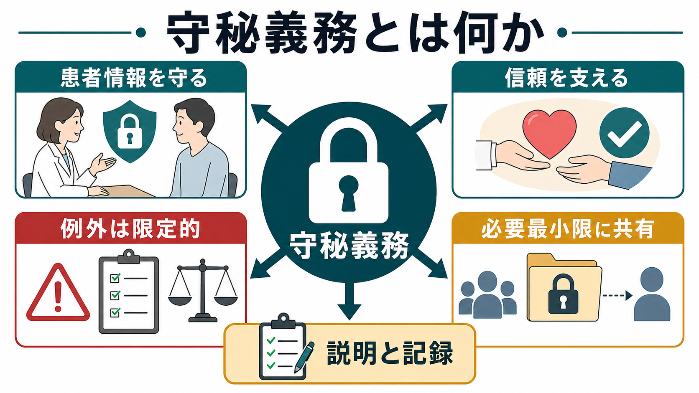
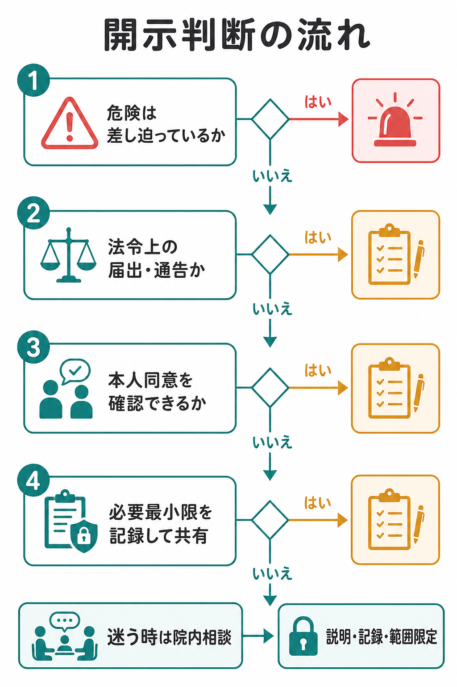
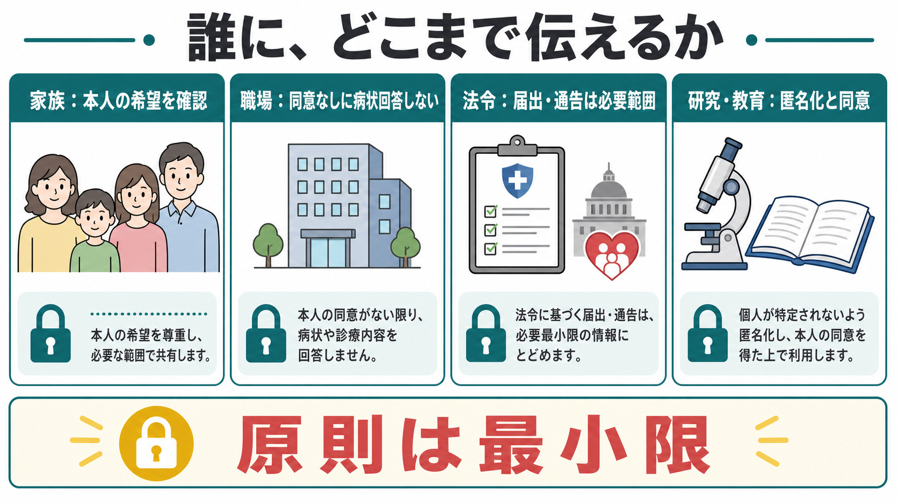

# 守秘義務とは何か

## 要点

- 守秘義務とは、診療で知り得た患者の秘密や個人情報を、正当な理由なく外部へ漏らさない専門職上・法的・倫理的な義務である。
- 精神科診療では、症状、家族関係、生活歴、トラウマ、物質使用、自傷他害リスク、職場や学校の事情など、本人にとって不利益や stigma につながりやすい情報を扱うため、守秘義務は [[治療関係とは何か|治療関係]] の基盤になる。
- 守秘義務は絶対ではない。本人の同意、法令上の届出・通告、生命・身体・財産の保護に必要で本人同意を得ることが困難な場合など、限定的な例外がある [1][2][3]。
- 例外的に開示する場合でも、目的を明確にし、開示範囲を必要最小限にし、可能な範囲で本人へ説明し、判断過程を記録する。

## この記事で答える問い

1. 守秘義務は、精神科診療で何を守っているのか。
2. 患者情報を家族、職場、行政、他職種、研究・教育の場へ共有してよい条件は何か。
3. 自傷他害、虐待、感染症、法令上の届出などが関わるとき、どのように考えるべきか。
4. 例外的開示を行うとき、臨床家は何を説明し、何を記録するべきか。

## まず結論

守秘義務は「患者情報を誰にも言わない」という単純な禁止ではなく、「患者の利益、自律性、安全、社会的権利を守るために、情報の流れを専門職として制御する原則」である。刑法は、医師などが業務上知り得た人の秘密を正当な理由なく漏らすことを罰する規定を置いている [1]。また医療機関は、個人情報保護法と医療・介護分野のガイダンスに沿って、利用目的、第三者提供、本人同意、例外規定を扱う必要がある [2][3]。

精神科では、秘密保持を丁寧に説明すること自体が [[精神科面接とは何か|精神科面接]] の一部である。「ここで話したことは原則として診療目的の範囲で扱う。ただし、差し迫った安全上の危険や法令上の通告・届出が必要な場合には、必要最小限を共有することがある」と最初に伝えると、患者は安心して話しやすくなる。同時に、例外があることを隠さないため、後から「裏切られた」と感じる危険も減る。

## 背景

精神科診療では、本人がまだ言語化できない困りごと、家族内の葛藤、希死念慮、暴力被害、違法薬物使用、性に関する悩み、職場での不利益、診断名への恐れなどが語られる。これらは診断や治療に重要である一方、本人の同意なしに拡散すると、雇用、保険、家族関係、地域生活、自己理解に深い損害を与え得る。

そのため守秘義務は、単に「秘密を守る美徳」ではなく、情報を出すことで本人が傷つく可能性をあらかじめ引き受ける制度である。世界医師会の国際医の倫理綱領も、患者の秘密保持を重視し、本人同意や重大で差し迫った危害を避ける必要など限られた場合を除いて秘密を守るべきだとしている [7]。

## 基本概念

### 秘密と個人情報

「秘密」は、本人が他者に知られたくない内容、または知られると社会的・心理的・経済的不利益が生じ得る内容を含む。診断名、症状、服薬、通院歴だけでなく、面接で得た家族関係、生活歴、職場情報、宗教・文化的背景、性に関する情報、トラウマ体験も含まれる。

「個人情報」は、氏名や生年月日など本人を識別できる情報であり、医療情報はとくに慎重な取扱いが求められる。医療機関では、診療目的、会計、院内連携、紹介、地域連携、保険請求など、通常想定される利用目的を明確にし、目的外利用や第三者提供には本人同意または法令上の根拠が必要になる [2][3]。

### 正当な理由

守秘義務違反が問題になるのは、秘密を「正当な理由なく」漏らした場合である [1]。正当な理由には、本人の明示的・黙示的同意、法令上の届出・通告、生命・身体・財産の保護のため本人同意を得ることが困難な場合、裁判所や捜査機関からの適法な手続きに基づく照会などが含まれ得る。ただし、何でも「正当化」できるわけではない。必要性、緊急性、代替手段、開示範囲、本人への説明可能性を検討する必要がある。

### 最小限の開示

例外的開示で重要なのは、「開示するかしないか」の二分法ではなく、「誰に、何を、どこまで、何の目的で伝えるか」である。家族へ連絡する場合でも、診断名や詳細な生活歴をすべて伝える必要はないことが多い。職場へ診断書を書く場合も、業務上必要な配慮や就業制限を中心に書き、本人が望まない病状詳細を不用意に記載しない。

## 仕組み

### 1. 原則は本人の情報統制を支える

守秘義務の第一の機能は、患者が自分の情報をどの範囲で共有するかを統制できるようにすることである。本人が「家族には薬の内容を伝えないでほしい」「職場には診断名を出したくない」と希望する場合、その希望は臨床的にも倫理的にも重要な情報である。

ただし、本人の希望は常にそのまま実行されるとは限らない。たとえば、差し迫った自殺リスクがあり、本人が支援を拒否していて、他の安全確保手段が乏しい場合には、緊急連絡先や救急・行政機関との情報共有を検討することがある。この場合も、本人の意向を無視するのではなく、「安全を守るために、どの情報を誰へ伝える必要があるか」を限定して考える。

### 2. 例外は目的別に考える

例外的開示は、少なくとも次のように分けて考えると整理しやすい。

| 開示の目的 | 典型例 | 判断の焦点 |
|---|---|---|
| 本人同意に基づく共有 | 家族面談、紹介状、職場提出用診断書 | 同意の範囲、本人の理解、撤回可能性 |
| 法令上の届出・通告 | 感染症法上の届出、児童虐待の通告など | 法令上の根拠、必要情報、提出先 |
| 生命・身体の保護 | 差し迫った自殺・他害リスク、重篤なセルフネグレクト | 緊急性、重大性、代替手段の有無 |
| 診療継続に必要な院内・多職種共有 | チーム医療、当直引き継ぎ、訪問看護連携 | 診療目的との関連、アクセス制限 |
| 研究・教育 | 症例検討、論文、講義 | 匿名化、同意、再識別リスク |

感染症法では、一定の感染症について医師の届出が定められている [4]。児童虐待防止法では、児童虐待を受けたと思われる児童を発見した者に通告義務がある [5]。精神科診療では、虐待、DV、自傷他害リスク、身体疾患、物質使用、家庭内暴力などが複合するため、守秘義務と安全確保を対立させず、制度上の相談先や院内ルールを使って判断する。

### 3. 精神科では「先に説明する」ことが治療的である

秘密保持の例外を最初から説明すると、患者が話しにくくなるのではないかと心配されることがある。実際には、曖昧な約束の方が危うい。「何が秘密として守られるか」「どのような場合に例外があるか」「その場合でも必要最小限にすること」を先に説明すると、患者は関係の枠組みを予測しやすくなる。これは [[精神科面接で境界設定はなぜ必要なのか|境界設定]] と同じく、距離を置くためではなく、安全な共同作業を作るための実践である。

### 4. 記録は防御ではなく説明責任である

例外的開示をした場合は、少なくとも次を診療録に残す。

- 開示を検討した理由
- 本人への説明と反応
- 同意の有無、または同意を得られなかった理由
- 開示先、開示内容、開示時刻
- 開示範囲を最小限にした根拠
- 院内相談、上級医相談、法務・倫理相談の有無

記録は「後で責められないため」だけのものではない。チームが同じ情報で動き、次の面接で本人に説明し直し、治療関係を修復するための臨床的な道具である。

## 図解

図1は、守秘義務が「患者情報を守る」「信頼を支える」「例外は限定的」「必要最小限に共有」「説明と記録」という複数の機能から成ることを示している。図2は、危険性、法令、本人同意、最小限の共有と記録という開示判断の流れを示している。図3は、家族、職場、法令、研究・教育の場面で、共有の範囲が異なることを整理している。

## 臨床・研究との接続

### 家族との情報共有

家族は治療の重要な支援者になり得るが、家族であることだけで診療情報を自由に得られるわけではない。本人が成人で判断能力を保っている場合、家族へ伝える情報は本人の同意に基づくのが原則である。家族面談では、「家族から情報を聞くこと」と「家族へ本人の情報を伝えること」を分けて考える。家族から生活状況を聞くことはできても、本人の診断名や面接内容を返すには別の判断が必要になる。

### 職場・学校とのやりとり

職場や学校から問い合わせがあっても、本人同意なしに病状、診断名、通院歴、服薬内容を回答しない。診断書や意見書では、本人と記載内容を確認し、目的に沿って必要最小限を書く。業務配慮が目的なら、「抑うつ症状のため午前勤務から段階的復職が望ましい」のように機能と配慮を中心に書ける場合がある。

### 自傷他害リスク

自傷他害リスクがある場合、守秘義務は「何もしない理由」にはならない。差し迫った重大な危険があり、本人同意を得る時間や能力が乏しく、他の手段では安全確保が困難な場合には、救急、家族、行政、警察などとの必要最小限の共有が検討される。英国 GMC の守秘義務ガイダンスも、患者や他者を重大な危害から守るために開示が正当化される場合があると整理している [8]。日本の実務では、地域の精神保健福祉体制、医療保護・措置入院制度、院内手順に沿って判断する。

### 研究・教育

症例検討、講義、論文、学会発表では、匿名化しても再識別の危険が残る。希少疾患、地域、年齢、職業、家族構成、発症時期などの組み合わせで本人が推測されることがある。研究・教育利用では、倫理審査、本人同意、匿名化、情報削減、発表媒体の範囲を確認する。精神科症例は生活史情報が豊富なため、単に氏名を消すだけでは不十分である。

## よくある誤解

### 「家族なら当然説明してよい」

家族は支援者であることが多いが、本人の秘密を自動的に共有できる相手ではない。本人の同意、本人の判断能力、安全上の緊急性、家族関係の安全性を確認する。虐待や DV が疑われる場合、家族共有そのものが危険になることもある。

### 「守秘義務があるので、自殺リスクがあっても誰にも言えない」

守秘義務は安全確保を妨げるための原則ではない。差し迫った重大な危険がある場合、必要最小限の開示が正当化されることがある。ただし、開示は広く行うのではなく、目的に合う相手へ限定する。

### 「本人同意があれば何でも共有できる」

本人同意があっても、共有内容は目的に照らして必要な範囲に限定する。患者が不安や依存から過剰な開示を望む場合もあるため、臨床家は本人の利益、将来の不利益、撤回可能性を説明する。

### 「匿名化すれば研究・教育で自由に使える」

精神科症例では、生活史や文脈が本人同定につながりやすい。匿名化、同意、倫理審査、情報の削減、症例の加工による臨床的意味の変化を検討する必要がある。

## 関連ノート

### 既存ノート

- [[精神科面接とは何か]]
- [[治療関係とは何か]]
- [[精神科面接で境界設定はなぜ必要なのか]]
- [[精神科初診で何を確認するべきか]]
- [[ラポールはどのように形成されるのか]]
- [[生物心理社会モデルとは何か]]

### 今後の作成候補

- インフォームドコンセントとは何か
- 自殺リスク評価とは何か
- 医療における個人情報保護とは何か
- 児童虐待通告と精神科診療はどう関係するのか
- 症例報告で匿名化はどこまで必要か

### MOC更新候補

- `content/00_MOC/` 配下の精神医学、精神科面接、臨床倫理、医療情報管理に関する MOC へリンクを追加する。
- 並列ジョブとの競合を避けるため、本タスクでは MOC 本体は更新しない。

## 理解チェック

1. 守秘義務は、患者情報の何を守るための原則か。
2. 家族から電話で病状を尋ねられたとき、まず何を確認するべきか。
3. 法令上の届出・通告と、本人同意に基づく情報共有は何が違うか。
4. 自傷他害リスクが高いとき、守秘義務と安全確保をどのように両立させるか。
5. 例外的開示をした場合、診療録に何を残すべきか。

## 参考文献

[1] e-Gov 法令検索. 刑法（明治四十年法律第四十五号）第134条（秘密漏示）. https://elaws.e-gov.go.jp/document?lawid=140AC0000000045

[2] e-Gov 法令検索. 個人情報の保護に関する法律（平成十五年法律第五十七号）第27条（第三者提供の制限）. https://elaws.e-gov.go.jp/document?lawid=415AC0000000057

[3] 個人情報保護委員会・厚生労働省. 医療・介護関係事業者における個人情報の適切な取扱いのためのガイダンス. https://www.ppc.go.jp/personalinfo/legal/iryoukaigo_guidance/

[4] e-Gov 法令検索. 感染症の予防及び感染症の患者に対する医療に関する法律（平成十年法律第百十四号）. https://elaws.e-gov.go.jp/document?lawid=410AC0000000114

[5] e-Gov 法令検索. 児童虐待の防止等に関する法律（平成十二年法律第八十二号）第6条（児童虐待に係る通告）. https://elaws.e-gov.go.jp/document?lawid=412AC0000000082

[6] 日本医師会. 医の倫理の基礎知識「守秘義務」. https://www.med.or.jp/doctor/rinri/i_rinri/b08.html

[7] World Medical Association. *WMA International Code of Medical Ethics*. https://www.wma.net/policies-post/wma-international-code-of-medical-ethics/

[8] General Medical Council. *Confidentiality: good practice in handling patient information*. https://www.gmc-uk.org/professional-standards/the-professional-standards/confidentiality
