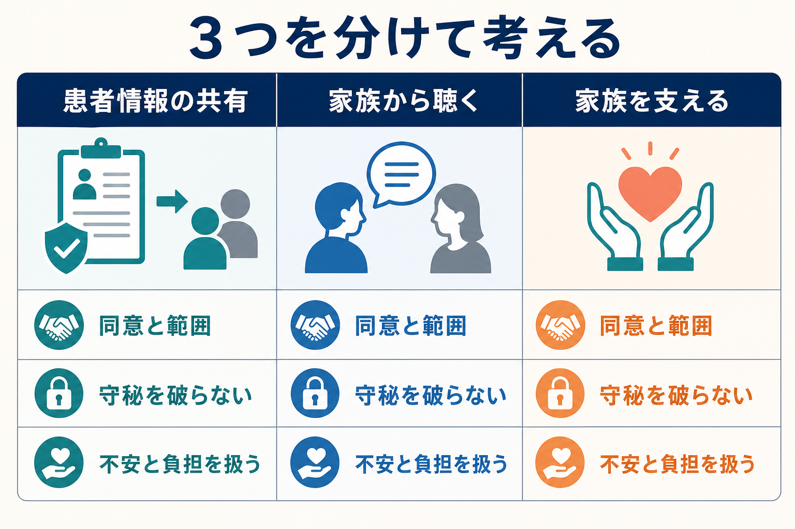
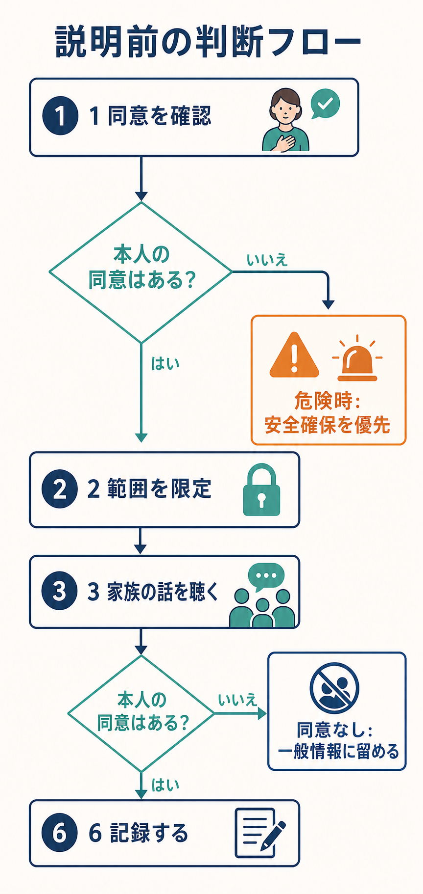
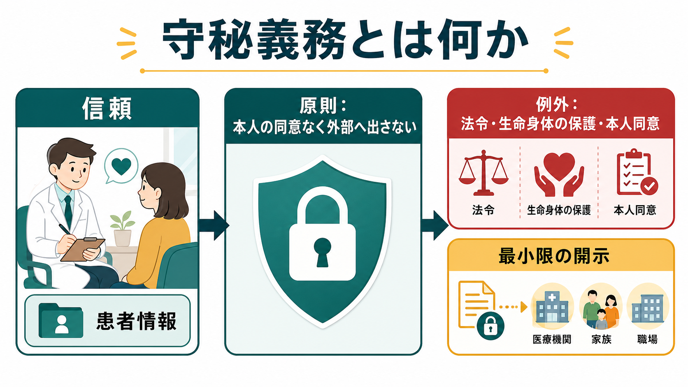

# 家族への説明で何に注意するべきか

## 要点

- 家族への説明は、本人の[[治療関係とは何か|治療関係]]を壊さず、家族の支援力を高めるために行う。
- 原則は「本人の意思確認」「共有範囲の限定」「家族の不安への応答」「治療協力への翻訳」「記録」である。
- 日本の医療・介護分野の個人情報ガイダンスでは、家族等への病状説明は通常の医療提供に必要な利用目的に含まれうるが、できる限り本人に説明対象者、方法、時期を確認し、本人の意思に配慮することが求められる[1]。
- 守秘義務は絶対ではないが、同意なしの情報共有は、生命・身体・財産の保護、法令、重大な危険など、正当化できる範囲に限定される[1][2][3]。
- 家族を「情報を渡す相手」とだけ見ず、患者の支援者であり、同時に不安・負担を抱える当事者として扱う[4][5]。

## この記事で答える問い

1. 家族へどこまで説明してよいのか。
2. 本人が家族への説明を拒むとき、何ができて何ができないのか。
3. 家族の不安や怒りにどう応答すれば、治療協力につながるのか。
4. 家族への説明を、[[精神科面接とは何か|精神科面接]]と治療計画の中にどう位置づけるのか。

## まず結論

家族への説明で最初に確認するべきなのは、「家族が何を知りたいか」ではなく、「患者本人が、誰に、何を、どの範囲で共有してよいと考えているか」である。説明の相手が配偶者、親、きょうだい、同居家族であっても、家族であることだけで診療情報への包括的なアクセス権が生じるわけではない。

ただし、守秘を盾にして家族を完全に遮断することも、臨床的にはしばしば不十分である。家族は服薬、受診継続、生活リズム、危機対応、再発徴候の観察、経済・住居・就労支援に関わることがある。統合失調症などでは、家族介入や心理教育が再発や入院を減らしうることが示されている[5][6]。したがって家族説明は、本人の秘密を漏らす場ではなく、本人の同意と安全を土台に、家族が支えやすくなる情報へ翻訳する場である。

## 背景

精神科臨床では、家族への説明が難しくなりやすい。理由は三つある。

第一に、扱う情報が極めて個人的である。診断名、希死念慮、トラウマ、物質使用、対人関係、性、金銭、職場や学校との関係などは、本人にとって「知られたくない情報」でありうる。精神障害や病歴は、個人情報保護法上も特に配慮を要する情報に含まれる[1]。

第二に、家族はしばしば治療の外側ではなく内側にいる。患者が一人で生活している場合でも、家族が受診を促し、危機時に同伴し、服薬や生活の変化を見守ることがある。NICEは、精神病・統合失調症の診療において、本人と家族・介護者に対して情報共有の仕方を早期から話し合い、定期的に見直すことを勧めている[4]。

第三に、家族もまた不安を抱える。家族は「何が起きているのか」「どう接すればよいのか」「自分のせいなのか」「危険はあるのか」「治療に協力すべきか距離を取るべきか」を知りたい。ここに答えないまま、守秘だけを告げると、家族は見捨てられたと感じやすい。逆に、本人の同意を超えて詳細を話すと、本人の信頼を失い、以後の治療参加を難しくする。

## 基本概念

### 本人の同意

本人の同意とは、本人が「その相手に、その範囲の情報を、その目的で伝えてよい」と理解し、承諾していることである。日本の医療・介護分野の個人情報ガイダンスは、家族等への病状説明について、通常の医療提供に必要な利用目的に含まれうるとしつつ、本人に説明対象者の範囲、方法、時期をあらかじめ確認するなど、できる限り本人の意思に配慮する必要があるとしている[1]。

臨床では、同意を一度だけの手続きにしない。次のように具体化する。

| 確認すること | 面接での言い方 |
|---|---|
| 誰に話すか | 「今日の説明は、お母さんと配偶者のどちらまで共有してよいですか」 |
| 何を話すか | 「診断名、薬、今後の見通しのうち、どこまで話してよいですか」 |
| 何を話さないか | 「家族に知られたくないことはありますか」 |
| 本人同席か別席か | 「一緒に説明する形がよいですか。先に私と確認してからにしますか」 |
| 変更可能性 | 「あとから共有範囲を変えたい場合は、いつでも言ってください」 |

### 守秘義務

守秘義務は、患者が安心して語るための条件である。日本では、医師などが正当な理由なく業務上知り得た秘密を漏らすことは刑法上の秘密漏示に当たりうる[2]。したがって、家族から「親だから知る権利がある」「配偶者だから全部説明してほしい」と言われても、それだけで本人情報を包括的に説明してよいわけではない。

一方で、守秘義務は臨床判断を停止するための合言葉ではない。本人の同意が得られない場合でも、生命・身体・財産の保護のために必要で、本人の同意を得ることが困難な場合などには、家族等への説明が可能となる場合がある[1]。GMCの守秘義務ガイダンスも、患者が同意しない場合でも、死亡または重大な危害のリスクを避けるために必要で、患者と公共の守秘利益を上回ると判断される場合には、最小限の情報開示が正当化されうると整理している[3]。

### 家族から聴くことと家族へ話すこと

家族から情報を聴くことと、家族へ患者情報を話すことは別である。本人が家族への情報共有を拒んでいても、家族から「最近眠れていない」「薬を飲めていないようだ」「暴力や自傷の心配がある」といった情報を聴くことは、原則として可能である。ただし、家族から得た情報を本人にどう扱うか、家族の安全や関係性に悪影響が出ないかには配慮が必要である[1]。

この区別は、[[家族歴から何がわかるのか|家族歴]]を扱うときにも重要である。家族は診断の証人ではなく、本人の生活と支援環境を理解するための情報源でもある。

### 家族支援

家族に対してできることは、患者の秘密を話すことだけではない。本人の同意がない場合でも、一般的な疾患教育、危機時の相談先、家族自身の相談窓口、接し方の一般原則、受診を促すときの工夫、家族自身の休息と安全確保については説明できることが多い。

NICEは、家族・介護者に対し、診断と治療、回復、支援の種類、チームの役割、危機時の助けの求め方について、書面と口頭でアクセスしやすく情報提供することを推奨している[4]。これは患者情報の無制限な共有ではなく、家族が孤立せず支援に参加できるための情報提供である。

## 仕組み

### 1. 説明前に「同意・目的・範囲」を決める

家族説明の前に、本人と短く打ち合わせる。説明の目的が「家族を納得させる」になっていると、本人は責められる場として体験しやすい。目的は「本人が治療を続けやすくする」「家族が不安と対応を整理する」「危機時に何をするか決める」と具体化する。

共有範囲は、診断名、症状の一般説明、薬の目的、副作用、再発サイン、受診継続、生活上の注意、危機対応、家族の接し方などに分ける。本人が「診断名はまだ言わないでほしい」と希望するなら、まずは「睡眠や緊張が悪化したときの対応」「受診継続の重要性」など、本人の同意範囲で役立つ説明にする。

### 2. 家族の不安を最初に聴く

家族は、説明を聞く前から強い不安や疲労を抱えていることがある。いきなり診断名や薬の説明に入るより、「今日いちばん心配していることは何ですか」「ここまで一番困った場面はどこですか」と聴く方が、必要な説明を選びやすい。

ここで重要なのは、家族の語りを患者への批判としてそのまま扱わないことである。家族の訴えには、怒り、恐怖、罪悪感、疲労、経済的不安、将来不安が混ざる。[[共感的理解とは何か|共感的理解]]と[[要約は面接でなぜ重要なのか|要約]]を使い、「ご家族としては、夜間の対応と今後の見通しが特に不安なのですね」と整理する。

### 3. 診断名より「接し方」と「次の行動」に翻訳する

家族説明は、専門用語の解説会ではない。家族が明日から使える形に翻訳する必要がある。

たとえば「病識が乏しい」という説明だけでは、家族は「本人に病気だと認めさせればよい」と理解しがちである。むしろ「本人にとっては、今は病気という言葉よりも、眠れない、疲れる、外出が怖い、といった困りごとの方が話しやすいかもしれません」と説明する。これは[[病識とは何か|病識]]をめぐる対立を減らす。

「薬を飲ませてください」ではなく、「飲めない理由を責めずに、眠気、だるさ、太る心配、薬への不信を次回一緒に相談できる形にしてください」と伝える。家族を監視者にしすぎると、患者と家族の関係が悪化し、治療協力がかえって難しくなる。

### 4. 本人不在での説明は、一般情報と安全情報を中心にする

本人が同席しない、または本人が説明を望まない場合、家族へ話せる内容は慎重に限定する。患者固有の診断、発言、治療内容を話さなくても、次のような一般情報は提供できることが多い。

- 症状が悪化しやすい一般的なサイン
- 受診を促すときの一般的な言い方
- 家族が避けた方がよい対応
- 緊急時の相談先
- 家族自身の安全確保
- 家族相談、地域資源、家族会などの案内

HHSのHIPAA解説でも、本人が同意しない場合に家族が取りうる選択肢として、医療者へ懸念を伝えること、医療者が一般的情報を提供すること、重大で差し迫った危険がある場合に必要な情報共有がありうることが整理されている[7]。法域は異なるが、「家族から聴く」「一般情報を渡す」「重大危険時だけ最小限共有する」という臨床的区別は日本の実務にも参考になる。

### 5. 重大な危険では「秘密か共有か」ではなく「何を最小限共有するか」を考える

自傷他害、虐待、著しいセルフネグレクト、急性錯乱、意識障害、重い判断能力低下などが疑われる場合、本人の秘密保持だけを優先すると安全が損なわれることがある。個人情報保護委員会のQ&Aは、本人の同意を得られない場合でも、本人または家族等の生命、身体、財産の保護のために必要な場合には、家族等へ説明可能な場合があるとする[1]。

このときも、共有する情報は「危険を減らすために必要な最小限」にする。たとえば「本人が話した過去の詳細」ではなく、「今夜一人にしない方がよい」「刃物や大量の薬を一時的に管理する」「救急受診の目安」「次に連絡する窓口」を伝える。開示した情報、理由、相手、本人への説明可能性を記録する。

### 6. 説明後に記録する

記録は、医療者を守るためだけではなく、本人・家族・チーム間の一貫性を保つために必要である。少なくとも次を記録する。

| 記録項目 | 内容 |
|---|---|
| 本人の同意 | 誰に、何を、どの範囲で共有する同意があったか |
| 説明相手 | 氏名、続柄、同席者 |
| 説明内容 | 診断、治療、薬、生活、危機対応などの範囲 |
| 本人が望まなかった共有 | 話さなかった内容、理由 |
| 家族から得た情報 | 家族の懸念、観察、危険情報 |
| 例外的共有 | 同意なし共有の理由、必要性、最小限性 |
| 次の合意 | 連絡方法、受診、緊急時対応、再確認時期 |

## 図解

図の中心は、守秘義務が「家族と話してはいけない」という単純な禁止ではなく、「本人の同意と必要性に基づいて、範囲を絞る」原則である。家族から情報を聴くこと、家族へ患者情報を共有すること、家族自身を支えることは分けて考える。これを混同すると、患者には「勝手に話された」、家族には「何も教えてもらえない」という不信が生じやすい。

## 臨床・研究との接続

### 家族介入は「説明」だけではない

家族説明は、単発の病状説明に留まらない。家族心理教育や家族介入では、疾患理解、コミュニケーション、問題解決、危機時対応、再発サイン、家族自身の負担軽減を扱う。Cochraneレビューでは、統合失調症・類似疾患の家族介入が再発、入院、服薬遵守に有利に働く可能性が示されている[5]。家族心理教育のレビューでも、共感的関与、教育、継続的支援、危機時資源、問題解決、コミュニケーション技能が重要な構成要素として整理されている[6][8]。

ただし、家族介入のエビデンスを「家族には何でも説明すべき」という根拠にしてはいけない。家族介入が有効なのは、本人の尊厳と秘密を守りつつ、家族を治療上の協力者として位置づけるからである。

### 回復志向と家族説明

[[精神医学における回復とは何か|回復]]の観点では、家族説明の目的は、患者を家族管理の対象にすることではない。本人が自分の生活、選択、希望を取り戻すために、家族がどのような距離で支えられるかを調整することである。説明では、症状やリスクだけでなく、本人の強み、できていること、望んでいる生活、避けたい支援も共有範囲に含める。

### 疾病受容を急がせない

家族は「本人に病気だと認めさせたい」と考えることがある。しかし、[[疾病受容とは何か|疾病受容]]は説得で成立するものではない。むしろ、本人が恥や敗北として受け取る言葉を避け、困りごと、睡眠、疲労、対人ストレス、生活上の目標から入る方が治療参加につながりやすい。

### 境界設定としての家族説明

家族説明は[[精神科面接で境界設定はなぜ必要なのか|境界設定]]でもある。家族に「24時間対応してください」と言うのは過剰な負担であり、患者に「家族の言うことを聞いてください」と言うのは自律性を損ねる。誰が何を担い、どこから専門職や救急につなぐのかを明確にすることが、患者と家族の双方を守る。

## よくある誤解

### 誤解1: 家族なら診療情報を知る権利がある

家族であることは重要な文脈だが、それだけで本人情報への包括的な権利にはならない。本人の同意、医療上の必要性、説明範囲、例外事由を確認する必要がある[1][2]。

### 誤解2: 守秘義務があるので家族とは何も話せない

守秘義務があっても、一般的な疾患情報、危機時の相談先、家族自身の支援、家族からの情報聴取は可能なことが多い。問題は「話すか話さないか」ではなく、「何を、誰に、どの目的で、どの範囲まで話すか」である。

### 誤解3: 家族に詳しく説明すれば治療協力は得られる

説明量が多いほど協力が増えるとは限らない。家族が受け取れる量、感情状態、文化的背景、患者との関係、家族内の権力関係を見なければ、説明は説得や責任転嫁として働くことがある。

### 誤解4: 本人が拒否したら家族支援はできない

本人情報の共有は制限されるが、家族の不安を聴く、一般的な対応を伝える、家族自身の相談先を案内する、危機時の一般的手順を確認することはできる。本人の秘密を守りながら、家族を孤立させない方法を探す。

### 誤解5: 危険があれば何でも共有してよい

重大な危険がある場合でも、共有は必要最小限にする。危険を減らす目的に関係しない過去の詳細、本人の発言、家族関係の秘密まで広げない。可能なら本人に説明し、困難な場合でも理由と範囲を記録する[3]。

## 関連ノート

### 既存ノート

- [[精神科面接とは何か]]
- [[治療関係とは何か]]
- [[精神科面接で境界設定はなぜ必要なのか]]
- [[家族歴から何がわかるのか]]
- [[精神医学における回復とは何か]]
- [[病識とは何か]]
- [[疾病受容とは何か]]
- [[支持的面接とは何か]]
- [[共感的理解とは何か]]
- [[要約は面接でなぜ重要なのか]]

### 今後の作成候補

- 精神科における守秘義務とは何か
- 家族心理教育とは何か
- 家族からの情報提供をどう扱うべきか
- 危機時の家族連携で何を確認するべきか
- 本人が家族説明を拒むときどう対応するか

### MOC更新候補

- `content/00_MOC/` 配下の精神医学、精神科面接、臨床倫理、家族支援関連MOCに追加候補。
- 並列ジョブとの競合を避けるため、本タスクではMOC本体は更新しない。

## 理解チェック

1. 家族への説明前に、本人へ確認すべき「誰に・何を・どの範囲で」以外の項目は何か。
2. 「家族から情報を聴くこと」と「家族へ患者情報を共有すること」は、なぜ分けて考える必要があるか。
3. 本人が家族への説明を拒んだ場合でも、家族に提供できる可能性がある情報は何か。
4. 重大な危険がある場合、同意なし共有を検討するときに「必要最小限」とは何を意味するか。
5. 家族心理教育の目的を、患者情報の共有ではなく治療協力として説明するとどう言えるか。

## 参考文献

[1] 個人情報保護委員会・厚生労働省. (2026). 医療・介護関係事業者における個人情報の適切な取扱いのためのガイダンス、同Q&A「患者・利用者の病状等をその家族等に説明する際に留意すべきことは何ですか。」 https://www.ppc.go.jp/personalinfo/legal/iryoukaigo_guidance/ / https://www.ppc.go.jp/all_faq_index/faq3-qb4-1

[2] e-Gov法令検索. 刑法第134条（秘密漏示）. https://elaws.e-gov.go.jp/document?lawid=140AC0000000045

[3] General Medical Council. (2024). *Confidentiality: good practice in handling patient information*. https://www.gmc-uk.org/professional-standards/the-professional-standards/confidentiality

[4] National Institute for Health and Care Excellence. (2014). *Psychosis and schizophrenia in adults: prevention and management* (CG178). https://www.nice.org.uk/guidance/cg178

[5] Pharoah, F., Mari, J. J., Rathbone, J., & Wong, W. (2010). Family intervention for schizophrenia. *Cochrane Database of Systematic Reviews*, CD000088. https://doi.org/10.1002/14651858.CD000088.pub3

[6] McFarlane, W. R., Dixon, L., Lukens, E., & Lucksted, A. (2003). Family psychoeducation and schizophrenia: A review of the literature. *Journal of Marital and Family Therapy, 29*(2), 223-245. https://doi.org/10.1111/j.1752-0606.2003.tb01202.x

[7] U.S. Department of Health & Human Services. (2022). *Family Members and Friends / Mental Health and HIPAA FAQs*. https://www.hhs.gov/hipaa/for-individuals/family-members-friends/index.html

[8] Lucksted, A., McFarlane, W., Downing, D., & Dixon, L. (2012). Recent developments in family psychoeducation as an evidence-based practice. *Journal of Marital and Family Therapy, 38*(1), 101-121. https://doi.org/10.1111/j.1752-0606.2011.00256.x

## 未解決問題

- 日本の精神科外来・入院・訪問支援で、家族説明の同意範囲をどの形式で記録すると実務負担と安全性のバランスがよいか。
- 本人が家族説明を拒むケースで、一般情報提供と家族支援が治療継続に与える効果をどのように評価するか。
- 家族内暴力、虐待、支配的関係がある場合の家族説明を、標準的な家族支援とどう切り分けるか。
