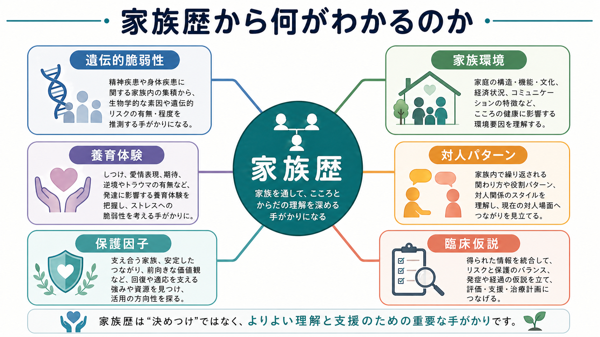
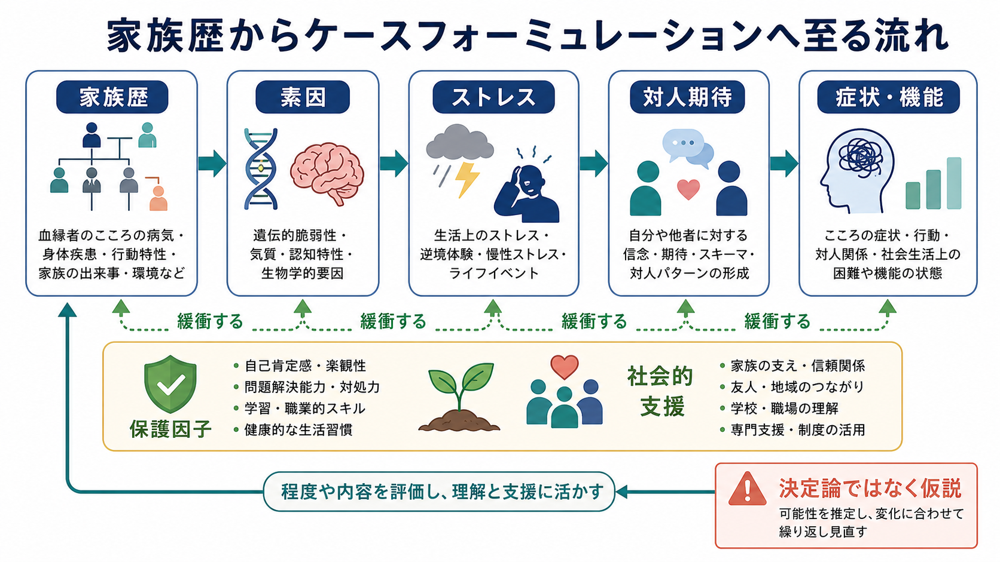
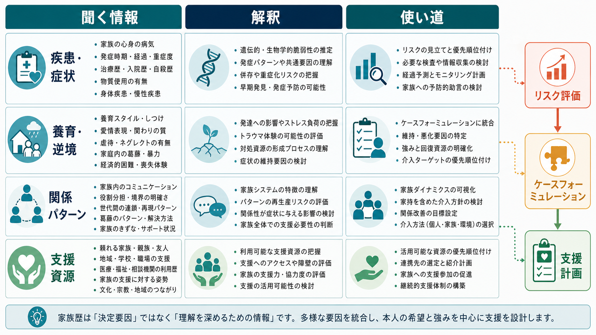

# 家族歴から何がわかるのか

## 要点

- 家族歴は「家族に同じ病気があるか」を確認するだけの項目ではない。血縁者の精神疾患、身体疾患、物質使用、自殺、発症年齢、経過、回復、治療反応、家族内の出来事を通じて、遺伝的脆弱性と環境要因の両方を整理する入口になる[1][2]。
- 精神疾患の多くは単一遺伝子で決まるものではなく、多数の遺伝的要因と環境要因が重なってリスクを変える多因子的な現象である[4][5]。
- 家族歴からは、養育体験、逆境的小児期体験、愛着、役割分担、葛藤、支援資源、対人パターンも見えてくる。これは[[生物心理社会モデルとは何か]]や[[ストレス脆弱性モデルとは何か]]の実践的な情報源である[6][7][8]。
- 家族歴は決定論ではない。「家族に疾患があるから本人も必ず発症する」でも、「家族環境が原因だ」でもない。臨床では、リスクと保護因子のバランス、現在の機能、本人の語り、文化的背景を統合して仮説化する。
- この記事は教育・研究目的の整理であり、個別診断や治療指示ではない。

## この記事で答える問い

1. 精神科面接で家族歴を聞くのは何のためか。
2. 家族歴から、遺伝的リスクと家族環境をどう分けて考えるか。
3. 養育体験や対人パターンは、現在の症状理解にどうつながるか。
4. 家族歴を聞くとき、決定論や家族への責任帰属をどう避けるか。

## まず結論

家族歴は、診断名を当てるための「家系図のチェック」ではなく、その人の症状がどのような脆弱性、ストレス、学習、関係性、支援資源の中で現れているのかを理解するための情報である。精神科評価のガイドラインでも、本人の現在症状だけでなく、精神医学的既往、医学的既往、物質使用、発達歴、家族歴、社会文化的文脈を含めた包括的評価が重視される[1]。

たとえば、血縁者に双極症、統合失調症、うつ病、物質使用障害、自殺がある場合、それは生物学的な素因を考える手がかりになる。ただし、精神疾患の遺伝的リスクは多くの場合、単一の原因ではなく、多数の遺伝的変異が小さく寄与する多遺伝子性である[5]。したがって、家族歴は「運命」ではなく、確率的なリスク評価の材料である。

同時に、家族歴は環境の歴史でもある。養育者のメンタルヘルス、家庭内暴力、ネグレクト、経済的困難、喪失、過剰な役割期待、支援的な親族や地域資源は、発達中の安全感、対人期待、感情調整、ストレス反応に影響しうる[6][7][8]。ここで重要なのは、家族を責めることではなく、現在の困りごとを維持している循環と、回復を支える条件を見つけることである。

## 背景

### 家族歴は精神科評価の基本情報である

成人の精神科評価では、主訴、現病歴、既往歴、物質使用、身体疾患、生活機能、リスク評価と並んで、家族歴が重要な情報源になる[1]。家族歴は、少なくとも次のような情報を含む。

| 聞く情報 | 例 | 意義 |
|---|---|---|
| 血縁者の精神疾患 | うつ病、双極症、統合失調症、不安症、発達特性、物質使用障害 | 遺伝的脆弱性、発症年齢、経過、併存の手がかり |
| 自殺・自傷・事故 | 自殺既遂、重い自傷、反復する危険行動 | リスク評価と安全計画の補助情報 |
| 身体疾患 | 甲状腺疾患、神経疾患、認知症、慢性疼痛 | 身体医学的評価や鑑別の手がかり |
| 家族環境 | 養育、葛藤、暴力、別離、経済的困難 | 発達歴、ストレス、保護因子の理解 |
| 支援資源 | 頼れる家族、親族、友人、地域、制度 | 回復資源と支援計画の材料 |

研究では、Family History Screen のような簡便な家族歴聴取法も開発されてきた。Weissman らの研究では、本人や家族から短時間で精神疾患の家族歴を収集でき、特異度は比較的高い一方、単一情報提供者が親族について報告する場合は感度が低くなりうることが示された[2]。これは、家族歴が有用であると同時に、不完全な情報として慎重に扱うべきことを示している。

### 「遺伝か環境か」ではなく「どう相互作用するか」

双生児研究の大規模メタ分析は、多くのヒト形質が遺伝と環境の両方から影響を受けることを示してきた[4]。精神疾患でも、遺伝的寄与は重要だが、遺伝だけで個人の発症や経過を説明できるわけではない。近年の精神医学遺伝学は、統合失調症、双極症、うつ病、ADHD、自閉スペクトラム症などのリスクが、多数の遺伝的変異の小さな効果の集積として理解されることを強調している[5]。

このため、家族歴を聞くときの問いは「血筋のせいか、育ちのせいか」ではない。より実用的には、「どのような素因があり、どのようなストレスにさらされ、どのような保護因子が働き、現在どのようなパターンが維持されているのか」を見る。これは[[ストレス脆弱性モデルとは何か]]とよく接続する。

## 基本概念

### 遺伝的脆弱性

遺伝的脆弱性とは、ある疾患や行動特性が生じやすくなる確率的な素因である。双極症や統合失調症の家族歴、若年発症の気分障害、反復する物質使用障害、自殺の集積などは、臨床的に注意すべき情報になりうる。ただし、これは発症を確定する情報ではない。

精神疾患の遺伝的構造は、単一の「原因遺伝子」よりも、多数の遺伝的要因、発達、環境、ストレス、偶然性が重なる構造として理解される[5]。したがって、家族歴は「診断の証拠」ではなく、「仮説の重みづけ」を変える情報である。

### 家族環境

家族環境には、養育者の応答性、家庭内の安全性、経済的安定、家族の役割分担、葛藤解決の仕方、文化的価値観、ケア負担、病気への理解、支援へのアクセスが含まれる。これは[[養育環境は発達にどう影響するのか]]、[[家族システムとは何か]]、[[世代間伝達とは何か]]と関連する。

家族環境は、リスクにも保護にもなりうる。たとえば、家族内に精神疾患があっても、病気について話し合える文化、安定した生活、周囲の支援、早期受診の経験があれば、本人にとって保護的に働くことがある。逆に、疾患が明確に診断されていなくても、慢性的な不安定さや孤立が強ければ、ストレス負荷は大きくなる。

### 養育体験と逆境

逆境的小児期体験、虐待、ネグレクト、家庭内暴力、養育者の物質使用、家族の精神疾患、親の離別や収監などは、成人期の心身の健康や社会的困難と関連することが示されている[6]。毒性ストレスの議論では、強く持続するストレスが、支えてくれる大人の関係を欠いた状態で続くと、ストレス反応系、感情調整、学習、身体健康に長期的影響を与えうるとされる[7]。

ただし、ACE や逆境は個人の未来を決めるスコアではない。[[逆境的小児期体験ACEとは何か]]で扱うように、逆境の種類、時期、期間、意味づけ、保護因子、現在の支援によって影響は変わる。

### 対人パターン

家族歴からは、「誰が誰を支えるのか」「葛藤が起きたとき誰が仲裁するのか」「感情を言葉にできるか」「境界が曖昧か」「困ったとき助けを求められるか」といった対人パターンも見えてくる。これらは現在の対人不安、回避、過剰適応、怒り、孤立、援助要請の難しさを理解するヒントになる。

愛着研究では、親のメンタルヘルスやウェルビーイングが親子の愛着伝達と関連しうることがレビューされているが、証拠の質や測定法には限界があり、単純な因果として扱うべきではない[8]。臨床では、[[愛着とは何か]]や[[内的作業モデルとは何か]]を参照しつつ、本人の現在の関係性と安全感を丁寧に見る必要がある。

## 仕組み

家族歴が現在の症状理解に役立つのは、複数の経路を同時に示すからである。

1. 血縁者の疾患や特性から、遺伝的・生物学的脆弱性の仮説が立つ。
2. 家族内の出来事、養育、逆境、喪失、経済的困難から、発達期のストレス負荷が見える。
3. 家族内で繰り返された関わり方から、対人期待や感情調整のパターンが形成される。
4. 現在の家族・親族・地域資源から、保護因子と支援計画の可能性が見える。
5. これらを統合すると、診断名だけでは見えにくいケースフォーミュレーションが作れる。

この流れは一方向ではない。本人の症状が家族関係を変え、家族の反応が本人の症状や援助要請を変え、さらに医療や社会資源へのアクセスが経過を変える。したがって、家族歴は過去の原因探しではなく、現在の循環を理解するための地図である。

## 図解

図1は、家族歴から読み取れる情報を概念地図として整理している。中心にあるのは「家族歴」だが、そこから見えるのは遺伝だけではない。家族環境、養育体験、対人パターン、保護因子、臨床仮説が同時に関係する。

図2は、家族歴からケースフォーミュレーションへ至る流れを示している。素因、ストレス、対人期待、症状・機能の流れを、保護因子と社会的支援が緩衝する。ここで重要なのは「決定論ではなく仮説」として扱うことである。

図3は、実際の面接で聞く情報、解釈、使い道を並べたものである。疾患・症状、養育・逆境、関係パターン、支援資源は、リスク評価、ケースフォーミュレーション、支援計画にそれぞれ接続される。

## 臨床・研究との接続

### 診断面接

診断面接では、家族歴は診断の補助情報になる。たとえば、抑うつ症状を訴える人で、血縁者に双極症が多い、本人にも若年発症、反復性、睡眠欲求低下、躁症状らしきエピソードがある場合、双極スペクトラムを慎重に評価する必要がある。逆に、家族歴だけで診断を確定してはならない。[[操作的診断とは何か]]で扱うように、診断は症状、持続期間、機能障害、除外診断、経過を統合して行う。

### リスク評価

自殺、重い自傷、物質使用、暴力、重篤な精神病症状、躁状態の家族歴は、リスク評価の補助情報になる。ただし、家族に自殺者がいることだけで本人のリスクを判断するのではなく、現在の希死念慮、計画性、手段へのアクセス、絶望感、物質使用、孤立、保護因子を同時に評価する必要がある。

### ケースフォーミュレーション

家族歴は 5P、すなわち presenting problem、predisposing factors、precipitating factors、perpetuating factors、protective factors を整理するうえで使いやすい。たとえば、家族内の不安症傾向は素因、最近の喪失は誘発因子、家族内の回避的コミュニケーションは維持因子、支援的な親族は保護因子として位置づけられるかもしれない。

### 研究

研究では、家族歴は遺伝疫学、精神医学遺伝学、発達精神病理学、家族システム研究を接続する。Family History Screen のような簡便法は大規模研究に有用だが、情報提供者バイアスや感度の限界がある[2][3]。一方、ゲノム研究は、精神疾患のリスクが多遺伝子性であることを示しつつ、個人の臨床判断へ直接使うにはまだ限界がある[5]。

## よくある誤解

### 誤解1: 家族歴があると必ず発症する

必ず発症するわけではない。家族歴はリスクの手がかりだが、発症には環境、発達、ストレス、睡眠、物質使用、身体疾患、社会的支援、治療アクセスなどが関わる。家族歴は運命ではなく、注意深く観察する理由である。

### 誤解2: 家族歴を聞くのは家族の責任を探すためである

違う。家族歴を聞く目的は、責任追及ではなく理解と支援である。家族もまた疾患、貧困、差別、孤立、ケア負担の中で影響を受けていることがある。臨床では、本人の安全と尊厳を守りつつ、必要なら家族を支援資源として位置づける。

### 誤解3: 遺伝的要因と環境要因は分けて測れる

完全には分けられない。遺伝的傾向は環境への曝露や選択にも関わり、環境は遺伝的リスクの表れ方を変える。したがって、家族歴は「遺伝」と「環境」を別々に仕分けるより、相互作用を仮説化するために使うほうが実用的である。

### 誤解4: 家族歴は本人が話せる範囲だけで十分である

本人の語りは最重要だが、記憶、家族内の沈黙、スティグマ、診断名の不確かさによって情報は欠ける。必要かつ同意がある場合には、家族、紹介状、過去の診療情報から補足する。ただし、本人の安全、プライバシー、同意を優先する。

## 関連ノート

既存ノート:

- [[生物心理社会モデルとは何か]]
- [[ストレス脆弱性モデルとは何か]]
- [[操作的診断とは何か]]
- [[精神科診断は何のためにあるのか]]
- [[養育環境は発達にどう影響するのか]]
- [[逆境的小児期体験ACEとは何か]]
- [[愛着とは何か]]
- [[内的作業モデルとは何か]]
- [[家族システムとは何か]]
- [[世代間伝達とは何か]]

今後の作成候補:

- 精神科面接における生活歴とは何か
- 家系図とジェノグラムは何が違うのか
- 家族療法における三角関係とは何か
- 精神疾患の多遺伝子リスクとは何か

MOC更新候補:

- `content/00_MOC/` 配下の精神医学、診断・面接、発達・愛着・社会心理、家族システム関連 MOC に追加候補。
- 並列ジョブとの衝突を避けるため、このタスクでは MOC 本体は更新しない。

## 理解チェック

1. 家族歴を「遺伝的リスクの確認」だけに限定すると、どのような情報を見落とすか。
2. 家族歴から得られる情報を、素因、誘発因子、維持因子、保護因子に分けるとどう整理できるか。
3. 家族歴を聞くとき、家族への責任帰属を避けるためにはどのような言葉づかいが必要か。
4. Family History Screen のような簡便法には、どのような強みと限界があるか。
5. 「家族歴は決定論ではなく仮説である」とは、臨床判断上どのような意味か。

## 参考文献

[1] Silverman, J. J., Galanter, M., Jackson-Triche, M., Jacobs, D. G., Lomax, J. W. 2nd, Riba, M. B., Tong, L. D., Watkins, K. E., Fochtmann, L. J., Rhoads, R. S., Yager, J., & American Psychiatric Association. (2015). The American Psychiatric Association Practice Guidelines for the Psychiatric Evaluation of Adults. *American Journal of Psychiatry, 172*(8), 798-802. https://doi.org/10.1176/appi.ajp.2015.1720501

[2] Weissman, M. M., Wickramaratne, P., Adams, P., Wolk, S., Verdeli, H., & Olfson, M. (2000). Brief screening for family psychiatric history: The Family History Screen. *Archives of General Psychiatry, 57*(7), 675-682. https://doi.org/10.1001/archpsyc.57.7.675

[3] Milne, B. J., Caspi, A., Crump, R., Poulton, R., Rutter, M., Sears, M. R., & Moffitt, T. E. (2009). The validity of the family history screen for assessing family history of mental disorders. *American Journal of Medical Genetics Part B: Neuropsychiatric Genetics, 150B*(1), 41-49. https://doi.org/10.1002/ajmg.b.30764

[4] Polderman, T. J. C., Benyamin, B., de Leeuw, C. A., Sullivan, P. F., van Bochoven, A., Visscher, P. M., & Posthuma, D. (2015). Meta-analysis of the heritability of human traits based on fifty years of twin studies. *Nature Genetics, 47*, 702-709. https://doi.org/10.1038/ng.3285

[5] Sullivan, P. F., & Geschwind, D. H. (2019). Defining the genetic, genomic, cellular, and diagnostic architectures of psychiatric disorders. *Cell, 177*(1), 162-183. https://doi.org/10.1016/j.cell.2019.01.015

[6] Hughes, K., Bellis, M. A., Hardcastle, K. A., Sethi, D., Butchart, A., Mikton, C., Jones, L., & Dunne, M. P. (2017). The effect of multiple adverse childhood experiences on health: A systematic review and meta-analysis. *The Lancet Public Health, 2*(8), e356-e366. https://doi.org/10.1016/S2468-2667(17)30118-4

[7] Shonkoff, J. P., Garner, A. S., Siegel, B. S., Dobbins, M. I., Earls, M. F., McGuinn, L., Pascoe, J., & Wood, D. L. (2012). The lifelong effects of early childhood adversity and toxic stress. *Pediatrics, 129*(1), e232-e246. https://doi.org/10.1542/peds.2011-2663

[8] Risi, A., Pickard, J. A., & Bird, A. L. (2021). The implications of parent mental health and wellbeing for parent-child attachment: A systematic review. *PLOS ONE, 16*(12), e0260891. https://doi.org/10.1371/journal.pone.0260891
