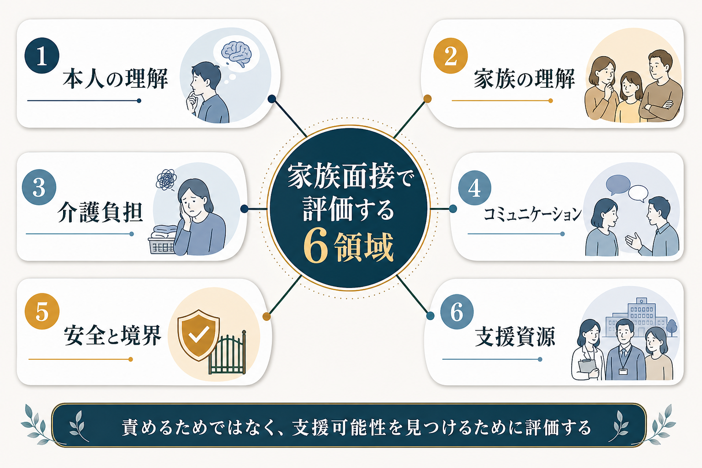
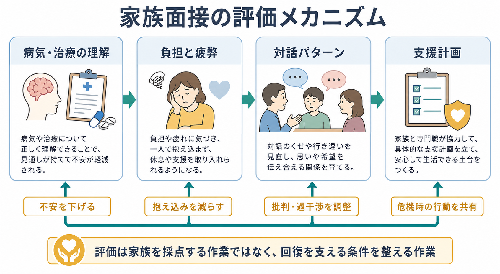
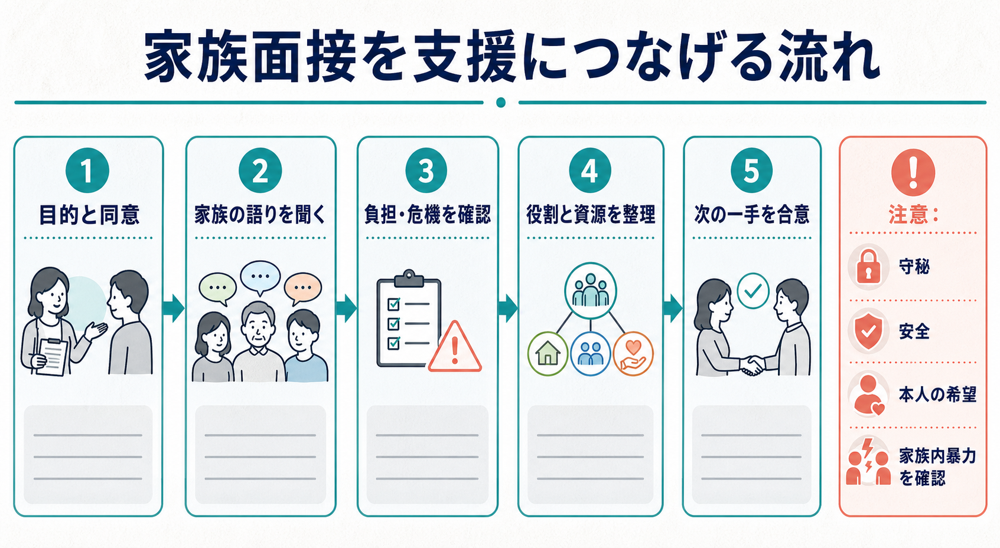

# 家族面接では何を評価するべきか

## 要点

- 家族面接は、家族を「よい家族 / 悪い家族」と判定する場ではない。本人の困りごとを支える環境、家族側の困りごと、危機時の動き方を整理するための面接である。
- 評価の中心は、本人と家族の病気理解、介護負担、コミュニケーション、役割分担、安全、支援資源である。
- 家族からの情報は診断やリスク評価の補助になるが、守秘、本人の同意、安全、家族内暴力や支配の可能性を同時に確認する必要がある。
- 統合失調症や双極症では、家族心理教育や家族介入が再発予防、服薬継続、家族負担の軽減と関連することが示されている。ただし、介入効果は疾患、時期、家族状況、支援体制によって異なる。
- 家族面接のゴールは、家族に責任を負わせることではなく、本人と家族が利用できる支援条件を増やすことである。

## この記事で答える問い

1. 家族面接では、何をどの順番で評価すればよいのか。
2. 家族の理解、負担、コミュニケーション、支援資源は、臨床判断にどうつながるのか。
3. 家族から情報を得るとき、守秘や本人の意思をどう扱うべきか。
4. 家族介入・家族心理教育の研究知見は、面接の評価項目にどう反映できるのか。

## まず結論

家族面接で評価するべきなのは、家族の性格や善悪ではなく、**本人の症状と生活をめぐる相互作用**である。具体的には、本人が何に困っているか、家族はそれをどう理解しているか、日常のケアや見守りを誰が担っているか、家族がどの程度疲弊しているか、家庭内でどのような会話や衝突が起きているか、危機時に誰が何をするか、外部支援をどれだけ使えるかを見る。

これは[[精神科面接とは何か|精神科面接]]の一部であり、本人面接の代替ではない。家族面接は、本人の語り、観察、精神状態診察、生活史、リスク評価を補う情報源である。APAの成人精神科評価ガイドラインは、精神科評価で症状、治療歴、物質使用、リスク、文化的要因、身体健康、生活機能、本人参加を含む広い情報を扱うことを重視している[1]。家族面接は、この広い評価を生活場面に接続する作業である。

## 背景

精神疾患や心理的危機は、本人の内側だけで完結しない。睡眠、服薬、通院、仕事や学校、金銭、対人関係、家庭内の役割、危機時の対応は、家族や同居者の行動と結びつく。したがって、家族が本人をどう理解し、どのように支え、どこで限界を感じているかを聞くことは、診断名を決めるためだけでなく、治療継続と安全確保のために重要である。

一方で、家族面接にはリスクもある。本人が望まない情報共有、家族による支配、虐待、DV、過度な監視、本人の発言を家族が遮る状況では、家族を同席させることが本人の安全や自己決定を損なうことがある。家族を巻き込むことは常に善ではない。家族面接の前提は、同席の目的、守秘の範囲、本人の同意、個別面接の必要性を確認することである[8]。

## 基本概念

### 1. 家族の理解

最初に確認するのは、家族が本人の状態をどのような言葉で理解しているかである。たとえば「怠けている」「甘えている」「病気だから何もできない」「薬だけ飲めばよい」「家族が全部見張るべきだ」といった説明は、支援行動を大きく左右する。

評価では、次の点を見る。

| 領域 | 確認する問い | 臨床上の意味 |
|---|---|---|
| 症状理解 | どの変化を病気やストレスのサインとして見ているか | 再燃サインの共有、誤解の修正 |
| 治療理解 | 薬、心理療法、休養、環境調整をどう理解しているか | 治療継続、過期待・過小評価の調整 |
| 原因理解 | 本人、家族、職場、学校、身体疾患などをどう結びつけているか | 責任追及を避けた[[生物心理社会モデルとは何か|生物心理社会的理解]] |
| 回復理解 | 何をもって「よくなった」と考えるか | 目標設定、再発予防、生活機能の評価 |

家族の理解が不十分であることは、家族の責任ではなく、情報提供の不足、疾患の複雑さ、過去の医療体験、文化的説明モデル、疲弊の結果であることが多い。したがって、面接者は訂正だけでなく、家族がなぜその理解に至ったかを聞く必要がある。

### 2. 介護負担と疲弊

家族面接で見落とされやすいのが、家族自身の負担である。通院同行、服薬確認、金銭管理、家事、夜間対応、危機時の見守り、学校や職場との連絡、他の家族への説明は、長期化すると家族の睡眠、仕事、健康、対人関係を損なう。

WHOは、精神病性障害や双極症に対して、本人と家族・介護者への心理教育や家族介入を治療・支援の一部として位置づけている[5]。これは、家族が「治療チームの無償労働力」になるべきだという意味ではない。家族が支援を続けるには、家族自身も支援される必要がある。

評価では、家族の負担を次のように分けると整理しやすい。

- **実務負担**: 通院、家事、金銭、服薬、連絡、見守り。
- **情緒負担**: 不安、怒り、罪悪感、悲しみ、将来不安。
- **社会的負担**: 仕事や学業への影響、孤立、親族・近隣への説明。
- **身体負担**: 睡眠不足、慢性疲労、持病の悪化。
- **危機対応負担**: 自傷他害、暴力、失踪、急性増悪、救急受診への対応。

統合失調症の家族介護者を対象にした心理教育の系統的レビューでは、家族負担を軽減しうる可能性が検討されているが、研究数や方法には限界がある[6]。臨床では、研究効果の有無だけでなく、「この家族が今どこまで担えるか」を具体的に評価する必要がある。

### 3. コミュニケーション

家族面接では、家庭内で何が話され、何が話されないかを見る。本人の症状があると、家族は心配から助言、説得、確認、叱責を増やすことがある。本人はそれを監視や批判として受け取り、回避、沈黙、怒り、嘘、服薬中断につながることがある。

ここで重要なのが、**感情表出**という研究概念である。感情表出は、家族が本人について語るときの批判、敵意、情緒的巻き込まれを評価する概念で、統合失調症の再発予測と関連することがメタ分析で示されてきた[3]。ただし、これは「家族が悪いから再発する」という単純な因果ではない。本人の症状、家族の不安、支援不足、過去の危機体験が相互に影響し、結果として批判や過干渉が増える場合がある。

面接では、次のように具体化する。

- 本人が調子を崩したとき、家族は最初に何を言うか。
- 家族が心配を伝えると、本人はどう反応するか。
- 服薬、睡眠、外出、金銭、スマートフォン、家事をめぐる衝突はあるか。
- 家族の中で、誰が本人に近く、誰が距離を取っているか。
- 批判、沈黙、過剰な確認、脅し、取引、隠しごとはどの程度あるか。
- 話し合いができる時間帯、場所、相手はあるか。

この評価は、[[要約は面接でなぜ重要なのか|要約]]や[[ラポールはどのように形成されるのか|ラポール]]とも関係する。面接者が家族の発言を整理して返すことで、家族の不安と本人の困りごとを同じ場で見える形にできる。

### 4. 役割、境界、安全

家族面接では、誰が何を担っているかを明確にする。精神科臨床では、家族が多くの役割を引き受けているのに、その役割が明文化されていないことが多い。たとえば、母親だけが通院・服薬・金銭・夜間対応を担い、他の家族は「本人を刺激しないように」距離を取っている場合がある。

役割評価では、次の点を確認する。

| 評価項目 | 具体例 |
|---|---|
| 主な支援者 | 同居家族、別居家族、友人、支援員、職場・学校 |
| 家族内の役割 | 通院同行、服薬確認、生活リズム、金銭管理、緊急連絡 |
| 境界 | 本人の私物、スマートフォン、金銭、外出、診療情報へのアクセス |
| 安全 | 自傷他害、暴力、虐待、DV、セルフネグレクト、子どもや高齢者への影響 |
| 限界 | 家族が担えないこと、担うと危険なこと、外部化すべきこと |

重要なのは、家族の協力を求める前に「協力しても安全か」を見ることである。家族内暴力、支配、性的虐待、経済的搾取、ストーキング的監視が疑われる場合、家族同席面接は慎重に扱う。本人と家族を別々に面接し、守秘と安全を優先する必要がある。

### 5. 支援資源

家族面接では、家庭内の資源だけでなく、家庭外の資源を確認する。家族が疲弊する背景には、支援資源の不足がある。利用できる資源には、医療機関、訪問看護、相談支援、地域包括支援センター、障害福祉サービス、学校、職場、ピアサポート、家族会、行政窓口、経済支援、法律相談などがある。

NICEは、精神病や統合失調症の治療で本人の家族・介護者への支援を重視し、家族介入には支持的・教育的機能、問題解決、危機管理を含めることを示している[2]。したがって、支援資源の評価では、本人の医療資源だけでなく、家族が相談できる窓口、家族会、レスパイト、福祉・行政サービスも確認する。

## 仕組み

家族面接の評価は、次の循環として理解できる。

1. **情報を補う**  
   本人が語りにくい経過、睡眠、生活機能、服薬、危機時の行動を、家族の観察から補う。

2. **理解のずれを見つける**  
   本人の困りごとと家族の解釈がずれていると、助言や見守りが逆効果になることがある。

3. **負担と限界を見える化する**  
   家族の疲弊を評価しないまま支援役を期待すると、支援が続かず、批判や衝突が増えやすい。

4. **対話パターンを調整する**  
   批判、敵意、過干渉、沈黙、過保護、回避の循環を、具体的な会話と役割分担に落とし込む。

5. **支援資源へ接続する**  
   家族だけで抱え込まないよう、医療、福祉、学校、職場、地域資源を組み合わせる。

この仕組みは、家族心理教育や家族介入の研究と接続する。Cochraneレビューでは、統合失調症に対する家族介入が再発や入院を減らし、服薬継続を改善する可能性が示された一方、研究の方法論的限界も指摘されている[4]。双極症でも、家族焦点化療法は心理教育、コミュニケーション訓練、問題解決訓練を含み、薬物療法への補助として再発や症状経過に有益な可能性が報告されている[7]。

## 図解

| 図 | 何を示すか | 面接での使い方 |
|---|---|---|
| 図1 | 家族面接で評価する6領域 | 初回面接のチェックリストとして使う |
| 図2 | 理解、負担、対話、支援計画の循環 | 家族介入がなぜ必要かを説明する |
| 図3 | 家族面接を支援につなげる流れ | 同意、安全、役割分担、次の一手を確認する |

## 臨床・研究との接続

臨床では、家族面接は次の判断に使われる。

- 診断仮説の補助: 発症時期、症状の波、機能低下、物質使用、睡眠、躁状態、精神病症状などを家族の観察で補う。
- 安全評価: 自傷他害、暴力、虐待、ネグレクト、服薬中断、急性増悪時の行動を確認する。
- 治療計画: 家族がどこまで支援できるか、どこから外部支援が必要かを決める。
- 心理教育: 症状、再発サイン、薬物療法、睡眠、ストレス、危機対応について共有する。
- 危機計画: 誰が連絡し、どの医療機関や相談先を使い、本人の希望をどう扱うかを決める。

研究では、家族面接は家族介入、感情表出、介護者負担、共同意思決定、守秘と情報共有、医療コミュニケーションの研究に接続する。特に、感情表出の研究は再発予測と家族環境の関係を示したが、現在の臨床では、それを家族責任論ではなく、家族の不安と支援不足を含む相互作用として読むことが重要である[3]。

## よくある誤解

### 誤解1: 家族面接は、家族から本人の「本当の情報」を聞く場である

家族の情報は重要だが、常に中立で正確とは限らない。家族にも不安、怒り、疲労、期待、過去の傷つきがある。本人の語りと家族の語りが違うときは、どちらかを即座に正解とせず、視点の違いとして整理する。

### 誤解2: 家族が協力的なら、本人の同意は省略できる

家族が善意であっても、本人の診療情報は慎重に扱う。本人の同意、共有する情報の範囲、守秘の限界を説明する必要がある。一般的な病気の説明や家族自身への支援情報は共有できる場合があるが、本人固有の情報共有には文脈判断が必要である[8]。

### 誤解3: 家族の批判が強いなら、家族が原因である

批判や過干渉は、家族の性格だけで説明できない。繰り返す危機、睡眠不足、孤立、支援不足、本人の症状、経済的困難が重なると、家族の言葉は硬くなりやすい。評価の目的は、原因者を決めることではなく、悪循環を弱めることである。

### 誤解4: 家族面接では、全員を同席させるほどよい

全員同席が有効な場合もあるが、常に安全とは限らない。本人が話せなくなる相手、暴力や支配のある相手、情報を悪用する可能性のある相手がいる場合、個別面接や段階的な情報共有が必要である。

## 関連ノート

- [[精神科面接とは何か]]
- [[主訴はどのように聞くべきか]]
- [[要約は面接でなぜ重要なのか]]
- [[ラポールはどのように形成されるのか]]
- [[生物心理社会モデルとは何か]]
- [[精神科診断は何のためにあるのか]]
- [[家族システムとは何か]]

## MOC更新候補

- `content/00_MOC/MOC｜精神医学.md` があれば、「精神科面接」「家族支援」「心理教育」の項目に追加する候補。
- `content/00_MOC/MOC｜臨床実践・治療.md` があれば、「面接技法」「家族介入」「支援資源調整」の項目に追加する候補。

## 理解チェック

1. 家族面接で「家族の理解」を評価するとき、どのような説明モデルを確認する必要があるか。
2. 家族の介護負担を、実務負担、情緒負担、社会的負担、身体負担に分ける利点は何か。
3. 感情表出を、家族責任論としてではなく相互作用として理解する必要があるのはなぜか。
4. 家族同席面接を行う前に、守秘と安全について何を確認するべきか。
5. 家族だけで抱え込ませないために、どのような外部支援資源を確認できるか。

## 未解決問題

- 家族介入の効果は、疾患、重症度、文化、家族構成、医療制度、地域資源によってどの程度変わるのか。
- オンライン診療や遠隔家族面接では、守秘、安全、発言機会の均衡をどう担保するべきか。
- 家族が支援資源であると同時にストレス源でもある場合、本人の自己決定と家族支援をどう両立するか。
- 介護者負担を短時間の精神科面接で評価するための、実用的で文化的に妥当な尺度や質問法は何か。

## 参考文献

[1] American Psychiatric Association. (2016). *The American Psychiatric Association Practice Guidelines for the Psychiatric Evaluation of Adults, Third Edition*. American Psychiatric Publishing. https://doi.org/10.1176/appi.books.9780890426760

[2] National Institute for Health and Care Excellence. (2014). *Psychosis and schizophrenia in adults: prevention and management* (Clinical guideline CG178). https://www.nice.org.uk/guidance/cg178

[3] Butzlaff, R. L., & Hooley, J. M. (1998). Expressed emotion and psychiatric relapse: A meta-analysis. *Archives of General Psychiatry, 55*(6), 547-552. https://doi.org/10.1001/archpsyc.55.6.547

[4] Pharoah, F., Mari, J. J., Rathbone, J., & Wong, W. (2010). Family intervention for schizophrenia. *Cochrane Database of Systematic Reviews*, 2010(12), CD000088. https://doi.org/10.1002/14651858.CD000088.pub3

[5] World Health Organization. (2023). *Psychoeducation, family interventions and cognitive-behavioural therapy*. mhGAP Evidence Centre. https://www.who.int/teams/mental-health-and-substance-use/treatment-care/mental-health-gap-action-programme/evidence-centre/psychosis-and-bipolar-disorders/psychoeducation-family-interventions-and-cognitive-behavioural-therapy

[6] Okafor, A. J., & Monahan, M. (2023). Effectiveness of psychoeducation on burden among family caregivers of adults with schizophrenia: A systematic review and meta-analysis. *Nursing Research and Practice, 2023*, 2167096. https://doi.org/10.1155/2023/2167096

[7] Miklowitz, D. J., & Chung, B. (2016). Family-focused therapy for bipolar disorder: Reflections on 30 years of research. *Family Process, 55*(3), 483-499. https://doi.org/10.1111/famp.12237

[8] Hansson, K. M., Romøren, M., Weimand, B., Heiervang, K. S., Hestmark, L., Landeweer, E. G. M., & Pedersen, R. (2022). The duty of confidentiality during family involvement: Ethical challenges and possible solutions in the treatment of persons with psychotic disorders. *BMC Psychiatry, 22*, 812. https://doi.org/10.1186/s12888-022-04461-6
