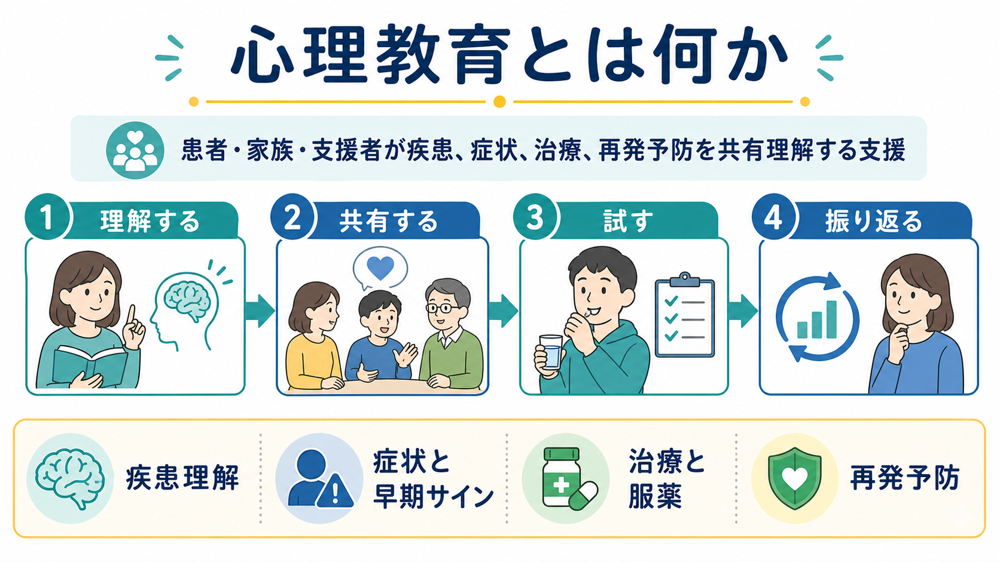
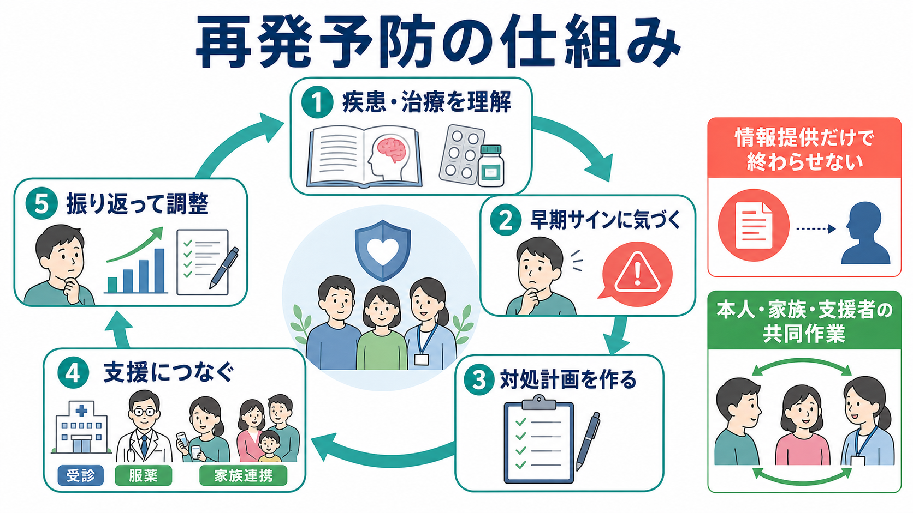
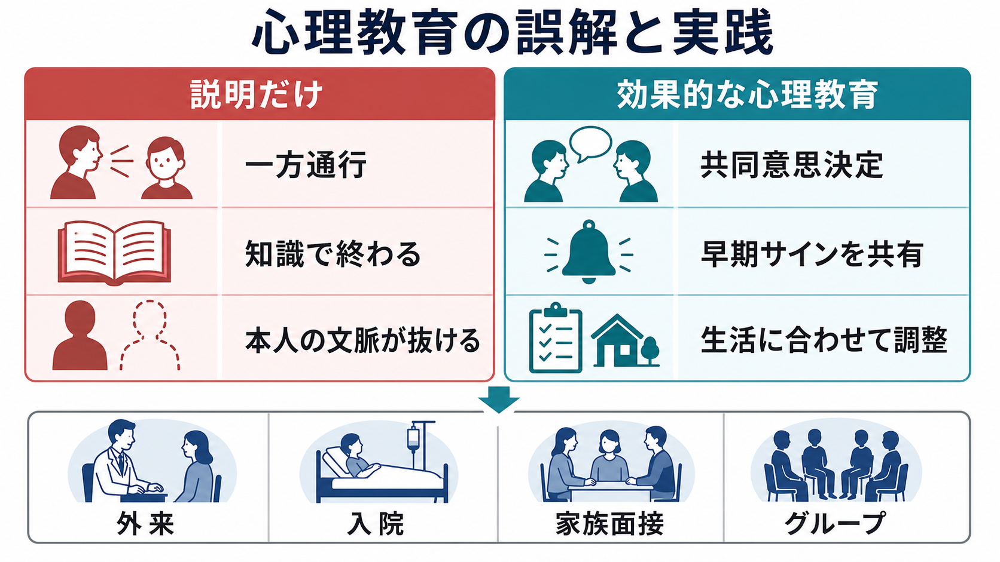

# 心理教育とは何か

## 要点

- 心理教育は、病名や薬の説明を一方的に伝えるだけではなく、疾患・症状・治療・再発予防を本人と家族が理解し、生活上の判断に使えるようにする支援である。
- 有効な心理教育では、知識提供、本人の体験の整理、早期サインの共有、対処計画、支援者との連携が一つの流れになる。
- 統合失調症や双極性障害では、心理教育や家族心理教育が再発・再入院・服薬不遵守の低減に関連することが、系統的レビューやガイドラインで示されている[1][2][3][4]。
- ただし、心理教育は個別の診断や治療指示の代替ではない。本人の価値観、認知機能、病識、家族関係、文化的背景に合わせて調整する必要がある。

## この記事で答える問い

1. 心理教育は、単なる「病気の説明」と何が違うのか。
2. なぜ疾患・症状・治療・再発予防の理解が臨床的に重要なのか。
3. 患者本人と家族に対する心理教育では、何をどの順序で扱うとよいのか。
4. どのような誤解や限界に注意すべきか。

## まず結論

心理教育とは、[[精神疾患とは何か]]をめぐる情報を、本人の経験と結びつけて「使える知識」に変える臨床的支援である。説明の対象は、診断名、症状、薬物療法、心理社会的治療、生活リズム、ストレス、家族の関わり、再発の早期サイン、危機時の相談先などに及ぶ。

重要なのは、心理教育が「知識を増やせばよい」という教育モデルだけで成り立つわけではない点である。精神症状はしばしば不安、恥、スティグマ、否認、認知機能の低下、家族の混乱を伴う。そのため、心理教育は[[治療関係とは何か]]や[[支持的面接とは何か]]に支えられた共同作業として行われる。

## 背景

精神科臨床では、症状が改善しても、本人や家族が「何が起きたのか」「再発の兆候は何か」「治療を続ける理由は何か」を理解できないまま退院・通院に移ることがある。この状態では、服薬中断、睡眠リズムの崩れ、ストレス過多、孤立、家族内の批判や過干渉が再発リスクとして残りやすい。

WHO の mhGAP ガイドラインは、精神病性障害や双極性障害の維持期において、心理教育、家族心理教育、家族介入などの心理社会的介入を薬物療法と組み合わせて提供することを推奨している[1]。NICE も、精神病・統合失調症に対する家族介入を、教育的機能だけでなく、問題解決や危機管理を含む支援として定義している[6]。

## 基本概念

心理教育は、次の三つを橋渡しする。

| 領域 | 目的 | 例 |
|---|---|---|
| 疾患理解 | 何が起きやすい状態なのかを理解する | 症状、経過、ストレスとの関係、再発しやすい時期 |
| 治療理解 | 治療を続ける理由と選択肢を理解する | 薬物療法、心理療法、リハビリテーション、睡眠・生活リズム |
| 自己管理・共同管理 | 生活の中で早めに気づき、支援につなぐ | 早期サイン、対処リスト、受診目安、家族との共有 |

ここでいう「教育」は、学校型の講義に限られない。個別面接、家族面接、グループプログラム、退院前面談、訪問支援、デジタル教材など、形式は多様である。臨床的には、本人の語りを尊重しながら、医学的説明と本人の実感を行き来する姿勢が重要になる。これは[[共感的理解とは何か]]や[[精神科面接とは何か]]とも深くつながる。

## 仕組み

心理教育が再発予防に寄与する経路は、単一ではない。少なくとも次の経路が重なる。

1. **理解の改善**  
   病気や治療に関する誤解が減ると、症状の意味づけが変わり、治療への参加がしやすくなる。

2. **早期サインの発見**  
   睡眠低下、活動量の増加、被害的解釈、引きこもり、服薬忘れなど、本人固有の前兆を具体化することで、早めの相談や調整につながる。

3. **服薬・治療継続の支援**  
   Cochrane レビューでは、統合失調症への心理教育が再発・再入院・服薬不遵守の低下と関連する可能性が示された[2]。双極性障害の系統的レビューでも、心理教育は再発予防、とくに躁・軽躁再発の予防と服薬アドヒアランス改善に関連した[4]。

4. **家族の負担と相互作用の調整**  
   家族心理教育は、症状理解、対応方針、問題解決、危機管理を共有し、家族内の批判・敵意・過干渉が強まる悪循環を弱めることを目指す。統合失調症の家族介入に関するメタ分析では、家族介入が再発や服薬不遵守の低下と関連した[5]。

5. **自己効力感と共同意思決定**  
   本人が「何を観察し、いつ誰に相談するか」を持てると、治療が受け身のものから共同作業へ変わる。これは[[精神医学における回復とは何か]]の観点からも重要である。

## 図解

心理教育は、次のような循環として捉えると実践しやすい。

| 段階 | 支援者が行うこと | 本人・家族と確認すること |
|---|---|---|
| 情報を整える | 診断、症状、治療、予後を平易に説明する | どこまで理解できたか、何が不安か |
| 経験と結びつける | 本人のエピソードに医学的説明を対応させる | 自分の場合の症状や前兆は何か |
| 対処に変える | 早期サイン、対処、相談先を具体化する | どの行動なら実行できるか |
| 振り返る | 実行できた点と難しかった点を再調整する | 次回まで何を試すか |

## 臨床・研究との接続

### 統合失調症・精神病性障害

統合失調症では、本人向け心理教育、家族心理教育、より広い家族介入が再発予防の主要な心理社会的介入として研究されてきた。Cochrane レビューでは、標準治療に心理教育を加えることで再発、再入院、服薬不遵守が低下する可能性が報告された[2]。また、2022年のネットワークメタ分析では、家族心理教育を含む多くの家族介入モデルが、12か月時点の再発低下と関連した[5]。

臨床では、[[ストレス脆弱性モデルとは何か]]や[[素因ストレスモデルとは何か]]を用いると、症状を「本人の弱さ」ではなく、脆弱性、ストレス、睡眠、薬物療法、家族・社会環境の相互作用として説明しやすい。

### 双極性障害

双極性障害では、心理教育が気分エピソードの再発予防、とくに躁・軽躁エピソードの予防に関係することが示されている[4]。代表的なグループ心理教育のランダム化試験では、寛解期の双極性障害患者に対する構造化心理教育が再発予防に有効であることが報告された[7]。

扱う内容としては、睡眠・生活リズム、気分変動の記録、軽躁の初期サイン、抗うつ薬や気分安定薬に関する理解、家族が気づきやすい変化、危機時の受診計画が重要になる。

### 家族・ケアラー支援

心理教育は本人だけでなく家族にも意味がある。WHO は、精神病や双極性障害のケアラーに対して、問題解決や認知行動的アプローチを含む心理教育、自助、相互支援を考慮することを推奨している[8]。家族が症状を「怠け」「性格」「わざと」と誤解しにくくなることは、本人への接し方を変えるだけでなく、家族自身の消耗を減らすうえでも重要である。

## よくある誤解

### 誤解1: 心理教育は病名を伝えることだけである

病名の説明は一部にすぎない。実践上は、症状の出方、治療の意味、副作用への対応、再発サイン、生活調整、相談先、家族の関わりまで扱う。

### 誤解2: 正しい知識を伝えれば行動は自然に変わる

知識だけで行動が変わるとは限らない。服薬を続けにくい理由には、副作用、病識の揺らぎ、経済的負担、スティグマ、家族関係、生活リズム、認知機能の問題がある。心理教育は、こうした障壁を一緒に見つけて調整する作業である。

### 誤解3: 家族に説明すれば家族は支援者として機能する

家族もまた不安、怒り、疲労、罪悪感を抱える。家族心理教育では、家族を「治療の道具」として扱うのではなく、家族自身の理解と負担軽減も支援対象にする必要がある。

### 誤解4: 心理教育は急性期にも同じ形で行える

急性期には注意、記憶、現実検討、睡眠が大きく揺らぐことがある。長い説明よりも、安全確保、安心できる見通し、短い情報、繰り返し、家族との共有が優先される。詳細な再発予防計画は、状態が落ち着いた時期に再確認するほうが実用的である。

## 関連ノート

既存ノートとしては、次の項目と接続しやすい。

- [[精神疾患とは何か]]
- [[精神科面接とは何か]]
- [[治療関係とは何か]]
- [[支持的面接とは何か]]
- [[生物心理社会モデルとは何か]]
- [[ストレス脆弱性モデルとは何か]]
- [[素因ストレスモデルとは何か]]
- [[精神医学における回復とは何か]]

今後の作成候補:

- 家族心理教育とは何か
- 服薬アドヒアランスとは何か
- 再発予防計画とは何か
- 早期警告サインとは何か
- 共同意思決定とは何か

MOC更新候補:

- `content/00_MOC/` 配下の精神医学・精神科面接・心理社会的介入に関する MOC
- `content/03_精神医学/` の総論、面接、治療関係、再発予防に関する索引

## 理解チェック

1. 心理教育が「説明だけ」では不十分なのはなぜか。
2. 本人にとっての早期サインを三つ挙げるなら、どのような情報を確認する必要があるか。
3. 家族心理教育で、家族を責めずに支援へ巻き込むには何に注意すべきか。
4. 急性期と寛解期では、心理教育の内容や量をどのように変えるべきか。

## 未解決問題

- 心理教育のどの成分が最も効果に寄与するのかは、疾患、病期、形式によって異なり、まだ十分に分離されていない。
- 個別、家族、グループ、オンラインのどの形式がどの患者に合うかは、アクセス、認知機能、文化、家族構成、支援資源によって変わる。
- 心理教育の効果を、知識量だけでなく、再発予防行動、生活機能、本人の主体性、家族負担の変化としてどう測定するかが課題である。

## 参考文献

[1] World Health Organization. (2023). *Mental Health Gap Action Programme (mhGAP) guideline for mental, neurological and substance use disorders, third edition*. https://www.who.int/publications/i/item/9789240084278

[2] Xia, J., Merinder, L. B., & Belgamwar, M. R. (2011). Psychoeducation for schizophrenia. *Cochrane Database of Systematic Reviews*, CD002831. https://doi.org/10.1002/14651858.CD002831.pub2

[3] Bighelli, I., Rodolico, A., García-Mieres, H., et al. (2021). Psychosocial and psychological interventions for relapse prevention in schizophrenia: a systematic review and network meta-analysis. *The Lancet Psychiatry, 8*(11), 969-980. https://doi.org/10.1016/S2215-0366(21)00243-1

[4] Bond, K., & Anderson, I. M. (2015). Psychoeducation for relapse prevention in bipolar disorder: a systematic review of efficacy in randomized controlled trials. *Bipolar Disorders, 17*(4), 349-362. https://doi.org/10.1111/bdi.12287

[5] Rodolico, A., Bighelli, I., Avanzato, C., et al. (2022). Family interventions for relapse prevention in schizophrenia: a systematic review and network meta-analysis. *The Lancet Psychiatry, 9*(3), 211-221. https://doi.org/10.1016/S2215-0366(21)00437-5

[6] National Institute for Health and Care Excellence. (2015). *Psychosis and schizophrenia in adults: Quality statement 3: Family intervention*. https://www.nice.org.uk/guidance/qs80/chapter/Quality-statement-3-Family-intervention

[7] Colom, F., Vieta, E., Martínez-Arán, A., et al. (2003). A randomized trial on the efficacy of group psychoeducation in the prophylaxis of recurrences in bipolar patients whose disease is in remission. *Archives of General Psychiatry, 60*(4), 402-407. https://doi.org/10.1001/archpsyc.60.4.402

[8] World Health Organization. (2023). *Psychosocial interventions for carers of persons with psychosis or bipolar disorder*. https://www.who.int/teams/mental-health-and-substance-use/treatment-care/mental-health-gap-action-programme/evidence-centre/psychosis-and-bipolar-disorders/psychosocial-interventions-for-carers-of-persons-with-psychosis-or-bipolar-disorder
